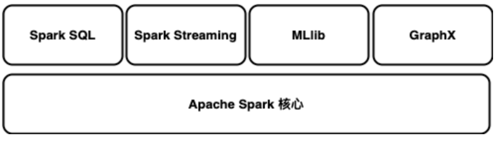
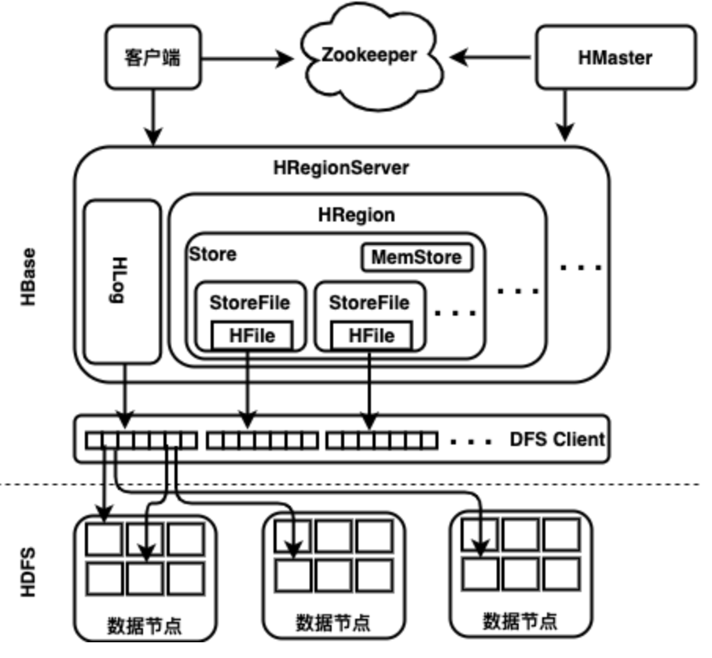
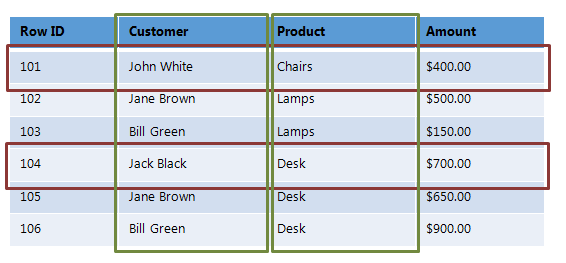

# Spark生态环境


## 本章先看懂什么
- Spark 在大数据体系里的位置：计算引擎，而不是存储系统。
- Spark 与 Hadoop 的关系：互补而不是互斥。
- 生态组件各自解决什么问题（SQL、流处理、机器学习、图计算）。

## 一个最小例子
需求：每天生成“昨日订单统计报表”。
1. 数据存 HDFS/S3。
2. 用 Spark SQL 做聚合统计。
3. 结果写回 Hive 表或对象存储。
4. BI 系统直接读取报表。

这个流程就是“生态协同”的典型路径。

> **版本基线（更新于 2026-02-13）**
> 本书默认适配 Apache Spark 4.1.1（稳定版），并兼容 4.0.2 维护分支。
> 推荐环境：JDK 17+（建议 JDK 21）、Scala 2.13、Python 3.10+。
Spark可以先理解为“大数据计算引擎”：它本身不负责长期存储海量数据，而是负责把分散在不同存储系统中的数据高效计算出来。你可以把它想象成一台“分布式数据加工机”：
- 数据放在 HDFS、S3、HBase 等存储里。
- Spark 负责读取、计算、聚合、输出结果。
- 集群管理器（Standalone、YARN、Kubernetes）负责调度资源。

很多初学者一开始会把 Spark 和 Hadoop 对立起来。更准确的理解是：两者常常是配合关系。
- Hadoop 更擅长“存”和“基础生态”。
- Spark 更擅长“算”，尤其是交互分析、迭代计算和近实时处理。

本章关注两个目标：
1. 建立 Spark 生态的整体认知，知道每个组件在做什么。
2. 能在本地/虚拟环境中把 Spark 开发环境跑起来。

Spark 常见生态模块可以先记住这四类：
- Spark SQL：结构化查询与报表分析。
- Structured Streaming：流式计算与实时指标。
- MLlib：机器学习训练与预测。
- GraphX：图计算（关系网络、路径分析）。

Spark 支持多语言开发（Scala、Java、Python、R）。本书示例以 Scala 为主，并在关键位置给出 Python/Java 对照。

## 平台设计

### 先用一个业务场景理解
假设你要做“电商运营日报”：
1. 原始订单数据每天写入 HDFS 或对象存储（S3）。
2. Spark SQL 按天/城市/品类做聚合。
3. 结果写入 Hive 表或 Parquet 文件。
4. BI 系统读取结果生成仪表盘。

这就是典型的 Spark 平台链路：存储层负责“放数据”，Spark 负责“算数据”，上层系统负责“用数据”。

### 为什么要大数据平台
当数据量、数据来源和更新速度都上来后，传统单机方案通常会遇到三类问题：
- 算不动：任务时间太长，无法按时出结果。
- 存不下：数据规模超出单机容量。
- 管不稳：故障恢复、扩容、权限管理成本高。

大数据平台的核心价值是把这三件事标准化：
- 分布式存储：支持海量数据与容错。
- 分布式计算：并行处理，提高吞吐。
- 统一治理：监控、调度、权限、审计。

### Spark 与 Hadoop 的关系（通俗版）
可把它理解为“存算分层”：
- Hadoop 生态（例如 HDFS）更偏底层存储与基础设施。
- Spark 更偏上层统一计算框架。

在很多企业里，常见组合是：
- 底层存储：HDFS/S3
- 资源调度：YARN/Kubernetes
- 计算引擎：Spark

不是“只能二选一”，而是“按职责组合使用”。

### 设计一个可落地的平台要点
建设平台时，建议优先关注以下能力：
- 可靠性：节点故障后任务可恢复。
- 扩展性：数据增长时可横向扩容。
- 统一入口：批处理、流处理、SQL 分析尽量共用一套引擎与治理。
- 成本可控：按需使用资源，避免长期空转。

### 常见配套组件（知道用途即可）
- Kafka：实时消息采集与传输。
- Hive：数仓管理与 SQL 查询入口。
- HBase：需要低延迟随机读写时使用。
- Zookeeper：分布式协调服务。

学习阶段不需要一次掌握全部组件，建议先跑通“存储 + Spark 计算 + 结果输出”这条主链路。
## Spark简介

Apache Spark 是一个开源分布式计算引擎。你可以把它理解成“数据加工流水线的大脑”：
- 数据通常存放在 HDFS、S3、Hive、HBase 等系统中。
- Spark 负责读取数据、执行计算、输出结果。
- 集群管理器（Standalone、YARN、Kubernetes）负责分配 CPU 和内存。

和传统 MapReduce 相比，Spark 的优势在于执行模型更通用，很多场景下速度更快，尤其适合：
- 交互式分析（SQL 查询）
- 迭代计算（机器学习）
- 批流一体（Structured Streaming）

一个常见例子：
- 你每天要做“城市 GMV 排行榜”。
- 数据在对象存储中，Spark SQL 读取后聚合计算。
- 结果写入 Hive 表，BI 看板直接展示。

另外，Spark 提供多语言 API：Java、Scala、Python、R。工程团队常见组合是“Scala/Python + Spark SQL + DataFrame”。



图例 1‑2 Spark组件

### 技术特性

可以先抓住 4 个核心能力：

- 统一计算模型
Spark 同时支持批处理、SQL、流处理、机器学习、图计算，减少了多套引擎切换成本。

- 内存计算与 DAG 执行
Spark 通过 DAG（有向无环图）组织任务，尽量减少不必要的磁盘落盘与重复计算。

- 抽象层清晰
从低到高通常是 RDD -> DataFrame -> Dataset（Scala/Java）。在生产中，DataFrame/Spark SQL 使用最广。

- 生态集成能力强
可接入 Kafka、Hive、HBase、JDBC、对象存储等系统，便于构建端到端数据链路。

Spark 的主要组件如下：

- Spark SQL
用于结构化数据处理。支持 SQL 和 DataFrame API，是离线数仓和指标计算的主力模块。

- Structured Streaming
推荐的流处理模块。采用与批处理一致的 API，可实现“同一份逻辑同时跑批和流”。

- MLlib
分布式机器学习库，提供回归、分类、聚类、特征工程、模型评估等能力。

- GraphX
图计算模块，适用于关系网络分析、路径计算、社群发现等场景。

从集群角度看，Spark 的运行角色可以简化为：
- Driver：负责任务拆分、调度和结果汇总。
- Executor：负责真正执行任务和缓存数据。
- Cluster Manager：负责资源分配。


图例 1‑4 Spark分布式系统

实践建议：
- 学习阶段优先用 Local 或 Standalone 跑通流程。
- 企业环境优先考虑 YARN 或 Kubernetes 的统一资源治理能力。

### 数据格式

Spark 可以读取 Hadoop 生态和云存储中的多种数据源。先记住“常用优先”：

- 存储系统（放数据）
HDFS、S3、Hive、HBase、Cassandra、JDBC 数据库。

- 文件格式（怎么存）
Parquet、CSV、JSON、SequenceFile、Protocol Buffers、ObjectFile。

在实际项目里，优先级通常是：
- 数仓明细与中间层：Parquet（压缩率高、列式读取快）
- 对外交换或临时导出：CSV/JSON
- 历史兼容场景：SequenceFile 或其他旧格式

一个简单经验：
- 以分析为主，优先 Parquet。
- 以可读性和调试为主，临时用 JSON/CSV。
- 追求低延迟随机读写时，考虑 HBase/Cassandra 这类存储。

### 编程语言

Spark 支持 Java、Scala、Python、R。对于 Spark 4.1.1，建议环境：
- JDK 17+（推荐 21）
- Scala 2.13.x
- Python 3.10+
- R 4.x

怎么选语言可以按团队目标来：
- Scala：性能和类型安全更强，适合数据平台与核心任务开发。
- Python：上手快、生态丰富，适合数据分析与算法实验。

一个实用策略：
- 生产链路以 Spark SQL/DataFrame 为核心。
- 团队已有 Python 经验时，先用 PySpark 快速落地。
- 对性能和工程治理要求高时，再补充 Scala 核心作业。

下面这张表可作为快速参考：

| 影响因素 | Scala | Python |
| ---- | ---- | ---- |
| 性能 | 通常更高 | 通常较低 |
| 语法与学习 | 学习曲线更陡 | 更容易上手 |
| 类型系统 | 静态类型，编译期发现问题 | 动态类型，开发灵活 |
| 并发与工程化 | 强，适合大型工程 | 依赖生态与框架补足 |
| 典型场景 | 核心数据平台、性能敏感任务 | 分析建模、快速验证 |

  - 注意
## 虚拟环境

学习 Spark 时，很多同学卡在“环境不一致”：
- 你的电脑能跑，同学的电脑跑不起来。
- 本地能跑，换到服务器就报依赖冲突。
- 升级一个包，旧项目突然不可用。

本教程使用 Docker 来统一实验环境，核心目标只有两个：
- 一次配置，到处复用。
- 降低“环境问题”对学习和开发的干扰。

可以把 Docker 容器理解成“轻量、可复制的运行盒子”：
- 镜像（Image）是模板。
- 容器（Container）是运行中的实例。
- 你把 Spark + JDK + 依赖打包进镜像后，任何机器拉起容器都能得到一致结果。

### 发展历史

Docker 在 2013 年开源后迅速普及，原因很务实：
- 比传统虚拟机更轻量，启动更快。
- 对 CI/CD 和环境标准化非常友好。
- 生态完善，镜像仓库和工具链成熟。

后来容器标准逐步统一，Kubernetes 成为主流编排平台，Docker 也从“单机容器工具”扩展到“云原生基础能力”的重要一环。

### 技术特征

和传统虚拟机相比，Docker 的优势主要体现在：

- 启动快
容器通常秒级启动，适合开发测试频繁迭代。

- 资源开销低
容器共享宿主机内核，不需要每个实例都带完整 Guest OS。

- 交付一致
开发、测试、生产尽量使用同一镜像，减少“只在我机器上能跑”的问题。

- 易于自动化
可配合 Dockerfile、CI 流水线实现自动构建、自动发布。

简单对比可记为：
- 虚拟机：隔离更强，但更重。
- 容器：更轻更快，适合应用交付和弹性扩缩。

### 技术架构

Docker 架构可以用 3 个角色理解：

- Client
你在命令行执行 docker build、docker run、docker ps 时，就是 Client 在发请求。

- Docker Daemon
真正执行镜像构建、容器启动、网络和卷管理的是后台守护进程。

- Registry
用于存储和分发镜像（例如 Docker Hub 或企业私有仓库）。

典型流程：
1. 开发者写 Dockerfile。
2. 使用 docker build 生成镜像。
3. 推送到镜像仓库。
4. 目标机器拉取镜像并运行容器。

在 Spark 学习场景里，你可以把“JDK + Spark + 示例代码”打成统一镜像，团队成员直接拉起即可进入同一实验环境。

### 管理命令

这里给出学习阶段最常用的一组 Docker 命令，够你完成 Spark 环境拉起、排错和重置。

- 生命周期
`docker run`、`docker start`、`docker stop`、`docker restart`、`docker rm`

- 镜像管理
`docker images`、`docker pull`、`docker build`、`docker rmi`

- 观察与排错
`docker ps`、`docker logs`、`docker exec -it <container> bash`、`docker inspect`

- 网络与端口
`docker port`、`docker run -p 宿主机端口:容器端口`

- 挂载目录
`docker run -v 宿主机目录:容器目录`


图例 1‑7 在各个阶段运行的 Docker 命令

建议按这个最小流程练习一遍：

```bash
docker pull leeivan/spark-lab-env:latest
docker run -it --name spark -p 4040:4040 -p 8080:8080 -p 8081:8081 leeivan/spark-lab-env:latest
docker ps
docker exec -it spark bash
```

如果容器异常退出，优先看日志：

```bash
docker logs spark
```

如果需要清理后重建：

```bash
docker stop spark
docker rm spark
```

## HBase技术

在本书后续示例里，HBase 主要承担“可随机读写的结构化存储”角色，Spark 负责批处理或流处理计算。

一个直观分工：
- HDFS：擅长大文件顺序读写与批处理。
- HBase：擅长按 RowKey 快速读写单行或小范围数据。

常见场景：
- 用户画像、设备状态、实时特征等需要低延迟查询的数据。
- Spark 计算结果回写 HBase，供在线服务读取。


图例 1‑8 HBase 读写访问

| HDFS | HBase |
| ---- | ---- |
| 适合大文件顺序访问 | 适合按键随机访问 |
| 偏离线批处理 | 偏在线低延迟读写 |
| 文件系统 | 分布式列式数据库 |

表格 1‑3 HBase 和 HDFS 的比较

### 系统架构

HBase 可以理解成“主从协作 + 分片存储”：
- HMaster：负责元数据管理与 Region 调度。
- HRegionServer：负责实际读写请求。
- ZooKeeper：负责协调与服务发现。
- HDFS：负责底层持久化存储。

表按 RowKey 范围切分成多个 Region，Region 分配到不同 RegionServer 上，实现横向扩展。



图例 1‑9 HBase 的系统架构

### 存储机制

HBase 的核心数据模型可以记为：
- 表（Table）
- 行键（RowKey）
- 列族（Column Family）
- 列（Qualifier）
- 单元格（Cell）
- 版本（Timestamp）

唯一定位一个值的形式：

```text
{row key, family:qualifier, timestamp}
```

读写路径简化理解：
- 写入：先写 WAL，再写 MemStore，达到阈值后刷盘为 HFile。
- 读取：先查缓存/MemStore，未命中再查 HFile。

这也是 HBase 兼顾可靠性与性能的关键机制。



图例 1‑10 面向列与面向行存储差异


图例 1‑11 HBase 列族

### 常用命令

下面给出最常用的一组 HBase Shell 命令，覆盖建表、写入、查询和清理。

1. 启动与进入

```bash
start-hbase.sh
hbase shell
```

2. 建表与查看

```hbase
create 'order', 'Customer', 'Sales'
list
describe 'order'
```

3. 写入与读取

```hbase
put 'order', '101', 'Customer:Name', 'John White'
put 'order', '101', 'Sales:Product', 'Chairs'
get 'order', '101'
scan 'order'
```

4. 维护操作

```hbase
disable 'order'
enable 'order'
count 'order'
truncate 'order'
drop 'order'
```

5. 退出与停止

```bash
exit
stop-hbase.sh
```

学习建议：先把 `create -> put -> get -> scan` 跑通，再练习 `disable/enable/truncate/drop`。

## 环境部署

本书实验环境建议使用现成镜像，先保证“能跑通”，再做定制。

1. 拉取镜像

```bash
docker pull leeivan/spark-lab-env:latest
```

2. 启动容器

```bash
docker run -it --name spark -h spark -p 4040:4040 -p 8080:8080 -p 8081:8081 leeivan/spark-lab-env:latest
```

3. 进入容器并拉取示例代码

```bash
docker exec -it spark /bin/bash
git clone https://github.com/leeivan/spark-app
```

4. 快速验证
- 访问 Spark UI：`http://localhost:4040`（作业运行时可见）
- 若端口冲突，先停止占用进程或改映射端口。

## 小结

本章目标是帮你建立 Spark 生态的“全局视图”，并把实验环境跑起来。你应当已经掌握：
- Spark 在生态中的职责：统一计算引擎。
- 与 Hadoop/HBase 的分工：存算分层、按需组合。
- Docker 的最小操作路径：拉镜像、起容器、进容器、看日志。

有了这一章的基础，后续章节就可以把重点放在 Spark SQL、特征工程和机器学习任务本身，而不是环境问题。