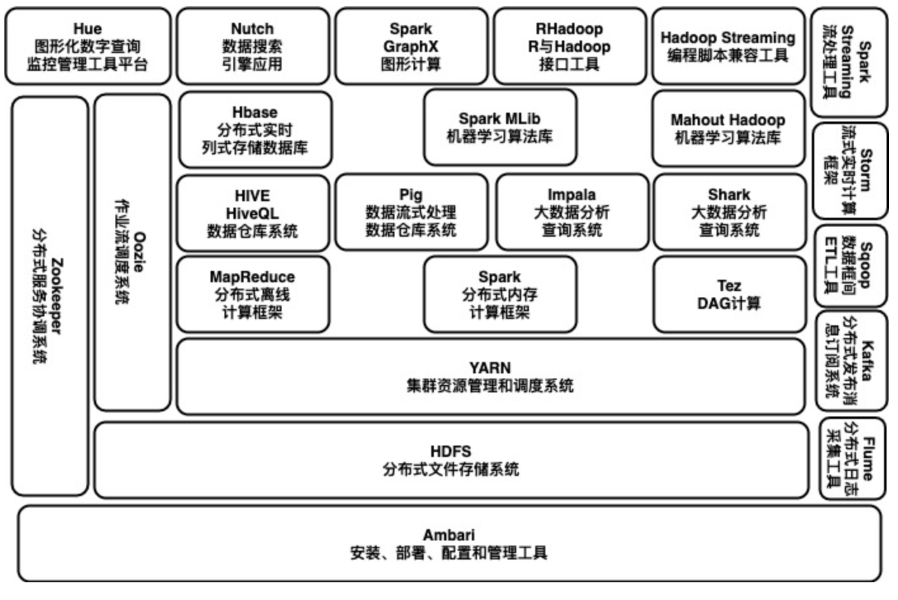
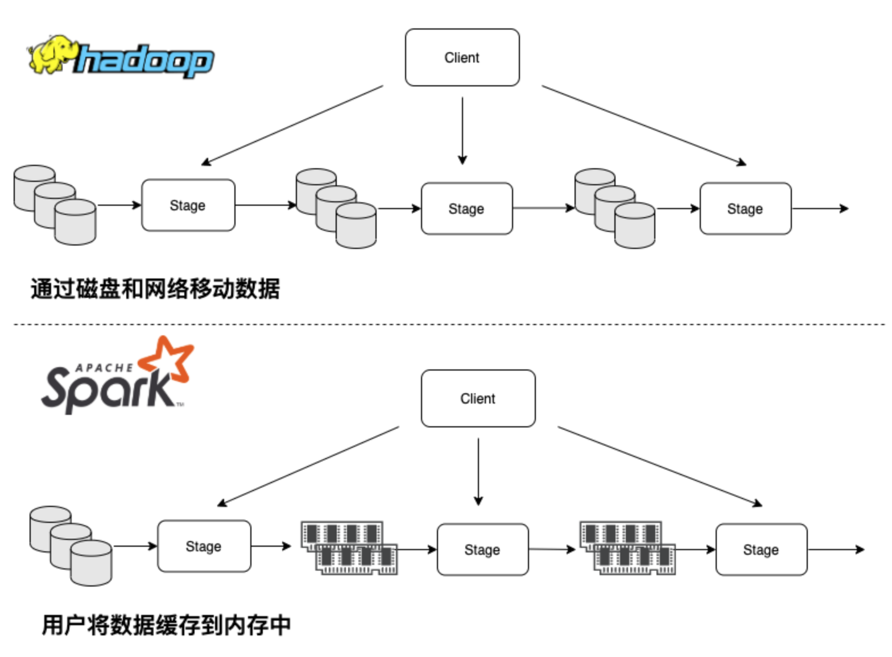
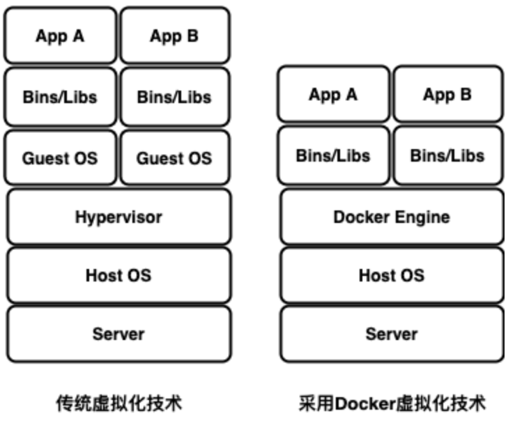
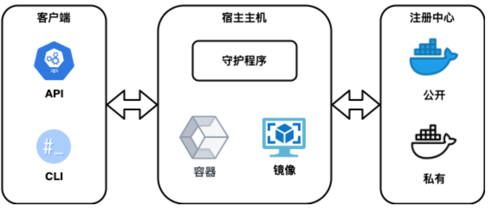

# Spark生态环境

Spark生态环境也称为伯克利数据分析栈，是伯克利大学APMLab实验室打造的产品，通过大规模的系统集成在算法、计算机和人之间建立展现大数据应用的一个平台。AMPLab实验室运用大数据、云计算、通信等各种资源以及各种灵活的技术方案，对海量而且多样的数据进行甄别并转化为有用的信息，以供人们更好的理解世界。目前，基于Spark生态环境的应用已经涉及到机器学习、数据挖掘、数据库、信息检索、自然语言处理和语音识别等多个领域。本章的主要内容是学习和理解Spark的生态环境，以及部署虚拟实验环境。

Spark生态环境以Spark Core为核心，从HDFS、Amazon
S3和HBase等持久层读取数据，以MESS、YARN和自身携带的Standalone为资源管理器，调度后台任务完成Spark应用程序的计算。这些应用程序可以来自于不同的组件，如基于Spark
Shell的行命令、基于Spark Submit的批处理，基于Spark Streaming的实时处理应用、Spark
SQL的即席查询、MLlib的机器学习、GraphX的图处理等等。

Spark支持多种编程语言，从Spark1.6开始包括Java、Scala、Python以及R。对于Spark每个功能的讲解，大部分使用Scala语言，并包括语法讲解，有些使用Java和Python语言用于对比和参考。本书使用Docker容器技术部署Spark实验学习环境，其中包括了Spark的当前版本为2.4.5，HBase版本为1.4.0，另外还有Maven和sbt等工具。

## 平台设计

随着云时代的到来，数据格式和规模正在以前所未有的速度增长。对海量数据增长的合理存储和管理有利于为应用于预测的行业分析提供支持，并有效应对大数据背景下的机遇和挑战，融合传统的数据挖掘方法和大数据方法，构建计算机技术创新管理平台，进行智能分析预测和评估预测。最终，企业将新技术应用于管理和决策的能力将得到提高。

在信息经济早期，企业只是作为资源来收集和存储数据，最多只需进行简单的统计分析，而数据的内在价值通常被忽略。随着存储和分析技术的进步，企业进一步挖掘和处理所收集的数据，并逐渐意识到主动掌握数据的重要性。开发数据潜在价值的能力成为企业的核心竞争力之一，数据的价值显示出其在智能科技时代的重要地位。大数据首次提出后在医学领域被成熟使用，当前被应用到多个业务开发领域，例如自然语言处理、图像和语音识别、汽车自动驾驶、风险预警等等。在数据大爆炸时代，业界提供和使用数据服务是目前这个时代的必然结果。要高效准确地使用数据，前提是数据的高效存储和管理，根据不同的应用需求采取适当的数据存储模型，以便更高效地、实时地处理和分析数据。通过大数据的技术，相关数据被收集、存储和管理，然后进行分析和处理以挖掘出可以提供给高层领导作决策判断的、具有潜在价值的信息。在大数据环境下，用户对存储服务以及数据的可用性、可靠性和持久性提出了更高的要求。为了防止数据丢失或损坏，保证数据的私密性，用户的存储系统环境至关重要。

传统数据存储技术在海量数据存储管理和安全中的应用存在滞后现象。目前，在行业数据不断发展的情况下，存在大量的非结构化数据和半结构化数据。对这些数据进行合理的处理和分析，挖掘有价值的信息，符合大数据政策决策和服务提供的要求，而构建数据模型是大数据分析和预测的前提和基础。当前，为了要构建大数据应用平台，数据工程师需要研究基于Hadoop数据平台的大数据存储体系结构，建立应用平台为行业分析、报表、预测和决策等功能提供数据服务，同时为大数据存储管理提供可行的技术解决方案。基于Hadoop的大数据平台可以有效地并行处理海量数据，用户可以在不了解分布式底层细节的情况下，开发分布式程序。充分利用集群的优势进行高速运算和存储。Hadoop实现了一个分布式文件系统，有高容错性的特点，并且被设计用来部署在低廉的硬件上；而且提供高吞吐量来访问应用程序的数据，适合那些有着超大数据集的应用程序。Hadoop的框架最核心的设计就是HDFS和MapReduce。HDFS为海量的数据提供了存储，而MapReduce则为海量的数据提供了计算。Spark同样是Apache软件基金会的顶级项目，可以理解为在Hadoop基础上的一种改进，是加州大学伯克利分校AMP实验室所开源的类似Hadoop
MapReduce的通用并行框架。相对比Hadoop，Spark可以说是青出于蓝而胜于蓝。Hadoop的MapReduce是面向磁盘的，因此受限于磁盘读写性能的约束。MapReduce在处理迭代计算、实时计算、交互式数据查询等方面并不高效，但是这些计算却在图计算、数据挖掘和机器学习等相关应用领域中非常常见。而Spark是面向内存的，使得Spark能够为多个不同数据源的数据提供近乎实时的处理性能，适用于需要多次操作特定数据集的应用场景。在相同的实验环境下处理相同的数据，若在内存中运行，那么Spark要比MapReduce快100倍。其它方面，例如处理迭代运算、计算数据分析类报表、排序等，Spark都比MapReduce快很多。此外，Spark在易用性、通用性等方面，也比Hadoop更强。

大数据平台的业务应用需求包括数据采集、数据收集、数据分析和数据应用，需要构建统一的数据应用平台，用于数据实时加载，存储和处理不同类型的数据。数据处理工具和服务被集成以管理异构数据。结构化和非结构化的数据仓库分析工具也被集成。该平台可以通过任何终端设备随时随地实现大数据共享和协同访问的集中；应用平台可以支持新业务开发和业务战略的建模，并推动行业洞察力的发展，进行实时预警分析。如何收集和存储大量数据，如何集成异构数据，如何挖掘和处理大型数据集，这些都是大数据平台需要关心的问题。数据收集、数据存储、数据处理、数据分析和数据应用将是智慧经济时代企业绩效的基本任务，基于数据的判断和决策将成为企业发展的技能和手段。

大数据平台的设计需要符合大数据管理，整合异构数据，定制用户需求为应用领域的行业发展提供专业的分析功能。大数据应用平台可以满足大数据量、多样式和快速流量数据的处理需求。它还具备实现海量数据采集、存储、处理和分析的能力，满足企业应用高可靠性，易扩展性，强容错性，高可用性，高安全性和高保密性的基本要求，现有技术与平台兼容，实现数据存储和处理。大数据应用平台符合两个标准体系，即系统安全标准体系和服务管理标准体系。基于Spark和Hadoop的大数据平台和数据仓库，其数据集成功能实现了大量的数据存储、分析、处理和使用，包括前端、核心层、管理层、数据层和应用层等。办公自动化、风险评估、数据采集、智能分析和实时处理相结合，打造数据集成管理平台。通过数据仓库和分析工具的集成，可以构造实时预测分析解决平台。基于Spark和Hadoop大数据平台架构，依托HDFS，MapReduce和MongoDB等分布式架构，部署在更便宜的硬件设备上，实现了高吞吐量数据应用访问机制。HDFS作为开源的分布式文件系统支持高容错的数据存储和管理，采用主从模式集群结构实现数据存储选项和命名空间，数据库存储和最佳策略选择。

在核心层，大数据平台和数据仓库集成平台之间实现连接，实现数据仓库和智能分析系统的智能预警和实时分析以及集成，使用分析工具进行可视化分析，形成电子化报告和分析报告，如图例
1‑1所示为大数据处理架构。Hadoop和Spark是两种不同的大数据处理框架，下面将两者整理在一幅图中，展示全貌。虽然他们是两种不同的大数据处理框架，但它们不是互斥的，Spark与Hadoop
中的MapReduce是一种相互共生的关系。Hadoop提供了Spark中许多没有的功能，比如分布式文件系统，而Spark
提供了实时内存计算，速度非常快。有一点大家要注意，Spark并不是一定要依附于Hadoop才能生存，除了Hadoop的HDFS，还可以基于其他的云平台，只是大家一致认为Spark与Hadoop配合默契最好。HDFS是跨平台存储数据，MapReduce、Tez和Spark可以在多台机器之间的互相通信交换数据以及完成复杂的计算。MapReduce是第一代计算引擎，Tez和Spark是第二代计算引擎。MapReduce的计算模型采用了Map和Reduce两个计算过程，但是这个模式随着数据量的增大出现了效率问题。第二代的Tez和Spark将MapReduce变成通用模型，让Map和Reduce之间的界限更模糊，数据交换更灵活，更少的磁盘读写，以便更方便地描述复杂算法，取得更高的吞吐量。在更高层，需要Pig和Hive实现更抽象的语言层来描述算法和数据处理流程。Pig是接近脚本方式去描述MapReduce；Hive则用的是SQL，把脚本和SQL语言翻译成MapReduce程序，输入到计算引擎去计算，而就从繁琐的MapReduce程序中解脱出来。Hive已成了大数据仓库的核心组件，维护简单，并且Hive可以与新一代通用计算引擎Tez、Spark和SparkSQL结合，可以实现运行效率的提高。目前数据仓库的构建思路就是采用：底层为HDFS，中间为MapReduce、Tez和Spark；上层为Hive和Pig，或者HDFS上直接跑Impala、Drill和Presto。这种数据仓库的设计解决了中低速数据处理的要求。对于更高速的流计算数据处理，Storm是最流行的流计算平台。流计算的要求是要达到更实时的更新，在数据流进来的时候就进行处理，可以做到基本无延迟。

HBase是运行在HDFS之上的一种数据库，以键值对的形式存储数据，能够快速在主机内数十亿行数据中定位所需的数据并访问，而HDFS缺乏随即读写操作，不能满足实时需求。HBase
底层依旧依赖 HDFS 来作为其物理存储，这点类似于 Hive。但是，Hive
适合用来对一段时间内的数据进行分析查询，例如用来计算趋势或者网站的日志。Hive
不应该用来进行实时的查询，其设计目的也不是支持实时的查询，因为它需要很长时间才可以返回结果。HBase
则非常适合用来进行大数据的实时查询，可以对消息进行实时的分析。对于
Hive 和 HBase 的部署来说，也有一些区别，Hive 一般只要有 Hadoop 便可以工作，而 HBase 则还需要 Zookeeper
的帮助。另外大数据处理系统还可以包括很多组件：

  - Mahout（数据挖掘算法库）

Mahout的主要目标是创建一些可扩展的机器学习领域经典算法的实现，旨在帮助开发人员更加方便快捷地创建智能应用程序。Mahout现在已经包含了聚类、分类、推荐引擎（协同过滤）和频繁集挖掘等广泛使用的数据挖掘方法。除了算法，Mahout还包含数据的输入和输出工具、与其他存储系统（如数据库、MongoDB
或Cassandra）集成等数据挖掘支持架构。

  - Sqoop(数据ETL/同步工具)

Sqoop是SQL-to-Hadoop的缩写，主要用于传统数据库和Hadoop之前传输数据。数据的导入和导出本质上是Mapreduce程序，充分利用了并行化和容错性。Sqoop利用数据库技术描述数据架构，用于在关系数据库、数据仓库和Hadoop之间转移数据。

  - Zookeeper（分布式协作服务）

解决分布式环境下的数据管理问题：统一命名，状态同步，集群管理，配置同步等。Hadoop的许多组件依赖于Zookeeper，它运行在计算机集群上面，用于管理Hadoop操作。

  - Flume（日志收集工具）

开源的日志收集系统，具有分布式、高可靠、高容错、易于定制和扩展的特点。它将数据从产生、传输、处理并最终写入目标的路径的过程抽象为数据流，在具体的数据流中，数据源支持在Flume中定制数据发送方，从而支持收集各种不同协议数据。同时，Flume数据流提供对日志数据进行简单处理的能力，如过滤、格式转换等。此外，Flume还具有能够将日志写往各种数据目标（可定制）的能力。总的来说，Flume是一个可扩展、适合复杂环境的海量日志收集系统。当然也可以用于收集其他类型数据。

  - Oozie(工作流调度器)

Oozie是一个可扩展的工作体系，集成于Hadoop的堆栈，用于协调多个MapReduce作业的执行，能够管理一个复杂的系统，基于外部事件来执行，外部事件包括数据的定时和数据的出现。Oozie工作流是放置在有向无环图中的一组动作，例如Hadoop的MapReduce作业，或者Pig作业等，其中指定了动作执行的顺序。

  - Kafka（分布式消息队列

开源的消息系统，它主要用于处理活跃的流式数据。活跃的流式数据在web网站应用中非常常见，这些数据包括网站的点击量、用户访问了什么内容，搜索了什么内容等。这些数据通常以日志的形式记录下来，然后每隔一段时间进行一次统计处理。

  - Ambari（安装部署配置管理工具）

创建、管理、监视 Hadoop 的集群，是为了让 Hadoop 以及相关的大数据软件更容易使用的一个web工具。

  - YARN (分布式资源管理器)

YARN是下一代MapReduce，即MRv2，是在第一代MapReduce基础上演变而来的，主要是为了解决原始Hadoop扩展性较差，不支持多计算框架而提出的。Yarn是下一代
Hadoop
计算平台，YARN是一个通用的运行时框架，用户可以编写自己的计算框架，在该运行环境中运行。以上所有组件都在同一个集群上运转，所以需要组件进行调度系统；现在最流行的是YARN。

图例 1‑1大数据处理框架

## Spark简介

Apache
Spark是一个开源集群运算框架，最初是由加州大学柏克莱分校AMPLab所开发。相对于Hadoop的MapReduce在运行完工作后将中间数据存放到磁盘中，Spark使用了存储器内运算技术，能在数据尚未写入硬盘时即在存储器内分析运算。Spark在存储器内运行程序的运算速度能做到比Hadoop
MapReduce的运算速度快上100倍，即便是运行程序于硬盘时，Spark也能快上10倍速度。Spark允许用户将数据加载至集群存储器，并多次对其进行查询，非常适合用于机器学习算法。使用Spark需要搭配集群管理员和分布式存储系统。Spark支持独立模式（本地Spark集群）、Hadoop
YARN或Apache Mesos的集群管理。在分布式存储方面，Spark可以和 Alluxio、HDFS、
Cassandra、OpenStack Swift和Amazon
S3等系统通过接口程序集成。Spark也支持伪分布式本地模式部署，不过通常只用于开发或测试时以本机文件系统取代分布式存储系统。在这样的情况下，Spark可以在一台机器上使用每个CPU核心运行程序。Spark成为Apache软件基金会以及大数据众多开源项目中最为活跃的项目。

另外，Apache
Spark是一种快速和通用的集群计算系统，提供Java、Scala、Python和R高级语言API，还支持一系列高级工具，包括用于SQL和结构化数据处理的Spark
SQL，用于机器学习的MLlib，用于图形处理的GraphX和用来数据流处理的Spark Streaming（图例 1‑2）。

图例 1‑2 Spark组件

### 技术特性

在Spark的技术框架中，Spark核心是整个项目的基础，提供了分布式任务调度和基本的I/O功能，而其基础的程序抽象则称为弹性分布式数据集（RDD），是一个可以并行操作、有容错机制的数据集合，其运行的机制是：通过将工作数据集缓存在内存中，然后以内存速度执行计算，进行低延迟计算；通过后续迭代通过存储器共享数据或重复访问相同数据集的高效迭代算法。RDD可以通过引用外部存储系统的数据集创建，例如共享文件系统、HDFS、HBase或其他
Hadoop
数据格式的数据源，或者是通过在现有RDD的转换而创建，例如map、filter、reduce、join等等。对RDD进行的读写操作被抽象化并且提供了统一的接口，可以通过包括Scala、Java、Python和R四中之一的语言调用，简化了编程复杂性，应用程序操纵RDD的方法类似于操纵本地端的数据集合。Spark的组件包括：

  - Spark SQL

在Spark核心之上，Spark SQL使用了名为SchemaRDD的数据抽象化概念，提供结构化和半结构化数据相关操作的支持。Spark
SQL提供了领域特定语言，可使用Scala、Java或Python来操纵SchemaRDD，支持使用使用命令行界面和ODBC/JDBC服务器操作SQL语言。在Spark
1.3版本，SchemaRDD被重命名为DataFrame。Spark SQL是用于结构化数据处理，这与基本的Spark RDD
API不同。有几种与Spark SQL进行交互的方式，包括SQL语句和Dataset API。Spark
SQL的一个用途是执行SQL查询，也可以用来从现有的Hive安装中读取数据。从另一种编程语言中运行SQL时，结果将作为数据集或数据框返回。

  - Spark Streaming

Spark Streaming充分利用Spark核心的快速调度能力来运行流分析。Spark
Streaming是Spark核心API的一个扩展，对即时数据串流的处理具有可扩展性、可容错性等特点，可以从kafka、flume、ZeroMQ、Kinesis等获得数据，并且可以使用复杂的算法进行处理，这些算法包括map、reduce、join和window等高级函数表示，处理后的数据可以传送到文件系统和数据库中，还可以将Spark的机器学习和图形处理算法应用于数据流。

  - MLlib

MLlib是Spark上分布式机器学习框架。MLlib可使用许多常见的机器学习和统计算法，简化大规模机器学习时间，其中包括：汇总统计、相关性、分层抽样、假设检定、随机数据生成、支持向量机、回归、线性回归、逻辑回归、决策树、朴素贝叶斯、协同过滤、k-平均算法、奇异值分解（SVD）、主成分分析（PCA）、TF-IDF、Word2Vec、StandardScaler、随机梯度下降法（SGD）、L-BFGS。

  - GraphX

Spark
GraphX是一个分布式图处理框架，它是基于Spark平台提供对图计算和图挖掘简洁易用的而丰富的接口，极大的方便了对分布式图处理的需求。众所周知，社交网络中人与人之间有很多关系链，例如Twitter、Facebook、微博和微信等，这些都是大数据产生的地方都需要图计算，现在的图处理基本都是分布式的图处理，而并非单机处理。Spark
GraphX由于底层是基于Spark来处理的，所以天然就是一个分布式的图处理系统。图的分布式或者并行处理其实是把图拆分成很多的子图，然后分别对这些子图进行计算，计算的时候可以分别迭代进行分阶段的计算，即对图进行并行计算。

Spark在其核心上提供了通用的编程模型，使开发人员可以在弹性分布式数据集上运行运算，如Map、Reduce、Join、Group和Filter等等，还实现运算的组合使得表达更复杂的数据操作，如迭代机器学习、流式传输、复杂查询和批处理。此外，Spark跟踪每个操作生成的数据和过程，并使应用程序可靠地将此数据存储在内存中，这是Spark性能提升的关键，因为允许应用程序避免产生访问成本高的磁盘操作。

更准确地说，Spark是一个计算框架，而Hadoop中包含计算框架MapReduce和分布式文件系统HDFS，还有包括在生态圈中的其他系统，如Hbase、Hive等。Spark是MapReduce的替代方案，而且兼容HDFS、Hive等分布式存储层，可融入Hadoop的生态系统，以弥补缺失MapReduce的不足。基于MapReduce的计算引擎通常会将中间结果输出到磁盘上，进行存储和容错。出于任务管道承接的考虑，当一些查询转换为MapReduce任务时，往往会产生多个Stage，而这些串联的Stage又依赖于底层文件系统（如HDFS）来存储每一个Stage的输出结果。而Spark执行的差异在于，将执行模型抽象为通用的有向无环图执行计划，这可以将多Stage的任务串联或者并行执行，而无须将Stage中间结果输出到HDFS中，类似的引擎包括Dryad、Tez。

图例 1‑3 Spark与Hadoop在数据中间数据处理区别

由于MapReduce的处理方式会引起较大的处理开销，而Spark抽象出分布式内存存储结构弹性分布式数据集RDD，进行数据的存储。RDD能支持粗粒度写操作，但对于读取操作，RDD可以精确到每条记录，这使得RDD可以用来作为分布式索引。Spark的特性是能够控制数据在不同节点上的分区，用户可以自定义分区策略，如Hash分区等。Shark和Spark
SQL在Spark的基础之上实现了列存储和列存储压缩。MapReduce在数据进行洗牌之前花费了大量的时间来排序，Spark则可减轻上述问题带来的开销。因为Spark任务在洗牌中不是所有情景都需要排序，所以支持基于Hash的分布式聚合，调度中采用更为通用的任务执行计划图，每一轮次的输出结果在内存缓存。传统Hadoop的MapReduce系统是为了运行长达数小时的批量作业而设计的，在某些极端情况下，提交一个任务的延迟非常高。Spark采用了事件驱动的类库AKKA来启动任务，通过线程池复用线程来避免进程或线程启动和切换开销。

Spark的易用性来自于其通用编程模型，它不限制用户将其应用程序结构化成一堆Map和Reduce操作。Spark的并行程序看起来非常像顺序程序，这使得它们更容易设计和开发。最后，Spark允许用户在同一个应用程序中轻松组合批处理、交互式和流式处理，因此Spark作业的运行速度比同等功能的Hadoop作业快高达100倍，并且Hadoop需要编写比Spark多2-10倍的代码。

Spark是一个分布式系统，目的是为了实现大数据量和高运算。同时也是扩展性很强的系统，可以在单机上运行，也可以在成百上千的节点上组成集群，每个节点都是一个独立的机器。Spark通过集群管理器（Cluster
Manager）来管理和协调程序的运行。

图例 1‑4Spark分布式系统

Spark应用程序作为独立的集群进程运行，由主程序中的驱动程序（Driver
Program）协调。具体来说，要在集群上运行，驱动程序中的SparkContext可以连接到几种类型的集群管理器，例如Standalone、Mesos或YARN，可以跨应用程序分配资源。一旦连接，Spark将获取集群中的位于工作节点（Worker
Node）上的执行程序（Executor），这些进程是运行计算和存储应用程序数据的进程。接下来，Spark将应用程序代码以JAR或Python文件传递给驱动程序，然后通过SparkContext发送给执行程序。有关这种架构有几件有用的事情要注意，每个应用程序都获得自己的执行程序进程，这些进程在整个应用程序的持续时间内保持不变，并在多个线程中运行任务。这有利于将应用程序彼此隔离，即在调度端每个驱动程序安排其自己的任务和执行程序，在不同的虚拟机中运行来自不同应用程序的任务。但是，这也意味着数据在不写入外部存储系统的情况下，不能在不同的Spark应用程序之间共享。

Spark与底层集群管理器无关，只要可以获取执行程序进程，并且彼此进行通信，即使在同时支持其他应用程序（例如Mesos/YARN）的集群管理器上运行也是比较容易的。驱动程序必须在其生命周期中侦听并接收来自其执行程序的传入连接。因此，驱动程序必须能够从工作节点网络寻址。另外，因为驱动程序调度集群上的任务，所以它应该靠近工作节点运行，最好在同一个局域网上运行，如果想要远程发送请求到集群，最好是向驱动程序打开一个RPC，并从附近提交操作，而不是在远离工作节点的地方运行驱动程序。该系统目前支持三个集群管理器：

（1）Standalone：Spark包含的一个简单的集群管理器，可以轻松设置集群。

（2）Apache Mesos：也可以运行Hadoop MapReduce和服务应用程序的通用集群管理器。

（3）Hadoop YARN：Hadoop 2中的资源管理器。

在Spark支持的这些集群管理器中，最简单就是Standalone的本地模式（Local），可以实现将Spark部署在一个单机节点上，而且可以实现Spark的所有功能。对于的实验教程来说，主要集中在学习Spark的开发，所以熟悉使用Standalone的本地模式就可以满足基本要求。对于企业应用，需要考虑更高级的Yarn或者Mesos环境。

### 数据格式

在对Spark系统进行学习前，需要了解一下Spark系统支持的数据格式，Spark可以从Hadoop支持的任何存储源中加载数据，其中包括本地文件系统、HDFS、MapR-FS、AmazonS3、Hive、HBase、JDBC数据库等，以及正在Hadoop集群中使用的任何其他数据源，下面介绍几种重要的数据源：

  - HDFS

Hadoop是一款支持数据密集型分布式应用程序并以Apache2.0许可协议发布的开源软件框架。它支持在商品硬件构建的大型集群上运行的应用程序。Hadoop是根据谷歌公司发表的MapReduce和Google文件系统的论文自行实现而成。Hadoop框架透明地为应用提供可靠性和数据移动。它实现了名为MapReduce的编程范式：应用程序被分区成许多小部分，而每个部分都能在集群中的任意节点上运行或重新运行。此外，Hadoop还提供了分布式文件系统，用以存储所有计算节点的数据，这为整个集群带来了非常高的带宽。MapReduce和分布式文件系统的设计，使得整个框架能够自动处理节点故障。它使应用程序与成千上万的独立计算的电脑和PB级的数据。现在普遍认为，整个Hadoop平台包括内核、MapReduce、分布式文件系统以及一些相关项目，如Hive和HBase等等。

  - AmazonS3

全名为亚马逊简易存储服务（Amazon Simple Storage
Service），是亚马逊公司利用其亚马逊网络服务系统所提供的网络在线存储服务。经由Web服务界面，包括REST、SOAP与BitTorrent，用户能够轻易把文件存储到网络服务器上。在2006年3月开始，亚马逊公司在美国推出这项服务，2007年11月扩展到欧洲地区。2016年9月，该服务中国区正式商用，与光环新网合作运营。亚马逊公司为这项服务收取的费用，是每个月每一个Gigabyte需要0.095元美金，如果需要额外的网络带宽与质量，则要另外收费。根据服务级别协议（SLA），S3保证在每月99.9%的时间内可用，即每月停机时间不多于43分钟。

  - Hive

Apache Hive是一个建立在Hadoop架构之上的数据仓库。它能够提供数据的精炼、查询和分析。Apache
Hive起初由Facebook开发，目前也有其他公司使用和开发Apache
Hive，例如Netflix等。亚马逊公司也开发了一个定制版本的Apache
Hive，亚马逊网络服务包中的Amazon Elastic
MapReduce包含了该定制版本。Hive是基于Hadoop的一个数据仓库工具，可以将结构化的数据文件映射为一张数据库表，并提供简单的SQL查询功能，可以将SQL语句转换为MapReduce任务进行运行。其优点是学习成本低，可以通过类SQL语句快速实现简单的MapReduce统计，不必开发专门的MapReduce应用，十分适合数据仓库的统计分析

  - Hbase

HBase是一个开源的非关系型分布式数据库（NoSQL），它参考了谷歌的BigTable建模，实现的编程语言为Java。它是Apache软件基金会的Hadoop项目的一部分，运行于HDFS文件系统之上，为Hadoop提供类似于BigTable规模的服务。因此，它可以容错地存储海量稀疏的数据。HBase在列上实现了BigTable论文提到的压缩算法、内存操作和布隆filter。HBase的表能够作为MapReduce任务的输入和输出，可以通过JavaAPI来访问数据，也可以通过REST、Avro或者Thrift的API来访问。虽然最近性能有了显著的提升，HBase还不能直接取代SQL数据库。如今，它已经应用于多个数据驱动型网站\[1\]\[2\]，包括Facebook的消息平台\[3\]\[4\]。在EricBrewer的CAP理论中，HBase属于CP类型的系统。

Spark为文本文件、JSON、CSV、Parquet文件、Sequence文件，协议缓冲区和对象文件提供包装。另外，Spark还可以与任何Hadoop支持的格式进行交互。下面介绍几种重要的文件格式：

  - Cassandra

是一个高可靠的大规模分布式存储系统。高度可伸缩的、一致的、分布式的结构化key-value存储方案，集Google
BigTable的数据模型与Amazon
Dynamo的完全分布式的架构于一身。2007由Facebook开发，2009年成为Apache的孵化项目。Cassandra使用了Google
BigTable的数据模型，与面向行的传统的关系型数据库不同，这是一种面向列的数据库，列被组织成为列族（Column
Family），在数据库中增加一列非常方便。对于搜索和一般的结构化数据存储，这个结构足够丰富和有效。

  - JSON

JSON（JavaScript Object
Notation）是一种由道格拉斯·克罗克福特构想设计、轻量级的数据交换语言，以文字为基础，且易于让人阅读。尽管JSON是Javascript的一个子集，但JSON是独立于语言的文本格式，并且采用了类似于C语言家族的一些习惯。JSON数据格式与语言无关，脱胎于JavaScript，但目前很多编程语言都支持JSON格式数据的生成和解析。JSON的官方MIME类型是application/json，文件扩展名是.json。

  - CVS

逗号分隔值（Comma-Separated
Values，CSV，有时也称为字符分隔值，因为分隔字符也可以不是逗号），其文件以纯文本形式存储表格数据（数字和文本）。纯文本意味着该文件是一个字符序列，不含必须象二进制数字那样被解读的数据。CSV文件由任意数目的记录组成，记录间以某种换行符分隔；每条记录由字段组成，字段间的分隔符是其它字符或字符串，最常见的是逗号或制表符。通常，所有记录都有完全相同的字段序列。

  - Parquet

Apache Parquet是Apache
Hadoop生态系统的一个免费开源的面向列的数据存储。它类似于Hadoop中可用的其他柱状存储文件格式，即RCFile和优化RCFile。它与Hadoop环境中的大多数数据处理框架兼容。它提供了高效的数据压缩和编码方案，具有增强的性能，可以批量处理复杂数据。构建Apache
Parquet的开源项目开始于Twitter和Cloudera之间的共同努力。ApacheParquet1.0的第一个版本于2013年7月发布。从2015年4月27日起，Apache
Parquet是Apache Software Foundation（ASF）顶级项目。

  - SequenceFile

SequenceFile是一种扁平（扁平是指没有内部结构）的二进制文件类型，用作Apache
Hadoop分布式计算项目中要使用的数据的容器。SequenceFiles广泛用于MapReduce。由于Hadoop对于存储较大文件有最佳效果，因此SequenceFiles提供了一种新的格式可用于存储和压缩比较小的文件，这有助于减少所需的磁盘空间容量和I/O要求。例如SequenceFile可能包含服务器的大量日志文件，其中的键将是一个时间戳，而值将是整个日志文件。SequenceFile分别为写入、读取和排序提供了一个Writer、Reader和Sorter类。

  - 协议缓存区（ProtocolBuffers）

是一种序列化数据结构的方法。对于通过管线(Pipeline)或存储数据进行通信的程序开发上是很有用的。这个方法包含一个接口描述语言，描述一些数据结构，并提供程序工具根据这些描述产生代码，用于将这些数据结构产生或解析数据流。

  - 对象文件（ObjectFiles）

是一个包含对象代码的文件，意味着可重定位格式的机器代码，通常不能直接执行。对象文件有各种格式，同一对象代码可以打包在不同的对象文件中。对象文件也可以像共享库一样工作。除了对象代码本身之外，对象文件可能包含用于链接或调试的元数据，包括：用于解决不同模块之间的符号交叉引用的信息、重定位信息、堆栈展开信息、注释、程序符号、调试或分析信息。

### 编程语言

Spark可以在Windows和类UNIX系统（例如Linux，Mac
OS）上运行。在一台机器上本地运行很容易，所有需要的是在系统上设置安装Java的PATH或指向Java安装的JAVA\_HOME环境变量。Spark运行于Java
8+，Python 2.7 + / 3.4 +和R 3.1+。对于Scala API，Spark 2.2.0使用Scala
2.11。将需要使用兼容的Scala版本（2.11.x）。

选择Apache Spark的编程语言是一个主观问题，因为特定数据科学家或数据分析师为什么要使用Python或Scala for Apache
Spark的原因可能并不总是适用于其他人。基于独特的用例或特定类型的大数据应用开发，数据专家决定哪种语言更适合Apache
Spark编程。数据科学家可以学习Scala、Python、R和Java，以便在Spark中进行编程，并根据功能解决方案的任务效率选择首选语言。

Apache
Spark框架具有用于以各种语言进行数据处理和分析的API，包括Java，Scala和Python。Java不支持Read-Evaluate-Print-Loop（REPL）模式，它是选择用于大数据处理的编程语言时的主要条件。Scala和Python都很容易编程，并帮助数据专家快速获得生产力。数据科学家通常喜欢学习Scala和Python，但Python通常是Apache
Spark的第二选择的语言，而Scala是第一个。这里（表格
1‑1）有一些重要的因素可以帮助数据科学家或数据工程师根据自己的要求选择最佳的编程语言：

| 影响因素 | Scala             | Python               |
| ---- | ----------------- | -------------------- |
| 性能   | Scala比Python快10倍  | Python在性能方面比较慢       |
| 语法   | Scala语法有些复杂       | Python语法简单学习比较容易     |
| 并发   | Scala良好的支持并发      | Python对并发和多线程支持不好    |
| 类型安全 | Scala是静态类型语言      | Python是动态类型语言        |
| 可以性  | Scala学习困难         | Python对于Java开发者特别容易学 |
| 高级功能 | Scala缺少数据可视化和快速转换 | Python有很多库支持数据可视化    |

表格 1‑1 Scala和Python的比较

  - 注意

从Spark 2.2.0开始，对2.6.5之前旧Hadoop版本、Java 7和Python 2.6的支持已被删除。Scala
2.10的支持已经不再适用于Spark 2.1.0，可能会在Spark 2.3.0中删除。

#### Java

Java是一种广泛使用的计算机编程语言，拥有跨平台、面向对象、泛型编程的特性，广泛应用于企业级Web应用开发和移动应用开发。任职于Sun的詹姆斯·高斯林等人于1990年代初开发Java语言的雏形，最初被命名为Oak，目标设置在家用电器等小型系统的程序语言，应用在电视机、电话、闹钟、烤面包机等家用电器的控制和通信。由于这些智能化家电的市场需求没有预期的高，Sun公司放弃了该项计划。随着1990年代互联网的发展，Sun公司看见Oak在互联网上应用的前景，于是改造了Oak，于1995年5月以Java的名称正式发布。Java伴随着互联网的迅猛发展而发展，逐渐成为重要的网络编程语言。

Java编程语言的风格十分接近C++语言。继承了C++语言面向对象技术的核心，Java舍弃了C++语言中容易引起错误的指针，改以引用取代，同时移除原C++与原来运算符重载，也移除多重继承特性，改用接口取代，增加垃圾回收器功能。在Java
SE
1.5版本中引入了泛型编程、类型安全的枚举、不定长参数和自动装/拆箱特性。太阳微系统对Java语言的解释是：“Java编程语言是个简单、面向对象、分布式、解释性、健壮、安全与系统无关、可移植、高性能、多线程和动态的语言”

Java不同于一般的编译语言或直译语言。它首先将源代码编译成字节码，然后依赖各种不同平台上的虚拟机来解释执行字节码，从而实现了“一次编写，到处运行”的跨平台特性。在早期虚拟机中，这在一定程度上降低了Java程序的运行效率。但在J2SE1.4.2发布后，Java的运行速度有了大幅提升。

与传统类型不同，Sun公司在推出Java时就将其作为开放的技术。全球数以万计的Java开发公司被要求所设计的Java软件必须相互兼容。“Java语言靠群体的力量而非公司的力量”是
Sun公司的口号之一，并获得了广大软件开发商的认同。这与微软公司所倡导的注重精英和封闭式的模式完全不同，此外，微软公司后来推出了与之竞争的.NET平台以及模仿Java的C\#语言。后来Sun公司被甲骨文公司并购，Java也随之成为甲骨文公司的产品。现时，移动操作系统Android大部分的代码采用Java
编程语言编程。

Spark 2.1.1适用于Java 7及更高版本。如果使用的是Java
8，则Spark支持使用lambda表达式来简洁地编写函数，否则可以使用org.apache.spark.api.java.function包中的类。

但是，Java 8和之前的版本不支持REPL，Read-Eval-Print
Loop（读取、评估、打印循环），但是，对于大型数据和数据科学项目的每个工程师来说，REPL非常重要的。通过交互式shell，开发人员和数据科学家可以探索和访问的数据集和原型
的应用轻松没有完整的开发周期。实际上，最新的Java 9中引入了JShell，用来实现REPL功能。下面这个程序显示“Hello,
world\!”然后结束运行，注意java.lang包是自动加载的，所以不需要在程序之前加入import java.lang.\*;

public class HelloWorld {

public static void main(String\[\] args) {

System.out.println("Hello, World\!");

}

}

代码 1‑1

#### Scala

Scala是Scalable Language的简写，是一门多范式的编程语言。联邦理工学院洛桑（EPFL）的Martin
Odersky于2001年基于Funnel的工作开始设计Scala。Funnel是把函数式编程思想和Petri网相结合的一种编程语言。Odersky先前的工作是Generic
Java和javac（Sun
Java编译器）。Java平台的Scala于2003年底和2004年初发布，.NET平台的Scala发布于2004年6月。该语言第二个版本2.0，发布于2006年3月。截至2009年9月，最新版本是版本2.7.6。Scala
2.8预计的特性包括重写的Scala类库、方法的命名参数和默认参数、包对象，以及Continuation。

Scala运行于Java平台（Java虚拟机），并兼容现有的Java程序。它也能运行于CLDC配置的Java
ME中。目前还有另一.NET平台的实现，不过该版本更新有些滞后。Scala的编译模型（独立编译，动态类加载）与Java和C\#一样，所以Scala代码可以调用Java类库（对于.NET实现则可调用.NET类库）。Scala包包括编译器和类库，以BSD许可证发布。

2009年4月，Twitter宣布已经把大部分后端程序从Ruby迁移到Scala，其余部分也打算要迁移。此外，Wattzon已经公开宣称，其整个平台都已经是基于Scala基础设施编写的。Coursera把Scala作为服务器语言使用。Lift是开源的Web应用框架，旨在提供类似Ruby
on Rails的东西。因为Lift使用了Scala，所以Lift应用程序可以使用目前所有的Java库和Web容器。

  - 面向对象特性

Scala是一种纯面向对象的语言，每个值都是对象。对象的数据类型以及行为由类和特质描述。类抽象机制的扩展有两种途径：一种途径是子类继承，另一种途径是灵活的混入机制。这两种途径能避免多重继承的种种问题。

  - 函数式编程

Scala也是一种函数式语言，其函数也能当成值来使用。Scala提供了轻量级的语法用以定义匿名函数，支持高阶函数，允许嵌套多层函数，并支持柯里化。Scala的case
class及其内置的模式匹配相当于函数式编程语言中常用的代数类型。更进一步，程序员可以利用Scala的模式匹配，编写类似正则表达式的代码处理XML数据。

  - 静态类型

Scala具备类型系统，通过编译时检查，保证代码的安全性和一致性。类型系统具体支持以下特性：泛型类、协变和逆变、标注、类型参数的上下限约束、把类别和抽象类型作为对象成员、复合类型、引用自己时显式指定类型、视图、多态方法

  - 扩展性

Scala的设计秉承一项事实，即在实践中，某个领域特定的应用程序开发往往需要特定于该领域的语言扩展。Scala提供了许多独特的语言机制，可以以库的形式轻易无缝添加新的语言结构：任何方法可用作前缀或后缀操作符；可以根据预期类型自动构造闭包。

  - 并发性

Scala使用Actor作为其并发模型，Actor是类似线程的实体，通过邮箱发收消息。Actor可以复用线程，因此可以在程序中可以使用数百万个Actor,而线程只能创建数千个。在2.10之后的版本中，使用Akka作为其默认Actor实现。以下代码是使用Actor模式的EchoServer实现

val echoServer = actor(new Act {

become {

case msg =\> println("echo " + msg)

}

})

echoServer \! "hi"

代码 1‑2

Actor模式可以简化并发编程，好利用多核CPU的能力。以下是用Scala编写的典型Hello World程序：

object HelloWorld extends App {

println("Hello, world\!")

}

代码 1‑3

或

object HelloWorld {

def main(args: Array\[String\]) {

println("Hello, world\!")

}

}

代码 1‑4

请注意它与Java的Hello World应用程序有哪些相似之处。一处显著区别在于，Scala版的Hello
World程序不通过static关键字把main方法标记为静态方法，而是用object关键字创建了单件。假设该程序保存为HelloWorld.scala文件，接下来可以通过以下命令行进行编译：

\> scalac HelloWorld.scala

代码 1‑5

若要运行：

\> scala -classpath . HelloWorld

代码 1‑6

这与编译和运行Java的“Hello
World”程序是不是很像呢？事实上，Scala的编译和执行模型与Java是等效的，因而它也兼容于Java的构建工具，比如Ant。直接使用Scala解释器也可以运行该程序，使用选项-i（从文件加载代码）和选项-e（若要运行额外的代码，就得实际执行HelloWorld对象的方法）即可：

\> scala -i HelloWorld.scala -e 'HelloWorld.main(null)'

代码 1‑7

#### Python

Python是一种面向对象、直译式的电脑程序语言。它包含了一组功能完备的标准库，能够轻松完成很多常见的任务。它的语法简单，与其它大多数程序设计语言使用大括号不一样，它使用缩进来定义语句块。与Scheme、Ruby、Perl、Tcl等动态语言一样，Python具备垃圾回收功能，能够自动管理内存使用。它经常被当作脚本语言用于处理系统管理任务和网络程序编写，然而它也非常适合完成各种高级任务。Python虚拟机本身几乎可以在所有的操作系统中运行。使用一些诸如py2exe、PyPy、PyInstaller之类的工具可以将Python源代码转换成可以脱离Python解释器运行的程序。Python的官方解释器是CPython，该解释器用C语言编写，是一个由社区驱动的自由软件，目前由Python软件基金会管理。Python支持命令式程序设计、面向对象程序设计、函数式编程、面向侧面的程序设计、泛型编程多种编程范式。

Python的创始人为吉多·范罗苏姆（Guido van
Rossum）。1989年的圣诞节期间，吉多·范罗苏姆为了在阿姆斯特丹打发时间，决心开发一个新的脚本解释程序，作为ABC语言的一种继承。之所以选中Python作为程序的名字，是因为他是BBC电视剧——蒙提·派森的飞行马戏团（Monty
Python's Flying
Circus）的爱好者。ABC是由吉多参加设计的一种教学语言。就吉多本人看来，ABC这种语言非常优美和强大，是专门为非专业程序员设计的。但是ABC语言并没有成功，究其原因，吉多认为是非开放造成的。吉多决心在Python中避免这一错误，并获取了非常好的效果，完美结合了C和其他一些语言。

就这样，Python在吉多手中诞生了。实际上，第一个实现是在Mac机上。可以说，Python是从ABC发展起来，主要受到了Modula-3（另一种相当优美且强大的语言，为小型团体所设计的）的影响。并且结合了Unix
shell和C的习惯。

目前吉多仍然是Python的主要开发者，决定整个Python语言的发展方向。Python社区经常称呼他是仁慈的独裁者。Python
2.0于2000年10月16日发布，增加了实现完整的垃圾回收，并且支持Unicode。同时，整个开发过程更加透明，社区对开发进度的影响逐渐扩大。Python
3.0于2008年12月3日发布，此版不完全兼容之前的Python源代码。不过，很多新特性后来也被移植到旧的Python 2.6/2.7版本。

Python是完全面向对象的语言，函数、模块、数字、字符串都是对象，并且完全支持继承、重载、派生、多重继承，有益于增强源代码的复用性。Python支持重载运算符，因此Python也支持泛型设计。相对于Lisp这种传统的函数式编程语言，Python对函数式设计只提供了有限的支持。有两个标准库functools和itertools提供了与Haskell和Standard
ML中类似的函数式程序设计工具。虽然Python可能被粗略地分类为脚本语言，但实际上一些大规模软件开发项目例如Zope、Mnet及BitTorrent，Google也广泛地使用它。Python的支持者较喜欢称它为一种高级动态编程语言，原因是脚本语言泛指仅作简单程序设计任务的语言，如shell
script、VBScript等只能处理简单任务的编程语言，并不能与Python相提并论。

Python本身被设计为可扩充的。并非所有的特性和功能都集成到语言核心。Python提供了丰富的API和工具，以便程序员能够轻松地使用C、C++、Cython来编写扩充模块。Python编译器本身也可以被集成到其它需要脚本语言的程序内。因此，有很多人把Python作为一种胶水语言使用。使用Python将其他语言编写的程序进行集成和封装。在Google内部的很多项目，例如Google
App
Engine使用C++编写性能要求极高的部分，然后用Python或Java/Go调用相应的模块。《Python技术手册》的作者马特利（Alex
Martelli）说：“这很难讲，不过2004年Python已在Google内部使用，Google召募许多Python高手，但在这之前就已决定使用Python，目的是尽量使用Python，在不得已时改用C++；在操控硬件的场合使用C++，在快速开发时候使用Python。”

Python的设计哲学是“优雅”、“明确”、“简单”。Python开发者的哲学是“用一种方法，最好是只有一种方法来做一件事”，也因此它和拥有明显个人风格的其他语言很不一样。在设计Python语言时，如果面临多种选择，Python开发者一般会拒绝花俏的语法，而选择明确没有或者很少有歧义的语法。这些准则被称为“Python格言”。

Python开发人员尽量避开不成熟或者不重要的优化。一些针对非重要部位的加快运行速度的补丁通常不会被合并到Python内。再加上因为Python属于动态类型语言，动态类型语言是在运行期间检查数据的类型，不得不保持描述变量值的实际类型标记，程序在每次操作变量时，需要执行数据依赖分支，而静态类型语言相对于动态类型语言，在声明变量时已经指定了数据类型和表示方法，根据这一原理导致Python相对于C、Visual
Basic等静态类型语言来说运行速度较慢。不过，根据二八定律，大多数程序对速度要求不高。在某些对运行速度要求很高的情况，Python设计师倾向于使用JIT技术，或者用使用C/C++语言改写这部分程序，目前可用的JIT技术是PyPy。一个在标准输出设备上输出Hello
World的简单程序，这种程序通常作为开始学习编程语言时的第一个程序：

  - 适用于Python 3.0以上版本以及Python 2.6、Python 2.7

print("Hello, world\!")

代码 1‑8

  - 适用于Python 2.6以下版本以及Python 2.6、Python 2.7

print "Hello, world\!"

代码 1‑9

Python也可以单步解释运行。运行Python解释器进入交互式命令行的环境，可以在提示符号\>\>\>旁输入print（"Hello,
world\!"），按Enter键输出结果：

  - 适用于Python 3.0以上版本以及Python 2.6、Python 2.7

\>\>\> print("Hello, world\!")

Hello, world\!

代码 1‑10

  - 适用于Python 2.6以下版本以及Python 2.6、Python 2.7

\>\>\> print "Hello, world\!"

Hello, world\!

代码 1‑11

注意，低于3.0版本的Python，"Hello, world\!"周围不需要括号。Python 3.x与Python
2.x的print语法是不一样的。

#### R

R语言，一种自由软件编程语言与操作环境，主要用于统计分析、绘图、数据挖掘。R本来是由来自新西兰奥克兰大学的罗斯·伊哈卡和罗伯特·杰特曼开发（也因此称为R），现在由R开发核心团队负责开发。R基于S语言的一个GNU计划项目，所以也可以当作S语言的一种实现，通常用S语言编写的代码都可以不作修改的在R环境下运行。R的语法是来自Scheme。

R的源代码可自由下载使用，亦有已编译的可执行文件版本可以下载，可在多种平台下运行，包括UNIX（也包括FreeBSD和Linux）、Windows和MacOS。R主要是以命令行操作，同时有人开发了几种图形用户界面。R内置多种统计学及数字分析功能。R的功能也可以通过安装包（Packages，用户撰写的功能）增强。因为S的血缘，R比其他统计学或数学专用的编程语言有更强的面向对象功能。R的另一强项是绘图功能，制图具有印刷的素质，也可加入数学符号。虽然R主要用于统计分析或者开发统计相关的软件，但也有人用作矩阵计算。其分析速度可媲美专用于矩阵计算的自由软件GNU
Octave和商业软件MATLAB。

## 虚拟环境

由于Spark程序开发的生态环境相对比较复杂和多样，对于初学者带来很多困难。本教程移入虚拟化技术，实现开发环境的统一部署。选择Docker作为虚拟化实验平台，实现开发环境的快速部署。Docker是一个开放源代码软件项目，让应用程序部署在软件容器的工作模式下，可以自动化进行，借此在Linux操作系统上，提供一个额外的软件抽象层，以及操作系统层虚拟化的自动管理机制。Docker利用Linux核心中的资源分脱机制，例如cgroup，以及Linux核心名字空间，来创建独立的软件容器（Container）。这可以在单一Linux实体下运作，避免引导一个虚拟机造成的额外负担。Linux核心对名字空间的支持完全隔离了工作环境中应用程序的视野，包括进程树、网络、用户ID与挂载文件系统，而核心的cgroup提供资源隔离，包括CPU、内存、block
I/O与网络。从0.9版本起，Docker在使用抽象虚拟是经由libvirt的LXC与systemd-nspawn提供界面的基础上，开始包括libcontainer库做为以自己的方式开始直接使用由Linux核心提供的虚拟化的设施，

依据行业分析公司451研究，“Docker是有能力打包应用程序及其虚拟容器，可以在任何Linux服务器上运行的依赖性工具，这有助于实现灵活性和便携性，应用程序在任何地方都可以运行，无论是公有云、私有云、单机等。”

### 发展历史

Docker 最初是 dotCloud 公司创始人 Solomon Hykes 在法国期间发起的一个公司内部项目，它是基于 dotCloud
公司多年云服务技术的一次革新，并于2013 年 3 月以 Apache 2.0
授权协议开源，主要项目代码在[GitHub](https://github.com/docker/docker)上进行维护。Docker项目后来还加入了
Linux 基金会，并成立推动[开放容器联盟](https://www.opencontainers.org/)。

Docker自开源后受到广泛的关注和讨论，至今其GitHub项目已经超过3万6千个星标和一万多个Fork。甚至由于Docker项目的火爆，在2013年底，[dotCloud公司决定改名为
Docker](https://blog.docker.com/2013/10/dotcloud-is-becoming-docker-inc/)。Docker最初是在Ubuntu
12.04上开发实现的；Red Hat则从RHEL 6.5开始对Docker 进行支持；Google 也在其 PaaS 产品中广泛应用
Docker。

Docker 使用 Google 公司推出的[Go语言](https://golang.org/)进行开发实现，基于 Linux
内核的 cgroup、[namespace](https://en.wikipedia.org/wiki/Linux_namespaces)以及AUFS类的Union
FS等技术，对进程进行封装隔离，属于 [操作系统层面的虚拟化技术](https://en.wikipedia.org/wiki/Operating-system-level_virtualization)。由于隔离的进程独立于宿主和其它的隔离的进程，因此也称其为容器。最初实现是基于[LXC](https://linuxcontainers.org/lxc/introduction/)，从
0.7 以后开始去除 LXC，转而使用自行开发的libcontainer，从 1.11
开始，则进一步演进为使用runC和[containerd](https://containerd.tools/)。

Docker 在容器的基础上，进行了进一步的封装，从文件系统、网络互联到进程隔离等等，极大的简化了容器的创建和维护。使得 Docker
技术比虚拟机技术更为轻便、快捷。

下面的图片比较了 Docker
和传统虚拟化方式的不同之处。传统虚拟机技术是虚拟出一套硬件后，在其上运行一个完整操作系统，在该系统上再运行所需应用进程；而容器内的应用进程直接运行于宿主的内核，容器内没有自己的内核，而且也没有进行硬件虚拟，因此容器要比传统虚拟机更为轻量（图例
1‑6）。

图例 1‑5 传统虚拟化技术与Docker虚拟化技术区别

虚拟机和容器都是在硬件和操作系统以上的，虚拟机有Hypervisor层，Hypervisor是整个虚拟机的核心所在。他为虚拟机提供了虚拟的运行平台，管理虚拟机的操作系统运行。每个虚拟机都有自己的系统和系统库以及应用。容器没有Hypervisor这一层，并且每个容器是和宿主机共享硬件资源及操作系统，那么由Hypervisor带来性能的损耗，在Linux容器这边是不存在的。但是虚拟机技术也有其优势，能为应用提供一个更加隔离的环境，不会因为应用程序的漏洞给宿主机造成任何威胁。同时还支持跨操作系统的虚拟化，例如你可以在Linux操作系统下运行windows虚拟机。从虚拟化层面来看，传统虚拟化技术是对硬件资源的虚拟，容器技术则是对进程的虚拟，从而可提供更轻量
级的虚拟化，实现进程和资源的隔离。从架构来看，Docker比虚拟化少了两层，取消了hypervisor层和GuestOS层，使用 Docker
Engine
进行调度和隔离，所有应用共用主机操作系统，因此在体量上，Docker较虚拟机更轻量级，在性能上优于虚拟化，接近裸机性能。从应用场景来
看，Docker和虚拟化则有各自擅长的领域，在软件开发、测试场景和生产运维场景中各有优劣

### 技术特征

作为一种新兴的虚拟化方式，Docker
跟传统的虚拟化方式相比具有众多的优势。由于容器不需要进行硬件虚拟以及运行完整操作系统等额外开销，Docker
对系统资源的利用率更高。无论是应用执行速度、内存损耗或者文件存储速度，都要比传统虚拟机技术更高效。因此，相比虚拟机技术，一个相同配置的主机，往往可以运行更多数量的应用。传统的虚拟机技术启动应用服务往往需要数分钟，而
Docker
容器应用，由于直接运行于宿主内核，无需启动完整的操作系统，因此可以做到秒级、甚至毫秒级的启动时间。大大的节约了开发、测试、部署的时间。开发过程中一个常见的问题是环境一致性问题。由于开发环境、测试环境、生产环境不一致，导致有些
bug 并未在开发过程中被发现。而 Docker 的镜像提供了除内核外完整的运行时环境，确保了应用运行环境一致性。

对开发和运维人员来说，最希望的就是一次创建或配置，可以在任意地方正常运行。使用Docker可以通过定制应用镜像来实现持续集成、持续交付、部署。开发人员可以通过[Dockerfile](https://docs.docker.com/engine/reference/builder/)来进行镜像构建，并结合持续集成系统进行集成测试，而运维人员则可以直接在生产环境中快速部署该镜像，甚至结合持续部署系统进行自动部署。而且使用Dockerfile使镜像构建透明化，不仅仅开发团队可以理解应用运行环境，也方便运维团队理解应用运行所需条件，帮助更好的生产环境中部署该镜像。由于
Docker 确保了执行环境的一致性，使得应用的迁移更加容易。Docker
可以在很多平台上运行，无论是物理机、虚拟机、公有云、私有云，甚至是笔记本，其运行结果是一致的。因此用户可以很轻易的将在一个平台上运行的应用，迁移到另一个平台上，而不用担心运行环境的变化导致应用无法正常运行的情况。

Docker
使用的分层存储以及镜像的技术，使得应用重复部分的复用更为容易，也使得应用的维护更新更加简单，基于基础镜像进一步扩展镜像也变得非常简单。此外，Docker
团队同各个开源项目团队一起维护了一大批高质量的[官方镜像](https://hub.docker.com/explore/)，既可以直接在生产环境使用，又可以作为基础进一步定制，大大的降低了应用服务的镜像制作成本。

| 特性    | 容器        | 虚拟机    |
| ----- | --------- | ------ |
| 启动    | 秒级        | 分钟级    |
| 硬盘使用  | 一般为 MB    | 一般为 GB |
| 性能    | 接近原生      | 弱于     |
| 系统支持量 | 单机支持上千个容器 | 一般几十个  |

表格 1‑2 两种虚拟化技术的对比

### 技术架构

Docker使用客户端和服务器架构，客户端与守护进程进行对话，该守护进程完成了构建、运行和分发容器的繁重工作。客户端和守护程序可以在同一系统上运行，或者可以将客户端连接到远程守护程序。客户端和守护程序在UNIX套接字或网络接口上使用REST
API进行通信。守护程序侦听Docker
API请求并管理Docker对象，例如图像，容器，网络和卷。守护程序还可以与其他守护程序通信以管理Docker服务。客户端是许多用户与Docker交互的主要方式，当使用Docker命令时，客户端会将这些命令发送到守护程序，以执行这些命令，Docker客户端可以与多个守护程序通信。注册中心存储Docker镜像。Docker
Hub是一个由Docker公司负责维护的公共注册中心，包含了可用来下载和构建容器的镜像，并且还提供认证、工作组结构、工作流工具、构建触发器以及私有工具（比如私有仓库可用于存储并不想公开分享的镜像）。Docker
Hub是任何人都可以使用的公共注册中心，并且Docker配置为默认在Docker
Hub上查找映像，也可以运行自己的私人注册中心。使用docker
pull或docker run命令时，所需的镜像将从配置的注册中心中提取，使用该docker
push命令时，会将镜像推送到配置的注册中心。使用Docker时，可以创建和使用镜像、容器、网络、数据卷、插件和其他对象，下面的内容对其中一些技术架构中对象和组件进行简要的概述。

图例 1‑6 Docker技术框架

#### 镜像

镜像是用于创建容器的只读指令模板，是一个特殊的文件系统，除了提供容器运行时所需的程序、库、资源、配置等文件外，还包含了一些为运行时准备的一些配置参数（如匿名卷、环境变量、用户等），不包含任何动态数据，其内容在构建之后也不会被改变。因为镜像包含操作系统完整的根文件系统，其体积往往是庞大的，因此在
Docker 设计时，就充分利用 Union FS 的技术，将其设计为分层存储的架构。所以严格来说，镜像并非是像一个 ISO
那样的打包文件，镜像只是一个虚拟的概念，其实际体现并非由一个文件组成，而是由一组文件系统组成，或者说，由多层文件系统联合组成。

镜像构建时，会一层层构建，前一层是后一层的基础。每一层构建完就不会再发生改变，后一层上的任何改变只发生在自己这一层。例如删除前一层文件的操作，实际不是真的删除前一层的文件，而是仅在当前层标记为该文件已删除。在最终容器运行的时候，虽然不会看到这个文件，但是实际上该文件会一直跟随镜像。因此，在构建镜像的时候，需要额外小心，每一层尽量只包含该层需要添加的东西，任何额外的东西应该在该层构建结束前清理掉。分层存储的特征还使得镜像的复用、定制变的更为容易。甚至可以用之前构建好的镜像作为基础层，然后进一步添加新的层，以定制自己所需的内容，构建新的镜像。

可以创建自己的镜像，也可以仅使用其他人创建并在注册中心中发布的镜像。要构建自己的映像，使用简单的语法创建一个Dockerfile文件，以定义创建映像并运行它所需的步骤。Dockerfile中的每条指令都会在镜像中创建一个层，更改Dockerfile并重建映像时，仅重建那些已更改的层。与其他虚拟化技术相比，这是使镜像如此轻巧，小型和快速的部分原因。

#### 容器

容器是镜像的可运行实例，可以使用Docker
API或CLI创建、启动、停止、移动或删除容器，可以将容器连接到一个或多个网络，将存储附加到该网络，甚至根据其当前状态创建新镜像。默认情况下，容器与其他容器及其主机之间的隔离程度相对较高，可以控制容器的网络、存储或其他基础子系统与其他容器或与主机的隔离程度。容器的实质是进程，但与直接在主机上执行的进程不同，容器进程运行于属于自己的独立的命名空间。因此容器可以拥有独立的根文件系统、网络配置、进程空间，甚至用户空间。容器内的进程是运行在一个隔离的环境里，使用起来就好像是在一个独立于主机系统下操作一样。这种特性使得容器封装的应用比直接在主机运行更加安全，也因为这种隔离的特性，很多人初学
Docker 时常常会混淆容器和虚拟机。

前面讲过镜像使用的是分层存储，容器也是如此。每一个容器运行时，是以镜像为基础层，在其上创建一个当前容器的存储层，我们可以称这个为容器运行时读写而准备的存储层为
容器存储层。容器存储层的生存周期和容器一样，容器消亡时容器存储层也随之消亡。因此，任何保存于容器存储层的信息都会随容器删除而丢失。按照
Docker
最佳实践的要求，容器不应该向其存储层内写入任何数据，容器存储层要保持无状态化。所有的文件写入操作，都应该使用数据卷或者绑定主机目录，在这些位置的读写会跳过容器存储层，直接对主机（或网络存储）发生读写，其性能和稳定性更高。数据卷的生存周期独立于容器，容器消亡数据卷不会消亡。因此使用数据卷后，容器删除或者重新运行之后，数据却不会丢失。容器由其镜像以及在创建或启动时为其提供的任何配置选项定义。删除容器后，未存储在持久性存储中的状态更改将消失。下面通过示例docker
run命令来讲解镜像和容器的关系。以下命令运行一个ubuntu容器，运行/bin/bash以交互方式附加到本地命令行会话。

$ docker run -i -t ubuntu /bin/bash

当运行此命令时，假设使用的是默认注册中心的配置会发生以下情况：

（1）如果在本地没有ubuntu镜像，则Docker会将其从已配置的注册中心中拉出，就像手动执行了docker pull ubuntu命令。

（2）Docker会创建一个新容器，就像手动执行了docker container create命令一样。

（3）Docker将一个读写文件系统分配给容器作为其最后一层。这允许运行中的容器在其本地文件系统中创建或修改文件和目录。

（4）Docker创建了一个网络接口将容器连接到默认网络，包括为容器分配IP地址，默认情况下容器可以使用主机的网络连接连接到外部网络。

（5）Docker启动容器并执行/bin/bash，因为容器是交互式运行并且已附加到终端（由于-i和-t
标志），所以可以在输出记录到终端时使用键盘提供输入。

（6）键入exit以终止/bin/bash命令时，容器将停止但不会被删除，可以重新启动或删除。

#### 注册中心

镜像构建完成后，可以很容易的在当前宿主机上运行，但是，如果需要在其它服务器上使用这个镜像，我们就需要一个集中的存储、分发镜像的服务，Docke注册中心就是这样的服务。注册中心中可以包含多个仓库；每个仓库可以包含多个标签；每个标签对应一个镜像。通常，一个仓库会包含同一个软件不同版本的镜像，而标签就常用于对应该软件的各个版本，可以通过\<仓库名\>:\<标签\>的格式来指定具体是这个软件哪个版本的镜像。如果不给出标签，将以
latest 作为默认标签。以Ubuntu 镜像为例，ubuntu
是仓库的名字，其内包含有不同的版本标签如16.04、18.04等等。可以通过ubuntu:16.04，或者ubuntu:18.04
来具体指定所需哪个版本的镜像，如果忽略了标签比如ubuntu，那将视为ubuntu:latest。仓库名经常以 两段式路径形式出现，比如
leeivan/spark-lab-env，前者往往意味着注册中心多用户环境下的用户名，后者则往往是对应的软件名。但这并非绝对，取决于所使用的具体注册中心的软件或服务。

注册中心公开服务是开放给用户使用、允许用户管理镜像的服务。一般这类公开服务允许用户免费上传、下载公开的镜像，并可能提供收费服务供用户管理私有镜像。最常使用的
注册中心公开服务是官方的Docker
Hub，这也是默认的注册中心，并拥有大量高质量的官方镜像，除此以外还有CoreOS的Quay.io，CoreOS
相关的镜像存储在这里。谷歌的 Google Container Registry和Kubernetes 的镜像使用的就是这个服务。

由于某些原因，在国内访问这些服务可能会比较慢。国内的一些云服务商提供了针对 Docker Hub
的镜像服务，这些镜像服务被称为加速器。常见的有阿里云加速器、DaoCloud
加速器等。使用加速器会直接从国内的地址下载Docker Hub的镜像，比直接从Docker
Hub下载速度会提高很多。国内也有一些云服务商提供类似于Docker
Hub的公开服务，比如时速云镜像仓库、网易云镜像服务、DaoCloud镜像市场、阿里云镜像库等。

### 管理命令

本教程的实验环节需要使用Docker部署Spark开发环境，需要了解Docker操作的基本命令，以及虚拟环境的创建、部署等。下面的内容介绍了Docker命令在大部分情境下的使用方法以及应用，可以在进入Spark的实验环节之前进行练习参考，总的来说分为以下几种图例
1‑7：

  - 生命周期管理

docker \[run|start|stop|restart|kill|rm|pause|unpause\]

  - 操作运维

 docker \[ps|inspect|top|attach|events|logs|wait|export|port\]

  - 根文件系统命令

docker \[commit|cp|diff\]

  - 镜像仓库

docker \[login|pull|push|search\]

  - 本地镜像管理

docker \[images|rmi|tag|build|history|save|import\]

  - 其他命令

docker \[exec|info|version\]

图例 1‑7 在各个阶段运行的Docker命令

下面列出docker命令的示例：

（1）列出机器上的镜像，其中可以根据REPOSITORY来判断这个镜像是来自哪个服务器，如果没有“/”则表示官方镜像，如果类似于username/repos\_name表示为Docker
Hub的个人公共库，而如果类似于regsistory.example.com:5000/repos\_name，则表示的是私服。IMAGE
ID列其实是缩写，要显示完整则带上--no-trunc选项

\# docker images

REPOSITORY TAG IMAGE ID CREATED VIRTUAL SIZE

ubuntu 14.10 2185fd50e2ca 13 days ago 236.9 MB

…

命令 1.1

（2）在Docker Hub中搜索镜像，搜索的范围是官方镜像和所有个人公共镜像，在NAME列中/后面是仓库的名字。

\# docker search spark-lab-env

NAME DESCRIPTION STARS OFFICIAL AUTOMATED

leeivan/spark-lab-env Spark Lab Enviroment 0 0

命令 1.2

（3）从公共注册中心中下拉镜像。

\# docker pull centos

命令 1.3

上面的命令需要注意，从V1.3开始只会下载标签为latest的镜像，也可以明确指定具体的镜像。

\# docker pull centos:centos6

命令 1.4

当然也可以从个人的公共仓库（包括自己是私人仓库）拉取，格式为docker pull
username/repository\<:tag\_name\> ：

\# docker pull leeivan/spark-lab-env:2.4.5

命令 1.5

（4）推送镜像或仓库到注册中心，与上面的pull对应，可以推送到公共注册中心。

\# docker push leeivan/spark-lab-env

命令 1.7

在仓库不存在的情况下，推送上去镜像会创建为私有库，然而通过浏览器创建默认公共库。

（5）从镜像启动一个容器，在容器上执行命令。docker run命令首先会从特定的镜像之上创建一层可写的容器，然后通过docker
start命令来启动它。停止的容器可以重新启动并保留原来的修改。run命令启动参数有很多，以下是一些常规使用说明。当利用run
来创建容器时，首先检查本地是否存在指定的镜像，不存在就从公有仓库下载，利用镜像创建并启动一个容器，然后分配一个文件系统，并在只读的镜像层外面挂载一层可读写层，从宿主主机配置的网桥接口中桥接一个虚拟接口到容器中去，从地址池配置一个
ip 地址给容器，执行用户指定的应用程序，执行完毕后容器被终止，使用镜像创建容器并执行相应命令：

\# docker run ubuntu echo "hello world"

Unable to find image 'ubuntu:latest' locally

latest: Pulling from library/ubuntu

5c939e3a4d10: Pull complete

c63719cdbe7a: Pull complete

19a861ea6baf: Pull complete

651c9d2d6c4f: Pull complete

Digest:
sha256:8d31dad0c58f552e890d68bbfb735588b6b820a46e459672d96e585871acc110

Status: Downloaded newer image for ubuntu:latest

hello world

命令 1.8

这是最简单的方式，跟在本地直接执行echo 'hello world'
几乎感觉不出任何区别，而实际上它会从本地ubuntu:latest镜像启动到一个容器，并执行打印命令后退出，可以通过命令查看创建的容器。

\# docker ps -l

CONTAINER ID IMAGE COMMAND CREATED STATUS PORTS NAMES

f520084a16a4 ubuntu "echo 'hello world'" 14 minutes ago Exited (0) 14
minutes ago flamboyant\_mendel

需要注意的是，默认有一个--rm=true参数，即完成操作后停止容器并从文件系统移除。因为Docker的容器实在太轻量级了，很多时候用户都是随时删除和创建容器。容器启动后会自动随机生成一个CONTAINER
ID，这个ID在后面commit命令后可以变为IMAGE ID。使用镜像创建容器并进入交互模式。

\# docker run -i -t --name spark leeivan/spark-lab-env /bin/bash

root@spark:/\#

命令 1.9

这个命令会启动一个伪终端，上面的--name参数可以指定启动后的容器名字，如果不指定则会自动生成一个名字。通过ps或top命令却只能看到一两个进程，因为容器的核心是所执行的应用程序，所需要的资源都是应用程序运行所必需的，除此之外并没有其它的资源，可见Docker对资源的利用率极高。此时使用exit或Ctrl+D退出后，这个容器也就消失了。运行出一个容器放到后台运行：

\# docker run -d ubuntu /bin/sh -c "while true; do echo hello world;
sleep 2; done"

0d6e40aa8791faae795029f219fba1e95cfa5420eaef6c88ad70623745fb3ac4

命令 1.10

它将直接把启动的容器挂起放在后台运行，并且会输出一个CONTAINER ID，通过docker ps可以看到这个容器的信息，通过“docker
logs 0d6e40aa8791”可在容器外面查看它的输出，也可以通过“docker attach
0d6e40aa8791”连接到这个正在运行的终端，此时如果使用Ctrl+C退出，容器就消失了。

docker
exec是另一个常会用到的指令，它主要的作用是可以进入容器中执行某项命令，但要注意，这一个指令要正常运行，容器必需在活着的状态下才行，例如假设容器的状态是处于退出状态，则执行docker
exec时会出现错误讯息。在下面的范例中，eede6d35b47d是容器ID（也可以换成容器名称）

docker exec eede6d35b47d /bin/ping localhost

docker exec可用来进入容器内，然后在容器中执行指令，例如：

\# docker exec -it spark bash

root@spark:/\# ls

bin boot data dev etc home lib lib64 media mnt opt proc root run sbin
spark srv sys tmp usr var

在使用Docker指令时，有些动作是可以用run或exec来完成的，那么两者有什么不同呢？其实docker
run适合在没有容器的情况下使用，就可以为建立和启动一个容器，并执行命令；docker
exec就是针对已存在的容器进行操作，如果容器没活着，那么在执行指令时会出现错误。

（6）映射主机到容器的端口

docker容器在启动的时候，如果不指定端口映射参数，在容器外部是无法通过网络来访问容器内的网络应用和服务的，亦可使用Dockerfile文件中的EXPOSE指令来配置。端口映射可使用-p、-P来实现。当使用
-P 标记时，Docker 会随机映射一个 49000\~49900
的端口到内部容器开放的网络端口；当使用-p标记时，则可以指定要映射的端口，并且在一个指定端口上只可以绑定一个容器，支持的格式有如下三种之一：

ip:hostPort:containerPort | ip::containerPort | hostPort:containerPort

需要注意的是：宿主机的一个端口只能映射到容器内部的某一个端口上，比如8080:80之后，就不能8080:81；容器内部的某个端口可以被宿主机的多个端口映射，比如8080:80、8090:80和8099:80。端口的映射有以下几种方法：

一、将容器暴露的所有端口都随机映射到宿主机上，例如：（不推荐使用）

\# docker run -P -it ubuntu /bin/bash

二、将容器指定端口随机映射到宿主机一个端口上，例如：

\# docker run -P 80 -it ubuntu /bin/bash

以上指令会将容器的80端口随机映射到宿主机的一个端口上。

三、将容器指定端口映射到宿主机的一个指定端口上，例如：

\# docker run -p 8000:80 -it ubuntu /bin/bash

以上指令会将容器的80端口映射到宿主机的8000端口上。

四、绑定外部的ip和随机端口到容器的指定端口（宿主机ip是10.168.2.141）

\# docker run -p 192.168.0.100::80 -it ubuntu /bin/bash

\# docker ps

CONTAINER ID IMAGE COMMAND CREATED STATUS PORTS NAMES

e9584d29f978 ubuntu "/bin/bash" 35 seconds ago Up 34 seconds
10.168.2.141:32768-\>80/tcp eager\_albattani

以上指令会将宿主机的ip10.168.2.141和随机指定端口32768映射到容器的指定80端口。

五、绑定外部的ip和指定端口到容器的指定端口（宿主机ip是10.168.2.141）

\# docker run -p 10.168.2.141:8000:80 -it ubuntu /bin/bash

以上指令会将宿主机的ip10.168.2.141和指定端口8000映射到容器的指定80端口。

六、查看容器绑定和映射的端口及Ip地址

\# docker port spark

4040/tcp -\> 0.0.0.0:4040

8080/tcp -\> 0.0.0.0:8080

8081/tcp -\> 0.0.0.0:8081

\# docker inspect spark|grep IPAddress

"SecondaryIPAddresses": null,

"IPAddress": "172.17.0.2",

"IPAddress": "172.17.0.2",

七、目录映射其实是绑定挂载主机的路径到容器的目录，这对于内外传送文件比较方便。为了避免容器停止以后保存的镜像不被删除，就要把提交的镜像保存到挂载的主机目录下，使用比较简单，-v
\<host\_path:container\_path\>，绑定多个目录时再加-v。

\# docker run -it -v /home/dock/Downloads:/usr/Downloads ubuntu64
/bin/bash

通过-v参数，冒号前为宿主机目录，必须为绝对路径，冒号后为镜像内挂载的路径。现在镜像内就可以共享宿主机里的文件了。默认挂载的路径权限为读写。如果指定为只读可以用ro：

\# docker run -it -v /home/dock/Downloads:/usr/Downloads:ro ubuntu64
/bin/bash

docker还提供了一种高级的用法，叫数据卷。数据卷其实就是一个正常的容器，专门用来提供数据卷供其它容器挂载的，感觉像是由一个容器定义的一个数据挂载信息，其他的容器启动可以直接挂载数据卷容器中定义的挂载信息，例如：

\# docker run -v /home/dock/Downloads:/usr/Downloads --name dataVol
ubuntu64 /bin/bash

创建一个普通的容器。用--name给他指定了一个名（不指定的话会生成一个随机的名子）。再创建一个新的容器，来使用这个数据卷：

\# docker run -it --volumes-from dataVol ubuntu64 /bin/bash

\--volumes-from用来指定要从哪个数据卷来挂载数据。

（7）开启/停止/重启容器（start/stop/restart）

容器可以通过run新建一个来运行，也可以重新启动已经停止的容器，不能够再指定容器启动时运行的指令，因为Docker只能有一个前台进程。容器停止（或Ctrl+D）时，会在保存当前容器的状态之后退出，下次启动时保有上次关闭时更改。

docker start启动一个或多个已经被停止的容器

docker stop停止一个运行中的容器

docker restart重启容器

（8）进入运行中的容器

如果运行docker run时，使用 -d 参数容器启动后会进入后台执行，某些时候需要进入容器进行操作，有很多种方法可以完成这样的操作，包括使用
docker attach 或docker exec命令等。docker exec 是内建的命令，下面示范如何使用该命令：

\# docker run -idt ubuntu

243c32535da7d142fb0e6df616a3c3ada0b8ab417937c853a9e1c251f499f550

\# docker ps

CONTAINER ID IMAGE COMMAND CREATED STATUS PORTS NAMES

243c32535da7 ubuntu:latest "/bin/bash" 18 seconds ago Up 17 seconds
nostalgic\_hypatia

\# docker exec -ti nostalgic\_hypatia bash

root@243c32535da7:/\#

docker attach 也是内建的命令，下面示例如何使用该命令：

\# docker attach nostalgic\_hypatia

root@243c32535da7:/\#

按下 ctrl + P 然后 ctrl + Q 跳离容器，让它继续在背景执行。但是使用 attach
命令有时候并不方便，当多个窗口同时进入到同一个容器的时候，所有窗口都会同步显示。当某个窗口因命令阻塞时，其他窗口也无法执行操作了。

（9）查看容器的信息

docker ps命令可以查看容器的CONTAINER ID、NAME、IMAGE
NAME、端口开启及绑定、容器启动后执行的命令，经常通过ps来找到CONTAINER\_ID。

docker ps 默认显示当前正在运行中的容器

docker ps -a 查看包括已经停止的所有容器

docker ps -l 显示最新启动的一个容器（包括已停止的）

## HBase技术

在Spark结构化数据操作章节中，本教程的案例采用HBase作为结构化数据存储的工具，可以将Spark处理的数据输出到HBase，或从HBase中读入数据。HBase是建立在Hadoop文件系统之上的分布式面向列的数据库，可以提供快速随机访问海量结构化数据。HBase利用了Hadoop的文件系统（HDFS）提供的容错能力，是Hadoop的生态系统中重要的部分，提供对数据的随机实时读/写访问，是Hadoop文件系统的一部分。人们可以直接或通过HBase的存储HDFS数据，使用HBase在HDFS读取消费/随机访问数据。HBase在Hadoop的文件系统之上，并提供了读写访问。

自1970年以来，关系数据库用于数据存储和维护有关问题的解决方案。大数据的出现后，好多公司实现处理大数据并从中受益，并开始选择像 Hadoop
的解决方案。Hadoop使用分布式文件系统，用于存储大数据，并使用MapReduce来处理。Hadoop擅长于存储各种格式的庞大的数据，任意的格式甚至非结构化的处理。Hadoop只能执行批量处理，并且只以顺序方式访问数据。这意味着必须搜索整个数据集，即使是最简单的搜索工作。当处理结果在另一个庞大的数据集，也是按顺序处理一个巨大的数据集。在这一点上需要一个新的解决方案用来实现访问数据中的任何点（随机访问）单元，所以出现了一些应用程序，如HBase、Cassandra、couchDB、Dynamo
和 MongoDB 都是用来实现存储大量数据和以随机方式访问数据的数据库。

HBase是面向列的数据库，是Google Big
Table存储架构的开源实现,可以管理结构化和半结构化数据，并具有一些内置功能，例如可伸缩性，版本控制，压缩和垃圾收集。由于它使用预写日志记录和分布式配置，因此它可以提供容错能力，并可以从单个服务器故障中快速恢复。
可以使用Hadoop的MapReduce功能来操纵基于Hadoop / HDFS构建的HBase以及存储在HBase中的数据。

图例 1‑8Hbase读写访问

| HDFS                    | HBase                                            |
| ----------------------- | ------------------------------------------------ |
| HDFS是适于存储大容量文件的分布式文件系统。 | HBase是建立在HDFS之上的数据库。                             |
| HDFS不支持快速单独记录查找。        | HBase提供在较大的表快速查找                                 |
| 它提供了高延迟批量处理;没有批处理概念。    | 它提供了数十亿条记录低延迟访问单个行记录（随机存取）。                      |
| 它提供的数据只能顺序访问。           | HBase内部使用哈希表和提供随机接入，并且其存储索引，可将在HDFS文件中的数据进行快速查找。 |

表格 1‑3 Hbase和HDFS的比较

### 系统架构

HBase物理体系结构由处于主从关系的服务器组成。通常，HBase群集具有一个称为HMaster的主节点和多个称为HRegionServer的区域服务器。每个区域服务器包含多个区域HRegion。就像在关系数据库中一样，HBase中的数据存储在表中，而这些表存储在区域中，当表太大时，该表将被划分为多个区域，这些区域被分配给整个群集中的区域服务器上，每个区域服务器托管大约相同数量的区域，从HBase的架构图上可以看出，HBase中的存储包括HMaster、HRegionServer、HRegion、Store、MemStore、StoreFile、HFile、HLog等，而Hbase依赖的外部系统有Zookeeper、HDFS等，以下是HBase系统架构：

图例 1‑9HBase的系统架构

HMaster是一个轻量级进程，可将区域分配给Hadoop集群中的区域服务器以实现负载平衡。HMaster是HBase主从集群架构中的中央节点，通常一个HBase集群存在多个HMaster节点，其中一个为活动节点，其余为备份节点。Hbase每时每刻只有一个HMaster主服务器程序在运行，HMaster将区域分配给区域服务器，协调区域服务器的负载并维护集群的状态。HMaster不会对外提供数据服务，而是由区域服务器负责所有区域的读写请求及操作。由于HMaster只维护表和区域的元数据，而不参与数据的输入/输出过程，HMaster失效仅仅会导致所有的元数据无法被修改，但表的数据读写还是可以正常进行的。HMaster的职责包括：管理和监视Hadoop集群；执行管理用于创建，更新和删除表的接口；发现失效的区域服务器并重新分配其上的区域；HDFS上的垃圾文件回收；每当想要更改数据结构并更改任何元数据操作时，负责所有这些操作。

另一方面，HRegionServer作用包括：维护HMaster分配区域，处理对这些区域的读写请求；负责切分正在运行过程中变的过大的区域。可以看到，客户端访问HBase上的数据并不需要HMaster参与，HMaster仅仅维护表和区域的元数据信息，表的元数据信息保存在zookeeper上，所以负载很低。HMaster上存放的元数据是区域的存储位置信息，但是在用户读写数据时，都是先写到区域服务器的WAL日志中，之后由区域服务负责将其刷新到HFile中，即区域中。所以，用户并不直接接触区域，无需知道区域的位置，所以其并不从HMaster处获得什么位置元数据，而只需要从zookeeper中获取区域服务器的位置元数据，之后便直接和区域服务器通信。HRegionServer存取一个子表时，会创建一个HRegion对象，然后对表的每个列族创建一个Store实例，每个Store都会有一个MemStore和0个或多个StoreFile与之对应，每个StoreFile都会对应一个HFile，
HFile就是实际的存储文件。因此，一个HRegion有多少个列族就有多少个Store。一个HRegionServer会有多个HRegion和一个HLog。区域服务器在HDFS数据节点上运行，其组件包括：块缓存是读取缓存，最常读取的数据存储在读取缓存中，并且只要块缓存已满，就会驱逐最近使用的数据；MemStore是写缓存，用于存储尚未写入磁盘的新数据，一个区域中的每个列族都有一个MemStore；预写日志（WAL）是一个文件，用于存储未持久保存到磁盘中的新数据；HFile是实际的存储文件，将行作为已排序的键值存储在磁盘上。Hbase已经无缝集成了HDFS，其中所有的数据最终都会通过DFS客户端API持久化到HDFS中。

HBase使用ZooKeeper作为用于区域分配的分布式协调服务，并通过将它们加载到正在运行的其他区域服务器上来恢复任何区域服务器崩溃。ZooKeeper是集中式监视服务器，用于维护配置信息并提供分布式同步。每当客户想要与区域通信时，他们都必须首先联系Zookeeper。HMaster和区域服务器已向ZooKeeper服务注册，客户端需要访问ZooKeeper仲裁才能与区域服务器和HMaster连接。如果HBase群集中的节点发生故障，ZKquoram将触发错误消息并开始修复故障节点。ZooKeeper服务跟踪HBase群集中存在的所有区域服务器，从而跟踪有关存在多少区域服务器，以及哪些区域服务器持有哪个数据节点的信息。
HMaster联系ZooKeeper以获取区域服务器的详细信息。Zookeeper提供的各种服务包括：与区域服务器建立客户端通信，区域服务器向Zookeeper注册，提供区域服务器的状态信息，表示是否在线；HMaster启动时候会将HBase系统表加载到 Zookeeper集群中，通过Zookeeper集群可以获取当前系统表.META.的存储所对应的区域服务器信息。区域到区域服务器的映射保存在名为.META.的系统表中，如果尝试从HBase读取或写入数据时，客户端将从.META.表读取所需的区域信息，并直接与适当的区域服务器通信。Zookeeper是HBase集群的协调器。由于Zookeeper的轻量级特性，因此可以将多个HBase集群共用一个Zookeeper集群，以节约大量的服务器。多个HBase集群共用Zookeeper集群的方法是使用同一组ip，修改不同HBase集群的"zookeeper.znode.parent"属性，让它们使用不同的根目录。

### 存储机制

现在，看一下面向列的数据库与面向行与面向列的数据存储的数据结构和概念有何不同。如下所示，在面向行的数据存储中，行是一起读取或写入的数据单元，而面向列的数据存储中，列中的数据存储在一起，因此可以快速检索。

图例 1‑10面向列的数据库与面向行的数据库

  - 面向行的数据存储

每次存储和检索数据一行，因此如果仅需要一行中的某些数据，则需要读取一行中其他不必要的数据；易于读取和写入记录，非常适合OLTP系统；执行操作整个数据集的效率不高，因此聚合是一项昂贵的操作；与面向列的数据存储相比，典型的压缩机制提供效果较差。

  - 面向列的数据存储

数据按列存储和检索，因此如果只需要一些数据，则只会读取相关数据；读和写操作通常较慢，非常适合OLAP系统；可以有效地执行适用于整个数据集的操作，因此可以对许多行和列进行聚合；由于列中的数据属于同一类型的值，因此允许较高的压缩率。

HBase中的数据模型旨可以容纳半结构化数据，其中的字段大小、数据类型和列是可以变化的。此外，数据模型的布局可以使数据分区以及在整个集群中分布更加容易。HBase中的数据模型由不同的逻辑组件组成，例如表、行、列族、列、单元格和版本。

图例 1‑11 HBase 列族

HBase表根据Row
Key的范围被水平拆分成若干个区域，每个区域都包含了这个区域的起始键和结束键之间的所有行。区域被分配给集群中区域服务器管理，由它们来负责处理数据的读写请求。HBase中的行是逻辑上的行，物理上模型上行是按列族分别存取的。HBase
表中的每个列都归属于某个列族，创建表时必须指定列族，必须在使用表之前定义。列名都以列族作为前缀，上表显示了Customer和Sales列族，Customer列族由2列组成（Customer:Name和Customer:City），而Sales列族由2列（Sales:Product和Sales:Amount）组成。每个列族都有一个以上的列，列族中的这些列一起存储在HFile的低级存储文件中。另外，某些HBase功能将应用于列族，例如访问控制、磁盘和内存的使用统计都是在列族层面进行的。在实际应用中，列族上的控制权限能用来管理不同类型的应用，例如允许一些应用可以添加新的基本数据；允许一些应用可以读取基本数据并创建继承的列族、允许一些应用则只浏览数据（甚至可能因为隐私的原因不能浏览所有数据）。因此，在设计表中的列族时必须注意这些问题。

HBase
中通过行和列确定的一个存储单元。每个存储单元都保存着同一份数据的多个版本，版本通过时间戳来索引，时间戳的类型是64位整型。时间戳可以由HBase（在数据写入时自动）赋值，此时时间戳是精确到毫秒的当前系统时间。时间戳也可以由用户显示赋值。如果应用程序要避免数据版本冲突，就必须自己生成具有唯一性的时间戳。每个存储单元中，不同版本的数据按照时间倒序排序，即最新的数据排在最前面。为了避免数据存在过多版本造成的管理负担（包括存储和索引），HBase
提供了两种数据版本回收方式，一是保存数据的最后N个版本，二是保存最近一段时间内的版本（比如最近七天），用户可以针对每个列族进行设置。存储单元唯一确定的格式为：

{row key, column(=\<family\> + \<label\>), version}

存储单元中的数据是没有类型的，全部是字节码形式存储。

Hbase读取数据的过程是客户端请求读取数据时，先转发到 Zookeeper 集群，在
Zookeeper集群中寻找到相对应的区域服务器，再找到对应的区域，先是查
MemStore，如果在MemStore中获取到数据，那么就会直接返回，否则就是再由 区域找到对应的Store
File，从而查到具体的数据。在整个架构中，HMaster 和 HRegionServer
可以是同一个节点上，可以有多个 HMaster 存在，但是只有一个 HMaster 在活跃。在客户端端会进行Row Key-\>
HRegion映射关系的缓存，降低下次寻址的压力。

HBase 写入数据的过程先是客户端进行发起数据的插入请求，如果客户端本身存储了关于Row
Key和区域的映射关系的话，那么就会先查找到具体的对应关系，如果没有的话，就会在Zookeeper集群中进行查找到对应区域服务器，然后再转发到具体的区域上。所有的数据在写入的时候先是记录在WAL中，同时检查关于MemStore是否满了，如果是满了那么就会进行刷盘，输出到一个
HFile 中，如果没有满的话那么就是先写进 MemStore 中，然后再刷到 WAL 中。

### 常用命令

HBase提供了可以与数据库进行通信的交互管理命令。HBase使用Hadoop文件系统来存储数据，拥有一个主服务器和区域服务器。数据区域的形式存储，这些区域被分割并存储在区域服务器。主服务器管理这些区域服务器，所有这些任务发生在HDFS，下面给出的是一些由HBase支持的交换管理命令。

  - 通用命令

<!-- end list -->

  - > status: 提供HBase的状态，例如服务器的数量。

  - > version: 提供正在使用HBase版本。

  - > table\_help: 表引用命令提供帮助。

  - > whoami: 提供有关用户的信息。

<!-- end list -->

  - 数据定义语言，这些是关于HBase在表中操作的命令

<!-- end list -->

  - > create: 创建一个表。

  - > list: 列出HBase的所有表。

  - > disable: 禁用表。

  - > is\_disabled: 验证表是否被禁用。

  - > enable: 启用一个表。

  - > is\_enabled: 验证表是否已启用。

  - > describe: 提供了一个表的描述。

  - > alter: 改变一个表。

  - > exists: 验证表是否存在。

  - > drop: 从HBase中删除表。

  - > drop\_all: 丢弃在命令中给出匹配“regex”的表。

<!-- end list -->

  - 数据操纵语言

<!-- end list -->

  - > put: 添加或修改表的值。

  - > get: 获取行或存储单元格的内容。

  - > delete: 删除表中的存储单元格值。

  - > deleteall: 删除给定行的所有存储单元。

  - > scan: 扫描并返回表数据。

  - > count: 计数并返回表中的行的数目。

  - > truncate: 禁用、删除和重新创建一个指定的表。

首先使用start-hbase.sh命令启动HBase服务，然后使用“hbase
shell”命令来启动HBase的交互shell。如果已成功在系统中安装HBase，那么它会给出
HBase shell 提示符，如下图所示。

root@spark:\~\# start-hbase.sh

running master, logging to /usr/local/hbase/logs/hbase--master-spark.out

OpenJDK 64-Bit Server VM warning: ignoring option PermSize=128m; support
was removed in 8.0

OpenJDK 64-Bit Server VM warning: ignoring option MaxPermSize=128m;
support was removed in 8.0

root@spark:\~\# hbase shell

2018-06-01 08:10:42,085 WARN \[main\] util.NativeCodeLoader: Unable to
load native-hadoop library for your platform... using builtin-java
classes where applicable

HBase Shell

Use "help" to get list of supported commands.

Use "exit" to quit this interactive shell.

Version 1.4.4, rfe146eb48c24d56dbcd2f669bb5ff8197e6c918b, Sun Apr 22
20:42:02 PDT 2018

hbase(main):001:0\>

代码 1‑12

要退出交互命令，在任何时候键入 exit 或使用\<Ctrl + C\>。进一步处理检查shell功能之前，使用 list
命令用于列出所有可用命令。list是用来获取所有HBase
表的列表。首先，验证安装HBase在系统中使用list命令，当输入这个命令，它给出下面的输出。

hbase(main):001:0\> list

TABLE

sensor

1 row(s) in 0.4410 seconds

\=\> \["sensor"\]

hbase(main):002:0\>

代码 1‑13

#### 创建表

可以使用命令创建一个表，在这里必须指定表名和列族名。在HBase
shell中创建表使用create命令。下面给出的是一个表名为Order的样本模式，有两个列族：Customer和Sales。

| **Row Key** | **Customer** | **Sales** |         |          |
| ----------- | ------------ | --------- | ------- | -------- |
| Customer Id | Name         | City      | Product | Price    |
| 101         | John White   | Beijing   | Chairs  | 400.00   |
| 102         | Jane Brown   | Shanghai  | Lamps   | 200.00   |
| 103         | Bill Green   | Shenzhen  | Desk    | 500.00   |
| 104         | Jack Black   | Guangzhou | Bed     | 16000.00 |

表格 1‑4 HBase 列族

在HBase shell创建该表如下所示：

hbase(main):001:0\> create 'order', 'Customer', 'Sales'

0 row(s) in 1.7090 seconds

\=\> Hbase::Table – order

命令 1.31

可以验证是否已经创建，使用 list 命令如下所示。在这里可以看到创建的order表：

hbase(main):012:0\> list

TABLE

emp

order

2 row(s)

Took 0.0157 seconds

\=\> \["emp", "order"\]

命令 1.32

#### 禁用表

要删除表或改变其设置，首先需要使用 disable 命令关闭表。使用 enable 命令，可以重新启用它，下面给出的语法是用来禁用一个表：

hbase(main):003:0\> disable 'order'

0 row(s) in 2.4570 seconds

命令 1.33

禁用表之后，仍然可以通过 list 和exists命令查看到。无法扫描到它存在，它会给下面的错误。

hbase(main):004:0\> scan 'order'

ROW COLUMN+CELL

ERROR: order is disabled.

命令 1.34

is\_disabled这个命令是用来查看表是否被禁用。下面的例子验证表名为order是否被禁用。如果禁用，它会返回true，如果没有，它会返回false。

hbase(main):005:0\> is\_disabled 'order'

true

0 row(s) in 0.0180 seconds

命令 1.35

disable\_all此命令用于禁用所有匹配给定正则表达式的表，假设有5个表在HBase，即order01、order02、order03、order04
和order05，下面的代码将禁用所有以order开始的表。

hbase(main):002:0\> disable\_all 'order.\*'

order01

order02

order03

order04

order05

Disable the above 5 tables (y/n)?

y

5 tables successfully disabled

命令 1.36

#### 启用表

给出下面是一个例子，使一个表启用。

hbase(main):005:0\> enable 'order'

0 row(s) in 0.4580 seconds

命令 1.37

启用表之后，扫描。如果能看到的模式，那么证明表已成功启用。

hbase(main):006:0\> scan 'order'

ROW COLUMN+CELL

1 column=Customer:Name, timestamp=1417516501, value=小明

1 column=Customer:City, timestamp=1417525058, value=北京

1 column=Sales:Product, timestamp=1417532601, value=椅子

命令 1.38

is\_enabled此命令用于查找表是否被启用，下面的代码验证表order是否启用，如果启用，它将返回true，如果没有，它会返回false。

hbase(main):031:0\> is\_enabled 'order'

true

0 row(s) in 0.0440 seconds

命令 1.39

#### 增删改

要在HBase表中创建的数据，可以使用put命令。作为一个例子，将在HBase中创建下表。

| **Row Key** | **Customer** | **Sales** |         |          |
| ----------- | ------------ | --------- | ------- | -------- |
| Customer Id | Name         | City      | Product | Price    |
| 101         | John White   | Beijing   | Chairs  | 400.00   |
| 102         | Jane Brown   | Shanghai  | Lamps   | 200.00   |
| 103         | Bill Green   | Shenzhen  | Desk    | 500.00   |
| 104         | Jack Black   | Guangzhou | Bed     | 16000.00 |

表格 1‑5 HBase 列族

使用put命令，可以插入行到一个表，将第一行的值插入到order表如下所示。

hbase(main):026:0\> put 'order','101','Customer:Name','John White'

Took 0.0106 seconds

hbase(main):027:0\> put 'order','101','Customer:City','Beijing'

Took 0.0057 seconds

hbase(main):028:0\> put 'order','101','Sales:Product','Chairs'

Took 0.0061 seconds

hbase(main):029:0\> put 'order','101','Sales:Price','400.00'

Took 0.0063 seconds

命令 1.40

以相同的方式使用put命令插入剩余的行。如果插入完成整个表格，会得到下面的输出。

hbase(main):030:0\> scan 'order'

ROW COLUMN+CELL

101 column=Customer:City, timestamp=1582443891708, value=Beijing

101 column=Customer:Name, timestamp=1582443884829, value=John White

101 column=Sales:Price, timestamp=1582443903201, value=400.00

101 column=Sales:Product, timestamp=1582443897589, value=Chairs

102 column=Customer:City, timestamp=1582443891708, value=Shanghai

102 column=Customer:Name, timestamp=1582443884829, value=Jane Brown

102 column=Sales:Price, timestamp=1582443903201, value=200.00

102 column=Sales:Product, timestamp=1582443897589, value=Lamps

103 column=Customer:City, timestamp=1582443891708, value=Shenzhen

103 column=Customer:Name, timestamp=1582443884829, value=Bill Green

103 column=Sales:Price, timestamp=1582443903201, value=500.00

103 column=Sales:Product, timestamp=1582443897589, value=Desk

104 column=Customer:City, timestamp=1582443891708, value=Guangzhou

104 column=Customer:Name, timestamp=1582443884829, value=Jack Black

104 column=Sales:Price, timestamp=1582443903201, value=16000.00

104 column=Sales:Product, timestamp=1582443897589, value=Bed

4 row(s)

命令 1.41

可以使用put命令更新现有的单元格值，假设HBase中有一个表order拥有下列数据

hbase(main):003:0\> scan 'order'

ROW COLUMN+CELL

104 column=Customer:City, timestamp=1582443891708, value=Guangzhou

104 column=Customer:Name, timestamp=1582443884829, value=Jack Black

104 column=Sales:Price, timestamp=1582443903201, value=16000.00

104 column=Sales:Product, timestamp=1582443897589, value=Bed

1 row(s) in 0.0100 seconds

命令 1.42

以下命令将更新名为Jack Black客户的城市值为Chongqing。

hbase(main):002:0\> put 'order','104','Customer:City','Chongqing'

0 row(s) in 0.0400 seconds

更新后的表如下所示，观察这个城市Guangzhou的值已更改为Chongqing。

hbase(main):003:0\> scan 'order'

ROW COLUMN+CELL

104 column=Customer:City, timestamp=1582444875119, value=Chongqing

104 column=Customer:Name, timestamp=1582443884829, value=Jack Black

104 column=Sales:Price, timestamp=1582443903201, value=16000.00

104 column=Sales:Product, timestamp=1582443897589, value=Bed

1 row(s) in 0.0100 seconds

命令 1.43

get命令用于从HBase表中读取数据。使用 get 命令，可以同时获取一行数据，下面的例子说明如何使用get命令扫描order表的101行。

hbase(main):040:0\> get 'order', '101'

COLUMN CELL

Customer:City timestamp=1582443891708, value=Beijing

Customer:Name timestamp=1582443884829, value=John White

Sales:Price timestamp=1582443903201, value=400.00

Sales:Product timestamp=1582443897589, value=Chairs

1 row(s)

Took 0.0374 seconds

命令 1.44

下面给出的示例，是用于读取HBase表中的特定列。

hbase(main):042:0\> get 'order', '101', {COLUMN=\>'Customer:Name'}

COLUMN CELL

Customer:Name timestamp=1582443884829, value=John White

1 row(s)

Took 0.0239 seconds

命令 1.45

使用 delete 命令，可以在一个表中删除特定单元格，下面是一个删除特定单元格的例子，在这里删除City：

hbase(main):006:0\> delete 'order', '101', 'Customer:City',

1417521848375

0 row(s) in 0.0060 seconds

命令 1.46

使用deleteall命令，可以删除一行中所有单元格，这里是使用deleteall命令删去 order表中101行的所有单元。

hbase(main):007:0\> deleteall 'order','101'

0 row(s) in 0.0240 seconds

命令 1.47

使用scan命令验证表，表被删除后的快照如下。

hbase(main):022:0\> scan 'order'

ROW COLUMN+CELL

102 column=Customer:City, timestamp=1582443891708, value=Shanghai

102 column=Customer:Name, timestamp=1582443884829, value=Jane Brown

102 column=Sales:Price, timestamp=1582443903201, value=200.00

102 column=Sales:Product, timestamp=1582443897589, value=Lamps

103 column=Customer:City, timestamp=1582443891708, value=Shenzhen

103 column=Customer:Name, timestamp=1582443884829, value=Bill Green

103 column=Sales:Price, timestamp=1582443903201, value=500.00

103 column=Sales:Product, timestamp=1582443897589, value=Desk

104 column=Customer:City, timestamp=1582443891708, value=Guangzhou

104 column=Customer:Name, timestamp=1582443884829, value=Jack Black

104 column=Sales:Price, timestamp=1582443903201, value=16000.00

104 column=Sales:Product, timestamp=1582443897589, value=Bed

3 row(s)

命令 1.48

#### 其他

describe该命令返回表的说明，下面给出的是order表的 describe 命令的输出。

describe 'order'

Table order is ENABLED

order

COLUMN FAMILIES DESCRIPTION

{NAME =\> 'Customer', VERSIONS =\> '1', EVICT\_BLOCKS\_ON\_CLOSE =\>
'false', NEW\_VERSION\_BEHAVIOR =\> 'false', KEEP\_DELETED\_CELLS =\>
'FALSE', CACHE\_DATA\_ON\_WRITE =\>

'false', DATA\_BLOCK\_ENCODING =\> 'NONE', TTL =\> 'FOREVER',
MIN\_VERSIONS =\> '0', REPLICATION\_SCOPE =\> '0', BLOOMFILTER =\>
'ROW', CACHE\_INDEX\_ON\_WRITE =\> 'false

', IN\_MEMORY =\> 'false', CACHE\_BLOOMS\_ON\_WRITE =\> 'false',
PREFETCH\_BLOCKS\_ON\_OPEN =\> 'false', COMPRESSION =\> 'NONE',
BLOCKCACHE =\> 'true', BLOCKSIZE =\> '6553

6'}

{NAME =\> 'Sales', VERSIONS =\> '1', EVICT\_BLOCKS\_ON\_CLOSE =\>
'false', NEW\_VERSION\_BEHAVIOR =\> 'false', KEEP\_DELETED\_CELLS =\>
'FALSE', CACHE\_DATA\_ON\_WRITE =\> 'f

alse', DATA\_BLOCK\_ENCODING =\> 'NONE', TTL =\> 'FOREVER',
MIN\_VERSIONS =\> '0', REPLICATION\_SCOPE =\> '0', BLOOMFILTER =\>
'ROW', CACHE\_INDEX\_ON\_WRITE =\> 'false',

IN\_MEMORY =\> 'false', CACHE\_BLOOMS\_ON\_WRITE =\> 'false',
PREFETCH\_BLOCKS\_ON\_OPEN =\> 'false', COMPRESSION =\> 'NONE',
BLOCKCACHE =\> 'true', BLOCKSIZE =\> '65536'}

2 row(s)

QUOTAS

0 row(s)

Took 0.1444 seconds

命令 1.49

alter用于更改现有表的命令，使用此命令，您可以更改列族的最大单元数，设置和删除表范围运算符，以及从表中删除列族。在下面的例子中单元的最大数目设置为5。

hbase(main):044:0\> alter 'order', NAME =\> 'Customer', VERSIONS =\> 5

Updating all regions with the new schema...

1/1 regions updated.

Done.

Took 2.0384 seconds

命令 1.50

使用alter可以设置和删除表范围运算符，例如MAX\_FILESIZE、READONLY、MEMSTORE\_FLUSHSIZE、DEFERRED\_LOG\_FLUSH等。在下面的例子中设置表order为只读。

hbase(main):045:0\> alter 'order', READONLY

Updating all regions with the new schema...

1/1 regions updated.

Done.

Took 2.0662 seconds

命令 1.51

下面给出的是一个例子，从order表中删除列族。假设在HBase中有一个order表，包含以下数据：

hbase(main):046:0\> scan 'order'

ROW COLUMN+CELL

101 column=Customer:City, timestamp=1582443891708, value=Beijing

101 column=Customer:Name, timestamp=1582443884829, value=Jone White

101 column=Sales:Price, timestamp=1582443903201, value=400.00

101 column=Sales:Product, timestamp=1582443897589, value=Chairs

104 column=Customer:City, timestamp=1582444875119, value=Chongqing

2 row(s)

Took 0.0213 seconds

命令 1.52

现在使用alter命令删除指定的 Sales 列族。

hbase(main):047:0\> alter 'order','delete'=\>'Sales'

Updating all regions with the new schema...

1/1 regions updated.

Done.

Took 1.9196 seconds

命令 1.53

现在验证该表中变更后的数据，观察到列族Sales也没有了，因为前面已经被删除了。

hbase(main):048:0\> scan 'order'

ROW COLUMN+CELL

101 column=Customer:City, timestamp=1582443891708, value=Beijing

101 column=Customer:Name, timestamp=1582443884829, value=Jone White

104 column=Customer:City, timestamp=1582444875119, value=Chongqing

2 row(s)

Took 0.0092 seconds

命令 1.54

可以使用exists命令验证表的存在，下面的示例演示了如何使用这个命令。

hbase(main):024:0\> exists 'order'

Table order does exist

0 row(s) in 0.0750 seconds

hbase(main):015:0\> exists 'student'

Table student does not exist

0 row(s) in 0.0480 seconds

命令 1.55

用drop命令可以删除表，在删除一个表之前必须先将其禁用。

hbase(main):018:0\> disable 'order'

0 row(s) in 1.4580 seconds

hbase(main):019:0\> drop 'order'

0 row(s) in 0.3060 seconds

命令 1.56

使用exists 命令验证表是否被删除。

hbase(main):020:0\> exists 'order'

Table emp does not exist

0 row(s) in 0.0730 seconds

drop\_all

命令 1.57

可以使用count命令计算表的行数量。

hbase(main):023:0\> count 'order'

2 row(s) in 0.090 seconds

\=\> 2

命令 1.37

truncate命令将禁止删除并重新创建一个表，下面给出是 truncate 命令的例子：

hbase(main):011:0\> truncate 'order'

Truncating 'one' table (it may take a while):

\- Disabling table...

\- Truncating table...

0 row(s) in 1.5950 seconds

命令 1.38

使用scan 命令来验证，会得到表的行数为零。

hbase(main):017:0\> scan ‘emp’

ROW COLUMN+CELL

0 row(s) in 0.3110 seconds

命令 1.39

可以通过键入exit命令退出交互程序。

hbase(main):021:0\> exit

命令 1.61

要停止HBase键入以下命令。

stop-hbase.sh

命令 1.62

## 环境部署

针对本教材的内容，Spark开发环境的部署基于Docker容器的技术，可以直接下载预先编译的Docker镜像，此镜像已经发布到<https://hub.docker.com/r/leeivan/spark-lab-env/>。然后通过镜像文件创建和运行Spark开发环境的容器，其前提条件是首先安装Docker客户端程序，然后执行如下命令：

docker pull leeivan/spark-lab-env:latest

docker run -it -p 4040:4040 -p 8080:8080 -p 8081:8081 -h spark
--name=spark leeivan/spark-lab-env:latest

命令 1.66

本教材涉及的部分代码已经上传到Github，地址为<https://github.com/leeivan/spark-app>。进入到上面命令创建的容器内，下载代码程序，执行命令如下：

docker exec -it spark /bin/bash

git clone <https://github.com/leeivan/spark-app>

命令 1.67

这样就会在root目录中创建spark-app目录，其中包括了代码程序。

## 小结

本章介绍了Spark的生态环境，其中包括关键技术、Spark技术特征、编程语言，还介绍了Docker虚拟环境和HBase的使用，并且提供了实际的操作方法，这部分技术和知识是使用实验环境平台的基础，为后续的Spark学习提供帮助。
