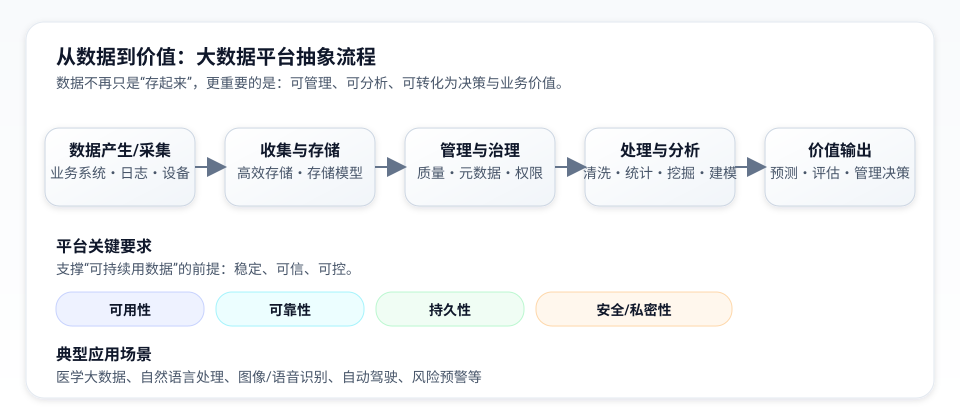
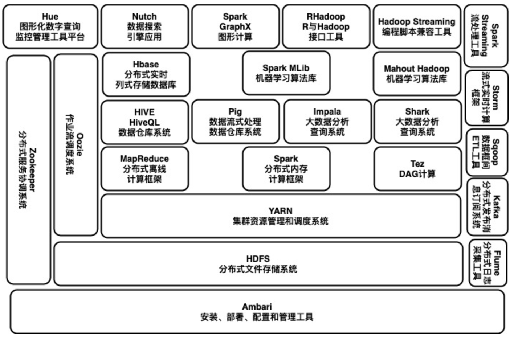

# 1.3 平台设计

在今天的数据平台设计中，Spark 更适合作为统一计算层，而不是孤立的“一个大数据组件”。平台设计的关键，不是堆砌名词，而是围绕数据采集、存储、治理、批处理、流处理和服务化输出建立一条稳定的数据链路。

对教学和工程实践来说，可以把平台拆成五层：数据源与采集层、存储与表格式层、Spark 计算层、元数据与调度治理层、面向分析、训练与服务的消费层。本节会沿着这条主线理解 Spark 与 Hadoop 生态的关系，而不是把所有历史组件都视为默认必选项。

下图用一个抽象流程概括“数据从被收集到产生价值”的过程，并突出大数据平台在可用性、可靠性、持久性与安全私密性方面的要求。

图例 1‑1 数据价值链与平台关键要求（抽象图）

抽象图：数据价值链与平台关键要求

在现代大数据平台中，设计目标通常不是“把所有组件装进一张架构图”，而是围绕数据进入、存储治理、统一计算和结果服务建立稳定链路。对 Spark 而言，更常见的组合是：对象存储或 HDFS 作为数据底座，Spark SQL / DataFrame 与 Structured Streaming 作为统一计算层，再配合元数据、调度和权限体系完成治理。

需要注意的是，这五层不一定对应五套彼此独立的产品。现实平台里，湖仓表格式往往同时承担“数据组织方式”和“表级元数据”的一部分职责；调度系统也可能顺带接入权限、质量校验和血缘信息。理解“层”的意义，是为了看清职责边界，而不是要求平台必须逐层堆满组件。

从历史演进看，Hadoop 提供了分布式存储与资源管理的基础土壤，而 Spark 则把计算模型从以磁盘为中心的 MapReduce 推向更通用的 DAG 与内存计算。两者并不是简单替代关系：今天很多 Spark 集群仍然会使用 HDFS 或 YARN，但 Spark 本身并不依赖 MapReduce，也可以直接运行在 Kubernetes 或对象存储之上。

因此，本章看待“生态环境”时应区分两层：一层是当前主线，即 Spark SQL、Structured Streaming、湖仓/对象存储、Kafka、YARN/Kubernetes 等；另一层是历史背景，即曾围绕 Hadoop 形成的大量配套组件。理解这两层的边界，比记住所有历史名词更重要。

其中，图例 1‑2 更适合理解“大数据平台的历史全景”，而不是 Spark 4.x 的默认落地蓝图。放在今天的工程实践中，可以把相关组件按角色理解：

（1）存储层：HDFS、Amazon S3 及其他对象存储负责保存原始数据、明细数据和中间结果。

（2）计算层：Spark SQL/DataFrame 负责批处理与交互分析，Structured Streaming 负责流处理，必要时再扩展到专题能力如 GraphX。

（3）元数据与仓库层：Hive Metastore、湖仓表格式或目录服务负责统一表结构、分区和权限元信息。

（4）消息与接入层：Kafka、文件落地、数据库同步工具等承担数据采集与传输。

（5）资源与调度层：Standalone、YARN 或 Kubernetes 负责资源分配，外部调度系统负责定时与编排。

Hive 与 HBase 仍值得单独说明。Hive 更接近离线分析与元数据 / 仓库层，适合表结构管理、批量查询和与 Spark SQL 协同；HBase 更接近低延迟随机读写存储，适合键值访问和在线查询补充，但并不是通用分析型存储。二者都可以与 Spark 配合使用，但是否采用应由业务读写模式决定，而不是出于“生态完整”而一并引入。

如果从平台最小闭环来理解，一套足以支撑现代 Spark 项目的基础组合通常只需要回答五个问题：数据怎样进入平台、数据落到哪里、谁来统一计算、谁来维护表与元数据、结果最终由谁消费。先把这五个问题回答清楚，再决定是否要额外引入更多组件，通常比先画一张“大而全架构图”更稳。

可以用一个最小案例把这五个问题串起来。假设团队要同时处理电商订单、支付流水和站内点击日志，那么最常见的一条平台链路会是这样：业务库变更和埋点事件先通过消息队列或文件同步进入平台；原始明细落到对象存储或 HDFS；清洗后的明细表、宽表和指标表通过湖仓表格式或 Hive 元数据统一管理；Spark SQL / DataFrame 负责离线汇总，Structured Streaming 负责分钟级指标和告警；最后由 BI 报表、特征工程任务、模型训练或在线服务消费结果。这条链路已经覆盖了“进入、存储、计算、治理、消费”五个核心问题，足以支撑大量现代 Spark 项目。

从工程取舍上说，平台设计不必一步到位把所有专题组件都装进来。只有当业务明确提出“低延迟随机读写”“复杂全文检索”“图关系计算”这类额外诉求时，才有必要再评估 HBase、搜索系统或图数据库等补充能力。对大多数团队而言，先把这套基础链路跑顺，比一开始就追求“大而全”更能降低复杂度。

带着这套基础链路回头看历史生态，会更容易分清“哪些是今天仍然常见的基础能力，哪些更多属于特定时代的配套组件”。Pig、Tez、Storm、Mahout、Sqoop、Oozie、Ambari 等组件在 Hadoop 生态中都扮演过重要角色：有的负责脚本化数据处理，有的负责工作流编排，有的负责集群运维或流处理。本书保留这些名词，是为了帮助理解旧平台图谱与存量系统文档；在 Spark 4.x 的主线学习中，不需要把这些组件视为默认必选项。

图例 1‑2 大数据处理框架

