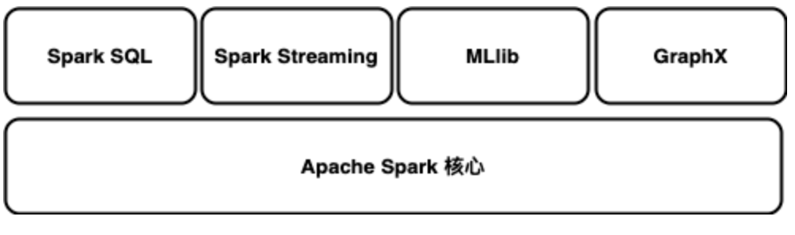
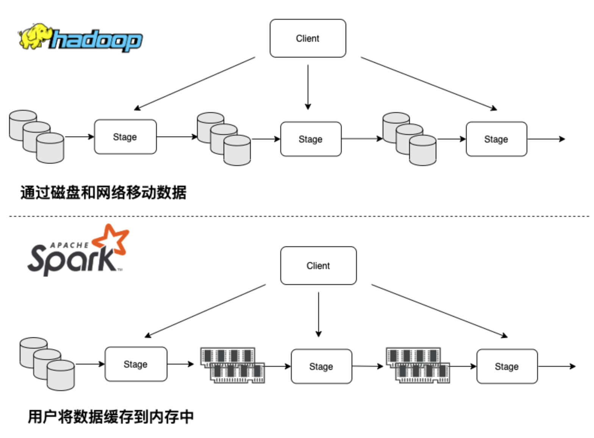
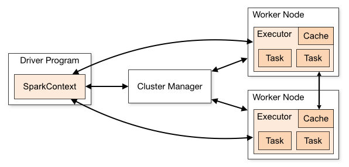

# 1.4 Spark简介

Apache Spark 是一个开源的通用分布式计算框架，最初由加州大学伯克利分校 AMPLab 发起，并在长期演进中逐步形成了今天以结构化处理、流处理和机器学习流水线为核心的能力体系。与早期强依赖磁盘落盘的批处理框架相比，Spark 的优势不应简单理解为某个固定倍数的“速度宣传”，而应理解为：它提供了更统一的执行模型、更丰富的抽象层次，以及更适合交互分析、迭代计算和批流一体处理的工程接口。

在实际部署中，Spark 可以运行在本地模式、Standalone、YARN 或 Kubernetes 上；在存储层，则可以对接 HDFS、对象存储、Hive、湖仓表格式以及多种外部数据库。也正因为这种计算与存储解耦的特性，Spark 更适合作为现代数据平台中的“统一计算层”，而不是某个单一生态组件的附属工具。

Spark 提供 Java、Scala、Python 和 R 等多种语言接口，因此既适合教学入门，也适合工程环境中的多语言协作。对现代实践而言，其主线能力主要是 Spark SQL / DataFrame、Structured Streaming 以及基于 `spark.ml` 的机器学习流水线；GraphX 等组件更适合作为专题能力理解（图例 1‑3）。

<p align="center"></p>
<p align="center">图例 1‑3 Spark组件</p>

### 1.4.1 技术特性

如果把 Spark 看成一套分层能力，最底层是 Spark Core 提供的分布式调度、容错和 I/O 基础，而最基础的数据抽象是 RDD。RDD 有助于理解分区、谱系、缓存与 Shuffle 这些底层机制，因此它仍然是学习执行模型的重要入口；但对今天的大多数 Spark 4.x 项目来说，RDD 已经不再是默认开发界面。真正的高频工程主线，更多建立在结构化处理、流处理和机器学习流水线之上。

从模块关系上看，Spark 的价值不在于“提供了很多彼此孤立的子项目”，而在于这些能力共享同一套执行引擎和集群运行时。结构化查询、流处理、特征工程、模型训练，最终都可以围绕统一的数据抽象和调度模型展开。理解这一点后，再看 Spark 的各个组件，重点就不再是记名字，而是看它们分别解决哪类问题：

- Spark SQL

Spark SQL 是 Spark 4.x 最核心的结构化处理模块，主线抽象是 DataFrame / Dataset。它既支持直接写 SQL，也支持用 DataFrame API 组织过滤、聚合、窗口和 Join 等逻辑，还能复用 Hive Metastore 等元数据体系。对于绝大多数分析、ETL 和特征准备任务来说，Spark SQL 都是默认入口。

- Structured Streaming（推荐）

Structured Streaming 建立在 Spark SQL 执行引擎之上，把流数据尽量拉回到 DataFrame / Dataset 的统一模型里。它支持事件时间、水位线、窗口与状态计算，适合今天大多数需要批流一致性的日志、指标和业务事件处理场景。

- 机器学习（主线为`spark.ml`）

Spark 当前机器学习主线应理解为 DataFrame / Dataset 之上的 `spark.ml` 管道式 API。它更适合把特征处理、模型训练、评估与调参组织成一条可重复的工程流程。历史上的 `spark.mllib` 仍值得了解，但更多是为了兼容旧工程和阅读存量代码。

- GraphX（专题能力）

GraphX 是 Spark 提供的分布式图计算组件，适合讲解顶点 - 边模型、Pregel 风格迭代和图分析的基本思路。在 Spark 4.x 时代，它更适合作为专题能力或已有系统的补充方案，而不是大多数通用数据项目的默认入口。

因此，Spark 的优势不应被简化成“把数据放进内存里就会更快”。更准确的理解是：Spark 通过统一的执行模型、清晰的数据抽象和共享的运行时，把批处理、SQL、流处理和部分机器学习任务放进了同一套工程框架里。这种统一性本身，才是它长期有价值的原因。

从平台角色上说，Spark 更像统一计算框架，而不是完整替代整个 Hadoop 生态的“一站式平台”。它可以与 HDFS、Hive、对象存储等存储层协同工作，也可以运行在 YARN、Kubernetes 或 Standalone 之上。理解这一点后，再看图例 1‑4，就更容易把“存储层”“资源层”和“计算层”区分开。

<p align="center"></p>
<p align="center">图例 1‑4 Spark与Hadoop在数据中间数据处理区别</p>

从执行模型看，Spark 用通用 DAG 把多阶段计算串联起来，避免像传统 MapReduce 那样频繁把每一步中间结果落盘。RDD 及其上层的 DataFrame/Dataset 抽象，让用户可以组合 map、join、group、window、SQL 等多种操作，而不必把程序硬拆成固定的 Map/Reduce 两段。

这也是 Spark 在迭代计算、交互分析和流处理上更有优势的原因：它既能利用内存缓存减少重复计算，又能通过统一 API 把批处理、SQL 和流处理放到同一套引擎下执行。今天真正需要优先掌握的，不是“Spark 比 Hadoop 快多少倍”的口号，而是 Spark 如何通过统一执行模型降低开发复杂度。

Spark 也是一个典型的分布式系统：既可以在单机上本地运行，也可以扩展到由大量节点组成的集群。真正需要把握的不是“节点很多”这件事本身，而是它如何把一个应用拆成 Driver、Executor、存储访问和资源管理这几类角色，再通过统一接口在不同部署环境中运行。

<p align="center"></p>
<p align="center">图例 1‑5 Spark 分布式系统</p>

Spark 应用作为独立进程运行，由 Driver 负责创建 `SparkSession` / `SparkContext`、生成执行计划并调度任务；Executor 负责真正执行计算、缓存数据和回传状态。集群管理器的职责则是为这些进程分配资源，例如 Standalone、Kubernetes 或 YARN。对应用开发者来说，这种分工最重要的含义有两点：一是每个应用通常拥有自己独立的一组 Executor，因此应用之间彼此隔离；二是如果结果要跨应用复用，仍然应该写入外部存储，而不是假设可以直接共享内存中的数据。

Spark 并不强绑定某一种底层资源平台。只要集群管理器能够拉起 Driver / Executor 并保证它们之间正常通信，Spark 就可以在其上运行。今天更稳妥的理解方式是：Driver 决定“做什么”，Executor 负责“把任务跑完”，而 Standalone、YARN、Kubernetes 则决定“资源从哪里来、进程怎样被托管”。从学习路径看，本书主要涉及以下三类常见环境：

（1）Standalone：Spark 自带的轻量级集群管理器，适合教学、实验和小规模独立部署。

（2）Kubernetes：容器化资源管理平台，适合云原生场景下统一调度。

（3）Hadoop YARN：Hadoop 2中的资源管理器。

对于教学和实验环境，最容易上手的是本地模式或轻量级的 Standalone；对于已经运行在 Hadoop 体系中的平台，YARN 往往更自然；对于云原生和容器化部署，Kubernetes 更符合 Spark 4.x 的主流工程实践。选择哪一种环境，本质上取决于团队现有基础设施，而不是 Spark 功能本身是否“完整”。

### 1.4.2 数据格式

在对Spark系统进行学习前，需要先建立“数据源/存储源”的视角。Spark 可以从多种外部系统读取数据，包括本地文件系统、HDFS、Amazon S3 及其他对象存储、Hive 表、HBase、JDBC 数据库，以及湖仓表格式（如 Delta、Iceberg、Hudi）等。下面只介绍几类在工程实践中最常见、也最能帮助理解 Spark 生态位置的数据源：

- HDFS

HDFS 是 Hadoop 生态中的分布式文件系统，适合大文件、顺序读取和高吞吐场景。在今天的 Spark 环境中，HDFS 仍常见于自建集群、本地实验环境和部分离线数仓系统。理解 HDFS 的意义，主要是理解 Spark 早期如何与 Hadoop 存储层协同工作。

- Amazon S3 / 对象存储

对象存储是今天云上 Spark 最常见的数据底座之一。相较于传统分布式文件系统，它更强调弹性容量、统一访问接口以及与湖仓表格式的结合。Spark 通过 S3A 等连接器即可读取和写入这类存储，因此很多云原生 Spark 集群会直接建立在对象存储之上。

- Hive

Hive 在今天既可以指离线数仓查询层，也常指 Hive Metastore 这一元数据服务。对 Spark 来说，最重要的是理解 Spark SQL 可以复用 Hive 表和元数据，从而与现有数仓体系协同工作。很多团队即使不直接运行 Hive 查询，也仍然会保留 Hive Metastore 作为表结构管理中心。

- HBase

HBase 是面向列族的分布式 NoSQL 存储，擅长海量数据上的低延迟随机读写。它适合作为明细查询、时间序列或键值访问的补充存储，但并不是 Spark 分析任务的默认数据底座。本书保留 HBase 内容，是因为它在教学实验和部分企业存量系统中仍然常见。

Spark 可以直接读取文本、JSON、CSV、Parquet 等常见格式，也能通过连接器访问 Kafka、JDBC 数据库、对象存储、Hive 表和多种外部系统。不过从现代平台实践看，真正值得优先掌握的并不是“所有格式列表”，而是几类高频数据形态各自扮演什么角色：

- 行式交换格式：JSON、CSV

JSON 和 CSV 更适合做系统间交换、调试、样例数据或轻量落地。它们易读、通用，但对大规模分析来说通常不如列式格式高效，因此更常见于数据进入平台的早期阶段。

- 列式分析格式：Parquet

Parquet 是现代 Spark 平台里最常见的分析型文件格式之一。它支持列式存储、压缩和统计信息，适合批量扫描、投影裁剪和分析查询，因此在离线数仓、湖仓表格式和特征数据准备中都很常见。很多时候，即使上层使用的是 Delta、Iceberg 或 Hudi，底层承载的数据文件仍然是 Parquet。

- 历史 Hadoop 格式：SequenceFile、ObjectFile

SequenceFile、ObjectFile 等格式更多出现在早期 Hadoop / Spark 生态和教学材料中。了解它们有助于阅读历史项目，但在今天的新系统里，它们通常不是默认首选。

- 外部存储与序列化：Cassandra、Protocol Buffers

Cassandra 这类系统更适合作为外部数据库或在线存储来理解，而不是“Spark 文件格式”；Protocol Buffers 则更像系统间传输时使用的序列化协议。Spark 可以与它们交互，但在当前主线学习里，不必把它们和 Parquet、JSON 这类数据格式放在同一优先级上。

### 1.4.3 编程语言

Spark 可以运行在 Windows 和类 UNIX 系统（如 Linux、macOS）上。本地实验通常只需要准备好 Java 环境变量；进入集群部署时，再考虑 Python、R、Scala 版本与运行时依赖的一致性。对 Spark 4.x 而言，更稳妥的环境组合通常是 Java 17+（建议 21）、Python 3.10+、R 4.x；对于 Scala API，Spark 4.1.1 使用 Scala 2.13，工程里也应尽量保持 Scala 2.13.x 生态一致。

语言选择不必变成抽象争论。更实用的判断方式是：如果团队偏数据分析、Notebook 和快速实验，Python 往往是第一入口；如果要贴近 Spark 内部模型、类型系统和 JVM 工程，Scala 更有优势；如果平台侧已经是成熟的 Java 体系，Java 也完全可用；R 则更适合统计分析和交互式探索。表格 1‑1 给出了一组对 Spark 工程最有参考价值的比较维度：

| 影响因素 | Scala                       | Python                              |
| ---- | --------------------------- | ----------------------------------- |
| 性能   | 与 Spark 内部实现更贴近，通常更容易获得稳定性能 | 开发效率高，但 Python 与 JVM 之间存在额外序列化与边界开销 |
| 语法   | 语法更灵活，也更复杂                  | 语法更简洁，上手通常更快                        |
| 并发   | 对并发与函数式抽象支持更强               | 原生多线程模型相对受限，分布式场景更多依赖 Spark 自身并行框架  |
| 类型安全 | 静态类型语言                      | 动态类型语言                              |
| 学习成本 | 对新手更陡一些                     | 对多数数据分析与脚本开发者更友好                    |
| 生态工具 | 更适合贴近 Spark/Scala 生态深入开发    | 数据处理、实验与可视化生态更丰富                    |

表格 1‑1 Scala和Python的比较

注意：Spark 4.x 已不再支持旧版 Java 7 与 Python 2 生态；生产环境建议统一使用 LTS JDK（17/21）与 Python 3.10+。

#### 1.4.3.1 Java

Java 适合那些已经深度依赖 JVM 生态的企业环境，例如现有平台侧服务、调度系统、权限体系或内部 SDK 都以 Java 为主时，直接使用 Java API 往往能减少语言切换成本。它的优势在于类型系统稳定、打包和部署路径成熟，并且容易和既有 Java 服务栈整合。

在 Spark 4.x 中，Java API 可以直接使用 lambda 表达式和函数式接口来组织转换逻辑。虽然日常数据分析里更常见的是 Python 或 Scala，但对于需要长期维护、强调规范工程化的团队，Java 仍然是可行选择。下面保留一个最小的 Hello World，用来说明 Java 项目的基本入口形式：

public class HelloWorld {

public static void main(String\[] args) {

System.out.println("Hello, World!");

}

}

#### 1.4.3.2 Scala

Scala 是 Spark 最贴近内核生态的语言。很多底层概念、Dataset 类型系统、函数签名和示例最早都来自 Scala 语境，因此当你需要理解 Spark 内部抽象、编写更复杂的 JVM 侧库，或者希望在类型安全与表达力之间取得平衡时，Scala 会更有优势。

从工程体验上看，Scala 的收益主要在三点：一是与 Spark 内部 API 更贴近；二是 `case class`、模式匹配和高阶函数很适合表达结构化与分布式逻辑；三是可以无缝复用 Java 生态。但它的学习曲线也更陡，尤其对只想快速完成分析任务的读者来说，Python 往往更容易上手。下面先用一个极小的 Scala 片段感受语法风格：

```scala
val nums = Seq(1, 2, 3)
nums.map(_ + 1)
```

更接近日常工程入口的，仍然是标准的 `object` / `main` 结构。下面保留两个最常见的 Hello World 写法：

```scala
object HelloWorld extends App {
  println("Hello, world!")
}
```

或

```scala
object HelloWorld {
  def main(args: Array[String]) {
    println("Hello, world!")
  }
}
```

和 Java 相比，Scala 的入口通常通过 `object` 定义，而不是显式写 `static main`。如果把程序保存为 `HelloWorld.scala`，可以像下面这样编译：

\> scalac HelloWorld.scala

若要运行：

\> scala -classpath . HelloWorld

这说明 Scala 在编译和运行模型上与 Java 非常接近，也因此天然适合放进 JVM 工程体系。直接使用 Scala 解释器也可以快速运行该程序，例如：

\> scala -i HelloWorld.scala -e 'HelloWorld.main(null)'

#### 1.4.3.3 Python

Python 是今天最常见的 PySpark 入口语言。它的优势在于语法简单、Notebook 与数据分析生态成熟、实验反馈快，因此特别适合数据探索、特征工程和模型试验。很多团队的 Spark 主线开发语言，实际上就是 Python。

需要同时看到它的边界：Python 和 JVM 之间存在额外的序列化与运行时边界，因此在极致性能、类型系统或深度定制 Spark 内核行为方面，Scala 往往更有优势。对大多数业务开发而言，Python 的开发效率收益通常远大于这些额外开销。下面保留当前推荐的 Python 3 写法，以及历史上常见但已过时的 Python 2 写法，方便识别旧代码：

- Python 3.x（当前推荐）

print("Hello, world!")

- Python 2.x（历史写法，仅用于兼容老代码）

print "Hello, world!"

Python 也很适合交互式探索。启动解释器后，可以直接在提示符号 `>>>` 后输入语句并立即看到结果：

- Python 3.x（当前推荐）

\>>> print("Hello, world!")

Hello, world!

- Python 2.x（历史写法，仅用于兼容老代码）

\>>> print "Hello, world!"

Hello, world!

需要特别注意的是，Python 2 与 Python 3 的 `print` 语法不同。Spark 4.x 已经完全站在 Python 3 生态上，旧写法仅保留给历史兼容场景。

#### 1.4.3.4 R

R 更适合统计分析、可视化和交互式数据探索。在 Spark 生态里，对应的入口是 SparkR。它不是本书的主线开发语言，但对于已经熟悉 R 工作流、需要把大规模数据处理与统计分析结合的读者来说，仍然有现实价值。工程项目里，如果团队主要使用 Python 或 Scala，R 通常更适合作为分析补充而不是主实现语言。

