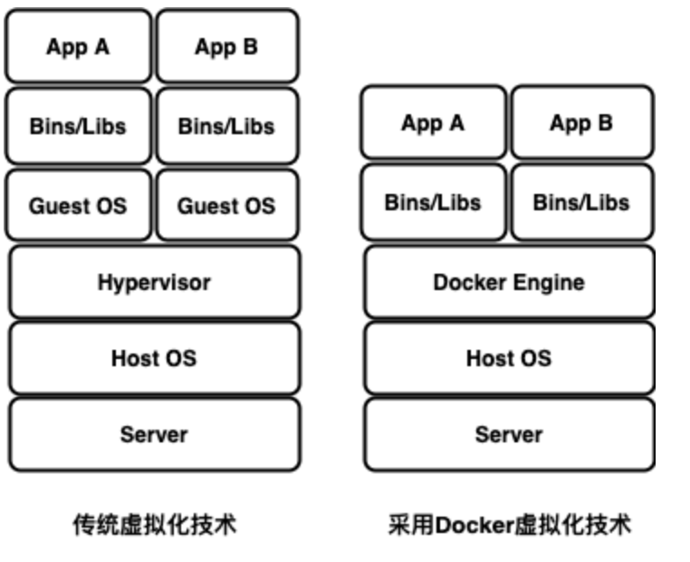
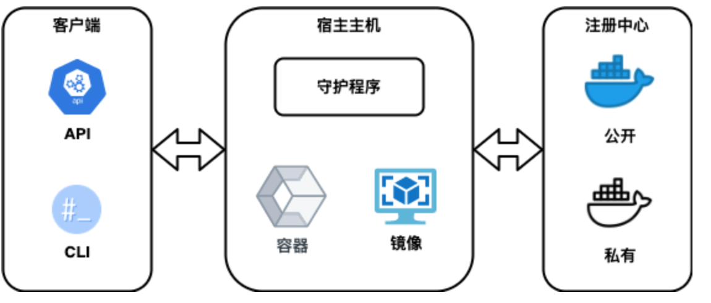
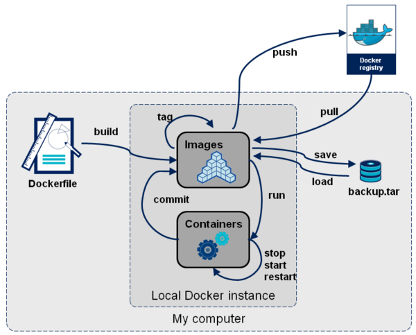

# 1.5 虚拟环境

由于Spark程序开发的生态环境相对比较复杂和多样，对于初学者带来很多困难。本教程移入虚拟化技术，实现开发环境的统一部署。选择Docker作为虚拟化实验平台，实现开发环境的快速部署。Docker是一个开放源代码软件项目，让应用程序部署在软件容器的工作模式下，可以自动化进行，借此在Linux操作系统上，提供一个额外的软件抽象层，以及操作系统层虚拟化的自动管理机制。Docker利用Linux核心中的资源分脱机制，例如cgroup，以及Linux核心名字空间，来创建独立的软件容器（Container）。这可以在单一Linux实体下运作，避免引导一个虚拟机造成的额外负担。Linux核心对名字空间的支持完全隔离了工作环境中应用程序的视野，包括进程树、网络、用户ID与挂载文件系统，而核心的cgroup提供资源隔离，包括CPU、内存、block
I/O与网络。从0.9版本起，Docker在使用抽象虚拟是经由libvirt的LXC与systemd-nspawn提供界面的基础上，开始包括libcontainer库做为以自己的方式开始直接使用由Linux核心提供的虚拟化的设施，

依据行业分析公司451研究，“Docker是有能力打包应用程序及其虚拟容器，可以在任何Linux服务器上运行的依赖性工具，这有助于实现灵活性和便携性，应用程序在任何地方都可以运行，无论是公有云、私有云、单机等。�?

### 1.5.1 发展历史

Docker 最初是 dotCloud 公司创始�?Solomon Hykes 在法国期间发起的一个公司内部项目，它是基于 dotCloud
公司多年云服务技术的一次革新，并于2013 �?3 月以 Apache 2.0
授权协议开源，主要项目代码在[GitHub](https://github.com/docker/docker)上进行维护。Docker项目后来还加入了
Linux 基金会，并成立推动[开放容器联盟](https://www.opencontainers.org/)�?

Docker自开源后受到广泛的关注和讨论，至今其GitHub项目已经超过3�?千个星标和一万多个Fork。甚至由于Docker项目的火爆，�?013年底，[dotCloud公司决定改名�?
Docker](https://blog.docker.com/2013/10/dotcloud-is-becoming-docker-inc/)。Docker最初是在Ubuntu
12.04上开发实现的；Red Hat则从RHEL 6.5开始对Docker 进行支持；Google 也在�?PaaS 产品中广泛应�?
Docker�?

Docker 使用 Google 公司推出的[Go语言](https://golang.org/)进行开发实现，基于 Linux
内核的 cgroup、[namespace](https://en.wikipedia.org/wiki/Linux_namespaces)以及AUFS类的Union
FS等技术，对进程进行封装隔离，属于 [操作系统层面的虚拟化技术](https://en.wikipedia.org/wiki/Operating-system-level_virtualization)。由于隔离的进程独立于宿主和其它的隔离的进程，因此也称其为容器。最初实现是基于[LXC](https://linuxcontainers.org/lxc/introduction/)，从
0.7 以后开始去�?LXC，转而使用自行开发的libcontainer，从 1.11
开始，则进一步演进为使用runC和[containerd](https://containerd.tools/)�?

Docker 在容器的基础上，进行了进一步的封装，从文件系统、网络互联到进程隔离等等，极大的简化了容器的创建和维护。使�?Docker
技术比虚拟机技术更为轻便、快捷�?

下面的图片比较了 Docker
和传统虚拟化方式的不同之处。传统虚拟机技术是虚拟出一套硬件后，在其上运行一个完整操作系统，在该系统上再运行所需应用进程；而容器内的应用进程直接运行于宿主的内核，容器内没有自己的内核，而且也没有进行硬件虚拟，因此容器要比传统虚拟机更为轻量（图例 1�?）�?



图例 1�? 传统虚拟化技术与Docker虚拟化技术区�?

虚拟机和容器都是在硬件和操作系统以上的，虚拟机有Hypervisor层，Hypervisor是整个虚拟机的核心所在。他为虚拟机提供了虚拟的运行平台，管理虚拟机的操作系统运行。每个虚拟机都有自己的系统和系统库以及应用。容器没有Hypervisor这一层，并且每个容器是和宿主机共享硬件资源及操作系统，那么由Hypervisor带来性能的损耗，在Linux容器这边是不存在的。但是虚拟机技术也有其优势，能为应用提供一个更加隔离的环境，不会因为应用程序的漏洞给宿主机造成任何威胁。同时还支持跨操作系统的虚拟化，例如你可以在Linux操作系统下运行windows虚拟机。从虚拟化层面来看，传统虚拟化技术是对硬件资源的虚拟，容器技术则是对进程的虚拟，从而可提供更轻�?
级的虚拟化，实现进程和资源的隔离。从架构来看，Docker比虚拟化少了两层，取消了hypervisor层和GuestOS层，使用 Docker
Engine
进行调度和隔离，所有应用共用主机操作系统，因此在体量上，Docker较虚拟机更轻量级，在性能上优于虚拟化，接近裸机性能。从应用场景�?
看，Docker和虚拟化则有各自擅长的领域，在软件开发、测试场景和生产运维场景中各有优�?

### 1.5.2 技术特�?

作为一种新兴的虚拟化方式，Docker
跟传统的虚拟化方式相比具有众多的优势。由于容器不需要进行硬件虚拟以及运行完整操作系统等额外开销，Docker
对系统资源的利用率更高。无论是应用执行速度、内存损耗或者文件存储速度，都要比传统虚拟机技术更高效。因此，相比虚拟机技术，一个相同配置的主机，往往可以运行更多数量的应用。传统的虚拟机技术启动应用服务往往需要数分钟，�?
Docker
容器应用，由于直接运行于宿主内核，无需启动完整的操作系统，因此可以做到秒级、甚至毫秒级的启动时间。大大的节约了开发、测试、部署的时间。开发过程中一个常见的问题是环境一致性问题。由于开发环境、测试环境、生产环境不一致，导致有些
bug 并未在开发过程中被发现。�?Docker 的镜像提供了除内核外完整的运行时环境，确保了应用运行环境一致性�?

对开发和运维人员来说，最希望的就是一次创建或配置，可以在任意地方正常运行。使用Docker可以通过定制应用镜像来实现持续集成、持续交付、部署。开发人员可以通过[Dockerfile](https://docs.docker.com/engine/reference/builder/)来进行镜像构建，并结合持续集成系统进行集成测试，而运维人员则可以直接在生产环境中快速部署该镜像，甚至结合持续部署系统进行自动部署。而且使用Dockerfile使镜像构建透明化，不仅仅开发团队可以理解应用运行环境，也方便运维团队理解应用运行所需条件，帮助更好的生产环境中部署该镜像。由�?
Docker 确保了执行环境的一致性，使得应用的迁移更加容易。Docker
可以在很多平台上运行，无论是物理机、虚拟机、公有云、私有云，甚至是笔记本，其运行结果是一致的。因此用户可以很轻易的将在一个平台上运行的应用，迁移到另一个平台上，而不用担心运行环境的变化导致应用无法正常运行的情况�?

Docker
使用的分层存储以及镜像的技术，使得应用重复部分的复用更为容易，也使得应用的维护更新更加简单，基于基础镜像进一步扩展镜像也变得非常简单。此外，Docker
团队同各个开源项目团队一起维护了一大批高质量的[官方镜像](https://hub.docker.com/explore/)，既可以直接在生产环境使用，又可以作为基础进一步定制，大大的降低了应用服务的镜像制作成本�?

| 特�?   | 容器        | 虚拟�?   |
| ----- | --------- | ------ |
| 启动    | 秒级        | 分钟�?   |
| 硬盘使用  | 一般为 MB    | 一般为 GB |
| 性能    | 接近原生      | 弱于     |
| 系统支持�?| 单机支持上千个容�?| 一般几十个  |

表格 1�? 两种虚拟化技术的对比

### 1.5.3 技术架�?

Docker使用客户端和服务器架构，客户端与守护进程进行对话，该守护进程完成了构建、运行和分发容器的繁重工作。客户端和守护程序可以在同一系统上运行，或者可以将客户端连接到远程守护程序。客户端和守护程序在UNIX套接字或网络接口上使用REST
API进行通信。守护程序侦听Docker
API请求并管理Docker对象，例如图像，容器，网络和卷。守护程序还可以与其他守护程序通信以管理Docker服务。客户端是许多用户与Docker交互的主要方式，当使用Docker命令时，客户端会将这些命令发送到守护程序，以执行这些命令，Docker客户端可以与多个守护程序通信。注册中心存储Docker镜像。Docker
Hub是一个由Docker公司负责维护的公共注册中心，包含了可用来下载和构建容器的镜像，并且还提供认证、工作组结构、工作流工具、构建触发器以及私有工具（比如私有仓库可用于存储并不想公开分享的镜像）。Docker
Hub是任何人都可以使用的公共注册中心，并且Docker配置为默认在Docker
Hub上查找映像，也可以运行自己的私人注册中心。使用docker
pull或docker run命令时，所需的镜像将从配置的注册中心中提取，使用该docker
push命令时，会将镜像推送到配置的注册中心。使用Docker时，可以创建和使用镜像、容器、网络、数据卷、插件和其他对象，下面的内容对其中一些技术架构中对象和组件进行简要的概述�?



图例 1�? Docker技术框�?

#### 1.5.3.1 镜像

镜像是用于创建容器的只读指令模板，是一个特殊的文件系统，除了提供容器运行时所需的程序、库、资源、配置等文件外，还包含了一些为运行时准备的一些配置参数（如匿名卷、环境变量、用户等），不包含任何动态数据，其内容在构建之后也不会被改变。因为镜像包含操作系统完整的根文件系统，其体积往往是庞大的，因此在
Docker 设计时，就充分利�?Union FS 的技术，将其设计为分层存储的架构。所以严格来说，镜像并非是像一�?ISO
那样的打包文件，镜像只是一个虚拟的概念，其实际体现并非由一个文件组成，而是由一组文件系统组成，或者说，由多层文件系统联合组成�?

镜像构建时，会一层层构建，前一层是后一层的基础。每一层构建完就不会再发生改变，后一层上的任何改变只发生在自己这一层。例如删除前一层文件的操作，实际不是真的删除前一层的文件，而是仅在当前层标记为该文件已删除。在最终容器运行的时候，虽然不会看到这个文件，但是实际上该文件会一直跟随镜像。因此，在构建镜像的时候，需要额外小心，每一层尽量只包含该层需要添加的东西，任何额外的东西应该在该层构建结束前清理掉。分层存储的特征还使得镜像的复用、定制变的更为容易。甚至可以用之前构建好的镜像作为基础层，然后进一步添加新的层，以定制自己所需的内容，构建新的镜像�?

可以创建自己的镜像，也可以仅使用其他人创建并在注册中心中发布的镜像。要构建自己的映像，使用简单的语法创建一个Dockerfile文件，以定义创建映像并运行它所需的步骤。Dockerfile中的每条指令都会在镜像中创建一个层，更改Dockerfile并重建映像时，仅重建那些已更改的层。与其他虚拟化技术相比，这是使镜像如此轻巧，小型和快速的部分原因�?

#### 1.5.3.2 容器

容器是镜像的可运行实例，可以使用Docker
API或CLI创建、启动、停止、移动或删除容器，可以将容器连接到一个或多个网络，将存储附加到该网络，甚至根据其当前状态创建新镜像。默认情况下，容器与其他容器及其主机之间的隔离程度相对较高，可以控制容器的网络、存储或其他基础子系统与其他容器或与主机的隔离程度。容器的实质是进程，但与直接在主机上执行的进程不同，容器进程运行于属于自己的独立的命名空间。因此容器可以拥有独立的根文件系统、网络配置、进程空间，甚至用户空间。容器内的进程是运行在一个隔离的环境里，使用起来就好像是在一个独立于主机系统下操作一样。这种特性使得容器封装的应用比直接在主机运行更加安全，也因为这种隔离的特性，很多人初�?
Docker 时常常会混淆容器和虚拟机�?

前面讲过镜像使用的是分层存储，容器也是如此。每一个容器运行时，是以镜像为基础层，在其上创建一个当前容器的存储层，我们可以称这个为容器运行时读写而准备的存储层为
容器存储层。容器存储层的生存周期和容器一样，容器消亡时容器存储层也随之消亡。因此，任何保存于容器存储层的信息都会随容器删除而丢失。按�?
Docker
最佳实践的要求，容器不应该向其存储层内写入任何数据，容器存储层要保持无状态化。所有的文件写入操作，都应该使用数据卷或者绑定主机目录，在这些位置的读写会跳过容器存储层，直接对主机（或网络存储）发生读写，其性能和稳定性更高。数据卷的生存周期独立于容器，容器消亡数据卷不会消亡。因此使用数据卷后，容器删除或者重新运行之后，数据却不会丢失。容器由其镜像以及在创建或启动时为其提供的任何配置选项定义。删除容器后，未存储在持久性存储中的状态更改将消失。下面通过示例docker
run命令来讲解镜像和容器的关系。以下命令运行一个ubuntu容器，运�?bin/bash以交互方式附加到本地命令行会话�?

```bash
$ docker run -i -t ubuntu /bin/bash
```

当运行此命令时，假设使用的是默认注册中心的配置会发生以下情况�?

�?）如果在本地没有ubuntu镜像，则Docker会将其从已配置的注册中心中拉出，就像手动执行了docker pull ubuntu命令�?

�?）Docker会创建一个新容器，就像手动执行了docker container create命令一样�?

�?）Docker将一个读写文件系统分配给容器作为其最后一层。这允许运行中的容器在其本地文件系统中创建或修改文件和目录�?

�?）Docker创建了一个网络接口将容器连接到默认网络，包括为容器分配IP地址，默认情况下容器可以使用主机的网络连接连接到外部网络�?

�?）Docker启动容器并执�?bin/bash，因为容器是交互式运行并且已附加到终端（由于-i�?t
标志），所以可以在输出记录到终端时使用键盘提供输入�?

�?）键入exit以终�?bin/bash命令时，容器将停止但不会被删除，可以重新启动或删除�?

#### 1.5.3.3 注册中心

镜像构建完成后，可以很容易的在当前宿主机上运行，但是，如果需要在其它服务器上使用这个镜像，我们就需要一个集中的存储、分发镜像的服务，Docke注册中心就是这样的服务。注册中心中可以包含多个仓库；每个仓库可以包含多个标签；每个标签对应一个镜像。通常，一个仓库会包含同一个软件不同版本的镜像，而标签就常用于对应该软件的各个版本，可以通过\<仓库名\>:\<标签\>的格式来指定具体是这个软件哪个版本的镜像。如果不给出标签，将�?
latest 作为默认标签。以Ubuntu 镜像为例，ubuntu
是仓库的名字，其内包含有不同的版本标签如16.04�?8.04等等。可以通过ubuntu:16.04，或者ubuntu:18.04
来具体指定所需哪个版本的镜像，如果忽略了标签比如ubuntu，那将视为ubuntu:latest。仓库名经常�?两段式路径形式出现，比如
leeivan/spark-lab-env，前者往往意味着注册中心多用户环境下的用户名，后者则往往是对应的软件名。但这并非绝对，取决于所使用的具体注册中心的软件或服务�?

注册中心公开服务是开放给用户使用、允许用户管理镜像的服务。一般这类公开服务允许用户免费上传、下载公开的镜像，并可能提供收费服务供用户管理私有镜像。最常使用的
注册中心公开服务是官方的Docker
Hub，这也是默认的注册中心，并拥有大量高质量的官方镜像，除此以外还有CoreOS的Quay.io，CoreOS
相关的镜像存储在这里。谷歌的 Google Container Registry和Kubernetes 的镜像使用的就是这个服务�?

由于某些原因，在国内访问这些服务可能会比较慢。国内的一些云服务商提供了针对 Docker Hub
的镜像服务，这些镜像服务被称为加速器。常见的有阿里云加速器、DaoCloud
加速器等。使用加速器会直接从国内的地址下载Docker Hub的镜像，比直接从Docker
Hub下载速度会提高很多。国内也有一些云服务商提供类似于Docker
Hub的公开服务，比如时速云镜像仓库、网易云镜像服务、DaoCloud镜像市场、阿里云镜像库等�?

### 1.5.4 管理命令

本教程的实验环节需要使用Docker部署Spark开发环境，需要了解Docker操作的基本命令，以及虚拟环境的创建、部署等。下面的内容介绍了Docker命令在大部分情境下的使用方法以及应用，可以在进入Spark的实验环节之前进行练习参考，总的来说分为以下几类（图�?1�?）：

  - 生命周期管理

docker \[run|start|stop|restart|kill|rm|pause|unpause\]

  - 操作运维

 docker \[ps|inspect|top|attach|events|logs|wait|export|port\]

  - 根文件系统命�?

docker \[commit|cp|diff\]

  - 镜像仓库

docker \[login|pull|push|search\]

  - 本地镜像管理

docker \[images|rmi|tag|build|history|save|import\]

  - 其他命令

docker \[exec|info|version\]



图例 1�? 在各个阶段运行的Docker命令

下面列出docker命令的示例：

�?）列出机器上的镜像，其中可以根据REPOSITORY来判断这个镜像是来自哪个服务器，如果没有�?”则表示官方镜像，如果类似于username/repos\_name表示为Docker
Hub的个人公共库，而如果类似于regsistory.example.com:5000/repos\_name，则表示的是私服。IMAGE
ID列其实是缩写，要显示完整则带�?-no-trunc选项

```bash
# docker images
REPOSITORY TAG IMAGE ID CREATED VIRTUAL SIZE
ubuntu 14.10 2185fd50e2ca 13 days ago 236.9 MB
�?
```

命令 1.1

�?）在Docker Hub中搜索镜像，搜索的范围是官方镜像和所有个人公共镜像，在NAME列中/后面是仓库的名字�?

```bash
# docker search spark-lab-env
NAME DESCRIPTION STARS OFFICIAL AUTOMATED
leeivan/spark-lab-env Spark Lab Enviroment 0 0
```

命令 1.2

�?）从公共注册中心中下拉镜像�?

```bash
# docker pull centos
```

命令 1.3

上面的命令需要注意，从V1.3开始只会下载标签为latest的镜像，也可以明确指定具体的镜像�?

```bash
# docker pull centos:centos6
```

命令 1.4

当然也可以从个人的公共仓库（包括自己是私人仓库）拉取，格式为docker pull
username/repository\<:tag\_name\> �?

```bash
# docker pull leeivan/spark-lab-env:4.1.1
```

命令 1.5

�?）推送镜像或仓库到注册中心，与上面的pull对应，可以推送到公共注册中心�?

```bash
# docker push leeivan/spark-lab-env
```

命令 1.7

在仓库不存在的情况下，推送上去镜像会创建为私有库，然而通过浏览器创建默认公共库�?

�?）从镜像启动一个容器，在容器上执行命令。docker run命令首先会从特定的镜像之上创建一层可写的容器，然后通过docker
start命令来启动它。停止的容器可以重新启动并保留原来的修改。run命令启动参数有很多，以下是一些常规使用说明。当利用run
来创建容器时，首先检查本地是否存在指定的镜像，不存在就从公有仓库下载，利用镜像创建并启动一个容器，然后分配一个文件系统，并在只读的镜像层外面挂载一层可读写层，从宿主主机配置的网桥接口中桥接一个虚拟接口到容器中去，从地址池配置一�?
ip 地址给容器，执行用户指定的应用程序，执行完毕后容器被终止，使用镜像创建容器并执行相应命令�?

```bash
# docker run ubuntu echo "hello world"
Unable to find image 'ubuntu:latest' locally
latest: Pulling from library/ubuntu
5c939e3a4d10: Pull complete
c63719cdbe7a: Pull complete
19a861ea6baf: Pull complete
651c9d2d6c4f: Pull complete
Digest:
sha256:8d31dad0c58f552e890d68bbfb735588b6b820a46e459672d96e585871acc110
Status: Downloaded newer image for ubuntu:latest
hello world
```

命令 1.8

这是最简单的方式，跟在本地直接执行echo 'hello world'
几乎感觉不出任何区别，而实际上它会从本地ubuntu:latest镜像启动到一个容器，并执行打印命令后退出，可以通过命令查看创建的容器�?

```bash
# docker ps -l
CONTAINER ID IMAGE COMMAND CREATED STATUS PORTS NAMES
f520084a16a4 ubuntu "echo 'hello world'" 14 minutes ago Exited (0) 14
minutes ago flamboyant_mendel
```

需要注意的是，默认有一�?-rm=true参数，即完成操作后停止容器并从文件系统移除。因为Docker的容器实在太轻量级了，很多时候用户都是随时删除和创建容器。容器启动后会自动随机生成一个CONTAINER
ID，这个ID在后面commit命令后可以变为IMAGE ID。使用镜像创建容器并进入交互模式�?

```bash
# docker run -i -t --name spark leeivan/spark-lab-env /bin/bash
root@spark:/#
```

命令 1.9

这个命令会启动一个伪终端，上面的--name参数可以指定启动后的容器名字，如果不指定则会自动生成一个名字。通过ps或top命令却只能看到一两个进程，因为容器的核心是所执行的应用程序，所需要的资源都是应用程序运行所必需的，除此之外并没有其它的资源，可见Docker对资源的利用率极高。此时使用exit或Ctrl+D退出后，这个容器也就消失了。运行出一个容器放到后台运行：

```bash
# docker run -d ubuntu /bin/sh -c "while true; do echo hello world;
sleep 2; done"
0d6e40aa8791faae795029f219fba1e95cfa5420eaef6c88ad70623745fb3ac4
```

命令 1.10

它将直接把启动的容器挂起放在后台运行，并且会输出一个CONTAINER ID，通过docker ps可以看到这个容器的信息，通过“docker
logs 0d6e40aa8791”可在容器外面查看它的输出，也可以通过“docker attach
0d6e40aa8791”连接到这个正在运行的终端，此时如果使用Ctrl+C退出，容器就消失了�?

docker
exec是另一个常会用到的指令，它主要的作用是可以进入容器中执行某项命令，但要注意，这一个指令要正常运行，容器必需在活着的状态下才行，例如假设容器的状态是处于退出状态，则执行docker
exec时会出现错误讯息。在下面的范例中，eede6d35b47d是容器ID（也可以换成容器名称�?

docker exec eede6d35b47d /bin/ping localhost

docker exec可用来进入容器内，然后在容器中执行指令，例如�?

```bash
# docker exec -it spark bash
root@spark:/# ls
bin boot data dev etc home lib lib64 media mnt opt proc root run sbin
spark srv sys tmp usr var
```

在使用Docker指令时，有些动作是可以用run或exec来完成的，那么两者有什么不同呢？其实docker
run适合在没有容器的情况下使用，就可以为建立和启动一个容器，并执行命令；docker
exec就是针对已存在的容器进行操作，如果容器没活着，那么在执行指令时会出现错误�?

�?）映射主机到容器的端�?

docker容器在启动的时候，如果不指定端口映射参数，在容器外部是无法通过网络来访问容器内的网络应用和服务的，亦可使用Dockerfile文件中的EXPOSE指令来配置。端口映射可使用-p�?P来实现。当使用
-P 标记时，Docker 会随机映射一�?49000\~49900
的端口到内部容器开放的网络端口；当使用-p标记时，则可以指定要映射的端口，并且在一个指定端口上只可以绑定一个容器，支持的格式有如下三种之一�?

ip:hostPort:containerPort | ip::containerPort | hostPort:containerPort

需要注意的是：宿主机的一个端口只能映射到容器内部的某一个端口上，比�?080:80之后，就不能8080:81；容器内部的某个端口可以被宿主机的多个端口映射，比如8080:80�?090:80�?099:80。端口的映射有以下几种方法：

一、将容器暴露的所有端口都随机映射到宿主机上，例如：（不推荐使用）

```bash
# docker run -P -it ubuntu /bin/bash
```

二、将容器指定端口随机映射到宿主机一个端口上，例如：

```bash
# docker run -P 80 -it ubuntu /bin/bash
```

以上指令会将容器�?0端口随机映射到宿主机的一个端口上�?

三、将容器指定端口映射到宿主机的一个指定端口上，例如：

```bash
# docker run -p 8000:80 -it ubuntu /bin/bash
```

以上指令会将容器�?0端口映射到宿主机�?000端口上�?

四、绑定外部的ip和随机端口到容器的指定端口（宿主机ip�?0.168.2.141�?

```bash
# docker run -p 192.168.0.100::80 -it ubuntu /bin/bash
# docker ps
CONTAINER ID IMAGE COMMAND CREATED STATUS PORTS NAMES
e9584d29f978 ubuntu "/bin/bash" 35 seconds ago Up 34 seconds
10.168.2.141:32768->80/tcp eager_albattani
```

以上指令会将宿主机的ip10.168.2.141和随机指定端�?2768映射到容器的指定80端口�?

五、绑定外部的ip和指定端口到容器的指定端口（宿主机ip�?0.168.2.141�?

```bash
# docker run -p 10.168.2.141:8000:80 -it ubuntu /bin/bash
```

以上指令会将宿主机的ip10.168.2.141和指定端�?000映射到容器的指定80端口�?

六、查看容器绑定和映射的端口及Ip地址

```bash
# docker port spark
4040/tcp -> 0.0.0.0:4040
8080/tcp -> 0.0.0.0:8080
8081/tcp -> 0.0.0.0:8081
# docker inspect spark|grep IPAddress
"SecondaryIPAddresses": null,
"IPAddress": "172.17.0.2",
"IPAddress": "172.17.0.2",
```

七、目录映射其实是绑定挂载主机的路径到容器的目录，这对于内外传送文件比较方便。为了避免容器停止以后保存的镜像不被删除，就要把提交的镜像保存到挂载的主机目录下，使用比较简单，-v
\<host\_path:container\_path\>，绑定多个目录时再加-v�?

```bash
# docker run -it -v /home/dock/Downloads:/usr/Downloads ubuntu64
/bin/bash
```

通过-v参数，冒号前为宿主机目录，必须为绝对路径，冒号后为镜像内挂载的路径。现在镜像内就可以共享宿主机里的文件了。默认挂载的路径权限为读写。如果指定为只读可以用ro�?

```bash
# docker run -it -v /home/dock/Downloads:/usr/Downloads:ro ubuntu64
/bin/bash
```

docker还提供了一种高级的用法，叫数据卷。数据卷其实就是一个正常的容器，专门用来提供数据卷供其它容器挂载的，感觉像是由一个容器定义的一个数据挂载信息，其他的容器启动可以直接挂载数据卷容器中定义的挂载信息，例如：

```bash
# docker run -v /home/dock/Downloads:/usr/Downloads --name dataVol
ubuntu64 /bin/bash
```

创建一个普通的容器。用--name给他指定了一个名（不指定的话会生成一个随机的名子）。再创建一个新的容器，来使用这个数据卷�?

```bash
# docker run -it --volumes-from dataVol ubuntu64 /bin/bash
--volumes-from用来指定要从哪个数据卷来挂载数据�?
```

�?）开�?停止/重启容器（start/stop/restart�?

容器可以通过run新建一个来运行，也可以重新启动已经停止的容器，不能够再指定容器启动时运行的指令，因为Docker只能有一个前台进程。容器停止（或Ctrl+D）时，会在保存当前容器的状态之后退出，下次启动时保有上次关闭时更改�?

docker start启动一个或多个已经被停止的容器

docker stop停止一个运行中的容�?

docker restart重启容器

�?）进入运行中的容�?

如果运行docker run时，使用 -d 参数容器启动后会进入后台执行，某些时候需要进入容器进行操作，有很多种方法可以完成这样的操作，包括使用
docker attach 或docker exec命令等。docker exec 是内建的命令，下面示范如何使用该命令�?

```bash
# docker run -idt ubuntu
243c32535da7d142fb0e6df616a3c3ada0b8ab417937c853a9e1c251f499f550
# docker ps
CONTAINER ID IMAGE COMMAND CREATED STATUS PORTS NAMES
243c32535da7 ubuntu:latest "/bin/bash" 18 seconds ago Up 17 seconds
nostalgic_hypatia
# docker exec -ti nostalgic_hypatia bash
root@243c32535da7:/#
```

docker attach 也是内建的命令，下面示例如何使用该命令：

```bash
# docker attach nostalgic_hypatia
root@243c32535da7:/#
```

按下 ctrl + P 然后 ctrl + Q 跳离容器，让它继续在背景执行。但是使�?attach
命令有时候并不方便，当多个窗口同时进入到同一个容器的时候，所有窗口都会同步显示。当某个窗口因命令阻塞时，其他窗口也无法执行操作了�?

�?）查看容器的信息

docker ps命令可以查看容器的CONTAINER ID、NAME、IMAGE
NAME、端口开启及绑定、容器启动后执行的命令，经常通过ps来找到CONTAINER\_ID�?

docker ps 默认显示当前正在运行中的容器

docker ps -a 查看包括已经停止的所有容�?

docker ps -l 显示最新启动的一个容器（包括已停止的�?


