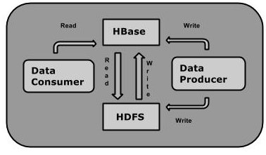
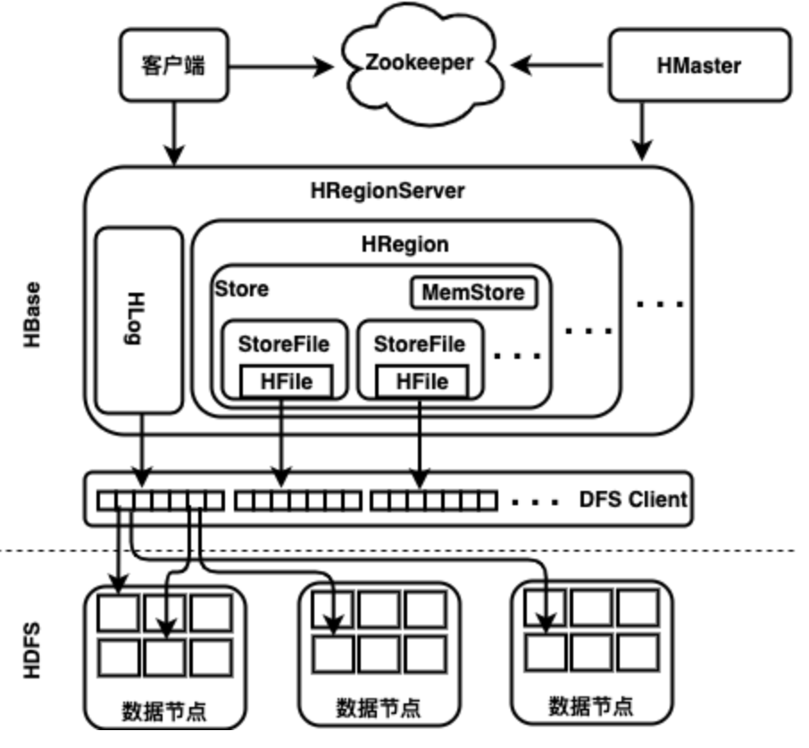
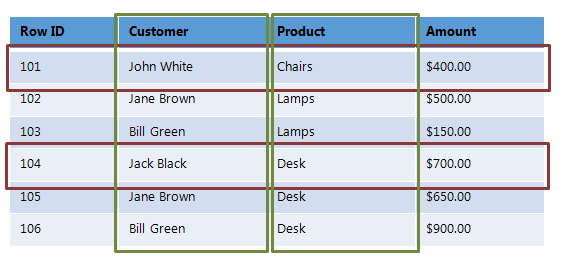

# 1.7 HBase技术

本节保留 HBase，主要是因为它在本书的实验环境和部分企业存量系统中仍然常见，尤其适合演示“Spark 负责计算、HBase 负责随机读写存储”的组合方式。对 Spark 4.x 新项目来说，HBase 不应被默认视为通用分析型存储；只有当业务明确需要低延迟键值访问、时间序列写入或在线查询补充时，它才是合适选择。

可以把 HBase 理解为 Hadoop 生态中的分布式列族数据库。它建立在 HDFS 之上，强调大规模数据上的随机读写、版本管理和按 Row Key 访问，与更偏离线分析的 Hive 或对象存储形成互补。除了 HBase，Cassandra、Dynamo 风格数据库等系统也都试图解决“大规模数据上的低延迟访问”问题。

从学习顺序看，本节的重点不是掌握 HBase 的全部运维细节，而是理解三个问题：它为什么存在、它在 Spark 体系里扮演什么角色、以及实验环境中如何完成最基本的表操作与读写验证。

图例 1‑8 HBase 读写访问

| HDFS                    | HBase                                            |
| ----------------------- | ------------------------------------------------ |
| HDFS是适于存储大容量文件的分布式文件系统。 | HBase是建立在HDFS之上的数据库。                             |
| HDFS不支持快速单独记录查找。        | HBase提供在较大的表快速查找                                 |
| 它提供了高延迟批量处理;没有批处理概念。    | 它提供了数十亿条记录低延迟访问单个行记录（随机存取）。                      |
| 它提供的数据只能顺序访问。           | HBase内部使用哈希表和提供随机接入，并且其存储索引，可将在HDFS文件中的数据进行快速查找。 |

表格 1‑3 Hbase和HDFS的比较

### 1.7.1 系统架构

HBase 的架构可以先抓住四个关键词：`HMaster`、`HRegionServer`、`Region` 和 `WAL/MemStore/HFile`。前两者负责集群管理与读写服务，Region 负责按 Row Key 范围切分数据，WAL 与 MemStore/HFile 共同构成写入落盘路径。理解这几个概念，就足够支撑后续 Spark + HBase 示例阅读。

图例 1‑9 HBase 的系统架构

HMaster 是 HBase 的管理节点进程，负责区域分配、故障转移和元数据维护。一个 HBase 集群通常会配置多个 HMaster，其中一个处于活动状态，其余作为备份节点。需要注意的是，HMaster 本身并不直接承担读写流量；真正处理数据请求的是 RegionServer。因此，即使 HMaster 暂时失效，已在线的数据读写在很多情况下仍可继续，只是表结构变更和部分元数据操作会受到影响。

RegionServer 才是 HBase 的一线数据服务进程。它负责承接读写请求、托管 HMaster 分配下来的 Region，并在 Region 过大时触发切分。对客户端来说，访问路径通常是“先通过 ZooKeeper 和元数据定位到目标 RegionServer，再直接与对应 RegionServer 通信”，而不是每次都经过 HMaster。写入数据时，RegionServer 会先把变更追加到 `WAL`，再写入各列族对应的 `MemStore`；当 MemStore 达到阈值或触发刷盘时，数据再落成 `HFile`。也就是说，一个 Region 下每个列族都会对应一个 `Store`，而每个 `Store` 内部会管理自己的 `MemStore` 与一组 `HFile`。从 Spark 读者的角度，记住这条路径就够了：`客户端 -> RegionServer -> WAL/MemStore -> HFile/HDFS`。

HBase 使用 ZooKeeper 进行区域分配、服务发现和分布式协调。当某个区域服务器失效时，系统会基于 ZooKeeper 中维护的注册与状态信息完成故障感知和区域重新分配。客户端在访问数据前，通常也需要借助 ZooKeeper 了解元数据位置，再进一步与对应的区域服务器通信。

从教学角度看，这里真正需要掌握的是三点：ZooKeeper 负责协调，HMaster 负责元数据与区域管理，RegionServer 负责实际读写服务。至于更细的系统表定位、故障恢复和多集群共享 ZooKeeper 等机制，理解它们有助于阅读存量平台文档，但在 Spark 4.x 主线学习里不必把它们当作核心能力展开。

### 1.7.2 存储机制

现在，看一下面向列的数据库与面向行与面向列的数据存储的数据结构和概念有何不同。如下所示，在面向行的数据存储中，行是一起读取或写入的数据单元，而面向列的数据存储中，列中的数据存储在一起，因此可以快速检索。

图例 1‑10 面向列的数据库与面向行的数据库

  - 面向行的数据存储

每次存储和检索数据一行，因此如果仅需要一行中的某些数据，则需要读取一行中其他不必要的数据；易于读取和写入记录，非常适合OLTP系统；执行操作整个数据集的效率不高，因此聚合是一项昂贵的操作；与面向列的数据存储相比，典型的压缩机制提供效果较差。

  - 面向列的数据存储

数据按列存储和检索，因此如果只需要一些数据，则只会读取相关数据；读和写操作通常较慢，非常适合OLAP系统；可以有效地执行适用于整个数据集的操作，因此可以对许多行和列进行聚合；由于列中的数据属于同一类型的值，因此允许较高的压缩率。

HBase中的数据模型旨可以容纳半结构化数据，其中的字段大小、数据类型和列是可以变化的。此外，数据模型的布局可以使数据分区以及在整个集群中分布更加容易。HBase中的数据模型由不同的逻辑组件组成，例如表、行、列族、列、单元格和版本。

图例 1‑11 HBase 列族

HBase表根据Row
Key的范围被水平拆分成若干个区域，每个区域都包含了这个区域的起始键和结束键之间的所有行。区域被分配给集群中区域服务器管理，由它们来负责处理数据的读写请求。HBase中的行是逻辑上的行，物理上模型上行是按列族分别存取的。HBase
表中的每个列都归属于某个列族，创建表时必须指定列族，必须在使用表之前定义。列名都以列族作为前缀，上表显示了Customer和Sales列族，Customer列族由2列组成（Customer:Name和Customer:City），而Sales列族由2列（Sales:Product和Sales:Amount）组成。每个列族都有一个以上的列，列族中的这些列一起存储在HFile的低级存储文件中。另外，某些HBase功能将应用于列族，例如访问控制、磁盘和内存的使用统计都是在列族层面进行的。在实际应用中，列族上的控制权限能用来管理不同类型的应用，例如允许一些应用可以添加新的基本数据；允许一些应用可以读取基本数据并创建继承的列族、允许一些应用则只浏览数据（甚至可能因为隐私的原因不能浏览所有数据）。因此，在设计表中的列族时必须注意这些问题。

HBase
中通过行和列确定的一个存储单元。每个存储单元都保存着同一份数据的多个版本，版本通过时间戳来索引，时间戳的类型是64位整型。时间戳可以由HBase（在数据写入时自动）赋值，此时时间戳是精确到毫秒的当前系统时间。时间戳也可以由用户显示赋值。如果应用程序要避免数据版本冲突，就必须自己生成具有唯一性的时间戳。每个存储单元中，不同版本的数据按照时间倒序排序，即最新的数据排在最前面。为了避免数据存在过多版本造成的管理负担（包括存储和索引），HBase
提供了两种数据版本回收方式，一是保存数据的最后N个版本，二是保存最近一段时间内的版本（比如最近七天），用户可以针对每个列族进行设置。存储单元唯一确定的格式为：

{row key, column(=\<family\> + \<label\>), version}

存储单元中的数据是没有类型的，全部是字节码形式存储。

Hbase读取数据的过程是客户端请求读取数据时，先转发到 Zookeeper 集群，在
Zookeeper集群中寻找到相对应的区域服务器，再找到对应的区域，先是查
MemStore，如果在MemStore中获取到数据，那么就会直接返回，否则就是再由 区域找到对应的Store
File，从而查到具体的数据。在整个架构中，HMaster 和 HRegionServer
可以是同一个节点上，可以有多个 HMaster 存在，但是只有一个 HMaster 在活跃。在客户端端会进行Row Key-\>
HRegion映射关系的缓存，降低下次寻址的压力。

HBase 写入数据的过程先是客户端进行发起数据的插入请求，如果客户端本身存储了关于Row
Key和区域的映射关系的话，那么就会先查找到具体的对应关系，如果没有的话，就会在Zookeeper集群中进行查找到对应区域服务器，然后再转发到具体的区域上。所有的数据在写入的时候先是记录在WAL中，同时检查关于MemStore是否满了，如果是满了那么就会进行刷盘，输出到一个
HFile 中，如果没有满的话那么就是先写进 MemStore 中，然后再刷到 WAL 中。

### 1.7.3 常用命令

本小节的目标是帮助读者在实验环境中熟悉 HBase Shell 的基本操作，而不是穷尽所有管理命令。掌握 `create / list / put / get / scan / disable / drop / truncate` 这一组核心命令，已经足够支撑后续教材中的演示与练习。

  - 通用命令

<!-- end list -->

  - > status: 提供HBase的状态，例如服务器的数量。

  - > version: 提供正在使用HBase版本。

  - > table\_help: 表引用命令提供帮助。

  - > whoami: 提供有关用户的信息。

<!-- end list -->

  - 数据定义语言，这些是关于HBase在表中操作的命令

<!-- end list -->

  - > create: 创建一个表。

  - > list: 列出HBase的所有表。

  - > disable: 禁用表。

  - > is\_disabled: 验证表是否被禁用。

  - > enable: 启用一个表。

  - > is\_enabled: 验证表是否已启用。

  - > describe: 提供了一个表的描述。

  - > alter: 改变一个表。

  - > exists: 验证表是否存在。

  - > drop: 从HBase中删除表。

  - > drop\_all: 丢弃在命令中给出匹配“regex”的表。

<!-- end list -->

  - 数据操纵语言

<!-- end list -->

  - > put: 添加或修改表的值。

  - > get: 获取行或存储单元格的内容。

  - > delete: 删除表中的存储单元格值。

  - > deleteall: 删除给定行的所有存储单元。

  - > scan: 扫描并返回表数据。

  - > count: 计数并返回表中的行的数目。

  - > truncate: 禁用、删除和重新创建一个指定的表。

可以先启动 HBase 服务，再进入交互式 `hbase shell` 熟悉最基础的表操作。如果本地环境已经正确安装并启动 HBase，终端通常会显示下面这样的提示信息：

root@spark:\~\# start-hbase.sh

running master, logging to /usr/local/hbase/logs/hbase--master-spark.out

OpenJDK 64-Bit Server VM warning: ignoring option PermSize=128m; support
was removed in 8.0

OpenJDK 64-Bit Server VM warning: ignoring option MaxPermSize=128m;
support was removed in 8.0

root@spark:\~\# hbase shell

2018-06-01 08:10:42,085 WARN \[main\] util.NativeCodeLoader: Unable to
load native-hadoop library for your platform... using builtin-java
classes where applicable

HBase Shell

Use "help" to get list of supported commands.

Use "exit" to quit this interactive shell.

Version 1.4.4, rfe146eb48c24d56dbcd2f669bb5ff8197e6c918b, Sun Apr 22
20:42:02 PDT 2018

hbase(main):001:0\>

代码 1‑12

在交互式 shell 中，可以随时输入 `exit` 或使用 `<Ctrl + C>` 退出。继续之前，先用 `list` 看看当前实例里有哪些表；这也是验证 HBase 是否已经正常工作的最直接方式之一。一个最小示例如下：

hbase(main):001:0\> list

TABLE

sensor

1 row(s) in 0.4410 seconds

\=\> \["sensor"\]

hbase(main):002:0\>

代码 1‑13

#### 1.7.3.1 创建表

在 HBase shell 中创建表时，至少要指定表名和列族名。下面用一个名为 `Order` 的示例表演示最小建表方式，其中包含 `Customer` 和 `Sales` 两个列族。

| **Row Key** | **Customer** | **Sales** |         |          |
| ----------- | ------------ | --------- | ------- | -------- |
| Customer Id | Name         | City      | Product | Price    |
| 101         | John White   | Beijing   | Chairs  | 400.00   |
| 102         | Jane Brown   | Shanghai  | Lamps   | 200.00   |
| 103         | Bill Green   | Shenzhen  | Desk    | 500.00   |
| 104         | Jack Black   | Guangzhou | Bed     | 16000.00 |

表格 1‑4 HBase 列族

在HBase shell创建该表如下所示：

hbase(main):001:0\> create 'order', 'Customer', 'Sales'

0 row(s) in 1.7090 seconds

\=\> Hbase::Table – order

命令 1.31

建表完成后，可以再次执行 `list` 确认结果；如果成功，输出中就能看到刚创建的 `order` 表：

hbase(main):012:0\> list

TABLE

emp

order

2 row(s)

Took 0.0157 seconds

\=\> \["emp", "order"\]

命令 1.32

#### 1.7.3.2 禁用表

要删除表或改变其设置，首先需要使用 disable 命令关闭表。使用 enable 命令，可以重新启用它，下面给出的语法是用来禁用一个表：

hbase(main):003:0\> disable 'order'

0 row(s) in 2.4570 seconds

命令 1.33

禁用表之后，仍然可以通过 list 和exists命令查看到。无法扫描到它存在，它会给下面的错误。

hbase(main):004:0\> scan 'order'

ROW COLUMN+CELL

ERROR: order is disabled.

命令 1.34

`is_disabled` 用来检查表是否处于禁用状态。下面这组命令用 `order` 表做演示：如果表已经禁用，会返回 `true`；否则返回 `false`。

hbase(main):005:0\> is\_disabled 'order'

true

0 row(s) in 0.0180 seconds

命令 1.35

disable\_all此命令用于禁用所有匹配给定正则表达式的表，假设有5个表在HBase，即order01、order02、order03、order04
和order05，下面的代码将禁用所有以order开始的表。

hbase(main):002:0\> disable\_all 'order.\*'

order01

order02

order03

order04

order05

Disable the above 5 tables (y/n)?

y

5 tables successfully disabled

命令 1.36

#### 1.7.3.3 启用表

给出下面是一个例子，使一个表启用。

hbase(main):005:0\> enable 'order'

0 row(s) in 0.4580 seconds

命令 1.37

启用表之后，扫描。如果能看到的模式，那么证明表已成功启用。

hbase(main):006:0\> scan 'order'

ROW COLUMN+CELL

1 column=Customer:Name, timestamp=1417516501, value=小明

1 column=Customer:City, timestamp=1417525058, value=北京

1 column=Sales:Product, timestamp=1417532601, value=椅子

命令 1.38

is\_enabled此命令用于查找表是否被启用，下面的代码验证表order是否启用，如果启用，它将返回true，如果没有，它会返回false。

hbase(main):031:0\> is\_enabled 'order'

true

0 row(s) in 0.0440 seconds

命令 1.39

#### 1.7.3.4 增删改

要在HBase表中创建的数据，可以使用put命令。作为一个例子，将在HBase中创建下表。

| **Row Key** | **Customer** | **Sales** |         |          |
| ----------- | ------------ | --------- | ------- | -------- |
| Customer Id | Name         | City      | Product | Price    |
| 101         | John White   | Beijing   | Chairs  | 400.00   |
| 102         | Jane Brown   | Shanghai  | Lamps   | 200.00   |
| 103         | Bill Green   | Shenzhen  | Desk    | 500.00   |
| 104         | Jack Black   | Guangzhou | Bed     | 16000.00 |

表格 1‑5 HBase 列族

使用put命令，可以插入行到一个表，将第一行的值插入到order表如下所示。

hbase(main):026:0\> put 'order','101','Customer:Name','John White'

Took 0.0106 seconds

hbase(main):027:0\> put 'order','101','Customer:City','Beijing'

Took 0.0057 seconds

hbase(main):028:0\> put 'order','101','Sales:Product','Chairs'

Took 0.0061 seconds

hbase(main):029:0\> put 'order','101','Sales:Price','400.00'

Took 0.0063 seconds

命令 1.40

以相同的方式使用put命令插入剩余的行。如果插入完成整个表格，会得到下面的输出。

hbase(main):030:0\> scan 'order'

ROW COLUMN+CELL

101 column=Customer:City, timestamp=1582443891708, value=Beijing

101 column=Customer:Name, timestamp=1582443884829, value=John White

101 column=Sales:Price, timestamp=1582443903201, value=400.00

101 column=Sales:Product, timestamp=1582443897589, value=Chairs

102 column=Customer:City, timestamp=1582443891708, value=Shanghai

102 column=Customer:Name, timestamp=1582443884829, value=Jane Brown

102 column=Sales:Price, timestamp=1582443903201, value=200.00

102 column=Sales:Product, timestamp=1582443897589, value=Lamps

103 column=Customer:City, timestamp=1582443891708, value=Shenzhen

103 column=Customer:Name, timestamp=1582443884829, value=Bill Green

103 column=Sales:Price, timestamp=1582443903201, value=500.00

103 column=Sales:Product, timestamp=1582443897589, value=Desk

104 column=Customer:City, timestamp=1582443891708, value=Guangzhou

104 column=Customer:Name, timestamp=1582443884829, value=Jack Black

104 column=Sales:Price, timestamp=1582443903201, value=16000.00

104 column=Sales:Product, timestamp=1582443897589, value=Bed

4 row(s)

命令 1.41

可以使用put命令更新现有的单元格值，假设HBase中有一个表order拥有下列数据

hbase(main):003:0\> scan 'order'

ROW COLUMN+CELL

104 column=Customer:City, timestamp=1582443891708, value=Guangzhou

104 column=Customer:Name, timestamp=1582443884829, value=Jack Black

104 column=Sales:Price, timestamp=1582443903201, value=16000.00

104 column=Sales:Product, timestamp=1582443897589, value=Bed

1 row(s) in 0.0100 seconds

命令 1.42

以下命令将更新名为Jack Black客户的城市值为Chongqing。

hbase(main):002:0\> put 'order','104','Customer:City','Chongqing'

0 row(s) in 0.0400 seconds

更新后的表如下所示，观察这个城市Guangzhou的值已更改为Chongqing。

hbase(main):003:0\> scan 'order'

ROW COLUMN+CELL

104 column=Customer:City, timestamp=1582444875119, value=Chongqing

104 column=Customer:Name, timestamp=1582443884829, value=Jack Black

104 column=Sales:Price, timestamp=1582443903201, value=16000.00

104 column=Sales:Product, timestamp=1582443897589, value=Bed

1 row(s) in 0.0100 seconds

命令 1.43

`get` 命令用于按 Row Key 读取单行数据。下面用 `order` 表中键为 `101` 的记录演示最基本的读取方式。

hbase(main):040:0\> get 'order', '101'

COLUMN CELL

Customer:City timestamp=1582443891708, value=Beijing

Customer:Name timestamp=1582443884829, value=John White

Sales:Price timestamp=1582443903201, value=400.00

Sales:Product timestamp=1582443897589, value=Chairs

1 row(s)

Took 0.0374 seconds

命令 1.44

下面给出的示例，是用于读取HBase表中的特定列。

hbase(main):042:0\> get 'order', '101', {COLUMN=\>'Customer:Name'}

COLUMN CELL

Customer:Name timestamp=1582443884829, value=John White

1 row(s)

Took 0.0239 seconds

命令 1.45

使用 delete 命令，可以在一个表中删除特定单元格，下面是一个删除特定单元格的例子，在这里删除City：

hbase(main):006:0\> delete 'order', '101', 'Customer:City',

1417521848375

0 row(s) in 0.0060 seconds

命令 1.46

使用deleteall命令，可以删除一行中所有单元格，这里是使用deleteall命令删去 order表中101行的所有单元。

hbase(main):007:0\> deleteall 'order','101'

0 row(s) in 0.0240 seconds

命令 1.47

使用scan命令验证表，表被删除后的快照如下。

hbase(main):022:0\> scan 'order'

ROW COLUMN+CELL

102 column=Customer:City, timestamp=1582443891708, value=Shanghai

102 column=Customer:Name, timestamp=1582443884829, value=Jane Brown

102 column=Sales:Price, timestamp=1582443903201, value=200.00

102 column=Sales:Product, timestamp=1582443897589, value=Lamps

103 column=Customer:City, timestamp=1582443891708, value=Shenzhen

103 column=Customer:Name, timestamp=1582443884829, value=Bill Green

103 column=Sales:Price, timestamp=1582443903201, value=500.00

103 column=Sales:Product, timestamp=1582443897589, value=Desk

104 column=Customer:City, timestamp=1582443891708, value=Guangzhou

104 column=Customer:Name, timestamp=1582443884829, value=Jack Black

104 column=Sales:Price, timestamp=1582443903201, value=16000.00

104 column=Sales:Product, timestamp=1582443897589, value=Bed

3 row(s)

命令 1.48

#### 1.7.3.5 其他

describe该命令返回表的说明，下面给出的是order表的 describe 命令的输出。

describe 'order'

Table order is ENABLED

order

COLUMN FAMILIES DESCRIPTION

{NAME =\> 'Customer', VERSIONS =\> '1', EVICT\_BLOCKS\_ON\_CLOSE =\>
'false', NEW\_VERSION\_BEHAVIOR =\> 'false', KEEP\_DELETED\_CELLS =\>
'FALSE', CACHE\_DATA\_ON\_WRITE =\>

'false', DATA\_BLOCK\_ENCODING =\> 'NONE', TTL =\> 'FOREVER',
MIN\_VERSIONS =\> '0', REPLICATION\_SCOPE =\> '0', BLOOMFILTER =\>
'ROW', CACHE\_INDEX\_ON\_WRITE =\> 'false

', IN\_MEMORY =\> 'false', CACHE\_BLOOMS\_ON\_WRITE =\> 'false',
PREFETCH\_BLOCKS\_ON\_OPEN =\> 'false', COMPRESSION =\> 'NONE',
BLOCKCACHE =\> 'true', BLOCKSIZE =\> '6553

6'}

{NAME =\> 'Sales', VERSIONS =\> '1', EVICT\_BLOCKS\_ON\_CLOSE =\>
'false', NEW\_VERSION\_BEHAVIOR =\> 'false', KEEP\_DELETED\_CELLS =\>
'FALSE', CACHE\_DATA\_ON\_WRITE =\> 'f

alse', DATA\_BLOCK\_ENCODING =\> 'NONE', TTL =\> 'FOREVER',
MIN\_VERSIONS =\> '0', REPLICATION\_SCOPE =\> '0', BLOOMFILTER =\>
'ROW', CACHE\_INDEX\_ON\_WRITE =\> 'false',

IN\_MEMORY =\> 'false', CACHE\_BLOOMS\_ON\_WRITE =\> 'false',
PREFETCH\_BLOCKS\_ON\_OPEN =\> 'false', COMPRESSION =\> 'NONE',
BLOCKCACHE =\> 'true', BLOCKSIZE =\> '65536'}

2 row(s)

QUOTAS

0 row(s)

Took 0.1444 seconds

命令 1.49

`alter` 用于修改现有表的结构或属性，例如调整列族的最大版本数、设置表级参数，或者删除列族。下面这组命令先演示把单元版本数上限设置为 `5`。

hbase(main):044:0\> alter 'order', NAME =\> 'Customer', VERSIONS =\> 5

Updating all regions with the new schema...

1/1 regions updated.

Done.

Took 2.0384 seconds

命令 1.50

`alter` 也可以设置或删除表级选项，例如 `MAX_FILESIZE`、`READONLY`、`MEMSTORE_FLUSHSIZE`、`DEFERRED_LOG_FLUSH` 等。下面的命令把 `order` 表设置为只读。

hbase(main):045:0\> alter 'order', READONLY

Updating all regions with the new schema...

1/1 regions updated.

Done.

Took 2.0662 seconds

命令 1.51

下面给出的是一个例子，从order表中删除列族。假设在HBase中有一个order表，包含以下数据：

hbase(main):046:0\> scan 'order'

ROW COLUMN+CELL

101 column=Customer:City, timestamp=1582443891708, value=Beijing

101 column=Customer:Name, timestamp=1582443884829, value=Jone White

101 column=Sales:Price, timestamp=1582443903201, value=400.00

101 column=Sales:Product, timestamp=1582443897589, value=Chairs

104 column=Customer:City, timestamp=1582444875119, value=Chongqing

2 row(s)

Took 0.0213 seconds

命令 1.52

现在使用alter命令删除指定的 Sales 列族。

hbase(main):047:0\> alter 'order','delete'=\>'Sales'

Updating all regions with the new schema...

1/1 regions updated.

Done.

Took 1.9196 seconds

命令 1.53

现在验证该表中变更后的数据，观察到列族Sales也没有了，因为前面已经被删除了。

hbase(main):048:0\> scan 'order'

ROW COLUMN+CELL

101 column=Customer:City, timestamp=1582443891708, value=Beijing

101 column=Customer:Name, timestamp=1582443884829, value=Jone White

104 column=Customer:City, timestamp=1582444875119, value=Chongqing

2 row(s)

Took 0.0092 seconds

命令 1.54

可以使用 `exists` 检查表是否存在，下面给出最小示例。

hbase(main):024:0\> exists 'order'

Table order does exist

0 row(s) in 0.0750 seconds

hbase(main):015:0\> exists 'student'

Table student does not exist

0 row(s) in 0.0480 seconds

命令 1.55

用drop命令可以删除表，在删除一个表之前必须先将其禁用。

hbase(main):018:0\> disable 'order'

0 row(s) in 1.4580 seconds

hbase(main):019:0\> drop 'order'

0 row(s) in 0.3060 seconds

命令 1.56

使用exists 命令验证表是否被删除。

hbase(main):020:0\> exists 'order'

Table emp does not exist

0 row(s) in 0.0730 seconds

drop\_all

命令 1.57

可以使用count命令计算表的行数量。

hbase(main):023:0\> count 'order'

2 row(s) in 0.090 seconds

\=\> 2

命令 1.58

truncate命令将禁止删除并重新创建一个表，下面给出是 truncate 命令的例子：

hbase(main):011:0\> truncate 'order'

Truncating 'one' table (it may take a while):

\- Disabling table...

\- Truncating table...

0 row(s) in 1.5950 seconds

命令 1.59

使用scan 命令来验证，会得到表的行数为零。

hbase(main):017:0\> scan 'order'

ROW COLUMN+CELL

0 row(s) in 0.3110 seconds

命令 1.60

可以通过键入exit命令退出交互程序。

hbase(main):021:0\> exit

命令 1.61

要停止HBase键入以下命令。

stop-hbase.sh

命令 1.62
