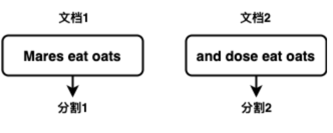
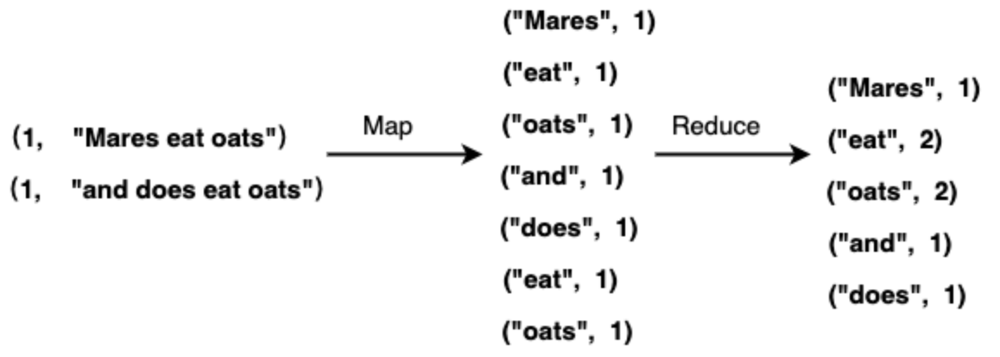
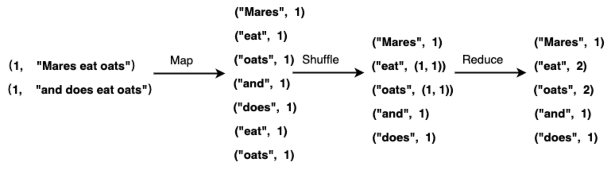
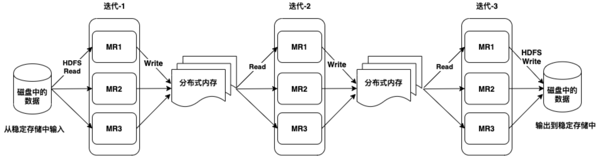
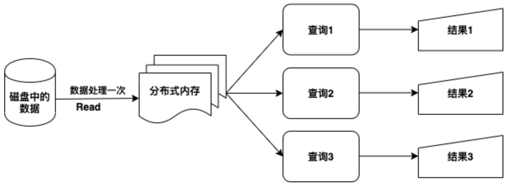
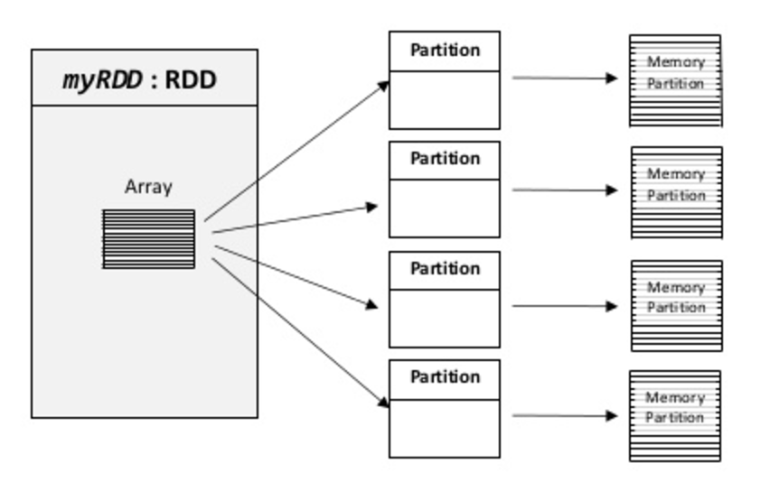
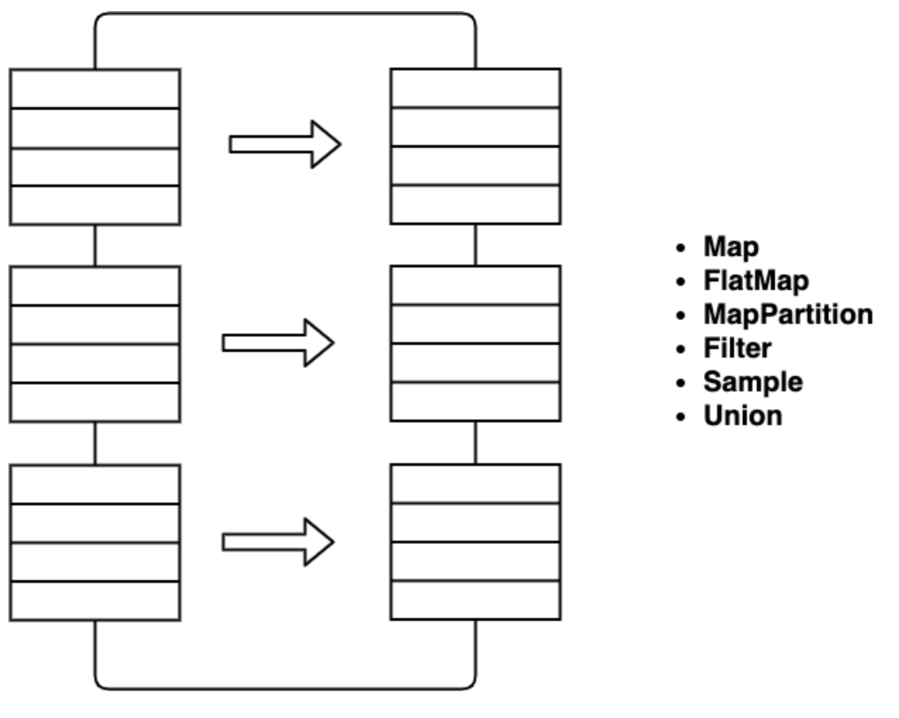
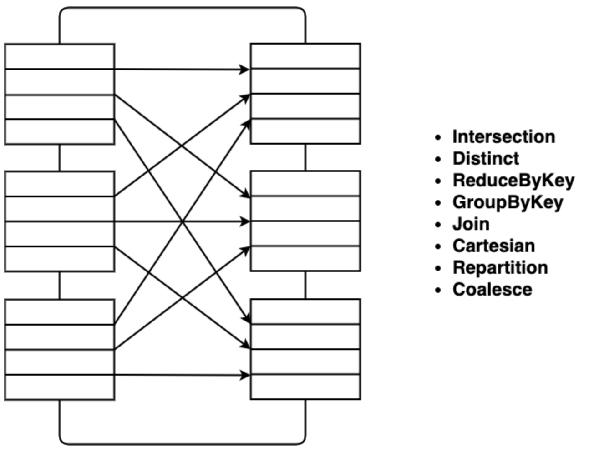
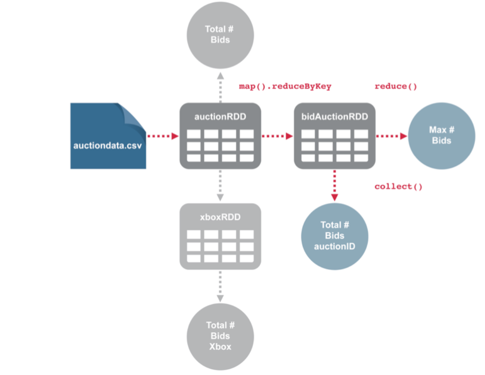

# 理解Spark

## 本章先看懂什么
- Driver、Executor、Task 的职责分工。
- 为什么会有 Stage 划分和 Shuffle。
- 哪些操作会触发真正执行（Action）。

## 一个最小例子
代码：`rdd.map(...).filter(...).count()`
- `map/filter` 只记录计算计划（惰性）。
- `count` 才触发任务提交。
- 如果中间有 `groupByKey`，通常会看到 Shuffle 阶段。

先把“计划”和“执行”分开理解，后续调优会更容易。

> **版本基线（更新于 2026-02-13）**
> 本书默认适配 Apache Spark 4.1.1（稳定版），并兼容 4.0.2 维护分支。
> 推荐环境：JDK 17+（建议 JDK 21）、Scala 2.13、Python 3.10+。
从较高级别来看，每个Spark应用程序都包含一个驱动程序，该程序运行用户的主要功能并在集群上执行各种并行操作。Spark运行框架包括了一些重要的概念用来实现独特的数据处理机制。Spark首先提供的抽象概念是弹性分布式数据集（Resilient
Distributed
Dataset，RDD），是跨集群节点划分的元素集合，可以并行操作。可以通过读取存在于Hadoop文件系统（或任何其他Hadoop支持的文件系统）的文件或驱动程序中现有的Scala集合，Spark可以将其进行转换来创建RDD。用户还可以要求Spark将RDD持久存储在内存中，从而使其可以在并行操作中高效地重用，最后RDD会自动从数据存储节点故障中恢复。Spark中的第二个抽象概念是可以在并行操作中使用的共享变量。默认情况下，当Spark作为一组任务在不同节点上并行运行一个函数时，它会将函数中使用的每个变量的副本传送给每个任务。有时，需要在任务之间或任务与驱动程序之间共享变量。Spark支持两种类型的共享变量：广播变量可用于在所有节点上的内存中缓存值；累加器是仅做加法的变量，可以用作计数和求和。这里提到地共享变量的概念会在后面的章节中介绍。

另外，Spark基于弹性分布式数据集支持两种类型的操作：一种类型为转换(Transformation)，可以通过改变现有的数据集的结构创建新的数据集；另一种类型为动作（Action），可以在数据集上进行计算，然后返回结果到驱动程序。例Spark的函数库中，map(func)就是一个转换操作，将每一个数据集元素传递给一个函数func并且返回一个新的
数据集。另一方面，reduce(func)是一个动作，使用函数func对数据集上所有元素进行聚合计算，并且将最终的结果返回到驱动程序。

在Spark中，所有的转换都是延迟进行处理的，这说明转换操作不是会马上在数据集上进行操作而获得结果，相反的它们仅仅记录进行转换操作需要执行哪些步骤，并且Spark可以这些步骤进行优化。只有当执行动作操作需要将结果返回给驱动程序的时候，这些记录的转换过程才会被Spark实际执行。这个设计能够让Spark运行得更加高效，可以实现通过转换创建新数据集，并且仅仅需要将计算结果传递到驱动程序是才会执行相应的动作，尤其对于基于大数据的分析操作，应该避免将全部的数据集返回到驱动程序，可以减少出现硬件系统的内存和网络问题，一般来说需要将非常大的数据集进行聚合后进行传递。

默认情况下，每一个转换过的数据集会在每次执行动作的时候重新计算一次，然而也可以使用persist()或cache()方法持久化一个数据集到内存中。在这个情况下，Spark会在集群上保存数据集的相关元素，在下次查询的时候直接中内存中调用会变得更快。考虑到内存的容量有限，也可以将同样的数据集持久化到磁盘中，这个可能是基于Hadoop文件系统的多个节点间复制。

## 数据处理

随着互联网的持续发展,我们可收集获取的数据规模在不断增长.尽管数据的收集存储技术还在进步和日趋成熟，但是如何处理如此庞大的数据成为了新的研究问题。在分布式系统出现之前，只有通过不断增加单个处理机的频率和性能来缩短数据的处理时间，而分布式的提出则打破了这个传统的约束。所谓分布式就是将一个复杂的问题切割成很多子任务，分布到多台机器上并行处理。在保证系统稳定性的同时，最大限度地提高系统的运行速度。

谷歌在2004年提出了最原始的分布式架构模型
MapReduce，用于大规模的数据并行处理。MapReduce模型借鉴了函数式程序设计语言中的内置函数
Map 和 Reduce，主要思想是将大规模数据处理作业拆分成多个可独立运行的 Map
任务，分布到多个处理机上运行，产生一定量的中间结果，再通过
Reduce 任务混洗合并产生最终的输出文件。作为第一代分布式架构，MapReduce
已经比较好地考虑了数据存储、调度、通信、容错管理、负载均衡等很多问题，一定程度上降低了并行程序开发难度，也为后来的分布式系统的开发打下了很好的基础。然而它也存在很多不足：首先为了保证较好的可扩展性，MapReduce
的任务之间相互独立互不干扰，所造成的后果便是大量的中间结果需要通过网络进行传输，占用了网络资源，并且为了保证容错，所有的中间结果都要存储到磁盘中，效率不高；同时在
MapReduce 中只有等待所有的 Map 任务结束后，Reduce 任务才能进行计算，异步性差，导致资源利用率低。

Spark作为新一代的大数据处理框架，以其先进的设计理念迅速成为热点。在处理迭代问题以及一些低延迟问题上，Spark 性能要高于
MapReduce。Spark 在 MapReduce 的基础上做了很多的改进与优化，使得在处理如机器学习以及图算法等迭代问题时，Spark
性能要优于MapReduce。Spark 作为轻量、基于内存计算的分布式计算平台，采用了与 MapReduce
类似的编程模型，使用弹性分布式数据集对作业调度、数据操作和存取进行修改，并增加了更丰富的算子，使得
Spark 在处理迭代问题、交互问题以及低延时问题时能有更高的效率。

本章首先介绍 MapReduce的背景、具体的模型结构以及作业的调度策略，然后介绍
Spark模型的具体思想以及与MapReduce的区别，接下来介绍了弹性分布式数据集的概念以及基本操作。

### MapReduce

MapReduce是一种编程模型，利用集群上的并行和分布式算法处理和产生大数据。MapReduce程序包括两个部分：第一个部分由Map过程组成，该过程执行过滤和排序，例如按产品的类别进行分类，每个分类形成一组；第二部分为reduce过程，该过程执行摘要操作，例如计算每组中产品的个数，生成分类的汇总。MapReduce系统，也称为基础结构或框架，基于分布式服务器并行运行各种任务和管理系统各个部分之间的通信和数据传输，并提供冗余和容错来协调处理过程。

MapReduce模型是一个特定的知识领域，应用（拆分-应用-组合）策略进行数据分析。这种策略的灵感来源于函数编程的常用功能map和reduce。MapReduce模型的Map和Reduce函数都是针对键值对(key,
value)数据结构定义的。Map会在数据域中获取一对具有某种类型的数据，并经过数据结构的转换返回键值对列表：

Map(k1,v1) → list(k2,v2)

Map方法并行应用于输入数据集中的每一键值对，以k1为键；每次调用将产生一个成对列表list(k2,v2)，以k2为键；之后从所有列表中收集具有相同键（k2）的所有键值对，并将它们分组在一起，为每个k2创建一个组(k2,
list (v2))；将其作为Reduce函数输入，然后将Reduce函数并行应用于每个组，生成值的聚合：

Reduce(k2, list (v2)) → list((k3, v3))

尽管允许一个调用返回多个键值对，但是每个Reduce调用通常会产生一个键值对或空返回，所有调用的返回将被收集为所需的结果列表list((k3,
v3))，因此MapReduce模型将键值对的列表转换为键值对的另一个列表。

另外，为了更好的理解MapReduce模型的概念，通过示例讲解计算一组文本文件中每个单词的出现次数。在这个例子中，输入数据集是两个文档，包括文档1和文档2，所以数据集分每个文档为一个分割，总共2个分割：

图例 4‑2分割文件

将输入文档中的每一行生成键值对，其中行号键而文本为值。Map阶段丢弃行号，并将输入行中的每个单词生成一个键值对，其中单词为键而1为值表示这个单词出现一次。Reduce阶段生成新的键值对，其中单词为键而值为这个单词个数汇总，根据上面显示的输入数据，示例Map和Reduce的工作进程为：

图例 4‑3 Map和Reduce的工作进程

Map阶段的输出包含多个具有相同键的键值对，例如oats和eat出现两次，Reduce的工作就是对键值对的值进行聚合。如果在进入Reduce阶段之前，加入洗牌（Shuffle）的过程，使得具有相同键的值合并为一个列表，例如("eat",
(1, 1))，因此进行Reduce的输入实际上是键值对(key，value
list)。因此，从Map输出到Reduce，然后到最终结果的完整过程是：

图例 4‑4Shuffle过程

为了实现MapReduce模型，如果只是实现了Map和Reduce的抽象概念对于分布式系统是不够的，需要一种方法来连接执行Map和Reduce阶段的流程。Apache
Hadoop包含一个流行的，支持分布式洗牌的开源MapReduce实现。MapReduce
库已经用许多编程语言编写，并具有不同的优化级别。但是在Hadoop的MapReduce框架中，这两个功能与其原始形式发生了变化。MapReduce框架的主要贡献不是仅仅实现了的map和reduce方法，而是通过优化执行引擎实现各种应用程序的可伸缩性和容错能力。因此，MapReduce
的单线程实现通常不会比传统的非MapReduce实现快，通常只有在多处理器服务器系统上实现多线程处理才能看到其优势。优化的分布式洗牌操作可以降低网络通信成本，结合MapReduce框架的容错功能，使用此模型才可以发挥有利的作用。所以，对于优良的MapReduce算法而言，优化通信成本至关重要。

目前，MapReduce框架是一个用于在Hadoop集群中并行处理大型数据集的框架，使用Map和Reduce两步过程进行数据分析。作业（Job）配置提供Map和Reduce分析功能，Hadoop框架提供调度、分发和并行服务。在MapReduce中的顶级工作单元是作业，每个作业通常有一个Map和一个Reduce阶段，有时候Reduce阶段可以省略。假设一个MapReduce的作业，它计算每个单词在一组文档中使用的次数。Map阶段对每个文档中的单词进行计数，然后Reduce阶段将每个文档数据聚合为跨越整个集合的单词计数。在Map阶段，输入数据被进行分割，以便在Hadoop集群中运行并行Map任务进行分析。默认情况下，MapReduce框架从Hadoop分布式文件系统（HDFS）获取输入数据。Reduce阶段将来自Map任务的结果作为输入送到Reduce任务。Reduce任务将数据整合到最终结果中。默认情况下，MapReduce框架将结果存储在HDFS中。

实际上，Spark也是基于Map和Reduce上的集群计算框架，但其最大的特点可以通过将数据保存在内存中，使Map和Reduce的运行速度比MapReduce快40多倍，并且可以交互式使用，以便以亚秒级的时间间隔查询大型数据集。随着企业开始将更多数据加载到Hadoop中，他们很快就想运行丰富的应用程序，MapReduce的单通批处理模型不能有效支持，特别是用户想要运行：

  - 更复杂的递归算法，例如机器学习和图形处理中常见的迭代算法

  - 更多交互式即席查询来探索数据

虽然这些应用程序最初看起来可能完全不同，但核心问题是多路径和交互式应用程序，这需要跨多个MapReduce步骤共享数据，例如来自用户的多个查询或迭代计算的多个步骤。但是在MapReduce的并行操作之间共享数据的唯一方法是将其写入分布式文件系统，由于数据复制和磁盘I/O，这会增加大量开销。事实上，这种开销可能会占用MapReduce的通用机器学习算法运行时间的90％以上。

### 工作机制

现在可以通过比较一下MapReduce和Spark数据处理的方式，来理解Spark的运行机制。大数据的处理方式包括两种：批处理和流处理。批处理对于大数据处理至关重要，用最简单的术语来说，批处理可以在处理一段时间内收集的大量数据。在批处理中，首先收集数据，然后在以后的阶段中生成处理结果。批处理是处理大型静态数据集的有效方法。通常，我们对存档的数据集执行批处理。例如，计算一个国家的平均收入或评估过去十年中电子商务的变化。流处理是目前大数据处理的发展趋势，每小时需要的是处理速度和实时信息，这就是流处理所要做的。批处理不允许业务对实时变化的业务需求做出快速反应，流处理的需求迅速增长。

回顾Hadoop数据处理架构，其中的YARN基本上是一个批处理框架。当我们向YARN提交作业时，它会从集群读取数据，执行操作并将结果写回到集群，然后YARN再次读取更新的数据，执行下一个操作并将结果写回到群集中，依此类推。Spark执行类似的操作，但是它使用内存处理并优化了步骤。另外，Spark的GraphX组件允许用户查看与图和集合相同的数据，用户还可以使用RDD转换和联接图形。

Hadoop和Spark均提供容错能力，但是两者都有不同的方法。对于HDFS和YARN，主守护程序（即分别为NameNode和ResourceManager）都检查从守护程序（即分别为DataNode和NodeManager）的心跳。如果任何从属守护程序发生故障，则主守护程序会将所有挂起和正在进行的操作重新计划到另一个从属。这种方法是有效的，但是它也可以显着增加单个故障操作的完成时间。Hadoop一般使用大量的，低成本的硬件组成集群，所以HDFS确保容错的另一种方法是在集群中复制数据。如上所述，RDD是Apache
Spark的核心组件，为Spark提供容错能力，可以引用外部存储系统，例如HDFS、HBase和共享文件系统，中存在的任何数据集实现并行操作。Spark通过提供RDD的分布式存储框架来解决计算过程中数据的缓存和传递。RDD可以将数据集持久存储在内存中，所以Spark的数据操作是基于内存的。Spark可以跟踪和记录从原始数据到最终结果的计算过程，如果RDD中的数据丢失可以重新计算。RDD允许用户跨越查询将数据存储在内存中，并提供容错功能而无需复制。这使RDD的读取和写入速度比典型的分布式文件系统快，所以在RDD核心组件上构建地应用组件可以实现更快地运行。

Hadoop最适合的用例是分析存档数据。YARN允许并行处理大量数据。数据的一部分在不同的DataNode上并行处理，并从每个NodeManager收集结果。如果不需要即时结果。MapReduce框架是批处理的一种很好且经济的解决方案。Spark最适合的用例是实时大数据分析。实时数据分析意味着处理由实时事件流生成的数据，这些数据以每秒数百万个事件的速度进入，例如某些社交媒体的数据。Spark的优势在于它能够支持数据流以及分布式处理。这是一个有用的组合，可提供近乎实时的数据处理。实时数据也可以在MapReduce上进行处理，但是MapReduce旨在对大量数据执行分布式批处理，这个特点使其实时处理速度远远不能满足Spark的要求。Spark声称处理数据的速度比MapReduce快100倍，如果基于磁盘也要快10倍。

大多数图处理算法（例如网页排名算法）需要对同一数据集执行多次迭代计算，这需要在迭代计算之间的消息传递机制。我们需要基于MapReduce框架进行编程，以处理对相同数据集的多次迭代。大致来说，它的工作步骤是先从磁盘读取数据，并在特定的迭代之后将结果写入HDFS，然后从HDFS读取数据以进行下一次迭代。这是非常低效的，因为它涉及读取和写入数据到磁盘，这涉及大量读写操作以及跨群集的数据复制以实现容错能力。而且每个MapReduce迭代都具有很高的延迟，并且下一个迭代只能在之前的作业完全完成之后才能开始。同样，消息传递需要相邻节点的分数，以便评估特定节点的分数。这些计算需要来自其邻居的消息或跨作业多个阶段的数据，而MapReduce缺乏这种机制。为了满足对图处理算法的高效平台的需求，设计了诸如Pregel和GraphLab之类的不同图处理工具。这些工具快速且可扩展，但对于这些复杂的多阶段算法的创建和后续处理效率不高。Apache
Spark的引入在很大程度上解决了这些问题。Spark包含一个称为GraphX的图计算库，可简化我们的工作。与传统的MapReduce程序相比，内存中的计算以及内置的图形支持将算法的性能提高了1到2倍。Spark使用Netty和Akka的组合在整个执行程序中分发消息。图例
4‑4给出了Spark的迭代操作示意，它将中间结果存储在分布式存储器中（内存），而不是存储在磁盘中，并使应用系统更快的运行。

图例 4‑4Spark的迭代操作

另外，几乎所有的机器学习算法都是基于迭代计算的工作机制。如前所述，迭代算法在MapReduce实现中涉及磁盘读写瓶颈。MapReduce使用的粗粒度任务（即任务级并行处理）对于迭代算法而言过于繁重。在统一资源调度与内存计算机制的帮助下，Spark会在每次迭代后缓存中间数据集，并在此缓存的数据集上运行多次迭代，从而减少磁盘读写，并有助于以容错的方式更快地运行算法。Spark有一个内置可扩展的机器学习库MLlib，其中包含高质量的算法，该算法利用迭代并产生比MapReduce使用时间更少的效果。Spark另一个功能是交互式分析界面，将Spark的运行结果立即提供给用户，无需集成开发工具和代码编译。此功能可以作为交互式探索数据的主要工具，也可以对正在开发的应用程序进行分部测试。下面代码显示了一个Spark
shell，用户在其中加载一个文件，然后计算文件的行数。

root@bb8bf6efccc9:\~\# spark-shell

20/02/27 13:55:07 WARN NativeCodeLoader: Unable to load native-hadoop
library for your platform... using builtin-java classes where applicable

Using Spark's default log4j profile:
org/apache/spark/log4j-defaults.properties

Setting default log level to "WARN".

To adjust logging level use sc.setLogLevel(newLevel). For SparkR, use
setLogLevel(newLevel).

Spark context Web UI available at http://bb8bf6efccc9:4040

Spark context available as 'sc' (master = local\[\*\], app id =
local-1582811713758).

Spark session available as 'spark'.

Welcome to

\_\_\_\_ \_\_

/ \_\_/\_\_ \_\_\_ \_\_\_\_\_/ /\_\_

\_\\ \\/ \_ \\/ \_ \`/ \_\_/ '\_/

/\_\_\_/ .\_\_/\\\_,\_/\_/ /\_/\\\_\\ version 4.1.1

/\_/

Using Scala version 2.13.16 (OpenJDK 64-Bit Server VM, Java 17)

Type in expressions to have them evaluated.

Type :help for more information.

scala\> val auctionRDD = sc.textFile("/data/auctiondata.csv")

auctionRDD: org.apache.spark.rdd.RDD\[String\] = /data/auctiondata.csv
MapPartitionsRDD\[1\] at textFile at \<console\>:24

scala\> auctionRDD.count

res0: Long = 10654

代码 4.1

如本示例所示，Spark可以从文件中读取和写入数据，然后通过在内存中缓存数据集，用户可以交互地执行各种各样的复杂计算，每行命令执行完即时返回结果。Spark提供了分别支持Scala、Python和R语言的交互界面启动程序。图例
4‑5显示了Spark的交互式操作，如果用户在同一组数据上重复运行多次查询，则这组数据可以保存在内存中便于后续的查询操作，数据只需要从磁盘中读取一次，这种运作机制可以获得更少的执行时间。

> 

图例 4‑5交互式数据分析

MapReduce作为第一代大数据分布式架构，让传统的大数据问题可以并行地在多台处理机上进行计算。而 MapReduce
之所以能够迅速成为大数据处理的主流计算平台，得力于其自动并行、自然伸缩、实现简单和容错性强等特性。但是MapReduce并不适合处理迭代问题以及低延时问题，而Spark作为轻量、基于内存计算的分布式计算平台，采用了与
MapReduce
类似的编程模型，使用RDD抽象对作业调度、数据操作和存取进行修改，并增加了更丰富的算子，使得Spark在处理迭代问题、交互问题以及低延时问题时能有更高的效率。同样，Spark
也有其不足：如数据规模过大或内存不足时，会出现性能降低、数据丢失需要进行重复计算等缺点。总而言之，随着大数据领域的不断发展和完善，现有的大数据分析技术仍然有大量具有挑战性的问题需要深入研究，而作为大数据领域重要的两种分布式处理架构，MapReduce与Spark都有着不可替代的地位和作用，它们彼此可以很好的互补。Hadoop将庞大的数据集置于大量低性能和低成本的硬件设备上，而Spark在内存中为需要它的那些数据集提供实时处理。当我们将Spark的能力（即高处理速度，高级分析和多重集成支持）与Hadoop在硬件上的低成本操作结合时，就可以提供最佳实践效果。

## 认识RDD

Spark利用弹性分布式数据集（Resilient Distributed
Dataset，RDD）概念实现更快、更有效的Map和Reduce操作，同时也解决了MapReduce操作效率不高的问题。在之后的内容中，统一将其称为RDD。在本节将重点介绍RDD的概念和具体操作。

由于复制、序列化和磁盘读写，基于MapReduce框架的数据共享速度很慢。对于传统的大多数Hadoop应用程序，他们花费超过90％的时间进行HDFS读写操作。而基于Spark框架的大数据计算都是以RDD为基础的，支持在内存中处理计算。这意味着，Spark可以将对象的状态存储在内存中，并且对象的状态可以在作业之间共享，而在内存中实现数据共享比网络和磁盘快10到100倍。RDD是Spark的基础数据结构，是一个不可变的分布式对象集合。RDD中的每个数据集分为逻辑分区，可以分布在Spark集群不同节点的内存上，实现分布式计算。RDD可以包含任何类型的Python、Java或Scala对象，以及用户定义的类。通常，可以将RDD看作是一个只读分区的记录集合，可以通过读取保存在磁盘的数据，或操作其他RDD中的数据创建新RDD，而原来的RDD是不能修改的。RDD是按照分区划分，并且具有容错机制，总体来说是一个可以实现并行操作的容错集合。

图例 4‑12RDD看作是一个只读分区的记录集合

RDD代表弹性分布式数据集，是Spark的基本数据结构，是对象的不可变集合，它们在集群的不同节点上进行计算。什么是弹性分布式数据集？弹性表示借助RDD谱系图（DAG）来容错，因此能够重新计算由于节点故障而丢失或损坏的分区；由于数据驻留在多个节点上，因此是分布式的；数据集表示使用的数据记录，可以通过JDBC在外部加载数据集，这些数据集可以是JSON文件、CSV文件、文本文件或数据库，而无需特定的数据结构。因此，RDD中的每个数据集都在逻辑上跨许多服务器进行分区，因此可以在群集的不同节点上进行计算。
RDD是容错的，即在故障情况下具有自我恢复的能力。

有几种方法可以在Spark中创建RDD，包括稳定存储中的数据和其他RDD，以及并行化驱动程序中已经存在的集合，还可以通过低级API并行操作RDD。RDD也可以缓存并手动分区，当我们多次使用RDD时，缓存RDD可以提高运行的速度。手动分区对于正确平衡分区很重要。通常较小的分区允许在更多执行程序之间更均匀地分配RDD数据，因此更少的分区使工作变得容易。用户还可以调用persist()方法来指示他们希望在将来的操作中重用哪些RDD。默认情况下，Spark将持久化的RDD保留在内存中，但是如果没有足够的RAM，也可能会将其溢出到磁盘上。用户还可以请求其他持久化策略，例如将RDD仅存储在磁盘上或在计算机之间复制RDD。

Spark定义RDD概念的目的主要是迭代算法、交互式数据挖掘。分布式共享内存（Distributed Shared
Memory，DSM）是一种非常通用的抽象，但是这种通用性使得在大量廉价的集群上以高效且容错的方式实现起来更加困难。另外，在分布式计算系统中，数据存储在中间稳定的分布式存储中，例如HDFS或Amazon
S3。这使作业的计算变慢，因为它在此过程中涉及许多IO操作、复制和序列化。如果我们将数据保留在内存中，它可以将性能提高一个数量级。设计RDD的主要挑战是定义一个程序接口，以有效地提供容错能力。为了有效地实现容错能力，RDD提供了受限形式的共享内存，是基于粗粒度的转换而不是细粒度的。Spark通过几种开发语言集成的API公开了RDD。在集成API中，每个数据集都表示为一个对象，并且使用这些对象的方法进行转换。Spark懒惰地评估RDD，只有在需要时才会被调用，这样可以节省大量时间并提高效率。一旦在RDD上执行动作，才会真正在RDD上执行数据转换。用户可以调用persist()方法来声明他们希望在将来的操作中使用哪个RDD。

Spark生成初始的RDD有两种方法。一种是将驱动程序中的现有并行化集合，或者从外部存储系统中引用数据集，例如共享文件系统、HDFS、HBase、或者任何提供了Hadoop
InputFormat的数据源。通过在驱动程序中的现有集合（对于Scala，此数据类型为Seq）上调用SparkContext的parallelize()方法创建并行化集合，集合中的元素被复制形成分布式数据集，可以进行并行操作的。该方法用于学习Spark的初始阶段，因为它可以在交互界面中快速创建我们自己的RDD并对其执行操作。此方法很少在测试和原型制作中使用，因为如果数据量大此方法无法在一台计算机上存储整个数据集。考虑以下sortByKey()的示例，要排序的数据通过并行化集合来获取：

scala\> val
data=spark.sparkContext.parallelize(Seq(("maths",52),("english",75),("science",82),
("computer",65),("maths",85)))

data: org.apache.spark.rdd.RDD\[(String, Int)\] =
ParallelCollectionRDD\[2\] at parallelize at \<console\>:23

scala\> val sorted = data.sortByKey()

sorted: org.apache.spark.rdd.RDD\[(String, Int)\] = ShuffledRDD\[5\] at
sortByKey at \<console\>:25

scala\> sorted.foreach(println)

(maths,52)

(science,82)

(english,75)

(computer,65)

(maths,85)

代码 4.3

  - 语法解释

在Scala中，Seq特征代表序列。序列是Iterable类可迭代集合的特殊情况。与Iterable不同，序列总是具有被定义的元素顺序。序列提供了一种适用于索引的方法。指数的范围从0到序列的长度。序列支持多种方法来查找元素或子序列的出现，包括segmentLength、prefixLength、indexWhere、indexOf、lastIndexWhere、lastIndexOf、startsWith、endsWith、indexOfSlice。

并行化集合中要注意的关键点是数据集切入的分区数。
Spark将为群集的每个分区运行一个任务。对于群集中的每个CPU，我们需要两个到四个分区。Spark根据我们的集群设置分区数。
但是我们也可以手动设置分区数。
这是通过将分区数作为第二个参数进行并行化来实现的。例如sc.parallelize(data,10)，这里我们手动给定分区数为10。再看一个示例，在这里我们使用了并行化收集，并手动指定了分区数：

scala\> val rdd1 =
spark.sparkContext.parallelize(Array("jan","feb","mar","april","may","jun"),3)

rdd1: org.apache.spark.rdd.RDD\[String\] = ParallelCollectionRDD\[6\] at
parallelize at \<console\>:23

scala\> val result = rdd1.coalesce(2)

result: org.apache.spark.rdd.RDD\[String\] = CoalescedRDD\[7\] at
coalesce at \<console\>:25

scala\> result.foreach(println)

jan

mar

feb

april

may

jun

Spark可以从被Hadoop支持的任何存储源创建RDD，其中包括本地文件系统、HDFS、Cassandra、HBase、Amazon
S3等。Spark支持文本文件、SequenceFiles和任何其他Hadoop
的InputFormat。通过文本文件创建RDD，可以使用SparkContext的textFile()方法创建，该方法通过地址获取文件，地址可以指向是本地路径、hadoop集群存储和云计算存储等等，并将文件转换成行的集合。

## 操作RDD

RDD支持两种类型的操作：转换（Transformation）是从现有数据集创建新数据集，以及动作（Action）在数据集上运行计算后将值返回给驱动程序。例如map()方法就是一种转换，通过将转换函数应用到数据集中的每个元素上，并返回结果生成新的RDD；另一方面reduce()方法是一个动作，可以将聚合函数应用到RDD的所有元素上，并将最终结果返回给驱动程序。Spark中的所有转换操作都是懒惰评估的，因为它们不会马上计算结果。转换仅在调用动作后需要将结果返回给驱动程序时计算，这种实现方式使Spark能够更高效地运行。

### 转换

转换代表了Spark大数据计算框架一类操作，可从现有RDD生成新的RDD。转换以RDD作为输入，并产生一个或多个RDD作为输出。每当我们应用任何转换时，它都会创建新的RDD。由于RDD本质上是不可变的，因此不能更改输入的RDD。应用转换会建立一个RDD谱系，其中包含最终RDD的整个父RDD。
RDD谱系也称为RDD运算符图或RDD依赖图，是一个逻辑执行计划，即它是RDD的整个父RDD的有向无环图（DAG）。转换本质上是惰性的，不会立即执行，即当我们调用一个动作时，它们就可以执行。转换的两种最基本类型是map()和filter()。转换后，生成的RDD始终与其父RDD不同,数据可以更小,例如通过filter()、count()、distinct()和sample()等操作；或者更大，例如通过flatMap()、union()、cartesian()；也可以相同大小，例如map()。

有两种类型的转换：窄转换和宽转换。在窄转换中，计算单个分区中的记录所需的所有元素都位于父RDD的单个分区中，有限的分区子集用于转换计算，例如：map()、filter()的结果是窄转换。在宽转换中，在单个分区中计算记录所需的所有元素可能位于父RDD的多个分区中，例如：groupbyKey()和reducebyKey()的结果是宽转换。下面列出了一些Spark支持常见的转换。

首先介绍基于一个RDD的转换。基于一个RDD的转换是指输入的RDD只有一个。首先首先通过并行化数据集创建一个RDD：

scala\> val rdd = sc.parallelize(List(1,2,3,3))

rdd: org.apache.spark.rdd.RDD\[Int\] = ParallelCollectionRDD\[0\] at
parallelize at \<console\>:24

代码 4.35

  - map\[U\](f: (T) ⇒ U)(implicit arg0: ClassTag\[U\]): RDD\[U\]

通过对这个RDD的所有元素应用一个匿名函数来返回一个新的RDD。map()方法具有灵活性，即RDD的输入和返回类型可以彼此不同。例如可以输入RDD类型为String，在应用map()方法之后，返回的RDD可以是布尔值。map()是Spark中的转换操作，适用于RDD的每个元素，并将结果作为新的RDD返回。在map()中，操作开发人员可以定义自己的自定义业务逻辑，相同的逻辑将应用于RDD的所有元素。map()方法根据自定义代码将一个元素作为输入过程，并一次返回一个元素。map()将长度为N的RDD转换为长度为N的另一个RDD，输入和输出RDD通常具有相同数量的记录。

scala\> rdd.map(x =\> x + 1).collect

res0: Array\[Int\] = Array(2, 3, 4, 4)

代码 4.36

  - filter(f: (T) ⇒ Boolean): RDD\[T\]

返回一个仅包含满足条件元素的新RDD。filter()方法返回一个新的RDD，其中仅包含满足条件的元素。这是一个狭窄的操作，因为它不会将数据从一个分区拖到多个分区。例如，假设RDD包含五个自然数1、2、3、4和5，并且根据条件检查偶数，过滤器后的结果RDD将仅包含偶数，即2和4。

scala\> rdd.filter(x =\> x \!= 1).collect

res1: Array\[Int\] = Array(2, 3, 3)

代码 4.37

  - flatMap\[U\](f: (T) ⇒ TraversableOnce\[U\])(implicit arg0:
    ClassTag\[U\]): RDD\[U\]

首先对这个RDD的所有元素应用一个函数，然后扁平化结果，最终返回一个新的RDD。flatMap()方法是一种转换操作，适用于RDD的每个元素，并将结果作为新的RDD返回。它类似于map()，但是flatMap方法根据一个自定义代码将一个元素作为输入过程，相同的逻辑将应用于RDD的所有元素，并一次返回0个或多个元素。flatMap()方法将长度为N的RDD转换为长度为M的另一个RDD。借助于flatMap()方法，对于每个输入元素在输出RDD中都有许多对应的元素，flatMap()的最简单用法是将每个输入字符串分成单词。map()和flatMap()的相似之处在于它们从输入RDD中获取一个元素，并在该元素上应用方法。map()和flatMap()之间的主要区别是map()仅返回一个元素，而flatMap()可以返回元素列表。

scala\> rdd.flatMap(x =\> x.to(3)).collect

res2: Array\[Int\] = Array(1, 2, 3, 2, 3, 3, 3)

scala\> rdd.map(x =\> x.to(3)).collect

res2: Array\[scala.collection.immutable.Range.Inclusive\] =
Array(Range(1, 2, 3), Range(2, 3), Range(3), Range(3))

代码 4.38

  - 语法说明

Range是相等地间隔开的整数有序序列。例如，“1,2,3”是一个Range，“5,8,11,14”也是。要创建Scala中的一个Range，使用预定义的方法to和by。

scala\> 1 to 3

res4: scala.collection.immutable.Range.Inclusive = Range(1, 2, 3)

scala\> 5 to 14 by 3

res3: scala.collection.immutable.Range = Range(5, 8, 11, 14)

代码 4.39

如果想创建一个Range，而不包括上限，可以用方便的方法until：

scala\> 1 until 3

res3: scala.collection.immutable.Range = Range(1, 2)

代码 4.40

Range以恒定的间隔表示，因为它们可以由三个数字定义：开始，结束和步进值。由于这种表示，大多数范围上的操作都非常快。

  - distinct(): RDD\[T\]

返回一个包含该RDD中不同元素的新RDD，返回一个新的数据集，其中包含源数据集的不同元素，删除重复数据很有帮助。例如如果RDD具有元素(Spark,
Spark, Hadoop, Flink)，则rdd.distinct()将给出元素(Spark, Hadoop, Flink)。

scala\> rdd.distinct().collect

res4: Array\[Int\] = Array(2, 1, 3)

代码 4.41

在很多应用场景都需要对结果数据进行排序，Spark中有时也不例外。在Spark中存在两种对RDD进行排序的函数，分别是sortBy和sortByKey函数。sortBy是对标准的RDD进行排序，它是从Spark
0.9.0之后才引入的。而sortByKey函数是对PairRDD进行排序，也就是有键值对RDD。下面将分别对这两个函数的实现以及使用进行说明。sortBy函数是在org.apache.spark.rdd.RDD类中实现的：

  - sortBy\[K\](f: (T) ⇒ K, ascending: Boolean = true, numPartitions:
    Int = this.partitions.length)(implicit ord: Ordering\[K\], ctag:
    ClassTag\[K\]): RDD\[T\]

该函数最多可以传三个参数：第一个参数是一个匿名函数，该函数的也有一个带T泛型的参数，返回类型和RDD中元素的类型是一致的；第二个参数是ascending，该参数决定排序后RDD中的元素是升序还是降序，默认是true，也就是升序；第三个参数是numPartitions，该参数决定排序后的RDD的分区个数，默认排序后的分区个数和排序之前的个数相等，即为this.partitions.size。从sortBy函数的实现可以看出，第一个参数是必须传入的，而后面的两个参数可以不需要传入。而且sortBy函数的实现依赖于sortByKey函数，关于sortByKey函数后面会进行说明：

scala\> val rdd = sc.parallelize(List(3,1,90,3,5,12))

rdd: org.apache.spark.rdd.RDD\[Int\] = ParallelCollectionRDD\[96\] at
parallelize at \<console\>:24 scala\>

scala\> rdd.sortBy(x =\> x).collect

res73: Array\[Int\] = Array(1, 3, 3, 5, 12, 90)

scala\> rdd.sortBy(x =\> x, false).collect

res3: Array\[Int\] = Array(90, 12, 5, 3, 3, 1)

代码 4.42

下面介绍的转换是基于两个RDD。基于二个RDD的转换是指输入RDD是两个，转换后变成一个。首先创建两个RDD：

scala\> val rdd = sc.parallelize(List(1,2,3))

rdd: org.apache.spark.rdd.RDD\[Int\] = ParallelCollectionRDD\[10\] at
parallelize at \<console\>:24

scala\> val other = sc.parallelize(List(3,4,5))

other: org.apache.spark.rdd.RDD\[Int\] = ParallelCollectionRDD\[11\] at
parallelize at \<console\>:24

代码 4.43

  - union(other: RDD\[T\]): RDD\[T\]

返回这个RDD和另一个的联合。任何相同的元素将出现多次，可以使用distinct来消除重复。使用union()方法，我们可以在新的RDD中获得两个RDD的元素，此方法的关键规则是两个RDD应该具有相同的类型。例如RDD1的元素是(Spark,
Spark, Hadoop, Flink)，而RDD2的元素是(Big data, Spark,
Flink)，因此生成的rdd1.union(rdd2)将具有元素(Spark, Spark, Spark
Hadoop, Flink, Flink, Big data）。

scala\> rdd.union(other).collect

res6: Array\[Int\] = Array(1, 2, 3, 3, 4, 5)

代码 4.44

  - intersection(other: RDD\[T\]): RDD\[T\]

返回此RDD和另外一个的交集，输出将不包含任何重复的元素，即使两个输入RDD包含重复的部分。使用intersection()方法，我们只能在新的RDD中获得两个RDD的公共元素。
此功能的关键规则是两个RDD应该具有相同的类型。考虑一个示例，RDD1的元素为(Spark, Spark, Hadoop,
Flink)，而RDD2的元素为(Big data, Spark,
Flink)，因此rdd1.intersection(rdd2)生成的RDD将具有元素(spark)。

scala\> rdd.intersection(other).collect

res7: Array\[Int\] = Array(3)

代码 4.45

  - subtract(other: RDD\[T\]): RDD\[T\]

返回一个RDD，其中包括的元素在调用subtract()方法的RDD而不在另一个。

scala\> rdd.subtract(other).collect

res8: Array\[Int\] = Array(2, 1)

代码 4.46

  - cartesian\[U\](other: RDD\[U\])(implicit arg0: ClassTag\[U\]):
    RDD\[(T, U)\]

计算两个RDD之间的笛卡尔积，即第一个RDD的每个项目与第二个RDD的每个项目连接，并将它们作为新的RDD返回。使用此功能时要小心，内存消耗很快就会成为问题。

scala\> rdd.cartesian(other).collect

res9: Array\[(Int, Int)\] = Array((1,3), (1,4), (1,5), (2,3), (3,3),
(2,4), (2,5), (3,4), (3,5))

代码 4.47

### 动作

转换会创建RDD，但是当我们要获取实际数据集时将需要执行动作。当触发动作后，不会像转换那样形成新的RDD，因此动作是提供非RDD值的操作，计算结果存储到驱动程序或外部存储系统中，并将惰性执行的RDD转换激活开始实际的计算任务。动作是将数据从执行器发送到驱动程序的方法之一，执行器是负责执行任务的代理。驱动程序是一个JVM进程，可协调工作节点和任务的执行。现在来看看Spark包含哪些基本动作，首先创建一个RDD：

scala\> val rdd = sc.parallelize(List(1,2,3,3))

rdd: org.apache.spark.rdd.RDD\[Int\] = ParallelCollectionRDD\[24\] at
parallelize at \<console\>:24

代码 4.48

  - reduce(f: (T, T) ⇒ T): T

此函数提供Spark中众所周知的Reduce功能。请注意，提供的任何方法f都应该符合交换律，以产生可重复的结果。reduce()方法将RDD中的两个元素作为输入，然后生成与输入元素相同类型的输出。这种方法的一种简单形式是相加，可以添加RDD中的元素，然后计算单词数。reduce()方法接受交换和关联运算符作为参数。

scala\> rdd.reduce((x, y) =\> x + y)

res11: Int = 9

代码 4.49

  - collect(): Array\[T\]

返回一个包含此RDD中所有元素的数组。动作collect()是最常见且最简单的操作，它将我们整个RDD的内容返回到驱动程序。如果预计整个RDD都适合内存，可以将collect()方法应用到单元测试，可以轻松地将RDD的结果与预期的结果进行比较。动作Collect()有一个约束，要求计算机的内存大小可以满足所有返回地结果数据，并复制到驱动程序中。只有当结果数据的预期尺寸不大时才应使用此方法，因为所有数据都加载到驱动程序的内存中，有可能产生内存不足的情况。

scala\> rdd.collect

res12: Array\[Int\] = Array(1, 2, 3, 3)

代码 4.50

  - count(): Long

返回数据集中元素的数量。例如RDD的值为(1, 2, 2, 3, 4, 5, 5, 6)，rdd.count()将得出结果8。

scala\> rdd.count

res13: Long = 4

代码 4.51

  - first(): T

返回数据集的第一元素，类似于take(1)。

scala\> rdd.first

res14: Int = 1

代码 4.52

  - take(num: Int): Array\[T\]

提取RDD的前num个元素并将其作为数组返回。此方法尝试减少其访问的分区数量，因此它表示一个有偏差的集合，我们不能假定元素的顺序。例如有RDD为{1,2,2,3,4,5,5,6}
，如果执行take(4)，将得出结果{2,2,3,4}。

scala\> rdd.take(3)

res15: Array\[Int\] = Array(1, 2, 3)

代码 4.53

  - takeSample(withReplacement: Boolean, num: Int, seed: Long =
    Utils.random.nextLong): Array\[T\]

在某些方面表现与sample方法不同，例如它会返回确切数量的样本，通过第2个参数指定；它返回一个数组而不是RDD；它在内部随机化返回项目的顺序。

  - > withReplacement：是否使用放回抽样的采样

  - > num：返回样本的大小

  - > seed：随机数发生器的种子

因为所有的数据都被加载到驱动程序的内存中，所以这个方法只应该在返回样本比较小的情况下被使用。

scala\> rdd.takeSample(true,3)

res16: Array\[Int\] = Array(2, 1, 1)

代码 4.54

  - takeOrdered(num: Int)(implicit ord: Ordering\[T\]): Array\[T\]

使用内在的隐式排序函数对RDD的数据项进行排序，并将前num个项作为数组返回。

  - > num：要返回元素的数量

  - > ord：隐式排序

scala\> rdd.takeOrdered(2)

res17: Array\[Int\] = Array(1, 2)

scala\> rdd.takeOrdered(2)(Ordering\[Int\].reverse)

res18: Array\[Int\] = Array(3, 3)

代码 4.55

  - foreach(f: (T) ⇒ Unit): Unit

对该RDD的所有元素应用函数f。与其他操作不同，foreach不返回任何值。它只是在RDD中的所有元素上运行，可以在不想返回任何结果的情况下使用，但是需要启动对RDD的计算，一个很好的例子是将RDD中的元素插入数据库，或者打印输出。

scala\> rdd.foreach(x =\> print(x +" "))

1 3 3 2

代码 4.56

  - fold(zeroValue: T)(op: (T, T) ⇒ T): T

使用给定的关联函数和中性的zeroValue聚合每个分区的元素，然后聚合所有分区的结果。函数op(t1,
t2)允许修改t1并将其作为结果值返回，以避免对象分配；但是，它不应该修改t2。这与Scala等函数语言的非分布式集合实现的fold操作有所不同。该fold操作可以单独应用于分区，然后将这些结果折叠成最终结果，而不是以某些定义的顺序将折叠应用于每个元素。对于不可交换的函数，结果可能与应用于非分布式集合的折叠的结果不同。

  - > zeroValue：每个分区的累积结果的初始值，以及op运算符的不同分区的组合结果的初始值，这通常是中性元素，例如Nil用于列表级联或0用于求和）

  - > op：一个运算符用于在分区内累积结果，并组合不同分区的结果

scala\> rdd.fold(0)((x, y) =\> x + y)

res28: Int = 9

scala\> rdd.fold(1)((x, y) =\> x + y)

res29: Int = 12

代码 4.57

第二个代码为什么是12？先执行下面的代码查看一下rdd的分区数：

scala\> rdd.partitions.size

res25: Int = 2

代码 4.58

可以看到rdd默认有两个分区，这是由于此Docker容器的CPU是两核。集合中的数据被分成两组，如果分别是（1，2）和（3，3），这种分组在真实的分布式环境中是不确定的。对这两组数据应用fold中匿名方法进行累加，还需要加上zeroValue=1，分区中的数累加后，两个分区累加结果再累加，还要再加一次zeroValue=1，其最终的算式为：

((1 + 2 + 1) + (3 + 3 + 1) + 1) = 12

公式 4‑1

  - aggregate\[U\](zeroValue: U)(seqOp: (U, T) ⇒ U, combOp: (U, U) ⇒
    U)(implicit arg0: ClassTag\[U\]): U

首先聚合每个分区的元素，然后是聚合所有分区的结果，聚合的方法使用给定的组合函数和中性的zeroValue。该函数可以返回不同于此RDD类型的结果类型U。因此，需要一个用于将T合并成U的操作和一个用于合并两个U的操作，如在scala.TraversableOnce中。这两个函数都允许修改并返回其第一个参数，而不是创建一个新的U以避免内存分配。

  - > zeroValue：用于seqOp运算符的，每个分区累积结果的初始值；以及用于combOp运算符的，不同分区组合结果的初始值，通常是中性元素（例如，Nil表示列表连接，0表示求和）

  - > seqOp：用于在分区内累积结果的运算符

  - > combOp：用于组合来自不同分区的结果的关联运算符

scala\> rdd.aggregate((0, 0))((x, y)=\>(x.\_1 + y, x.\_2 + 1),(x,
y)=\>(x.\_1 + y.\_1, x.\_2 + y.\_2))

res32: (Int, Int) = (9,4)

代码 4.59

上面代码中zeroValue为(0, 0)；seqOp为(x, y)=\>(x.\_1 + y, x.\_2 +
1)，表示通过对每个分区内的元素进行累加和计数生成二元组，两个分区的计算方法和结果如下，如果两个分区的元素分别为(1,2)和(3,3)：

(1 + 2 = 3, 1 + 1 = 2) = (3 , 2) (3 + 3 = 6, 1 + 1 = 2) = (6 , 2)

公式 4‑2

然后组合分区的结果，combOp为(x, y)=\>(x.\_1 + y.\_1, x.\_2 +
y.\_2)，表示对所有的分区计算结果进行累加，计算方法如下：

((3 + 6) = 9 , (2 + 2) = 4）= (9 , 4)

公式 4‑3

  - saveAsTextFile(path)

将数据集的元素写为文本文件（或一组文本文件），通过path指定保存文件的路径，可以为本地文件系统、HDFS或任何其他的Hadoop支持的文件系统。Spark会调用每个元素的toString将其转换为文件中的一行文字。

  - saveAsSequenceFile(path)

将数据集写入到Hadoop的SequenceFile，通过path指定保存文件的路径，可以为本地文件系统、HDFS或任何其他的Hadoop支持的文件系统。

  - saveAsObjectFile(path)

将数据集的元素写为使用Java串行化的简单格式，然后可以使用SparkContext.objectFile()进行加载。

## Scala编程

使用Scala和Spark是学习大数据分析的很好的组合。Scala允许将两种方法结合使用，即以面向对象编程（Object-Oriented
Programming）和函数式编程（Functional
Programming）两种风格编写代码。面向对象编程范例提供了一个全新的抽象层，可以通过定义实体（例如具有相关属性和方法的类）来对代码进行模块化，甚至可以利用继承或接口来定义这些实体之间的关系。我们也可以将具有相似功能的相似类组合在一起，例如作为一个帮助器类，使项目立刻变得更加具有可扩展性。简而言之，面向对象编程语言的最大优势是模块化和可扩展性。另外，在计算机科学中函数式编程是一种编程范例，是一种构建计算机程序结构和元素的独特风格。
这种独特性有助于将计算视为对数学函数的评估，并避免状态更改和可变数据。
因此，通过使用函数式编程概念，我们可以学习按照自己的风格进行编码以确保数据的不变性。换句话说，函数式编程旨在编写纯函数，并尽可能地消除隐藏的输入和输出，以便我们的代码尽可能地描述了输入和输出之间的关系。

为了执行交互式数据清理、处理、修改和分析，许多数据科学家使用R或Python作为他们最喜欢的工具，并尝试使用该工具解决所有数据分析问题或工作。因此在大多数情况下，引入新工具可能会非常具有挑战性，新工具具有更多的语法和新的学习模式集。Spark中包括了用Python和R编写的API，通过PySpark和SparkR分别允许我们使用Python或R编程语言调用Spark的功能组件。但是，大多数Spark书和在线示例都是用Scala编写的。可以说，数据科学家使用与编写Spark代码相同的语言来学习Spark的开发，将比更胜于Java，Python或R编程语言。其原因包括：更好的性能并消除了数据处理开销；提供对Spark最新和最强大功能的访问；更好的理解Spark原理。

意味着您正在编写Scala代码以使用Spark及其API（即SparkR，SparkSQL，Structured Streaming，Spark
MLlib和Spark
GraphX）从集群中检索数据。或者，您正在使用Scala开发Spark应用程序，以在您自己的计算机上本地处理该数据。在这两种情况下，Scala都是您真正的朋友，并将及时向您派息。

在本节中，我们将讨论Scala中基本的面向对象功能，将涵盖的主题包括：Scala中的变量；Scala中的方法，类和对象；包和包对象；特性和特征线性化。然后，我们将讨论模式匹配，这是来自功能编程概念的功能。此外，我们将讨论Scala中的一些内置概念，例如隐式和泛型。最后，我们将讨论将Scala应用程序构建到jar中所需的一些广泛使用的构建工具。

### 面向对象编程

Scala
REPL是命令行解释器，可以将其用作测试Scala代码的环境。要启动REPL会话，只需在本教程提供的虚拟环境的命令中键入scala，将看到以下内容：

root@bb8bf6efccc9:\~\# scala

Welcome to Scala 2.13.16 (OpenJDK 64-Bit Server VM, Java 17).

Type in expressions for evaluation. Or try :help.

scala\>

因为REPL是命令行解释器，所以需要键入代码然后回车执行就可以看到结果。进入REPL后，可以键入Scala表达式以查看其工作方式：

scala\> val x = 1

x: Int = 1

scala\> val y = x + 1

y: Int = 2

如这些示例所示，只需在REPL内键入表达式，它就会在下一行上显示每个表达式的结果。

scala
REPL会根据需要创建变量，如果不将表达式的结果分配给变量，则REPL会自动创建以res为开头的变量，第一个变量是res0，第二个变量是res1，等等：

scala\> 2 + 2

res0: Int = 4

scala\> 3 / 3

res1: Int = 1

这些是动态创建的实际变量名，可以在表达式中使用它们：

scala\> val z = res0 + res1

z: Int = 5

上面简单介绍了scala REPL的使用。在本书中大部分的例子使用了Spark
Shell工具，这就是Spark提供的REPL，只是在启动工具时加载了Spark程序包，可以直接在命令上调用。这里继续使用REPL进行实验。下面是一些表达式，可以尝试看看它们如何工作：

scala\> val name = "John Doe"

name: String = John Doe

scala\> "hello".head

res0: Char = h

scala\> "hello".tail

res1: String = ello

scala\> "hello, world".take(5)

res2: String = hello

scala\> println("hi")

hi

scala\> 1 + 2 \* 3

res4: Int = 7

scala\> (1 + 2) \* 3

res5: Int = 9

scala\> if (2 \> 1) println("greater") else println("lesser")

greater

Scala具有两种类型的变量：val类型创建一个不可变的变量，例如在Java中的final）；var创建一个可变变量。这是Scala中的变量声明：

scala\> val s = "hello"

s: String = hello

scala\> var i = 42

i: Int = 42

这些示例表明Scala编译器通常可以从“=”符号右侧的代码推断出变量的数据类型，所以说变量的类型可以由编译器推断的。如果愿意，还可以显式声明变量类型：

scala\> val s: String = "hello"

s: String = hello

scala\> var i: Int = 42

i: Int = 42

在大多数情况下，编译器不需要查看那些显式类型，但是如果您认为它们使代码更易于阅读，则可以添加它们。实际上，当使用第三方库中的方法时，特别是如果不经常使用该库或它们的方法名称不能使类型清晰时，可以帮助提示变量类型。

val和var之间的区别是：val使变量不变，var并使变量可变。由于val字段不能改变，因此有些人将其称为值而不是变量。当尝试重新分配val字段时，REPL显示会发生什么：

scala\> val a = 'a'

a: Char = a

scala\> a = 'b'

\<console\>:12: error: reassignment to val

a = 'b'

^

正如预期的那样，此操作失败并显示val的重新分配错误，相反我们可以重新分配var：

scala\> var a = 'a'

a: Char = a

scala\> a = 'b'

a: Char = b

REPL与在IDE中使用源代码并非100％相同，因此在REPL中可以做一些事情，而在编写scala应用程序中是做不到的，例如可以使用val方法在REPL中重新定义变量，如下所示：

scala\> val age = 18

age: Int = 18

scala\> val age = 19

age: Int = 19

而在scala应用程序代码中，不能使用val方法重新定义变量，但是可以在REPL中重新定义。Scala带有标准数字数据类型。在Scala中，所有这些数据类型都是对象，不是原始数据类型。这些示例说明如何声明基本数字类型的变量：

scala\> val b: Byte = 1

b: Byte = 1

scala\> val x: Int = 1

x: Int = 1

scala\> val l: Long = 1

l: Long = 1

scala\> val s: Short = 1

s: Short = 1

scala\> val d: Double = 2.0

d: Double = 2.0

scala\> val f: Float = 3.0f

f: Float = 3.0

在前四个例子中，如果没有明确指定类型，数量1将默认为Int，所以如果需要其他数据类型Byte、Long或者Short中的一种，需要显式声明的类型。带小数的数字（如2.0）将默认为双精度，因此如果需要单精度，则需要使用Float类型声明。

因为Int和Double是默认数字类型，所以通常在不显式声明数据类型的情况下创建它们：

scala\> val i = 123

i: Int = 123

scala\> val x = 1.0

x: Double = 1.0

对于大数，Scala还包括类型BigInt和BigDecimal：

scala\> var b = BigInt(1234567890)

b: scala.math.BigInt = 1234567890

scala\> var b = BigDecimal(123456.789)

b: scala.math.BigDecimal = 123456.789

BigInt和BigDecimal的一大优点是它们支持您习惯于使用数值类型的所有运算符。Scala还具有String和Char数据类型，通常可以使用隐式形式进行声明：

scala\> val name = "Bill"

name: String = Bill

scala\> val c = 'a'

c: Char = a

如上例所示，将字符串括在双引号中，将字符括在单引号中。Scala字符串具有很多不错的功能，其中一个功能是Scala具有一种类似于Ruby的方式来合并多个字符串：

scala\> val firstName = "John"

firstName: String = John

scala\> val mi = 'C'

mi: Char = C

scala\> val lastName = "Doe"

lastName: String = Doe

可以按以下方式将它们附加在一起：

scala\> val name = firstName + " " + mi + " " + lastName

name: String = John C Doe

但是，Scala提供了以下更方便的形式：

scala\> val name = s"$firstName $mi $lastName"

name: String = John C Doe

这种形式创建了一种非常易读的方式来打印包含变量的字符串：

scala\> println(s"Name: $firstName $mi $lastName")

Name: John C Doe

如图所示，您所要做的就是在字符串前加上字母s，然后在字符串内的变量名之前添加$符号，此功能称为字符串插值。Scala中的字符串插值提供了更多功能，例如还可以将变量名称括在花括号内：

scala\> println(s"Name: ${firstName} ${mi} ${lastName}")

Name: John C Doe

对于一些人来说这种格式较易读，但更重要的好处是可以将表达式放在花括号内，如以下REPL示例所示：

scala\> println(s"1+1 = ${1+1}")

1+1 = 2

使用字符串插值可以在字符串前面加上字母f，以便在字符串内部使用printf样式格式，而且原始插值器不对字符串内的文字（例如\\n）进行转义，另外还可以创建自己的字符串插值器。Scala字符串的另一个重要功能是可以通过将字符串包含在三个双引号中来创建多行字符串：

scala\> val speech = """Four score and

| seven years ago

| our fathers ..."""

speech: String =

Four score and

seven years ago

our fathers ...

当您需要使用多行字符串时，这非常有用。这种基本方法的一个缺点是第一行之后的行是缩进的。解决此问题的简单方法是：在第一行之后的所有行前面加上符号“|”，并在字符串之后调用stripMargin方法：

scala\> val speech = """Four score and

| |seven years ago

| |our fathers ...""".stripMargin

speech: String =

Four score and

seven years ago

our fathers ...

下面让我们看一下如何使用Scala处理命令行输入和输出。如前所述，可以使用以下命令println将输出写入标准输出，该函数在字符串后添加一个换行符，因此，如果您不希望这样做，只需使用print：

scala\> println("Hello, world")

Hello, world

scala\> print("Hello without newline")

Hello without newline

因为println是常用方法，所以同其他常用数据类型一样不需要导入它。有几种读取命令行输入的方法，但是最简单的方法是使用scala.io.StdIn包中的readLine方法。就像使用Java和其他语言一样，通过import语句将类和方法带入Scala的作用域：

scala\> import scala.io.StdIn.readLine

import scala.io.StdIn.readLine

该import语句将readLine方法带入当前范围，因此可以在应用程序中使用它。Scala具有编程语言的基本控制结构，包括：条件语句（if/then/else）、for循环、异常捕获（try/catch/finally），它还具有一些独特的构造：match表达式、for表达式。我们将在以下内容中进行演示。一个基本的Scala
if语句如下所示：

if (a == b) doSomething()

也可以这样编写该语句：

if (a == b) {

doSomething()

}

if/ else结构如下所示：

if (a == b) {

doSomething()

} else {

doSomethingElse()

}

完整的Scala if/else-if/else表达式如下所示：

if (test1) {

doX()

} else if (test2) {

doY()

} else {

doZ()

}

Scala if构造总是返回结果，可以像前面的示例中那样忽略结果，但是更常见的方法（尤其是在函数编程中）是将结果分配给变量：

scala\> val a=1

a: Int = 1

scala\> val b=2

b: Int = 2

scala\> val minValue = if (a \< b) a else b

minValue: Int = 1

这意味着Scala不需要特殊的三元运算符。Scala
for循环可用于迭代集合中的元素。例如给定一个整数序列，然后遍历它们并打印出它们的值，如下所示：：

scala\> val nums = Seq(1,2,3)

nums: Seq\[Int\] = List(1, 2, 3)

scala\> for (n \<- nums) println(n)

1

2

3

上面的示例使用整数序列，其数据类型为Seq\[Int\]，下面例子的数据类型为字符串列表List\[String\]，使用for循环来打印其值，就像前面的示例一样：

scala\> val people = List(

| "Bill",

| "Candy",

| "Karen",

| "Leo",

| "Regina"

| )

people: List\[String\] = List(Bill, Candy, Karen, Leo, Regina)

scala\> for (p \<- people) println(p)

Bill

Candy

Karen

Leo

Regina

Seq和List是线性集合的两种类型。在Scala中，这些集合类优于Array。为了遍历元素集合并打印其内容，还可以使用foreach方法，对于Scala集合类可用的这个方法，例如用foreach来打印先前的字符串列表：

scala\> people.foreach(println)

Bill

Candy

Karen

Leo

Regina

foreach 可用于大多数集合类，对于Map（类似于Java
的HashMap），可以使用for和foreach。下面的例子中使用Map定义电影名称和等级，分别使用for和foreach方法打印输出电影名称和等级：

scala\> val ratings = Map(

| "Lady in the Water" -\> 3.0,

| "Snakes on a Plane" -\> 4.0,

| "You, Me and Dupree" -\> 3.5

| )

ratings: scala.collection.immutable.Map\[String,Double\] = Map(Lady in
the Water -\> 3.0, Snakes on a Plane -\> 4.0, You, Me and Dupree -\>
3.5)

scala\> for ((name,rating) \<- ratings) println(s"Movie: $name, Rating:
$rating")

Movie: Lady in the Water, Rating: 3.0

Movie: Snakes on a Plane, Rating: 4.0

Movie: You, Me and Dupree, Rating: 3.5

scala\> ratings.foreach {

| case(movie, rating) =\> println(s"key: $movie, value: $rating")

| }

key: Lady in the Water, value: 3.0

key: Snakes on a Plane, value: 4.0

key: You, Me and Dupree, value: 3.5

在此示例中，name对应于Map中的每个键，rating是分配给每个name的值。一旦开始使用Scala，我们会发现在函数式编程语言for中，除了for循环之外，还可以使用更强大的for表达式。在Scala中，for表达式是for结构的另一种用法。例如给定以下整数列表，然后创建一个新的整数列表，其中所有值都加倍，如下所示：

scala\> val nums = Seq(1,2,3)

nums: Seq\[Int\] = List(1, 2, 3)

scala\> val doubledNums = for (n \<- nums) yield n \* 2

doubledNums: Seq\[Int\] = List(2, 4, 6)

该表达式可以理解为：对于数字nums列表中的每个数字n的值加倍，然后将所有新值分配给变量doubledNums。总而言之，for表达式的结果是将创建一个名为doubledNums的新变量，其值是通过将原始列表中nums的每个值加倍而创建的。我们可以对字符串列表使用相同的方法，例如给出以下小写字符串列表，使用for表达式创建大写的字符串列表：

scala\> val names = List("adam", "david", "frank")

names: List\[String\] = List(adam, david, frank)

scala\>

scala\> val ucNames = for (name \<- names) yield name.capitalize

ucNames: List\[String\] = List(Adam, David, Frank)

上面两个for表达式都使用yield关键字，表示使用所示算法在for表达式中迭代的现有集合产生一个新集合。如果要解决下面的问题，必须使用yield表达式，例如给定这样的字符串列表：

scala\> val names = List("\_adam", "\_david", "\_frank")

names: List\[String\] = List(\_adam, \_david, \_frank)

假设我们要创建一个包含每个大写姓名的新列表。为此，首先需要删除每个名称开头的下划线字符，然后大写每个名称。要从每个名称中删除下划线，需要在每个String上调用drop(1)，完成之后在每个字符串上调用大写方法，可以通过以下方式使用for表达式解决此问题：

scala\> val capNames = for (name \<- names) yield {

| val nameWithoutUnderscore = name.drop(1)

| val capName = nameWithoutUnderscore.capitalize

| capName

| }

capNames: List\[String\] = List(Adam, David, Frank)

我们在该示例中显示了一种比较繁琐解决方案，因此可以看到在yield之后使用了多行代码。但是，对于这个特定的示例也可以使用更短的编写代码，这更像是Scala风格的：

scala\> val capNames = for (name \<- names) yield
name.drop(1).capitalize

capNames: List\[String\] = List(Adam, David, Frank)

还可以在算法周围加上花括号：

scala\> val capNames = for (name \<- names) yield {
name.drop(1).capitalize }

capNames: List\[String\] = List(Adam, David, Frank)

Scala还有一个match表达式的概念。在最简单的情况下，可以使用match类似Java
switch语句的表达式。使用match表达式可以编写了许多case语句，用于匹配可能的值。在示例中，我们将整数值1到12进行匹配。其他任何值都将落入最后一个符号“\_”，这是通用的默认情况。match表达式很不错，因为它们也返回值，所以您可以将字符串结果分配给新值：

val monthName = i match {

case 1 =\> "January"

case 2 =\> "February"

case 3 =\> "March"

case 4 =\> "April"

case 5 =\> "May"

case 6 =\> "June"

case 7 =\> "July"

case 8 =\> "August"

case 9 =\> "September"

case 10 =\> "October"

case 11 =\> "November"

case 12 =\> "December"

case \_ =\> "Invalid month"

}

另外，Scala还使将match表达式用作方法主体变得容易。作为简要介绍，下面是一个名为的方法convertBooleanToStringMessage，该方法接受一个Boolean值并返回String：

scala\> def convertBooleanToStringMessage(bool: Boolean): String = {

| if (bool) "true" else "false"

| }

convertBooleanToStringMessage: (bool: Boolean)String

这些示例说明了为它提供布尔值true和false时它是如何工作的：

scala\> val answer = convertBooleanToStringMessage(true)

answer: String = true

scala\> val answer = convertBooleanToStringMessage(false)

answer: String = false

下面是第二个示例，与上一个示例一样工作，将Boolean值作为输入参数并返回一条String消息。最大的区别是此方法将match表达式用作方法的主体：

scala\> def convertBooleanToStringMessage(bool: Boolean): String = bool
match {

| case true =\> "you said true"

| case false =\> "you said false"

| }

convertBooleanToStringMessage: (bool: Boolean)String

该方法的主体只有两个case语句，一个匹配true，另一个匹配false。因为这些是唯一可能的Boolean值，所以不需要默认case语句，可以调用该方法然后打印其结果的方式：

scala\> val result = convertBooleanToStringMessage(true)

result: String = you said true

scala\> println(result)

you said true

将match表达式用作方法的主体也是一种常见用法。match
表达式非常强大，我们将演示可以使用match执行的其他操作。match表达式可以在单个case语句中处理多种情况，为了说明这一点，假设0或空白字符串求值为false，其他任何值求为true，使用match表达式计算true和fales，这一条语句（case
0 | "" =\> false）让0和空字符串都可以评估为false：

scala\> def isTrue(a: Any) = a match {

| case 0 | "" =\> false

| case \_ =\> true

| }

isTrue: (a: Any)Boolean

因为将输入参数a定义为Any类型，这是所有Scala类的根，就像Java中的Object一样，所以此方法可与传入的任何数据类型一起使用：

scala\> isTrue(0)

res0: Boolean = false

scala\> isTrue("")

res1: Boolean = false

scala\> isTrue(1.1F)

res2: Boolean = true

scala\> isTrue(new java.io.File("/etc/passwd"))

res3: Boolean = true

match表达式的另一个优点是，可以在case语句中使用if表达式来进行强大的模式匹配。在此示例中，第二和第三种情况语句均使用if表达式来匹配数字范围：

scala\> val count=1

count: Int = 1

scala\> count match {

| case 1 =\> println("one, a lonely number")

| case x if x == 2 || x == 3 =\> println("two's company, three's a
crowd")

| case x if x \> 3 =\> println("4+, that's a party")

| case \_ =\> println("i'm guessing your number is zero or less")

| }

one, a lonely number

Scala不需要在if表达式中使用括号，但是如果使用可以提高可读性：

count match {

case 1 =\> println("one, a lonely number")

case x if (x == 2 || x == 3) =\> println("two's company, three's a
crowd")

case x if (x \> 3) =\> println("4+, that's a party")

case \_ =\> println("i'm guessing your number is zero or less")

}

为了支持面向对象编程，Scala提供了一个类构造。语法比Java和C＃之类的语言简洁得多，而且易于使用和阅读。这里有一个Scala的类，它的构造函数定义两个参数firstName和lastName：

scala\> class Person(var firstName: String, var lastName: String)

defined class Person

有了这个定义，可以创建如下的新Person实例：

scala\> val p = new Person("Bill", "Panner")

p: Person = Person@4e52d2f2

在类构造函数中定义参数会自动在类中创建字段，在本示例中可以像这样访问firstName和lastName字段：

scala\> println(p.firstName + " " + p.lastName)

Bill Panner

在此示例中，由于两个字段都被定义为var字段，因此它们也是可变的，这意味着可以更改它们：

scala\> p.firstName = "Ivan"

p.firstName: String = Ivan

scala\> p.lastName = "Lee"

p.lastName: String = Lee

在上面的示例中，两个字段都被定义为var字段，这使得这些字段可变，还可以将它们定义为val字段，这使它们不可变：

scala\> class Person(val firstName: String, val lastName: String)

defined class Person

scala\> val p = new Person("Bill", "Panner")

p: Person = Person@496c6d94

scala\> p.firstName = "Fred"

\<console\>:12: error: reassignment to val

p.firstName = "Fred"

^

scala\> p.lastName = "Jones"

\<console\>:12: error: reassignment to val

p.lastName = "Jones"

^

如果使用Scala编写面向对象编程的代码，将字段创建为var字段，以便对其进行改变。当使用Scala编写函数编程的代码时，一般使用用例类而不是像这样的类。

在Scala中，类的构造可以包括：构造参数；类主体中调用的方法；在类主体中执行的语句和表达式。在Scala类的主体中声明的字段以类似于Java的方式处理，它们是在首次实例化该类时分配的。下面的Person类演示了可以在类体内执行的一些操作：

scala\> class Person(var firstName: String, var lastName: String) {

|

| println("the constructor begins")

|

| // 'public' access by default

| var age = 0

|

| // some class fields

| private val HOME = System.getProperty("user.home")

|

| // some methods

| override def toString(): String = s"$firstName $lastName is $age years
old"

|

| def printHome(): Unit = println(s"HOME = $HOME")

| def printFullName(): Unit = println(this)

|

| printHome()

| printFullName()

| println("you've reached the end of the constructor")

|

| }

defined class Person

Scala REPL中的以下代码演示了该类的工作方式：

scala\> val p = new Person("Kim", "Carnes")

the constructor begins

HOME = /Users/al

Kim Carnes is 0 years old

you've reached the end of the constructor

p: Person = Kim Carnes is 0 years old

scala\> p.age

res0: Int = 0

scala\> p.age = 36

p.age: Int = 36

scala\> p

res1: Person = Kim Carnes is 36 years old

scala\> p.printHome

HOME = /Users/al

scala\> p.printFullName

Kim Carnes is 36 years old

在Scala中，方法一般是在类内部定义的（就像Java），但是也可以在REPL中创建它们。本课将显示一些方法示例，以便您可以看到语法。这是如何定义名为double的方法，该方法采用一个名为a的整数输入参数并返回该整数的2倍，方法名称和签名显示在=符号的左侧：

scala\> def double(a: Int) = a \* 2

double: (a: Int)Int

def是用于定义方法的关键字，方法名称为double，输入参数a的类型Int为Scala的整数类型。函数的主体显示在右侧，在此示例中，它只是将输入参数a的值加倍。将该方法粘贴到REPL之后，可以通过给它一个Int值来调用它：

scala\> double(2)

res0: Int = 4

scala\> double(10)

res1: Int = 20

上一个示例未显示该方法的返回类型，但是可以显示它：

scala\> def double(a: Int): Int = a \* 2

double: (a: Int)Int

编写这样的方法会显式声明该方法的返回类型。有些人喜欢显式声明方法返回类型，因为它使代码更容易维护。如果将该方法粘贴到REPL中，将看到它的工作方式与之前的方法相同。为了显示一些更复杂的方法，以下是一个使用两个输入参数的方法：

scala\> def add(a: Int, b: Int) = a + b

add: (a: Int, b: Int)Int

当一个方法只有一行，可以使用上面的格式，但是当方法主体变长时可以将多行放在花括号内：

scala\> def addThenDouble(a: Int, b: Int): Int = {

| val sum = a + b

| val doubled = sum \* 2

| doubled

| }

addThenDouble: (a: Int, b: Int)Int

scala\> addThenDouble(1, 1)

res0: Int = 4

Scala特质是该语言的一大特色，可以像使用Java接口一样使用它们，也可以像使用具有实际方法的抽象类一样使用它们。Scala类还可以扩展和混合多个特质。Scala还具有抽象类的概念，我们需要了解何时应该使用抽象类而不是特质。一种使用Scala特质的方法就像原始Java的接口，在其中可以为某些功能定义所需的接口，但是没有实现任何行为。举一个例子，假设想编写一些代码来模拟任何有尾巴的动物，如狗和猫。在Scala中，我们编写了一个特质来启动该建模过程，如下所示：

scala\> trait TailWagger {

| def startTail(): Unit

| def stopTail(): Unit

| }

defined trait TailWagger

该代码声明了一个名为TailWagger的特质，该特质指出扩展TailWagger的任何类都应实现startTail和stopTail方法。这两种方法都没有输入参数，也没有返回值。可以编写一个扩展特质并实现如下方法的类：

scala\> class Dog extends TailWagger {

| // the implemented msethods

| def startTail(): Unit = println("tail is wagging")

| def stopTail(): Unit = println("tail is stopped")

| }

defined class Dog

scala\> val d = new Dog

d: Dog = Dog@5b8572df

scala\> d.startTail

tail is wagging

scala\> d.stopTail

tail is stopped

我们可以使用extends关键字来创建扩展单个特征的类。这演示了如何使用扩展特质类来实现其中方法。Scala允许创建具有特质的非常模块化的代码。
例如可以将动物的属性分解为模块化的单元：

scala\> trait Speaker {

| def speak(): String

| }

defined trait Speaker

scala\>

scala\> trait TailWagger {

| def startTail(): Unit

| def stopTail(): Unit

| }

defined trait TailWagger

scala\>

scala\> trait Runner {

| def startRunning(): Unit

| def stopRunning(): Unit

| }

defined trait Runner

一旦有了这些小片段，就可以通过扩展所有它们并实现必要的方法来创建Dog类：

scala\> class Dog extends Speaker with TailWagger with Runner {

|

| // Speaker

| def speak(): String = "Woof\!"

|

| // TailWagger

| def startTail(): Unit = println("tail is wagging")

| def stopTail(): Unit = println("tail is stopped")

|

| // Runner

| def startRunning(): Unit = println("I'm running")

| def stopRunning(): Unit = println("Stopped running")

|

| }

defined class Dog

注意如何extends和with用于从多个特征创建类。

### 函数式编程

Scala允许我们将两种方法结合使用，以面向对象编程风格和函数式编程风格甚至混合风格编写代码。如果之前学习过Java、C
++或C＃之类的面向对象编程语言，这有利于我们理解相关的概念。但是，由于函数式编程风格对于许多开发人员来说仍相对较新，所以理解起来会有些难度，我们可以现从简单的概念入手。

函数式编程是一种编程风格，强调只使用纯函数和不可变值编写应用程序，函数式程序员非常渴望将其代码视为数学中的函数公式，并且可以将它们组合成为一系列代数方程式。使用函数式编程更像是数据科学家通过定义数据公式解决问题，驱使他们仅使用纯函数和不可变值，因为这就是我们在代数和其他形式的数学中所使用的。函数式编程是一个很大的主题，实际上通过本小结我们只是了解函数式编程，显示Scala为开发人员提供的一些用于编写功能代码的工具。首先我们使用Scala提供的函数式编程模式编写纯函数。纯函数的定义为：函数的输出仅取决于其输入变量；它不会改变任何隐藏状态；不会从外界读取数据（包括控制台、Web服务、数据库和文件等），也不会向外界写入数据。由于此定义，每次调用具有相同输入值的纯函数时，总会得到相同的结果，例如可以使用输入值2无限次调用double函数，并且始终获得结果4。按照这个定义，scala.math.\_包中的此类方法就是纯函数，例如abs、ceil、max、min，这些Scala
String方法也是纯函数：isEmpty、length和substring。在Scala集合类的很多方法也作为纯函数，包括drop、filter和map。

相反，以下功能不纯，因为它们违反了定义。与日期和时间相关的方法都不纯，例如getDayOfWeek，getHour和getMinute，因为它们的输出取决于输入参数以外的其他东西，他们的结果依赖于这些示例中某种形式的隐藏输入输出操作和隐藏输入。通常，不纯函数会执行以下一项或多项操作：

（1）读取隐藏的输入，访问未显式传递为输入参数的变量和数据

（2）写隐藏的输出

（3）改变它们给定的参数

（4）与外界进行某种读写

当然应用程序不可能完全与外界没有输入输出，因此人们提出以下建议：使用纯函数编写应用程序的核心，然后围绕该核心编写不纯的包装以与外界交互。用Scala编写纯函数是关于函数编程的较简单部分之一，只需使用Scala定义方法的语法编写纯函数。这是一个纯函数，将给定的输入值加倍：

scala\> def double(i: Int): Int = i \* 2

double: (i: Int)Int

纯函数是仅依赖于其声明的输入及其内部算法来生成其输出的函数。它不会从外部世界（函数范围之外的世界）中读取任何其他值，并且不会修改外部世界中的任何值。实际的应用程序包含纯功能和不纯功能的组合，通常的建议是使用纯函数编写应用程序的核心，然后使用不纯函数与外界进行通信。

尽管曾经创建的每种编程语言都可能允许我们编写纯函数，但是Scala另一个函数式编程的特点是可以将函数创建为变量，就像创建String和Int变量一样。此功能有很多好处，其中最常见的好处是可以将函数作为参数传递给其他函数，例如：

scala\> val nums = (1 to 10).toList

nums: List\[Int\] = List(1, 2, 3, 4, 5, 6, 7, 8, 9, 10)

scala\>

scala\> val doubles = nums.map(\_ \* 2)

doubles: List\[Int\] = List(2, 4, 6, 8, 10, 12, 14, 16, 18, 20)

scala\> val lessThanFive = nums.filter(\_ \< 5)

lessThanFive: List\[Int\] = List(1, 2, 3, 4)

在这些示例中，匿名函数被传递到map和filter中，与将常规函数传递给相同map：

scala\> def double(i: Int): Int = i \* 2

double: (i: Int)Int

scala\> val doubles = nums.map(double)

doubles: List\[Int\] = List(2, 4, 6, 8, 10, 12, 14, 16, 18, 20)

如这些示例所示，Scala显然允许您将匿名函数和常规函数传递给其他方法。这是优秀的函数式编程语言提供的强大功能。如果从技术术语角度介绍的话，将另一个函数作为输入参数的函数称为高阶函数。将函数作为变量传递的能力是函数式编程语言的一个显着特征，就像map和filter将函数作为参数传递给其他函数的能力可以帮助我们创建简洁而又易读的代码。为了更好的体验将函数作为参数传递给其他函数的过程，可以在REPL中尝试以下几个示例：

scala\> List("foo", "bar").map(\_.toUpperCase)

res3: List\[String\] = List(FOO, BAR)

scala\> List("foo", "bar").map(\_.capitalize)

res4: List\[String\] = List(Foo, Bar)

scala\> List("adam", "scott").map(\_.length)

res5: List\[Int\] = List(4, 5)

scala\> List(1,2,3,4,5).map(\_ \* 10)

res6: List\[Int\] = List(10, 20, 30, 40, 50)

scala\> List(1,2,3,4,5).filter(\_ \> 2)

res7: List\[Int\] = List(3, 4, 5)

scala\> List(5,1,3,11,7).takeWhile(\_ \< 6)

res8: List\[Int\] = List(5, 1, 3)

这些匿名函数中的任何一个也可以写为常规函数，因此我们可以编写如下函数：

scala\> def toUpper(s: String): String = s.toUpperCase

toUpper: (s: String)String

scala\> List("foo", "bar").map(toUpper)

res9: List\[String\] = List(FOO, BAR)

scala\> List("foo", "bar").map(s =\> toUpper(s))

res10: List\[String\] = List(FOO, BAR)

这些使用常规函数的示例等同于这些匿名函数示例：

scala\> List("foo", "bar").map(s =\> s.toUpperCase)

res11: List\[String\] = List(FOO, BAR)

scala\> List("foo", "bar").map(\_.toUpperCase)

res12: List\[String\] = List(FOO, BAR)

函数式编程就像编写一系列代数方程式一样，并且由于在代数中不使用空值，因此在函数式编程中不使用空值。Scala的解决方案是使用构造，例如Option/Some/None类。虽然第一个Option/Some/None示例不处理空值，但这是演示Option/Some/None类的好方法，因此我们从它开始。

想象一下，我们想编写一种方法来简化将字符串转换为整数值的过程，并且想要一种优雅的方法来处理当获取的字符串类似“foo”而不能转换为数字时可能引发的异常。对这种函数的首次猜测可能是这样的：

scala\> def toInt(s: String): Int = {

| try {

| Integer.parseInt(s.trim)

| } catch {

| case e: Exception =\> 0

| }

| }

toInt: (s: String)Int

此函数的思路是：如果字符串转换为整数，则返回整数，但如果转换失败，则返回0。出于某些目的这可能还可以，但实际上并不准确。例如该方法可能会接收到“0”，但是也可能是“foo”或者也可能收到“bar”等无数其他字符串。这就产生了一个实际的问题：怎么知道该方法何时真正收到“0”，或何时收到其他东西？但是，使用这种方法无法知道。Scala解决这个问题的方法是使用三个类：Option、Some和None。Some与None类是Option的子类，因此解决方案是这样的：

（1）声明toInt返回一个Option类型

（2）如果toInt收到一个可以转换为Int的字符串，则将Int包裹在Some中

（3）如果toInt收到无法转换的字符串，则返回None

解决方案的实现如下所示：

scala\> def toInt(s: String): Option\[Int\] = {

| try {

| Some(Integer.parseInt(s.trim))

| } catch {

| case e: Exception =\> None

| }

| }

toInt: (s: String)Option\[Int\]

这段代码可以理解为：当给定的字符串转换为整数时，返回Some包装器中的整数，例如Some(1)，如果字符串不能转换为整数，则返回None值。以下是两个REPL示例，它们演示了toInt的实际作用：

scala\> val a = toInt("1")

a: Option\[Int\] = Some(1)

scala\> val a = toInt("foo")

a: Option\[Int\] = None

如图所示，字符串“1”转换为Some(1)，而字符串“foo”转换为None。这是Option/Some/None方法的本质，用于处理异常（如本例所示），并且相同的技术也可用于处理空值，我们会发现整个Scala库类以及第三方Scala库都使用了这种方法。

现在，假设我们是该toInt方法的使用者，该方法返回Option\[Int\]
的子类，所以问题就变成了，如何使用这些返回类型？根据需求主要有两个答案：（1）使用match表达式；（2）使用表达式。还有其他方法，但是这是两个主要方法，特别是从函数式编程的角度来看。一种可能是使用match表达式，如下所示：

toInt(x) match {

case Some(i) =\> println(i)

case None =\> println("That didn't work.")

}

在此示例中，如果x可以转换为Int，case则执行第一条语句；如果x不能转换为Int，case则执行第二条语句。另一个常见的解决方案是使用for/yield组合。为了证明这一点，假设将三个字符串转换为整数值，然后将它们加在一起。for/yield解决方案如下所示：

scala\> val stringA = "1"

stringA: String = 1

scala\> val stringB = "2"

stringB: String = 2

scala\> val stringC = "3"

stringC: String = 3

scala\> val y = for {

| a \<- toInt(stringA)

| b \<- toInt(stringB)

| c \<- toInt(stringC)

| } yield a + b + c

y: Option\[Int\] = Some(6)

该表达式结束运行时，y将是以下两件事之一：

（1）如果所有三个字符串都转换为整数，y则将为Some\[Int\]，即包装在Some内的整数

（2）如果三个字符串中的任何一个都不能转换为内部字符串，y将为None

可以在Scala
REPL中自己对此进行测试，输入三个字符串变量，y的值为Some(6)。另一种情况是将所有这些字符串更改为不会转换为整数的字符串，我们会看到y的值为None。考虑Option类的一种好方法是：将其看做一个容器，更具体地说是一个内部包含0或1项的容器，Some是其中只有一件物品的容器，None也是一个容器，但是里面什么也没有。

因为可以将Some和None视为容器，所以可以将它们进一步视为类似于集合类。
因此，它们具有应用于集合类的所有方法，包括map、filter、foreach等，例如：

scala\> toInt("1").foreach(println)

1

scala\> toInt("x").foreach(println)

第一个示例显示数字1，而第二个示例不显示任何内容。这是因为toInt("1")计算为
Some(1)，Some类上的foreach方法知道如何从Some容器内部提取其中的值，因此将该值传递给println。同样，第二个示例不打印任何内容，因为toInt("x")计算为
None，None类上的foreach方法知道None不包含任何内容，因此不执行任何操作。

### 集合类

Scala集合类是一个易于理解且经常使用的编程抽象，可以分为可变集合和不可变集合。可变集合可以在必要时进行更改、更新或扩展，但是不可变集合不能更改。大多数集合类分别位于包scala.collection、scala.collection.immutable和scala.collection.mutable中。我们使用的主要Scala集合类是：

| 类           | 描述           |
| ----------- | ------------ |
| ArrayBuffer | 索引的可变序列      |
| List        | 线性（链表），不可变序列 |
| Vector      | 索引不变的序列      |
| Map         | 基本Map（键/值对）类 |
| Set         | 基本Set类       |

ArrayBuffer是一个可变序列，因此可以使用其方法来修改其内容，并且这些方法类似于Java序列上的方法。要使用ArrayBuffer必须先将其导入：

scala\> import scala.collection.mutable.ArrayBuffer

import scala.collection.mutable.ArrayBuffer

将其导入本地范围后，将创建一个空的ArrayBuffer，可以通过多种方式向其中添加元素，如下所示：

scala\> val ints = ArrayBuffer\[Int\]()

ints: scala.collection.mutable.ArrayBuffer\[Int\] = ArrayBuffer()

scala\> ints += 1

res17: ints.type = ArrayBuffer(1)

scala\> ints += 2

res18: ints.type = ArrayBuffer(1, 2)

这只是创建ArrayBuffer并向其中添加元素的一种方法，还可以使用以下初始元素创建ArrayBuffer，通过以下几种方法向此ArrayBuffer添加更多元素：

scala\> val nums = ArrayBuffer(1, 2, 3)

nums: scala.collection.mutable.ArrayBuffer\[Int\] = ArrayBuffer(1, 2, 3)

scala\> nums += 4

res19: nums.type = ArrayBuffer(1, 2, 3, 4)

scala\> nums += 5 += 6

res20: nums.type = ArrayBuffer(1, 2, 3, 4, 5, 6)

scala\> nums ++= List(7, 8, 9)

res21: nums.type = ArrayBuffer(1, 2, 3, 4, 5, 6, 7, 8, 9)

还可以使用“-=”和“-=”方法从ArrayBuffer中删除元素：

scala\> nums -= 9

val res3: ArrayBuffer\[Int\] = ArrayBuffer(1, 2, 3, 4, 5, 6, 7, 8)

scala\> nums -= 7 -= 8

val res4: ArrayBuffer\[Int\] = ArrayBuffer(1, 2, 3, 4, 5, 6)

scala\> nums --= Array(5, 6)

val res5: ArrayBuffer\[Int\] = ArrayBuffer(1, 2, 3, 4)

简要概述一下，可以将以下几种方法用于ArrayBuffer：

scala\> val a = ArrayBuffer(1, 2, 3) // ArrayBuffer(1, 2, 3)

a: scala.collection.mutable.ArrayBuffer\[Int\] = ArrayBuffer(1, 2, 3)

scala\> a.append(4) // ArrayBuffer(1, 2, 3, 4)

scala\> a.append(5, 6) // ArrayBuffer(1, 2, 3, 4, 5, 6)

scala\> a.appendAll(Seq(7,8)) // ArrayBuffer(1, 2, 3, 4, 5, 6, 7, 8)

scala\> a.clear // ArrayBuffer()

scala\>

scala\> val a = ArrayBuffer(9, 10) // ArrayBuffer(9, 10)

a: scala.collection.mutable.ArrayBuffer\[Int\] = ArrayBuffer(9, 10)

scala\> a.insert(0, 8) // ArrayBuffer(8, 9, 10)

scala\> a.insertAll(0, Vector(4, 5, 6, 7)) // ArrayBuffer(4, 5, 6, 7, 8,
9, 10)

scala\> a.prepend(3) // ArrayBuffer(3, 4, 5, 6, 7, 8, 9, 10)

scala\> a.prepend(1, 2) // ArrayBuffer(1, 2, 3, 4, 5, 6, 7, 8, 9, 10)

scala\> a.prependAll(Array(0)) // ArrayBuffer(0, 1, 2, 3, 4, 5, 6, 7, 8,
9, 10)

scala\>

scala\> val a = ArrayBuffer.range('a', 'h') // ArrayBuffer(a, b, c, d,
e, f, g)

a: scala.collection.mutable.ArrayBuffer\[Char\] = ArrayBuffer(a, b, c,
d, e, f, g)

scala\> a.remove(0) // ArrayBuffer(b, c, d, e, f, g)

res44: Char = a

scala\> a.remove(2, 3) // ArrayBuffer(b, c, g)

scala\>

scala\> val a = ArrayBuffer.range('a', 'h') // ArrayBuffer(a, b, c, d,
e, f, g)

a: scala.collection.mutable.ArrayBuffer\[Char\] = ArrayBuffer(a, b, c,
d, e, f, g)

scala\> a.trimStart(2) // ArrayBuffer(c, d, e, f, g)

scala\> a.trimEnd(2) // ArrayBuffer(c, d, e)

List类是线性的，不可变的序列。这意味着它是一个无法修改的链表，每当要添加或删除List元素时，都可以从一个现存的List中创建一个新元素List。这是创建初始列表的方法：

scala\> val ints = List(1, 2, 3)

ints: List\[Int\] = List(1, 2, 3)

scala\> val names = List("Joel", "Chris", "Ed")

names: List\[String\] = List(Joel, Chris, Ed)

由于列表是不可变的，因此无法向其中添加新元素。相反，可以通过在现有列表之前或之后添加元素来创建新列表，例如给定此列表：

scala\> val a = List(1,2,3)

a: List\[Int\] = List(1, 2, 3)

scala\> val b = 0 +: a

b: List\[Int\] = List(0, 1, 2, 3)

scala\> val b = List(-1, 0) ++: a

b: List\[Int\] = List(-1, 0, 1, 2, 3)

也可以将元素追加到List，但是由于List是单链接列表，因此实际上只应在元素之前添加元素；向其添加元素是一个相对较慢的操作，尤其是在处理大序列时。如果要在不可变序列的前面和后面添加元素，需要使用Vector。由于列表是链接列表类，因此不应尝试通过大列表的索引值来访问它们。例如，如果具有一个包含一百万个元素的列表，则访问myList(999999)之类的元素将花费很长时间，如果要访问这样的元素，需要使用Vector或ArrayBuffer。下面的例子展示如何遍历列表的语法，给定这样的List：

scala\> val names = List("Joel", "Chris", "Ed")

names: List\[String\] = List(Joel, Chris, Ed)

scala\> for (name \<- names) println(name)

Joel

Chris

Ed

关于这种方法的最大好处是，它适用于所有的序列类，包括ArrayBuffer、List、Seq和Vector等。确实还可以通过以下方式创建完全相同的列表：

scala\> val list = 1 :: 2 :: 3 :: Nil

list: List\[Int\] = List(1, 2, 3)

这是有效的，因为一个List是以Nil元素结尾的单链列表。

Vector类是一个索引的，不变的序列，可以通过Vector元素的索引值非常快速地访问它们，例如访问listOfPeople(999999)。通常，除了对Vector进行索引和不对List进行索引的区别外，这两个类的工作方式相同。我们可以通过以下几种方法创建Vector：

scala\> val nums = Vector(1, 2, 3, 4, 5)

nums: scala.collection.immutable.Vector\[Int\] = Vector(1, 2, 3, 4, 5)

scala\>

scala\> val strings = Vector("one", "two")

strings: scala.collection.immutable.Vector\[String\] = Vector(one, two)

由于Vector是不可变的，因此无法向其中添加新元素，可以通过将元素追加或添加到现有Vector上来创建新序列。例如给定此向量：

scala\> val a = Vector(1,2,3)

a: Vector\[Int\] = List(1, 2, 3)

scala\> val b = a :+ 4

b: Vector\[Int\] = List(1, 2, 3, 4)

scala\> val b = a ++ Vector(4, 5)

b: Vector\[Int\] = List(1, 2, 3, 4, 5)

您也可以在前面加上这样的内容：

scala\> val b = 0 +: a

b: Vector\[Int\] = List(0, 1, 2, 3)

scala\> val b = Vector(-1, 0) ++: a

b: Vector\[Int\] = List(-1, 0, 1, 2, 3)

因为Vector不是链表（如List），所以可以在它的前面和后面添加元素，并且两种方法的速度应该相似，循环遍历Vector元素，就像ArrayBuffer或List：

scala\> val names = Vector("Joel", "Chris", "Ed")

val names: Vector\[String\] = Vector(Joel, Chris, Ed)

scala\> for (name \<- names) println(name)

Joel

Chris

Ed

Map类文档将Map描述为由键值对组成的可迭代序列。一个简单的Map看起来像这样：

scala\> val states = Map(

| "AK" -\> "Alaska",

| "IL" -\> "Illinois",

| "KY" -\> "Kentucky"

| )

states: scala.collection.immutable.Map\[String,String\] = Map(AK -\>
Alaska, IL -\> Illinois, KY -\> Kentucky)

Scala具有可变和不变的Map类。在本课程中，我们将展示如何使用可变的类。要使用可变Map类，请首先导入它：

scala\> import scala.collection.mutable.Map

import scala.collection.mutable.Map

然后可以创建一个像这样的Map：

scala\> val states = collection.mutable.Map("AK" -\> "Alaska")

states: scala.collection.mutable.Map\[String,String\] = Map(AK -\>
Alaska)

现在，可以使用+ =向Map添加一个元素，如下所示：

scala\> states += ("AL" -\> "Alabama")

res49: states.type = Map(AL -\> Alabama, AK -\> Alaska)

还可以使用+=添加多个元素：

scala\> states += ("AR" -\> "Arkansas", "AZ" -\> "Arizona")

res50: states.type = Map(AZ -\> Arizona, AL -\> Alabama, AR -\>
Arkansas, AK -\> Alaska)

可以使用“++=”从其他Map添加元素：

scala\> states ++= Map("CA" -\> "California", "CO" -\> "Colorado")

res51: states.type = Map(CO -\> Colorado, AZ -\> Arizona, AL -\>
Alabama, CA -\> California, AR -\> Arkansas, AK -\> Alaska)

使用“-=”和“-=”并指定键值从Map中删除元素，如以下示例所示：

scala\> states -= "AR"

res52: states.type = Map(CO -\> Colorado, AZ -\> Arizona, AL -\>
Alabama, CA -\> California, AK -\> Alaska)

scala\> states -= ("AL", "AZ")

res53: states.type = Map(CO -\> Colorado, CA -\> California, AK -\>
Alaska)

scala\> states --= List("AL", "AZ")

res54: states.type = Map(CO -\> Colorado, CA -\> California, AK -\>
Alaska)

可以通过将Map元素的键重新分配为新值来更新它们：

scala\> states("AK") = "Alaska, A Really Big State"

scala\> states

res6: scala.collection.mutable.Map\[String,String\] = Map(CO -\>
Colorado, CA -\> California, AK -\> Alaska, A Really Big State)

有几种不同的方法可以迭代Map中的元素，给定一个样本Map：

scala\> val ratings = Map(

| "Lady in the Water"-\> 3.0,

| "Snakes on a Plane"-\> 4.0,

| "You, Me and Dupree"-\> 3.5

| )

ratings: scala.collection.mutable.Map\[String,Double\] = Map(Snakes on a
Plane -\> 4.0, Lady in the Water -\> 3.0, You, Me and Dupree -\> 3.5)

循环所有Map元素的一种好方法是使用以下for循环语法：

scala\> for ((k,v) \<- ratings) println(s"key: $k, value: $v")

key: Snakes on a Plane, value: 4.0

key: Lady in the Water, value: 3.0

key: You, Me and Dupree, value: 3.5

将match表达式与foreach方法一起使用也很容易理解：

scala\> ratings.foreach {

| case(movie, rating) =\> println(s"key: $movie, value: $rating")

| }

key: Snakes on a Plane, value: 4.0

key: Lady in the Water, value: 3.0

key: You, Me and Dupree, value: 3.5

Scala Set类是一个可迭代的集合，没有重复的元素。Scala具有可变和不变的Set类。
在本课程中，我们将展示如何使用可变的类。要使用可变的Set，首先导入它：

scala\> val set = scala.collection.mutable.Set\[Int\]()

set: scala.collection.mutable.Set\[Int\] = Set()

可以使用“+=”、“++=”将元素添加到可变Set中，还有add()方法。这里有一些例子：

scala\> set += 1

val res0: scala.collection.mutable.Set\[Int\] = Set(1)

scala\> set += 2 += 3

val res1: scala.collection.mutable.Set\[Int\] = Set(1, 2, 3)

scala\> set ++= Vector(4, 5)

val res2: scala.collection.mutable.Set\[Int\] = Set(1, 5, 2, 3, 4)

如果您尝试将值添加到其中已存在的集合中，则该尝试将被忽略：

scala\> set += 2

val res3: scala.collection.mutable.Set\[Int\] = Set(1, 5, 2, 3, 4)

Set还具有add方法，如果将元素添加到集合中，则返回true；如果未添加元素，则返回false：

scala\> set.add(6)

res4: Boolean = true

scala\> set.add(5)

res5: Boolean = false

可以使用“-=”和“-=”方法从集合中删除元素，如以下示例所示：

scala\> val set = scala.collection.mutable.Set(1, 2, 3, 4, 5)

set: scala.collection.mutable.Set\[Int\] = Set(2, 1, 4, 3, 5)

// one element

scala\> set -= 1

res0: scala.collection.mutable.Set\[Int\] = Set(2, 4, 3, 5)

// two or more elements (-= has a varargs field)

scala\> set -= (2, 3)

res1: scala.collection.mutable.Set\[Int\] = Set(4, 5)

// multiple elements defined in another sequence

scala\> set --= Array(4,5)

res2: scala.collection.mutable.Set\[Int\] = Set()

如上例所示，还有更多使用集合的方法，包括clear和remove：

scala\> val set = scala.collection.mutable.Set(1, 2, 3, 4, 5)

set: scala.collection.mutable.Set\[Int\] = Set(2, 1, 4, 3, 5)

// clear

scala\> set.clear()

scala\> set

res0: scala.collection.mutable.Set\[Int\] = Set()

// remove

scala\> val set = scala.collection.mutable.Set(1, 2, 3, 4, 5)

set: scala.collection.mutable.Set\[Int\] = Set(2, 1, 4, 3, 5)

scala\> set.remove(2)

res1: Boolean = true

scala\> set

res2: scala.collection.mutable.Set\[Int\] = Set(1, 4, 3, 5)

scala\> set.remove(40)

res3: Boolean = false

## 案例分析

在Spark中，RDD是一个基本的数据抽象层，是分布式部署在群集中节点上的对象集合，一旦创建它们是不可变的。我们可以在RDD上执行转换和动作两种类型的数据操作。转换是惰性的计算，即它们不会在被定义的时候立即计算，只有在RDD上执行动作时，转换才会执行。我们还可以在内存或磁盘上持久化或缓存RDD，同时RDD是容错的，如果某个节点或任务失败，则可以在其它节点上自动重建RDD，并且完成作业。此节内容将使用了在线拍卖系统的数据。这些数据被保存在本地文件系统中的CSV文件中，数据包含三种类型的产品：Xbox、Cartier和Palm。此文件中的每一行代表一个单独的出价。每个出价都有拍卖ID（AuctionID）、投标金额（Bid）、从拍卖开始的投标时间（Bid
Time）、投标人用户名（Bidder）、投标人评级（Bidder Rate）、拍卖开标价（Open
Bid）、最终售价（Price）、产品类型（Item）和拍卖的天数（Days To
Live）。每个拍卖都有一个拍卖代码相关联，可以拥有多个出价，每一行代表出价。对于每个出价，有以下几个信息：

| 列名        | 类型     | 描述     |
| --------- | ------ | ------ |
| auctionid | String | 拍卖ID   |
| bid       | Float  | 出价金额   |
| bidtime   | Float  | 出价持续时间 |
| bidder    | String | 出价人    |
| Bidrate   | Int    | 出价次数   |
| openbid   | Float  | 开盘价    |
| Price     | Float  | 最终价    |
| Itemtype  | String | 产品类型   |
| dtl       | Int    | 天数     |

表格 4‑1案例数据说明

其中的数据如下所示：

3406945791,195,0.93341,sirvinsky,52,9.99,232.5,palm,7

3406945791,200,0.93351,sirvinsky,52,9.99,232.5,palm,7

3406945791,200,1.10953,jaguarhw,1,9.99,232.5,palm,7

3406945791,215,3.68168,lilbitreading,2,9.99,232.5,palm,7

3406945791,205,4.04531,jaguarhw,1,9.99,232.5,palm,7

3406945791,225,4.04568,jaguarhw,1,9.99,232.5,palm,7

3406945791,220,6.60786,robb1069,3,9.99,232.5,palm,7

3406945791,225,6.60799,robb1069,3,9.99,232.5,palm,7

3406945791,230,6.60815,robb1069,3,9.99,232.5,palm,7

3406945791,230,6.67638,jaguarhw,1,9.99,232.5,palm,7

3406945791,232.5,6.67674,jaguarhw,1,9.99,232.5,palm,7

### 启动交换界面

在本节，将学习实际操作怎样加载和检查数据，可以从现有集合或外部数据源创建RDD。当数据被加载到Spark中时，就创建一个RDD。我们可以将创建的第一个RDD通常称为输入RDD或基础RDD，意思就是说这是之后RDD转换的基础，将来的转换操作是在其之上进行的。我们使用Spark交互界面将拍卖数据加载到Spark中。Spark交互式界面（REPL）允许以交互方式写入和输出，其支持的语言分别为Scala、Python和R。当输入代码时，交互式界面提供即时反馈；当界面启动时，SparkContext和SparkSession对象被初始化，然后分别使用变量sc和spark定义这两个对象。

  - REPL

是指交互式解释器环境，其缩写分别表示R(read)、E(evaluate)、P(print)、L(loop)，输入值，交互式解释器会读取输入内容并对它求值，再返回结果，并重复此过程。

root@bb8bf6efccc9:\~\# spark-shell

20/03/05 07:42:31 WARN NativeCodeLoader: Unable to load native-hadoop
library for your platform... using builtin-java classes where applicable

Using Spark's default log4j profile:
org/apache/spark/log4j-defaults.properties

Setting default log level to "WARN".

To adjust logging level use sc.setLogLevel(newLevel). For SparkR, use
setLogLevel(newLevel).

20/03/05 07:42:37 WARN Utils: Service 'SparkUI' could not bind on port
4040. Attempting port 4041.

Spark context Web UI available at http://bb8bf6efccc9:4041

Spark context available as 'sc' (master = local\[\*\], app id =
local-1583394157795).

Spark session available as 'spark'.

Welcome to

\_\_\_\_ \_\_

/ \_\_/\_\_ \_\_\_ \_\_\_\_\_/ /\_\_

\_\\ \\/ \_ \\/ \_ \`/ \_\_/ '\_/

/\_\_\_/ .\_\_/\\\_,\_/\_/ /\_/\\\_\\ version 4.1.1

/\_/

Using Scala version 2.13.16 (OpenJDK 64-Bit Server VM, Java 17)

Type in expressions to have them evaluated.

Type :help for more information.

scala\>

### SparkContext和SparkSession

当前的Spark交互界面中同时可以看到SparkSession和SparkContext，但在Spark 4.x的日常开发里应把SparkSession作为统一入口。历史上，Spark 2.0之前常见的入口是SparkContext、SQLContext和HiveContext；从Spark 2.0开始，SparkSession整合了这些能力，DataFrame、Dataset、SQL与Structured Streaming都通过它进入。SparkContext仍然存在并且可直接访问，但更适合作为底层执行上下文，而不是业务代码的首选入口。

图例 4‑14SparkContext和Driver Program、Cluster Manager之间的关系

从上图中看到，SparkContext是访问执行引擎的核心渠道；每个JVM通常只存在一个SparkContext。Spark驱动程序（Driver
Program）使用它连接集群管理器（YARN、Kubernetes或Standalone），并完成任务调度与资源协同。在Spark 4.x中，推荐通过SparkSession访问SQL、DataFrame/Dataset和流处理API；需要底层能力时再通过`spark.sparkContext`访问SparkContext。

总而言之，SparkSession是Spark 4.x的数据处理统一入口，它降低了API切换成本，也减少了旧上下文对象并存导致的工程复杂度。

### 加载数据

首先启动交互式界面，运行spark-shell来完成。一旦启动界面，接下来使用SparkContext.textFile方法将数据加载到Spark中。请注意，代码中的sc是指SparkContext对象。

scala\> val auctionRDD = sc.textFile("/data/auctiondata.csv")

auctionRDD: org.apache.spark.rdd.RDD\[String\] =
/root/data/auctiondata.csv MapPartitionsRDD\[1\] at textFile at
\<console\>:24

代码 4.60

textFile方法返回一个RDD，每行包含一条记录。除了文本文件，Spark的API还支持其他几种数据格式的读取，其中包括：wholeTextFiles()方法读一个目录中包含的多个小文本文件，每一行的数据返回为(文件名,内容)；使用SparkContext的sequenceFile\[K，V\]方法，K和V是文件中的键和值的类型；通过InputFormat，能够使用SparkContext.hadoopRDD方法，它采用任意JobConf并输入格式类、键类和值类，这种设置与使用输入源的Hadoop作业相同。RDD式惰性计算的，定义了的RDD加载的过程，并定义了将要使用的数据。但是RDD尚未实际创建。仅当RDD遇到动作时才会按照定义创建并加载数据，然后返回结果。

### 应用操作

可以使用first()方法返回auctionRDD中第一行的数据。

scala\> auctionRDD.first

res2: String = 8213034705,95,2.927373,jake7870,0,95,117.5,xbox,3

代码 4.61

这一行的数据表示Xbox产品的一次出价，其中的数据项使用逗号分隔，当然auctionRDD中还包括其他产品的数据，例如Cartier、Palm等等。如果只想查看Xbox上的出价：

  - 可以使用什么转换操作来仅获得所有Xbox的出价信息？

scala\> val xboxRDD = auctionRDD.filter(line=\>line.contains("xbox"))

xboxRDD: org.apache.spark.rdd.RDD\[String\] = MapPartitionsRDD\[2\] at
filter at \<console\>:26

代码 4.62

为了做到这一点，上面的代码对auctionRDD中的每个元素进行filter()转换，auctionRDD中的每一个元素就是CSV文件中每一行，所以filter()转换应用到RDD的每一行数据上。filter()转换是基于指定的条件进行过滤。当将filter()转换应用于auctionRDD上时，其中条件检查以查看该行是否包含单词Xbox。如果条件为真，则将该行添加到生成的新RDD，是指在上面代码中的xboxRDD。在filter()转换中使用了匿名函数(line=\>line.contains("xbox"))。

filter()转换是将匿名函数应作用于RDD的每个元素，而这个元素是CSV文件中一行。这是Scala匿名函数的语法，它是一个没有命名的函数。匿名函数语法意味着正在应用一个函数，其中“=\>”匿名函数操作符，其左边部分表示输入变量。在上面的代码中，输入变量是line，代表auctionRDD中的一行数据。filter()将line变量的值传输给到匿名函数操作符右边的输出。在这个例子中，匿名函数的输出是调用条件函数line.contains()，并得到布尔类型的结果值，判断line中是否包含xbox。

由于Spark的转换操作是惰性计算的，在上面的代码执行后，xboxRDD和auctionRDD并没有真正地在内存中实现，但是当在xboxRDD调用动作count()时，Spark会在内存中物理生成xboxRDD。同时在定义xboxRDD的过程中包括了auctionRDD，所以auctionRDD也被实际生成。其执行顺序是，当运行该动作时Spark将从文本文件中读取并创建auctionRDD，然后将filter()转换应用于auctionRDD以产生xboxRDD。此时，auctionRDD和xboxRDD都会加载在内存中。然后在xboxRDD上运行count()，将RDD中的元素总数发送到驱动程序。但是，一旦动作运行完成后，auctionRDD和xboxRDD数据将从内存中释放。现在已经看了怎样定义转换和动作，将它们应用到auctionRDD上以检查拍卖数据，希望找到一些问题的答案，例如：

  - 有多少个产品被卖出？

  - 每个产品有多少个出价？

  - 有多少个不同种类的产品？

  - 最小的出价数是多少？

  - 最大的出价数是多少？

  - 平均出价数是多少？

这些问题会在实验内容找到解决的方法。首先，定义代码中需要引用的变量，根据每行拍卖数据映射输入位置，就是将CVS数据以二维表的格式加载到RDD，每一个列用一个变量表示，这样可以更容易地引用每个列，代码如下：

val auctionid=0

val bid=1

val bidtime=2

val bidder=3

val bidderrate=4

val openbid=5

val price=6

val itemtype=7

val daystolive=8

代码 4.63

从本地文件系统中，使用SparkContext的textFile()方法加载.csv格式的数据，在map()转换中将split函数应用到每行上，并使用“,”符号分割每行，将每行数据转换成一个数组Array。

scala\> val auctionRDD =
sc.textFile("/data/auctiondata.csv").map(\_.split(","))

auctionRDD: org.apache.spark.rdd.RDD\[Array\[String\]\] =
MapPartitionsRDD\[11\] at map at \<console\>:24

代码 4.64

在上面的代码中，map()转换中使用了匿名函数的语法，但是利用 Scala 的占位符语法得到更加简短的代码。

  - 语法解释

如果想让函数文本更简洁，可以把下划线当做一个或更多参数的占位符，只要每个参数在函数文本内仅出现一次。比如下面代码，\_ \>
0对于检查值是否大于零的函数来说就是非常短的标注：

scala\> List(-11, -10, -5, 0, 5, 10).filter(\_ \> 0)

res3: List\[Int\] = List(5, 10)

代码 4.65

可以把下划线看作表达式里需要被填入的“空白”。这个空白在每次函数被调用的时候用函数的参数填入。例如，上面代码中，filter方法会把\_ \>
0里的下划线首先用-11替换，如-11 \> 0，然后用-10替换，如-10 \> 0，然后用-5，如-5 \>
0，这样直到List的最后一个值。因此函数文本\_ \> 0与稍微冗长一点儿的x =\> x \>
0相同，代码如下：

scala\> List(-11, -10, -5, 0, 5, 10).filter(x =\> x \> 0)

res3: List\[Int\] = List(5, 10)

代码 4.66

有时把下划线当作参数的占位符时，编译器有可能没有足够的信息推断缺失的参数类型。例如，假设只是写\_ + \_：

scala\> val f = \_ + \_

\<console\>:23: error: missing parameter type for expanded function
((x$1, x$2) =\> x$1.$plus(x$2))

val f = \_ + \_

^

\<console\>:23: error: missing parameter type for expanded function
((x$1: \<error\>, x$2) =\> x$1.$plus(x$2))

val f = \_ + \_

^

代码 4.67

这种情况下，可以使用冒号指定类型，如下：

scala\> val f = (\_: Int) + (\_: Int)

f: (Int, Int) =\> Int = \<function2\>

scala\> f(5,10)

res4: Int = 15

代码 4.68

请注意\_ +
\_将扩展成带两个参数的函数，这也是仅当每个参数在函数中最多出现一次的情况下才能使用这种短格式的原因，多个下划线指代多个参数，而不是单个参数的重复使用，第一个下划线代表第一个参数，第二个下划线代表第二个，第三个……，如此类推。现在回答第一个问题。

  - 有多少个项目被卖出？

scala\> val items\_sold =
auctionRDD.map(bid=\>bid(auctionid)).distinct.count

items\_sold: Long = 627

代码 4.69

每个auctionid代表一个要出售的商品，对该商品的每个出价都将是auctionRDD数据集中的一个完整的行。一个商品可能会有多次出价，因此在的数据中代表商品唯一编号的auctionid可能会在多个行出现。在上面的代码中，map()转换将返回一个每行只包含auctionid的新数据集，然后在新数据集上调用distinct()转换，并返回另一个新的数据集，其中包含所有不重复的auctionid，最后的count动作在第二个新数据集上运行，并返回不同auctionid的数量。

  - 每个产品类型有多少出价？

在数据中商品类型itemtype可以是xbox、cartier或palm，每个商品类型可能有多个商品。

scala\> val bids\_item =
auctionRDD.map(bid=\>(bid(itemtype),1)).reduceByKey((x,y)=\>x+y).collect()

bids\_item: Array\[(String, Int)\] = Array((palm,5917), (cartier,1953),
(xbox,2784))

代码 4.70

这时auctionRDD中的每个行数据都是一个数组，就可以使用数组取值的方式bid(itemtype)获得每行数据的产品类型。所以map()转换将auctionRDD的每行数组bid映射到由itemtype和1组成的2维元组中。如果想看一看map()转换后的数据，则使用take(1)动作返回一行数据，代码为：

scala\> val bids\_item = auctionRDD.map(bid=\>(bid(itemtype),1)).take(1)

bids\_item: Array\[(String, Int)\] = Array((xbox,1))

代码 4.71

在这个例子中，reduceByKey()运行在map()转换的键值对RDD(itemtype，1)上，并且基于其中的匿名函数((x,y)=\>x+y)对键itemtype进行聚合操作，如果键相同就累加值。在reduceByKey()转换中定义的匿名函数是求值的总和。reduceByKey()也返回键值对(itemtype,value)，其中键itemtype还是代表产品类型，值value为每个类型的总和。最后的collect()为动作，收集结果并将其发送给驱动程序。看到上面显示的结果，即每个项目类型的总量。

### 缓存处理

正如前面提到的，RDD的转换是惰性计算，这意味着定义auctionRDD的时候，还没有在内存中实际生成，直到在其上调用的动作之后，auctionRDD才会在内存中生成，而使用完之后auctionRDD会从内存中被释放。每次在RDD上调用动作时，Spark会重新计算RDD和其所有的依赖。例如当计算出价的总计次数时，数据将被加载到auctionRDD中，然后应用count动作，代码如下：

scala\> auctionRDD.count

res40: Long = 10654

代码 4.72

运行完count动作之后，数据不在内存中。同样，如果计算xbox的总计出价次数时，将会按照定义RDD谱系图的先后顺序，先计算auctionRDD，后计算xboxRDD，然后在xboxRDD上应用count动作。运行完后，auctionRDD和xboxRDD都回从内存中释放，代码如下：

scala\> xboxRDD.count

res41: Long = 2784

代码 4.73

  - RDD谱系（RDD Lineage）

当从现有RDD创建新RDD时，新的RDD包含指向父RDD的指针。类似地，RDD之间的所有依赖关系将被记录在关系图中，而此时的RDD还没有在内存中生成实际的数据。该关系图被称为谱系图。

另外，当需要知道每个商品auctionid的总出价次数和出价最大次数，需要定义另一个RDD，代码如下：

scala\> val bidAuctionRDD =
auctionRDD.map(bid=\>(bid(auctionid),1)).reduceByKey((x,y)=\>x+y)

bidAuctionRDD: org.apache.spark.rdd.RDD\[(String, Int)\] =
ShuffledRDD\[97\] at reduceByKey at \<console\>:34

scala\> bidAuctionRDD.collect

res54: Array\[(String, Int)\] = Array((3024504428,1), (3018732453,11),
(3018904443,24), (8212237522,10), (3024980402,26), (3014835507,27),
(3023275213,7), (3024895548,7), (1649858595,7), (8213472092,3),
(8212969221,19), (3024406300,19), (1640550476,23), (3013951754,18),
(3015958025,20), (3014834982,20), (8215582227,16), (3014836964,16),
(8213037774,16), (8213504270,20), (8212236671,43), (1639253454,2),
(1642911743,3), (3024307014,6), (8212264580,22), (8214435010,35),
(3017457773,17), (3021870696,9), (3020026227,20), (1639672910,4),
(3025885755,7), (3014616784,23), (8214767887,9), (3025453701,7),
(3024659380,26), (8212182237,5), (3016035790,11), (8214733985,7),
(3024307294,3), (1639979107,16), (3017950485,20), (3025507248,7),
(3015710025,7), (3024799631,18), (8212602164,50), (3016893433,13...

scala\> val
maxbids=bidAuctionRDD.map(x=\>x.\_2).reduce((x,y)=\>Math.max(x,y))

maxbids: Int = 75

代码 4.74

上面的代码中定义了bidAuctionRDD，在这个RDD上分别调用了collect()和reduce()动作获得每个商品auctionid的总出价次数和出价最大次数的结果。当调用这个两个动作时，数据将被加载到auctionRDD中，然后计算bidAuctionRDD，然后执行相应的动作对RDD进行运算并返回结果。上面的代码中，当调用count()、collect()或reduce()时，每次都是从auctionRDD开始重新计算（图例
4‑14）。

图例 4‑15 RDD的依赖关系

上面代码中的每个动作（如count()、collect()等）都被独立地调用和从auctionRDD开始计算最后的结果。在上一个示例中，当调用reduce或collect时，每次处理完成后，数据会从内存中删除。当再次调用其中一个操作时，该过程从头开始，将数据加载到内存中。每次运行一个动作时，这些重复生成相同RDD的过程，会产生额外代价高的计算，特别是对于迭代算法来说。

可以从图例
4‑14中看到RDD之间的关系，这相当于一个RDD定义的谱系结构。当谱系中有分支，并且多次使用相同的RDD时，建议使用cache()或persist()的方法，将RDD中的数据缓存到存储介质中，例如内存或磁盘。如果RDD已经被计算，并且数据已经被缓存，可以重用此RDD，而不需要使用任何额外的计算或内存资源。

但是需要小心，不要缓存所有的东西，只有那些需要被重复使用和迭代的RDD。缓存行为取决于有多少可以使用的内存，如果当前内存的容量不能满足缓存数据大小，可以将其缓存到容量很大的磁盘中。下面看一看缓存数据的过程：

  - 第一步定义了关于如何创建RDD的说明，此时文件尚未读取，例如auctionRDD

  - 第二步通过转换定义需要重复使用的RDD，例如：bidAuctionRDD

  - 第三步在RDD上使用cache方法。

scala\> bidAuctionRDD.cache

res10: bidAuctionRDD.type = ShuffledRDD\[18\] at reduceByKey at
\<console\>:30

代码 4.75

在执行第三步之后，实际上还没有操作对RDD进行计算和缓存，只是定义了RDD以及RDD的转换。当在bidAuctionRDD上执行collect动作时，开始读取auctiondata.csv文件，然后执行转换、缓存和收集数据。下一个应用在bidAuctionRDD上的动作，例如count()或reduce()等，只需使用缓存中的数据，而不是重新加载文件并执行第二步的转换。

## 小结

本章也介绍了Spark数据处理的基本机制。Apache
Spark是一个在Hadoop上运行并处理不同类型数据的集群计算框架，对于许多问题来说可以一站式解决方案，因为Spark拥有丰富的数据处理资源，最重要的是，它比Hadoop的MapReduce快10-20倍。Spark通过其基于内存的本质获得了这种计算速度，数据被缓存并存在于存储器（RAM）中，并执行内存中的所有计算。另外，通过本章的学习理解RDD的基本概念，掌握Spark程序的基本结构以及基础编程、编译和运行过程，学会Spark开发环境的配置。

