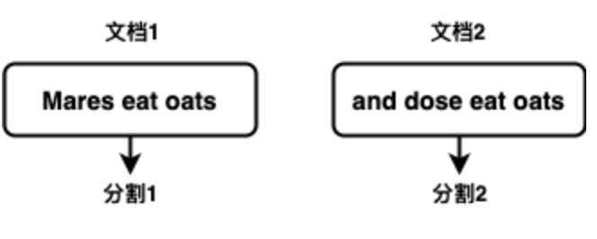
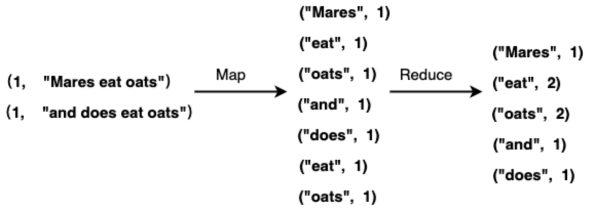
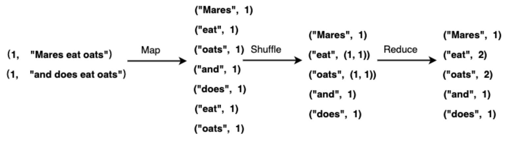
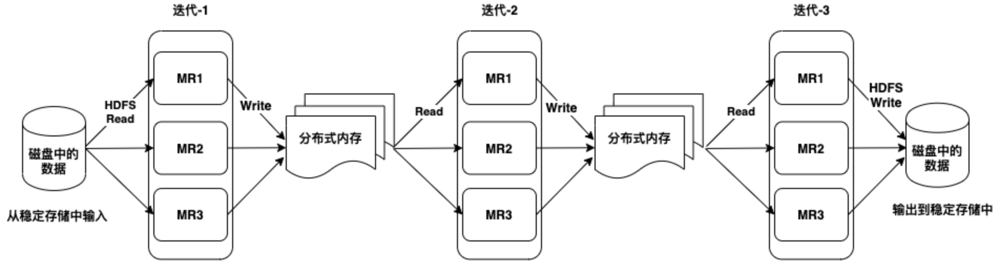
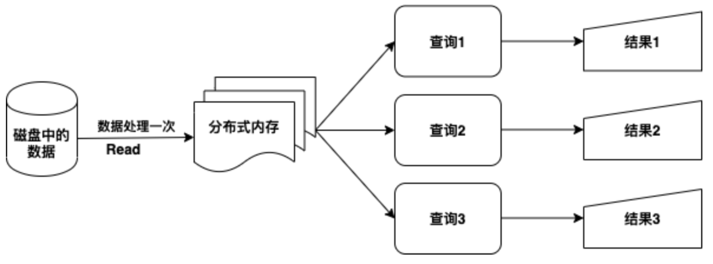

# 2.2 数据处理

&emsp;&emsp;本节不是为了重复一遍 Hadoop 发展史，而是为了说明 Spark 的执行模型为什么会与 MapReduce 不同。随着数据规模扩大，单机处理越来越难以满足吞吐和时延要求，分布式系统的核心思路就是把一个大任务拆成许多可以并行执行的小任务，再由框架统一负责调度、通信与容错。

&emsp;&emsp;MapReduce 是早期最有代表性的分布式批处理模型。它把作业组织成 Map、Shuffle、Reduce 三个核心阶段，并由框架负责任务切分、结果汇聚与失败恢复。这套模型非常重要，因为它显著降低了大规模批处理程序的实现门槛，也为后续系统奠定了“用统一框架承载并行计算”的基础。

&emsp;&emsp;但当任务需要反复访问同一批数据时，例如迭代算法、交互分析和多阶段流水线，MapReduce 的“阶段间频繁落盘”会带来明显开销。Spark 继承了把数据处理拆成并行阶段的思想，同时进一步扩展成更一般的 DAG 执行模型，并通过缓存、统一调度和更丰富的算子支持多轮计算。因此，在机器学习、图计算、交互分析和流式处理等场景中，Spark 往往更容易组织出连续的数据处理链路。

&emsp;&emsp;下面先用 MapReduce 建立对分布式数据处理的基本直觉，再回到 Spark 的执行模型、RDD 概念与常见操作。

### 2.2.1 MapReduce

&emsp;&emsp;MapReduce是一种编程模型，利用集群上的并行和分布式算法处理和产生大数据。MapReduce程序包括两个部分：第一个部分由Map过程组成，该过程执行过滤和排序，例如按产品的类别进行分类，每个分类形成一组；第二部分为reduce过程，该过程执行摘要操作，例如计算每组中产品的个数，生成分类的汇总。MapReduce系统，也称为基础结构或框架，基于分布式服务器并行运行各种任务和管理系统各个部分之间的通信和数据传输，并提供冗余和容错来协调处理过程。

&emsp;&emsp;MapReduce模型是一个特定的知识领域，应用（拆分-应用-组合）策略进行数据分析。这种策略的灵感来源于函数编程的常用功能map和reduce。MapReduce模型的Map和Reduce函数都是针对键值对(key,
&emsp;&emsp;value)数据结构定义的。Map会在数据域中获取一对具有某种类型的数据，并经过数据结构的转换返回键值对列表：

&emsp;&emsp;Map(k1,v1) → list(k2,v2)

&emsp;&emsp;Map方法并行应用于输入数据集中的每一键值对，以k1为键；每次调用将产生一个成对列表list(k2,v2)，以k2为键；之后从所有列表中收集具有相同键（k2）的所有键值对，并将它们分组在一起，为每个k2创建一个组(k2,
&emsp;&emsp;list (v2))；将其作为Reduce函数输入，然后将Reduce函数并行应用于每个组，生成值的聚合：

&emsp;&emsp;Reduce(k2, list (v2)) → list((k3, v3))

&emsp;&emsp;尽管允许一个调用返回多个键值对，但是每个Reduce调用通常会产生一个键值对或空返回，所有调用的返回将被收集为所需的结果列表list((k3,
&emsp;&emsp;v3))，因此MapReduce模型将键值对的列表转换为键值对的另一个列表。

&emsp;&emsp;另外，为了更好的理解MapReduce模型的概念，通过示例讲解计算一组文本文件中每个单词的出现次数。在这个例子中，输入数据集是两个文档，包括文档1和文档2，所以数据集分每个文档为一个分割，总共2个分割：

<p align="center"></p>
<p align="center">图例 2‑1 分割文件</p>


&emsp;&emsp;将输入文档中的每一行生成键值对，其中行号键而文本为值。Map阶段丢弃行号，并将输入行中的每个单词生成一个键值对，其中单词为键而1为值表示这个单词出现一次。Reduce阶段生成新的键值对，其中单词为键而值为这个单词个数汇总，根据上面显示的输入数据，示例Map和Reduce的工作进程为：

<p align="center"></p>
<p align="center">图例 2‑2 Map和Reduce的工作进程</p>


&emsp;&emsp;Map阶段的输出包含多个具有相同键的键值对，例如oats和eat出现两次，Reduce的工作就是对键值对的值进行聚合。如果在进入Reduce阶段之前，加入洗牌（Shuffle）的过程，使得具有相同键的值合并为一个列表，例如("eat",
&emsp;&emsp;(1, 1))，因此进行Reduce的输入实际上是键值对(key，value
&emsp;&emsp;list)。因此，从Map输出到Reduce，然后到最终结果的完整过程是：

<p align="center"></p>
<p align="center">图例 2‑3 Shuffle 过程</p>


&emsp;&emsp;为了实现MapReduce模型，如果只是实现了Map和Reduce的抽象概念对于分布式系统是不够的，需要一种方法来连接执行Map和Reduce阶段的流程。Apache
&emsp;&emsp;Hadoop包含一个流行的，支持分布式洗牌的开源MapReduce实现。MapReduce
&emsp;&emsp;库已经用许多编程语言编写，并具有不同的优化级别。但是在Hadoop的MapReduce框架中，这两个功能与其原始形式发生了变化。MapReduce框架的主要贡献不是仅仅实现了的map和reduce方法，而是通过优化执行引擎实现各种应用程序的可伸缩性和容错能力。因此，MapReduce
&emsp;&emsp;的单线程实现通常不会比传统的非MapReduce实现快，通常只有在多处理器服务器系统上实现多线程处理才能看到其优势。优化的分布式洗牌操作可以降低网络通信成本，结合MapReduce框架的容错功能，使用此模型才可以发挥有利的作用。所以，对于优良的MapReduce算法而言，优化通信成本至关重要。

&emsp;&emsp;目前，MapReduce框架是一个用于在Hadoop集群中并行处理大型数据集的框架，使用Map和Reduce两步过程进行数据分析。作业（Job）配置提供Map和Reduce分析功能，Hadoop框架提供调度、分发和并行服务。在MapReduce中的顶级工作单元是作业，每个作业通常有一个Map和一个Reduce阶段，有时候Reduce阶段可以省略。假设一个MapReduce的作业，它计算每个单词在一组文档中使用的次数。Map阶段对每个文档中的单词进行计数，然后Reduce阶段将每个文档数据聚合为跨越整个集合的单词计数。在Map阶段，输入数据被进行分割，以便在Hadoop集群中运行并行Map任务进行分析。默认情况下，MapReduce框架从Hadoop分布式文件系统（HDFS）获取输入数据。Reduce阶段将来自Map任务的结果作为输入送到Reduce任务。Reduce任务将数据整合到最终结果中。默认情况下，MapReduce框架将结果存储在HDFS中。

&emsp;&emsp;从教学角度看，MapReduce 的关键启发有两点：一是把大规模任务拆成可并行运行的阶段，二是把调度、容错和 Shuffle 交给框架处理。但它的局限也很明显，尤其是在需要重复访问同一批数据的场景下，阶段之间频繁写入分布式存储会引入额外开销。随着业务对算法迭代和交互分析的需求增加，单纯的 Map -> Reduce 批处理模型就不再够用了，尤其是在下面这两类任务里：

  - 更复杂的递归算法，例如机器学习和图形处理中常见的迭代算法

  - 更多交互式即席查询来探索数据

&emsp;&emsp;虽然这些任务表面形式不同，但共同难点都在于“中间结果需要在多个阶段之间被重复使用”。在 MapReduce 体系里，这通常意味着把中间结果写回分布式存储，再由下一阶段重新读取。这样做换来了清晰的容错边界，却也带来了更高的磁盘 I/O 和网络传输成本。

### 2.2.2 工作机制

&emsp;&emsp;理解 Spark 运行机制时，一个有用的切入点是把任务区分为批处理和流处理。批处理适合面向较大、较稳定的数据集做集中计算，例如离线报表、历史分析和定时汇总；流处理则更强调持续接收数据并及时产出结果，例如实时指标、事件告警和在线特征更新。Spark 之所以重要，不只是因为它支持批处理，而是因为它试图用一套较统一的执行引擎覆盖批、流、SQL 与机器学习等多类任务。

&emsp;&emsp;回到 Hadoop 体系，YARN 主要负责资源管理与作业调度，HDFS 负责分布式存储；很多传统作业会表现为“读取数据 -> 处理 -> 落盘 -> 再读取下一阶段输入”的链条。Spark 同样可以运行在这些基础设施之上，但它把重点放在多阶段 DAG 执行、缓存复用和更细粒度的任务编排上，因此更适合迭代计算和多阶段流水线。对于图数据这类专题场景，Spark 还提供了 GraphX 作为补充能力。

&emsp;&emsp;在容错思路上，两者也有所不同。HDFS 主要依靠数据副本保证存储可靠性，YARN 通过资源管理器与节点管理器协调失败任务的重调度；而 Spark 在计算层面更强调 RDD 谱系。如果某个分区因为节点故障而丢失，Spark 可以根据其父 RDD 和转换链重新计算这一分区，而不一定依赖对每个中间结果都做副本复制。这也是为什么理解 RDD、依赖关系和缓存策略，会直接影响你对 Spark 执行模型的判断。

&emsp;&emsp;Hadoop 更典型的用例是离线批处理和大规模存档数据分析。对于只关心最终结果、对交互性要求不高的任务，这类方案依然有价值。Spark 更适合需要多阶段处理、迭代计算、交互分析或接近实时反馈的场景，例如结构化查询、特征工程、流式聚合和模型训练。与其记忆某个固定倍数的性能宣传，不如理解两者在执行模型上的差异：MapReduce 更强调批次之间的落盘衔接，而 Spark 更强调统一执行引擎、内存缓存和多阶段流水线。

&emsp;&emsp;大多数图处理算法（例如网页排名算法）需要对同一数据集执行多次迭代计算，这需要在迭代计算之间的消息传递机制。我们需要基于MapReduce框架进行编程，以处理对相同数据集的多次迭代。大致来说，它的工作步骤是先从磁盘读取数据，并在特定的迭代之后将结果写入HDFS，然后从HDFS读取数据以进行下一次迭代。这是非常低效的，因为它涉及读取和写入数据到磁盘，这涉及大量读写操作以及跨集群的数据复制以实现容错能力。而且每个MapReduce迭代都具有很高的延迟，并且下一个迭代只能在之前的作业完全完成之后才能开始。同样，消息传递需要相邻节点的分数，以便评估特定节点的分数。这些计算需要来自其邻居的消息或跨作业多个阶段的数据，而MapReduce缺乏这种机制。为了满足对图处理算法的高效平台的需求，设计了诸如Pregel和GraphLab之类的不同图处理工具。这些工具快速且可扩展，但对于这些复杂的多阶段算法的创建和后续处理效率不高。Apache
&emsp;&emsp;Spark 的引入在很大程度上缓解了这些问题。对于需要重复访问同一批数据的任务，Spark 可以通过缓存中间结果、缩短阶段之间的数据往返，并在统一执行模型下组织多轮计算，从而显著降低磁盘读写带来的开销。图例 2‑4 给出了这种迭代处理方式的示意：中间结果可以保留在分布式内存中，而不必像传统批处理那样在每一步都依赖磁盘落盘。

<p align="center"></p>
<p align="center">图例 2‑4 Spark 的迭代操作</p>


&emsp;&emsp;另外，几乎所有的机器学习算法都是基于迭代计算的工作机制。如前所述，迭代算法在MapReduce实现中涉及磁盘读写瓶颈。MapReduce使用的粗粒度任务（即任务级并行处理）对于迭代算法而言过于繁重。在统一资源调度与内存计算机制的帮助下，Spark会在每次迭代后缓存中间数据集，并在此缓存的数据集上运行多次迭代，从而减少磁盘读写，并有助于以容错的方式更快地运行算法。Spark有一个内置可扩展的机器学习库MLlib，其中包含高质量的算法，该算法利用迭代并产生比MapReduce使用时间更少的效果。Spark另一个功能是交互式分析界面，将Spark的运行结果立即提供给用户，无需集成开发工具和代码编译。此功能可以作为交互式探索数据的主要工具，也可以对正在开发的应用程序进行分部测试。下面代码显示了一个Spark
&emsp;&emsp;shell，用户在其中加载一个文件，然后计算文件的行数。

&emsp;&emsp;root@bb8bf6efccc9:\~\# spark-shell

&emsp;&emsp;20/02/27 13:55:07 WARN NativeCodeLoader: Unable to load native-hadoop
&emsp;&emsp;library for your platform... using builtin-java classes where applicable

&emsp;&emsp;Using Spark's default log4j profile:
&emsp;&emsp;org/apache/spark/log4j-defaults.properties

&emsp;&emsp;Setting default log level to "WARN".

&emsp;&emsp;To adjust logging level use sc.setLogLevel(newLevel). For SparkR, use
&emsp;&emsp;setLogLevel(newLevel).

&emsp;&emsp;Spark context Web UI available at http://bb8bf6efccc9:4040

&emsp;&emsp;Spark context available as 'sc' (master = local\[\*\], app id =
&emsp;&emsp;local-1582811713758).

&emsp;&emsp;Spark session available as 'spark'.

&emsp;&emsp;Welcome to

&emsp;&emsp;\_\_\_\_ \_\_

&emsp;&emsp;/ \_\_/\_\_ \_\_\_ \_\_\_\_\_/ /\_\_

&emsp;&emsp;\_\\ \\/ \_ \\/ \_ \`/ \_\_/ '\_/

&emsp;&emsp;/\_\_\_/ .\_\_/\\\_,\_/\_/ /\_/\\\_\\ version 4.1.1

&emsp;&emsp;/\_/

&emsp;&emsp;Using Scala version 2.13.16 (OpenJDK 64-Bit Server VM, Java 17)

&emsp;&emsp;Type in expressions to have them evaluated.

&emsp;&emsp;Type :help for more information.

```scala
scala> val auctionRDD = sc.textFile("/data/auctiondata.csv")
auctionRDD: org.apache.spark.rdd.RDD[String] = /data/auctiondata.csv
MapPartitionsRDD[1] at textFile at <console>:24
scala> auctionRDD.count
res0: Long = 10654
```


&emsp;&emsp;这个例子展示了 Spark 的一个重要特征：同一份数据一旦被读取并缓存，后续多次查询就不必每次都从外部存储重新开始。配合交互式 Shell，这种机制非常适合做探索分析、样例验证和教学演示。Spark 也分别提供了 Scala、Python 和 R 的交互入口，方便在同一批数据上快速试验不同操作。图例 2‑5 展示的就是这种“先加载、再反复交互计算”的基本模式。

&emsp;&emsp;> <p align="center"></p>
<p align="center">图例 2‑5 交互式数据分析</p>


&emsp;&emsp;把这一节读完后，应该形成一个更稳的判断：MapReduce 仍然是理解分布式批处理的好入口，但 Spark 更适合组织多阶段、可复用、需要缓存中间结果的任务链路。与此同时，Spark 并不是“任何场景都更优”的万能框架；当数据规模远超可用资源、缓存策略不合理或 Shuffle 设计不当时，性能仍然可能明显下降。真正重要的不是把两者对立起来，而是理解各自的执行模型、适用场景和工程边界。


