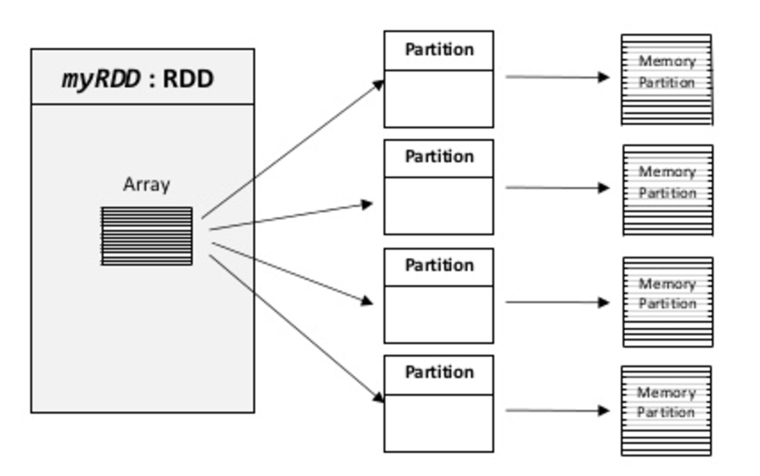

# 2.3 认识RDD

接下来进入本章真正的核心概念：弹性分布式数据集（Resilient Distributed Dataset，RDD）。后文统一简称 RDD。本节会围绕它的基本含义、创建方式、常见操作以及与执行模型的关系展开说明。

理解 RDD 时，可以先把它看成“带谱系信息的只读分布式记录集合”。它既是 Spark 早期执行模型中的核心数据抽象，也是后面理解分区、缓存、Shuffle 和容错的基础。RDD 中的数据会按逻辑分区分散到集群上执行计算；每次转换都产生新的 RDD，而不会原地修改旧数据。这种不可变设计让 Spark 更容易推导依赖关系、切分任务并在失败后重建缺失分区。

<p align="center"></p>
<p align="center">图例 2‑6 RDD 看作是一个只读分区的记录集合</p>


RDD 这个名字可以拆开理解。所谓“弹性”，指的是它能够借助谱系信息在分区丢失时重新计算；所谓“分布式”，指的是数据按分区散布在多个节点上并行处理；所谓“数据集”，则强调它表示的是一批可被统一操作的记录。RDD 不要求输入必须符合固定表结构，文本、键值对、日志行以及程序中的对象集合都可以成为它的输入。
换句话说，RDD具备容错能力：当某些分区因节点故障而丢失时，可以依据谱系重新计算。

在Spark中创建RDD的常见方式有三类：从外部存储读取数据、基于已有RDD继续转换，以及将驱动端已有集合并行化。RDD也可以缓存并手动设置分区；当同一份数据会被多次复用时，缓存通常能显著减少重复计算。分区设置同样会影响任务分布和负载均衡。一般来说，分区过少会降低并行度，分区过多则会带来调度和管理开销。用户还可以调用persist()方法声明希望在后续操作中复用哪些RDD。默认情况下，Spark优先将持久化RDD保存在内存中；如果内存不足，也可能溢写到磁盘。除此之外，还可以显式选择仅磁盘存储或副本存储等策略。

Spark 引入 RDD，实质上是在“完全依赖外部存储的批处理”与“难以高效容错的通用共享内存”之间寻找折中。它不追求对任意细粒度状态都做透明共享，而是要求用户通过一系列粗粒度转换来描述数据处理过程。这样，Spark 就能记录依赖链，在需要时延迟执行，并在失败后按谱系重算。也正因为 RDD 是面向转换链而不是面向可变共享状态设计的，所以它非常适合表达批处理、迭代算法和交互分析中的数据流。

Spark生成初始RDD最常见的方式有两种：一是把驱动程序中的本地集合并行化，二是从外部存储系统读取数据，例如共享文件系统、HDFS、HBase，或者任何提供Hadoop InputFormat的数据源。对于Scala程序，可以在本地集合（通常是Seq）上调用SparkContext.parallelize()来创建RDD。这个方法很适合学习、演示和原型验证，因为它可以在交互环境中快速构造一份测试数据；但当数据量较大时，就不适合继续把完整数据集先放在单机内存里。下面用一个sortByKey()示例说明并行化集合的用法：

```scala
scala> val
data=spark.sparkContext.parallelize(Seq(("maths",52),("english",75),("science",82),
("computer",65),("maths",85)))
data: org.apache.spark.rdd.RDD[(String, Int)] =
ParallelCollectionRDD[2] at parallelize at <console>:23
scala> val sorted = data.sortByKey()
sorted: org.apache.spark.rdd.RDD[(String, Int)] = ShuffledRDD[5] at
sortByKey at <console>:25
scala> sorted.foreach(println)
(maths,52)
(science,82)
(english,75)
(computer,65)
(maths,85)
```


  - 语法解释

在Scala中，Seq表示有序序列。它是Iterable的一种特化形式，与一般的可迭代集合相比，Seq明确保留元素顺序，并支持按索引访问。索引范围从0开始，到序列长度减1结束。Seq还提供了许多用于查找元素或子序列的方法，例如segmentLength、prefixLength、indexWhere、indexOf、lastIndexWhere、lastIndexOf、startsWith、endsWith和indexOfSlice。

并行化集合中要注意的关键点是数据集切入的分区数。
Spark将为集群的每个分区运行一个任务。对于集群中的每个CPU，我们需要两个到四个分区。Spark根据我们的集群设置分区数。
但是我们也可以手动设置分区数。
这是通过将分区数作为第二个参数进行并行化来实现的。例如sc.parallelize(data,10)，这里我们手动给定分区数为10。再看一个示例，在这里我们使用了并行化收集，并手动指定了分区数：

```scala
scala> val rdd1 =
spark.sparkContext.parallelize(Array("jan","feb","mar","april","may","jun"),3)
rdd1: org.apache.spark.rdd.RDD[String] = ParallelCollectionRDD[6] at
parallelize at <console>:23
scala> val result = rdd1.coalesce(2)
result: org.apache.spark.rdd.RDD[String] = CoalescedRDD[7] at
coalesce at <console>:25
scala> result.foreach(println)
jan
mar
feb
april
may
jun
```

Spark可以从Hadoop生态支持的多种存储系统中创建RDD，包括本地文件系统、HDFS、Cassandra、HBase、Amazon S3等。Spark支持文本文件、SequenceFile，以及任何基于Hadoop InputFormat的数据源。最常见的读取方式之一是使用SparkContext.textFile()：传入本地路径、Hadoop集群路径或云存储路径后，Spark会把文件内容读取为“按行组织”的RDD。


