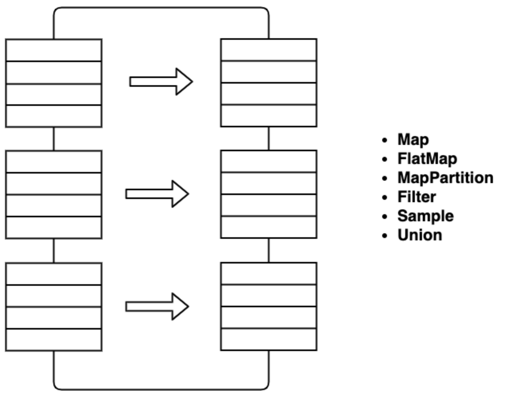
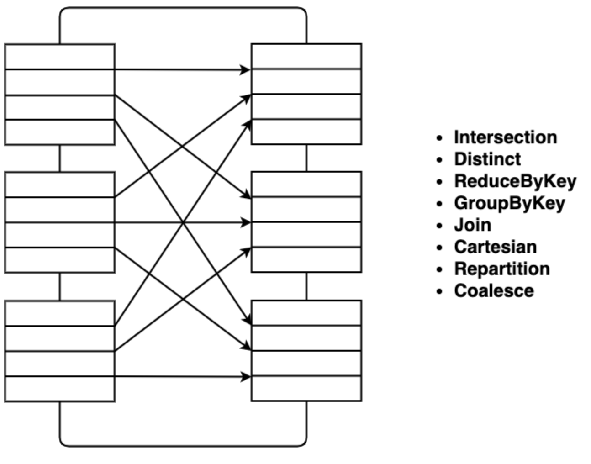

# 2.4 操作RDD

&emsp;&emsp;RDD支持两种类型的操作：转换（Transformation）是从现有数据集创建新数据集，以及动作（Action）在数据集上运行计算后将值返回给驱动程序。例如map()方法就是一种转换，通过将转换函数应用到数据集中的每个元素上，并返回结果生成新的RDD；另一方面reduce()方法是一个动作，可以将聚合函数应用到RDD的所有元素上，并将最终结果返回给驱动程序。Spark中的所有转换操作都是懒惰评估的，因为它们不会马上计算结果。转换仅在调用动作后需要将结果返回给驱动程序时计算，这种实现方式使Spark能够更高效地运行。

### 2.4.1 转换

&emsp;&emsp;转换代表了Spark大数据计算框架一类操作，可从现有RDD生成新的RDD。转换以RDD作为输入，并产生一个或多个RDD作为输出。每当我们应用任何转换时，它都会创建新的RDD。由于RDD本质上是不可变的，因此不能更改输入的RDD。应用转换会建立一个RDD谱系，其中包含最终RDD的整个父RDD。
&emsp;&emsp;RDD谱系也称为RDD运算符图或RDD依赖图，本质上是一个逻辑执行计划，也就是由父RDD依赖关系构成的有向无环图（DAG）。转换操作本身不会立即执行，只有在后续动作触发时才会真正计算。最基础的转换包括map()和filter()。转换之后，新RDD与父RDD是不同的对象：结果规模可能变小，例如filter()、distinct()和sample()；也可能变大，例如flatMap()、union()和cartesian()；还可能保持近似相同的记录数，例如map()。

&emsp;&emsp;转换大体可以分成两类：窄转换和宽转换。窄转换指的是，子RDD中某个分区的计算只依赖父RDD中的单个分区或少量固定分区，例如map()、filter()；宽转换则意味着一个分区的结果可能依赖父RDD的多个分区，通常会伴随Shuffle，例如groupByKey()和reduceByKey()。下面列出一些Spark中常见的转换操作。

<p align="center"></p>
<p align="center">图例 2‑7 常见RDD转换操作示意（1）</p>


<p align="center"></p>
<p align="center">图例 2‑8 常见RDD转换操作示意（2）</p>


&emsp;&emsp;下面先看基于单个RDD的转换，也就是输入只有一个RDD的情况。先通过并行化一个集合来创建示例RDD：

```scala
scala> val rdd = sc.parallelize(List(1,2,3,3))
rdd: org.apache.spark.rdd.RDD[Int] = ParallelCollectionRDD[0] at
parallelize at <console>:24
```


  - map\[U\](f: (T) ⇒ U)(implicit arg0: ClassTag\[U\]): RDD\[U\]

&emsp;&emsp;通过对这个RDD的所有元素应用一个匿名函数来返回一个新的RDD。map()方法具有灵活性，即RDD的输入和返回类型可以彼此不同。例如可以输入RDD类型为String，在应用map()方法之后，返回的RDD可以是布尔值。map()是Spark中的转换操作，适用于RDD的每个元素，并将结果作为新的RDD返回。在map()中，操作开发人员可以定义自己的自定义业务逻辑，相同的逻辑将应用于RDD的所有元素。map()方法根据自定义代码将一个元素作为输入过程，并一次返回一个元素。map()将长度为N的RDD转换为长度为N的另一个RDD，输入和输出RDD通常具有相同数量的记录。

```scala
scala> rdd.map(x => x + 1).collect
res0: Array[Int] = Array(2, 3, 4, 4)
```


  - filter(f: (T) ⇒ Boolean): RDD\[T\]

&emsp;&emsp;返回一个仅包含满足条件元素的新RDD。filter()方法返回一个新的RDD，其中仅包含满足条件的元素。这是一个狭窄的操作，因为它不会将数据从一个分区拖到多个分区。例如，假设RDD包含五个自然数1、2、3、4和5，并且根据条件检查偶数，过滤器后的结果RDD将仅包含偶数，即2和4。

```scala
scala> rdd.filter(x => x != 1).collect
res1: Array[Int] = Array(2, 3, 3)
```


  - flatMap\[U\](f: (T) ⇒ TraversableOnce\[U\])(implicit arg0:
&emsp;&emsp;    ClassTag\[U\]): RDD\[U\]

&emsp;&emsp;首先对这个RDD的所有元素应用一个函数，然后扁平化结果，最终返回一个新的RDD。flatMap()方法是一种转换操作，适用于RDD的每个元素，并将结果作为新的RDD返回。它类似于map()，但是flatMap方法根据一个自定义代码将一个元素作为输入过程，相同的逻辑将应用于RDD的所有元素，并一次返回0个或多个元素。flatMap()方法将长度为N的RDD转换为长度为M的另一个RDD。借助于flatMap()方法，对于每个输入元素在输出RDD中都有许多对应的元素，flatMap()的最简单用法是将每个输入字符串分成单词。map()和flatMap()的相似之处在于它们从输入RDD中获取一个元素，并在该元素上应用方法。map()和flatMap()之间的主要区别是map()仅返回一个元素，而flatMap()可以返回元素列表。

```scala
scala> rdd.flatMap(x => x.to(3)).collect
res2: Array[Int] = Array(1, 2, 3, 2, 3, 3, 3)
scala> rdd.map(x => x.to(3)).collect
res2: Array[scala.collection.immutable.Range.Inclusive] =
Array(Range(1, 2, 3), Range(2, 3), Range(3), Range(3))
```


  - 语法说明

&emsp;&emsp;Range是相等地间隔开的整数有序序列。例如，“1,2,3”是一个Range，“5,8,11,14”也是。要创建Scala中的一个Range，使用预定义的方法to和by。

```scala
scala> 1 to 3
res4: scala.collection.immutable.Range.Inclusive = Range(1, 2, 3)
scala> 5 to 14 by 3
res3: scala.collection.immutable.Range = Range(5, 8, 11, 14)
```


&emsp;&emsp;如果想创建一个Range，而不包括上限，可以用方便的方法until：

```scala
scala> 1 until 3
res3: scala.collection.immutable.Range = Range(1, 2)
```


&emsp;&emsp;Range以恒定的间隔表示，因为它们可以由三个数字定义：开始，结束和步进值。由于这种表示，大多数范围上的操作都非常快。

  - distinct(): RDD\[T\]

&emsp;&emsp;返回一个包含该RDD中不同元素的新RDD，返回一个新的数据集，其中包含源数据集的不同元素，删除重复数据很有帮助。例如如果RDD具有元素(Spark,
&emsp;&emsp;Spark, Hadoop, Flink)，则rdd.distinct()将给出元素(Spark, Hadoop, Flink)。

```scala
scala> rdd.distinct().collect
res4: Array[Int] = Array(2, 1, 3)
```


&emsp;&emsp;在很多应用场景都需要对结果数据进行排序，Spark中有时也不例外。在Spark中存在两种对RDD进行排序的函数，分别是sortBy和sortByKey函数。sortBy是对标准的RDD进行排序，它是从Spark
&emsp;&emsp;0.9.0之后才引入的。而sortByKey函数是对PairRDD进行排序，也就是有键值对RDD。下面将分别对这两个函数的实现以及使用进行说明。sortBy函数是在org.apache.spark.rdd.RDD类中实现的：

  - `sortBy[K](f: (T) ⇒ K, ascending: Boolean = true, numPartitions: Int = this.partitions.length)(implicit ord: Ordering[K], ctag: ClassTag[K]): RDD[T]`

&emsp;&emsp;该函数最多可以传三个参数：第一个参数是一个匿名函数，该函数的也有一个带T泛型的参数，返回类型和RDD中元素的类型是一致的；第二个参数是ascending，该参数决定排序后RDD中的元素是升序还是降序，默认是true，也就是升序；第三个参数是numPartitions，该参数决定排序后的RDD的分区个数，默认排序后的分区个数和排序之前的个数相等，即为this.partitions.size。从sortBy函数的实现可以看出，第一个参数是必须传入的，而后面的两个参数可以不需要传入。而且sortBy函数的实现依赖于sortByKey函数，关于sortByKey函数后面会进行说明：

```scala
scala> val rdd = sc.parallelize(List(3,1,90,3,5,12))
rdd: org.apache.spark.rdd.RDD[Int] = ParallelCollectionRDD[96] at
parallelize at <console>:24 scala>
scala> rdd.sortBy(x => x).collect
res73: Array[Int] = Array(1, 3, 3, 5, 12, 90)
scala> rdd.sortBy(x => x, false).collect
res3: Array[Int] = Array(90, 12, 5, 3, 3, 1)
```


&emsp;&emsp;下面介绍的转换是基于两个RDD。基于二个RDD的转换是指输入RDD是两个，转换后变成一个。首先创建两个RDD：

```scala
scala> val rdd = sc.parallelize(List(1,2,3))
rdd: org.apache.spark.rdd.RDD[Int] = ParallelCollectionRDD[10] at
parallelize at <console>:24
scala> val other = sc.parallelize(List(3,4,5))
other: org.apache.spark.rdd.RDD[Int] = ParallelCollectionRDD[11] at
parallelize at <console>:24
```


  - union(other: RDD\[T\]): RDD\[T\]

&emsp;&emsp;返回这个RDD和另一个的联合。任何相同的元素将出现多次，可以使用distinct来消除重复。使用union()方法，我们可以在新的RDD中获得两个RDD的元素，此方法的关键规则是两个RDD应该具有相同的类型。例如RDD1的元素是(Spark,
&emsp;&emsp;Spark, Hadoop, Flink)，而RDD2的元素是(Big data, Spark,
&emsp;&emsp;Flink)，因此生成的rdd1.union(rdd2)将具有元素(Spark, Spark, Spark
&emsp;&emsp;Hadoop, Flink, Flink, Big data）。

```scala
scala> rdd.union(other).collect
res6: Array[Int] = Array(1, 2, 3, 3, 4, 5)
```


  - intersection(other: RDD\[T\]): RDD\[T\]

&emsp;&emsp;返回此RDD和另外一个的交集，输出将不包含任何重复的元素，即使两个输入RDD包含重复的部分。使用intersection()方法，我们只能在新的RDD中获得两个RDD的公共元素。
&emsp;&emsp;此功能的关键规则是两个RDD应该具有相同的类型。考虑一个示例，RDD1的元素为(Spark, Spark, Hadoop,
&emsp;&emsp;Flink)，而RDD2的元素为(Big data, Spark,
&emsp;&emsp;Flink)，因此rdd1.intersection(rdd2)生成的RDD将具有元素(spark)。

```scala
scala> rdd.intersection(other).collect
res7: Array[Int] = Array(3)
```


  - subtract(other: RDD\[T\]): RDD\[T\]

&emsp;&emsp;返回一个RDD，其中包括的元素在调用subtract()方法的RDD而不在另一个。

```scala
scala> rdd.subtract(other).collect
res8: Array[Int] = Array(2, 1)
```


  - cartesian\[U\](other: RDD\[U\])(implicit arg0: ClassTag\[U\]):
&emsp;&emsp;    RDD\[(T, U)\]

&emsp;&emsp;计算两个RDD之间的笛卡尔积，即第一个RDD的每个项目与第二个RDD的每个项目连接，并将它们作为新的RDD返回。使用此功能时要小心，内存消耗很快就会成为问题。

```scala
scala> rdd.cartesian(other).collect
res9: Array[(Int, Int)] = Array((1,3), (1,4), (1,5), (2,3), (3,3),
(2,4), (2,5), (3,4), (3,5))
```


### 2.4.2 动作

&emsp;&emsp;转换会创建RDD，但是当我们要获取实际数据集时将需要执行动作。当触发动作后，不会像转换那样形成新的RDD，因此动作是提供非RDD值的操作，计算结果存储到驱动程序或外部存储系统中，并将惰性执行的RDD转换激活开始实际的计算任务。动作是将数据从执行器发送到驱动程序的方法之一，执行器是负责执行任务的代理。驱动程序是一个JVM进程，可协调工作节点和任务的执行。现在来看看Spark包含哪些基本动作，首先创建一个RDD：

```scala
scala> val rdd = sc.parallelize(List(1,2,3,3))
rdd: org.apache.spark.rdd.RDD[Int] = ParallelCollectionRDD[24] at
parallelize at <console>:24
```


  - reduce(f: (T, T) ⇒ T): T

&emsp;&emsp;此函数提供Spark中众所周知的Reduce功能。请注意，提供的任何方法f都应该符合交换律，以产生可重复的结果。reduce()方法将RDD中的两个元素作为输入，然后生成与输入元素相同类型的输出。这种方法的一种简单形式是相加，可以添加RDD中的元素，然后计算单词数。reduce()方法接受交换和关联运算符作为参数。

```scala
scala> rdd.reduce((x, y) => x + y)
res11: Int = 9
```


  - collect(): Array\[T\]

&emsp;&emsp;返回一个包含此RDD中所有元素的数组。动作collect()是最常见且最简单的操作，它将我们整个RDD的内容返回到驱动程序。如果预计整个RDD都适合内存，可以将collect()方法应用到单元测试，可以轻松地将RDD的结果与预期的结果进行比较。动作Collect()有一个约束，要求计算机的内存大小可以满足所有返回地结果数据，并复制到驱动程序中。只有当结果数据的预期尺寸不大时才应使用此方法，因为所有数据都加载到驱动程序的内存中，有可能产生内存不足的情况。

```scala
scala> rdd.collect
res12: Array[Int] = Array(1, 2, 3, 3)
```


  - count(): Long

&emsp;&emsp;返回数据集中元素的数量。例如RDD的值为(1, 2, 2, 3, 4, 5, 5, 6)，rdd.count()将得出结果8。

```scala
scala> rdd.count
res13: Long = 4
```


  - first(): T

&emsp;&emsp;返回数据集的第一元素，类似于take(1)。

```scala
scala> rdd.first
res14: Int = 1
```


  - take(num: Int): Array\[T\]

&emsp;&emsp;提取RDD的前num个元素并将其作为数组返回。此方法尝试减少其访问的分区数量，因此它表示一个有偏差的集合，我们不能假定元素的顺序。例如有RDD为{1,2,2,3,4,5,5,6}
&emsp;&emsp;，如果执行take(4)，将得出结果{2,2,3,4}。

```scala
scala> rdd.take(3)
res15: Array[Int] = Array(1, 2, 3)
```


  - takeSample(withReplacement: Boolean, num: Int, seed: Long =
&emsp;&emsp;    Utils.random.nextLong): Array\[T\]

&emsp;&emsp;在某些方面表现与sample方法不同，例如它会返回确切数量的样本，通过第2个参数指定；它返回一个数组而不是RDD；它在内部随机化返回项目的顺序。

  - > withReplacement：是否使用放回抽样的采样

  - > num：返回样本的大小

  - > seed：随机数发生器的种子

&emsp;&emsp;因为所有的数据都被加载到驱动程序的内存中，所以这个方法只应该在返回样本比较小的情况下被使用。

```scala
scala> rdd.takeSample(true,3)
res16: Array[Int] = Array(2, 1, 1)
```


  - takeOrdered(num: Int)(implicit ord: Ordering\[T\]): Array\[T\]

&emsp;&emsp;使用内在的隐式排序函数对RDD的数据项进行排序，并将前num个项作为数组返回。

  - > num：要返回元素的数量

  - > ord：隐式排序

```scala
scala> rdd.takeOrdered(2)
res17: Array[Int] = Array(1, 2)
scala> rdd.takeOrdered(2)(Ordering[Int].reverse)
res18: Array[Int] = Array(3, 3)
```


  - foreach(f: (T) ⇒ Unit): Unit

&emsp;&emsp;对该RDD的所有元素应用函数f。与其他操作不同，foreach不返回任何值。它只是在RDD中的所有元素上运行，可以在不想返回任何结果的情况下使用，但是需要启动对RDD的计算，一个很好的例子是将RDD中的元素插入数据库，或者打印输出。

```scala
scala> rdd.foreach(x => print(x +" "))
1 3 3 2
```


  - fold(zeroValue: T)(op: (T, T) ⇒ T): T

&emsp;&emsp;使用给定的关联函数和中性的zeroValue聚合每个分区的元素，然后聚合所有分区的结果。函数op(t1,
&emsp;&emsp;t2)允许修改t1并将其作为结果值返回，以避免对象分配；但是，它不应该修改t2。这与Scala等函数语言的非分布式集合实现的fold操作有所不同。该fold操作可以单独应用于分区，然后将这些结果折叠成最终结果，而不是以某些定义的顺序将折叠应用于每个元素。对于不可交换的函数，结果可能与应用于非分布式集合的折叠的结果不同。

  - > zeroValue：每个分区的累积结果的初始值，以及op运算符的不同分区的组合结果的初始值，这通常是中性元素，例如Nil用于列表级联或0用于求和）

  - > op：一个运算符用于在分区内累积结果，并组合不同分区的结果

```scala
scala> rdd.fold(0)((x, y) => x + y)
res28: Int = 9
scala> rdd.fold(1)((x, y) => x + y)
res29: Int = 12
```


&emsp;&emsp;第二个代码为什么是12？先执行下面的代码查看一下rdd的分区数：

```scala
scala> rdd.partitions.size
res25: Int = 2
```


&emsp;&emsp;可以看到rdd默认有两个分区，这是由于此Docker容器的CPU是两核。集合中的数据被分成两组，如果分别是（1，2）和（3，3），这种分组在真实的分布式环境中是不确定的。对这两组数据应用fold中匿名方法进行累加，还需要加上zeroValue=1，分区中的数累加后，两个分区累加结果再累加，还要再加一次zeroValue=1，其最终的算式为：

&emsp;&emsp;((1 + 2 + 1) + (3 + 3 + 1) + 1) = 12


  - aggregate\[U\](zeroValue: U)(seqOp: (U, T) ⇒ U, combOp: (U, U) ⇒
&emsp;&emsp;    U)(implicit arg0: ClassTag\[U\]): U

&emsp;&emsp;首先聚合每个分区的元素，然后是聚合所有分区的结果，聚合的方法使用给定的组合函数和中性的zeroValue。该函数可以返回不同于此RDD类型的结果类型U。因此，需要一个用于将T合并成U的操作和一个用于合并两个U的操作，如在scala.TraversableOnce中。这两个函数都允许修改并返回其第一个参数，而不是创建一个新的U以避免内存分配。

  - > zeroValue：用于seqOp运算符的，每个分区累积结果的初始值；以及用于combOp运算符的，不同分区组合结果的初始值，通常是中性元素（例如，Nil表示列表连接，0表示求和）

  - > seqOp：用于在分区内累积结果的运算符

  - > combOp：用于组合来自不同分区的结果的关联运算符

```scala
scala> rdd.aggregate((0, 0))((x, y)=>(x._1 + y, x._2 + 1),(x,
y)=>(x._1 + y._1, x._2 + y._2))
res32: (Int, Int) = (9,4)
```


&emsp;&emsp;上面代码中zeroValue为(0, 0)；seqOp为(x, y)=\>(x.\_1 + y, x.\_2 +
&emsp;&emsp;1)，表示通过对每个分区内的元素进行累加和计数生成二元组，两个分区的计算方法和结果如下，如果两个分区的元素分别为(1,2)和(3,3)：

&emsp;&emsp;(1 + 2 = 3, 1 + 1 = 2) = (3 , 2) (3 + 3 = 6, 1 + 1 = 2) = (6 , 2)


&emsp;&emsp;然后组合分区的结果，combOp为(x, y)=\>(x.\_1 + y.\_1, x.\_2 +
&emsp;&emsp;y.\_2)，表示对所有的分区计算结果进行累加，计算方法如下：

&emsp;&emsp;((3 + 6) = 9 , (2 + 2) = 4）= (9 , 4)


  - saveAsTextFile(path)

&emsp;&emsp;将数据集的元素写为文本文件（或一组文本文件），通过path指定保存文件的路径，可以为本地文件系统、HDFS或任何其他的Hadoop支持的文件系统。Spark会调用每个元素的toString将其转换为文件中的一行文字。

  - saveAsSequenceFile(path)

&emsp;&emsp;将数据集写入到Hadoop的SequenceFile，通过path指定保存文件的路径，可以为本地文件系统、HDFS或任何其他的Hadoop支持的文件系统。

  - saveAsObjectFile(path)

&emsp;&emsp;将数据集的元素写为使用Java串行化的简单格式，然后可以使用SparkContext.objectFile()进行加载。


