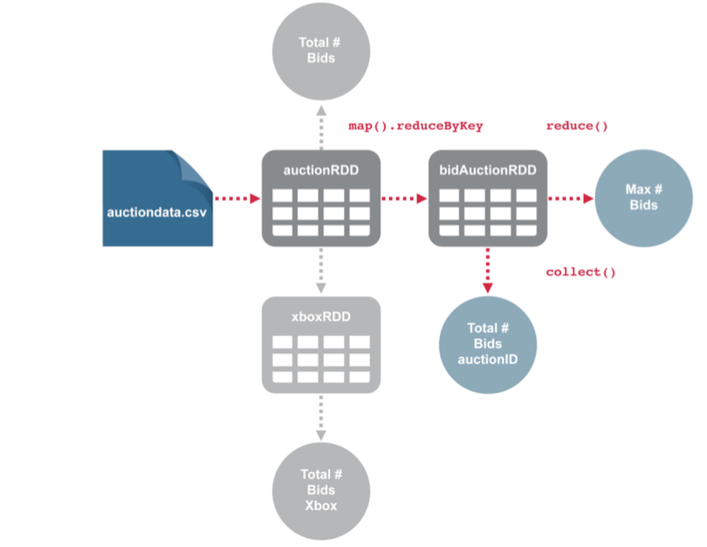

# 2.6 案例分析

在Spark中，RDD是一个基本的数据抽象层，是分布式部署在集群中节点上的对象集合，一旦创建它们是不可变的。我们可以在RDD上执行转换和动作两种类型的数据操作。转换是惰性的计算，即它们不会在被定义的时候立即计算，只有在RDD上执行动作时，转换才会执行。我们还可以在内存或磁盘上持久化或缓存RDD，同时RDD是容错的，如果某个节点或任务失败，则可以在其它节点上自动重建RDD，并且完成作业。此节内容将使用了在线拍卖系统的数据。这些数据被保存在本地文件系统中的CSV文件中，数据包含三种类型的产品：Xbox、Cartier和Palm。此文件中的每一行代表一个单独的出价。每个出价都有拍卖ID（AuctionID）、投标金额（Bid）、从拍卖开始的投标时间（Bid
Time）、投标人用户名（Bidder）、投标人评级（Bidder Rate）、拍卖开标价（Open
Bid）、最终售价（Price）、产品类型（Item）和拍卖的天数（Days To
Live）。每个拍卖都有一个拍卖代码相关联，可以拥有多个出价，每一行代表出价。对于每个出价，有以下几个信息：

| 列名        | 类型     | 描述     |
| --------- | ------ | ------ |
| auctionid | String | 拍卖ID   |
| bid       | Float  | 出价金额   |
| bidtime   | Float  | 出价持续时间 |
| bidder    | String | 出价人    |
| Bidrate   | Int    | 出价次数   |
| openbid   | Float  | 开盘价    |
| Price     | Float  | 最终价    |
| Itemtype  | String | 产品类型   |
| dtl       | Int    | 天数     |

表格 2‑1 案例数据说明

其中的数据如下所示：

3406945791,195,0.93341,sirvinsky,52,9.99,232.5,palm,7

3406945791,200,0.93351,sirvinsky,52,9.99,232.5,palm,7

3406945791,200,1.10953,jaguarhw,1,9.99,232.5,palm,7

3406945791,215,3.68168,lilbitreading,2,9.99,232.5,palm,7

3406945791,205,4.04531,jaguarhw,1,9.99,232.5,palm,7

3406945791,225,4.04568,jaguarhw,1,9.99,232.5,palm,7

3406945791,220,6.60786,robb1069,3,9.99,232.5,palm,7

3406945791,225,6.60799,robb1069,3,9.99,232.5,palm,7

3406945791,230,6.60815,robb1069,3,9.99,232.5,palm,7

3406945791,230,6.67638,jaguarhw,1,9.99,232.5,palm,7

3406945791,232.5,6.67674,jaguarhw,1,9.99,232.5,palm,7

### 2.6.1 启动交互界面

本节开始进入实际操作：从外部数据源加载数据、观察 RDD 内容，并围绕一个简单样例理解转换与动作的执行方式。通常，我们把最先创建出来的那份 RDD 叫作输入 RDD 或基础 RDD，后续的大多数转换都会建立在它之上。这里仍然使用 Spark 交互式界面（REPL）演示，因为它最适合边写边看结果，也最容易观察 `sc`、`spark`、RDD 和动作返回值之间的关系。

  - REPL

是指交互式解释器环境，其缩写分别表示R(read)、E(evaluate)、P(print)、L(loop)，输入值，交互式解释器会读取输入内容并对它求值，再返回结果，并重复此过程。

root@bb8bf6efccc9:\~\# spark-shell

20/03/05 07:42:31 WARN NativeCodeLoader: Unable to load native-hadoop
library for your platform... using builtin-java classes where applicable

Using Spark's default log4j profile:
org/apache/spark/log4j-defaults.properties

Setting default log level to "WARN".

To adjust logging level use sc.setLogLevel(newLevel). For SparkR, use
setLogLevel(newLevel).

20/03/05 07:42:37 WARN Utils: Service 'SparkUI' could not bind on port
4040. Attempting port 4041.

Spark context Web UI available at http://bb8bf6efccc9:4041

Spark context available as 'sc' (master = local\[\*\], app id =
local-1583394157795).

Spark session available as 'spark'.

Welcome to

\_\_\_\_ \_\_

/ \_\_/\_\_ \_\_\_ \_\_\_\_\_/ /\_\_

\_\\ \\/ \_ \\/ \_ \`/ \_\_/ '\_/

/\_\_\_/ .\_\_/\\\_,\_/\_/ /\_/\\\_\\ version 4.1.1

/\_/

Using Scala version 2.13.16 (OpenJDK 64-Bit Server VM, Java 17)

Type in expressions to have them evaluated.

Type :help for more information.

```scala
scala>
```

### 2.6.2 SparkContext和SparkSession

当前的Spark交互界面中同时可以看到SparkSession和SparkContext，但在Spark 4.x的日常开发里应把SparkSession作为统一入口。历史上，Spark 2.0之前常见的入口是SparkContext、SQLContext和HiveContext；从Spark 2.0开始，SparkSession整合了这些能力，DataFrame、Dataset、SQL与Structured Streaming都通过它进入。SparkContext仍然存在并且可直接访问，但更适合作为底层执行上下文，而不是业务代码的首选入口。


图例 2‑9 SparkContext 和 Driver Program、Cluster Manager 之间的关系

从上图中看到，SparkContext是访问执行引擎的核心渠道；每个JVM通常只存在一个SparkContext。Spark驱动程序（Driver
Program）使用它连接集群管理器（YARN、Kubernetes或Standalone），并完成任务调度与资源协同。在Spark 4.x中，推荐通过SparkSession访问SQL、DataFrame/Dataset和流处理API；需要底层能力时再通过`spark.sparkContext`访问SparkContext。

总而言之，SparkSession是Spark 4.x的数据处理统一入口，它降低了API切换成本，也减少了旧上下文对象并存导致的工程复杂度。

### 2.6.3 加载数据

首先启动交互式界面，运行spark-shell来完成。一旦启动界面，接下来使用SparkContext.textFile方法将数据加载到Spark中。请注意，代码中的sc是指SparkContext对象。

```scala
scala> val auctionRDD = sc.textFile("/data/auctiondata.csv")
auctionRDD: org.apache.spark.rdd.RDD[String] =
/root/data/auctiondata.csv MapPartitionsRDD[1] at textFile at
<console>:24
```


textFile()方法返回一个RDD，其中每个元素对应文件中的一行。除了文本文件，Spark还支持多种RDD读取方式，例如：wholeTextFiles()用于读取目录中的多个小文本文件，返回`(文件名, 内容)`形式的数据；sequenceFile[K, V]()用于读取SequenceFile；hadoopRDD()则可基于Hadoop的InputFormat读取更通用的数据源。需要注意的是，RDD采用惰性求值机制。像上面这样调用textFile()时，只是定义了数据来源和后续计算入口，Spark并不会立刻把数据全部读入内存；只有在后续遇到动作操作时，相关RDD才会真正被计算并返回结果。

### 2.6.4 应用操作

可以使用first()方法返回auctionRDD中第一行的数据。

```scala
scala> auctionRDD.first
res2: String = 8213034705,95,2.927373,jake7870,0,95,117.5,xbox,3
```


这一行的数据表示Xbox产品的一次出价，其中的数据项使用逗号分隔，当然auctionRDD中还包括其他产品的数据，例如Cartier、Palm等等。如果只想查看Xbox上的出价：

  - 可以使用什么转换操作来仅获得所有Xbox的出价信息？

```scala
scala> val xboxRDD = auctionRDD.filter(line=>line.contains("xbox"))
xboxRDD: org.apache.spark.rdd.RDD[String] = MapPartitionsRDD[2] at
filter at <console>:26
```


上面的代码对auctionRDD中的每个元素执行filter()转换。由于auctionRDD的每个元素就是CSV文件中的一行，因此filter()会逐行检查数据内容。这里使用的条件是`line.contains("xbox")`：如果某一行包含字符串`xbox`，它就会被保留到新的RDD中，也就是xboxRDD。

这里的`line => line.contains("xbox")`是一个Scala匿名函数。`=>`左边的`line`表示输入参数，右边表示基于该输入执行的逻辑。对于RDD中的每一行，Spark都会把这一行传给匿名函数，并根据返回的布尔值决定是否保留该元素。

由于Spark的转换是惰性执行的，定义xboxRDD这一行代码本身并不会立刻触发计算。真正的执行发生在后续调用count()这类动作时。到那时，Spark才会先读取文本文件生成auctionRDD，再把filter()应用到auctionRDD上得到xboxRDD，并最终把计数结果返回给驱动程序。换句话说，前面的代码是在描述“如何计算”，而动作操作才真正触发“开始计算”。理解这一点，对后续阅读Spark程序的执行过程非常重要。接下来，我们继续围绕auctionRDD回答几个典型问题：

  - 有多少个产品被卖出？

  - 每个产品有多少个出价？

  - 有多少个不同种类的产品？

  - 最小的出价数是多少？

  - 最大的出价数是多少？

  - 平均出价数是多少？

这些问题会在实验内容找到解决的方法。首先，定义代码中需要引用的变量，根据每行拍卖数据映射输入位置，就是将CSV数据以二维表的格式加载到RDD，每一个列用一个变量表示，这样可以更容易地引用每个列，代码如下：
```text

val auctionid=0

val bid=1

val bidtime=2

val bidder=3

val bidderrate=4

val openbid=5

val price=6

val itemtype=7

val daystolive=8

```

从本地文件系统中，使用SparkContext的textFile()方法加载.csv格式的数据，在map()转换中将split函数应用到每行上，并使用“,”符号分割每行，将每行数据转换成一个数组Array。

```scala
scala> val auctionRDD =
sc.textFile("/data/auctiondata.csv").map(_.split(","))
auctionRDD: org.apache.spark.rdd.RDD[Array[String]] =
MapPartitionsRDD[11] at map at <console>:24
```


在上面的代码中，map()转换中使用了匿名函数的语法，但是利用 Scala 的占位符语法得到更加简短的代码。

  - 语法解释

如果想让函数文本更简洁，可以把下划线当做一个或更多参数的占位符，只要每个参数在函数文本内仅出现一次。比如下面代码，\_ \>
0对于检查值是否大于零的函数来说就是非常短的标注：

```scala
scala> List(-11, -10, -5, 0, 5, 10).filter(_ > 0)
res3: List[Int] = List(5, 10)
```


可以把下划线看作表达式里需要被填入的“空白”。这个空白在每次函数被调用的时候用函数的参数填入。例如，上面代码中，filter方法会把\_ \>
0里的下划线首先用-11替换，如-11 \> 0，然后用-10替换，如-10 \> 0，然后用-5，如-5 \>
0，这样直到List的最后一个值。因此函数文本\_ \> 0与稍微冗长一点儿的x =\> x \>
0相同，代码如下：

```scala
scala> List(-11, -10, -5, 0, 5, 10).filter(x => x > 0)
res3: List[Int] = List(5, 10)
```


有时把下划线当作参数的占位符时，编译器有可能没有足够的信息推断缺失的参数类型。例如，假设只是写\_ + \_：

```scala
scala> val f = _ + _
<console>:23: error: missing parameter type for expanded function
((x$1, x$2) => x$1.$plus(x$2))
val f = _ + _
^
<console>:23: error: missing parameter type for expanded function
((x$1: <error>, x$2) => x$1.$plus(x$2))
val f = _ + _
^
```


这种情况下，可以使用冒号指定类型，如下：

```scala
scala> val f = (_: Int) + (_: Int)
f: (Int, Int) => Int = <function2>
scala> f(5,10)
res4: Int = 15
```


请注意\_ +
\_将扩展成带两个参数的函数，这也是仅当每个参数在函数中最多出现一次的情况下才能使用这种短格式的原因，多个下划线指代多个参数，而不是单个参数的重复使用，第一个下划线代表第一个参数，第二个下划线代表第二个，第三个……，如此类推。现在回答第一个问题。

  - 有多少个项目被卖出？

```scala
scala> val items_sold =
auctionRDD.map(bid=>bid(auctionid)).distinct.count
items_sold: Long = 627
```


每个auctionid代表一个要出售的商品，对该商品的每个出价都将是auctionRDD数据集中的一个完整的行。一个商品可能会有多次出价，因此在的数据中代表商品唯一编号的auctionid可能会在多个行出现。在上面的代码中，map()转换将返回一个每行只包含auctionid的新数据集，然后在新数据集上调用distinct()转换，并返回另一个新的数据集，其中包含所有不重复的auctionid，最后的count动作在第二个新数据集上运行，并返回不同auctionid的数量。

  - 每个产品类型有多少出价？

在数据中商品类型itemtype可以是xbox、cartier或palm，每个商品类型可能有多个商品。

```scala
scala> val bids_item =
auctionRDD.map(bid=>(bid(itemtype),1)).reduceByKey((x,y)=>x+y).collect()
bids_item: Array[(String, Int)] = Array((palm,5917), (cartier,1953),
(xbox,2784))
```


这时auctionRDD中的每个行数据都是一个数组，就可以使用数组取值的方式bid(itemtype)获得每行数据的产品类型。所以map()转换将auctionRDD的每行数组bid映射到由itemtype和1组成的2维元组中。如果想看一看map()转换后的数据，则使用take(1)动作返回一行数据，代码为：

```scala
scala> val bids_item = auctionRDD.map(bid=>(bid(itemtype),1)).take(1)
bids_item: Array[(String, Int)] = Array((xbox,1))
```


在这个例子中，reduceByKey()运行在map()转换的键值对RDD(itemtype，1)上，并且基于其中的匿名函数((x,y)=\>x+y)对键itemtype进行聚合操作，如果键相同就累加值。在reduceByKey()转换中定义的匿名函数是求值的总和。reduceByKey()也返回键值对(itemtype,value)，其中键itemtype还是代表产品类型，值value为每个类型的总和。最后的collect()为动作，收集结果并将其发送给驱动程序。看到上面显示的结果，即每个项目类型的总量。

### 2.6.5 缓存处理

正如前面提到的，RDD的转换是惰性计算，这意味着定义auctionRDD的时候，还没有在内存中实际生成，直到在其上调用的动作之后，auctionRDD才会在内存中生成，而使用完之后auctionRDD会从内存中被释放。每次在RDD上调用动作时，Spark会重新计算RDD和其所有的依赖。例如当计算出价的总计次数时，数据将被加载到auctionRDD中，然后应用count动作，代码如下：

```scala
scala> auctionRDD.count
res40: Long = 10654
```


运行完count动作之后，数据不在内存中。同样，如果计算xbox的总计出价次数时，将会按照定义RDD谱系图的先后顺序，先计算auctionRDD，后计算xboxRDD，然后在xboxRDD上应用count动作。运行完后，auctionRDD和xboxRDD都回从内存中释放，代码如下：

```scala
scala> xboxRDD.count
res41: Long = 2784
```


  - RDD谱系（RDD Lineage）

当从现有RDD创建新RDD时，新的RDD包含指向父RDD的指针。类似地，RDD之间的所有依赖关系将被记录在关系图中，而此时的RDD还没有在内存中生成实际的数据。该关系图被称为谱系图。

另外，当需要知道每个商品auctionid的总出价次数和出价最大次数，需要定义另一个RDD，代码如下：

```scala
scala> val bidAuctionRDD =
auctionRDD.map(bid=>(bid(auctionid),1)).reduceByKey((x,y)=>x+y)
bidAuctionRDD: org.apache.spark.rdd.RDD[(String, Int)] =
ShuffledRDD[97] at reduceByKey at <console>:34
scala> bidAuctionRDD.collect
res54: Array[(String, Int)] = Array((3024504428,1), (3018732453,11),
(3018904443,24), (8212237522,10), (3024980402,26), (3014835507,27),
(3023275213,7), (3024895548,7), (1649858595,7), (8213472092,3),
(8212969221,19), (3024406300,19), (1640550476,23), (3013951754,18),
(3015958025,20), (3014834982,20), (8215582227,16), (3014836964,16),
(8213037774,16), (8213504270,20), (8212236671,43), (1639253454,2),
(1642911743,3), (3024307014,6), (8212264580,22), (8214435010,35),
(3017457773,17), (3021870696,9), (3020026227,20), (1639672910,4),
(3025885755,7), (3014616784,23), (8214767887,9), (3025453701,7),
(3024659380,26), (8212182237,5), (3016035790,11), (8214733985,7),
(3024307294,3), (1639979107,16), (3017950485,20), (3025507248,7),
(3015710025,7), (3024799631,18), (8212602164,50), (3016893433,13...
scala> val
maxbids=bidAuctionRDD.map(x=>x._2).reduce((x,y)=>Math.max(x,y))
maxbids: Int = 75
```


上面的代码中定义了bidAuctionRDD，在这个RDD上分别调用了collect()和reduce()动作获得每个商品auctionid的总出价次数和出价最大次数的结果。当调用这个两个动作时，数据将被加载到auctionRDD中，然后计算bidAuctionRDD，然后执行相应的动作对RDD进行运算并返回结果。上面的代码中，当调用count()、collect()或reduce()时，每次都是从auctionRDD开始重新计算（图例 2‑10）。



图例 2‑10 RDD的依赖关系

上面代码中的每个动作（如count()、collect()等）都被独立地调用和从auctionRDD开始计算最后的结果。在上一个示例中，当调用reduce或collect时，每次处理完成后，数据会从内存中删除。当再次调用其中一个操作时，该过程从头开始，将数据加载到内存中。每次运行一个动作时，这些重复生成相同RDD的过程，会产生额外代价高的计算，特别是对于迭代算法来说。

从图例 2‑10 可以看到 RDD 之间的依赖关系，也就是 RDD 的谱系（lineage）。当谱系中出现分支，并且同一个 RDD 会被重复使用时，通常应该考虑使用 `cache()` 或 `persist()` 将其缓存到内存或磁盘中。这样做的好处是：一旦该 RDD 已经计算完成并被缓存，后续任务就可以直接复用结果，而不必从头重新计算整条依赖链。

但是需要小心，不要缓存所有的东西，只有那些需要被重复使用和迭代的RDD。缓存行为取决于有多少可以使用的内存，如果当前内存的容量不能满足缓存数据大小，可以将其缓存到容量很大的磁盘中。下面看一看缓存数据的过程：

  - 第一步定义了关于如何创建RDD的说明，此时文件尚未读取，例如auctionRDD

  - 第二步通过转换定义需要重复使用的RDD，例如：bidAuctionRDD

  - 第三步在RDD上使用cache方法。

```scala
scala> bidAuctionRDD.cache
res10: bidAuctionRDD.type = ShuffledRDD[18] at reduceByKey at
<console>:30
```


在执行第三步之后，实际上还没有操作对RDD进行计算和缓存，只是定义了RDD以及RDD的转换。当在bidAuctionRDD上执行collect动作时，开始读取auctiondata.csv文件，然后执行转换、缓存和收集数据。下一个应用在bidAuctionRDD上的动作，例如count()或reduce()等，只需使用缓存中的数据，而不是重新加载文件并执行第二步的转换。


