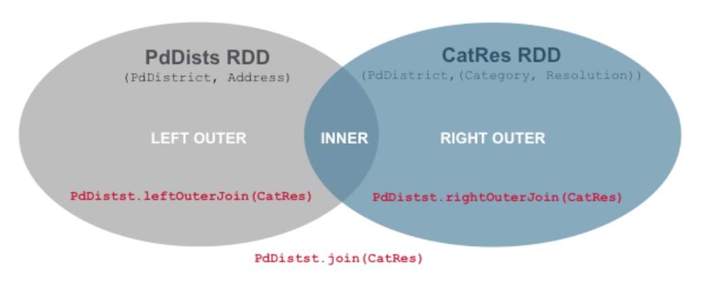

# 键值对与分区

> **版本基线（更新于 2026-02-13）**
> 本书默认适配 Apache Spark 4.1.1（稳定版），并兼容 4.0.2 维护分支。
> 推荐环境：JDK 17+（建议 JDK 21）、Scala 2.13、Python 3.10+。
本章介绍如何使用键值对RDD，这是Spark中许多操作所需的常见数据类型。键值RDD通常用于执行聚合，通常将做一些数据初始的提取、转换和加载，以将数据转换为键值对格式。在键值对RDD上可以应用新的操作，例如计数每个产品的评论；将数据与相同的键分组在一起；并将两个不同的RDD分组在一起。

另外在本章，我们还讨论了一个高级功能，即分区功能，可让用户跨节点地控制配对RDD的布局。使用可以控制的分区，应用程序有时可以通过确保数据在同一个节点上一起访问，大大降低数据分布在不同节点上的通信成本，这样可以显着的减少RDD计算时间。

## 键值对RDD

到目前为止，我们已经使用了RDD，其中每行代表一个值，例如整数或字符串。在许多用例中，需要按某个键进行分组或聚合、联结两个RDD。现在来看一下另一个RDD类型：键值对RDD。键值对的数据格式可以在多种编程语言中找到。它是一组数据类型，由一组带有一组关联值的键标识符组成。使用分布式数据时，将数据组织成键值对是有用的，因为它允许在网络上聚合数据或重新组合数据。与MapReduce类似，Spark以RDD的形式支持键值对数据格式。

在Scala语言中，Spark键值对RDD的表示是二维元组。键值对RDD在许多Spark程序中使用。当想要在分布式系统中进行值聚合或重新组合时，需要通过其中的键进行索引，例如有一个包含城市级别人口的数据集，并且想要在州级别汇总，那么需要按州对这些行进行分组，并对每个州所有城市的人口求和；另一个例子是提取客户标识作为键，以查看所有客户的订单。要想满足键值对RDD的要求，每一行必须包含一个元组，其中第一个元素代表键，第二个元素代表值。键和值的类型可以是简单的类型，例如整数或字符串，也可以是复杂的类型，例如对象或值的集合或另一个元组。键值对RDD带有一组API，可以围绕键执行常规操作，例如分组、聚合和联接。

scala\> val rdd = sc.parallelize(List("Spark","is","an", "amazing",
"piece", "of","technology"))

rdd: org.apache.spark.rdd.RDD\[String\] = ParallelCollectionRDD\[0\] at
parallelize at \<console\>:24

scala\> val pairRDD = rdd.map(w =\> (w.length,w))

pairRDD: org.apache.spark.rdd.RDD\[(Int, String)\] =
MapPartitionsRDD\[1\] at map at \<console\>:25

scala\> pairRDD.collect().foreach(println)

(5,Spark)

(2,is)

(2,an)

(7,amazing)

(5,piece)

(2,of)

(10,technology)

代码 4.1

上面的代码创建了键值对RDD，每一行为一个元组，其中键是长度，值是单词。它们被包裹在一对括号内。一旦以这种方式排列了每一行，我们就可以通过按键分组轻松发现长度相同的单词。以下各节将介绍如何创建键值对RDD，以及如何使用关联的转换和操作。

### 创建

现在将看看怎样创建键值对。创建键值对最常的方法包括：使用已经存在的非键值对；或加载特定数据时也可以获得键值对，有很多数据格式将被创建为键值对；另一种方法是通过内存中的集合创建键值对。

虽然大多数Spark操作适用于包含任何类型对象的RDD，但是几个特殊操作只能在键值对的RDD上使用，例如按键分组或聚合元素，这些操作都需要进行分布式洗牌。在Scala语言中，这些操作可以在包含Tuple2对象的RDD上自动可用。键值对操作在PairRDDFunctions类中，自动封装在元组RDD上。键值对RDD中的键和值可以是标量值或复杂值，可以是对象，对象集合或另一个元组。当使用自定义对象作为键值对RDD中的键时，该对象的类必须同时定义自定义的equals()和hashCode()方法。

  - 语法解释

Scala元组结合件多个固定数量的项目在一起，使它们可以被作为一个整体传递。不像一个数组或列表，元组可以容纳不同类型的对象，但它们也是不可改变的。这里是一个元组持有整数、字符串和Console，如下的一个例子：

val t = (1, "hello", Console)

代码 4.3

这是语法方糖，是下面代码的简写方式：

val t = new Tuple3(1, "hello", Console)

代码 4.4

一个元组的实际类型取决于它包含的元素和这些元素的类型和数目。因此该类型 (99, "Luftballons") 是 Tuple2\[Int,
String\]；而('u', 'r', "the", 1, 4, "me") 的类型是 Tuple6\[Char, Char, String,
Int, Int,
String\]。元组类型包括Tuple1、Tuple2、Tuple3等等，至少目前的上限为22，如果需要更多，那么可以使用一个集合，而不是一个元组。对于每个TupleN类型，其中1\<=
N \<= 22，Scala定义了许多元素的访问方法。假定定义一个元组t为：

val t = (4,3,2,1)

代码 4.5

要访问的元组t的元素，可以使用的方法t.\_1访问的第一个元素，t.\_2进入第二个，依此类推。例如，下面的表达式计算t的所有元素的总和：

val sum = t.\_1 + t.\_2 + t.\_3 + t.\_4

代码 4.6

存在许多格式的数据可以直接加载为键值对，例如sequenceFile文件是Hadoop用来存储二进制形式的键值对\[Key,Value\]对而设计的一种平面文件。在此示例中，SequenceFile由键值对(Category,1)组成，当加载到Spark中时会产生键值对RDD，代码如下：

scala\> val data = sc.parallelize(List(("key1", 1), ("Key2", 2),
("Key3", 2)))

data: org.apache.spark.rdd.RDD\[(String, Int)\] =
ParallelCollectionRDD\[16\] at parallelize at \<console\>:24

scala\> data.saveAsSequenceFile("/data/seq-output")

代码 4.9

SequenceFile可以用于解决大量小文件问题，SequenceFile是Hadoop
API提供的一种二进制文件支持，直接将键值对序列化到文件中，一般对小文件可以使用这种文件合并，即将文件名作为键，文件内容作为值序列化到大文件中，如下的代码是怎样读取SequenceFile：

scala\> import org.apache.hadoop.io.{Text, IntWritable}

import org.apache.hadoop.io.{Text, IntWritable}

scala\> val result = sc.sequenceFile("/data/seq-output",
classOf\[Text\], classOf\[IntWritable\]).map{case (x, y) =\>
(x.toString, y.get())}

result: org.apache.spark.rdd.RDD\[(String, Int)\] =
MapPartitionsRDD\[19\] at map at \<console\>:26

scala\> result.collect

res11: Array\[(String, Int)\] = Array((key1,1), (Kay2,2), (Key3,2))

代码 4.10

  - def sequenceFile\[K, V\](path: String, keyClass: Class\[K\],
    valueClass: Class\[V\]): RDD\[(K, V)\]

使用给定的键和值类型获取Hadoop SequenceFile的RDD。

  - > path为输入数据文件的目录，可以是逗号分隔的路径作为输入列表

  - > keyClass为与SequenceFileInputFormat关联的键类

  - > valueClass为与SequenceFileInputFormat关联的值类

可以说，键值对RDD在许多程序中起着非常有用的构建块的作用。基本上，一些操作允许我们并行操作每个键，通过这一点可以在整个网络上重新组合数据。reduceByKey()方法分别为每个键聚合数据，而join()方法通过将具有相同键的元素分组来将两个RDD合并在一起。我们可以从RDD中提取字段，例如客户ID、事件时间或其他标识符，然后将这些字段用作键值对RDD中的键。

  - Scala模式匹配

Scala 提供了强大的模式匹配机制，应用也非常广泛。一个模式匹配包含了一系列备选项，每个都开始于关键字
case。每个备选项都包含了一个模式及一到多个表达式。箭头符号 =\>
隔开了模式和表达式。上面的代码中使用了元组匹配模式，使用下面的例子来学习其语法：

val langs = Seq(

("Scala", "Martin", "Odersky"),

("Clojure", "Rich", "Hickey"),

("Lisp", "John", "McCarthy"))

代码 4.11

定义langs序列（Seq）变量，其中包含三个三维元组。

for (tuple \<- langs) {

tuple match {

case ("Scala", \_, \_) =\> println("Found Scala")

case (lang, first, last) =\>

println(s"Found other language: $lang ($first, $last)")

}

}

代码 4.12

在for循环中，定义了case模式匹配。第一个case匹配一个三元素元组，其中第一个元素是字符串“Scala”，忽略第二个和第三个参数；第二个case匹配任何三元素元组，元素可以是任何类型，但是由于输入langs，它们被推断为字符串。将元素提取为变量lang、first和last，输出结果为：

Found Scala

Found other language: Clojure (Rich, Hickey)

Found other language: Lisp (John, McCarthy)

代码 4.13

在上面的代码中，一个元组可以分解成其组成元素。可以匹配元组中的字面值，在任何想要的位置，可以忽略不关心的元素。

使用Scala和Python语言，可以使用SparkContext.parallelize方法从的内存集合创建一键值对，代码如下：

scala\> val dist1 = Array(("INGLESIDE",1), ("SOUTHERN",1), ("PARK",1),
("NORTHERN",1))

dist1: Array\[(String, Int)\] = Array((INGLESIDE,1), (SOUTHERN,1),
(PARK,1), (NORTHERN,1))

scala\> val dist1RDD = sc.parallelize(dist1)

dist1RDD: org.apache.spark.rdd.RDD\[(String, Int)\] =
ParallelCollectionRDD\[44\] at parallelize at \<console\>:30

scala\> dist1RDD.collect

res29: Array\[(String, Int)\] = Array((INGLESIDE,1), (SOUTHERN,1),
(PARK,1), (NORTHERN,1))

代码 4.14

在这个例子中，首先这是在内存中创建键值对集合dist1，然后通过SparkContext.parallelize方法应用于dist1来创建键值对dist1RDD。另外，在一组小文本文件上运行sc.wholetextFiles将创建键值对，其中键是文件的名称，而值为文件中的内容。

### 转换

键值对RDD允许使用标准RDD可用的所有转换，由于键值对包含元组，需要在转换方法中传递可以在元组上操作的函数。下面的部分总结了键值对常用转换，然后分别详细介绍几个转换。

  - 基于一个键值对RDD的转换

创建一个键值对RDD：

scala\> val rdd = sc.parallelize(List((1, 2), (3, 4), (3, 6)))

rdd: org.apache.spark.rdd.RDD\[(Int, Int)\] =
ParallelCollectionRDD\[15\] at parallelize at \<console\>:24

代码 4.15

  - reduceByKey(func: (V, V) ⇒ V, numPartitions: Int): RDD\[(K, V)\]

调用包含(K, V)的数据集，返回的结果也为(K, V)。数据集中的每个键对应的所有值被聚集，使用给定的汇总功能func，其类型必须为(V,
V) =\> V。像groupByKey，汇总任务的数量是通过第二个可选的参数numPartitions配置，这个参数设置RDD的分区数。

scala\> rdd.reduceByKey((x, y) =\> x + y).collect

res5: Array\[(Int, Int)\] = Array((1,2), (3,10))

代码 4.16

  - groupByKey(numPartitions: Int): RDD\[(K, Iterable\[V\])\]

调用包含(K, V)的数据集，返回(K,
Iterable\<V\>)。如果分组的目的是为了对每个键执行聚集，如总和或平均值，使用reduceByKey或aggregateByKey将产生更好的性能。默认情况下，输出的并行任务数取决于RDD谱系中父RDD的分区数，可以通过一个可选的参数numPartitions来设置不同数量的任务。

scala\> rdd.groupByKey().collect

res6: Array\[(Int, Iterable\[Int\])\] = Array((1,CompactBuffer(2)),
(3,CompactBuffer(4, 6)))

代码 4.17

  - combineByKey\[C\](createCombiner: (V) ⇒ C, mergeValue: (C, V) ⇒ C,
    mergeCombiners: (C, C) ⇒ C): RDD\[(K, C)\]

使用相同的键组合值，产生与输入不同的结果类型。例子和详细的说明见后面的部分4.1.1.1.2。

  - mapValues\[U\](f: (V) ⇒ U): RDD\[(K, U)\]

对键值对RDD的每个值应用一个方法，而不用改变键。

scala\> rdd.mapValues(x =\> x+1).collect

res11: Array\[(Int, Int)\] = Array((1,3), (3,5), (3,7))

代码 4.18

  - flatMapValues\[U\](f: (V) ⇒ TraversableOnce\[U\]): RDD\[(K, U)\]

与mapValues相似，将键值对中每个值传递给函数f而不改变键，不同的是将数据的内在结构扁平化。

scala\> rdd.flatMapValues(x =\> (x to 5)).collect

res13: Array\[(Int, Int)\] = Array((1,2), (1,3), (1,4), (1,5), (3,4),
(3,5))

代码 4.19

  - keys: RDD\[K\]

将键值对RDD中每个元组的键返回，产生一个RDD。

scala\> rdd.keys.collect

res15: Array\[Int\] = Array(1, 3, 3)

代码 4.20

  - values: RDD\[V\]

将键值对RDD中每个元组的值返回，产生一个RDD。

scala\> rdd.values.collect

res20: Array\[Int\] = Array(2, 4, 6)

代码 4.21

  - sortByKey(ascending: Boolean = true, numPartitions: Int =
    self.partitions.length): RDD\[(K, V)\]

当在数据集(K, V)上被调用时，K实现了有序化，返回按照以键的顺序排列的数据集(K,V)，布尔参数ascending中指定地升序或降序。

scala\> rdd.sortByKey().collect

res25: Array\[(Int, Int)\] = Array((1,2), (3,4), (3,6))

代码 4.22

  - aggregateByKey\[U\](zeroValue: U)(seqOp: (U, V) ⇒ U, combOp: (U, U)
    ⇒ U)(implicit arg0: ClassTag\[U\]): RDD\[(K, U)\]

使用给定的组合函数和中性zeroValue来聚合每个键的值。该函数可以返回与输入键值对RDD中的V值类型不同的结果类型U。因此，需要一个用于将V合并到U中的操作和一个用于合并两个U的操作，如在scala.TraversableOnce中。前一个函数seqOp用于合并分区中的值，后者combOp用于在分区之间合并值。为了避免内存分配，这两个函数都允许修改并返回其第一个参数，而不是创建一个新的U。

scala\> val pairRDD = sc.parallelize(List( ("cat",2), ("cat", 5),
("mouse", 4),("cat", 12), ("dog", 12), ("mouse", 2)), 2)

pairRDD: org.apache.spark.rdd.RDD\[(String, Int)\] =
ParallelCollectionRDD\[1\] at parallelize at \<console\>:24

scala\> def myfunc(index: Int, iter: Iterator\[(String, Int)\]) :
Iterator\[String\] = {

| iter.map(x =\> "\[partID:" + index + ", val: " + x + "\]")

| }

myfunc: (index: Int, iter: Iterator\[(String, Int)\])Iterator\[String\]

scala\> pairRDD.mapPartitionsWithIndex(myfunc).collect

res0: Array\[String\] = Array(\[partID:0, val: (cat,2)\], \[partID:0,
val: (cat,5)\], \[partID:0, val: (mouse,4)\], \[partID:1, val:
(cat,12)\], \[partID:1, val: (dog,12)\], \[partID:1, val: (mouse,2)\])

scala\> pairRDD.aggregateByKey(0)(math.max(\_, \_), \_ + \_).collect

res1: Array\[(String, Int)\] = Array((dog,12), (cat,17), (mouse,6))

scala\> pairRDD.aggregateByKey(100)(math.max(\_, \_), \_ + \_).collect

res2: Array\[(String, Int)\] = Array((dog,100), (cat,200), (mouse,200))

代码 4.23

上面的代码中，通过定义myfunc函数，分别打印出RDD分区中内容。

  - 基于两个键值对RDD的转换

创建两个键值对RDD，分别为：

scala\> val rdd = sc.parallelize(List((1, 2), (3, 4), (3, 6)))

rdd: org.apache.spark.rdd.RDD\[(Int, Int)\] =
ParallelCollectionRDD\[42\] at parallelize at \<console\>:24

scala\> val other = sc.parallelize(List((3,9)))

other: org.apache.spark.rdd.RDD\[(Int, Int)\] =
ParallelCollectionRDD\[43\] at parallelize at \<console\>:24

代码 4.24

  - subtractByKey

从rdd中删除other中存在的键元素。

scala\> rdd.subtractByKey(other).collect

res27: Array\[(Int, Int)\] = Array((1,2))

代码 4.25

  - join(otherDataset, \[numTasks\])

在两个RDD之间执行内部连接。

scala\> rdd.join(other).collect

res28: Array\[(Int, (Int, Int))\] = Array((3,(4,9)), (3,(6,9)))

代码 4.26

  - rightOuterJoin

在两个RDD之间执行连接，其中键必须存在于第一个RDD中。

scala\> rdd.rightOuterJoin(other).collect

res30: Array\[(Int, (Option\[Int\], Int))\] = Array((3,(Some(4),9)),
(3,(Some(6),9)))

代码 4.27

  - leftOuterJoin

在两个RDD之间执行连接，其中键必须存在于另一个RDD中。

scala\> rdd.leftOuterJoin(other).collect

res31: Array\[(Int, (Int, Option\[Int\]))\] = Array((1,(2,None)),
(3,(4,Some(9))), (3,(6,Some(9))))

代码 4.28

  - cogroup(otherDataset, \[numTasks\])

将两个RDD具有相同键的值组合在一起。

scala\> rdd.cogroup(other).collect

res32: Array\[(Int, (Iterable\[Int\], Iterable\[Int\]))\] =
Array((1,(CompactBuffer(2),CompactBuffer())), (3,(CompactBuffer(4,
6),CompactBuffer(9))))

代码 4.29

#### 聚合

当使用键值对来描述数据集时，通常需要在具有相同键的所有元素上统计数据。对于基本的RDD的fold、combine和reduce操作，在键值对RDD上也有基于键的类似操作，这些操作基于相同的键进行汇集。 这些操作是转换而不是动作。

##### reduceByKey

基本上，reduceByKey函数仅适用于包含键值对元素类型的RDD，即具有Tuple或Map作为数据元素。这是一个转型操作，这意味着被懒惰地评估。我们需要传递一个关联函数作为参数，该函数将应用于键值对RDD，创建带有结果值的RDD，即新的键值对。由于分区间可能发生数据Shuffle，此操作是一项涉及全数据集的广泛操作。

在数学中，关联属性是一些二元运算的属性。在命题逻辑中，关联性是在逻辑证明中替换表达式的有效规则。在包含同一个关联运算符的一行中出现两次或更多次的表达式中，只要操作数序列未更改，操作的执行次序就无关紧要。也就是说，重新排列这种表达式中的括号不会改变其值。考虑下面的等式：

\[(2 + 3) + 4 = 2 + (3 + 4) = 9\]

\[2 \times \left( 3 \times 4 \right) = \left( 2 \times 3 \right) \times 4 = 24\]

公式 4‑1

关联性让我们可以按顺序并行使用相同的函数。reduceByKey使用该属性计算RDD的结果，RDD是由分区组成的分布式集合。直观地说，这个函数在重复应用于具有多个分区的同一组RDD数据时会产生相同的结果，而不管元素的顺序如何。此外，它首先使用Reduce函数在本地执行合并，然后在分区之间发送记录以准备最终结果，通过下面的代码看一看reduceByKey的执行过程：

scala\> val x = sc.parallelize(Array(("a", 1), ("b", 1), ("a", 1),("a",
1), ("b", 1), ("a", 1),("b", 1), ("b", 1), ("a", 1), ("b", 1), ("a",
1),("b", 1)), 3)

x: org.apache.spark.rdd.RDD\[(String, Int)\] =
ParallelCollectionRDD\[5\] at parallelize at \<console\>:24

scala\> x.reduceByKey(\_ + \_).collect()

res3: Array\[(String, Int)\] = Array((a,6), (b,6))

代码 4.30

图例 4‑1 ReduceByKey运行示意图

在上图中，可以看到RDD具有多个键值对元素，如(a,1)和(b,1)，以及3个分区。在对整个分区之间的数据洗牌之前，先在每个本地分区中进行相同的聚合。可以使用reduceByKey与mapValues一起计算每个键的平均值，代码和图示如下：

scala\> val rdd =
sc.parallelize(List(("panda",0),("pink",3),("pirate",3),("panda",1),("pink",4)))

rdd: org.apache.spark.rdd.RDD\[(String, Int)\] =
ParallelCollectionRDD\[29\] at parallelize at \<console\>:24

scala\> rdd.mapValues(x =\> (x, 1)).reduceByKey((x, y) =\> (x.\_1 +
y.\_1, x.\_2 + y.\_2)).collect

res38: Array\[(String, (Int, Int))\] = Array((panda,(1,2)),
(pink,(7,2)), (pirate,(3,1)))

图例 4‑2每键平均值计算的数据流

实际上，reduceByKey是aggregateByKey的一个特列。aggregateByKey有两个函数参数：一个应用于每个分区的聚合，另一个应用于分区之间聚合。reduceByKey在上述两种情况下都使用相同的关联函数，在每个分区上执行一遍，然后在分区间执行一遍，将第一遍的结果合并为最终结果。

##### combineByKey

combineByKey调用就是这样一种优化。使用combineByKey值时，每个分区合并为一个值，然后将每个分区值合并为一个值。值得注意的是，组合值的类型不必与原始值的类型相匹配，而且通常不会。combineByKey函数将3个函数作为参数，第一个创建组合器的函数，在aggregateByKey函数中，第一个参数只是zeroValue，在combineByKey中提供了一个函数，它将接受我们当前的值作为参数，并返回将与合成值合并的新值；第二个函数是一个合并函数，它接受一个值并将它合并或组合到先前收集的值中；第三个函数将合并的值组合在一起，基本上这个函数采用在分区级别上产生的新值，并将它们结合起来，直到得到一个最后的结果，下面是一个执行combineByKey的代码：

scala\> val data = sc.parallelize(List(("A", 3), ("A", 9), ("A",
12),("B", 4), ("B", 10), ("B", 11)))

data: org.apache.spark.rdd.RDD\[(String, Int)\] =
ParallelCollectionRDD\[0\] at parallelize at \<console\>:24

scala\> val sumCount=data.combineByKey((v)=\>(v,1),(acc:(Int,Int),v)
=\>(acc.\_1+v,acc.\_2+1),(acc1:(Int,Int),acc2:(Int,Int))=\>(acc1.\_1+acc2.\_1,acc1.\_2+acc2.\_2))

sumCount: org.apache.spark.rdd.RDD\[(String, (Int, Int))\] =
ShuffledRDD\[1\] at combineByKey at \<console\>:26

scala\> sumCount.foreach(println)

(B,(25,3))

(A,(24,3))

scala\> val averageByKey = sumCount.map{case(key, value)=\>(key,
value.\_1 / value.\_2.toFloat)}

averageByKey: org.apache.spark.rdd.RDD\[(String, Float)\] =
MapPartitionsRDD\[2\] at map at \<console\>:28

scala\> averageByKey.foreach(println)

(A,8.0)

(B,8.333333)

代码 4.31

参考上面的代码，combineByKey需要三个函数分别为：createCombiner、mergeValue和mergeCombiner：

  - createCombiner

(v)=\>(v,1)

combineByKey方法中的第一个函数是必选参数，用作每个键的第一个聚合步骤。当在每个分区中，如果找不到每个键的组合器，createCombiner会为分区上每个遇到的第一个键创建初始组合器。上面代码是用在分区中遇到的第一个值和为1的键计数器初始化一个tuple，其值为（v,
1），v代表第一个遇到的值，表示存储组合器的存储内容为（sum, count）。

  - mergeValue

(acc:(Int,Int),v) =\>(acc.\_1+v,acc.\_2+1)

这是下一个必需的函数，告诉combineByKey当组合器被赋予一个新值时该怎么做。该函数的参数是组合器acc和新值v。组合器的结构在上面被定义为(sum,
count)形式的元组，acc.\_1执行累加代表组合器的sum，acc.\_2执行计数代表组合器中的count。所以通过将新值v添加到组合器元组的第一个元素，同时将加1到组合器元组的第二个元素来合并新值。mergeValue只有在这个分区上已经创建了初始组合器（在我们的例子中为元组）时才被触发。

  - mergeCombiner

(acc1:(Int,Int),acc2:(Int,Int))=\>(acc1.\_1+acc2.\_1,acc1.\_2+acc2.\_2)

最终一个必需的函数告诉combineByKey如何合并分区之间的两个组合器。在这个例子中，每个分区组合器元组的形式为(sum,
count)，需要做的就是将第一个分区依次到最后一个分区中组合器加在一起。

最终目标是逐个计算平均值averageByKey()。combineByKey()的结果是RDD，其格式为(label, (sum,
count)) ，因此可以通过使用map方法，映射(sum, count)到sum /
count来轻松获取平均值。接下来将数据的子集分解到多个分区，并在实际中看数据的计算方式：

分区一

A=3 --\> createCombiner(3) ==\> accum\[A\] = (3, 1)

A=9 --\> mergeValue(accum\[A\], 9) ==\> accum\[A\] = (3 + 9, 1 + 1)

B=11 --\> createCombiner(11) ==\> accum\[B\] = (11, 1)

分区二

A=12 --\> createCombiner(12) ==\> accum\[A\] = (12, 1)

B=4 --\> createCombiner(4) ==\> accum\[B\] = (4, 1)

B=10 --\> mergeValue(accum\[B\], 10) ==\> accum\[B\] = (4 + 10, 1 + 1)

合并分区

A ==\> mergeCombiner((12, 2), (12, 1)) ==\> (12 + 12, 2 + 1)

B ==\> mergeCombiner((11, 1), (14, 2)) ==\> (11 + 14, 1 + 2)

sumCount输出为：

Array((A, (24, 3)), (B, (25, 3)))

#### 分组

使用键键值对数据，一个常见的用例是按键分组的数据，例如一起查看客户的所有订单。如果数据已经按照想要的方式组成键值对元组，groupByKey将使用的RDD中的键对数据进行分组。在由K型键和V型值构成的RDD上，分组后得到\[K,
Iterable\[V\]\]类型的RDD。现在使用groupByKey实现上面reduceByKey代码的功能：

scala\> val x = sc.parallelize(Array(("a", 1), ("b", 1), ("a", 1),("a",
1), ("b", 1), ("a", 1),("b", 1), ("b", 1), ("a", 1), ("b", 1), ("a",
1),("b", 1)), 3)

x: org.apache.spark.rdd.RDD\[(String, Int)\] =
ParallelCollectionRDD\[4\] at parallelize at \<console\>:24

scala\> x.groupByKey().map(t =\> (t.\_1, t.\_2.sum)).collect

res4: Array\[(String, Int)\] = Array((a,6), (b,6))

代码 4.32

得到的结果与上面的代码一致，但是数据的计算过程不一样。另一方面，当调用groupByKey时所有的键值对都在Shuffle，在网络中传输的大量不必要的数据。当在一个执行器上有更多的数据在内存中进行Shuffle时，Spark将内存数据溢出到磁盘中。但是，一次只会将一个键数据刷新到磁盘上，因此如果单个键的值超过了内存容量，则会发生内存不足异常。这种情况在Spark的后续版本中可以更加优雅地处理，因此作业仍然可以继续，但仍然应该避免。当Spark需要溢出到磁盘时，性能会受到严重影响。

图例 4‑3 GroupByKey运行示意图

可以尝试的一种优化方法是合并或组合值，因此最终只发送较少的键值对。另外，较少的键值对意味着Reduce不会有太多的工作要做，从而带来额外的性能提升。groupByKey()调用不会尝试进行合并或组合值，因此这是一项昂贵的操作。对于一个更大的数据集，洗牌数据量的差异在reduceByKey()和groupByKey()之间会变得更加夸张和不同。以下是比groupByKey更优化的方法：

  - combineByKey可用于组合元素，但返回类型与输入值类型不同。

  - foldByKey使用关联函数和中性“zeroValue”合并每个键的值。

#### 连接

一些最有用的操作来自于将键值对RDD与其他键值对RDD进行连接，将数据连接在一起可能是键值对中最常见的操作之一。并且有一系列选项，包括左右外连接、交叉连接和内连接。由于数据框功能的增强，这部分功能也可能通过数据框的JOIN操作实现。

简单的join运算符是内连接，只输出两键值对RDD中共同拥有的键。当在其中一个输入RDD中具有相同键和多个值的键值对时，结果键值对RDD将具有来自两个输入键值对RDD的该键的每个可能的值对，下面的代码帮助理解这种操作结果：

scala\> val employees = sc.parallelize(List((31,"Rafferty"),
(33,"Jones"), (33,"Heisenberg"),(34,"Robinson"), (34,"Smith"),
(30,"Williams")))

employees: org.apache.spark.rdd.RDD\[(Int, String)\] =
ParallelCollectionRDD\[60\] at parallelize at \<console\>:24

scala\> val departments = sc.parallelize(Array((31, "Sales"), (33,
"Engineering"), (34, "Clerical"),(35, "Marketing")))

departments: org.apache.spark.rdd.RDD\[(Int, String)\] =
ParallelCollectionRDD\[61\] at parallelize at \<console\>:24

scala\> departments.join(employees).collect

res66: Array\[(Int, (String, String))\] =
Array((34,(Clerical,Robinson)), (34,(Clerical,Smith)),
(33,(Engineering,Jones)), (33,(Engineering,Heisenberg)),
(31,(Sales,Rafferty)))

代码 4.33

有时候，并不需要结果键值对RDD中的键同时出现在两个输入键值对RDD中。例如，如果通过建议加入客户信息，如果没有任何建议，可能不想删除客户信息。leftOuterJoin(other)和rightOuterJoin(other)都通过键将两个输入键值对RDD连接在一起，其中一个RDD可能丢失掉无法匹配的键，而另一个保存了所有的键。

使用leftOuterJoin，结果RDD将保留所有源RDD中的每个键。在结果RDD中，与每个键相关联的值是一个元组，由输入键值对源RDD的值以及来自另一输入键值对RDD的值Option组成。在Python中，如果不存在值，则使用None；并且如果值存在，则使用不带任何包装器的常规值。与join类似，每个键可以有多个条目；当这种情况发生时，得到两个值列表之间的笛卡尔乘积。rightOuterJoin与rightOuterJoin几乎相同，除了键必须存在于另一个RDD中，并且生成的元组中具有Option的为源输入键值对RDD而不是另一个。使用代码
4.33中的两个输入键值对departments和employees来演示leftOuterJoin和rightOuterJoin的用法：

scala\> departments.leftOuterJoin(employees).collect

res67: Array\[(Int, (String, Option\[String\]))\] =
Array((34,(Clerical,Some(Robinson))), (34,(Clerical,Some(Smith))),
(35,(Marketing,None)), (33,(Engineering,Some(Jones))),
(33,(Engineering,Some(Heisenberg))), (31,(Sales,Some(Rafferty))))

scala\> departments.rightOuterJoin(employees).collect

res68: Array\[(Int, (Option\[String\], String))\] =
Array((34,(Some(Clerical),Robinson)), (34,(Some(Clerical),Smith)),
(30,(None,Williams)), (33,(Some(Engineering),Jones)),
(33,(Some(Engineering),Heisenberg)), (31,(Some(Sales),Rafferty)))

代码 4.34

  - Option、Some和None

强大的Scala语言可以使用Option类，定义函数返回值，其值可能为null。简单地说，如果函数成功时返回一个对象，而在失败时返回null，那么可以定义函数返回的返回值为一个Option实例，其中Option对象是Some类的实例或None类的实例。因为Some和None都是Option的子项，所以的函数签名只是声明返回一个包含某种类型的Option（如下面显示的Int类型）。至少，这让的函数用户知道发生了什么巨大的好处。以下是使用Scala
Option语法的示例。

def toInt(in: String): Option\[Int\] = {

try {

Some(Integer.parseInt(in.trim))

} catch {

case e: NumberFormatException =\> None

}

}

代码 4.35

以下是这个toInt函数的工作原理：它需要一个String作为参数。如果它可以将String转换为Int，那么它返回为Some（Int）；如果String不能转换为Int，则返回None。如果是调用此函数的代码将如下所示：

toInt(someString) match {

case Some(i) =\> println(i)

case None =\> println("That didn't work.")

}

代码 4.36

#### 排序

对数据进行排序在很多情况下非常有用，特别是在产生后续的输出时。可以使用键值对RDD进行排序，前提是在键上定义了一个排序。一旦对数据进行了排序，对排序后的数据进行后续调用collect()或save()操作，将导致有序的数据。

sortByKey函数作用于键值对形式的RDD上，并对键进行排序。它是在org.apache.spark.rdd.OrderedRDDFunctions中实现的，实现如下：

  - sortByKey(ascending: Boolean = true, numPartitions: Int =
    self.partitions.length): RDD\[(K, V)\]

从函数的实现可以看出，它主要接受两个函数，其含义和sortBy一样，这里就不进行解释了。该函数返回的RDD一定是ShuffledRDD类型的，因为对源RDD进行排序，必须进行洗牌操作，而洗牌操作的结果RDD就是ShuffledRDD。其实这个函数的实现很优雅，里面用到了RangePartitioner，它可以使得相应的范围键数据分到同一个分区中，然后内部用到了mapPartitions对每个分区中的数据进行排序，而每个分区中数据的排序用到了标准的排序机制，避免了大量数据的shuffle。下面对sortByKey的使用进行说明：

scala\> val a = sc.parallelize(List("wyp", "iteblog", "com",
"397090770", "test"), 2)

a: org.apache.spark.rdd.RDD\[String\] =

ParallelCollectionRDD\[30\] at parallelize at \<console\>:12

scala\> val b = sc. parallelize (1 to a.count.toInt , 2)

b: org.apache.spark.rdd.RDD\[Int\] = ParallelCollectionRDD\[31\] at
parallelize at \<console\>:14

scala\> val c = a.zip(b)

c: org.apache.spark.rdd.RDD\[(String, Int)\] =
ZippedPartitionsRDD2\[32\] at zip at \<console\>:16

scala\> c.sortByKey().collect

res11: Array\[(String, Int)\] = Array((397090770,4), (com,3),
(iteblog,2), (test,5), (wyp,1))

代码 4.37

上面对键进行了排序，sortBy()函数中可以对排序方式进行重写，sortByKey()也有这样的功能，通过在OrderedRDDFunctions类中有个变量ordering，它是隐式的：

private val ordering = implicitly\[Ordering\[K\]\]

代码 4.38

这就是默认的排序规则，可以对它进行重写，如下：

scala\> val b = sc.parallelize(List(3,1,9,12,4))

b: org.apache.spark.rdd.RDD\[Int\] = ParallelCollectionRDD\[38\] at
parallelize at \<console\>:12

scala\> val c = b.zip(a)

c: org.apache.spark.rdd.RDD\[(Int, String)\] =
ZippedPartitionsRDD2\[39\] at zip at \<console\>:16

scala\> c.sortByKey().collect

res15: Array\[(Int, String)\] = Array((1,iteblog), (3,wyp), (4,test),
(9,com), (12,397090770))

scala\> implicit val sortIntegersByString = new Ordering\[Int\]{

| override def compare(a: Int, b: Int) =

| a.toString.compare(b.toString)}

sortIntegersByString: Ordering\[Int\] =
$iwC$$iwC$$iwC$$iwC$$iwC$$anon$1@5d533f7a

scala\> c.sortByKey().collect

res17: Array\[(Int, String)\] = Array((1,iteblog), (12,397090770),
(3,wyp), (4,test), (9,com))

代码 4.39

例子中的sortIntegersByString就是修改了默认的排序规则。这样将默认按照Int大小排序改成了对字符串的排序，所以12会排序在3之前。

### 动作

与转换一样，所有在基础RDD上提供的传统转换操作也可用在键值对RDD上，当然键值对RDD可以使用一些额外的操作，首先创建一个RDD：

scala\> val rdd = sc.parallelize(List((1, 2), (3, 4), (3, 6)))

rdd: org.apache.spark.rdd.RDD\[(Int, Int)\] =
ParallelCollectionRDD\[15\] at parallelize at \<console\>:24

代码 4.40

  - countByKey(): Map\[K, Long\]

对每个键进行计数，只有当返回的结果Map预计很小时，才应该使用此方法，因为整个内容都会加载到驱动程序的内存中。要处理非常大的结果，可以考虑使用：

rdd.mapValues（\_ =\> 1L）.reduceByKey（\_ + \_）

代码 4.41

其将返回RDD \[T，Long\]而不是Map。

scala\> rdd.countByKey()

res74: scala.collection.Map\[Int,Long\] = Map(1 -\> 1, 3 -\> 2)

代码 4.42

  - collectAsMap(): Map\[K, V\]

与collect()类似，但对关键值RDD起作用并将其转换为Scala
Map以保留其键值结构，如果键值对RDD中同一个键有多个值，则每个键中只有一个值会保留在返回的Map中。因为所有的数据都加载到驱动程序的内存中，所以只有在结果数据很小时才应使用此方法。

scala\> rdd.collectAsMap()

res80: scala.collection.Map\[Int,Int\] = Map(1 -\> 2, 3 -\> 6)

代码 4.43

  - lookup(key: K): Seq\[V\]

返回与提供键相关联的所有值。如果RDD具有已知的分区程序，则只需搜索该键映射到的分区即可高效地执行此操作。

scala\> rdd.lookup(3)

res91: Seq\[Int\] = WrappedArray(4, 6)

代码 4.44

## 分区和洗牌

我们已经了解Apache
Spark如何比Hadoop更好地处理分布式计算，还看到了内部工作原理主要是称为弹性分布式数据集的基本数据结构。RDD是代表数据集的不可变集合，并具有可靠性和故障恢复的内在能力。实际上，RDD对数据的操作不是基于整个数据块，数据是分布于整个群集的分区中，通过RDD的抽象层进行管理和操作数据。因此，数据分区的概念对于Apache
Spark 作业的正常运行至关重要，并且会对性能产生很大影响，决定了资源的利用情况。

RDD由数据分区组成，基于RDD的所有操作都在数据分区上执行，诸如转换之类的几种操作是在执行器上运行的函数，特定的数据分区也此执行器上。但是并非所有操作过程都可以仅由所在的执行器所包含的数据分区孤立完成，像聚合这样的操作要求将数据跨阶段移到整个集群中。在本节中，我们将深入研究分区和洗牌的概念，通过执行以下代码来研究简单的整数RDD。SparkContext的parallelize()函数根据整数序列创建RDD，然后使用getNumPartitions()函数可以获得该RDD的分区数：

scala\> val rdd\_one = sc.parallelize(Seq(1,2,3))

rdd\_one: org.apache.spark.rdd.RDD\[Int\] = ParallelCollectionRDD\[0\]
at parallelize at \<console\>:24

scala\> rdd\_one.getNumPartitions

res0: Int = 24

分区的数量很重要，因为该数量直接影响将要运行RDD转换的任务数量。如果分区的数量太少，那么大量数据可能仅使用几个CPU核，从而降低性能，并使群集利用率不足。另一方面，如果分区的数量太大，那么将使用比实际需要更多的资源，并且在多用户的环境中，可能导致正在运行的其他作业的资源匮乏。如果要查看CPU的核数可以使用下面的命令：

root@bb8bf6efccc9:\~\# lscpu | egrep 'CPU\\(s\\)'

CPU(s): 24

On-line CPU(s) list: 0-23

NUMA node0 CPU(s): 0-11

NUMA node1 CPU(s): 12-23

### 分区

Spark的分区是存储在集群中节点上的原始数据块，即逻辑划分。RDD是这种分区的集合，通过RDD的抽象概念隐藏了正在处理的分段数据。这种分区结构可帮助Spark实现并行化分布式数据处理，并以最小的网络流量在执行程序之间发送数据。

分区的数量对于一个良好的集群性能来说非常重要。如果有很少的分区，那么将不能充分利用集群中内存和CPU资源，因为某些资源可能处于空闲状态，例如假设有一个Spark集群具有10个CPU内核，一般来说一个CPU内核负责一个分区的计算，在这种情况下如果有少于10个分区，那么一些CPU内核将处于空闲状态，所以会产生资源浪费。此外，由于更少分区，每个分区中就会有更多的数据，这样会造成集群中某些节点内存增加的压力。另一方面，如果有太多的分区那么每个分区可能具有太少的数据或根本没有数据，也可能会降低性能，因为集群中的数据分区可能是跨节点的，从多个节点上汇总分区中的数据需要更多的计算和传输时间。因此根据Spark集群配置情况设置合适的分区是非常重要的。Spark只能一次为RDD的每个分区分配运行一个并发任务，一次最多的并发任务为集群中的最大CPU核心数。所以如果有一个10核CPU的集群，那么至少要为的RDD定义10个分区，分区总数一般来说为内核的2-4倍。默认情况下，Spark会创建等于集群中CPU核心数的分区数，也可以随时更改分区数，来看下面的例子来创建具有指定分区数的RDD

scala\> val names = Seq("Steve","Andrew","Bob","John","Quinton")

names: Seq\[String\] = List(Steve, Andrew, Bob, John, Quinton)

scala\> val regularRDD = sc.parallelize(names)

regularRDD: org.apache.spark.rdd.RDD\[String\] =
ParallelCollectionRDD\[114\] at parallelize at \<console\>:27

scala\> regularRDD.partitions.size

res32: Int = 24

scala\> val regularRDD = sc.parallelize(names,48)

regularRDD: org.apache.spark.rdd.RDD\[String\] =
ParallelCollectionRDD\[116\] at parallelize at \<console\>:27

scala\> regularRDD.partitions.size

res100: Int = 28

代码 4.42

正如代码中看到的，regularRDD的默认分区数量等于2，这是由于当前环境是通过本地模式启动的spark-shell，本地模式是在具有24核CPU的Docker虚拟实验环境中。如果在创建RDD时指定了分区数48，regularRDD的分区就变成了48。在创建RDD时，第二个参数定义要为该RDD创建的分区数。一个分区从不跨越多台机器，即同一分区中的所有元组都保证在同一台机器上。群集中的每个工作节点都可以包含一个或多个RDD的分区。分区总数是可配置的，默认情况下它等于所有执行器节点上的核心总数。

Spark提供了两个内置分区器，分别是哈希分区器和范围分区器。创建RDD时，可以通过两种方式指定特定的分区器：一种方式是通过在RDD上调用partitionBy()方法来提供显式指定的分区器；另一种方式是通过转换操作返回新创建的RDD，其使用转换操作特定的分区器。带有分区器的转换操作有：join()、leftOuterJoin()、rightOuterJoin()、groupByKey()、reduceByKey()、cogroup()、foldByKey()、combineByKey()、sort()、partitionBy()、groupWith()；另外mapValues()、flatMapValues()和filter()的分区方式与父级RDD有关。而像map()这样的操作会导致新创建的RDD忘记父分区信息，因为像这样的操作理论上可以修改每个记录的键，所以在这种情况下如果操作在结果RDD中保留了分区器，则不再有任何意义，因为现在的键都是不同的。所以spark提供像mapValues()和flatMapValues()这样的操作，如果不想改变键可以使用这些操作，从而保留分区器。partitionBy()是一个转化操作，因此它的返回值总是一个新的RDD，但它不会改变原来的RDD。RDD一旦创建就无法修改，因此应该对partitionBy()的结果进行持久化。如果没有将partitionBy()
转化操作的结果持久化，那么后面每次用到这个RDD 时都会重复地对数据进行分区操作。不进行持久化会导致整个RDD
谱系图重新求值。那样的话，partitionBy()
带来的好处就会被抵消，导致重复对数据进行分区以及跨节点的混洗，和没有指定分区方式时发生的情况十分相似。

哈希分区是Spark中的默认分区程序，通过计算RDD元组中每个键哈希值来工作，具有相同哈希码的所有元素最终都位于相同的分区中，如以下代码片段所示：

partitionIndex = hashcode(key) % numPartitions

如果键相同则其hashCode的结果相同，其对应的值保存在相同的分区上。哈希分区是Spark的默认分区器。如果没有提到任何分区器，那么Spark将使用哈希分区器对数据进行分区。来看下面的例子以便更好的理解

scala\> val data = Seq((1,1),(2,4),(4,16),(2,8),(4,64))

data: Seq\[(Int, Int)\] = List((1,1), (2,4), (4,16), (2,8), (4,64))

scala\> import org.apache.spark.HashPartitioner

import org.apache.spark.HashPartitioner

scala\> val rdd = sc.parallelize(data).partitionBy(new
HashPartitioner(4))

rdd: org.apache.spark.rdd.RDD\[(Int, Int)\] = ShuffledRDD\[1\] at
partitionBy at \<console\>:27

scala\> rdd.glom.collect

res0: Array\[Array\[(Int, Int)\]\] = Array(Array((4,16), (4,64)),
Array((1,1)), Array((2,4), (2,8)), Array())

代码 4.46

  - def glom(): RDD\[Array\[T\]\]

glom()方法将分区中的数据封装为数组，并将这些分区数组嵌入到一个数组中。每个返回的数组都包含一个分区的内容，(4,16)和(4,64)的键都是4，所以在同一个分区中；(1,1)和(2,4)的键分别为1和2，所以在不同的分区中。

如果RDD的键是可排序的，则范围分区器可以基于键的范围进行划分。由于范围分区器必须知道任何分区的开始键和结束键，因此在使用范围分区器之前，需要先对RDD进行排序。范围分区器首先需要基于RDD为分区分配合理的边界，然后创建一个从键到元素所属分区索引的函数，最后需要根据范围分区器重新划分RDD，以根据确定的范围正确分配RDD元素，来看下面的例子

scala\> val data = Seq((1,1),(2,4),(4,16),(2,8),(4,64))

data: Seq\[(Int, Int)\] = List((1,1), (2,4), (4,16), (2,8), (4,64))

scala\> val rdd = sc.parallelize(data)

rdd: org.apache.spark.rdd.RDD\[(Int, Int)\] =
ParallelCollectionRDD\[14\] at parallelize at \<console\>:28

scala\> import org.apache.spark.RangePartitioner

import org.apache.spark.RangePartitioner

scala\> val rangePartitioner = new RangePartitioner(2,rdd)

rangePartitioner: org.apache.spark.RangePartitioner\[Int,Int\] =
org.apache.spark.RangePartitioner@8ce

scala\> val partRDD = rdd.partitionBy(rangePartitioner)

partRDD: org.apache.spark.rdd.RDD\[(Int, Int)\] = ShuffledRDD\[13\] at
partitionBy at \<console\>:28

scala\> partRDD.glom.collect

res3: Array\[Array\[(Int, Int)\]\] = Array(Array((1,1), (2,4), (2,8)),
Array((4,16), (4,64)))

代码 4.47

哈希分区器已经能够满足绝大部分的情况了，但是由于键的数量分布可能不均匀，所以也会造成分区中的数据分布不均。如果键可以进行排序的化可以采用范围分区器，能保证各个分区之间的键是有序的，并且各个分区之间数据量差不多，但是不保证单个分区内键的有序性。范围分区器会将键切分成一段段的范围，每段范围对应一个分区，简单的说就是将一定范围内的键映射到某一个分区内，划分各个分区键的范围采用的方法为水塘抽样算法。

虽然Spark 提供的哈希分区器与范围分区已经能够满足大多数用例，但Spark 还是允许通过提供一个自定义的分区对象来控制RDD
的分区方式，这可以通过在Spark中扩展默认的分区类来定制需要的分区数量，以及定义如果存储在这些分区中的数据。要实现自定义的分区器，我们需要继承org.apache.spark.Partitioner
类并实现下面三个方法：

（1）numPartitions: Int，定义需要创建的分区数；

（2）getPartition(key: Any): Int，输入参数为特定的键，返回特定的分区编号，从0到numPartitions-1；

（3）equals()，判断相等性的标准方法。这个方法的实现非常重要，Spark
需要用这个方法来检查你的分区器对象是否和其他分区器实例相同，这样Spark
才可以判断两个RDD 的分区方式是否相同。

现在实现一个自定义分区器：

步骤一：定义分区器MyPartitioner

class MyPartitioner extends org.apache.spark.Partitioner {

//定义分区数为2

def numPartitions: Int = 2

//如果键为2则分区编号为0，其他键的分区编号为1

def getPartition(key: Any): Int = {

key match {

case null =\> 0

case 2 =\> 0

case \_ =\> numPartitions - 1

}

}

override def equals(other: Any): Boolean = {

other match {

case h: MyPartitioner =\> true

case \_ =\> false

}

}

}

步骤二：测试自定义分区器，自定义分区器可以从/data/code/MyPartitioner.txt中加载

scala\> :load /data/code/MyPartitioner.txt

Loading /data/code/MyPartitioner.txt...

defined class MyPartitioner

scala\> val data = Seq((1, 1), (2, 4), (4, 16), (2, 8), (4, 64))

data: Seq\[(Int, Int)\] = List((1,1), (2,4), (4,16), (2,8), (4,64))

scala\> val rdd = sc.parallelize(data)

rdd: org.apache.spark.rdd.RDD\[(Int, Int)\] = ParallelCollectionRDD\[0\]
at parallelize at \<console\>:26

scala\> val c = rdd.partitionBy(new MyPartitioner)

c: org.apache.spark.rdd.RDD\[(Int, Int)\] = ShuffledRDD\[1\] at
partitionBy at \<console\>:26

scala\> rdd.glom.collect

res0: Array\[Array\[(Int, Int)\]\] = Array(Array(), Array(), Array(),
Array(), Array((1,1)), Array(), Array(), Array(), Array(), Array((2,4)),
Array(), Array(), Array(), Array(), Array((4,16)), Array(), Array(),
Array(), Array(), Array((2,8)), Array(), Array(), Array(),
Array((4,64)))

scala\> c.glom.collect

res1: Array\[Array\[(Int, Int)\]\] = Array(Array((2,4), (2,8)),
Array((1,1), (4,16), (4,64)))

代码 4.48

在这个自定义分区器MyPartitioner中，简单的将键为2的数据放到分区编号为0的分区中，其他放到分区ID为1中。这个自定义分区器可以与哈希分区器和范围分区器相同的方式使用，只需要创建一个对象，并将其传递给partitionBy()方法。下面是作用在分区上的其他方法：

  - def mapPartitions\[U\](f: (Iterator\[T\]) ⇒ Iterator\[U\],
    preservesPartitioning: Boolean = false)(implicit arg0:
    ClassTag\[U\]): RDD\[U\]

这是一个专门的map()操作，每个分区函数f仅被调用一次，可以通过输入参数Iterarator
\[T\]将各个分区的全部内容作为值的顺序流使用。自定义函数必须返回另一个Iterator
\[U\]。合并的结果迭代器将自动转换为新的RDD。reservesPartitioning指示输入函数是否保留分区器，除非这是一对RDD并且输入函数不修改键，否则应为false。

scala\> val a = sc.parallelize(1 to 9, 3)

a: org.apache.spark.rdd.RDD\[Int\] = ParallelCollectionRDD\[33\] at
parallelize at \<console\>:26

scala\> def myfunc\[T\](iter: Iterator\[T\]) : Iterator\[(T, T)\] = {

| var res = List\[(T, T)\]()

| var pre = iter.next

| while (iter.hasNext)

| {

| val cur = iter.next;

| res .::= (pre, cur)

| pre = cur;

| }

| res.iterator

| }

myfunc: \[T\](iter: Iterator\[T\])Iterator\[(T, T)\]

scala\> a.glom.collect

res18: Array\[Array\[Int\]\] = Array(Array(1, 2, 3), Array(4, 5, 6),
Array(7, 8, 9))

scala\> a.mapPartitions(myfunc).glom.collect

res15: Array\[Array\[(Int, Int)\]\] = Array(Array((2,3), (1,2)),
Array((5,6), (4,5)), Array((8,9), (7,8)))

代码 4.49

myfunc函数的作用是将分区中数据作为输入，例如分区(1, 2, 3)，然后按顺序进行配对输出(2, 3)和(1,
2)，由于myfunc函数以分区数据作为输入，所以最终的输出结果中缺少元组(3, 4)和(6,
7)，如果查看a的分区数据，3和6分别为两个分区中最后一个值，所以无法产生(3, 4)和(6,
7)元组。

  - def mapPartitionsWithIndex\[U\](f: (Int, Iterator\[T\]) ⇒
    Iterator\[U\], preservesPartitioning: Boolean = false)(implicit
    arg0: ClassTag\[U\]): RDD\[U\]

与mapPartitions()类似，但是f函数需要两个参数(Int,
Iterator\[T\])，第一个参数是分区编号，第二个参数是该分区中所有数据的迭代器，在应用f函数进行转换之后，输出是一个包含数据列表的迭代器Iterator\[U\]。

scala\> val x = sc.parallelize(List(1,2,3,4,5,6,7,8,9,10), 3)

x: org.apache.spark.rdd.RDD\[Int\] = ParallelCollectionRDD\[22\] at
parallelize at \<console\>:26

scala\> def myfunc(index: Int, iter: Iterator\[Int\]) :
Iterator\[String\] = {

| iter.map(x =\> index + "-" + x)

| }

myfunc: (index: Int, iter: Iterator\[Int\])Iterator\[String\]

scala\> x.mapPartitionsWithIndex(myfunc).glom.collect

res17: Array\[Array\[String\]\] = Array(Array(0-1, 0-2, 0-3), Array(1-4,
1-5, 1-6), Array(2-7, 2-8, 2-9, 2-10))

代码 4.50

  - foreachPartition(f: (Iterator\[(K, C)\]) ⇒ Unit): Unit

为每个分区执行f函数，通过(Iterator\[(K, C)\])参数提供分区中的数据项，f函数没有返回值。

scala\> val b = sc.parallelize(List(1, 2, 3, 4, 5, 6, 7, 8, 9), 3)

b: org.apache.spark.rdd.RDD\[Int\] = ParallelCollectionRDD\[35\] at
parallelize at \<console\>:26

scala\> b.foreachPartition(x =\> println(x.reduce(\_ + \_)))

6

15

24

代码 4.51

foreachPartition()方法属于动作操作，而mapPartitions()是转换操作，此外在应用场景上区别是mapPartitions()可以获取返回值，可以继续在返回的RDD上做其他的操作，而foreachPartition因为没有返回值并且是动作操作，所以一般都是用于将数据保存到存储系统中。

### 洗牌

Spark中的某些操作会触发一个称为洗牌事件，也称为Shuffle，这是Spark重新分配数据的机制，以便在不同分区之间进行数据分组。分布式系统的数据查找和交换非常占用系统的计算和带宽资源，所以合理对数据进行布局可以最小化网络流量来大大提高性能。如果数据是键值对，则分区变得非常必要，因为在RDD的转换中，整个网络中数据的洗牌是相当大的。如果相同的键或键范围存储在相同的分区中，则可以将洗牌最小化，并且处理实质上会变得快。这可能会导致洗牌的操作包括重新分区，例如repartition()和coalesce()；带有“ByKey”的操作，比如groupByKey()和reduceByKey()，但是不包括countByKey()；以及连接操作，如cogroup()和join()。

实际上，洗牌是消耗资源的操作，因为它涉及的磁盘的读写、数据序列化和网络传输。为了组织数据，Spark生成一组任务，映射任务以组织数据，以及一组聚合任务来汇总数据。在内部机制来说，来自单个映射任务的结果会保存在内存中，直到内存不足为止。然后这些将根据目标分区进行排序并写入单个文件中，而聚合任务读取相关的排序块。这通常涉及在执行器和机器之间复制数据，使得洗牌成为复杂而耗费系统资源的操作。为了理解在洗牌过程中会发生什么，可以考虑执行一个reduceByKey()方法的操作过程。reduceByKey()操作需要生成一个新的RDD，其中的数据是进行了聚合操作的键值对元组，其中的值是将每个键对应的所有值进行聚合计算产生的结果。这个过程所面临的挑战是：并非每个键的所有值都同时位于同一个分区，甚至是不在同一台计算机上，而这种分布可能是随机的，但必须在整个Spark集群中收集所有这些值然后进行聚合计算。所以洗牌的作用就是将原来随机存储在分区中数据根据聚合的要求进行重新存放，可以保证在聚合计算时具有相同键的元组可以在同一分区，减少聚合计算时查找和传输元组需要的计算成本和带宽。

在Spark中，通常不会因为特定操作将数据跨分区分布在一个指定的位置。在计算过程中，Spark需要执行全部操作并且将其分成多个任务，单个任务将在单个分区上运行，因此Spark要负责组织reduceByKey()执行单个聚合任务的所有数据，必须从所有分区中读取以找到键对应的所有值，然后将各分区中的值汇总以计算每个键的最终聚合结果，这个移动数据的过程称为洗牌。虽然执行新的洗牌后，每个分区中的元素集合都是确定性的，而且分区本身的排序也是确定性的。但是分区中的元素排序是不确定的，如果希望在洗牌后数据可以按照预设的顺序排序，那么可以使用mapPartitions()对每个分区进行排序，例如使用.sorted；使用repartitionAndSortWithinPartitions()在进行重新分区的同时有效地对分区进行分类；或者使用sortBy()对全局RDD进行排序。

scala\> import org.apache.spark.HashPartitioner

import org.apache.spark.HashPartitioner

scala\> val array=Array(2,2,6,6,3,3,4,4,5,5)

array: Array\[Int\] = Array(2, 2, 6, 6, 3, 3, 4, 4, 5, 5)

scala\> val data=sc.parallelize(array, 4)

data: org.apache.spark.rdd.RDD\[Int\] = ParallelCollectionRDD\[42\] at
parallelize at \<console\>:27

scala\> data.zipWithIndex().glom.collect

res40: Array\[Array\[(Int, Long)\]\] = Array(Array((2,0), (2,1)),
Array((6,2), (6,3), (3,4)), Array((3,5), (4,6)), Array((4,7), (5,8),
(5,9)))

scala\> data.zipWithIndex().repartitionAndSortWithinPartitions(new
HashPartitioner(4)).glom.collect

res41: Array\[Array\[(Int, Long)\]\] = Array(Array((4,6), (4,7)),
Array((5,8), (5,9)), Array((2,0), (2,1), (6,2), (6,3)), Array((3,4),
(3,5)))

正如Spark
API中所写，repartitionAndSortWithinPartitions()比先调用repartition()然后在每个分区内进行排序要有效，因为它可以将排序过程推入洗牌的机制中。可以看到
repartitionAndSortWithinPartitions()主要是通过给定的分区器，将相同键的元组发送到指定分区，并根据键进行排排序，我们可以按照自定义的排序规则，进行二次排序。二次排序模式是指先按照键分组，然后按照特定的顺序遍历数。

某些洗牌操作会消耗大量的堆内存，因为它们在传输前后使用内存中的数据结构组织记录。具体而言，reduceByKey()和aggregateByKey()在进行映射转换时创建数据的结构，而在进行聚合动作时产生这样数据。当数据不适合存储在内存中时，Spark会将这些数据溢出到磁盘中，从而导致磁盘I/O的额外开销和增加的垃圾回收。洗牌还会在磁盘上生成大量中间文件。从Spark
1.3开始，这些文件将被保留，直到相应的RDD不再使用并被垃圾收集为止。这样做是为了在重新计算定义RDD的谱系时不需要重新创建洗牌文件。如果应用程序保留对这些RDD的引用或者垃圾回收未频繁引入，垃圾收集可能会在很长一段时间后才会发生。这意味着长时间运行的Spark作业可能会消耗大量的磁盘空间。在配置Spark上下文时，临时存储目录spark.local.dir由配置参数指定，这部分的内容在性能优化的章节会继续说明。

## 共享变量

共享变量是许多函数和方法必须并行使用的变量，可以在并行操作中使用。通常，当Spark操作，例如map()或reduce()，在远程集群节点上执行时，函数被传递到操作中，而且函数所需要的变量会在每个节点任务上拷贝副本，所以Spark操作可以独立的执行。这些变量被复制，并且在远程计算机上的变量更新都不会传播回驱动程序。如果在各个任务之间支持通用的读写共享变量将效率很低。但是Spark实现了两种常用模式，提供了有限类型的共享变量：广播变量和累加器。

### 广播变量

广播变量是所有执行程序之间的共享变量，是在驱动程序中创建的，然后在执行程序上是只读的。广播变量使Spark的操作可以在每台计算机上保留一个只读变量，而不用将其副本与任务一起发送，可以使用它们以有效的方式为每个节点提供大型输入数据集的副本。

可以在Spark集群中广播整个数据集，以便执行器可以访问广播的数据。执行器中运行的所有任务都可以访问广播变量。广播使用各种优化的方法使广播数据可供所有执行器访问。因为广播的数据集的尺寸可能很大，这是要解决的重要挑战。执行器通过HTTP连接和最新的组件提取数据，类似于BitTorrent，数据集本身像洪流一样快速地分布到群集中。这使扩展性更强的方法可以将广播变量分发给所有执行程序，而不是让每个执行器一个接一个地从驱动程序中提取数据，当我们有很多执行器时，这可能会导致驱动程序发生故障。

Spark的动作是通过一组阶段执行的，这些阶段被分布式洗牌操作分割。Spark自动广播每个阶段中任务所需的通用数据。以这种方式广播的数据以序列化形式缓存，并在运行每个任务之前反序列化。这意味着仅当跨多个阶段的任务需要相同数据，或以反序列化形式缓存数据非常重要时，显式创建广播变量才有用。广播变量是通过调用SparkContext.broadcast(v)方法，从变量v创建的。广播变量是变量v的包装，可以通过调用value方法来访问其值。让我们看看如何广播一个Integer变量，然后在执行器上执行的转换操作中使用广播变量：

scala\> val rdd\_one = sc.parallelize(Seq(1,2,3))

rdd\_one: org.apache.spark.rdd.RDD\[Int\] = ParallelCollectionRDD\[0\]
at parallelize at \<console\>:24

scala\> val i = 5

i: Int = 5

scala\> val bi = sc.broadcast(i)

bi: org.apache.spark.broadcast.Broadcast\[Int\] = Broadcast(0)

scala\> bi.value

res0: Int = 5

scala\> rdd\_one.take(5)

res1: Array\[Int\] = Array(1, 2, 3)

scala\> rdd\_one.map(j =\> j + bi.value).take(5)

res2: Array\[Int\] = Array(6, 7, 8)

广播变量也可以不仅仅在原始数据类型上创建，如下面的示例所示，我们将从驱动程序广播HashMap：

scala\> val rdd\_one = sc.parallelize(Seq(1,2,3))

rdd\_one: org.apache.spark.rdd.RDD\[Int\] = ParallelCollectionRDD\[2\]
at parallelize at \<console\>:24

scala\> val m = scala.collection.mutable.HashMap(1 -\> 2, 2 -\> 3, 3 -\>
4)

m: scala.collection.mutable.HashMap\[Int,Int\] = Map(2 -\> 3, 1 -\> 2, 3
-\> 4)

scala\> val bm = sc.broadcast(m)

bm:
org.apache.spark.broadcast.Broadcast\[scala.collection.mutable.HashMap\[Int,Int\]\]
= Broadcast(7)

scala\> rdd\_one.map(j =\> j \* bm.value(j)).take(5)

res3: Array\[Int\] = Array(2, 6, 12)

广播变量确实会占用所有执行器的内存，而且取决于广播变量中包含的数据大小，这有时可能会导致资源问题。有一种方法可以从所有执行程序的内存中删除广播变量。在广播变量上调用unpersist()会从所有执行器的内存缓存中删除广播变量的数据，以释放资源。如果再次使用该变量，则数据将重新传输给执行器，以便再次使用。下面是如何在广播变量上调用unpersist()的示例。调用unpersist后，如果再次访问广播变量将在后台照常工作，执行器再次为该变量提取数据。

scala\> val rdd\_one = sc.parallelize(Seq(1,2,3))

rdd\_one: org.apache.spark.rdd.RDD\[Int\] = ParallelCollectionRDD\[4\]
at parallelize at \<console\>:24

scala\> val k = 5

k: Int = 5

scala\> val bk = sc.broadcast(k)

bk: org.apache.spark.broadcast.Broadcast\[Int\] = Broadcast(11)

scala\> rdd\_one.map(j =\> j + bk.value).take(5)

res4: Array\[Int\] = Array(6, 7, 8)

scala\> bk.unpersist

scala\> rdd\_one.map(j =\> j + bk.value).take(5)

res6: Array\[Int\] = Array(6, 7, 8)

我们还可以销毁广播变量，将其从所有执行器中完全删除，并且驱动程序也无法访问它们。这对于在整个集群中最佳地管理资源非常有帮助。在广播变量上调用destroy()会破坏与指定广播变量相关的所有数据和元数据。广播变量一旦销毁将无法再次使用，而必须重新创建，以下是销毁广播变量的示例：

scala\> val rdd\_one = sc.parallelize(Seq(1,2,3))

rdd\_one: org.apache.spark.rdd.RDD\[Int\] = ParallelCollectionRDD\[7\]
at parallelize at \<console\>:24

scala\> val k = 5

k: Int = 5

scala\> val bk = sc.broadcast(k)

bk: org.apache.spark.broadcast.Broadcast\[Int\] = Broadcast(18)

scala\> rdd\_one.map(j =\> j + bk.value).take(5)

res7: Array\[Int\] = Array(6, 7, 8)

scala\> bk.destroy

scala\> rdd\_one.map(j =\> j + bk.value).take(5)

20/03/06 15:30:05 ERROR Utils: Exception encountered

org.apache.spark.SparkException: Attempted to use Broadcast(18) after it
was destroyed (destroy at \<console\>:26)

### 累加器

累加器是执行器之间的共享变量，通常用于向Spark程序添加计数器。累加器是仅通过关联和交换操作进行累加的变量，因此可以有效地被并行操作支持，可用于实现计数器（如MapReduce中的计数器）或求和。Spark本机支持数字类型的累加器，也可以添加对新类型的支持。我们可以创建命名或未命名的累加器。一个已命名的累加器将在Web
UI中显示。以下是使用Spark
Context和longAccumulator函数创建和使用整数累加器的示例，以将新创建的累加器变量初始化为零。随着累加器在map()转换中使用，累加器也会增加。操作结束时，累加器的值为351。

scala\> val statesPopulationRDD =
sc.textFile("/data/statesPopulation.csv")

statesPopulationRDD: org.apache.spark.rdd.RDD\[String\] =
/data/statesPopulation.csv MapPartitionsRDD\[1\] at textFile at
\<console\>:24

scala\> val acc1 = sc.longAccumulator("acc1")

acc1: org.apache.spark.util.LongAccumulator = LongAccumulator(id: 0,
name: Some(acc1), value: 0)

scala\> val someRDD = statesPopulationRDD.map(x =\> {acc1.add(1); x})

someRDD: org.apache.spark.rdd.RDD\[String\] = MapPartitionsRDD\[2\] at
map at \<console\>:27

scala\> acc1.value

res0: Long = 0

scala\> someRDD.count

res1: Long = 351

scala\> acc1.value

res2: Long = 351

scala\> acc1

res3: org.apache.spark.util.LongAccumulator = LongAccumulator(id: 0,
name: Some(acc1), value: 351)

内置的累加器可用于许多用例，其中包括：

（1）LongAccumulator：用于计算64位整数的和、计数和平均值

（2）DoubleAccumulator：用于计算双精度浮点数的总和、计数和平均值。

（3）CollectionAccumulator \[T\]：用于收集元素列表

尽管上面的例子使用了内置支持的整数类型累加器，我们也可以通过将AccumulatorV2子类化来创建自己的类型。AccumulatorV2抽象类具有几种必须重写的方法：reset()用于将累加器重置为零；add()用于将另一个值添加到累加器；merge()将另一个相同类型的累加器合并到该方法中。API文档中包含其他必须重写的方法。接下来，我们将看一个自定义累加器的实际示例。同样，我们将为此使用statesPopulation
CSV文件。我们的目标是在自定义累加器中累加年份和人口总数。

步骤1.导入包含AccumulatorV2类的软件包：

import org.apache.spark.util.AccumulatorV2

步骤2.包含年份和人口的案例类别：

case class YearPopulation(year: Int, population: Long)

步骤3. StateAccumulator类扩展了AccumulatorV2：

class StateAccumulator extends AccumulatorV2\[YearPopulation,
YearPopulation\] {

//为年份和人口数量声明两个变量

private var year = 0

private var population:Long = 0L

//如果年份和人口数量为零返回iszero

override def isZero: Boolean = year == 0 && population == 0L

//拷贝累加器并且返回一个新的累加器

override def copy(): StateAccumulator = {

val newAcc = new StateAccumulator

newAcc.year = this.year

newAcc.population = this.population

newAcc

}

//重置年份和人口数量为零

override def reset(): Unit = { year = 0 ; population = 0L }

//添加值到累加器中

override def add(v: YearPopulation): Unit = {

year += v.year

population += v.population

}

//合并两个累加器

override def merge(other: AccumulatorV2\[YearPopulation,
YearPopulation\]): Unit = {

other match {

case o: StateAccumulator =\> {

year += o.year

population += o.population

}

case \_ =\>

}

}

//被spark调用的函数，访问累加器的值

override def value: YearPopulation = YearPopulation(year, population)

}

步骤4.创建一个新的StateAccumulator并将其注册到SparkContext：

val statePopAcc = new StateAccumulator

sc.register(statePopAcc, "statePopAcc")

步骤5.将statesPopulation.csv阅读为RDD：

val statesPopulationRDD
=sc.textFile("statesPopulation.csv").filter(\_.split(",")(0) \!=
"State")

statesPopulationRDD.take(10)

步骤6.使用StateAccumulator：

statesPopulationRDD.map(x =\> {

val toks = x.split(",")

val year = toks(1).toInt

val pop = toks(2).toLong

statePopAcc.add(YearPopulation(year, pop))

x

}).count

步骤7.现在我们可以检查StateAccumulator的值：

statePopAcc.value

上面的步骤是自定义累加器的分步骤讲解，其中包括数据的提取、累加器的定义、执行和结果输出，可以将上面每一步的代码汇总到一个文件中。在本教程的虚拟实验环境中集成的上述代码，可以在/data/code/AccumulatorsExample.txt中找到。通过可以通过Scala的交互界面调用和执行这个文件中的代码，查看运行结果：

scala\> :load /data/code/AccumulatorsExample.txt

Loading /data/code/AccumulatorsExample.txt...

import org.apache.spark.util.AccumulatorV2

defined class YearPopulation

defined class StateAccumulator

statePopAcc: StateAccumulator = Un-registered Accumulator:
StateAccumulator

statesPopulationRDD: org.apache.spark.rdd.RDD\[String\] =
MapPartitionsRDD\[2\] at filter at /data/code/AccumulatorsExample.txt:25

res1: Array\[String\] = Array(Alabama,2010,4785492, Alaska,2010,714031,
Arizona,2010,6408312, Arkansas,2010,2921995, California,2010,37332685,
Colorado,2010,5048644, Delaware,2010,899816, District of
Columbia,2010,605183, Florida,2010,18849098, Georgia,2010,9713521)

res2: Long = 350

res3: YearPopulation = YearPopulation(0,0)

在本节中，我们研究了累加器以及如何构建自定义累加器。因此使用前面的示例，我们可以创建复杂的累加器以满足需求。

## Scala高级语法

### 高阶函数

高阶函数是指使用其他函数作为参数、或者返回一个函数作为结果的函数。因为在Scala中函数使用得最多，该术语可能会引起混淆，对于将函数作为参数或返回函数的方法和函数，我们将其定义为高阶函数。从计算机科学的角度来看，函数可以具有多种形式，例如一阶函数、高阶函数或纯函数。从数学的角度来看也是如此，使用高阶函数是可以执行以下操作之一：

（1）将一个或多个函数作为参数来执行某些操作

（2）将一个函数返回作为结果

除高阶函数外的所有其他函数均为一阶函数。但是，从数学的角度来看高阶函数也称为运算符或函数。另一方面，如果函数的返回值仅由其输入确定则称为纯函数。在本节中，我们将简要讨论为什么以及如何在scala中使用不同的函数范式。特别地，将讨论纯函数和高阶函数。在本节还将提供使用匿名函数的简要概述，因为在使用Scala开发Spark应用程序时经常使用匿名函数。

纯函数是这样一种函数，输入输出数据流全是显式的。显式的意思是，函数与外界交换数据只有一个唯一渠道：参数到返回值，函数从函数外部接受的所有输入信息都通过参数传递到该函数内部；函数输出到函数外部的所有信息都通过返回值传递到该函数外部。如果一个函数通过隐式方式，从外界获取数据，或者向外部输出数据，那么该函数就是非纯函数。隐式的意思是，函数通过参数和返回值以外的渠道，和外界进行数据交换，比如读取全局变量和修改全局变量都叫作以隐式的方式和外界进行数据交换；比如利用输入输出系统函数库读取配置文件，或者输出到文件，打印到屏幕，都叫做隐式的方式和外界进行数据交换。我们看一下纯函数与非纯函数的例子：

  - > 纯函数

scala\> def add(a:Int,b:Int) = a + b

add: (a: Int, b: Int)Int

scala\> var a = 1

a: Int = 1

  - > 非纯函数

scala\> def addA(b:Int) = a + b

addA: (b: Int)Int

scala\>

scala\> def add(a:Int,b:Int) = {

| println(s"a:$a b:$b")

| a + b

| }

add: (a: Int, b: Int)Int

scala\> def randInt() = Random.nextInt()

\<console\>:30: error: not found: value Random

def randInt() = Random.nextInt()

^

scala\> import scala.util.Random

import scala.util.Random

scala\> def randInt() = Random.nextInt()

randInt: ()Int

那么纯函数有什么好处？纯函数通常比其他函数代码量要少，尽管这也取决于其他因素，例如编程语言。并且由于看起来像数学函数，因此更容易被我们解释和理解。纯函数是函数式编程的核心功能，也是一种最佳实践，我们需要使用纯函数构建应用程序的核心部分。在编程领域中，函数是一段通过名称调用的代码，可以传递数据作为参数以对其进行操作并可以返回数据
传递给函数的所有数据都会显式传递。另一方面，方法也是一段通过名称调用的代码。但是，一个方法始终与一个对象相关联，作为对象的一个属性。在大多数情况下方法与功能是相同的，除了两个主要区别：

（1）方法被隐式地传递给被调用的对象

（2）方法可以对类中包含的数据进行操作

有时在的代码中，我们不想在使用函数之前先定义一个函数，也许是因为只需要在一个地方被使用，而不需要通过函数名在其他地方调用。在函数式编程中，有一类函数非常适合这种情况，称为匿名函数。Scala中的匿名函数是没有方法名，也不用def定义函数。一般匿名函数都是一个表达式，因此匿名函数非常适合替换那些只用一次且任务简单的常规函数，所以使得我们的代码变得更简洁了。匿名函数的语法很简单，箭头“=\>”左边是参数列表，右边是函数体。定义匿名函数的语法为:

(param1, param2) =\> \[expression\]

下面的表达式就定义了一个接受Int类型输入参数的匿名函数:

scala\> var inc = (x:Int) =\> x+1

inc: Int =\> Int = \<function1\>

上述定义的匿名函数，其实是下面这个常规函数的简写：

def add(x:Int):Int {

return x+1;

}

以上范例中的 inc被定义一个值，使用方式如下：

scala\> var x = inc(7)-1

x: Int = 7

同样我们可以在匿名函数中定义多个参数：

scala\> var mul = (x: Int, y: Int) =\> x\*y

mul: (Int, Int) =\> Int = \<function2\>

scala\> println(mul(3, 4))

12

我们也可以不给匿名函数设置参数，如下所示：

scala\> var userDir = () =\> { System.getProperty("user.dir") }

userDir: () =\> String = \<function0\>

scala\> println( userDir() )

/root

下划线“\_”可用作是匿名函数参数的占位符，但对于每一个参数，只能用下划线占位一次。在 Scala 中，\_ \* \_
表示匿名函数接受2个参数，函数返回值是两个参数的乘积。例如下列 Scala 代码中的
print(\_) 相当于 x =\> print(x)：

scala\> List(1, 2, 3, 4, 5).foreach(print(\_))

12345

scala\> List(1, 2, 3, 4, 5).reduceLeft(\_ + \_)

res52: Int = 15

最常见的一个例子是Scala集合类的高阶函数map()：

scala\> val salaries = Seq(20000, 70000, 40000)

salaries: Seq\[Int\] = List(20000, 70000, 40000)

scala\> val doubleSalary = (x: Int) =\> x \* 2

doubleSalary: Int =\> Int = \<function1\>

scala\> val newSalaries = salaries.map(doubleSalary)

newSalaries: Seq\[Int\] = List(40000, 140000, 80000)

函数doubleSalary()有一个整型参数x，返回x \*
2。一般来说，在“=\>”左边的元组是函数的参数列表，而右边表达式的值则为函数的返回值。在map()中调用函数doubleSalary()将其应用到列表salaries中的每一个元素上。为了简化压缩代码，我们可以使用匿名函数，直接作为参数传递给map()。注意在上述示例中x没有被显式声明为Int类型，这是因为编译器能够根据map函数期望的类型推断出x的类型。对于上述代码，一种更惯用的写法为：

scala\> val newSalaries = salaries.map(\_ \* 2)

newSalaries: Seq\[Int\] = List(40000, 140000, 80000)

既然Scala编译器已经知道了参数的类型，我们可以只给出函数的右半部分，不过需要使用“\_”代替参数名。我们同样可以传入一个对象方法作为高阶函数的参数，这是因为Scala编译器会将方法强制转换为一个函数。

scala\> case class WeeklyWeatherForecast(temperatures: Seq\[Double\]) {

| private def convertCtoF(temp: Double) = temp \* 1.8 + 32

| def forecastInFahrenheit: Seq\[Double\] =
temperatures.map(convertCtoF)

| }

defined class WeeklyWeatherForecast

在这个例子中，方法convertCtoF()被传入forecastInFahrenheit()。这是可以的，因为编译器强制将方法convertCtoF转成了函数x
=\> convertCtoF(x) ，x是编译器生成的变量名，保证在其作用域是唯一的。有一些情况我们希望生成一个函数，比如：

scala\> def urlBuilder(ssl: Boolean, domainName: String): (String,
String) =\> String = {

| val schema = if (ssl) "https://" else "http://"

| (endpoint: String, query: String) =\>
s"$schema$domainName/$endpoint?$query"

| }

urlBuilder: (ssl: Boolean, domainName: String)(String, String) =\>
String

scala\> val domainName = "www.example.com"

domainName: String = www.example.com

scala\> def getURL = urlBuilder(ssl=true, domainName)

getURL: (String, String) =\> String

scala\> val endpoint = "users"

endpoint: String = users

scala\> val query = "id=1"

query: String = id=1

scala\> val url = getURL(endpoint, query) //
"https://www.example.com/users?id=1": String

url: String = <https://www.example.com/users?id=1>

urlBuilder的返回类型是(String, String) =\>
String，这意味着返回的是匿名函数，其有两个String参数，返回一个String。

在scala相关的教程与参考文档里，经常会看到柯里化函数这个词。但是对于具体什么是柯里化函数，柯里化函数又有什么作用，其实可能很多同学都会有些疑惑，首先看两个简单的函数：

scala\> def add(x: Int, y: Int) = x + y

add: (x: Int, y: Int)Int

scala\> add(2, 1)

res54: Int = 3

scala\> def addCurry(x: Int)(y: Int) = x + y

addCurry: (x: Int)(y: Int)Int

scala\> addCurry(2)(1)

res55: Int = 3

以上两个函数实现的都是两个整数相加的功能。对于add函数，调用方式为add(1,2)。对于addCurry函数，调用的方式为addCurry(1)(2)，这种方式就叫做柯里化。addCurry
(1)(2) 实际上是依次调用两个普通函数，第一次调用使用一个参数
x，返回一个函数类型的值，第二次使用参数y调用这个函数类型的值，那么这个函数是什么意思呢？接收一个x为参数，返回一个匿名函数，该匿名函数的定义是：接收一个Int型参数y，函数体为x+y。现在我们来对这个函数进行调用：

scala\> def add(x:Int)=(y:Int)=\>x+y

add: (x: Int)Int =\> Int

scala\> val result = add(1)

result: Int =\> Int = \<function1\>

scala\> val sum = result(2)

sum: Int = 3

例子中返回一个result，那result的值应该是一个匿名函数：(y:Int)=\>1+y，所以为了得到结果，我们继续调用result，最后打印出来的结果就是3。

柯里函数最大的意义在于把多个参数的函数等价转化成多个单参数函数的级联，这样所有的函数就都统一方便做lambda演算。在Scala中，函数的柯里化对类型推演也有帮助，Scala的类型推演是局部的，在同一个参数列表中后面的参数不能借助前面的参数类型进行推演。通过柯里化函数后，后面的参数可以借助前面的参数参数类型进行推演。两个参数的函数可以拆分，同理三个参数的函数同样也可以柯里化：

scala\> def add(x:Int)(y:Int)(z:Int)= x + y + z

add: (x: Int)(y: Int)(z: Int)Int

scala\> add(10)(10)(10)

res19: Int = 30

简单看一个柯里化函数foldLeft()的定义：

  - def foldLeft\[B\](z: B)(op: (B, A) ⇒ B): B

这个函数在集合中很有用，其中B表示泛型，第一个(z: B)传递一个B类型的参数z，第二个(op: (B, A) ⇒
B)表示op参数表示为一个匿名函数，foldLeft()函数返回一个B类型的参数。foldLeft()函数将包含两个参数的函数op应用于初始值z和该集合的所有元素上，从左到右。
下面显示的是其用法示例。从初始值0开始，此处foldLeft将函数(m, n) =\> m +
n作为参数op，应用于列表array中的每个元素和先前的累加值0：

scala\> val numbers = List(1, 2, 3, 4, 5, 6, 7, 8, 9, 10)

numbers: List\[Int\] = List(1, 2, 3, 4, 5, 6, 7, 8, 9, 10)

scala\> numbers.foldLeft(0)((m, n) =\> m + n)

res56: Int = 55

scala\> numbers.foldLeft(0)(\_ + \_)

res57: Int = 55

请注意，如果使用多个参数列表的柯里函数，能够利用Scala类型推断使代码更简洁。下划线在scala中很有用，比如在初始化某一个变量的时候了下划线代表的是这个变量的默认值。在函数中下划线代表的是占位符，用来表示一个函数的参数，其名字和类型都会被隐式的指定了，当然如果Scala无法判断下划线代表的类型，那么就可能要报错了。另外，Scala还定义了foldLeft()另外一种替换方式：

  - def/:\[B\](z: B)(op: (B, A) ⇒ B): B

所以上面的代码也可以写为：

scala\> val res = (0/:numbers) ((m, n) =\> m + n)

res: Int = 55

### 泛型类

泛型类指可以接受类型参数的类。泛型类在集合类中被广泛使用。泛型类使用方括号\[\] 来接受类型参数。一个惯例是使用字母 A
作为参数标识符，当然我们可以使用任何参数名称。

scala\> class Stack\[A\] {

| private var elements: List\[A\] = Nil

| def push(x: A) { elements = x :: elements }

| def peek: A = elements.head

| def pop(): A = {

| val currentTop = peek

| elements = elements.tail

| currentTop

| }

| }

defined class Stack

上面的 Stack
类的定义中接受类型参数A，这意味着其内部的列表elements只能够存储类型A的元素，方法push()只接受类型A的实例对象作为参数，将x添加到elements前面然后重新分配给一个新的列表。要使用一个泛型类，需要将一个具体类型放到方括号中来代替A。

scala\> val stack = new Stack\[Int\]

stack: Stack\[Int\] = Stack@b0b2fcc

scala\> stack.push(1)

scala\> stack.push(2)

scala\> stack.pop

res62: Int = 2

scala\> stack.pop

res63: Int = 1

上面的实例对象 stack 只能接受整型值，然而如果类型参数有子类型，子类型可以被传入：

scala\> class Fruit

defined class Fruit

scala\> class Apple extends Fruit

defined class Apple

scala\> class Banana extends Fruit

defined class Banana

scala\> val stack = new Stack\[Fruit\]

stack: Stack\[Fruit\] = Stack@2d11ac93

scala\> val apple = new Apple

apple: Apple = Apple@5e36c9e6

scala\> val banana = new Banana

banana: Banana = Banana@115e07de

scala\> stack.push(apple)

scala\> stack.push(banana)

scala\> stack.pop

res66: Fruit = Banana@115e07de

scala\> stack.pop

res67: Fruit = Apple@5e36c9e6

类 Apple 和类 Banana 都继承自类 Fruit，所以我们可以把实例对象 apple 和 banana
压入stack中。泛型类型的子类是不可变，这表示如果我们有一个Char类型的栈
Stack\[Char\]，那它不能被用作一个Int的栈 Stack\[Int\]，否则就是不安全的。只有当类型 B = A 时，
Stack\[A\] 是 Stack\[B\] 的子类成立。Scala 提供了一种类型参数注释机制用以控制泛型类型的子类行为。

型变是复杂类型的子类型关系与其组件类型的子类型关系的相关性。Scala支持泛型类
的类型参数的型变注释，允许它们是协变的，逆变的，或在没有使用注释的情况下是不变的。在类型系统中使用型变允许我们在复杂类型之间建立直观的连接，而缺乏型变则会限制类抽象的重用性。

class Foo\[+A\] // A covariant class

class Bar\[-A\] // A contravariant class

class Baz\[A\] // An invariant class

协变

使用注释 +A，可以使一个泛型类的类型参数 A 成为协变。 对于某些类 class List\[+A\]，使 A 成为协变意味着对于两种类型 A
和 B，如果 A 是 B 的子类型，那么 List\[A\] 就是 List\[B\] 的子类型。
这允许我们使用泛型来创建非常有用和直观的子类型关系。

考虑以下简单的类结构：

abstract class Animal {

def name: String

}

case class Cat(name: String) extends Animal

case class Dog(name: String) extends Animal

类型 Cat 和 Dog 都是 Animal 的子类型。 Scala 标准库有一个通用的不可变的类 sealed abstract class
List\[+A\]，其中类型参数 A 是协变的。 这意味着 List\[Cat\] 是 List\[Animal\]，List\[Dog\]
也是 List\[Animal\]。 直观地说，猫的列表和狗的列表都是动物的列表是合理的，你应该能够用它们中的任何一个替换
List\[Animal\]。

在下例中，方法 printAnimalNames 将接受动物列表作为参数，并且逐行打印出它们的名称。 如果 List\[A\]
不是协变的，最后两个方法调用将不能编译，这将严重限制 printAnimalNames 方法的适用性。

object CovarianceTest extends App {

def printAnimalNames(animals: List\[Animal\]): Unit = {

animals.foreach { animal =\>

println(animal.name)

}

}

val cats: List\[Cat\] = List(Cat("Whiskers"), Cat("Tom"))

val dogs: List\[Dog\] = List(Dog("Fido"), Dog("Rex"))

printAnimalNames(cats)

// Whiskers

// Tom

printAnimalNames(dogs)

// Fido

// Rex

}

逆变

通过使用注释 -A，可以使一个泛型类的类型参数 A 成为逆变。 与协变类似，这会在类及其类型参数之间创建一个子类型关系，但其作用与协变完全相反。
也就是说，对于某个类 class Writer\[-A\] ，使 A 逆变意味着对于两种类型 A 和 B，如果 A 是 B 的子类型，那么
Writer\[B\] 是 Writer\[A\] 的子类型。

考虑在下例中使用上面定义的类 Cat，Dog 和 Animal ：

abstract class Printer\[-A\] {

def print(value: A): Unit

}

这里 Printer\[A\] 是一个简单的类，用来打印出某种类型的 A。 让我们定义一些特定的子类：

class AnimalPrinter extends Printer\[Animal\] {

def print(animal: Animal): Unit =

println("The animal's name is: " + animal.name)

}

class CatPrinter extends Printer\[Cat\] {

def print(cat: Cat): Unit =

println("The cat's name is: " + cat.name)

}

如果 Printer\[Cat\] 知道如何在控制台打印出任意 Cat，并且 Printer\[Animal\] 知道如何在控制台打印出任意
Animal，那么 Printer\[Animal\] 也应该知道如何打印出 Cat 就是合理的。 反向关系不适用，因为
Printer\[Cat\] 并不知道如何在控制台打印出任意 Animal。 因此，如果我们愿意，我们应该能够用
Printer\[Animal\] 替换 Printer\[Cat\]，而使 Printer\[A\] 逆变允许我们做到这一点。

object ContravarianceTest extends App {

val myCat: Cat = Cat("Boots")

def printMyCat(printer: Printer\[Cat\]): Unit = {

printer.print(myCat)

}

val catPrinter: Printer\[Cat\] = new CatPrinter

val animalPrinter: Printer\[Animal\] = new AnimalPrinter

printMyCat(catPrinter)

printMyCat(animalPrinter)

}

这个程序的输出如下：

The cat's name is: Boots

The animal's name is: Boots

不变

默认情况下，Scala中的泛型类是不变的。 这意味着它们既不是协变的也不是逆变的。 在下例中，类 Container 是不变的。
Container\[Cat\] 不是 Container\[Animal\]，反之亦然。

class Container\[A\](value: A) {

private var \_value: A = value

def getValue: A = \_value

def setValue(value: A): Unit = {

\_value = value

}

}

可能看起来一个 Container\[Cat\] 自然也应该是一个
Container\[Animal\]，但允许一个可变的泛型类成为协变并不安全。
在这个例子中，Container 是不变的非常重要。 假设 Container 实际上是协变的，下面的情况可能会发生：

val catContainer: Container\[Cat\] = new Container(Cat("Felix"))

val animalContainer: Container\[Animal\] = catContainer

animalContainer.setValue(Dog("Spot"))

val cat: Cat = catContainer.getValue // 糟糕，我们最终会将一只狗作为值分配给一只猫

幸运的是，编译器在此之前就会阻止我们。

其他例子

另一个可以帮助理解型变的例子是 Scala 标准库中的 trait Function1\[-T, +R\]。 Function1
表示具有一个参数的函数，其中第一个类型参数 T 表示参数类型，第二个类型参数 R 表示返回类型。
Function1 在其参数类型上是逆变的，并且在其返回类型上是协变的。 对于这个例子，我们将使用文字符号 A =\> B 来表示
Function1\[A, B\]。

假设前面使用过的类似 Cat，Dog，Animal 的继承关系，加上以下内容：

abstract class SmallAnimal extends Animal

case class Mouse(name: String) extends SmallAnimal

假设我们正在处理接受动物类型的函数，并返回他们的食物类型。 如果我们想要一个 Cat =\>
SmallAnimal（因为猫吃小动物），但是给它一个 Animal =\>
Mouse，我们的程序仍然可以工作。 直观地看，一个 Animal =\> Mouse 的函数仍然会接受一个 Cat 作为参数，因为 Cat
即是一个 Animal，并且这个函数返回一个 Mouse，也是一个 SmallAnimal。
既然我们可以安全地，隐式地用后者代替前者，我们可以说
Animal =\> Mouse 是 Cat =\> SmallAnimal 的子类型。

与其他语言的比较

某些与 Scala 类似的语言以不同的方式支持型变。 例如，Scala 中的型变注释与 C\#
中的非常相似，在定义类抽象时添加型变注释（声明点型变）。
但是在Java中，当类抽象被使用时（使用点型变），才会给出型变注释。

### 隐式转换

Scala
的隐式转换定义了一套查找机制，当编译器发现代码出现类型转换时，编译器试图去寻找一种隐式的转换方法，从而使得编译器能够自我修复完成编译。在
Scala
语言当中，隐式转换是一项强大的程序语言功能，它不仅能够简化程序设计，也能够使程序具有很强的灵活性，可以在不修改原有的类的基础上，对类的功能进行扩展。比如，在
Spark 源码中，经常会发现 RDD 这个类没有 reduceByKey()、groupByKey() 等方法定义，但是却可以在 RDD
上调用这些方法。这就是 Scala 隐式转换导致的，如果需要在RDD上调用这些函数，RDD必须是RDD\[(K,
V)\]类型，即键值对类型。我们可以参考Spark源码文件，在RDD这个对象上定义了一个rddToPairRDDFunctions隐式转换。

/\*\*

\*/

object RDD {

private\[spark\] val CHECKPOINT\_ALL\_MARKED\_ANCESTORS =

"spark.checkpoint.checkpointAllMarkedAncestors"

// The following implicit functions were in SparkContext before 1.3 and
users had to

// \`import SparkContext.\_\` to enable them. Now we move them here to
make the compiler find

// them automatically. However, we still keep the old functions in
SparkContext for backward

// compatibility and forward to the following functions directly.

implicit def rddToPairRDDFunctions\[K, V\](rdd: RDD\[(K, V)\])

(implicit kt: ClassTag\[K\], vt: ClassTag\[V\], ord: Ordering\[K\] =
null): PairRDDFunctions\[K, V\] = {

new PairRDDFunctions(rdd)

}

rddToPairRDDFunction为隐式转换函数，即将RDD\[(K,
V)\]类型转换为PairRDDFunctions对象，从而可以在原始的RDD对象上调用reduceByKey()之类的方法。rddToPairRDDFunction隐式函数位于1.3之前的SparkContext中，我们必须使用import
SparkContext.\_以启用它们，现在将它们移出以使编译器自动找到它们。但是，我们仍将旧功能保留在SparkContext中以实现向后兼容，并直接转发至以下功能。隐式转换是Scala的一大特性，如果对其不是很了解，在阅读Spark代码时候就会感到很困难。上面对Spark中的隐式类型转换做了分析，现在从Scala语法的角度对隐式转换进行总结。从一个简单例子出发，我们定义一个函数接受一个字符串参数，并进行输出：

scala\> def func(msg:String) = println(msg)

func: (msg: String)Unit

scala\> func("11")

11

scala\> func(11)

\<console\>:34: error: type mismatch;

found : Int(11)

required: String

func(11)

^

这个函数在func("11")调用时候正常，但是在执行func(11)或func(1.1)时候就会报error: type
mismatch的错误，对于这个问题有多种方式解决，其中可以包括：

（1）针对特定的参数类型，重载多个func函数，但是需要定义多个函数；

（2）msg参数使用超类型，比如使用AnyVal或Any（Any是所有类型的超类。Any具有两个直接子类：AnyVal和AnyRef），但是需要在函数中针对特定的逻辑做类型转化，从而进一步处理。

这两个方式使用了面向对象编程的思路，虽然都可以解决该问题，但是不够简洁。在Scala中，针对类型转换提供了特有的隐式转化功能。我们通过一个函数实现隐式转化，这个函数可以根据一个变量在需要的时候调用进行类型转换。针对上面的例子，我们可以定义intToString函数：

scala\> implicit def intToString(i:Int)=i.toString

warning: there was one feature warning; re-run with -feature for details

intToString: (i: Int)String

scala\> func(11)

11

scala\> implicit def intToStr(i:Int)=i.toString

warning: there was one feature warning; re-run with -feature for details

intToStr: (i: Int)String

scala\> func(11)

\<console\>:38: error: type mismatch;

found : Int(11)

required: String

Note that implicit conversions are not applicable because they are
ambiguous:

both method intToString of type (i: Int)String

and method intToStr of type (i: Int)String

are possible conversion functions from Int(11) to String

func(11)

^

此时在调用func(11)的时候，Scala编译器会自动对参数11进行intToString函数的调用，从而通过Scala的隐形转换实现func函数对字符串参数类型的支持。上例中，隐式转换依据的条件是输入参数类型（Int）和目标参数类型（String）的匹配，至于函数名称并不重要。如果取为intToString可以直观的表示，如果使用int2str也是一样的。隐式转换只关心类型，所以如果同时定义两个类型相同的隐式转换函数，但是函数名称不同时，这个时候函数调用过程中如果需要进行类型转换，就会报二义性的错误，即不知道使用哪个隐式转换函数进行转换。

## 案例分析

表格
4‑1显示/data/sfpd.csv文件中的字段和说明，并且示范了保存在字段中的数据。该数据集是从2013年1月至2015年7月期间某市警察局的报案记录信息。本节将探讨分析这些数据回答诸如哪个区域的报案记录最多，以及哪个报案类别数量最多。

| 列名          | 描述      | 值例                             |
| ----------- | ------- | ------------------------------ |
| IncidentNum | 事件编号    | 150561637                      |
| Category    | 事件类别    | NON-CRIMINAL                   |
| Descript    | 事件描述    | FOUND\_PROPERTY                |
| DayOfWeek   | 事件发生的星期 | Sunday                         |
| Date        | 事件发生的日期 | 6/28/15                        |
| Time        | 事件发生的时间 | 23:50                          |
| PdDistrict  | 警察局     | TARAVAL                        |
| Resolution  | 解决方式    | NONE                           |
| Address     | 地址      | 1300\_Block\_of\_LA\_PLAYA\_ST |
| X           | 位置X坐标   | \-122.5091348                  |
| Y           | 位置Y坐标   | 37.76119777                    |
| PdID        | 部门ID    | 15056163704013                 |

表格 4‑1案例数据项说明

通过案例分析，熟悉怎样使用Spark键值对RDD的操作，Spark为键值对的RDD提供特殊操作。键值对RDD在许多程序中是一个有用的构建块，因为它们允许并行地对每个键执行操作，或者通过网络重新组合数据。例如，键值对RDD具有reduceByKey()方法，可以分别为每个键聚合汇总数据，以及用一个join()方法可以通过使用相同的键对元素进行分组来将两个RDD合并在一起。我们可以从原始数据中提取，例如事件时间，客户ID或其他标识符，作为键值对RDD中的键。

### 检查事件数据

首先，会快速的回顾上一章所讲的内容，使用Spark交互界面加载数据，创建RDD并应用转换和操作。首先通过定义变量映射输入字段：

val IncidntNum = 0

val Category = 1

val Descript = 2

val DayOfWeek = 3

val Date = 4

val Time = 5

val PdDistrict = 6

val Resolution = 7

val Address = 8

val X = 9

val Y = 10

val PdId = 11

代码 4.52

使用SparkContext的textFile()方法加载CSV文件，应用map()进行转换，同时使用split()分割每行数据中的字段。

scala\> val sfpd =
sc.textFile("/data/sfpd.csv").map(line=\>line.split(","))

sfpd: org.apache.spark.rdd.RDD\[Array\[String\]\] =
MapPartitionsRDD\[5\] at map at \<console\>:24

代码 4.53

使用上一章学到的方法，检查一下sfpd中的数据：

  - sfpd的数据是什么样子的？

scala\> sfpd.first

res2: Array\[String\] = Array(150599321, OTHER\_OFFENSES,
POSSESSION\_OF\_BURGLARY\_TOOLS, Thursday, 7/9/15, 23:45, CENTRAL,
ARREST/BOOKED, JACKSON\_ST/POWELL\_ST, -122.4099006, 37.79561712,
15059900000000)

代码 4.54

  - 报案记录总数是多少？

scala\> sfpd.count

res3: Long = 383775

代码 4.55

  - 报案记录的类别是什么？

scala\> val cat = sfpd.map(inc=\>inc(Category)).distinct.collect

cat: Array\[String\] = Array(PROSTITUTION, DRUG/NARCOTIC, EMBEZZLEMENT,
FRAUD, WEAPON\_LAWS, BURGLARY, EXTORTION, WARRANTS,
DRIVING\_UNDER\_THE\_INFLUENCE, TREA, LARCENY/THEFT, BAD CHECKS,
RECOVERED\_VEHICLE, LIQUOR\_LAWS, SUICIDE, OTHER\_OFFENSES,
VEHICLE\_THEFT, DRUNKENNESS, MISSING\_PERSON, DISORDERLY\_CONDUCT,
FAMILY\_OFFENSES, ARSON, ROBBERY, SUSPICIOUS\_OCC, GAMBLING, KIDNAPPING,
RUNAWAY, VANDALISM, BRIBERY, NON-CRIMINAL, SECONDARY\_CODES,
SEX\_OFFENSES/NON\_FORCIBLE, PORNOGRAPHY/OBSCENE MAT,
SEX\_OFFENSES/FORCIBLE, FORGERY/COUNTERFEITING, TRESPASS, ASSAULT,
LOITERING, STOLEN\_PROPERTY)

代码 4.56

在下面的操作中，定义代码来创建bayviewRDD，直到添加一个动作才会计算出来。filter转换用于过滤sfpd中包含“BAYVIEW”字符的所有元素。转换的其他示例包括map()、filter()和distinct()。

scala\> val bayviewRDD =
sfpd.filter(incident=\>incident.contains("BAYVIEW"))

bayviewRDD: org.apache.spark.rdd.RDD\[Array\[String\]\] =
MapPartitionsRDD\[22\] at filter at \<console\>:26

代码 4.57

  - 语法说明

contains()方法返回true或false，判断集合中是否包含输入参数

scala\> val animals = Set("bird", "fish")

animals: scala.collection.immutable.Set\[String\] = Set(bird, fish)

scala\> println(animals.contains("apple"))

false

scala\> println(animals.contains("fish"))

true

代码 4.58

当运行一个动作命令时，Spark将加载数据创建输入RDD，然后计算任何其他定义RDD的转换和动作。在这个例子中，调用count()动作将导致数据被加载到sfpd中，应用filter()转换，然后计数。

scala\> val numTenderloin =
sfpd.filter(incident=\>incident.contains("TENDERLOIN")).count

numTenderloin: Long = 30174

代码 4.59

### reduceByKey和groupByKey

从现有常规RDD创建键值对RDD有许多方法，最常见的方法是使用map()转换。创建键值对RDD的方式在不同的语言中是不同的。在Python和Scala中，需要返回一个包含元组的RDD。

scala\> val incByCat = sfpd.map(indicent=\>(indicent(Category),1))

incByCat: org.apache.spark.rdd.RDD\[(String, Int)\] =
MapPartitionsRDD\[15\] at map at \<console\>:28

scala\> incByCat.first

res9: (String, Int) = (OTHER\_OFFENSES,1)

代码 4.60

在这个例子中，通过应用map()操作将sfpd转变一个名为incByCat的键值对RDD，得到的RDD包含如上面代码所示的元组。现在，可以使用sfpd数据集得到一些问题的答案。

  - 哪三个地区（或类别或地址）的报案记录数量最多？

数据集sfpd中的每一行记录一个事件相关信息，想计算每个区域的报案记录数量，即数据集中这个地区出现多少次，第一步是从sfpd上创建一个键值对RDD。

scala\> val top3Dists = sfpd.map(inc =\>(inc(PdDistrict),1))

top3Dists: org.apache.spark.rdd.RDD\[(String, Int)\] =
MapPartitionsRDD\[27\] at map at \<console\>:28

代码 4.61

如上，可以通过在sfpd上应用map()转换来实现。map()转换导致sfpd变换成为由(PdDistrict,
1)元组组成的键值对RDD，其中每个元素表示在一个地区发生的一个报案记录。当创建一个键值对RDD时，Spark会自动添加一些特定用于键值对RDD的其他方法，如reduceByKey()、groupByKey()和combineByKey()等，这些转换最常见特征是分布式洗牌操作，需要按键进行分组或聚合。另外还可以在键值对RDD之间进行的转换，如join()、cogroup()和subtractByKey()等。键值对RDD也是一种RDD，因此也支持与其他RDD相同的操作，如filter()和map()。

通常想要通查找具有相同键的元素之间的统计信息，reduceByKey()就是这样一个转换的例子，它运行多个并行聚合操作，每个并行操作对应于数据集中一个键，其中每个操作聚合具有相同键的值。reduceByKey()返回一个由每个键和对应计算值聚合组成的新RDD。

scala\> val top3Dists = sfpd.map(incident =\> (incident(PdDistrict),
1)).reduceByKey((x,y) =\>x+y)

top3Dists: org.apache.spark.rdd.RDD\[(String, Int)\] = ShuffledRDD\[29\]
at reduceByKey at \<console\>:32

代码 4.62

在上面的代码中，reduceByKey()转换在由元组(PdDistrict, 1)组成的键值对RDD上应用了一个简单的求和操作(x,y)
=\>x+y，它返回一个新的RDD，其包含每个区域和这个区域报案记录总和。可以在键值对RDD进行排序，前提条件是在键值对RDD上定义了一个排序操作sortByKey()，表示按照键排序。一旦在键值对RDD上进行排序，任何将来在其上的collect()或save()动作调用将导致对数据进行排序。sortByKey()函数接受一个名为ascending的参数，如果其值为true（默认值），表示结果按升序排列。

scala\> val top3Dists = sfpd.map(incident =\> (incident(PdDistrict),
1)).reduceByKey((x,y)
=\>x+y).map(x=\>(x.\_2,x.\_1)).sortByKey(false).take(3)

top3Dists: Array\[(Int, String)\] = Array((73308,SOUTHERN),
(50164,MISSION), (46877,NORTHERN))

代码 4.63

在代码
4.63的示例中，将reduceByKey()的结果应用到另一个map(x=\>(x.\_2,x.\_1))操作。这个map()操作是切换每个元组中元素之间的前后顺序，即互换地区和事件总和放置顺序，得到一个元组包含总计和地区(sum,
district)的数据集，然后将sortByKey()应用于此数据集对每个区域的报案记录数量进行排序。由于想要前3名，需要的结果是降序。将值false传递给sortByKey()的ascending参数，要返回前三个元素使用take(3)，这将给前3个元素。也可以使用另外一种实现方法：

scala\> val top3Dists=
sfpd.map(incident=\>(incident(PdDistrict),1)).reduceByKey(\_ +
\_).top(3)(Ordering.by(\_.\_2))

top3Dists: Array\[(String, Int)\] = Array((SOUTHERN,73308),
(MISSION,50164), (NORTHERN,46877))

代码 4.64

在RDD上使用top()方法。top()方法的第一个参数为3，表示前3各元素；二个参数为隐式参数，定义按照元组第二个值进行排序。Ordering.by(\_.\_2)表示使用元组中第二个元素排序。

  - def top(num: Int)(implicit ord: Ordering\[T\]): Array\[T\]

按照默认（降序）或者根据指定的隐式Ordering \[T\]定义，返回前num个元素，其排序方式与takeOrdered相反。

  - 语法解释

scala.math.Ordering的伴随对象定义了许多隐式对象，以处理AnyVal（例如Int，Double），String和其他类型的子类型。要按一个或多个成员变量对实例进行排序，可以使用内置排序Ordering.by和Ordering.on：

scala\> import scala.util.Sorting

import scala.util.Sorting

scala\> val pairs = Array(("a", 5, 2), ("c", 3, 1), ("b", 1, 3))

pairs: Array\[(String, Int, Int)\] = Array((a,5,2), (c,3,1), (b,1,3))

scala\> Sorting.quickSort(pairs)(Ordering.by\[(String, Int, Int),
Int\](\_.\_2))

scala\> pairs

res16: Array\[(String, Int, Int)\] = Array((b,1,3), (c,3,1), (a,5,2))

scala\> Sorting.quickSort(pairs)(Ordering\[(Int, String)\].on(x =\>
(x.\_3, x.\_1)))

scala\> pairs

res18: Array\[(String, Int, Int)\] = Array((c,3,1), (a,5,2), (b,1,3))

代码 4.65

在Ordering.by\[(String, Int, Int), Int\](\_.\_2)中，\[(String, Int, Int),
Int\]分别表示三元组的类型(String, Int,
Int)和返回值的类型为Int；(\_.\_2)表示使用第二个值进行排序。在Ordering\[(Int,
String)\].on(x =\> (x.\_3, x.\_1))中，(Int, String)表示返回值的类型；(x =\> (x.\_3,
x.\_1))表示先使用第三个值排序，然后是第二个。通过指定compare（a：T，b：T）来实现Ordering
\[T\]，用来决定如何对两个实例a和b进行排序。scala.util.Sorting类可以使用Ordering
\[T\]的实例对Array \[T\]的集合进行排序，例如：

scala\> import scala.util.Sorting

import scala.util.Sorting

scala\> case class Person(name:String, age:Int)

defined class Person

scala\> val people = Array(Person("bob", 30), Person("ann", 32),
Person("carl", 19))

people: Array\[Person\] = Array(Person(bob,30), Person(ann,32),
Person(carl,19))

scala\> object AgeOrdering extends Ordering\[Person\] {

| def compare(a:Person, b:Person) = a.age compare b.age

| }

defined object AgeOrdering

scala\> Sorting.quickSort(people)(AgeOrdering)

scala\> people

res20: Array\[Person\] = Array(Person(carl,19), Person(bob,30),
Person(ann,32))

scala.math.Ordering和scala.math.Ordered都提供了相同的功能，但是方式不同。
可以通过扩展Ordered来给T类型一种单独的排序方式。使用Ordering，可以用许多其他方式对同一类型进行排序。Ordered和Ordering都提供隐式值，它们可以互换使用。可以导入scala.math.Ordering.Implicits来访问其他隐式排序。

现在用另一种答案回答上面的问题，报案事件次数最多的三个地区是哪里？可以使用groupByKey()而不是reduceByKey()。groupByKey()将具有相同键的对应所有值分成一组，它不需要任何参数，其结果返回键值对数据集，其中值是迭代列表。

scala\> val pddists = sfpd.map(x=\>(x(PdDistrict),1)).groupByKey.map(x
=\> (x.\_1, x.\_2.size)).map(x =\>
(x.\_2,x.\_1)).sortByKey(false).take(3)

pddists: Array\[(Int, String)\] = Array((73308,SOUTHERN),
(50164,MISSION), (46877,NORTHERN))

代码 4.66

上面代码将groupByKey()应用于由元组(PdDistrict,
1)组成的数据集上，然后map()转换应用于groupByKey()转换结果的每个元素上，并返回区域键和迭代列表的长度。也可以使用如下代码完成相同的功能：

scala\> val pddists = sfpd.map(x=\> (x(PdDistrict),1)).groupByKey.map(x
=\> (x.\_1, x.\_2.size)).top(3)(Ordering.by(\_.\_2))

pddists: Array\[(String, Int)\] = Array((SOUTHERN,73308),
(MISSION,50164), (NORTHERN,46877))

代码 4.67

同时使用groupByKey()和reduceByKey()实现了相同的功能，但是它们的内部实现是有区别的，接下来将看到使用groupByKey()和使用reduceByKey()的区别。在上面代码中，第一个map转换结果是一个键值对RDD，由(PdDistrict,
1)组成。groupByKey()将具有相同键的所有值组合成列表，从而产生一个新的键值对，每个元素由键和列表组成。实际上，groupByKey()将具有相同键的所有对应值分组到Spark集群上的同一各节点上。在处理大型数据集时，groupByKey()这种分组操作会导致网络上大量不必要的数据传输。当被分组到单个工作节点上的数据不能全部装载到此节点的内存中时，Spark会将数据传输到磁盘上。但是Spark只能一次处理一个键的数据，因此如果单个键对应的数据大大超出了内存容量，则将存在内存不足的异常。

groupByKey()是在全部的节点上聚合数据，而reduceByKey()首先在数据所在的本地节点上自动聚合数据，然后洗牌后数据会再次汇总。reduceByKey()可以被认为是一种结合，就是同时实现每个键对于值的聚合和汇总，这比使用groupByKey()更有效率。洗牌操作需要通过网络发送数据，reduceByKey()在每个分区中将每个键的对应聚合结果作为输出，减少数据量从而获得更好的性能。一般来说，reduceByKey()对于大型数据集尤其有效。为了方便理解，下面通过另一个简单例子说明。

scala\> val words = Array("one", "two", "two", "three", "three",
"three")

words: Array\[String\] = Array(one, two, two, three, three, three)

scala\> val wordsRDD = sc.parallelize(words).map(word =\> (word, 1))

wordsRDD: org.apache.spark.rdd.RDD\[(String, Int)\] =
MapPartitionsRDD\[45\] at map at \<console\>:26

scala\> val wordsCountWithGroup = wordsRDD.groupByKey().map(w =\>
(w.\_1, w.\_2.sum)).collect()

wordsCountWithGroup: Array\[(String, Int)\] = Array((two,2), (one,1),
(three,3))

scala\> val wordsCountWithReduce = wordsRDD.reduceByKey(\_ +
\_).collect()

wordsCountWithReduce: Array\[(String, Int)\] = Array((two,2), (one,1),
(three,3))

代码 4.68

虽然两个函数都能得出正确的结果， 但reduceByKey()函数更适合使用在大数据集上。。

### 三种连接转换

使用键值对的一些最有用的操作是将其与其他类似的数据一起使用，最常见的操作之一是连接两键值对RDD，可以进行左右外连接（LEFT AND
RIGHT OUTER）、交叉连接（CROSS）和内连接（INNER）。

图例 4‑4几种join转换

join是内连接，表示在两个键值对RDD中同时存在的键才会出现在输出结果中。leftOuterJoin是左连接，输出结果中的每个键来自于源键值对RDD，即连接操作的左边部分；rightOuterJoin类似于leftOuterJoin是右连接，输出结果中的每个键来自于连接操作的右边部分。在这个例子中，PdDists是键值对RDD，其中键为PdDistrict，值为Address。

scala\> val PdDists = sfpd.map(x=\>(x(PdDistrict),x(Address)))

PdDists: org.apache.spark.rdd.RDD\[(String, String)\] =
MapPartitionsRDD\[84\] at map at \<console\>:40

代码 4.69

CatRes是另一键值对RDD，其中键为PdDistrict，值为由Category和Resolution组成的元组。

scala\> val CatRes =
sfpd.map(x=\>(x(PdDistrict),(x(Category),x(Resolution))))

CatRes: org.apache.spark.rdd.RDD\[(String, (String, String))\] =
MapPartitionsRDD\[86\] at map at \<console\>:42

代码 4.70

由于键PdDistrict存在于两个RDD中，join转换的输出格式如下所示，其输出结果也是一个键值对RDD，由(PdDistrict,
(Address, (Category, Resolution)))组成。

scala\> PdDists.join(CatRes).first

res0: (String, (String, (String, String))) =
(INGLESIDE,(DELTA\_ST/RAYMOND\_AV,(ASSAULT,ARREST/BOOKED)))

代码 4.71

leftOuterJoin返回另一个键值对RDD，其中的键是全部来自PdDists。

scala\> PdDists.leftOuterJoin(CatRes).first

res2: (String, (String, Option\[(String, String)\])) =
(INGLESIDE,(DELTA\_ST/RAYMOND\_AV,Some((ASSAULT,ARREST/BOOKED))))

代码 4.72

rightOuterJoin返回另一个键值对RDD，其中的键是全部来自CatRes。

scala\> PdDists.rightOuterJoin(CatRes).first

res2: (String, (Option\[String\], (String, String))) =
(INGLESIDE,(Some(DELTA\_ST/RAYMOND\_AV),(ASSAULT,ARREST/BOOKED)))

代码 4.73

正如可以看到的，除了表示方式上，这三种情况下的结果是相同的，因为PdDists 和CatRes
具有相同的键集合。在另一示例中，PdDists保持不变，定义另一键值对IncCatRes，是以IncidntNum作为键，值是由Category、Descript和Resolution组成的元组。

scala\> val IncCatRes =
sfpd.map(x=\>(x(IncidntNum),(x(Category),x(Descript),x(Resolution))))

IncCatRes: org.apache.spark.rdd.RDD\[(String, (String, String,
String))\] = MapPartitionsRDD\[12\] at map at \<console\>:34

代码 4.74

使用join转换的结果是返回一个空集合，因为两个键值对没有任何共同的键。

scala\> PdDists.join(IncCatRes).first

java.lang.UnsupportedOperationException: empty collection

at org.apache.spark.rdd.RDD$$anonfun$first$1.apply(RDD.scala:1370)

at
org.apache.spark.rdd.RDDOperationScope$.withScope(RDDOperationScope.scala:151)

at
org.apache.spark.rdd.RDDOperationScope$.withScope(RDDOperationScope.scala:112)

at org.apache.spark.rdd.RDD.withScope(RDD.scala:362)

at org.apache.spark.rdd.RDD.first(RDD.scala:1367)

... 48 elided

代码 4.75

### 执行几个动作

所有动作都可用于键值对RDD，但是以下几个动作仅适用于键值对RDD：

  - def countByKey(): Map\[K, Long\]

将统计每个键的元素总数，仅当预期的结果Map集合较小时才应使用此方法，因为整个操作都已加载到驱动程序的内存中。要处理非常大的结果，请考虑使用rdd.mapValues
(\_ =\> 1L).reduceByKey(\_ + \_)，它返回RDD \[T，Long\]而不是Map集合。

  - def collectAsMap(): Map\[K, V\]

将结果作为Map集合以提供简单的查找，将此RDD中的键值对作为Map集合返回给驱动程序，如果同一键有多个值，则每个键中仅保留一个值。仅当预期结果数据较小时才应使用此方法，因为所有数据均加载到驱动程序的内存中。

  - def lookup(key: K): Seq\[V\]

返回RDD中键值的列表。 如果RDD有一个可知的分区器，仅通过搜索键映射到的分区就可以有效地完成此操作。

例如，如果只想按区域返回报案记录总数，可以在由对元组(PdDistrict, 1)组成的键值对RDD上执行countByKey()。

scala\> val num\_inc\_dist = sfpd.map(incident =\> (incident
(PdDistrict), 1)).countByKey()

num\_inc\_dist: scala.collection.Map\[String,Long\] = Map(SOUTHERN -\>
73308, INGLESIDE -\> 33159, TENDERLOIN -\> 30174, MISSION -\> 50164,
TARAVAL -\> 27470, RICHMOND -\> 21221, NORTHERN -\> 46877, PARK -\>
23377, CENTRAL -\> 41914, BAYVIEW -\> 36111)

代码 4.76

仅当结果数据集大小足够小以适应内存时，才能使用此操作。

### 跨节点分区

在本节中，我们将使用RDD的分区学习如何控制跨节点的数据洗牌。在分布式环境中，如何布置数据会影响性能。最小化网络流量的数据布局可以显着提高性能。Spark
RDD中的数据分为几个分区。可以在Spark程序中控制RDD的分区，以提高性能。分区在所有应用程序中不一定有帮助。如果有多次重复使用的数据集则分区是有用的，但是如果数据集只是被扫描一次，则不需要对数据集的分区进行特别的设置。创建具有特定分区的RDD有两种方法：

（1）在RDD上调用partitionBy()，提供一个显式的分区器，

（2）在转换中指定分区器，这将返回进行了分区的RDD

partitionBy()是一个转换操作，并使用指定的分区器创建RDD。要创建RangePartitioner需要指定所需的分区数，并提供一键值对RDD。

scala\> val pair1 =
sfpd.map(x=\>(x(PdDistrict),(x(Resolution),x(Category))))

pair1: org.apache.spark.rdd.RDD\[(String, (String, String))\] =
MapPartitionsRDD\[28\] at map at \<console\>:32

scala\> import org.apache.spark.RangePartitioner

import org.apache.spark.RangePartitioner

scala\> val rpart1 = new RangePartitioner(4,pair1)

rpart1: org.apache.spark.RangePartitioner\[String,(String, String)\] =
org.apache.spark.RangePartitioner@8f60c3c6

scala\> val partrdd1 = pair1.partitionBy(rpart1).persist

partrdd1: org.apache.spark.rdd.RDD\[(String, (String, String))\] =
ShuffledRDD\[31\] at partitionBy at \<console\>:37

代码 4.77

HashPartitioner需要传递一个定义分区数的参数

scala\> import org.apache.spark.HashPartitioner

import org.apache.spark.HashPartitioner

scala\> val hpart1 = new HashPartitioner(100)

hpart1: org.apache.spark.HashPartitioner =
org.apache.spark.HashPartitioner@64

scala\> val partrdd2 = pair1.partitionBy(hpart1).persist

partrdd2: org.apache.spark.rdd.RDD\[(String, (String, String))\] =
ShuffledRDD\[32\] at partitionBy at \<console\>:38

代码 4.78

使用键的哈希值将用于分配分区。如果相同的键比较多，其哈希值相同则数据会大量集中在某个分区中，会出现数据分布不均匀的现象，可能会遇到部分群集空闲的情况。使用哈希分区的键值对必须可以是哈希的。使用分区时，会创建一个洗牌作业，应该保留partitionBy()的结果，以防止每次使用分区RDD时进行重新安排。

在键值对RDD上的大量操作上一般会接受附加分区参数，例如分区数、类型或分区。RDD上的一些操作自动导致具有已知分区器的RDD。例如，默认情况下当使用sortByKey时，使用RangePartitioner，并且groupByKey使用的默认分区器是HashPartitioner。要在聚合和分组操作之外更改分区，可以使用repartition()或coalesce()函数。

  - def repartition(numPartitions: Int)(implicit ord: Ordering\[T\] =
    null): RDD\[T\]

返回具有numPartitions个分区的新RDD，可以增加或减少此RDD中的并行度。使用洗牌机制来重新分配数据。如果要减少此RDD中的分区数，请考虑使用coalesce()，这样可以避免执行洗牌操作。

  - def coalesce(numPartitions: Int, shuffle: Boolean = false,
    partitionCoalescer: Option\[PartitionCoalescer\] =
    Option.empty)(implicit ord: Ordering\[T\] = null): RDD\[T\]

这导致狭窄的依赖性，例如从1000个分区变成100个分区，则不会进行洗牌，而是100个新分区中的每一个将分配当前分区中的10个。
如果请求更多的分区，将不变保持当前的分区数量。

重新分区数据可能相当昂贵，因为重新分区将数据通过全局洗牌生成新的分区。需要确保在使用合并时指定较少的分区数。首先使用partition.size来确定当前的分区数。在这个例子中，将reduceByKey()应用于RDD，指定分区数作为参数。

scala\> val dists=sfpd.map(x=\>(x(PdDistrict), 1)).reduceByKey(\_+\_, 5)

dists: org.apache.spark.rdd.RDD\[(String, Int)\] = ShuffledRDD\[15\] at
reduceByKey at \<console\>:32

scala\> dists.partitions.size

res25: Int = 5

scala\> val dists01=dists.coalesce(3)

dists01: org.apache.spark.rdd.RDD\[(String, Int)\] = CoalescedRDD\[18\]
at coalesce at \<console\>:30

scala\> dists01.partitions.size

res29: Int = 3

要找出分区数，使用rdd.partitions.size。在实例中，dists通过reduceByKey传递分区数参数为5，然后应用coalesce()指定减少分区数，在这种情况下为3。

在Scala和Java中，可以使用RDD上的partitioner属性来查看RDD的分区方式。看看之前使用的示例，当运行命令partrdd1.partitioner时，它返回分区类型，在这种情况下为RangePartitioner。

scala\> partrdd1.partitioner

res8: Option\[org.apache.spark.Partitioner\] =
Some(org.apache.spark.RangePartitioner@8f60c3c6)

scala\> partrdd2.partitioner

res9: Option\[org.apache.spark.Partitioner\] =
Some(<org.apache.spark.HashPartitioner@64>)

代码 4.79

由于对RDD上的许多操作需要通过网络传输数据，按键进行洗牌操作，因此分区可以对许多操作可以提高性能。对于诸如reduceByKey()的操作，当进行预分区时这些值将在本地节点上进行计算，然后将每个节点的最终结果发送回驱动程序。如果对两个键值对RDD进行操作，当进行预分区时至少有一个RDD带有已知分区器不会被重新洗牌，如果两个RDD都具有相同的分区器，则不会在网络上进行洗牌操作。为输出RDD设置分区器的操作包括cogroup()、groupWith()、join()、leftOuterJoin()、rightOuterJoin()、groupByKey()、reduceByKey()、combineByKey()、partitionBy()、sort()，而所有其他操作将产生没有分区器的结果。如果父RDD具有分区器，则mapValues()、flatMapValues()和filter()等操作将导致在输出RDD上设置分区器。如果的分区数量太少，即太少的并行性，Spark将使资源闲置。如果分区太多或并行性太高，则可能会影响性能，因为每个分区的开销可以相加产生总开销。使用repartition()来随机地将现有的RDD进行洗牌以重新分区，可以使用coalesce()代替repartition()来完成减少分区数量的作业，因为其可以避免洗牌。对于coalesce(N)，如果N大于当前分区，则需要传递shuffle
= true给coalesce()；如果N小于当前的分区（即缩小分区），则不要设置shuffle = true，否则会导致额外的不必要的洗牌。

## 小结

在Apache
Spark中，可以使用RDD存储键值对，在很多程序中键值对RDD扮演非常有用的角色。基本上，一些操作允许对每个键并行执行操作，而且可以重新整理网络上的数据。例如，reduceByKey()方法分别为每个键集合数据。而join()方法则通过用相同的键对元素进行分组来合并两个RDD。本章重点讲解了键值对RDD功能，学习如何创建键值对RDD和进行键值对RDD的相关操作，如RDD中的转换和动作。
这里的转换操作包括groupByKey()、reduceByKey()、join()、leftOuterJoin()和rightOuterJoin()等，而countByKey()等是针对键值对RDD的动作。

在本章中还讨论Spark中的分区，可以将其定义为大数据集的划分，并将它们作为整个群集中的多个部分存储。Spark根据数据局部性原理工作。工作节点需要处理更接近它们的数据。通过执行分区网络，I/O将会减少，从而可以更快地处理数据。在Spark中像cogroup()、groupBy()、groupByKey()等等的操作将需要大量的I/O操作。在这种情况下，应用分区可以快速减少I/O操作的数量，以便加速数据处理。

