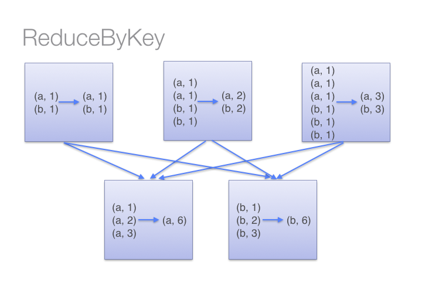
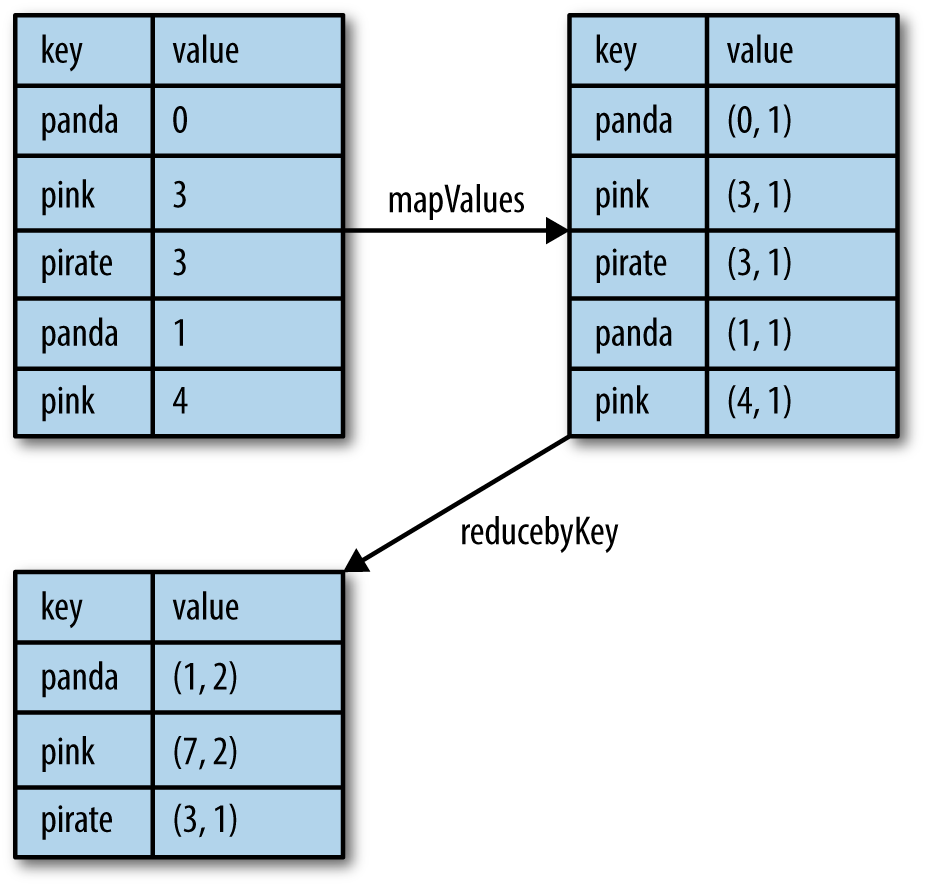
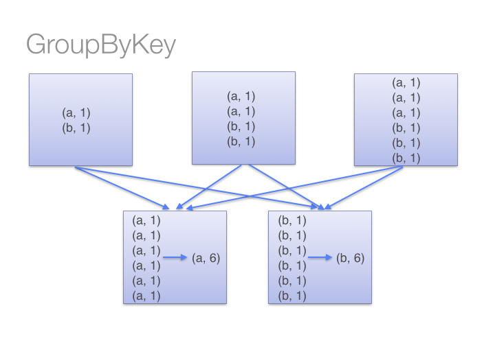

# 3.2 键值对RDD

&emsp;&emsp;到目前为止，我们已经使用了RDD，其中每行代表一个值，例如整数或字符串。在许多用例中，需要按某个键进行分组或聚合、联结两个RDD。现在来看一下另一个RDD类型：键值对RDD。键值对的数据格式可以在多种编程语言中找到。它是一组数据类型，由一组带有一组关联值的键标识符组成。使用分布式数据时，将数据组织成键值对是有用的，因为它允许在网络上聚合数据或重新组合数据。与MapReduce类似，Spark以RDD的形式支持键值对数据格式。

&emsp;&emsp;在Scala语言中，Spark键值对RDD的表示是二维元组。键值对RDD在许多Spark程序中使用。当想要在分布式系统中进行值聚合或重新组合时，需要通过其中的键进行索引，例如有一个包含城市级别人口的数据集，并且想要在州级别汇总，那么需要按州对这些行进行分组，并对每个州所有城市的人口求和；另一个例子是提取客户标识作为键，以查看所有客户的订单。要想满足键值对RDD的要求，每一行必须包含一个元组，其中第一个元素代表键，第二个元素代表值。键和值的类型可以是简单的类型，例如整数或字符串，也可以是复杂的类型，例如对象或值的集合或另一个元组。键值对RDD带有一组API，可以围绕键执行常规操作，例如分组、聚合和联接。

```scala
scala> val rdd = sc.parallelize(List("Spark","is","an", "amazing",
"piece", "of","technology"))
rdd: org.apache.spark.rdd.RDD[String] = ParallelCollectionRDD[0] at
parallelize at <console>:24
scala> val pairRDD = rdd.map(w => (w.length,w))
pairRDD: org.apache.spark.rdd.RDD[(Int, String)] =
MapPartitionsRDD[1] at map at <console>:25
scala> pairRDD.collect().foreach(println)
(5,Spark)
(2,is)
(2,an)
(7,amazing)
(5,piece)
(2,of)
(10,technology)
```

&emsp;&emsp;上面的代码创建了键值对RDD，每一行为一个元组，其中键是长度，值是单词。它们被包裹在一对括号内。一旦以这种方式排列了每一行，我们就可以通过按键分组轻松发现长度相同的单词。以下各节将介绍如何创建键值对RDD，以及如何使用关联的转换和操作。

### 3.2.1 创建

&emsp;&emsp;现在将看看怎样创建键值对。创建键值对最常的方法包括：使用已经存在的非键值对；或加载特定数据时也可以获得键值对，有很多数据格式将被创建为键值对；另一种方法是通过内存中的集合创建键值对。

&emsp;&emsp;虽然大多数Spark操作适用于包含任何类型对象的RDD，但是几个特殊操作只能在键值对的RDD上使用，例如按键分组或聚合元素，这些操作都需要进行分布式洗牌。在Scala语言中，这些操作可以在包含Tuple2对象的RDD上自动可用。键值对操作在PairRDDFunctions类中，自动封装在元组RDD上。键值对RDD中的键和值可以是标量值或复杂值，可以是对象，对象集合或另一个元组。当使用自定义对象作为键值对RDD中的键时，该对象的类必须同时定义自定义的equals()和hashCode()方法。

  - 语法解释

&emsp;&emsp;Scala元组结合件多个固定数量的项目在一起，使它们可以被作为一个整体传递。不像一个数组或列表，元组可以容纳不同类型的对象，但它们也是不可改变的。这里是一个元组持有整数、字符串和Console，如下的一个例子：
```text

val t = (1, "hello", Console)

```

&emsp;&emsp;这是语法方糖，是下面代码的简写方式：
```text

val t = new Tuple3(1, "hello", Console)

```

&emsp;&emsp;一个元组的实际类型取决于它包含的元素和这些元素的类型和数目。因此该类型 (99, "Luftballons") 是 Tuple2\[Int,
&emsp;&emsp;String\]；而('u', 'r', "the", 1, 4, "me") 的类型是 Tuple6\[Char, Char, String,
&emsp;&emsp;Int, Int,
&emsp;&emsp;String\]。元组类型包括Tuple1、Tuple2、Tuple3等等，至少目前的上限为22，如果需要更多，那么可以使用一个集合，而不是一个元组。对于每个TupleN类型，其中1\<=
&emsp;&emsp;N \<= 22，Scala定义了许多元素的访问方法。假定定义一个元组t为：
```text

val t = (4,3,2,1)

```

&emsp;&emsp;要访问的元组t的元素，可以使用的方法t.\_1访问的第一个元素，t.\_2进入第二个，依此类推。例如，下面的表达式计算t的所有元素的总和：
```text

val sum = t.\_1 + t.\_2 + t.\_3 + t.\_4

```

&emsp;&emsp;存在许多格式的数据可以直接加载为键值对，例如sequenceFile文件是Hadoop用来存储二进制形式的键值对\[Key,Value\]对而设计的一种平面文件。在此示例中，SequenceFile由键值对(Category,1)组成，当加载到Spark中时会产生键值对RDD，代码如下：

```scala
scala> val data = sc.parallelize(List(("key1", 1), ("Key2", 2),
("Key3", 2)))
data: org.apache.spark.rdd.RDD[(String, Int)] =
ParallelCollectionRDD[16] at parallelize at <console>:24
scala> data.saveAsSequenceFile("/data/seq-output")
```

&emsp;&emsp;SequenceFile可以用于解决大量小文件问题，SequenceFile是Hadoop
&emsp;&emsp;API提供的一种二进制文件支持，直接将键值对序列化到文件中，一般对小文件可以使用这种文件合并，即将文件名作为键，文件内容作为值序列化到大文件中，如下的代码是怎样读取SequenceFile：

```scala
scala> import org.apache.hadoop.io.{Text, IntWritable}
import org.apache.hadoop.io.{Text, IntWritable}
scala> val result = sc.sequenceFile("/data/seq-output",
classOf[Text], classOf[IntWritable]).map{case (x, y) =>
(x.toString, y.get())}
result: org.apache.spark.rdd.RDD[(String, Int)] =
MapPartitionsRDD[19] at map at <console>:26
scala> result.collect
res11: Array[(String, Int)] = Array((key1,1), (Kay2,2), (Key3,2))
```

  - def sequenceFile\[K, V\](path: String, keyClass: Class\[K\],
&emsp;&emsp;    valueClass: Class\[V\]): RDD\[(K, V)\]

&emsp;&emsp;使用给定的键和值类型获取Hadoop SequenceFile的RDD。

  - > path为输入数据文件的目录，可以是逗号分隔的路径作为输入列表

  - > keyClass为与SequenceFileInputFormat关联的键类

  - > valueClass为与SequenceFileInputFormat关联的值类

&emsp;&emsp;键值对 RDD 是 Spark 中非常重要的一类数据组织方式。只要你的任务需要“按某个键分组、聚合、关联或重分布数据”，通常就会落到 `(key, value)` 这种结构上。比如把客户 ID、事件时间窗口、商品编号或省份代码抽出来作为键，就可以继续使用 `reduceByKey()` 做聚合，或者使用 `join()` 把多份数据按同一键连接起来。本章讨论的很多性能特征，也都和“键如何分布、数据如何围绕键移动”直接相关。

  - Scala模式匹配

&emsp;&emsp;Scala 提供了强大的模式匹配机制，应用也非常广泛。一个模式匹配包含了一系列备选项，每个都开始于关键字
&emsp;&emsp;case。每个备选项都包含了一个模式及一到多个表达式。箭头符号 =\>
&emsp;&emsp;隔开了模式和表达式。上面的代码中使用了元组匹配模式，使用下面的例子来学习其语法：
```scala
val langs = Seq(
  ("Scala", "Martin", "Odersky"),
  ("Clojure", "Rich", "Hickey"),
  ("Lisp", "John", "McCarthy")
)
```

&emsp;&emsp;定义langs序列（Seq）变量，其中包含三个三维元组。
```scala
for (tuple <- langs) {
  tuple match {
    case ("Scala", _, _) =>
      println("Found Scala")
    case (lang, first, last) =>
      println(s"Found other language: $lang ($first, $last)")
  }
}
```

&emsp;&emsp;在for循环中，定义了case模式匹配。第一个case匹配一个三元素元组，其中第一个元素是字符串“Scala”，忽略第二个和第三个参数；第二个case匹配任何三元素元组，元素可以是任何类型，但是由于输入langs，它们被推断为字符串。将元素提取为变量lang、first和last，输出结果为：
```text
Found Scala
Found other language: Clojure (Rich, Hickey)
Found other language: Lisp (John, McCarthy)
```

&emsp;&emsp;在上面的代码中，一个元组可以分解成其组成元素。可以匹配元组中的字面值，在任何想要的位置，可以忽略不关心的元素。

&emsp;&emsp;使用Scala和Python语言，可以使用SparkContext.parallelize方法从的内存集合创建一键值对，代码如下：

```scala
scala> val dist1 = Array(("INGLESIDE",1), ("SOUTHERN",1), ("PARK",1),
("NORTHERN",1))
dist1: Array[(String, Int)] = Array((INGLESIDE,1), (SOUTHERN,1),
(PARK,1), (NORTHERN,1))
scala> val dist1RDD = sc.parallelize(dist1)
dist1RDD: org.apache.spark.rdd.RDD[(String, Int)] =
ParallelCollectionRDD[44] at parallelize at <console>:30
scala> dist1RDD.collect
res29: Array[(String, Int)] = Array((INGLESIDE,1), (SOUTHERN,1),
(PARK,1), (NORTHERN,1))
```

&emsp;&emsp;在这个例子中，首先这是在内存中创建键值对集合dist1，然后通过SparkContext.parallelize方法应用于dist1来创建键值对dist1RDD。另外，在一组小文本文件上运行sc.wholetextFiles将创建键值对，其中键是文件的名称，而值为文件中的内容。

### 3.2.2 转换

&emsp;&emsp;键值对RDD允许使用标准RDD可用的所有转换，由于键值对包含元组，需要在转换方法中传递可以在元组上操作的函数。下面的部分总结了键值对常用转换，然后分别详细介绍几个转换。

  - 基于一个键值对RDD的转换

&emsp;&emsp;创建一个键值对RDD：

```scala
scala> val rdd = sc.parallelize(List((1, 2), (3, 4), (3, 6)))
rdd: org.apache.spark.rdd.RDD[(Int, Int)] =
ParallelCollectionRDD[15] at parallelize at <console>:24
```

  - reduceByKey(func: (V, V) ⇒ V, numPartitions: Int): RDD\[(K, V)\]

&emsp;&emsp;调用包含(K, V)的数据集，返回的结果也为(K, V)。数据集中的每个键对应的所有值被聚集，使用给定的汇总功能func，其类型必须为(V,
&emsp;&emsp;V) =\> V。像groupByKey，汇总任务的数量是通过第二个可选的参数numPartitions配置，这个参数设置RDD的分区数。

```scala
scala> rdd.reduceByKey((x, y) => x + y).collect
res5: Array[(Int, Int)] = Array((1,2), (3,10))
```

  - groupByKey(numPartitions: Int): RDD\[(K, Iterable\[V\])\]

&emsp;&emsp;调用包含(K, V)的数据集，返回(K,
&emsp;&emsp;Iterable\<V\>)。如果分组的目的是为了对每个键执行聚集，如总和或平均值，使用reduceByKey或aggregateByKey将产生更好的性能。默认情况下，输出的并行任务数取决于RDD谱系中父RDD的分区数，可以通过一个可选的参数numPartitions来设置不同数量的任务。

```scala
scala> rdd.groupByKey().collect
res6: Array[(Int, Iterable[Int])] = Array((1,CompactBuffer(2)),
(3,CompactBuffer(4, 6)))
```

  - combineByKey\[C\](createCombiner: (V) ⇒ C, mergeValue: (C, V) ⇒ C,
&emsp;&emsp;    mergeCombiners: (C, C) ⇒ C): RDD\[(K, C)\]

&emsp;&emsp;使用相同的键组合值，产生与输入不同的结果类型。例子和详细的说明见后面的部分4.1.1.1.2。

  - mapValues\[U\](f: (V) ⇒ U): RDD\[(K, U)\]

&emsp;&emsp;对键值对RDD的每个值应用一个方法，而不用改变键。

```scala
scala> rdd.mapValues(x => x+1).collect
res11: Array[(Int, Int)] = Array((1,3), (3,5), (3,7))
```

  - flatMapValues\[U\](f: (V) ⇒ TraversableOnce\[U\]): RDD\[(K, U)\]

&emsp;&emsp;与mapValues相似，将键值对中每个值传递给函数f而不改变键，不同的是将数据的内在结构扁平化。

```scala
scala> rdd.flatMapValues(x => (x to 5)).collect
res13: Array[(Int, Int)] = Array((1,2), (1,3), (1,4), (1,5), (3,4),
(3,5))
```

  - keys: RDD\[K\]

&emsp;&emsp;将键值对RDD中每个元组的键返回，产生一个RDD。

```scala
scala> rdd.keys.collect
res15: Array[Int] = Array(1, 3, 3)
```

  - values: RDD\[V\]

&emsp;&emsp;将键值对RDD中每个元组的值返回，产生一个RDD。

```scala
scala> rdd.values.collect
res20: Array[Int] = Array(2, 4, 6)
```

  - sortByKey(ascending: Boolean = true, numPartitions: Int =
&emsp;&emsp;    self.partitions.length): RDD\[(K, V)\]

&emsp;&emsp;当在数据集(K, V)上被调用时，K实现了有序化，返回按照以键的顺序排列的数据集(K,V)，布尔参数ascending中指定地升序或降序。

```scala
scala> rdd.sortByKey().collect
res25: Array[(Int, Int)] = Array((1,2), (3,4), (3,6))
```

  - aggregateByKey\[U\](zeroValue: U)(seqOp: (U, V) ⇒ U, combOp: (U, U)
&emsp;&emsp;    ⇒ U)(implicit arg0: ClassTag\[U\]): RDD\[(K, U)\]

&emsp;&emsp;使用给定的组合函数和中性zeroValue来聚合每个键的值。该函数可以返回与输入键值对RDD中的V值类型不同的结果类型U。因此，需要一个用于将V合并到U中的操作和一个用于合并两个U的操作，如在scala.TraversableOnce中。前一个函数seqOp用于合并分区中的值，后者combOp用于在分区之间合并值。为了避免内存分配，这两个函数都允许修改并返回其第一个参数，而不是创建一个新的U。

```scala
scala> val pairRDD = sc.parallelize(List( ("cat",2), ("cat", 5),
("mouse", 4),("cat", 12), ("dog", 12), ("mouse", 2)), 2)
pairRDD: org.apache.spark.rdd.RDD[(String, Int)] =
ParallelCollectionRDD[1] at parallelize at <console>:24
scala> def myfunc(index: Int, iter: Iterator[(String, Int)]) :
Iterator[String] = {
| iter.map(x => "[partID:" + index + ", val: " + x + "]")
| }
myfunc: (index: Int, iter: Iterator[(String, Int)])Iterator[String]
scala> pairRDD.mapPartitionsWithIndex(myfunc).collect
res0: Array[String] = Array([partID:0, val: (cat,2)], [partID:0,
val: (cat,5)], [partID:0, val: (mouse,4)], [partID:1, val:
(cat,12)], [partID:1, val: (dog,12)], [partID:1, val: (mouse,2)])
scala> pairRDD.aggregateByKey(0)(math.max(_, _), _ + _).collect
res1: Array[(String, Int)] = Array((dog,12), (cat,17), (mouse,6))
scala> pairRDD.aggregateByKey(100)(math.max(_, _), _ + _).collect
res2: Array[(String, Int)] = Array((dog,100), (cat,200), (mouse,200))
```

&emsp;&emsp;上面的代码中，通过定义myfunc函数，分别打印出RDD分区中内容。

  - 基于两个键值对RDD的转换

&emsp;&emsp;创建两个键值对RDD，分别为：

```scala
scala> val rdd = sc.parallelize(List((1, 2), (3, 4), (3, 6)))
rdd: org.apache.spark.rdd.RDD[(Int, Int)] =
ParallelCollectionRDD[42] at parallelize at <console>:24
scala> val other = sc.parallelize(List((3,9)))
other: org.apache.spark.rdd.RDD[(Int, Int)] =
ParallelCollectionRDD[43] at parallelize at <console>:24
```

  - subtractByKey

&emsp;&emsp;从rdd中删除other中存在的键元素。

```scala
scala> rdd.subtractByKey(other).collect
res27: Array[(Int, Int)] = Array((1,2))
```

  - join(otherDataset, \[numTasks\])

&emsp;&emsp;在两个RDD之间执行内部连接。

```scala
scala> rdd.join(other).collect
res28: Array[(Int, (Int, Int))] = Array((3,(4,9)), (3,(6,9)))
```

  - rightOuterJoin

&emsp;&emsp;在两个RDD之间执行连接，其中键必须存在于第一个RDD中。

```scala
scala> rdd.rightOuterJoin(other).collect
res30: Array[(Int, (Option[Int], Int))] = Array((3,(Some(4),9)),
(3,(Some(6),9)))
```

  - leftOuterJoin

&emsp;&emsp;在两个RDD之间执行连接，其中键必须存在于另一个RDD中。

```scala
scala> rdd.leftOuterJoin(other).collect
res31: Array[(Int, (Int, Option[Int]))] = Array((1,(2,None)),
(3,(4,Some(9))), (3,(6,Some(9))))
```

  - cogroup(otherDataset, \[numTasks\])

&emsp;&emsp;将两个RDD具有相同键的值组合在一起。

```scala
scala> rdd.cogroup(other).collect
res32: Array[(Int, (Iterable[Int], Iterable[Int]))] =
Array((1,(CompactBuffer(2),CompactBuffer())), (3,(CompactBuffer(4,
6),CompactBuffer(9))))
```

#### 3.2.2.1 聚合

&emsp;&emsp;当使用键值对来描述数据集时，通常需要在具有相同键的所有元素上统计数据。对于基本的RDD的fold、combine和reduce操作，在键值对RDD上也有基于键的类似操作，这些操作基于相同的键进行汇集。 这些操作是转换而不是动作。

##### 3.2.2.1.1 reduceByKey

&emsp;&emsp;基本上，reduceByKey函数仅适用于包含键值对元素类型的RDD，即具有Tuple或Map作为数据元素。这是一个转型操作，这意味着被懒惰地评估。我们需要传递一个关联函数作为参数，该函数将应用于键值对RDD，创建带有结果值的RDD，即新的键值对。由于分区间可能发生数据Shuffle，此操作是一项涉及全数据集的广泛操作。

&emsp;&emsp;在数学中，关联属性是一些二元运算的属性。在命题逻辑中，关联性是在逻辑证明中替换表达式的有效规则。在包含同一个关联运算符的一行中出现两次或更多次的表达式中，只要操作数序列未更改，操作的执行次序就无关紧要。也就是说，重新排列这种表达式中的括号不会改变其值。考虑下面的等式：

&emsp;&emsp;$$ (2 + 3) + 4 = 2 + (3 + 4) = 9 $$

&emsp;&emsp;$$ 2 \times \left( 3 \times 4 \right) = \left( 2 \times 3 \right) \times 4 = 24 $$

&emsp;&emsp;关联性让我们可以按顺序并行使用相同的函数。reduceByKey使用该属性计算RDD的结果，RDD是由分区组成的分布式集合。直观地说，这个函数在重复应用于具有多个分区的同一组RDD数据时会产生相同的结果，而不管元素的顺序如何。此外，它首先使用Reduce函数在本地执行合并，然后在分区之间发送记录以准备最终结果，通过下面的代码看一看reduceByKey的执行过程：

```scala
scala> val x = sc.parallelize(Array(("a", 1), ("b", 1), ("a", 1),("a",
1), ("b", 1), ("a", 1),("b", 1), ("b", 1), ("a", 1), ("b", 1), ("a",
1),("b", 1)), 3)
x: org.apache.spark.rdd.RDD[(String, Int)] =
ParallelCollectionRDD[5] at parallelize at <console>:24
scala> x.reduceByKey(_ + _).collect()
res3: Array[(String, Int)] = Array((a,6), (b,6))
```

<p align="center"></p>
<p align="center">图例 3‑1 ReduceByKey运行示意图</p>

&emsp;&emsp;在上图中，可以看到RDD具有多个键值对元素，如(a,1)和(b,1)，以及3个分区。在对整个分区之间的数据洗牌之前，先在每个本地分区中进行相同的聚合。可以使用reduceByKey与mapValues一起计算每个键的平均值，代码和图示如下：

```scala
scala> val rdd =
sc.parallelize(List(("panda",0),("pink",3),("pirate",3),("panda",1),("pink",4)))
rdd: org.apache.spark.rdd.RDD[(String, Int)] =
ParallelCollectionRDD[29] at parallelize at <console>:24
scala> rdd.mapValues(x => (x, 1)).reduceByKey((x, y) => (x._1 +
y._1, x._2 + y._2)).collect
res38: Array[(String, (Int, Int))] = Array((panda,(1,2)),
(pink,(7,2)), (pirate,(3,1)))
```

<p align="center"></p>
<p align="center">图例 3‑2 每键平均值计算的数据流</p>

&emsp;&emsp;实际上，reduceByKey是aggregateByKey的一个特列。aggregateByKey有两个函数参数：一个应用于每个分区的聚合，另一个应用于分区之间聚合。reduceByKey在上述两种情况下都使用相同的关联函数，在每个分区上执行一遍，然后在分区间执行一遍，将第一遍的结果合并为最终结果。

##### 3.2.2.1.2 combineByKey

&emsp;&emsp;combineByKey调用就是这样一种优化。使用combineByKey值时，每个分区合并为一个值，然后将每个分区值合并为一个值。值得注意的是，组合值的类型不必与原始值的类型相匹配，而且通常不会。combineByKey函数将3个函数作为参数，第一个创建组合器的函数，在aggregateByKey函数中，第一个参数只是zeroValue，在combineByKey中提供了一个函数，它将接受我们当前的值作为参数，并返回将与合成值合并的新值；第二个函数是一个合并函数，它接受一个值并将它合并或组合到先前收集的值中；第三个函数将合并的值组合在一起，基本上这个函数采用在分区级别上产生的新值，并将它们结合起来，直到得到一个最后的结果，下面是一个执行combineByKey的代码：

```scala
scala> val data = sc.parallelize(List(("A", 3), ("A", 9), ("A",
12),("B", 4), ("B", 10), ("B", 11)))
data: org.apache.spark.rdd.RDD[(String, Int)] =
ParallelCollectionRDD[0] at parallelize at <console>:24
scala> val sumCount=data.combineByKey((v)=>(v,1),(acc:(Int,Int),v)
=>(acc._1+v,acc._2+1),(acc1:(Int,Int),acc2:(Int,Int))=>(acc1._1+acc2._1,acc1._2+acc2._2))
sumCount: org.apache.spark.rdd.RDD[(String, (Int, Int))] =
ShuffledRDD[1] at combineByKey at <console>:26
scala> sumCount.foreach(println)
(B,(25,3))
(A,(24,3))
scala> val averageByKey = sumCount.map{case(key, value)=>(key,
value._1 / value._2.toFloat)}
averageByKey: org.apache.spark.rdd.RDD[(String, Float)] =
MapPartitionsRDD[2] at map at <console>:28
scala> averageByKey.foreach(println)
(A,8.0)
(B,8.333333)
```

&emsp;&emsp;参考上面的代码，combineByKey需要三个函数分别为：createCombiner、mergeValue和mergeCombiner：

  - createCombiner

&emsp;&emsp;(v)=\>(v,1)

&emsp;&emsp;combineByKey方法中的第一个函数是必选参数，用作每个键的第一个聚合步骤。当在每个分区中，如果找不到每个键的组合器，createCombiner会为分区上每个遇到的第一个键创建初始组合器。上面代码是用在分区中遇到的第一个值和为1的键计数器初始化一个tuple，其值为（v,
&emsp;&emsp;1），v代表第一个遇到的值，表示存储组合器的存储内容为（sum, count）。

  - mergeValue

&emsp;&emsp;(acc:(Int,Int),v) =\>(acc.\_1+v,acc.\_2+1)

&emsp;&emsp;这是下一个必需的函数，告诉combineByKey当组合器被赋予一个新值时该怎么做。该函数的参数是组合器acc和新值v。组合器的结构在上面被定义为(sum,
&emsp;&emsp;count)形式的元组，acc.\_1执行累加代表组合器的sum，acc.\_2执行计数代表组合器中的count。所以通过将新值v添加到组合器元组的第一个元素，同时将加1到组合器元组的第二个元素来合并新值。mergeValue只有在这个分区上已经创建了初始组合器（在我们的例子中为元组）时才被触发。

  - mergeCombiner

&emsp;&emsp;(acc1:(Int,Int),acc2:(Int,Int))=\>(acc1.\_1+acc2.\_1,acc1.\_2+acc2.\_2)

&emsp;&emsp;最终一个必需的函数告诉combineByKey如何合并分区之间的两个组合器。在这个例子中，每个分区组合器元组的形式为(sum,
&emsp;&emsp;count)，需要做的就是将第一个分区依次到最后一个分区中组合器加在一起。

&emsp;&emsp;最终目标是逐个计算平均值averageByKey()。combineByKey()的结果是RDD，其格式为(label, (sum,
&emsp;&emsp;count)) ，因此可以通过使用map方法，映射(sum, count)到sum /
&emsp;&emsp;count来轻松获取平均值。接下来将数据的子集分解到多个分区，并在实际中看数据的计算方式：
```text
分区一
A=3 --> createCombiner(3) ==> accum[A] = (3, 1)
A=9 --> mergeValue(accum[A], 9) ==> accum[A] = (3 + 9, 1 + 1)
B=11 --> createCombiner(11) ==> accum[B] = (11, 1)

分区二
A=12 --> createCombiner(12) ==> accum[A] = (12, 1)
B=4 --> createCombiner(4) ==> accum[B] = (4, 1)
B=10 --> mergeValue(accum[B], 10) ==> accum[B] = (4 + 10, 1 + 1)

合并分区
A ==> mergeCombiner((12, 2), (12, 1)) ==> (12 + 12, 2 + 1)
B ==> mergeCombiner((11, 1), (14, 2)) ==> (11 + 14, 1 + 2)

sumCount 输出为：
Array((A, (24, 3)), (B, (25, 3)))
```

#### 3.2.2.2 分组

&emsp;&emsp;使用键键值对数据，一个常见的用例是按键分组的数据，例如一起查看客户的所有订单。如果数据已经按照想要的方式组成键值对元组，groupByKey将使用的RDD中的键对数据进行分组。在由K型键和V型值构成的RDD上，分组后得到\[K,
&emsp;&emsp;Iterable\[V\]\]类型的RDD。现在使用groupByKey实现上面reduceByKey代码的功能：

```scala
scala> val x = sc.parallelize(Array(("a", 1), ("b", 1), ("a", 1),("a",
1), ("b", 1), ("a", 1),("b", 1), ("b", 1), ("a", 1), ("b", 1), ("a",
1),("b", 1)), 3)
x: org.apache.spark.rdd.RDD[(String, Int)] =
ParallelCollectionRDD[4] at parallelize at <console>:24
scala> x.groupByKey().map(t => (t._1, t._2.sum)).collect
res4: Array[(String, Int)] = Array((a,6), (b,6))
```

&emsp;&emsp;得到的结果与上面的代码一致，但是数据的计算过程不一样。另一方面，当调用groupByKey时所有的键值对都在Shuffle，在网络中传输的大量不必要的数据。当在一个执行器上有更多的数据在内存中进行Shuffle时，Spark将内存数据溢出到磁盘中。但是，一次只会将一个键数据刷新到磁盘上，因此如果单个键的值超过了内存容量，则会发生内存不足异常。这种情况在Spark的后续版本中可以更加优雅地处理，因此作业仍然可以继续，但仍然应该避免。当Spark需要溢出到磁盘时，性能会受到严重影响。

<p align="center"></p>
<p align="center">图例 3‑3 GroupByKey运行示意图</p>

&emsp;&emsp;可以尝试的一种优化方法是合并或组合值，因此最终只发送较少的键值对。另外，较少的键值对意味着Reduce不会有太多的工作要做，从而带来额外的性能提升。groupByKey()调用不会尝试进行合并或组合值，因此这是一项昂贵的操作。对于一个更大的数据集，洗牌数据量的差异在reduceByKey()和groupByKey()之间会变得更加夸张和不同。以下是比groupByKey更优化的方法：

  - combineByKey可用于组合元素，但返回类型与输入值类型不同。

  - foldByKey使用关联函数和中性“zeroValue”合并每个键的值。

#### 3.2.2.3 连接

&emsp;&emsp;一些最有用的操作来自于将键值对RDD与其他键值对RDD进行连接，将数据连接在一起可能是键值对中最常见的操作之一。并且有一系列选项，包括左右外连接、交叉连接和内连接。由于数据框功能的增强，这部分功能也可能通过数据框的JOIN操作实现。

&emsp;&emsp;简单的join运算符是内连接，只输出两键值对RDD中共同拥有的键。当在其中一个输入RDD中具有相同键和多个值的键值对时，结果键值对RDD将具有来自两个输入键值对RDD的该键的每个可能的值对，下面的代码帮助理解这种操作结果：

```scala
scala> val employees = sc.parallelize(List((31,"Rafferty"),
(33,"Jones"), (33,"Heisenberg"),(34,"Robinson"), (34,"Smith"),
(30,"Williams")))
employees: org.apache.spark.rdd.RDD[(Int, String)] =
ParallelCollectionRDD[60] at parallelize at <console>:24
scala> val departments = sc.parallelize(Array((31, "Sales"), (33,
"Engineering"), (34, "Clerical"),(35, "Marketing")))
departments: org.apache.spark.rdd.RDD[(Int, String)] =
ParallelCollectionRDD[61] at parallelize at <console>:24
scala> departments.join(employees).collect
res66: Array[(Int, (String, String))] =
Array((34,(Clerical,Robinson)), (34,(Clerical,Smith)),
(33,(Engineering,Jones)), (33,(Engineering,Heisenberg)),
(31,(Sales,Rafferty)))
```

&emsp;&emsp;有些场景下，我们并不要求结果中的键同时出现在两个输入RDD中。例如，把“客户信息”和“推荐结果”做关联时，即使某个客户暂时没有推荐结果，通常也不希望把客户记录直接丢掉。leftOuterJoin(other)和rightOuterJoin(other)就是为这类场景准备的：它们都会按键连接两个键值对RDD，但会保留其中一侧RDD中的全部键。

&emsp;&emsp;对于leftOuterJoin，结果RDD会保留左侧RDD中的所有键。结果中每个键对应的值是一个元组：第一部分来自左侧RDD，第二部分来自右侧RDD，并用Option包裹以表示“可能有值，也可能没有值”。与普通join一样，如果某个键在一侧或两侧都出现了多个值，结果仍然会形成对应值集合之间的笛卡尔组合。rightOuterJoin的规则与之对称，只是它保留的是右侧RDD中的所有键。下面继续使用中的departments和employees演示这两个操作：

```scala
scala> departments.leftOuterJoin(employees).collect
res67: Array[(Int, (String, Option[String]))] =
Array((34,(Clerical,Some(Robinson))), (34,(Clerical,Some(Smith))),
(35,(Marketing,None)), (33,(Engineering,Some(Jones))),
(33,(Engineering,Some(Heisenberg))), (31,(Sales,Some(Rafferty))))
scala> departments.rightOuterJoin(employees).collect
res68: Array[(Int, (Option[String], String))] =
Array((34,(Some(Clerical),Robinson)), (34,(Some(Clerical),Smith)),
(30,(None,Williams)), (33,(Some(Engineering),Jones)),
(33,(Some(Engineering),Heisenberg)), (31,(Some(Sales),Rafferty)))
```

  - Option、Some和None

&emsp;&emsp;在Scala里，Option常用来表达“这个结果可能存在，也可能不存在”。如果一个函数在成功时返回对象、失败时原本会返回null，那么更推荐把返回类型定义为Option。这样一来，调用者在函数签名层面就能明确知道：这里需要处理“有值”和“无值”两种情况。Option最常见的两个子类型是Some和None。下面是一个简单示例：
```scala
def toInt(in: String): Option[Int] = {
  try {
    Some(Integer.parseInt(in.trim))
  } catch {
    case e: NumberFormatException => None
  }
}
```

&emsp;&emsp;以下是这个toInt函数的工作原理：它需要一个String作为参数。如果它可以将String转换为Int，那么它返回为Some（Int）；如果String不能转换为Int，则返回None。如果是调用此函数的代码将如下所示：
```scala
toInt(someString) match {
  case Some(i) => println(i)
  case None    => println("That didn't work.")
}
```

#### 3.2.2.4 排序

&emsp;&emsp;对数据进行排序在很多情况下非常有用，特别是在产生后续的输出时。可以使用键值对RDD进行排序，前提是在键上定义了一个排序。一旦对数据进行了排序，对排序后的数据进行后续调用collect()或save()操作，将导致有序的数据。

&emsp;&emsp;sortByKey函数作用于键值对形式的RDD上，并对键进行排序。它是在org.apache.spark.rdd.OrderedRDDFunctions中实现的，实现如下：

  - sortByKey(ascending: Boolean = true, numPartitions: Int =
&emsp;&emsp;    self.partitions.length): RDD\[(K, V)\]

&emsp;&emsp;从函数的实现可以看出，它主要接受两个函数，其含义和sortBy一样，这里就不进行解释了。该函数返回的RDD一定是ShuffledRDD类型的，因为对源RDD进行排序，必须进行洗牌操作，而洗牌操作的结果RDD就是ShuffledRDD。其实这个函数的实现很优雅，里面用到了RangePartitioner，它可以使得相应的范围键数据分到同一个分区中，然后内部用到了mapPartitions对每个分区中的数据进行排序，而每个分区中数据的排序用到了标准的排序机制，避免了大量数据的shuffle。下面对sortByKey的使用进行说明：

```scala
scala> val a = sc.parallelize(List("wyp", "iteblog", "com",
"397090770", "test"), 2)
a: org.apache.spark.rdd.RDD[String] =
ParallelCollectionRDD[30] at parallelize at <console>:12
scala> val b = sc. parallelize (1 to a.count.toInt , 2)
b: org.apache.spark.rdd.RDD[Int] = ParallelCollectionRDD[31] at
parallelize at <console>:14
scala> val c = a.zip(b)
c: org.apache.spark.rdd.RDD[(String, Int)] =
ZippedPartitionsRDD2[32] at zip at <console>:16
scala> c.sortByKey().collect
res11: Array[(String, Int)] = Array((397090770,4), (com,3),
(iteblog,2), (test,5), (wyp,1))
```

&emsp;&emsp;上面对键进行了排序，sortBy()函数中可以对排序方式进行重写，sortByKey()也有这样的功能，通过在OrderedRDDFunctions类中有个变量ordering，它是隐式的：

&emsp;&emsp;private val ordering = implicitly\[Ordering\[K\]\]

&emsp;&emsp;这就是默认的排序规则，可以对它进行重写，如下：

```scala
scala> val b = sc.parallelize(List(3,1,9,12,4))
b: org.apache.spark.rdd.RDD[Int] = ParallelCollectionRDD[38] at
parallelize at <console>:12
scala> val c = b.zip(a)
c: org.apache.spark.rdd.RDD[(Int, String)] =
ZippedPartitionsRDD2[39] at zip at <console>:16
scala> c.sortByKey().collect
res15: Array[(Int, String)] = Array((1,iteblog), (3,wyp), (4,test),
(9,com), (12,397090770))
scala> implicit val sortIntegersByString = new Ordering[Int]{
| override def compare(a: Int, b: Int) =
| a.toString.compare(b.toString)}
sortIntegersByString: Ordering[Int] =
$iwC$$iwC$$iwC$$iwC$$iwC$$anon$1@5d533f7a
scala> c.sortByKey().collect
res17: Array[(Int, String)] = Array((1,iteblog), (12,397090770),
(3,wyp), (4,test), (9,com))
```

&emsp;&emsp;例子中的sortIntegersByString就是修改了默认的排序规则。这样将默认按照Int大小排序改成了对字符串的排序，所以12会排序在3之前。

### 3.2.3 动作

&emsp;&emsp;与转换一样，所有在基础RDD上提供的传统转换操作也可用在键值对RDD上，当然键值对RDD可以使用一些额外的操作，首先创建一个RDD：

```scala
scala> val rdd = sc.parallelize(List((1, 2), (3, 4), (3, 6)))
rdd: org.apache.spark.rdd.RDD[(Int, Int)] =
ParallelCollectionRDD[15] at parallelize at <console>:24
```

  - countByKey(): Map\[K, Long\]

&emsp;&emsp;对每个键进行计数，只有当返回的结果Map预计很小时，才应该使用此方法，因为整个内容都会加载到驱动程序的内存中。要处理非常大的结果，可以考虑使用：
```text

rdd.mapValues（\_ =\> 1L）.reduceByKey（\_ + \_）

```

&emsp;&emsp;其将返回RDD \[T，Long\]而不是Map。

```scala
scala> rdd.countByKey()
res74: scala.collection.Map[Int,Long] = Map(1 -> 1, 3 -> 2)
```

  - collectAsMap(): Map\[K, V\]

&emsp;&emsp;与collect()类似，但对关键值RDD起作用并将其转换为Scala
&emsp;&emsp;Map以保留其键值结构，如果键值对RDD中同一个键有多个值，则每个键中只有一个值会保留在返回的Map中。因为所有的数据都加载到驱动程序的内存中，所以只有在结果数据很小时才应使用此方法。

```scala
scala> rdd.collectAsMap()
res80: scala.collection.Map[Int,Int] = Map(1 -> 2, 3 -> 6)
```

  - lookup(key: K): Seq\[V\]

&emsp;&emsp;返回与提供键相关联的所有值。如果RDD具有已知的分区程序，则只需搜索该键映射到的分区即可高效地执行此操作。

```scala
scala> rdd.lookup(3)
res91: Seq[Int] = WrappedArray(4, 6)
```
