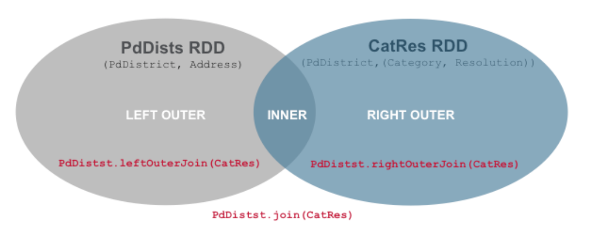

# 3.6 案例分析

表格 3‑1 显示/data/sfpd.csv文件中的字段和说明，并且示范了保存在字段中的数据。该数据集是从2013年1月至2015年7月期间某市警察局的报案记录信息。本节将探讨分析这些数据回答诸如哪个区域的报案记录最多，以及哪个报案类别数量最多。

| 列名          | 描述      | 值例                             |
| ----------- | ------- | ------------------------------ |
| IncidentNum | 事件编号    | 150561637                      |
| Category    | 事件类别    | NON-CRIMINAL                   |
| Descript    | 事件描述    | FOUND\_PROPERTY                |
| DayOfWeek   | 事件发生的星期 | Sunday                         |
| Date        | 事件发生的日期 | 6/28/15                        |
| Time        | 事件发生的时间 | 23:50                          |
| PdDistrict  | 警察局     | TARAVAL                        |
| Resolution  | 解决方式    | NONE                           |
| Address     | 地址      | 1300\_Block\_of\_LA\_PLAYA\_ST |
| X           | 位置X坐标   | \-122.5091348                  |
| Y           | 位置Y坐标   | 37.76119777                    |
| PdID        | 部门ID    | 15056163704013                 |

表格 3‑1 案例数据项说明

通过案例分析，熟悉怎样使用Spark键值对RDD的操作，Spark为键值对的RDD提供特殊操作。键值对RDD在许多程序中是一个有用的构建块，因为它们允许并行地对每个键执行操作，或者通过网络重新组合数据。例如，键值对RDD具有reduceByKey()方法，可以分别为每个键聚合汇总数据，以及用一个join()方法可以通过使用相同的键对元素进行分组来将两个RDD合并在一起。我们可以从原始数据中提取，例如事件时间，客户ID或其他标识符，作为键值对RDD中的键。

### 3.6.1 检查事件数据

下面先快速回顾上一章用过的基本流程：在Spark交互环境中加载数据、创建RDD，并在其上执行转换和动作。首先定义几个变量，用来映射输入数据中的字段位置：
```text

val IncidntNum = 0

val Category = 1

val Descript = 2

val DayOfWeek = 3

val Date = 4

val Time = 5

val PdDistrict = 6

val Resolution = 7

val Address = 8

val X = 9

val Y = 10

val PdId = 11

```

使用SparkContext的textFile()方法加载CSV文件，应用map()进行转换，同时使用split()分割每行数据中的字段。

```scala
scala> val sfpd =
sc.textFile("/data/sfpd.csv").map(line=>line.split(","))
sfpd: org.apache.spark.rdd.RDD[Array[String]] =
MapPartitionsRDD[5] at map at <console>:24
```


使用上一章学到的方法，检查一下sfpd中的数据：

  - sfpd的数据是什么样子的？

```scala
scala> sfpd.first
res2: Array[String] = Array(150599321, OTHER_OFFENSES,
POSSESSION_OF_BURGLARY_TOOLS, Thursday, 7/9/15, 23:45, CENTRAL,
ARREST/BOOKED, JACKSON_ST/POWELL_ST, -122.4099006, 37.79561712,
15059900000000)
```


  - 报案记录总数是多少？

```scala
scala> sfpd.count
res3: Long = 383775
```


  - 报案记录的类别是什么？

```scala
scala> val cat = sfpd.map(inc=>inc(Category)).distinct.collect
cat: Array[String] = Array(PROSTITUTION, DRUG/NARCOTIC, EMBEZZLEMENT,
FRAUD, WEAPON_LAWS, BURGLARY, EXTORTION, WARRANTS,
DRIVING_UNDER_THE_INFLUENCE, TREA, LARCENY/THEFT, BAD CHECKS,
RECOVERED_VEHICLE, LIQUOR_LAWS, SUICIDE, OTHER_OFFENSES,
VEHICLE_THEFT, DRUNKENNESS, MISSING_PERSON, DISORDERLY_CONDUCT,
FAMILY_OFFENSES, ARSON, ROBBERY, SUSPICIOUS_OCC, GAMBLING, KIDNAPPING,
RUNAWAY, VANDALISM, BRIBERY, NON-CRIMINAL, SECONDARY_CODES,
SEX_OFFENSES/NON_FORCIBLE, PORNOGRAPHY/OBSCENE MAT,
SEX_OFFENSES/FORCIBLE, FORGERY/COUNTERFEITING, TRESPASS, ASSAULT,
LOITERING, STOLEN_PROPERTY)
```


在下面的操作中，定义代码来创建bayviewRDD，直到添加一个动作才会计算出来。filter转换用于过滤sfpd中包含“BAYVIEW”字符的所有元素。转换的其他示例包括map()、filter()和distinct()。

```scala
scala> val bayviewRDD =
sfpd.filter(incident=>incident.contains("BAYVIEW"))
bayviewRDD: org.apache.spark.rdd.RDD[Array[String]] =
MapPartitionsRDD[22] at filter at <console>:26
```


  - 语法说明

contains()方法返回true或false，判断集合中是否包含输入参数

```scala
scala> val animals = Set("bird", "fish")
animals: scala.collection.immutable.Set[String] = Set(bird, fish)
scala> println(animals.contains("apple"))
false
scala> println(animals.contains("fish"))
true
```


当运行一个动作命令时，Spark将加载数据创建输入RDD，然后计算任何其他定义RDD的转换和动作。在这个例子中，调用count()动作将导致数据被加载到sfpd中，应用filter()转换，然后计数。

```scala
scala> val numTenderloin =
sfpd.filter(incident=>incident.contains("TENDERLOIN")).count
numTenderloin: Long = 30174
```


### 3.6.2 reduceByKey和groupByKey

从现有常规RDD创建键值对RDD有许多方法，最常见的方法是使用map()转换。创建键值对RDD的方式在不同的语言中是不同的。在Python和Scala中，需要返回一个包含元组的RDD。

```scala
scala> val incByCat = sfpd.map(indicent=>(indicent(Category),1))
incByCat: org.apache.spark.rdd.RDD[(String, Int)] =
MapPartitionsRDD[15] at map at <console>:28
scala> incByCat.first
res9: (String, Int) = (OTHER_OFFENSES,1)
```


在这个例子中，通过应用map()操作将sfpd转变一个名为incByCat的键值对RDD，得到的RDD包含如上面代码所示的元组。现在，可以使用sfpd数据集得到一些问题的答案。

  - 哪三个地区（或类别或地址）的报案记录数量最多？

数据集sfpd中的每一行记录一个事件相关信息，想计算每个区域的报案记录数量，即数据集中这个地区出现多少次，第一步是从sfpd上创建一个键值对RDD。

```scala
scala> val top3Dists = sfpd.map(inc =>(inc(PdDistrict),1))
top3Dists: org.apache.spark.rdd.RDD[(String, Int)] =
MapPartitionsRDD[27] at map at <console>:28
```


如上，可以通过在sfpd上应用map()转换来实现。map()转换导致sfpd变换成为由(PdDistrict,
1)元组组成的键值对RDD，其中每个元素表示在一个地区发生的一个报案记录。当创建一个键值对RDD时，Spark会自动添加一些特定用于键值对RDD的其他方法，如reduceByKey()、groupByKey()和combineByKey()等，这些转换最常见特征是分布式洗牌操作，需要按键进行分组或聚合。另外还可以在键值对RDD之间进行的转换，如join()、cogroup()和subtractByKey()等。键值对RDD也是一种RDD，因此也支持与其他RDD相同的操作，如filter()和map()。

通常想要通查找具有相同键的元素之间的统计信息，reduceByKey()就是这样一个转换的例子，它运行多个并行聚合操作，每个并行操作对应于数据集中一个键，其中每个操作聚合具有相同键的值。reduceByKey()返回一个由每个键和对应计算值聚合组成的新RDD。

```scala
scala> val top3Dists = sfpd.map(incident => (incident(PdDistrict),
1)).reduceByKey((x,y) =>x+y)
top3Dists: org.apache.spark.rdd.RDD[(String, Int)] = ShuffledRDD[29]
at reduceByKey at <console>:32
```


在上面的代码中，reduceByKey()转换在由元组(PdDistrict, 1)组成的键值对RDD上应用了一个简单的求和操作(x,y)
=\>x+y，它返回一个新的RDD，其包含每个区域和这个区域报案记录总和。可以在键值对RDD进行排序，前提条件是在键值对RDD上定义了一个排序操作sortByKey()，表示按照键排序。一旦在键值对RDD上进行排序，任何将来在其上的collect()或save()动作调用将导致对数据进行排序。sortByKey()函数接受一个名为ascending的参数，如果其值为true（默认值），表示结果按升序排列。

```scala
scala> val top3Dists = sfpd.map(incident => (incident(PdDistrict),
1)).reduceByKey((x,y)
=>x+y).map(x=>(x._2,x._1)).sortByKey(false).take(3)
top3Dists: Array[(Int, String)] = Array((73308,SOUTHERN),
(50164,MISSION), (46877,NORTHERN))
```


在的示例中，将reduceByKey()的结果应用到另一个map(x=\>(x.\_2,x.\_1))操作。这个map()操作是切换每个元组中元素之间的前后顺序，即互换地区和事件总和放置顺序，得到一个元组包含总计和地区(sum,
district)的数据集，然后将sortByKey()应用于此数据集对每个区域的报案记录数量进行排序。由于想要前3名，需要的结果是降序。将值false传递给sortByKey()的ascending参数，要返回前三个元素使用take(3)，这将给前3个元素。也可以使用另外一种实现方法：

```scala
scala> val top3Dists=
sfpd.map(incident=>(incident(PdDistrict),1)).reduceByKey(_ +
_).top(3)(Ordering.by(_._2))
top3Dists: Array[(String, Int)] = Array((SOUTHERN,73308),
(MISSION,50164), (NORTHERN,46877))
```


在RDD上使用top()方法。top()方法的第一个参数为3，表示前3各元素；二个参数为隐式参数，定义按照元组第二个值进行排序。Ordering.by(\_.\_2)表示使用元组中第二个元素排序。

  - def top(num: Int)(implicit ord: Ordering\[T\]): Array\[T\]

按照默认（降序）或者根据指定的隐式Ordering \[T\]定义，返回前num个元素，其排序方式与takeOrdered相反。

  - 语法解释

scala.math.Ordering的伴随对象定义了许多隐式对象，以处理AnyVal（例如Int，Double），String和其他类型的子类型。要按一个或多个成员变量对实例进行排序，可以使用内置排序Ordering.by和Ordering.on：

```scala
scala> import scala.util.Sorting
import scala.util.Sorting
scala> val pairs = Array(("a", 5, 2), ("c", 3, 1), ("b", 1, 3))
pairs: Array[(String, Int, Int)] = Array((a,5,2), (c,3,1), (b,1,3))
scala> Sorting.quickSort(pairs)(Ordering.by[(String, Int, Int),
Int](_._2))
scala> pairs
res16: Array[(String, Int, Int)] = Array((b,1,3), (c,3,1), (a,5,2))
scala> Sorting.quickSort(pairs)(Ordering[(Int, String)].on(x =>
(x._3, x._1)))
scala> pairs
res18: Array[(String, Int, Int)] = Array((c,3,1), (a,5,2), (b,1,3))
```


在Ordering.by\[(String, Int, Int), Int\](\_.\_2)中，\[(String, Int, Int),
Int\]分别表示三元组的类型(String, Int,
Int)和返回值的类型为Int；(\_.\_2)表示使用第二个值进行排序。在Ordering\[(Int,
String)\].on(x =\> (x.\_3, x.\_1))中，(Int, String)表示返回值的类型；(x =\> (x.\_3,
x.\_1))表示先使用第三个值排序，然后是第二个。通过指定compare（a：T，b：T）来实现Ordering
\[T\]，用来决定如何对两个实例a和b进行排序。scala.util.Sorting类可以使用Ordering
\[T\]的实例对Array \[T\]的集合进行排序，例如：

```scala
scala> import scala.util.Sorting
import scala.util.Sorting
scala> case class Person(name:String, age:Int)
defined class Person
scala> val people = Array(Person("bob", 30), Person("ann", 32),
Person("carl", 19))
people: Array[Person] = Array(Person(bob,30), Person(ann,32),
Person(carl,19))
scala> object AgeOrdering extends Ordering[Person] {
| def compare(a:Person, b:Person) = a.age compare b.age
| }
defined object AgeOrdering
scala> Sorting.quickSort(people)(AgeOrdering)
scala> people
res20: Array[Person] = Array(Person(carl,19), Person(bob,30),
Person(ann,32))
```

scala.math.Ordering和scala.math.Ordered都提供了相同的功能，但是方式不同。
可以通过扩展Ordered来给T类型一种单独的排序方式。使用Ordering，可以用许多其他方式对同一类型进行排序。Ordered和Ordering都提供隐式值，它们可以互换使用。可以导入scala.math.Ordering.Implicits来访问其他隐式排序。

现在用另一种答案回答上面的问题，报案事件次数最多的三个地区是哪里？可以使用groupByKey()而不是reduceByKey()。groupByKey()将具有相同键的对应所有值分成一组，它不需要任何参数，其结果返回键值对数据集，其中值是迭代列表。

```scala
scala> val pddists = sfpd.map(x=>(x(PdDistrict),1)).groupByKey.map(x
=> (x._1, x._2.size)).map(x =>
(x._2,x._1)).sortByKey(false).take(3)
pddists: Array[(Int, String)] = Array((73308,SOUTHERN),
(50164,MISSION), (46877,NORTHERN))
```


上面代码将groupByKey()应用于由元组(PdDistrict,
1)组成的数据集上，然后map()转换应用于groupByKey()转换结果的每个元素上，并返回区域键和迭代列表的长度。也可以使用如下代码完成相同的功能：

```scala
scala> val pddists = sfpd.map(x=> (x(PdDistrict),1)).groupByKey.map(x
=> (x._1, x._2.size)).top(3)(Ordering.by(_._2))
pddists: Array[(String, Int)] = Array((SOUTHERN,73308),
(MISSION,50164), (NORTHERN,46877))
```


同时使用groupByKey()和reduceByKey()实现了相同的功能，但是它们的内部实现是有区别的，接下来将看到使用groupByKey()和使用reduceByKey()的区别。在上面代码中，第一个map转换结果是一个键值对RDD，由(PdDistrict,
1)组成。groupByKey()将具有相同键的所有值组合成列表，从而产生一个新的键值对，每个元素由键和列表组成。实际上，groupByKey()将具有相同键的所有对应值分组到Spark集群上的同一各节点上。在处理大型数据集时，groupByKey()这种分组操作会导致网络上大量不必要的数据传输。当被分组到单个工作节点上的数据不能全部装载到此节点的内存中时，Spark会将数据传输到磁盘上。但是Spark只能一次处理一个键的数据，因此如果单个键对应的数据大大超出了内存容量，则将存在内存不足的异常。

groupByKey()是在全部的节点上聚合数据，而reduceByKey()首先在数据所在的本地节点上自动聚合数据，然后洗牌后数据会再次汇总。reduceByKey()可以被认为是一种结合，就是同时实现每个键对于值的聚合和汇总，这比使用groupByKey()更有效率。洗牌操作需要通过网络发送数据，reduceByKey()在每个分区中将每个键的对应聚合结果作为输出，减少数据量从而获得更好的性能。一般来说，reduceByKey()对于大型数据集尤其有效。为了方便理解，下面通过另一个简单例子说明。

```scala
scala> val words = Array("one", "two", "two", "three", "three",
"three")
words: Array[String] = Array(one, two, two, three, three, three)
scala> val wordsRDD = sc.parallelize(words).map(word => (word, 1))
wordsRDD: org.apache.spark.rdd.RDD[(String, Int)] =
MapPartitionsRDD[45] at map at <console>:26
scala> val wordsCountWithGroup = wordsRDD.groupByKey().map(w =>
(w._1, w._2.sum)).collect()
wordsCountWithGroup: Array[(String, Int)] = Array((two,2), (one,1),
(three,3))
scala> val wordsCountWithReduce = wordsRDD.reduceByKey(_ +
_).collect()
wordsCountWithReduce: Array[(String, Int)] = Array((two,2), (one,1),
(three,3))
```


虽然两个函数都能得出正确的结果， 但reduceByKey()函数更适合使用在大数据集上。。

### 3.6.3 三种连接转换

使用键值对的一些最有用的操作是将其与其他类似的数据一起使用，最常见的操作之一是连接两键值对RDD，可以进行左右外连接（LEFT AND
RIGHT OUTER）、交叉连接（CROSS）和内连接（INNER）。



图例 3‑4 几种join转换

join是内连接，表示在两个键值对RDD中同时存在的键才会出现在输出结果中。leftOuterJoin是左连接，输出结果中的每个键来自于源键值对RDD，即连接操作的左边部分；rightOuterJoin类似于leftOuterJoin是右连接，输出结果中的每个键来自于连接操作的右边部分。在这个例子中，PdDists是键值对RDD，其中键为PdDistrict，值为Address。

```scala
scala> val PdDists = sfpd.map(x=>(x(PdDistrict),x(Address)))
PdDists: org.apache.spark.rdd.RDD[(String, String)] =
MapPartitionsRDD[84] at map at <console>:40
```


CatRes是另一键值对RDD，其中键为PdDistrict，值为由Category和Resolution组成的元组。

```scala
scala> val CatRes =
sfpd.map(x=>(x(PdDistrict),(x(Category),x(Resolution))))
CatRes: org.apache.spark.rdd.RDD[(String, (String, String))] =
MapPartitionsRDD[86] at map at <console>:42
```


由于键PdDistrict存在于两个RDD中，join转换的输出格式如下所示，其输出结果也是一个键值对RDD，由(PdDistrict,
(Address, (Category, Resolution)))组成。

```scala
scala> PdDists.join(CatRes).first
res0: (String, (String, (String, String))) =
(INGLESIDE,(DELTA_ST/RAYMOND_AV,(ASSAULT,ARREST/BOOKED)))
```


leftOuterJoin返回另一个键值对RDD，其中的键是全部来自PdDists。

```scala
scala> PdDists.leftOuterJoin(CatRes).first
res2: (String, (String, Option[(String, String)])) =
(INGLESIDE,(DELTA_ST/RAYMOND_AV,Some((ASSAULT,ARREST/BOOKED))))
```


rightOuterJoin返回另一个键值对RDD，其中的键是全部来自CatRes。

```scala
scala> PdDists.rightOuterJoin(CatRes).first
res2: (String, (Option[String], (String, String))) =
(INGLESIDE,(Some(DELTA_ST/RAYMOND_AV),(ASSAULT,ARREST/BOOKED)))
```


正如可以看到的，除了表示方式上，这三种情况下的结果是相同的，因为PdDists 和CatRes
具有相同的键集合。在另一示例中，PdDists保持不变，定义另一键值对IncCatRes，是以IncidntNum作为键，值是由Category、Descript和Resolution组成的元组。

```scala
scala> val IncCatRes =
sfpd.map(x=>(x(IncidntNum),(x(Category),x(Descript),x(Resolution))))
IncCatRes: org.apache.spark.rdd.RDD[(String, (String, String,
String))] = MapPartitionsRDD[12] at map at <console>:34
```


使用join转换的结果是返回一个空集合，因为两个键值对没有任何共同的键。

```scala
scala> PdDists.join(IncCatRes).first
java.lang.UnsupportedOperationException: empty collection
at org.apache.spark.rdd.RDD$$anonfun$first$1.apply(RDD.scala:1370)
at
org.apache.spark.rdd.RDDOperationScope$.withScope(RDDOperationScope.scala:151)
at
org.apache.spark.rdd.RDDOperationScope$.withScope(RDDOperationScope.scala:112)
at org.apache.spark.rdd.RDD.withScope(RDD.scala:362)
at org.apache.spark.rdd.RDD.first(RDD.scala:1367)
... 48 elided
```


### 3.6.4 执行几个动作

所有动作都可用于键值对RDD，但是以下几个动作仅适用于键值对RDD：

  - def countByKey(): Map\[K, Long\]

将统计每个键的元素总数，仅当预期的结果Map集合较小时才应使用此方法，因为整个操作都已加载到驱动程序的内存中。要处理非常大的结果，请考虑使用rdd.mapValues
(\_ =\> 1L).reduceByKey(\_ + \_)，它返回RDD \[T，Long\]而不是Map集合。

  - def collectAsMap(): Map\[K, V\]

将结果作为Map集合以提供简单的查找，将此RDD中的键值对作为Map集合返回给驱动程序，如果同一键有多个值，则每个键中仅保留一个值。仅当预期结果数据较小时才应使用此方法，因为所有数据均加载到驱动程序的内存中。

  - def lookup(key: K): Seq\[V\]

返回RDD中键值的列表。 如果RDD有一个可知的分区器，仅通过搜索键映射到的分区就可以有效地完成此操作。

例如，如果只想按区域返回报案记录总数，可以在由对元组(PdDistrict, 1)组成的键值对RDD上执行countByKey()。

```scala
scala> val num_inc_dist = sfpd.map(incident => (incident
(PdDistrict), 1)).countByKey()
num_inc_dist: scala.collection.Map[String,Long] = Map(SOUTHERN ->
73308, INGLESIDE -> 33159, TENDERLOIN -> 30174, MISSION -> 50164,
TARAVAL -> 27470, RICHMOND -> 21221, NORTHERN -> 46877, PARK ->
23377, CENTRAL -> 41914, BAYVIEW -> 36111)
```


仅当结果数据集大小足够小以适应内存时，才能使用此操作。

### 3.6.5 跨节点分区

这一节的重点，是理解怎样通过分区策略减少不必要的跨节点数据移动。分区并不是越“精细控制”越好，它真正有价值的场景通常是：同一份数据会被重复使用，或者后续多步计算都围绕同一组键展开。如果数据只被线性扫描一次，过早地手工设计分区往往收益有限。常见的做法大体有两种：

（1）在RDD上调用partitionBy()，提供一个显式的分区器，

（2）在转换中指定分区器，这将返回进行了分区的RDD

partitionBy()是一个转换操作，并使用指定的分区器创建RDD。要创建RangePartitioner需要指定所需的分区数，并提供一键值对RDD。

```scala
scala> val pair1 =
sfpd.map(x=>(x(PdDistrict),(x(Resolution),x(Category))))
pair1: org.apache.spark.rdd.RDD[(String, (String, String))] =
MapPartitionsRDD[28] at map at <console>:32
scala> import org.apache.spark.RangePartitioner
import org.apache.spark.RangePartitioner
scala> val rpart1 = new RangePartitioner(4,pair1)
rpart1: org.apache.spark.RangePartitioner[String,(String, String)] =
org.apache.spark.RangePartitioner@8f60c3c6
scala> val partrdd1 = pair1.partitionBy(rpart1).persist
partrdd1: org.apache.spark.rdd.RDD[(String, (String, String))] =
ShuffledRDD[31] at partitionBy at <console>:37
```


HashPartitioner需要传递一个定义分区数的参数

```scala
scala> import org.apache.spark.HashPartitioner
import org.apache.spark.HashPartitioner
scala> val hpart1 = new HashPartitioner(100)
hpart1: org.apache.spark.HashPartitioner =
org.apache.spark.HashPartitioner@64
scala> val partrdd2 = pair1.partitionBy(hpart1).persist
partrdd2: org.apache.spark.rdd.RDD[(String, (String, String))] =
ShuffledRDD[32] at partitionBy at <console>:38
```


使用键的哈希值将用于分配分区。如果相同的键比较多，其哈希值相同则数据会大量集中在某个分区中，会出现数据分布不均匀的现象，可能会遇到部分集群空闲的情况。使用哈希分区的键值对必须可以是哈希的。使用分区时，会创建一个洗牌作业，应该保留partitionBy()的结果，以防止每次使用分区RDD时进行重新安排。

在键值对RDD上的大量操作上一般会接受附加分区参数，例如分区数、类型或分区。RDD上的一些操作自动导致具有已知分区器的RDD。例如，默认情况下当使用sortByKey时，使用RangePartitioner，并且groupByKey使用的默认分区器是HashPartitioner。要在聚合和分组操作之外更改分区，可以使用repartition()或coalesce()函数。

  - def repartition(numPartitions: Int)(implicit ord: Ordering\[T\] =
    null): RDD\[T\]

返回具有numPartitions个分区的新RDD，可以增加或减少此RDD中的并行度。使用洗牌机制来重新分配数据。如果要减少此RDD中的分区数，请考虑使用coalesce()，这样可以避免执行洗牌操作。

  - def coalesce(numPartitions: Int, shuffle: Boolean = false,
    partitionCoalescer: Option\[PartitionCoalescer\] =
    Option.empty)(implicit ord: Ordering\[T\] = null): RDD\[T\]

这导致狭窄的依赖性，例如从1000个分区变成100个分区，则不会进行洗牌，而是100个新分区中的每一个将分配当前分区中的10个。
如果请求更多的分区，将不变保持当前的分区数量。

重新分区数据可能相当昂贵，因为重新分区将数据通过全局洗牌生成新的分区。需要确保在使用合并时指定较少的分区数。首先使用partition.size来确定当前的分区数。在这个例子中，将reduceByKey()应用于RDD，指定分区数作为参数。

```scala
scala> val dists=sfpd.map(x=>(x(PdDistrict), 1)).reduceByKey(_+_, 5)
dists: org.apache.spark.rdd.RDD[(String, Int)] = ShuffledRDD[15] at
reduceByKey at <console>:32
scala> dists.partitions.size
res25: Int = 5
scala> val dists01=dists.coalesce(3)
dists01: org.apache.spark.rdd.RDD[(String, Int)] = CoalescedRDD[18]
at coalesce at <console>:30
scala> dists01.partitions.size
res29: Int = 3
```

要找出分区数，使用rdd.partitions.size。在实例中，dists通过reduceByKey传递分区数参数为5，然后应用coalesce()指定减少分区数，在这种情况下为3。

在Scala和Java中，可以使用RDD上的partitioner属性来查看RDD的分区方式。看看之前使用的示例，当运行命令partrdd1.partitioner时，它返回分区类型，在这种情况下为RangePartitioner。

```scala
scala> partrdd1.partitioner
res8: Option[org.apache.spark.Partitioner] =
Some(org.apache.spark.RangePartitioner@8f60c3c6)
scala> partrdd2.partitioner
res9: Option[org.apache.spark.Partitioner] =
Some(<org.apache.spark.HashPartitioner@64>)
```


很多键值对操作的性能差异，最后都落到“是否发生了额外 Shuffle”上。如果数据已经按后续计算所需的键空间做过合理分区，那么像 `reduceByKey()` 这样的操作就更容易在本地先完成部分聚合，再把较小的中间结果发往下游；而两个键值对 RDD 如果共享兼容的分区器，`join()` 一类操作也更有机会减少额外的数据重分布。

但分区不是越多越好。分区太少，会让并行度不足、单分区负担过重；分区太多，则会把任务调度、元数据管理和 Shuffle 开销一并放大。`repartition()` 适合在需要重新均匀分布数据时显式触发一次 Shuffle；`coalesce()` 更适合在减少分区数量时尽量避免额外洗牌。实际选择时，关键仍然是结合数据量、键分布和后续算子来判断，而不是机械套用固定数字。


