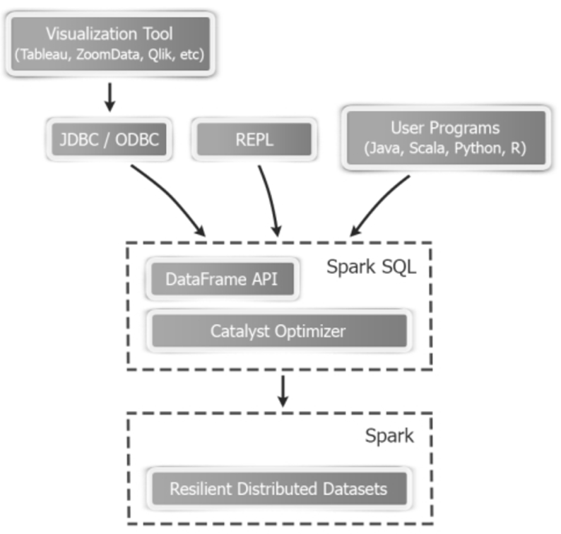
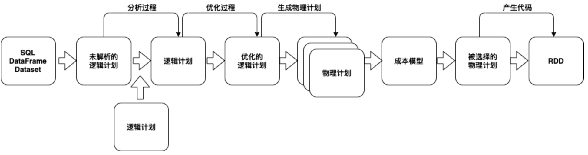
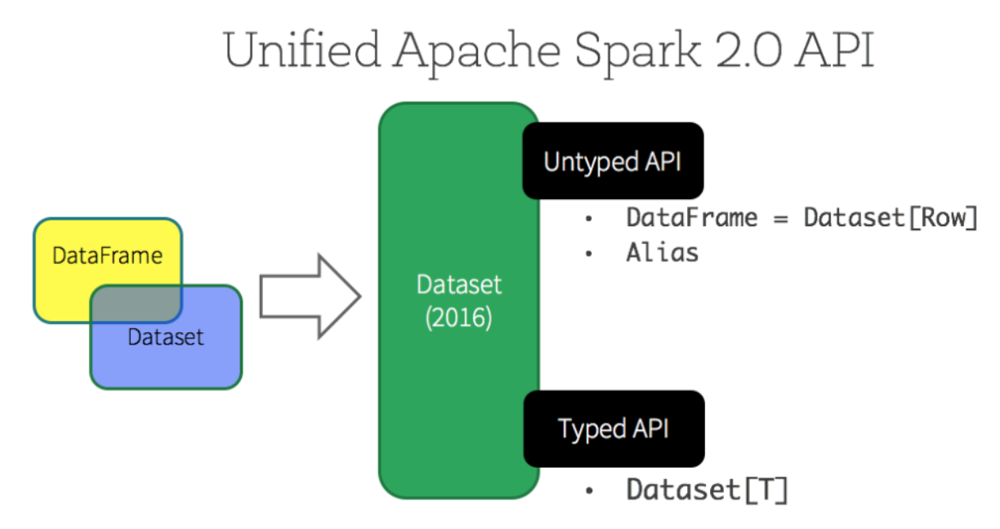
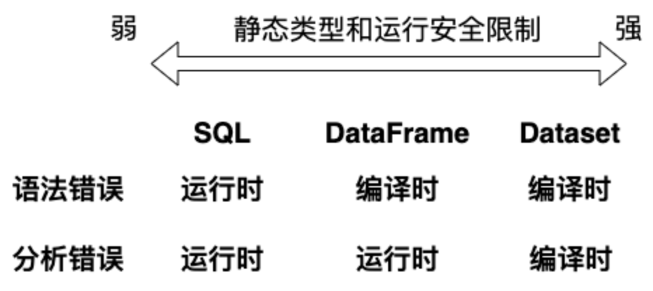

# 关系型数据处理

大数据应用程序需要混合处理各种数据源和存储格式。为这些工作负载设计的MapReduce系统提供了一个功能强大但低级别的过程式编程。过程式编码是通过调用API实现数据的读取，需要了解特定API的使用规范，并且需要用户进行手动优化以实现高性能，因此出现了很多工具试图通过大数据系统接口来提供关系型方法提高用户体验。关系型方法是通过SQL语言实现数据读取，这是一种标准的应用于关系数据库上的查询语言，为用户提供了统一的查询格式。只要是熟悉关系数据库操作的用户就可以轻松使用，而且可以自动实现优化处理。目前，Pig、Hive、Dremel和Shark等工具都可以提供利用SQL语言实现丰富的查询功能。

尽管关系型系统的普及表明用户通常更喜欢编写SQL查询，但关系型方法对于许多大数据应用程序来说是不够的。首先用户想要对半结构或非结构化的各种数据源执行ETL，需要根据数据类型定制代码；其次想要执行高级分析，例如机器学习和图处理，这些高级分析在关系型系统中难以表达。在实践中，大多数数据管道在理想情况下将结合使用关系查询和复杂的过程算法来表达，但是这两类系统（关系型和过程型）到目前为止仍然很大程度上是分离的，迫使用户只能选择其中一种模式。Spark
SQL建立于在早先的Shark项目上，其不是强迫用户在关系或程序两种模式之间选择，Spark SQL可让用户无缝地混合这两者模式。Spark
SQL结合两种模式的优点，弥合了两中模式之间的差距。与Apache Spark其他主要的组件一样，Spark
SQL也是一种特殊的基于大量分布式内存计算的组件，是建立在底层的Spark核心RDD数据模型之上的。Spark
SQL使用关系型数据结构保存和查询，可以持久结构化和半结构化数据。Spark
SQL可以使用SQL、HiveQL和自定义类似SQL的数据集API，可以将其称为针对结构化查询的领域特定语言。Spark
SQL以批处理和流式传输模式支持结构化查询，后者作为Spark SQL的单独模块与Spark Streaming集成实现结构化流。

Spark SQL是一个基于Apache Spark核心运行的库。Spark
SQL的一个用途是执行SQL查询，也可用于从现有的Hive中读取数据，通过编程语言运行SQL时，结果将作为Dataset或DataFrame返回。还可以使用命令行，或者JDBC和ODBC与SQL接口进行交互（图例
4‑1）。从Spark 2.0起，Spark SQL实际上已经成为内存分布式数据高层接口，将RDD隐藏在更高层次的抽象背后。Spark
SQL启用Hive支持，我们可以使用HiveQL语法读取和写入基于Hive部署的数据。通过Spark
SQL执行的选择查询都将生成一个Catalyst表达式树，同时进一步优化到大型分布式数据集上。像SQL和NoSQL数据库一样，Spark
SQL使用逻辑查询计划优化器生成代码，通常可能比我们自定义代码更好。Spark
SQL具有二进制行格式的Tungsten执行引擎以提供性能查询优化。另外，Spark
SQL引入了一个名为Dataset的表格数据抽象，旨在使结构化表格数据定义更加简单和快捷。

图例 4‑1 Spark SQL接口

## Spark SQL概述

Spark SQL是用于结构化数据处理的Spark模块。与基本RDD API不同，Spark
SQL的接口提供了更多有关数据结构和类型的信息，Spark
SQL使用这些额外的信息来执行性能优化。用户可以使用SQL语法和API等多种方法与Spark
SQL进行交互操作，但是后台使用相同的执行引擎计算结果，与要用来表达计算的编程语言无关。这种统一意味着开发人员可以轻松地在不同的API之间来回切换，从而提供最自然的方式来表达给定的转换。

Spark
SQL的一种用途是执行SQL查询，可以用于从现有的Hive中读取数据，返回的结果类型为Dataset或DataFrame，还可以使用命令行或通过JDBC和ODBC与SQL接口进行交互。Dataset是数据的分布式集合另一种抽象，是Spark
1.6中添加的新接口，具有RDD的优点，实现静态类型输入，以及强大的Lambda函数能力；并且还有Spark
SQL优化执行引擎的优点。Spark
SQL可以从Java虚拟器对象构造Dataset，然后在Dataset上应用函数转换，例如map()、flatMap()、filter()等操作。Dataset
API只在Scala和Java中可用，Python不支持Dataset API，但是由于Python的动态特性，Dataset
API的许多特性也是可用的，例如我们可以自然地通过row.columnName方式访问一行的字段，R的情况也是类似。

DataFrame也是一种Dataset，由一系列的命名列组成。从概念上讲，DataFrame等效于关系数据库中的表，在R和Python等编程语言中包含同名的概念，但是Spark中的DataFrame在后台进行了更丰富的优化。Spark
SQL可以从多种数据源构造DataFrame，例如结构化数据文件、Hive中的表、外部数据库或现有RDD。DataFrame
API在Scala，Java，Python和R中可用。在Scala和Java中，DataFrame由具有Row泛型的Dataset表示。在Scala
API中，DataFrame只是Dataset\[Row\]类型别名；而在Java
API中，用户需要使用Dataset\<Row\>来代表DataFrame。

### Catalyst优化器

Catalyst优化器是Spark
SQL的核心，是在Scala中实现的，它启用了几个关键功能，例如数据结构的推断，这在数据分析工作中非常有用。下图详细描述了高级转换的过程，从包含SQL、DataFrames或Datasets的程序经过Catalyst优化器最终产生执行代码：

这个高级转换过程的内部表示是一个查询计划，描述了查询中定义的数据操作，例如聚合，联接和过滤等。这些操作从输入数据集生成一个新的数据集。在准备好查询计划的初始版本之后，Catalyst优化器将应用一系列转换操作对查询计划进行优化，最后Spark
SQL代码生成机制将优化的查询计划解释为准备执行的RDD定义脚本。查询计划和优化的查询计划在内部表示为树，因此Catalyst优化器的核心是一个通用库，用于表示树并应用规则对其进行操作。在此库之上，还有其他几个更专门用于关系查询处理的库。Catalyst有两种类型的查询计划：逻辑计划（Logical
Plan）和物理计划（Phycical
Plan）。逻辑计划描述了数据集上的计算，但是不定义如何执行特定计算，物理计划描述了对数据集的计算，并具有如何执行它们的特定定义。初始查询计划本质上是一个未解析的逻辑计划。也就是说，在此阶段我们不知道数据集或列的来源，以及列的类型。在分析过程中，目录信息用于将未解决的逻辑计划转换为已解决的逻辑计划，然后在优化过程中，应用规则生成优化的逻辑计划。下一步，优化器可能会生成多个物理计划，通过成本模型选择最佳计划。

DataFrame取决于Catalyst优化器和Tungsten性能的改进，因此让我们简要地检查一下Catalyst优化器是如何工作的。Catalyst优化器根据输入的操作指令解析和创建的逻辑计划，然后通过查看操作指令中使用的各种属性和列来分析逻辑计划，然后Catalyst就会进一步尝试对分析后的逻辑计划进行优化，通过组合多个操作并重新排列逻辑计划以获得更好的性能，例如在数据分区上有转换和过滤操作，那么过滤数据和应用转换的顺序对于操作的整体性能非常重要，可以对诸如过滤和转换之类的操作进行重新排序，有时可以将多个操作分为一组，并且最大程度地减少在工作节点之间的洗牌数据量，例如当在不同数据集之间执行联合操作时，Catalyst优化器可以决定在网络中广播较小的数据集。使用explain()查看任何数据框的执行计划。Catalyst优化器还计算DataFrame的列和分区的统计信息，从而提高了执行速度。Spark
SQL 通过Catalyst生成优化的逻辑计划，然后将其转换为物理计划。相同的操作指令可能生成多个版本的物理计划，并生成相同的结果。从Spark
2.2开始，Spark SQL使用基于成本的优化器（Cost-based Optimizer，CBO）评估选择最佳的物理计划。另外，Spark
2.x与以前的版本（例如Spark
1.6和更早版本）相比显著提高性能，其背后的一个关键因素就是通过Tungsten进行了性能改进，Tungsten实现了全面的内存管理和其他性能改进，其最重要的内存管理改进是使用对象的二进制编码，二进制编码的对象占用更少的内存，可以提高了洗牌性能。

### DataFrame与Dataset

Spark提供了三种类型的数据结构抽象，其中包括：RDD、DataFrame和DataSet。无论DataFrame还是DataSet都是以RDD为底层进行了结构化的封装。RDD在前几章已经介绍过，是始于最早可用的Spark
1.0版本，DataFrame最早开始与Spark 1.3，而Dataset是从Spark
1.6版本开始的。如果基于相同的数据，我们可以通过这三种数据结构的抽象获得相同的访问结果，但他们在性能和计算方式上存在差异。对于刚开始学习Spark的用户可能会感到困惑关于怎样了解每个数据结构抽象的相关性，并决定选择其中哪一个使用。实际上，DataFrame对于RDD来说带来数据定义和访问方式的改变，并且进行了许多性能优化。Dataset也是分布式的数据集合，集成了RDD和DataFrame的优点，具备静态类型的特点，同时支持Lambda函数，但只能在Scala和Java语言中使用。在Spark
2.0后，为了方便开发者，Spark将DataFrame和Dataset的API融合到一起，提供了结构化的API，即用户可以通过一套标准的API就能完成对两者的操作。

DataFrame是Spark SQL中的结构化数据一种抽象。在Apache
Spark之前，只要有人想对大量数据运行类似SQL的查询，Apache
Hive就是首选技术。Apache
Hive从本质上将SQL查询转换成类似于MapReduce的逻辑，从而自动地使在大数据上执行的多种分析变得非常容易，而无需实际学习用Java和scala编写复杂的代码。随着Apache
Spark的出现，我们在大数据规模上进行分析的方式发生了转变。Spark SQL在Apache
Spark的分布式计算能力之上提供了一个使用SQL的数据访问层。实际上，Spark
SQL可以用作在线分析处理数据库。Spark
SQL的工作原理是将SQL的语句解析为抽象语法树，然后将该计划转换为逻辑计划，然后将逻辑计划优化为可以执行的物理计划。最终的执行使用底层的DataFrame
API，这个过程是通过Spark系统在后台完成，用户只要熟悉使用SQL语句就可以轻松完成，而无需学习所有内部知识。

DataFrame是弹性分布式数据集的抽象，使用经过Catalyst进行了优化的高级函数进行处理，并且借助Tungsten功能来实现高性能。我们可以将Dataset视为RDD的有效表，具有高度优化的二进制数据表示形式。使用编码器可以实现二进制表示，该编码器将各种对象序列化为二进制结构，以实现比RDD数据表示更好的性能。由于DataFrame始终在底层使用RDD，因此DataFrame和Dataset也完全像RDD一样属于分布式数据集，这也意味着数据集是不可变的，每次转换或动作都会创建一个新的数据集。DataFrame和Dataset在概念上类似于关系数据库中的表，因此可以将DataFrame和Dataset看作由数据行组成的表，每一行包含几列。如前所述，RDD是数据处理的低层API，DataFrame和Dataset是在RDD之上创建的。通过DataFrame和Dataset，可以将RDD的低层内部工作抽象化成关系表操作，并提供高级API，这些API易于使用并提供了许多现成的功能。实际上，DataFrame遵循Python、R和Julia等语言中相似概念创建的，Dataset是基于DataFrame进行的扩展。

DataFrame将SQL代码和特定于领域的语言表达式转换为优化的执行计划，然后在Spark
Core之上运行，以使SQL语句执行各种数据操作。DataFrame支持许多不同类型的输入数据源和许多类型的操作，其中包括大多数数据库的所有SQL操作，例如联接、分组、聚合和窗口函数。Spark
SQL也与Hive查询语言非常相似，并且由于Spark为Hive提供了自然的适配器，因此在Hive中工作的用户可以轻松地将其知识转移到Spark
SQL上，从而缩短转换时间。DataFrame是基于表的概念，该表的操作方式与Hive的工作方式非常相似。实际上，
Spark中对表的许多操作类似于Hive处理表并在这些表上进行操作的方式。可以将DataFrame注册为表，并且可以使用SQL语句代替DataFrame
API对数据进行操作。

图例 4‑2 Spark DataFrame和Dataset API

从Spark
2.0开始，DataSet具有两个不同的API特性：带类型的API（静态类型）和不带类型的API（动态类型）。在概念上，DataFrame视为通用对象Dataset
\[Row\]集合的别名，其中Row是不带类型的Java虚拟机对象，相比之下DataSet是带类型的Java虚拟机对象集合，数据类型可以由Scala中案例类定义或Java中的类指定。由于Python和R语言在编译时类型是动态的，因此只有不带类型的API，即DataFrame，而无法使用Dataset。Spark
SQL可以三种方式操作数据，包括SQL语言、DataFrame API、Dataset
API。如果从静态类型和运行时安全性的限制进行比较，SQL语言的限制最弱，Dataset
API的限制最强。如果在代码中使用SQL语句进行查询时，直到运行时才会发现语法错误，所以一般建议通过交互方式执行，而通过DataFrame和DataSet编程的方式，可以在编译时发现和捕获语法错误，所以编写应用代码时节省了开发人员的时间和成本。如果我们错误调用了DataFrame中不存在的函数，编译器可以捕获这样的错误，但是只有在运行时才能发现调用了不存在的列，所以说DataFrame的限制是中间级别。另外，DataSet实现了最严格的限制，由于所有DataSet
API都表示为lambda函数和Java虚拟机类型对象，因此在编译时就可以检测到任何类型参数的不匹配。如果使用Dataset可以在编译时检测到分析错误，进一步保障应用程序的安全性以及减少开发人员排查错误的时间和成本，所以DataSet对于开发人员来说是最具限制性和也是最有效性的。

### 创建结构化数据

Spark中所有功能的入口点是SparkSession。当启动spark-shell时，系统自动启动了一个SparkSession实例spark，我们可以在创建DataFrame和Dataset时直接通过spark调用其中的方法。从Spark
2.0开始，SparkSession提供了Hive功能的内置支持，包括使用HiveQL编写查询，访问Hive
UDF以及从Hive表读取数据的功能。要使用这些功能，我们不需要具有现有的Hive设置。使用SparkSession，应用程序可以从现有的RDD、Hive表或Spark数据源创建DataFrame。

scala\> val df = spark.read.json("/data/people.json")

df: org.apache.spark.sql.DataFrame = \[age: bigint, name: string\]

scala\> df.show

\+----+-------+

| age| name|

\+----+-------+

|null|Michael|

| 30| Andy|

| 19| Justin|

\+----+-------+

代码 4‑1

如上所述，在Spark 2.0中DataFrame只是Scala API或Java
API中包含Dataset\[Row\]或Dataset\<Row\>的集合。基于DataFrame的操作是不带类型的，而Dataset是带类型的。

scala\> df.printSchema()

root

|-- age: long (nullable = true)

|-- name: string (nullable = true)

scala\> df.select("name").show()

\+-------+

| name|

\+-------+

|Michael|

| Andy|

| Justin|

\+-------+

scala\> df.select($"name", $"age" + 1).show()

\+-------+---------+

| name|(age + 1)|

\+-------+---------+

|Michael| null|

| Andy| 31|

| Justin| 20|

\+-------+---------+

scala\> df.filter($"age" \> 21).show()

\+---+----+

|age|name|

\+---+----+

| 30|Andy|

\+---+----+

scala\> df.groupBy("age").count().show()

\+----+-----+

| age|count|

\+----+-----+

| 19| 1|

|null| 1|

| 30| 1|

\+----+-----+

代码 4‑2

除了简单的列引用和表达式，DataFrame还具有丰富的函数库，包括字符串操作、日期算术、常用的数学运算等。SparkSession上的sql()函数使应用程序以编程方式运行SQL查询，并将结果创建新的DataFrame。

scala\> df.createOrReplaceTempView("people")

scala\> val sqlDF = spark.sql("SELECT \* FROM people")

sqlDF: org.apache.spark.sql.DataFrame = \[age: bigint, name: string\]

scala\> sqlDF.show()

\+----+-------+

| age| name|

\+----+-------+

|null|Michael|

| 30| Andy|

| 19| Justin|

\+----+-------+

代码 4‑3

Spark
SQL中的本地临时视图是基于会话范围的，如果创建它的会话终止，其也将消失。如果要在所有会话之间共享临时视图，并保持活动状态，直到Spark应用程序终止，可以创建一个全局临时视图。全局临时视图与系统保留的数据库global\_temp绑定，必须使用global\_temp限定名称来引用它，例如SELECT
\* FROM global\_temp.people。

scala\> df.createGlobalTempView("people")

scala\> spark.sql("SELECT \* FROM global\_temp.people").show()

\+----+-------+

| age| name|

\+----+-------+

|null|Michael|

| 30| Andy|

| 19| Justin|

\+----+-------+

scala\> spark.newSession().sql("SELECT \* FROM
global\_temp.people").show()

\+----+-------+

| age| name|

\+----+-------+

|null|Michael|

| 30| Andy|

| 19| Justin|

\+----+-------+

代码 4‑4

从Spark 2.0开始，Spark
SQL主要的数据结构抽象就是DataSet，其表示一个结构化数据，其中定义的数据结构和类型。DataSet与RDD类似，但不是使用Java序列化或Kryo，而使用专门的编译器来串行化对象以便通过网络进行处理或传输。虽然编译器和标准序列化都是负责将对象转换成字节的，但编译器是动态生成的代码并使用了某种格式，允许Spark执行许多操作，如过滤、排序和散列，而无需将字节反序列化到对象中。这里我们包括一些使用Dataset进行结构化数据处理的基本示例。下面的例子用toDS()函数创建一个Dataset：

scala\> case class Person(name: String, age: Long)

defined class Person

scala\> val caseClassDS = Seq(Person("Andy", 32)).toDS()

caseClassDS: org.apache.spark.sql.Dataset\[Person\] = \[name: string,
age: bigint\]

scala\> caseClassDS.show()

\+----+---+

|name|age|

\+----+---+

|Andy| 32|

\+----+---+

scala\> val primitiveDS = Seq(1, 2, 3).toDS()

primitiveDS: org.apache.spark.sql.Dataset\[Int\] = \[value: int\]

scala\> primitiveDS.map(\_ + 1).collect()

res13: Array\[Int\] = Array(2, 3, 4)

通过JSON文件生成一个Dataset：

scala\> val peopleDS = spark.read.json("/data/people.json").as\[Person\]

peopleDS: org.apache.spark.sql.Dataset\[Person\] = \[age: bigint, name:
string\]

scala\> peopleDS.show()

\+----+-------+

| age| name|

\+----+-------+

|null|Michael|

| 30| Andy|

| 19| Justin|

\+----+-------+

scala\> peopleDS.printSchema

root

|-- age: long (nullable = true)

|-- name: string (nullable = true)

代码 4‑5

上面的代码中发生了三件事：

（1）Spark读取JSON，推断模式并创建DataFrame的集合。

（2）Spark将数据转换为DataFrame = Dataset
\[Row\]，这是泛型Row对象的集合，因为不需要知道每行中数据的确切类型。

（3）Spark会根据案例类Person，将Dataset \[Row\]转变为Dataset\[Person\]，指定了Java虚拟器对象。

我们中的大多数人都使用过结构化数据，习惯于以列方式或访问对象中的特定属性来查看和处理数据。通过将数据集转变成Dataset
\[T\]类型的对象集合，我们可以无缝地获得自定义视图，以及强类型JVM对象的编译时安全性。从上面的代码中得到的强类型Dataset\[T\]可以使用高级方法轻松显示或处理。

为了有效地支持特定域对象，需要一个编译器将域特定类型T映射到Spark的内部类型系统。例如给定一个具有两个字段name（String）和age（int）的类Person，编译器告诉Spark在运行时生成代码以将Person对象序列化为二进制结构。这种二进制结构通常具有更低的内存占用，并且针对数据处理的效率进行了优化，要了解数据的内部二进制表示形式，可以调用schema()函数：

scala\> peopleDS.schema

res16: org.apache.spark.sql.types.StructType =
StructType(StructField(age,LongType,true),
StructField(name,StringType,true))

Spark
SQL支持两种将现有RDD转换为Dataset的方法。第一种方法使用案例类反射来推断包含特定对象类型的RDD的架构。这种基于反射的方法可以使代码更简洁，当我们在编写Spark应用程序时已经了解数据的结构，这种情况下适合使用反射的方法。第二种方法是通过编程接口，该接口允许我们构造数据结构，然后将其应用于现有的RDD上，尽管此方法较为冗长，但可以在运行时获得列及其类型的情况下构造Dataset。Spark
SQL的Scala接口支持自动将包含案例类的RDD转换为DataFrame。案例类定义了表的架构。案例类的参数名称被用反射读取，并成为列的名称。案例类也可以嵌套或包含复杂类型，例如Seqs或Arrays。可以将该RDD隐式转换为DataFrame，然后将其注册为表，可以在后续的SQL语句中使用。

scala\> :paste

// Entering paste mode (ctrl-D to finish)

val peopleDF = spark.sparkContext

.textFile("/data/people.txt")

.map(\_.split(","))

.map(attributes =\> Person(attributes(0), attributes(1).trim.toInt))

.toDF()

// Exiting paste mode, now interpreting.

peopleDF: org.apache.spark.sql.DataFrame = \[name: string, age: bigint\]

scala\> peopleDF.createOrReplaceTempView("people")

scala\> val teenagersDF = spark.sql("SELECT name, age FROM people WHERE
age BETWEEN 13 AND 19")

teenagersDF: org.apache.spark.sql.DataFrame = \[name: string, age:
bigint\]

scala\> teenagersDF.map(teenager =\> "Name: " + teenager(0)).show()

\+------------+

| value|

\+------------+

|Name: Justin|

\+------------+

scala\> teenagersDF.map(teenager =\> "Name: " +
teenager.getAs\[String\]("name")).show()

\+------------+

| value|

\+------------+

|Name: Justin|

\+------------+

解决多行语句问题的一种简单方法是在REPL中使用：paste命令。
输入多行语句之前，在REPL中键入：paste命令。执行此操作时，REPL会提示粘贴命令（多行表达式），然后在命令末尾按\[Ctrl\]
\[D\]。

当案例类不能被提前定义时，例如记录的结构被写在一个字符串中，或者文本数据集将被解析，而对于不同的用户而言字段将被进行不同的投影，可以通过三个步骤以编程方式创建一个DataFrame：

（1）从原始RDD创建一个包含Row对象的RDD

（2）创建与Row对象结构相匹配的模式，由StructType表示

（3）通过SparkSession提供的createDataFrame()方法将模式应用于RDD。

scala\> import org.apache.spark.sql.types.\_

import org.apache.spark.sql.types.\_

scala\> import org.apache.spark.sql.Row

import org.apache.spark.sql.Row

scala\> val peopleRDD = spark.sparkContext.textFile("/data/people.txt")

peopleRDD: org.apache.spark.rdd.RDD\[String\] = /data/people.txt
MapPartitionsRDD\[92\] at textFile at \<console\>:31

scala\> val schemaString = "name age"

schemaString: String = name age

scala\> :paste

// Entering paste mode (ctrl-D to finish)

// Generate the schema based on the string of schema

val fields = schemaString.split(" ")

.map(fieldName =\> StructField(fieldName, StringType, nullable = true))

val schema = StructType(fields)

// Convert records of the RDD (people) to Rows

val rowRDD = peopleRDD

.map(\_.split(","))

.map(attributes =\> Row(attributes(0), attributes(1).trim))

// Exiting paste mode, now interpreting.

fields: Array\[org.apache.spark.sql.types.StructField\] =
Array(StructField(name,StringType,true),
StructField(age,StringType,true))

schema: org.apache.spark.sql.types.StructType =
StructType(StructField(name,StringType,true),
StructField(age,StringType,true))

rowRDD: org.apache.spark.rdd.RDD\[org.apache.spark.sql.Row\] =
MapPartitionsRDD\[94\] at map at \<pastie\>:45

scala\> val peopleDF = spark.createDataFrame(rowRDD, schema)

peopleDF: org.apache.spark.sql.DataFrame = \[name: string, age: string\]

scala\> peopleDF.createOrReplaceTempView("people")

scala\> val results = spark.sql("SELECT name FROM people")

results: org.apache.spark.sql.DataFrame = \[name: string\]

scala\> results.map(attributes =\> "Name: " + attributes(0)).show()

\+-------------+

| value|

\+-------------+

|Name: Michael|

| Name: Andy|

| Name: Justin|

\+-------------+

代码 4‑6

让我们看另一个将CSV文件加载到DataFrame中的示例。 只要文本文件包含标题，Spark
SQL的API就会通过读取标题行来推断模式。我们还可以选择指定用于拆分文本文件行的分隔符，从CSV文件的标题行读取推导数据结构，并使用逗号“,”作为分隔符。
我们还展示了使用schema函数和printSchema函数来验证输入文件的模式。

scala\> :paste

// Entering paste mode (ctrl-D to finish)

val statesDF = spark.read.option("header", "true")

.option("inferschema", "true")

.option("sep", ",")

.csv("/data/statesPopulation.csv")

// Exiting paste mode, now interpreting.

statesDF: org.apache.spark.sql.DataFrame = \[State: string, Year: int
... 1 more field\]

scala\> statesDF.schema

res6: org.apache.spark.sql.types.StructType =
StructType(StructField(State,StringType,true),
StructField(Year,IntegerType,true),
StructField(Population,IntegerType,true))

scala\> statesDF.printSchema

root

|-- State: string (nullable = true)

|-- Year: integer (nullable = true)

|-- Population: integer (nullable = true)

我们使用StructType描述数据结构模式，是StructField对象的集合。StructType和StructField属于org.apache.spark.sql.types包，IntegerType和StringType等数据类型也属于theorg.apache.spark.sql.types包，导入这些类，我们可以显示自定义模式。

scala\> import org.apache.spark.sql.types.{StructType,
IntegerType,StringType}

import org.apache.spark.sql.types.{StructType, IntegerType, StringType}

定义一个模式包含用两个字段，一个为整数，后跟一个字符串：

scala\> val schema = new StructType().add("i",
IntegerType).add("s",StringType)

schema: org.apache.spark.sql.types.StructType =
StructType(StructField(i,IntegerType,true),
StructField(s,StringType,true))

scala\> schema.printTreeString

root

|-- i: integer (nullable = true)

|-- s: string (nullable = true)

还有一个使用prettyJson()函数来打印JSON的选项，如下所示：

scala\> schema.prettyJson

res9: String =

{

"type" : "struct",

"fields" : \[ {

"name" : "i",

"type" : "integer",

"nullable" : true,

"metadata" : { }

}, {

"name" : "s",

"type" : "string",

"nullable" : true,

"metadata" : { }

} \]

}

Spark SQL的所有数据类型都位于org.apache.spark.sql.types包中，我们可以通过以下方式访问它们：

scala\> import org.apache.spark.sql.types.\_

import org.apache.spark.sql.types.\_

DataType抽象类是Spark SQL中所有内置数据类型的基本类型，例如字符串等等。表格 4‑1中包括了Spark
SQL和DataFrame支持的数据类型：

表格 4‑1 Spark SQL支持的数据类型

| 数据类型          | 描述                                                                                                                                   |
| ------------- | ------------------------------------------------------------------------------------------------------------------------------------ |
| ByteType      | 表示1字节有符号整数，数字范围从-128到127。                                                                                                            |
| ShortType     | 表示2字节有符号整数，数字范围为-32768至32767。                                                                                                        |
| IntegerType   | 表示4字节有符号整数，数字范围为-2147483648至2147483647。                                                                                              |
| LongType      | 表示8字节有符号整数，数字范围从-9223372036854775808到9223372036854775807。                                                                            |
| FloatType     | 表示4字节的单精度浮点数。                                                                                                                        |
| DoubleType    | 表示8字节的双精度浮点数。                                                                                                                        |
| DecimalType   | 表示任意精度有符号的十进制数。                                                                                                                      |
| StringType    | 表示字符串值。                                                                                                                              |
| BinaryType    | 表示字节序列值。                                                                                                                             |
| BooleanType   | 表示布尔值。                                                                                                                               |
| TimestampType | 表示包含字段年、月、日、小时、分钟和秒的值。                                                                                                               |
| DateType      | 表示包含字段年，月，日的值的值。                                                                                                                     |
| ArrayType     | ArrayType (elementType, containsNull)，表示包含elementType类型的元素序列的值，containsNull用于指示ArrayType值中的元素是否具有空值。                                 |
| MapType       | MapType(keyType, valueType, valueContainsNull)，表示包含一组键值对，键的数据类型由keyType描述，值的数据类型由valueType描述，键不允许具有空值，valueContainsNull用于指示值是否可以为空值。 |
| StructType    | 表示具有StructFields(fields)序列描述的结构。                                                                                                     |
| StructField   | 表示StructType中的一个字段。                                                                                                                  |

从Spark 2.x开始，Spark
SQL提供另一种方式为复杂数据类型定义模式。首先，让我们看一个简单的例子，必须使用import语句导入编码器：

scala\> import org.apache.spark.sql.Encoders

import org.apache.spark.sql.Encoders

让我们看一个简单的示例，将元组定义为要在Dataset API中使用的数据类型：

scala\> Encoders.product\[(Integer, String)\].schema.printTreeString

root

|-- \_1: integer (nullable = true)

|-- \_2: string (nullable = true)

前面的代码始终看起来很复杂，因此我们还可以根据需要定义一个案例类Record，包括两个字段一个为Integer，另一个为String。

scala\> case class Record(i: Integer, s: String)

defined class Record

使用编码器，我们可以轻松地在案例类的基础上创建一个模式，从而使我们可以轻松地使用各种API：

scala\> Encoders.product\[Record\].schema.printTreeString

root

|-- i: integer (nullable = true)

|-- s: string (nullable = true)

## 结构化数据操作

现在我们已经知道如何创建DataFrame和Dataset，接下来的部分是学习如何使用提供的结构化操作来使用它们。与RDD操作不同，结构化操作被设计为更具关系性，这意味着这些操作反映了可以用于SQL语言的表达式，例如投影、过滤、转换和联接等。与RDD操作类似，结构化操作分为转换和动作，这与RDD中的语义相同。换句话说，结构化转换被懒惰地评估，没有真正生成新数据，而是定义了新数据生成的过程；结构化动作根据定义好的过程产生新数据。结构化操作有时被描述为用于分布式数据操作的领域特定语言（Domain
Specific Language，DSL）。领域特定语言是专用于特定应用程序域的计算机语言。Spark
SQL的应用程序域是分布式数据操作，如果我们曾经使用过SQL，那么学习结构化操作就相当容易（表格
4‑1）。

表格 4‑2 常用Spark SQL结构化数据操作

<table>
<thead>
<tr class="header">
<th>操作</th>
<th>描述</th>
</tr>
</thead>
<tbody>
<tr class="odd">
<td>select</td>
<td>从dataFrame现有的列中选择一个或多个列，可以对列进行变换。这个操作的可以称为投影。</td>
</tr>
<tr class="even">
<td>selectExpr</td>
<td>执行投影时支持强大的SQL表达式对列进行转换。</td>
</tr>
<tr class="odd">
<td>filter</td>
<td>和where都具有相同的语义。</td>
</tr>
<tr class="even">
<td>where</td>
<td>类似于SQL中的where条件，根据给定的布尔条件进行过滤。</td>
</tr>
<tr class="odd">
<td>
distinct

dropDuplicates
</td>
<td>从dataFrame中删除重复的行。</td>
</tr>
<tr class="even">
<td>
sort

orderBy
</td>
<td>根据列对dataFrame进行排序。</td>
</tr>
<tr class="odd">
<td>limit</td>
<td>通过获取前n行返回一个新的DataFrame。</td>
</tr>
<tr class="even">
<td>union</td>
<td>合并两个DataFrame并将它们作为新的DataFrame返回。</td>
</tr>
<tr class="odd">
<td>withColumn</td>
<td>用于在DataFrame中添加新列或替换现有列。</td>
</tr>
<tr class="even">
<td>withColumnRenamed</td>
<td>重命名现有的列。</td>
</tr>
<tr class="odd">
<td>drop</td>
<td>从DataFrame中删除一列或多列，如果指定的列名不存在，则不执行任何操作。</td>
</tr>
<tr class="even">
<td>sample</td>
<td>根据给定的参数随机选择。</td>
</tr>
<tr class="odd">
<td>randomSplit</td>
<td>根据给定的权重将DataFrame分为一个或多个DataFrame，在机器学习模型训练过程中，通常用于将数据集分为训练和测试两个部分。</td>
</tr>
<tr class="even">
<td>join</td>
<td>联接了两个DataFrame，Spark支持多种类型的联接。</td>
</tr>
<tr class="odd">
<td>groupby</td>
<td>将DataFrame按一列或多列分组，一种常见的模式是在groupBy操作之后执行某种聚合。</td>
</tr>
<tr class="even">
<td>describe</td>
<td>计算有关DataFrame中的数字列和字符串列的通用统计信息，可用的统计信息包括计数、平均值、标准方差、最小值、最大值和任意近似百分位数。</td>
</tr>
</tbody>
</table>

### 选取列

表格
4‑1中的大多数DataFrame结构化操作将要求指定一个或多个列，可以通过字符串形式指定，也可以将其指定为Column类的实例。为什么会有两个选择方式？以及何时使用呢？要回答这些问题，我们需要了解Column类提供的功能。从高层次上讲，Column类提供的功能可以分为以下几类：

（1）数学运算，例如加法，乘法等。

（2）列值或文字之间的逻辑比较，例如相等、大于、小于等。

（3）字符串模式匹配。

有关Column类中可用的所有功能，请参阅Scala文档中的org.apache.spark.sql.Column。了解Column类提供的功能后，我们可以得出结论，每当需要指定某种列表达式时，就必须将列指定为Column类的实例而不是字符串，本节通过示例更清楚的说明这一点。引用列的方式有很多，可以会造成了混乱。一个常见的问题是何时用，用哪个，这需要更具实际情况分析，表格
4‑2说明了可用选项。

表格 4‑3 选取列的可用选项

| 方式     | 例子           | 解释                                     |
| ------ | ------------ | -------------------------------------- |
| ""     | "列名"         | 将一个列引用为字符串类型                           |
| col    | col("列名")    | 通过col函数返回Column类的实例                    |
| column | column("列名") | 与col类似，此函数返回Column类的实例。                |
| $      | $"列名"        | 在Scala中构造Column类的语法糖方式。                |
| '      | '列名          | 通过利用Scala符号文字特征在Scala中构造Column类的语法糖方式。 |

col和column函数是同义词，在Spark的Scala和Python函数库中都可用。如果需要经常在Scala和Python之间切换，那么使用col函数是很有意义的，这样我们的代码就具有可移植性；如果主要或仅使用Scala，那么建议是使用“'”方式，因为输入更少的字符。DataFrame类具有自己的col函数，该函数用于在执行两个或多个DataFrame联接时区分具有相同名称的列。

scala\> import org.apache.spark.sql.functions.\_

import org.apache.spark.sql.functions.\_

scala\> val kvDF = Seq((1,2),(2,3)).toDF("key","value")

kvDF: org.apache.spark.sql.DataFrame = \[key: int, value: int\]

scala\> kvDF.columns

res0: Array\[String\] = Array(key, value)

scala\> kvDF.select("key")

res1: org.apache.spark.sql.DataFrame = \[key: int\]

scala\> kvDF.select(col("key"))

res2: org.apache.spark.sql.DataFrame = \[key: int\]

scala\> kvDF.select(column("key"))

res3: org.apache.spark.sql.DataFrame = \[key: int\]

scala\> kvDF.select($"key")

res4: org.apache.spark.sql.DataFrame = \[key: int\]

scala\> kvDF.select('key)

res5: org.apache.spark.sql.DataFrame = \[key: int\]

使用了DataFrame中的col函数：

scala\> kvDF.select(kvDF.col("key"))

res6: org.apache.spark.sql.DataFrame = \[key: int\]

scala\> kvDF.select('key, 'key \> 1).show

\+---+---------+

|key|(key \> 1)|

\+---+---------+

| 1| false|

| 2| true|

\+---+---------+

上面的示例说明了列表达式“'key \>
1”，因此需要将列指定为Column类的实例，如果将该列指定为字符串，则将导致类型不匹配错误。在以下使用各种DataFrame结构化操作的示例中，将显示列表达式的更多示例。

### 选择语句（select、selectExpr）

此转换通常用于执行投影，从DataFrame中选择所有列或列的子集。在选择期间，每个列都可以通过表达式进行转换，此转换有两种方式，一种是将列作为字符串，而另一种是将列作为Column类，不允许混合使用。

scala\> val df = spark.createDataset(Seq(

| ("Ivan", 1, 2), ("Tom", 3, 4), ("Rose", 3, 5), ("John", 4, 6))

| ).toDF("col1", "col2", "col3")

df: org.apache.spark.sql.DataFrame = \[col1: string, col2: int ... 1
more field\]

scala\> df.show

\+----+----+----+

|col1|col2|col3|

\+----+----+----+

|Ivan| 1| 2|

| Tom| 3| 4|

|Rose| 3| 5|

|John| 4| 6|

\+----+----+----+

代码 4‑18

上面的代码创建了一个DataFrame，列名分别是col1、col2、col3，类型对应为String、Integer、Integer。当前造了4条记录，如上所示。接下来看看选择列的几种调用方式

scala\> df.select("col1").collect

res6: Array\[org.apache.spark.sql.Row\] = Array(\[Ivan\], \[Tom\],
\[Rose\], \[John\])

scala\> df.select($"col1").collect

res7: Array\[org.apache.spark.sql.Row\] = Array(\[Ivan\], \[Tom\],
\[Rose\], \[John\])

scala\> df.select(df.col("col1")).collect

res8: Array\[org.apache.spark.sql.Row\] = Array(\[Ivan\], \[Tom\],
\[Rose\], \[John\])

代码 4‑19

如果select方法中参数直接用字符串引用DataFrame中字段名，不能对字段名再使用表达式，“$"col1"”这种写法是创建Column类的实例，所以可以支持表达式：

scala\> df.select(upper($"col1")).collect

res11: Array\[org.apache.spark.sql.Row\] = Array(\[IVAN\], \[TOM\],
\[ROSE\], \[JOHN\])

scala\> df.select(upper("col1")).collect

\<console\>:26: error: type mismatch;

found : String("col1")

required: org.apache.spark.sql.Column

df.select(upper("col1")).collect

代码 4‑20

上面在select中对字段col1调用了upper()函数转换大小写，“$”符号是Scala的语法糖，而没有加“$”符号的语法报错了，提示需要的是Column类型，而当前给出的则是个String类型，这时候的select也可以用selectExpr()方法替换，比如下面的调用：

scala\> df.selectExpr("upper(col1)", "col2 as col22").show

\+-----------+-----+

|upper(col1)|col22|

\+-----------+-----+

| IVAN| 1|

| TOM| 3|

| ROSE| 3|

| JOHN| 4|

\+-----------+-----+

代码 4‑21

代码
4‑21中，selectExpr()方法使用了两个表达式，一个是将col1字段调用upper函数，另一个是将col2字段改为别名col22。selectExpr转换是select转换的变体，一个很大的不同是它接受一个或多个SQL表达式，而不是列，但是两者实际上都在执行相同的投影任务。SQL表达式是一种强大而灵活的构造，使我们可以根据思考方式自然地表达列转换逻辑，可以用字符串格式表示SQL表达式，Spark会将它们解析为逻辑树，以便按正确的顺序对其进行求值。

scala\> df.select('col1, ('col2 + ('col3 \* 2)).as("(col2 + col3 \*
2)")).show

\+----+-----------------+

|col1|(col2 + col3 \* 2)|

\+----+-----------------+

|Ivan| 5|

| Tom| 11|

|Rose| 13|

|John| 16|

\+----+-----------------+

代码 4‑22

代码
4‑22需要两个列表达式：加和乘，都由Column类中的加函数（+）和乘函数（\*）实现。默认情况下，Spark使用列表达式作为结果列的名称，为了使其更具可读性通常使用as函数将其重命名为更易于理解的列名，我们可能会发现select转换可用于将一个或多个列添加到DataFrame。

### 操作列（withColumn、withColumnRenamed、drop）

withColumn用于向DataFrame添加新列。它需要两个输入参数：列名和通过列表达式产生的值。如果通过使用selectExpr转换，我们也可以实现几乎相同的目标。但是，如果给定的列名称与现有名称之一匹配，则该列将替换为给定的列表达式。

scala\> df.withColumn("sum", ('col2 + 'col3)).show

\+----+----+----+---+

|col1|col2|col3|sum|

\+----+----+----+---+

|Ivan| 1| 2| 3|

| Tom| 3| 4| 7|

|Rose| 3| 5| 8|

|John| 4| 6| 10|

\+----+----+----+---+

scala\> df.withColumn("col2", ('col2 + 'col3)).show

\+----+----+----+

|col1|col2|col3|

\+----+----+----+

|Ivan| 3| 2|

| Tom| 7| 4|

|Rose| 8| 5|

|John| 10| 6|

\+----+----+----+

withColumnRenamed转换重命名DataFrame中的现有列名。

scala\> df.withColumnRenamed("col2", "col2\_rename").show

\+----+-----------+----+

|col1|col2\_rename|col3|

\+----+-----------+----+

|Ivan| 1| 2|

| Tom| 3| 4|

|Rose| 3| 5|

|John| 4| 6|

\+----+-----------+----+

drop转换只是从DataFrame中删除指定的列，可以指定要删除的一个或多个列名，但是只会删除存在的列名，而不会删除那些不存在的列名。可以通过select转换仅投影要保留的列，而删除不需要，但是如果DataFrame有100列，而想删除几列，使用drop转换比select转换更易于使用。

scala\> df.drop('col2).show

\+----+----+

|col1|col3|

\+----+----+

|Ivan| 2|

| Tom| 4|

|Rose| 5|

|John| 6|

\+----+----+

### 条件语句（where、filter）

条件语句是一个相当简单易懂的转换，用于过滤不符合给定条件的行，或者换句话说过滤条件计算结果为false的行。从另一个角度来看，条件语句的行为仅返回满足指定条件的行，给定条件可以根据需要简单或复杂。使用条件语句需要知道如何利用Column类中的一些逻辑比较功能，例如相等、小于、大于和不相等。filter和where转换的行为均相同，因此可以选择最适合的过滤器，但是后者比前者更具SQL关系性语言的特征。filter()函数有下面几种形式：

  - def filter(func: (T) ⇒ Boolean): Dataset\[T\]

  - def filter(conditionExpr: String): Dataset\[T\]

  - def filter(condition: Column): Dataset\[T\]

scala\> df.filter($"col1"\>"Tom").show

\+----+----+----+

|col1|col2|col3|

\+----+----+----+

\+----+----+----+

scala\> df.filter($"col1"==="Tom").show

\+----+----+----+

|col1|col2|col3|

\+----+----+----+

| Tom| 3| 4|

\+----+----+----+

scala\> df.filter("col1='Tom'").show

\+----+----+----+

|col1|col2|col3|

\+----+----+----+

| Tom| 3| 4|

\+----+----+----+

scala\> df.filter("col2=1").show

\+----+----+----+

|col1|col2|col3|

\+----+----+----+

|Ivan| 1| 2|

\+----+----+----+

scala\> df.filter($"col2"===3).show

\+----+----+----+

|col1|col2|col3|

\+----+----+----+

| Tom| 3| 4|

|Rose| 3| 5|

\+----+----+----+

scala\> df.filter($"col2"===$"col3"-1).show

\+----+----+----+

|col1|col2|col3|

\+----+----+----+

|Ivan| 1| 2|

| Tom| 3| 4|

\+----+----+----+

代码 4‑23

其中，“===”是在Column类中定义的函数，可以判断两个列中每行对应的值是否相等，不等于是=\!=。$”col2”这个是语法糖，返回Column对象。下面看一看where函数：

  - def where(conditionExpr: String): Dataset\[T\]

  - def where(condition: Column): Dataset\[T\]

scala\> df.where("col1 = 'John'").show

\+----+----+----+

|col1|col2|col3|

\+----+----+----+

|John| 4| 6|

\+----+----+----+

scala\> df.where($"col2"=\!= 3).show

\+----+----+----+

|col1|col2|col3|

\+----+----+----+

|Ivan| 1| 2|

|John| 4| 6|

\+----+----+----+

scala\> df.where($"col3"\>col("col2")).show

\+----+----+----+

|col1|col2|col3|

\+----+----+----+

|Ivan| 1| 2|

| Tom| 3| 4|

|Rose| 3| 5|

|John| 4| 6|

\+----+----+----+

scala\> df.where($"col3"\>col("col2")+1).show

\+----+----+----+

|col1|col2|col3|

\+----+----+----+

|Rose| 3| 5|

|John| 4| 6|

\+----+----+----+

代码 4‑24

### 去除重复（distinct、dropDuplicates）

这两个转换具有相同的行为，但是dropDuplicates允许我们控制使用哪些列应用到重复数据删除逻辑中，如果未指定任何内容，则重复数据删除逻辑将使用DataFrame中的所有列。

scala\> df.select('col2).distinct.show

\+----+

|col2|

\+----+

| 1|

| 3|

| 4|

\+----+

scala\> df.dropDuplicates("col2").show()

\+----+----+----+

|col1|col2|col3|

\+----+----+----+

|Ivan| 1| 2|

| Tom| 3| 4|

|John| 4| 6|

\+----+----+----+

scala\> df.distinct.show

\+----+----+----+

|col1|col2|col3|

\+----+----+----+

|John| 4| 6|

|Rose| 3| 5|

| Tom| 3| 4|

|Ivan| 1| 2|

\+----+----+----+

### 排序语句（sort、orderBy）

这两种转换都具有相同的语义，orderBy转换比sort转换更具SQL关系语言的特征。默认情况下排序按升序排列，将其更改为降序很容易。如果指定多个列，每个列的顺序可能不同。

  - def sort(sortExprs: Column\*): Dataset\[T\]

  - def sort(sortCol: String, sortCols: String\*): Dataset\[T\]

  - def orderBy(sortExprs: Column\*): Dataset\[T\]

  - def orderBy(sortCol: String, sortCols: String\*): Dataset\[T\]

scala\> df.sort('col2).show

\+----+----+----+

|col1|col2|col3|

\+----+----+----+

|Ivan| 1| 2|

|Rose| 3| 5|

| Tom| 3| 4|

|John| 4| 6|

\+----+----+----+

scala\> df.sort('col2.desc).show

\+----+----+----+

|col1|col2|col3|

\+----+----+----+

|John| 4| 6|

| Tom| 3| 4|

|Rose| 3| 5|

|Ivan| 1| 2|

\+----+----+----+

scala\> df.sort('col2.desc, 'col3.desc).show

\+----+----+----+

|col1|col2|col3|

\+----+----+----+

|John| 4| 6|

|Rose| 3| 5|

| Tom| 3| 4|

|Ivan| 1| 2|

\+----+----+----+

### 操作多表（union、join）

我们之前已经了解到DataFrame是不可变的。因此，如果需要将更多行添加到现有DataFrame中，则union转换可以用于此目的，以及将两个DataFrame中的行进行组合。此转换要求两个DataFrame具有相同的架构，这意味着列名称及其顺序必须完全匹配。

另外，如果要执行任何复杂而有趣的数据分析或处理，我们通常需要通过连接（join）过程将来自多个数据集汇总在一起，这是SQL语言中的一种众所周知的技术。执行连接将合并两个数据集的列，并且合并后的DataFrame将包含这个两个数据集的列。这样一来，我们就可以用单独数据集无法做到的方式进一步分析合并后的数据集。如果以在线电子商务公司的两个数据集为例，一个代表交易数据，其中包含有关哪些客户购买了哪些产品的信息，另一个代表有关每个客户的详细信息，通过将这两个数据集结合在一起，我们可以从年龄或位置方面提取关于哪些产品在某些客户群中更受欢迎的。这个部分介绍如何在Spark
SQL中使用连接转换及其支持的各种连接。

执行两个数据集的连接需要指定两条信息，第一个是连接表达式，该连接表达式指定应使用每个数据集中的哪些列来确定两个数据集中的哪些行将包含在联接的数据集中，第二种是连接类型，该连接类型确定数据集中应包括的内容。表格
4‑3描述Spark SQL中支持的连接类型。

表格 4‑4 Spark SQL中支持的连接类型

| 类型   | 描述                                            |
| ---- | --------------------------------------------- |
| 内连接  | 当连接表达式的值为true时，从两个数据集中返回行。                    |
| 左外连接 | 即使连接表达式的值为false，也从左数据集中返回行。                   |
| 右外连接 | 即使连接表达式的值为false，也从右数据集中返回行。                   |
| 外连接  | 即使连接表达式的值为false，也从两个数据集中返回行。                  |
| 左反连接 | 当连接表达式的值为false时，仅从左侧数据集中返回行。                  |
| 左半连接 | 当连接表达式的值为true时，仅从左侧数据集中返回行。                   |
| 交叉连接 | 通过组合左侧数据集中的每一行与右侧数据集中的每一行来返回行，行数将是每个数据集大小的乘积。 |

  - def union(other: Dataset\[T\]): Dataset\[T\]

  - def join(right: Dataset\[\_\], joinExprs: Column, joinType: String):
    DataFrame

  - def join(right: Dataset\[\_\], joinExprs: Column): DataFrame

  - def join(right: Dataset\[\_\], usingColumns: Seq\[String\],
    joinType: String): DataFrame

  - def join(right: Dataset\[\_\], usingColumns: Seq\[String\]):
    DataFrame

  - def join(right: Dataset\[\_\], usingColumn: String): DataFrame

  - def join(right: Dataset\[\_\]): DataFrame

  - def joinWith\[U\](other: Dataset\[U\], condition: Column):
    Dataset\[(T, U)\]

  - def joinWith\[U\](other: Dataset\[U\], condition: Column, joinType:
    String): Dataset\[(T, U)\]

先定义两个DataFrame：

scala\> val df1 = spark.createDataset(Seq(("Ivan", 1, 2), ("Tom", 3, 4),
("John", 3, 5), ("Tom", 4, 6))).toDF("col1", "col2", "col3")

df1: org.apache.spark.sql.DataFrame = \[col1: string, col2: int ... 1
more field\]

scala\> val df2 = spark.createDataset(Seq(("Ivan", 2, 2), ("Tom", 3, 5),
("Jack", 3, 5), ("Tom", 4, 6), ("Rose", 1, 2), ("Ivan", 1, 5), ("Marry",
5, 6))).toDF("col1", "col2", "col4")

df2: org.apache.spark.sql.DataFrame = \[col1: string, col2: int ... 1
more field\]

scala\> df1.show()

\+----+----+----+

|col1|col2|col3|

\+----+----+----+

|Ivan| 1| 2|

| Tom| 3| 4|

|John| 3| 5|

| Tom| 4| 6|

\+----+----+----+

scala\> df2.show()

\+-----+----+----+

| col1|col2|col4|

\+-----+----+----+

| Ivan| 2| 2|

| Tom| 3| 5|

| Jack| 3| 5|

| Tom| 4| 6|

| Rose| 1| 2|

| Ivan| 1| 5|

|Marry| 5| 6|

\+-----+----+----+

代码 4‑25

#### union

scala\> df1.union(df2).show

\+-----+----+----+

| col1|col2|col3|

\+-----+----+----+

| Ivan| 1| 2|

| Tom| 3| 4|

| John| 3| 5|

| Tom| 4| 6|

| Ivan| 2| 2|

| Tom| 3| 5|

| Jack| 3| 5|

| Tom| 4| 6|

| Rose| 1| 2|

| Ivan| 1| 5|

|Marry| 5| 6|

\+-----+----+----+

#### 内连接

这是最常用的连接类型，其连接表达式包含在两个数据集中列的相等性比较。仅当连接表达式的计算结果为true时，换句话说当两个数据集中的连接列值相同时，连接的数据集才包含行，列值没有匹配成功的行将从合并的数据集中排除，如果连接表达式使用相等性比较，则连接表中的行数将仅与较小数据集的大小一样大。在Spark
SQL中，内连接是默认连接类型，因此在连接转换中指定内连接是可选的。

scala\> df1.join(df2, "col1").show

\+----+----+----+----+----+

|col1|col2|col3|col2|col4|

\+----+----+----+----+----+

|Ivan| 1| 2| 1| 5|

|Ivan| 1| 2| 2| 2|

| Tom| 3| 4| 4| 6|

| Tom| 3| 4| 3| 5|

| Tom| 4| 6| 4| 6|

| Tom| 4| 6| 3| 5|

\+----+----+----+----+----+

代码 4‑26

还是内连接，这次用joinWith，这和join的区别是连接后的新数据集的结构会不一样，注意和上面的对比一下：

scala\> df1.joinWith(df2, df1("col1") === df2("col1")).show

\+----------+----------+

| \_1| \_2|

\+----------+----------+

|\[Ivan,1,2\]|\[Ivan,1,5\]|

|\[Ivan,1,2\]|\[Ivan,2,2\]|

| \[Tom,3,4\]| \[Tom,4,6\]|

| \[Tom,3,4\]| \[Tom,3,5\]|

| \[Tom,4,6\]| \[Tom,4,6\]|

| \[Tom,4,6\]| \[Tom,3,5\]|

\+----------+----------+

代码 4‑27

如我们所见，joinWith将对象完整保留为元组，而join将列扁平化为单个名称空间。

#### 外连接

代码
4‑28是左外连接，此连接类型的连接数据集包括内部联接的所有行，以及连接表达式计算为false的左侧数据集的所有行。对于那些不匹配的行，它将右数据集的列填充NULL值。

scala\> df1.join(df2, df1("col1") === df2("col1"), "left\_outer").show

\+----+----+----+----+----+----+

|col1|col2|col3|col1|col2|col4|

\+----+----+----+----+----+----+

|Ivan| 1| 2|Ivan| 1| 5|

|Ivan| 1| 2|Ivan| 2| 2|

| Tom| 3| 4| Tom| 4| 6|

| Tom| 3| 4| Tom| 3| 5|

|John| 3| 5|null|null|null|

| Tom| 4| 6| Tom| 4| 6|

| Tom| 4| 6| Tom| 3| 5|

\+----+----+----+----+----+----+

代码 4‑28

代码
4‑29是右外连接，此连接类型的行为类似于左外连接类型的行为，只是对右数据集采用了相同的处理。换句话说，连接数据集包括内部连接的所有行以及连接表达式计算为false的右数据集的所有行。对于那些不匹配的行，它将为左侧数据集的列填充NULL值。

scala\> df1.join(df2, df1("col1") === df2("col1"), "right\_outer").show

\+----+----+----+-----+----+----+

|col1|col2|col3| col1|col2|col4|

\+----+----+----+-----+----+----+

|Ivan| 1| 2| Ivan| 2| 2|

| Tom| 4| 6| Tom| 3| 5|

| Tom| 3| 4| Tom| 3| 5|

|null|null|null| Jack| 3| 5|

| Tom| 4| 6| Tom| 4| 6|

| Tom| 3| 4| Tom| 4| 6|

|null|null|null| Rose| 1| 2|

|Ivan| 1| 2| Ivan| 1| 5|

|null|null|null|Marry| 5| 6|

\+----+----+----+-----+----+----+

代码 4‑29

代码 4‑31是全外连接，此连接类型的行为组合左外连接和右外连接的结果。

scala\> df1.join(df2, df1("col1") === df2("col1"), "outer").show

\+----+----+----+-----+----+----+

|col1|col2|col3| col1|col2|col4|

\+----+----+----+-----+----+----+

|null|null|null| Rose| 1| 2|

|null|null|null| Jack| 3| 5|

| Tom| 3| 4| Tom| 3| 5|

| Tom| 3| 4| Tom| 4| 6|

| Tom| 4| 6| Tom| 3| 5|

| Tom| 4| 6| Tom| 4| 6|

|null|null|null|Marry| 5| 6|

|John| 3| 5| null|null|null|

|Ivan| 1| 2| Ivan| 2| 2|

|Ivan| 1| 2| Ivan| 1| 5|

\+----+----+----+-----+----+----+

代码 4‑31

#### 左反连接

代码
4‑32为左反连接，通过这种连接类型，我们可以找出左侧数据集中的哪些行在右侧数据集中没有匹配的行，并且连接的数据集中将仅包含左侧数据集中的列。

scala\> df1.join(df2, df1("col1") === df2("col1"), "left\_anti").show

\+----+----+----+

|col1|col2|col3|

\+----+----+----+

|John| 3| 5|

\+----+----+----+

代码 4‑32

#### 左半连接

代码
4‑33为左半连接，此连接类型的行为与内连接类型相似，不同之处在于连接的数据集不包括来自右数据集的列，可以将这种连接类型的行为考虑为与左反连接相反，连接的数据集仅包含匹配的行。

scala\> df1.join(df2, df1("col1") === df2("col1"), "left\_semi").show

\+----+----+----+

|col1|col2|col3|

\+----+----+----+

|Ivan| 1| 2|

| Tom| 3| 4|

| Tom| 4| 6|

\+----+----+----+

代码 4‑33

#### 交叉连接

就用法而言，因为不需要连接表达式，所以此连接类型是最简单的用法。它的行为可能会有些危险，因为它将左数据集中的每一行与右数据集中的每一行连接在一起。连接数据集的大小是两个数据集大小的乘积。例如，如果每个数据集的大小为1,024，则连接的数据集的大小将超过100万行。因此使用此连接类型的方法是在DataFrame中显式使用专用转换crossJoin，而不是将此连接类型指定为字符串。

scala\> df1.crossJoin(df2).show

\+----+----+----+-----+----+----+

|col1|col2|col3| col1|col2|col4|

\+----+----+----+-----+----+----+

|Ivan| 1| 2| Ivan| 2| 2|

|Ivan| 1| 2| Tom| 3| 5|

|Ivan| 1| 2| Jack| 3| 5|

|Ivan| 1| 2| Tom| 4| 6|

|Ivan| 1| 2| Rose| 1| 2|

|Ivan| 1| 2| Ivan| 1| 5|

|Ivan| 1| 2|Marry| 5| 6|

| Tom| 3| 4| Ivan| 2| 2|

| Tom| 3| 4| Tom| 3| 5|

| Tom| 3| 4| Jack| 3| 5|

\+----+----+----+-----+----+----+

only showing top 10 rows

代码 4‑34

#### 其他连接

下面这个例子还是个等值连接，区别之前的等值连接是去调用两个表的重复列，就像自然连接一样：

scala\> df1.join(df2, Seq("col1", "col2")).show

\+----+----+----+----+

|col1|col2|col3|col4|

\+----+----+----+----+

|Ivan| 1| 2| 5|

| Tom| 3| 4| 5|

| Tom| 4| 6| 6|

\+----+----+----+----+

代码 4‑35

条件连接：

scala\> df1.join(df2, df1("col1") === df2("col1") && df1("col2") \>
df2("col2")).show

\+----+----+----+----+----+----+

|col1|col2|col3|col1|col2|col4|

\+----+----+----+----+----+----+

| Tom| 4| 6| Tom| 3| 5|

\+----+----+----+----+----+----+

代码 4‑36

### 聚合操作

对大数据执行任何有趣的分析通常涉及某种聚合操作以汇总数据，以发现数据中的某种模式和趋势，或生成摘要报告。聚合操作通常需要在整个数据集或一个或多个列上进行某种形式的分组，然后将聚合函数（例如求和、计数或平均）应用于每个组。Spark提供了许多常用的聚合函数，以及将值聚合到集合中的能力，然后可以对其进行进一步分析。行的分组可以在不同的级别完成，并且Spark支持以下级别：

（1）将DataFrame视为一个组。

（2）通过使用一个或多个列将DataFrame分为多个组，并对每个组执行一个或多个聚合。

（3）将DataFrame划分为多个窗口，并执行移动平均、累积求和或排名。如果窗口是基于时间的，则可以使用滚动窗口或滑动窗口来完成聚合。

在Spark中，所有聚合都是通过函数完成的。聚合函数旨在对DataFrame中一组行执行聚合，这些行的集合可以是由DataFrame中的所有行组成，或者子集组成。Scala语言聚合函数完整列表在org.apache.spark.sql.functions对象中。表格
4‑4描述了一组常用的聚合函数，并提供了它们的描述。

表格 4‑5 常用的聚合函数

<table>
<thead>
<tr class="header">
<th>函数</th>
<th>描述</th>
</tr>
</thead>
<tbody>
<tr class="odd">
<td>count(col)</td>
<td>返回每个组的项目数。</td>
</tr>
<tr class="even">
<td>countDistinct(col)</td>
<td>返回每个组的唯一项数。</td>
</tr>
<tr class="odd">
<td>
approx_count_

distinct(col)
</td>
<td>返回每个组的唯一项的大概数量。</td>
</tr>
<tr class="even">
<td>min(col)</td>
<td>返回每组给定列的最小值。</td>
</tr>
<tr class="odd">
<td>max(col)</td>
<td>返回每组给定列的最大值。</td>
</tr>
<tr class="even">
<td>sum(col)</td>
<td>返回每组给定列中值的总和。</td>
</tr>
<tr class="odd">
<td>sumDistinct(col)</td>
<td>返回每组给定列的不同值的总和。</td>
</tr>
<tr class="even">
<td>avg(col)</td>
<td>返回每组给定列的值的平均值。</td>
</tr>
<tr class="odd">
<td>skewness(col)</td>
<td>返回每组给定列值分布的偏斜度。</td>
</tr>
<tr class="even">
<td>kurtosis(col)</td>
<td>返回每组给定列值分布的峰度。</td>
</tr>
<tr class="odd">
<td>variance(col)</td>
<td>返回每组给定列值的无偏方差。</td>
</tr>
<tr class="even">
<td>stddev(col)</td>
<td>返回每组给定列值的标准偏差。</td>
</tr>
<tr class="odd">
<td>collect_list(col)</td>
<td>返回每组给定列值的集合，返回的集合可能包含重复值。</td>
</tr>
<tr class="even">
<td>collect_set(col)</td>
<td>返回每组的唯一值的集合。</td>
</tr>
</tbody>
</table>

分组函数有如下几种形式：

  - def groupBy(col1:String,cols:String \*):RelationalGroupedDataset

使用指定的列对数据集进行分组，以便我们可以在其上运行聚合。

  - def groupBy(cols:Column \*):RelationalGroupedDataset

使用指定的列对数据集进行分组，因此我们可以在其上运行聚合。

首先修改一下上面的数据集。然后对DataSet进行一个简单的分组计数：

scala\> val df = spark.createDataset(Seq(

| ("Ivan", 1, 2), ("Tom", 3, 4), ("Rose", 3, 5), ("Tom", 4, 6))

| ).toDF("col1", "col2", "col3")

df: org.apache.spark.sql.DataFrame = \[col1: string, col2: int ... 1
more field\]

scala\> df.groupBy("col1").count.show

\+----+-----+

|col1|count|

\+----+-----+

|Rose| 1|

| Tom| 2|

|Ivan| 1|

\+----+-----+

代码 4‑37

代码 4‑37中的count是对groupBy的分组结果进行计数。这个结果col1的显示没有排序，在代码
4‑38中，我们使用sort实现col1的两种排序：

scala\> df.groupBy("col1").count.sort("col1").show

\+----+-----+

|col1|count|

\+----+-----+

|Ivan| 1|

|Rose| 1|

| Tom| 2|

\+----+-----+

scala\> df.groupBy("col1").count.sort($"col1".desc).show

\+----+-----+

|col1|count|

\+----+-----+

| Tom| 2|

|Rose| 1|

|Ivan| 1|

\+----+-----+

代码 4‑38

代码 4‑39按分组计数大小的逆序排列：

scala\> df.groupBy("col1").count.sort($"count".desc).show

\+----+-----+

|col1|count|

\+----+-----+

| Tom| 2|

|Rose| 1|

|Ivan| 1|

\+----+-----+

代码 4‑39

代码 4‑40用withColumnRenamed函数给列重命名：

scala\> df.groupBy("col1").count.withColumnRenamed("count",
"cnt").sort($"cnt".desc).show

\+----+---+

|col1|cnt|

\+----+---+

| Tom| 2|

|Rose| 1|

|Ivan| 1|

\+----+---+

代码 4‑40

代码 4‑41直接给出别名：

scala\> df.groupBy("col1").agg(count("col1").as("cnt")).show

\+----+---+

|col1|cnt|

\+----+---+

|Rose| 1|

| Tom| 2|

|Ivan| 1|

\+----+---+

代码 4‑41

看到这里引入了函数agg，这个函数通常是配合groupBy。有时需要同时在每个分组中执行多个聚合，例如除了计数外，我们还想知道最小值和最大值。RelationalGroupedDataset类提供了一个名为agg()的强大函数，该函数可以使用一个或多个列表达式，这意味着我们可以使用任何表格
4‑1中的聚合函数，下面是几种agg()函数：

  - def agg(expr:Column,exprs:Column \*):DataFrame

  - def agg(exprs:Map \[String,String\])：DataFrame

  - def agg(exprs:Map \[String,String\]):DataFrame

  - def
    agg(aggExpr:(String,String),aggExprs:(String,String)\*):DataFrame

下面用几个示例代码，注意区别Column类型参数和String类型参数：

scala\> df.groupBy("col1").agg(count("col1"), max("col2"),
avg("col3")).show

\+----+-----------+---------+---------+

|col1|count(col1)|max(col2)|avg(col3)|

\+----+-----------+---------+---------+

|Rose| 1| 3| 5.0|

| Tom| 2| 4| 5.0|

|Ivan| 1| 1| 2.0|

\+----+-----------+---------+---------+

scala\> df.groupBy("col1").agg("col1" -\> "count", "col2" -\> "max",
"col3" -\> "avg").show

\+----+-----------+---------+---------+

|col1|count(col1)|max(col2)|avg(col3)|

\+----+-----------+---------+---------+

|Rose| 1| 3| 5.0|

| Tom| 2| 4| 5.0|

|Ivan| 1| 1| 2.0|

\+----+-----------+---------+---------+

scala\> df.groupBy("col1").agg(Map(("col1", "count"), ("col2", "max"),
("col3", "avg"))).show

\+----+-----------+---------+---------+

|col1|count(col1)|max(col2)|avg(col3)|

\+----+-----------+---------+---------+

|Rose| 1| 3| 5.0|

| Tom| 2| 4| 5.0|

|Ivan| 1| 1| 2.0|

\+----+-----------+---------+---------+

scala\> df.groupBy("col1").agg(("col1", "count"), ("col2", "max"),
("col3", "avg")).show

\+----+-----------+---------+---------+

|col1|count(col1)|max(col2)|avg(col3)|

\+----+-----------+---------+---------+

|Rose| 1| 3| 5.0|

| Tom| 2| 4| 5.0|

|Ivan| 1| 1| 2.0|

\+----+-----------+---------+---------+

scala\> df.groupBy("col1").agg(count("col1").as("cnt"),
max("col2").as("max\_col2"), avg("col3").as("avg\_col3")).sort($"cnt",
$"max\_col2".desc).show

\+----+---+--------+--------+

|col1|cnt|max\_col2|avg\_col3|

\+----+---+--------+--------+

|Rose| 1| 3| 5.0|

|Ivan| 1| 1| 2.0|

| Tom| 2| 4| 5.0|

\+----+---+--------+--------+

代码 4‑42

### 用户定义函数

尽管Spark SQL为大多数常见用例提供了大量内置函数，但是在某些情况下，这些函数都无法提供用例所需的功能。所以，Spark
SQL提供了一种相当简单的工具来编写用户定义函数（User-Defined
Functions，UDF），并以与使用内置函数类似的方式在Spark数据处理逻辑或应用程序中使用。用户定义函数实际上是扩展Spark功能以满足特定需求的方法之一。
用户定义函数可以用Python，Java或Scala编写，可以利用并与任何必要的库集成。由于我们能够使用最适合编写用户自定义函数的编程语言，因此开发和测试用户自定义函数非常简单快捷。

从概念上讲，用户定义函数只是常规函数，需要一些输入并产生输出。尽管用户定义函数可以用Scala、Java或Python编写，但是我们必须意识到用Python编写用户定义函数时的性能差异。使用用户定义函数之前必须先向Spark注册，以便Spark知道将其传送给执行器以使用和执行。假定执行程序是用Scala编写的JVM进程，则他们可以在同一进程内本地执行Scala或Java用户定义函数，如果用户定义函数是用Python编写的，则执行程序无法在本地执行它，因此它必须产生一个单独的Python进程才能执行用户定义函数。除了产生Python进程的成本外，在数据集中的每一行回序列化数据还有很大的成本。

使用用户定义函数涉及三个步骤。第一个是编写一个函数并对其进行测试，第二步是通过将函数名称及其签名传递给Spark的udf()函数来向Spark注册该函数，最后一步是在DataFrame代码中或SQL语句查询时使用用户定义函数。在SQL查询中使用UDF时，注册过程略有不同。

scala\> case class Student(name:String, score:Int)

defined class Student

scala\> val studentDF = Seq(Student("Joe", 85),Student("Jane",
90),Student("Mary", 55)).toDF()

studentDF: org.apache.spark.sql.DataFrame = \[name: string, score: int\]

scala\> studentDF.createOrReplaceTempView("students")

scala\> :paste

// Entering paste mode (ctrl-D to finish)

def letterGrade(score:Int) : String = {

score match {

case score if score \> 100 =\> "Cheating"

case score if score \>= 90 =\> "A"

case score if score \>= 80 =\> "B"

case score if score \>= 70 =\> "C"

case \_ =\> "F"

}

}

// Exiting paste mode, now interpreting.

letterGrade: (score: Int)String

scala\> val letterGradeUDF = udf(letterGrade(\_:Int):String)

letterGradeUDF: org.apache.spark.sql.expressions.UserDefinedFunction =
UserDefinedFunction(\<function1\>,StringType,Some(List(IntegerType)))

scala\>
studentDF.select($"name",$"score",letterGradeUDF($"score").as("grade")).show

\+----+-----+-----+

|name|score|grade|

\+----+-----+-----+

| Joe| 85| B|

|Jane| 90| A|

|Mary| 55| F|

\+----+-----+-----+

scala\> spark.sqlContext.udf.register("letterGrade", letterGrade(\_:
Int): String)

res16: org.apache.spark.sql.expressions.UserDefinedFunction =
UserDefinedFunction(\<function1\>,StringType,Some(List(IntegerType)))

scala\> spark.sql("select name, score, letterGrade(score) as grade from
students").show

20/03/20 09:20:16 WARN ObjectStore: Failed to get database global\_temp,
returning NoSuchObjectException

\+----+-----+-----+

|name|score|grade|

\+----+-----+-----+

| Joe| 85| B|

|Jane| 90| A|

|Mary| 55| F|

\+----+-----+-----+

## 案例分析

表格
4‑5显示/data/sfpd.csv文件中的字段和说明，并且示范了保存在字段中的数据。该数据集是从2013年1月至2015年7月期间某市警察局的报案记录信息。

表格 4‑6案例分析数据说明

| 列名          | 描述      | 值例                             |
| ----------- | ------- | ------------------------------ |
| IncidentNum | 报案编号    | 150561637                      |
| Category    | 报案类别    | NON-CRIMINAL                   |
| Descript    | 报案描述    | FOUND\_PROPERTY                |
| DayOfWeek   | 报案的星期   | Sunday                         |
| Date        | 报案发生的日期 | 6/28/15                        |
| Time        | 报案发生的时间 | 23:50                          |
| PdDistrict  | 报案区域    | TARAVAL                        |
| Resolution  | 解决方式    | NONE                           |
| Address     | 地址      | 1300\_Block\_of\_LA\_PLAYA\_ST |
| X           | 位置X坐标   | \-122.5091348                  |
| Y           | 位置Y坐标   | 37.76119777                    |
| PdID        | 部门ID    | 15056163704013                 |

在此案例中，学习通过DataFrame定义结构化数据，使用Spark提供的API探索结构化数据，学习怎样使用用户定义函数和分区。

### 创建DataFrame

我们可以使用RDD转换和查询数据，但不能直接使用关系型数据操作。DataFrame是具有相同数据结构的对象集合，通Spark
SQL可以实现关系型数据操作和查询。创建DataFrame有两种方法：

（1）通过RDD创建

（2）直接从数据源创建

将首先考虑从现有RDD创建DataFrame。可以通过两种方式从现有RDD创建DataFrame。一种是当RDD具有定义结构的案例类时，DataFrame将通过反射来推断数据结构，另一种使用编程接口构建数据结构，并在运行时将其应用于现有的RDD，当基于某些条件的数据结构是动态生成的，使用此第二种方法。如果有超过22个字段，则案例类中字段数的限制为22，那么也可以使用此方法。让我们来看一下通过下面的反射机制推断数据结构。案例类定义了DataFrame的数据结构，传递给案例类的参数名称将使用反射来读取，名称将成为列的名称。案例类可以嵌套，还可以包含复杂数据，如序列或数组。以下是通过反射从现有RDD推断模式创建数据框的步骤。

（1）创建RDD

（2）定义案例类

（3）使用map()转换将输入RDD转换为包含案例类对象的RDD，以将案例类映射到RDD中的每个元素。

（4）然后将生成的RDD隐式转换为DataFrame，可以在DataFrame上应用操作和函数。

（5）要对DataFrame中的数据运行SQL查询，请将其注册为临时视图。

下面来看一下具体实例：

  - 创建RDD

数据位于csv文件中，通过导入csv文件并在分隔符“，”上分割来创建基本RDD，在这个例子中正在使用SFPD数据。

scala\> val sfpdRDD =
sc.textFile("/data/sfpd.csv").map(inc=\>inc.split(","))

sfpdRDD: org.apache.spark.rdd.RDD\[Array\[String\]\] =
MapPartitionsRDD\[2\] at map at \<console\>:24

代码 4‑57

  - 定义案例类

scala\> case class Incidents(incidentnum:String,
category:String,description:String, dayofweek:String, date:String,
time:String,pddistrict:String, resolution:String, address:String,
X:Float,Y:Float, pdid:String)

defined class Incidents

代码 4‑58

  - 转换RDD

将输入RDD转换为案例类对象RDD(sfpdCase)，将map()转换应用于案例类，映射到RDD中的每个元素上。

scala\> val
sfpdCase=sfpdRDD.map(inc=\>Incidents(inc(0),inc(1),inc(2),inc(3),inc(4),inc(5),inc(6),inc(7),inc(8),inc(9).toFloat,inc(10).toFloat,
inc(11)))

sfpdCase: org.apache.spark.rdd.RDD\[Incidents\] = MapPartitionsRDD\[3\]
at map at \<console\>:28

代码 4‑59

  - 创建数据框

然后使用toDF方法将sfpdCase隐式转换为DataFrame，然后可以对sfpdDF应用关系型数据操作。

scala\> val sfpdDF=sfpdCase.toDF()

sfpdDF: org.apache.spark.sql.DataFrame = \[incidentnum: string,
category: string ... 10 more fields\]

代码 4‑60

  - 注册临时视图

将DataFrame注册为临时视图，以便可以使用SQL语言查询它，现在可以使用SQL查询临时视图sfpd。

scala\> sfpdDF.createOrReplaceTempView("sfpd")

代码 4‑61

通过上面的步骤，现在可以使用SQL语言查询视图sfpd，这个过程是第一种方式创建DataFrame。现在我们来看看从现有RDD创建数据框的另一种方法，案例类不必提前定义。例如希望字符串的一部分表示不同的字段，或者要根据用户的需要解析文本数据集。在这种情况下，可以通过三个步骤以编程方式创建数据框。

（1）从原始RDD创建包含Row对象的RDD

（2）创建由StructType表示的数据结构，该结构与创建的RDD中的Row对象结构相匹配。

（3）通过SQLContext提供的createDataFrame 方法将数据结构应用于RDD中的Row对象上。

使用此方法的另一个原因是当有超过22个字段时，Scala中的一个案例类中有22个字段的限制。让我们用一个简单的例子来演示如何以编程方式构建数据结构，以下是将用于创建DataFrame的示例数据：

150599321,Thursday,7/9/15,23:45,CENTRAL

156168837,Thursday,7/9/15,23:45,CENTRAL

150599321,Thursday,7/9/15,23:45,CENTRAL

代码 4‑62

有一组用户只对上面第一，第三和最后一列的数据感兴趣，分别为事件编号、事件日期和区域，需要对这三个数据进行定义和提取。

  - 首先需要导入必要的类。

scala\> import org.apache.spark.sql.types.\_

import org.apache.spark.sql.types.\_

代码 4‑63

  - 创建Row RDD

在此步骤中，将数据加载到RDD中，将map应用于空格分割，然后使用最后的map转换将该RDD转换为Row RDD。

scala\> import org.apache.spark.sql.Row

import org.apache.spark.sql.Row

scala\> val rowRDD =
sc.textFile("/data/sfpd.csv").map(x=\>x.split(",")).map(p=\>Row(p(0),p(2),p(4)))

rowRDD: org.apache.spark.rdd.RDD\[org.apache.spark.sql.Row\] =
MapPartitionsRDD\[146\] at map at \<console\>:29

scala\> rowRDD.first

res66: org.apache.spark.sql.Row =
\[150599321,POSSESSION\_OF\_BURGLARY\_TOOLS,7/9/15\]

代码 4‑64

  - 创建模式

StructType对象定义了数据结构，需要一个StructField对象的数组。StructType接受的参数为(fields：Array
\[StructField\])；StructField采用以下参数(name: String, dataType: DataType,
nullable: Boolean = true)。

scala\> val testsch =
StructType(Array(StructField("IncNum",StringType,nullable =
true),StructField("Date",StringType,nullable =
true),StructField("District",StringType,nullable = true)))

testsch: org.apache.spark.sql.types.StructType =
StructType(StructField(IncNum,StringType,true),
StructField(Date,StringType,true),
StructField(District,StringType,true))

代码 4‑65

在代码
4‑65中，正在构建一个名为testsch的数据结构，定义了字段IncNum、Date和District。这里的每个字段都是String(StringType)，都可以为null（nullable
= true）。

  - 创建DataFrame

scala\> val testDF = spark.createDataFrame(rowRDD,testsch)

testDF: org.apache.spark.sql.DataFrame = \[IncNum: string, Date: string
... 1 more field\]

scala\> testDF.show

\+---------+--------------------+--------+

| IncNum| Date|District|

\+---------+--------------------+--------+

|150599321|POSSESSION\_OF\_BUR...| 7/9/15|

|156168837|PETTY\_THEFT\_OF\_PR...| 7/9/15|

|150599321|DRIVERS\_LICENSE/S...| 7/9/15|

|150599224|DRIVERS\_LICENSE/S...| 7/9/15|

|156169067|GRAND\_THEFT\_FROM\_...| 7/9/15|

|150599230|MALICIOUS\_MISCHIE...| 7/9/15|

|150599309|AGGRAVATED\_ASSAUL...| 7/9/15|

|150599133|DRIVERS\_LICENSE/S...| 7/9/15|

|150604629|GRAND\_THEFT\_FROM\_...| 7/9/15|

|150604629| BATTERY| 7/9/15|

|150599177|PROPERTY\_FOR\_IDEN...| 7/9/15|

|150599177|DRIVERS\_LICENSE/S...| 7/9/15|

|150599155|BATTERY/FORMER\_SP...| 7/9/15|

|150599092|DRIVERS\_LICENSE/S...| 7/9/15|

|150599183|VIOLATION\_OF\_REST...| 7/9/15|

|150599183| DOMESTIC\_VIOLENCE| 7/9/15|

|150599183| BATTERY| 7/9/15|

|150599246|CHILD\_ABUSE\_(PHYS...| 7/9/15|

|150599246| WARRANT\_ARREST| 7/9/15|

|150599246|ENROUTE\_TO\_OUTSID...| 7/9/15|

\+---------+--------------------+--------+

only showing top 20 rows

代码 4‑66

通过将数据结构testsch应用于包含Row对象的RDD中，从而创建DataFrame。创建DataFrame后，可以将其注册为临时视图，并且可以使用SQL语句查询，如下所示。

scala\> testDF.createOrReplaceTempView("test")

scala\> val incs = sql("SELECT \* FROM test")

20/03/20 01:22:49 WARN ObjectStore: Failed to get database global\_temp,
returning NoSuchObjectException

incs: org.apache.spark.sql.DataFrame = \[IncNum: string, Date: string
... 1 more field\]

scala\> incs.show(2)

\+---------+--------------------+--------+

| IncNum| Date|District|

\+---------+--------------------+--------+

|150599321|POSSESSION\_OF\_BUR...| 7/9/15|

|156168837|PETTY\_THEFT\_OF\_PR...| 7/9/15|

\+---------+--------------------+--------+

only showing top 2 rows

代码 4‑67

### 操作DataFrame

在本节中，将使用DataFrame函数和SQL来分析DataFrame中的数据，以下列出了一些我们希望从实例数据中找到答案。

  - 5个发生报案最多的区域是什么？

  - 5个发生报案最多的街区是什么？

  - 前10个报案解决方式是什么？

  - 前10个报案类别是什么？

可以在DataFrame上执行不同类别的操作。除了这里列出的那些，还可以在DataFrame上使用一些上一章介绍的RDD操作，还可以将数据从DataFrame输出到表和文件。现在让我们使用这些操作，函数和语言集成查询来找到前面提到问题的答案。

  - 5个发生报案最多的街区是什么？要回答这个，需要执行下面几步：

<!-- end list -->

  - > 1.按地址分组报案记录来创建DataFrame。

scala\> val incByAdd = sfpdDF.groupBy("address")

incByAdd: org.apache.spark.sql.RelationalGroupedDataset =
RelationalGroupedDataset: \[grouping expressions: \[address: string\],
value: \[incidentnum: string, category: string ... 10 more fields\],
type: GroupBy\]

代码 4‑68

  - > 2.计算每个地址的报案记录数

scala\> val numAdd = incByAdd.count

numAdd: org.apache.spark.sql.DataFrame = \[address: string, count:
bigint\]

代码 4‑69

  - > 3.按降序排列上一步的结果

scala\> val numAddDesc = numAdd.sort($"count".desc)

numAddDesc: org.apache.spark.sql.Dataset\[org.apache.spark.sql.Row\] =
\[address: string, count: bigint\]

代码 4‑70

  - > 4.显示前五名，找到发生报案记录最多的前五名。

scala\> numAddDesc.show(5)

\+--------------------+-----+

| address|count|

\+--------------------+-----+

|800\_Block\_of\_BRYA...|10852|

|800\_Block\_of\_MARK...| 3671|

|1000\_Block\_of\_POT...| 2027|

|2000\_Block\_of\_MIS...| 1585|

| 16TH\_ST/MISSION\_ST| 1512|

\+--------------------+-----+

only showing top 5 rows

top5Add: Unit = ()

代码 4‑71

  - > 5.可以将上面的语句组合成一个语句，结果显示在这里。

scala\> sfpdDF.groupBy("address").count.sort($"count".desc).show(5)

\+--------------------+-----+

| address|count|

\+--------------------+-----+

|800\_Block\_of\_BRYA...|10852|

|800\_Block\_of\_MARK...| 3671|

|1000\_Block\_of\_POT...| 2027|

|2000\_Block\_of\_MIS...| 1585|

| 16TH\_ST/MISSION\_ST| 1512|

\+--------------------+-----+

only showing top 5 rows

代码 4‑72

  - > 6.可以使用SQL语句回答同样的问题，如下所示。

scala\> sql("SELECT address, count(incidentnum) AS inccount FROM sfpd
GROUP BY address ORDER BY inccount DESC LIMIT 5").show

\+--------------------+--------+

| address|inccount|

\+--------------------+--------+

|800\_Block\_of\_BRYA...| 10852|

|800\_Block\_of\_MARK...| 3671|

|1000\_Block\_of\_POT...| 2027|

|2000\_Block\_of\_MIS...| 1585|

| 16TH\_ST/MISSION\_ST| 1512|

\+--------------------+--------+

代码 4‑73

现在已经回答了一个问题，可以使用类似的方法来回答实例中其他问题。如果要保存查询结果，可以使用Spark的写操作将DataFrame保存到/data/top5Add.json文件中：

scala\> val top5Add = numAddDesc.limit(5)

top5Add: org.apache.spark.sql.Dataset\[org.apache.spark.sql.Row\] =
\[address: string, count: bigint\]

scala\>
top5Add.write.format("json").mode("overwrite").save("/data/top5Add.json")

代码 4‑75

top5Add的内容以JSON格式保存，当前使用了覆写模式（overwrite），会覆盖原来存在的文件。

### 按年份组合

数据集中的日期是dd/mm/yy格式的字符串，为了按年份组合或进行任何聚合，必须从字符串中提取年份。在这个例子中，我们使用用户自定义函数得到日期字符中的年份，然后基于年份进行组合操作。

用户定义的函数允许开发人员定义函数，Spark
SQL提供了像其他查询引擎一样创建用户定义函数的功能，并有两种方式使用用户定义函数：一种是可以在DataFrame上进行函数调用，另一种可以嵌入到SQL语句中使用。

（1）定义用户定义函数

scala\> :paste

// Entering paste mode (ctrl-D to finish)

val getStr = udf((s:String)=\>{

val lastS = s.substring(s.lastIndexOf('/')+1)

lastS

})

// Exiting paste mode, now interpreting.

getStr: org.apache.spark.sql.expressions.UserDefinedFunction =
UserDefinedFunction(\<function1\>,StringType,Some(List(StringType)))

代码 4‑78

（2）在DataFrame操作中使用用户定义函数

scala\> sfpdDF.groupBy(getStr(sfpdDF("date"))).count.show

\+---------+------+

|UDF(date)| count|

\+---------+------+

| 15| 80760|

| 13|152830|

| 14|150185|

\+---------+------+

代码 4‑79

在上面的例子中，定义一个函数getStr，然后将其注册为用户自定义的函数，现在定义和注册在SQL语句中使用的功能相同的用户定义函数。

（1）定义和注册用户定义函数

spark.sqlContext.udf.register("getStr", (s:String)=\>{

val strAfter = s.substring(s.lastIndexOf('/')+1)

strAfter

})

scala\> :paste

// Entering paste mode (ctrl-D to finish)

spark.sqlContext.udf.register("getStr", (s:String)=\>{

val strAfter = s.substring(s.lastIndexOf('/')+1)

strAfter

})

// Exiting paste mode, now interpreting.

res4: org.apache.spark.sql.expressions.UserDefinedFunction =
UserDefinedFunction(\<function1\>,StringType,Some(List(StringType)))

代码 4‑51

（2）在SQL语句中使用UDF

scala\> sql("SELECT getStr(date), count(incidentnum) AS countByYear FROM
sfpd GROUP BY getStr(date) ORDER BY countByYear DESC LIMIT 5").show

20/03/20 11:55:51 WARN ObjectStore: Failed to get database global\_temp,
returning NoSuchObjectException

\+----------------+-----------+

|UDF:getStr(date)|countByYear|

\+----------------+-----------+

| 13| 152830|

| 14| 150185|

| 15| 80760|

\+----------------+-----------+

代码 ‑83

## 小结

Spark SQL是用于结构化数据处理的Spark模块。与基本RDD API不同，Spark
SQL的接口提供了更多有关数据结构和类型的信息，Spark
SQL使用这些额外的信息来执行性能优化。DataFrame是分布式数据集合，是由命名列组织在一起的，实现了后台优化技术的关系型数据表。Spark提供了三种类型的数据结构抽象，其中包括：RDD、DataFrame和DataSet。无论DataFrame还是DataSet都是以RDD为底层进行了结构化的封装。本章我们已经知道如何创建DataFrame和Dataset，接下来的部分是学习如何使用提供的结构化操作来使用它们。
