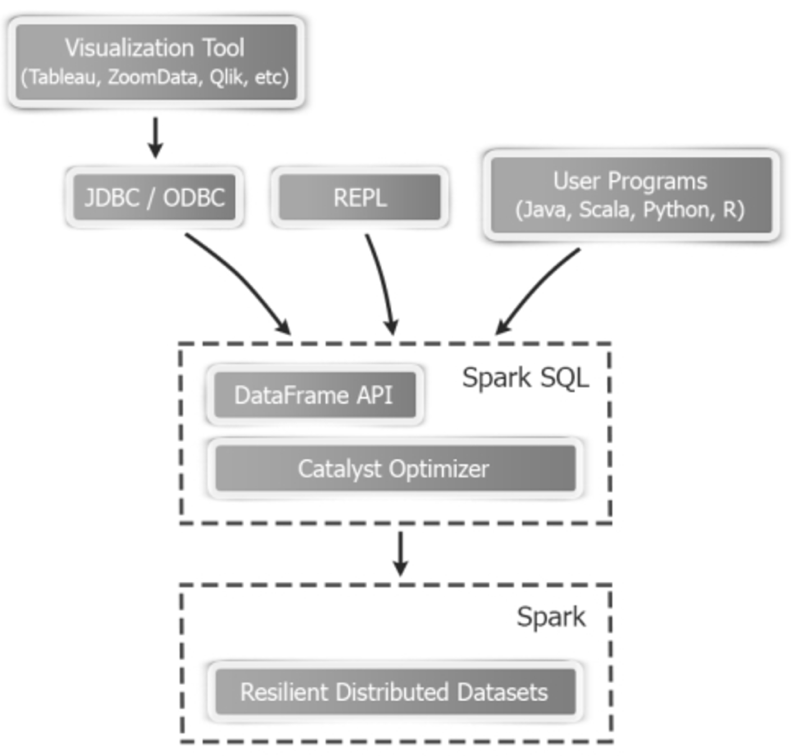

# 4.2 一个最小例子
需求：按城市统计近7天成交额。
1. 读取交易表为 DataFrame。
2. `filter` 最近7天数据。
3. `groupBy(city).agg(sum(amount))`。
4. 结果按金额降序输出。

如果你主要做报表分析，这套流程是高频路径。

> **版本基线（更新于 2026-02-13）**
> 本书默认适配 Apache Spark 4.1.1（稳定版），并兼容 4.0.2 维护分支。
> 推荐环境：JDK 17+（建议 JDK 21）、Scala 2.13、Python 3.10+。
结构化数据处理是 Spark 4.x 的主线能力之一。它解决的问题很明确：当数据已经具备列、类型和模式信息时，如何既保留分布式计算能力，又获得接近关系数据库的表达力、优化能力和工程可维护性。相比直接操作RDD，Spark SQL / DataFrame / Dataset 这条路线更适合报表统计、ETL、宽表加工、窗口分析以及大多数机器学习前置数据准备场景。

这一章的核心结论也很直接：在 Spark 4.x 新项目里，应优先使用 `SparkSession + DataFrame` 作为结构化处理入口；如果使用 Scala 或 Java，且确实需要类型安全与类型化转换，再选择 Dataset；只有在必须直接操作底层分区、依赖关系或自定义复杂算子时，才回退到 RDD。Spark SQL 同时支持批处理和流处理，流式场景由 Structured Streaming 提供，并与 Spark SQL 共享统一执行引擎。

可以把 Spark SQL 理解为 Spark 结构化能力的统一入口。它允许用户通过 SQL、DataFrame / Dataset API、JDBC/ODBC 服务等多种方式处理结构化数据，并能与 Hive Metastore 等元数据体系协同工作。真正重要的不是“它能跑 SQL”这件事本身，而是它把列、Schema 和表达式语义交给了优化器，使 Spark 有机会自动做解析、规则优化、物理计划选择和代码生成。

因此，图例 4‑1 的重点不是某一个接口，而是整条结构化处理链路：上层可以是 SQL、DataFrame 或外部查询入口，中间是 Catalyst 和 Tungsten 驱动的统一执行体系，底层则仍然是分布式计算与数据源访问能力。也正因为这条链路是统一的，DataFrame 往往会比手写 RDD 版本更容易获得稳定性能和更好的可维护性。

图例 4‑1 Spark SQL接口
