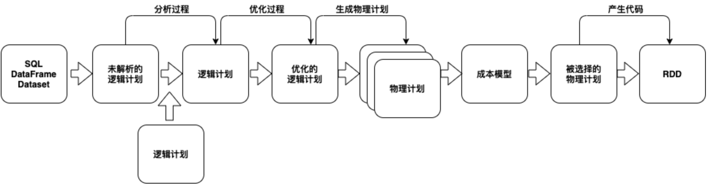
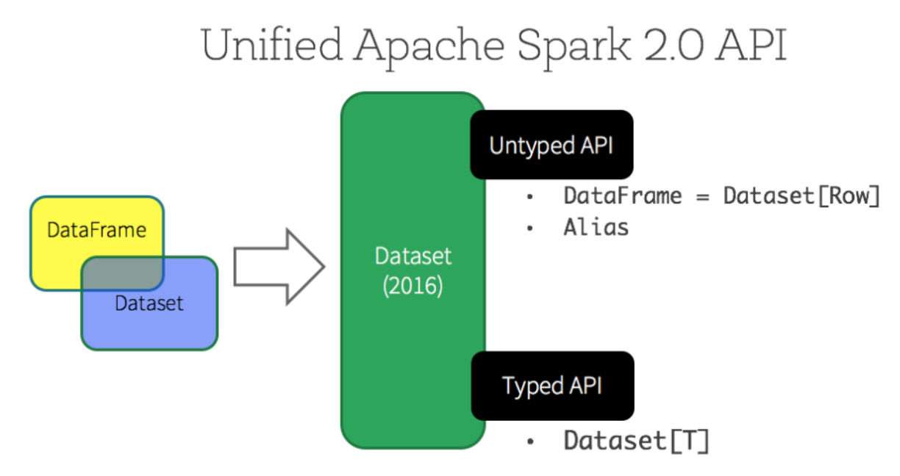
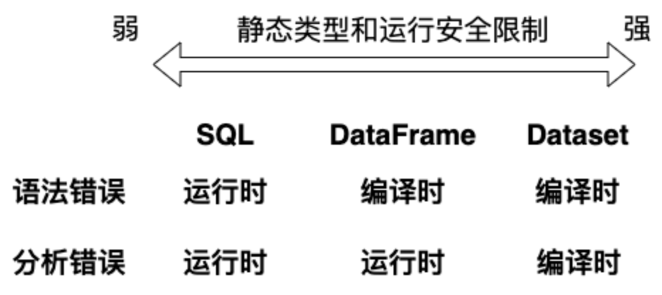

# 4.2 Spark SQL概述

Spark SQL 是 Spark 4.x 最核心的结构化数据处理模块。与基本的 RDD API 相比，它额外掌握了列名、数据类型、Schema 和表达式语义，因此优化器可以做投影裁剪、过滤下推、Join 策略选择、统计信息利用以及代码生成等优化。用户既可以写 SQL，也可以写 DataFrame / Dataset API；它们最终都会汇聚到同一套执行引擎上。

在工程实践里，可以把 Spark SQL 理解为“结构化数据入口层”。它既能读取 Hive 表、Parquet、ORC、JSON、CSV 和外部数据库，也能与 Catalog、元数据服务、湖仓表格式等平台能力协同工作，再把结果以 DataFrame 或 Dataset 形式继续向下传递到应用代码中。DataFrame 面向所有主流语言，是最通用、也是最推荐的主线抽象；Dataset 在 Scala / Java 中提供额外的类型安全能力，适合那些确实需要类型化映射和编译期检查的场景。

### 4.2.1 Catalyst优化器

Catalyst 是 Spark SQL 的查询优化框架。无论用户写的是 SQL、DataFrame 还是 Dataset API，Spark 最终都会先把这些操作表示成查询计划，再经历解析、分析、优化和物理规划等阶段。下图展示了从高级结构化 API 到最终执行代码的大致转换过程：



可以把这个过程概括为四步：先生成逻辑计划，再结合 Catalog 与 Schema 解析列和表，随后利用规则与统计信息优化计划，最后从多个候选物理计划中选择一个执行。对于使用者来说，真正需要记住的是：一旦把数据处理写成结构化表达式，Spark 就有机会自动做过滤下推、投影裁剪、常量折叠、广播 Join 选择以及代码生成等优化。

这也是为什么 DataFrame 往往比手写RDD流程更容易得到稳定性能。DataFrame / Dataset 暴露了列、类型和表达式语义，Catalyst 与 Tungsten 才能在这些信息上工作。调试时可以用 `explain()` 查看逻辑计划和物理计划，从而判断过滤是否被下推、Join 是否被广播、是否发生了额外的 Exchange 或 Shuffle。

### 4.2.2 DataFrame与Dataset

Spark 里常见的三种数据抽象分别是 RDD、DataFrame 和 Dataset。三者都建立在分布式执行模型之上，但面向的开发层级不同：RDD 更底层、更自由；DataFrame 更结构化、更适合优化；Dataset 则是在 DataFrame 之上增加类型信息的 Scala / Java 版本。对于大多数 Spark 4.x 应用，推荐顺序很清楚：默认优先 DataFrame，确有类型安全诉求时再选 Dataset，只有在结构化 API 难以表达需求时才回退到 RDD。

DataFrame可以看作“带Schema的分布式表”，它最接近关系型思维，也是 Spark SQL 的默认主线。它支持过滤、投影、聚合、窗口、Join 等常见操作，能够直接受益于 Catalyst 和 Tungsten 的优化，因此通常比手写RDD转换更简洁，也更容易获得稳定性能。Dataset则是在 DataFrame 基础上引入 Encoder 与类型化对象映射，适合 Scala / Java 程序中那些希望保留领域对象类型的场景。

从语言支持角度看，DataFrame在 Scala、Java、Python 和 R 中都可用；Dataset只在 Scala 和 Java 中可用。在 Scala API 中，DataFrame 本质上就是 `Dataset[Row]` 的类型别名；在 Java API 中，通常直接写成 `Dataset<Row>`。因此，讨论“DataFrame 与 Dataset”的时候，真正需要把握的不是二选一的历史争论，而是结构化主线和类型化扩展之间的边界。



图例 4‑2 Spark DataFrame和Dataset API

从 Spark 2.0 开始，DataFrame 和 Dataset 被纳入统一的结构化API体系。可以简单理解为：SQL 最灵活，适合快速表达关系逻辑；DataFrame 通用性最强，适合绝大多数工程代码；Dataset 类型约束最强，适合 Scala / Java 中需要编译期类型检查的场景。它们之间不是互斥关系，而是同一套执行模型上的不同表达方式。



### 4.2.3 创建结构化数据

SparkSession 是 Spark 结构化API的统一入口。读取文件、访问元数据、执行SQL、注册临时视图、创建DataFrame或Dataset，通常都从 `spark` 这个会话对象开始；如果启用了Hive支持，它也会统一承载相关能力。对 Spark 4.x 项目来说，最常见的写法就是先通过 `spark.read` 直接得到 DataFrame，再围绕列和表达式继续向下处理。

```scala
scala> val df = spark.read.json("/data/people.json")
df: org.apache.spark.sql.DataFrame = [age: bigint, name: string]
scala> df.show
+----+-------+
| age| name|
+----+-------+
|null|Michael|
| 30| Andy|
| 19| Justin|
+----+-------+
```

代码 4‑1
这个例子展示了最常见的工作流：先从数据源读取 DataFrame，再做选择、过滤、聚合与显示。对新项目来说，这条“数据源 -> DataFrame -> 结构化操作”的路径应当优先于“先读成RDD，再手动补Schema”的做法。

```scala
scala> df.printSchema()
root
|-- age: long (nullable = true)
|-- name: string (nullable = true)
scala> df.select("name").show()
+-------+
| name|
+-------+
|Michael|
| Andy|
| Justin|
+-------+
scala> df.select($"name", $"age" + 1).show()
+-------+---------+
| name|(age + 1)|
+-------+---------+
|Michael| null|
| Andy| 31|
| Justin| 20|
+-------+---------+
scala> df.filter($"age" > 21).show()
+---+----+
|age|name|
+---+----+
| 30|Andy|
+---+----+
scala> df.groupBy("age").count().show()
+----+-----+
| age|count|
+----+-----+
| 19| 1|
|null| 1|
| 30| 1|
+----+-----+
```

代码 4‑2
除了简单的列引用和表达式，DataFrame 还拥有丰富的内置函数库，包括字符串处理、日期算术、窗口分析和常用数学运算等。与此同时，`SparkSession.sql()` 也提供了另一条常见入口：当查询逻辑本身更适合用关系表达式描述时，可以直接写 SQL，再把结果继续接回 DataFrame 流程。

```scala
scala> df.createOrReplaceTempView("people")
scala> val sqlDF = spark.sql("SELECT * FROM people")
sqlDF: org.apache.spark.sql.DataFrame = [age: bigint, name: string]
scala> sqlDF.show()
+----+-------+
| age| name|
+----+-------+
|null|Michael|
| 30| Andy|
| 19| Justin|
+----+-------+
```

代码 4‑3
Spark SQL 中的本地临时视图是会话级对象：创建它的那个会话结束后，视图也会随之消失。如果需要在同一个 Spark 应用的多个会话之间共享临时结果，可以使用全局临时视图。全局临时视图统一挂在系统保留的 `global_temp` 数据库下，因此访问时必须显式带上库名前缀，例如 `SELECT * FROM global_temp.people`。

如果把上面这组操作放回真实工作流里，可以把它理解成一个最小的结构化分析案例：先从数据源读取 DataFrame，确认 Schema 是否符合预期，再把同一份数据同时暴露给 DataFrame API 和 SQL。两种写法的差异主要体现在“表达习惯”上，而不是执行引擎上。例如，下面这两个查询都在筛选年龄大于 21 岁的用户，并只保留 `name` 列：

```scala
scala> val adultsDF = df.filter($"age" > 21).select("name")
adultsDF: org.apache.spark.sql.DataFrame = [name: string]
scala> val adultsSQL = spark.sql("SELECT name FROM people WHERE age > 21")
adultsSQL: org.apache.spark.sql.DataFrame = [name: string]
```

工程里通常可以这样分工：如果逻辑要嵌入应用代码、复用中间列、组合多个函数，DataFrame API 往往更自然；如果逻辑本身就是报表口径、筛选规则或聚合条件，SQL 往往更直接。关键点不是“二选一”，而是知道它们都汇聚到同一套结构化执行链路上，因此可以根据团队习惯和可维护性自由切换。带着这个判断，再看下面的全局临时视图和跨会话访问就会更清楚：这些能力解决的是结构化数据如何在不同查询入口之间共享，而不是另起一套执行模型。

```scala
scala> df.createGlobalTempView("people")
scala> spark.sql("SELECT * FROM global_temp.people").show()
+----+-------+
| age| name|
+----+-------+
|null|Michael|
| 30| Andy|
| 19| Justin|
+----+-------+
scala> spark.newSession().sql("SELECT * FROM
global_temp.people").show()
+----+-------+
| age| name|
+----+-------+
|null|Michael|
| 30| Andy|
| 19| Justin|
+----+-------+
```

代码 4‑4
下面继续看Dataset的基本用法。这里需要再次强调：在 Spark 4.x 中，DataFrame 是结构化处理主线，而 Dataset 更适合作为 Scala / Java 中的类型化补充。Dataset 通过 Encoder 把领域对象映射到 Spark 的内部二进制表示，使 Spark 可以在保留类型信息的同时继续执行过滤、排序、聚合和序列化优化。下面的例子用 `toDS()` 创建一个Dataset：

```scala
scala> case class Person(name: String, age: Long)
defined class Person
scala> val caseClassDS = Seq(Person("Andy", 32)).toDS()
caseClassDS: org.apache.spark.sql.Dataset[Person] = [name: string,
age: bigint]
scala> caseClassDS.show()
+----+---+
|name|age|
+----+---+
|Andy| 32|
+----+---+
scala> val primitiveDS = Seq(1, 2, 3).toDS()
primitiveDS: org.apache.spark.sql.Dataset[Int] = [value: int]
scala> primitiveDS.map(_ + 1).collect()
res13: Array[Int] = Array(2, 3, 4)
```

同样也可以直接从 JSON 读取结果并转成类型化 Dataset：

```scala
scala> val peopleDS = spark.read.json("/data/people.json").as[Person]
peopleDS: org.apache.spark.sql.Dataset[Person] = [age: bigint, name:
string]
scala> peopleDS.show()
+----+-------+
| age| name|
+----+-------+
|null|Michael|
| 30| Andy|
| 19| Justin|
+----+-------+
scala> peopleDS.printSchema
root
|-- age: long (nullable = true)
|-- name: string (nullable = true)
```

代码 4‑5
上面的代码可以分成三步理解：

（1）Spark 先读取 JSON，推断 Schema，并创建 `Dataset[Row]`。

（2）这个 `Dataset[Row]` 也就是我们常说的 DataFrame，它适合承载通用的结构化处理逻辑。

（3）最后再借助案例类 `Person` 和 Encoder，把 DataFrame 转成强类型的 `Dataset[Person]`。

如果从使用体验上理解，`Dataset[T]` 可以看作“带类型的结构化数据集”：它既保留了DataFrame的结构化执行引擎，又让 Scala / Java 程序可以直接围绕领域对象类型进行编译期检查。这里的关键桥梁是 Encoder，它负责在 JVM 对象和 Spark 内部二进制表示之间做映射，使 Spark 既能保留类型信息，又不必放弃列式执行与序列化优化。要观察这种结构化表示最终长成什么样，可以直接查看 `schema()`：

```scala
scala> peopleDS.schema
res16: org.apache.spark.sql.types.StructType =
StructType(StructField(age,LongType,true),
StructField(name,StringType,true))
Spark
```

把现有 RDD 转成结构化对象，常见有两条路径：一种是在对象结构已知时，借助案例类和反射快速得到 Schema；另一种是在字段和类型需要运行时决定时，显式构造 `StructType` 与 `Row`。前者代码更紧凑，适合教学和固定结构数据；后者更灵活，适合动态 Schema 或遗留输入格式。需要强调的是，在新项目中这类“RDD -> DataFrame”的写法通常只是兼容路径；更自然的主线仍然是从数据源直接读成 DataFrame。

```scala
scala> :paste
// Entering paste mode (ctrl-D to finish)
val peopleDF = spark.sparkContext
.textFile("/data/people.txt")
.map(_.split(","))
.map(attributes => Person(attributes(0), attributes(1).trim.toInt))
.toDF()
// Exiting paste mode, now interpreting.
peopleDF: org.apache.spark.sql.DataFrame = [name: string, age: bigint]
scala> peopleDF.createOrReplaceTempView("people")
scala> val teenagersDF = spark.sql("SELECT name, age FROM people WHERE
age BETWEEN 13 AND 19")
teenagersDF: org.apache.spark.sql.DataFrame = [name: string, age:
bigint]
scala> teenagersDF.map(teenager => "Name: " + teenager(0)).show()
+------------+
| value|
+------------+
|Name: Justin|
+------------+
scala> teenagersDF.map(teenager => "Name: " +
teenager.getAs[String]("name")).show()
+------------+
| value|
+------------+
|Name: Justin|
+------------+
```

在 Scala REPL 中，如果示例代码跨越多行，可以先输入 `:paste` 再一次性粘贴完整代码块，结束时按 `[Ctrl][D]`。本书保留这些 REPL 片段，主要是为了帮助读者理解结构化 API 的最小使用方式；在真实工程里，这些逻辑通常会被放进常规的应用代码、测试代码或 Notebook 中。

当案例类无法提前定义时，例如字段结构来自配置、运行时元数据或遗留文本输入，就可以通过编程方式显式创建 DataFrame。常见步骤有三步：

（1）从原始RDD创建一个包含Row对象的RDD

（2）创建与Row对象结构相匹配的模式，由StructType表示

（3）通过SparkSession提供的createDataFrame()方法将模式应用于RDD。

```scala
scala> import org.apache.spark.sql.types._
import org.apache.spark.sql.types._
scala> import org.apache.spark.sql.Row
import org.apache.spark.sql.Row
scala> val peopleRDD = spark.sparkContext.textFile("/data/people.txt")
peopleRDD: org.apache.spark.rdd.RDD[String] = /data/people.txt
MapPartitionsRDD[92] at textFile at <console>:31
scala> val schemaString = "name age"
schemaString: String = name age
scala> :paste
// Entering paste mode (ctrl-D to finish)
// Generate the schema based on the string of schema
val fields = schemaString.split(" ")
.map(fieldName => StructField(fieldName, StringType, nullable = true))
val schema = StructType(fields)
// Convert records of the RDD (people) to Rows
val rowRDD = peopleRDD
.map(_.split(","))
.map(attributes => Row(attributes(0), attributes(1).trim))
// Exiting paste mode, now interpreting.
fields: Array[org.apache.spark.sql.types.StructField] =
Array(StructField(name,StringType,true),
StructField(age,StringType,true))
schema: org.apache.spark.sql.types.StructType =
StructType(StructField(name,StringType,true),
StructField(age,StringType,true))
rowRDD: org.apache.spark.rdd.RDD[org.apache.spark.sql.Row] =
MapPartitionsRDD[94] at map at <pastie>:45
scala> val peopleDF = spark.createDataFrame(rowRDD, schema)
peopleDF: org.apache.spark.sql.DataFrame = [name: string, age: string]
scala> peopleDF.createOrReplaceTempView("people")
scala> val results = spark.sql("SELECT name FROM people")
results: org.apache.spark.sql.DataFrame = [name: string]
scala> results.map(attributes => "Name: " + attributes(0)).show()
+-------------+
| value|
+-------------+
|Name: Michael|
| Name: Andy|
| Name: Justin|
+-------------+
```

代码 4‑6
再看一个更贴近真实工程的入口：直接把带表头的 CSV 文件读成 DataFrame。只要文件本身包含标题行，并显式打开 `header` 与 `inferSchema`，Spark 就能基于输入数据推断字段结构。这个例子也顺带展示了如何用 `schema` 和 `printSchema()` 快速验证推断结果。

```scala
scala> :paste
// Entering paste mode (ctrl-D to finish)
val statesDF = spark.read.option("header", "true")
.option("inferschema", "true")
.option("sep", ",")
.csv("/data/statesPopulation.csv")
// Exiting paste mode, now interpreting.
statesDF: org.apache.spark.sql.DataFrame = [State: string, Year: int
... 1 more field]
scala> statesDF.schema
res6: org.apache.spark.sql.types.StructType =
StructType(StructField(State,StringType,true),
StructField(Year,IntegerType,true),
StructField(Population,IntegerType,true))
scala> statesDF.printSchema
root
|-- State: string (nullable = true)
|-- Year: integer (nullable = true)
|-- Population: integer (nullable = true)
```

当自动推断不足以满足需求时，就需要显式定义 Schema。这里用 `StructType` 描述整体结构，用 `StructField` 描述每个字段；像 `IntegerType`、`StringType` 这类具体类型，也都来自 `org.apache.spark.sql.types` 包。

```scala
scala> import org.apache.spark.sql.types.{StructType,
IntegerType,StringType}
import org.apache.spark.sql.types.{StructType, IntegerType, StringType}
```

下面定义一个只包含两个字段的最小 Schema：第一个字段是整数，第二个字段是字符串。

```scala
scala> val schema = new StructType().add("i",
IntegerType).add("s",StringType)
schema: org.apache.spark.sql.types.StructType =
StructType(StructField(i,IntegerType,true),
StructField(s,StringType,true))
scala> schema.printTreeString
root
|-- i: integer (nullable = true)
|-- s: string (nullable = true)
```

如果想把 Schema 序列化成更易读的 JSON 结构，也可以直接调用 `prettyJson()`：

```scala
scala> schema.prettyJson
res9: String =
{
"type" : "struct",
"fields" : [ {
"name" : "i",
"type" : "integer",
"nullable" : true,
"metadata" : { }
}, {
"name" : "s",
"type" : "string",
"nullable" : true,
"metadata" : { }
} ]
}
```

Spark SQL 的内置数据类型都位于 `org.apache.spark.sql.types` 包中，通常可以这样统一导入：

```scala
scala> import org.apache.spark.sql.types._
import org.apache.spark.sql.types._
```

`DataType` 是 Spark SQL 内置类型体系的抽象基类。表格 4‑1 列出了结构化处理里最常见的一组类型；学习时真正需要优先掌握的，通常是数值型、字符串、时间类型以及 `ArrayType`、`MapType`、`StructType` 这三类复杂类型。

表格 4‑1 Spark SQL支持的数据类型

| 数据类型          | 描述                                                                                                                                   |
| ------------- | ------------------------------------------------------------------------------------------------------------------------------------ |
| ByteType      | 表示1字节有符号整数，数字范围从-128到127。                                                                                                            |
| ShortType     | 表示2字节有符号整数，数字范围为-32768至32767。                                                                                                        |
| IntegerType   | 表示4字节有符号整数，数字范围为-2147483648至2147483647。                                                                                              |
| LongType      | 表示8字节有符号整数，数字范围从-9223372036854775808到9223372036854775807。                                                                            |
| FloatType     | 表示4字节的单精度浮点数。                                                                                                                        |
| DoubleType    | 表示8字节的双精度浮点数。                                                                                                                        |
| DecimalType   | 表示任意精度有符号的十进制数。                                                                                                                      |
| StringType    | 表示字符串值。                                                                                                                              |
| BinaryType    | 表示字节序列值。                                                                                                                             |
| BooleanType   | 表示布尔值。                                                                                                                               |
| TimestampType | 表示包含字段年、月、日、小时、分钟和秒的值。                                                                                                               |
| DateType      | 表示包含字段年，月，日的值的值。                                                                                                                     |
| ArrayType     | ArrayType (elementType, containsNull)，表示包含elementType类型的元素序列的值，containsNull用于指示ArrayType值中的元素是否具有空值。                                 |
| MapType       | MapType(keyType, valueType, valueContainsNull)，表示包含一组键值对，键的数据类型由keyType描述，值的数据类型由valueType描述，键不允许具有空值，valueContainsNull用于指示值是否可以为空值。 |
| StructType    | 表示具有StructFields(fields)序列描述的结构。                                                                                                     |
| StructField   | 表示StructType中的一个字段。                                                                                                                  |

除了手工写 `StructType`，还可以借助 Encoder 从类型信息反推出 Schema。这种方式在 Dataset 场景里尤其常见。下面先导入 `Encoders`：

```scala
scala> import org.apache.spark.sql.Encoders
import org.apache.spark.sql.Encoders
```

先看一个简单的例子：直接为元组类型生成对应的 Schema。

```scala
scala> Encoders.product[(Integer, String)].schema.printTreeString
root
|-- _1: integer (nullable = true)
|-- _2: string (nullable = true)
```

如果直接面对元组类型不够直观，也可以先定义一个案例类 `Record`，再由 Encoder 自动推出 Schema。

```scala
scala> case class Record(i: Integer, s: String)
defined class Record
```

有了案例类之后，就可以基于 Encoder 自动得到对应的结构化模式：

```scala
scala> Encoders.product[Record].schema.printTreeString
root
|-- i: integer (nullable = true)
|-- s: string (nullable = true)
```
