# 数据流的操作

## Spark 4.x 流处理建议

本章保留了基于 DStream 的讲解以帮助理解微批模型，但在 Spark 4.x 实际项目中应优先使用 Structured Streaming（`readStream`/`writeStream`）。

如果你是新项目：

（1）优先使用 DataFrame/Dataset + Structured Streaming。

（2）优先使用事件时间、水位线和状态管理 API。

（3）将 Kafka 作为主流输入源，并使用 checkpoint 目录保证恢复能力。
> **版本基线（更新于 2026-02-13）**
> 本书默认适配 Apache Spark 4.1.1（稳定版），并兼容 4.0.2 维护分支。
> 推荐环境：JDK 17+（建议 JDK 21）、Scala 2.13、Python 3.10+。
在当今互连的设备和服务的世界中，我们一天也要花费数小时来检查各种社交媒体上的最新消息，电商平台上的产品优惠信息，或者查看最新新闻或体育更新，这几乎是很难的
最喜欢的队。无论是要完成手头的工作，还是浏览信息或发送电子邮件，我们都依赖于智能设备和互联网。目前来说，应用程序和服务的数量和种类只会随着时间的推移而增长，这种现象成为了一种趋势。结果智能终端设备无处不在，并且一直在生成大量数据，这种现象也被广泛称为物联网，它不断地改变了数据处理的动力。每当我们以某种形式使用智能手机上的任何服务或应用程序时，实时数据处理就会起作用。而且这种实时数据处理能力在很大程度上取决于应用程序的质量和价值，因此很多互联网公司将重点放在如何应对数据的实用性和及时性等方面的复杂挑战。

互联网服务提供商正在研究和采用了一种非常前沿的平台或基础架构，在此基础上构建可扩展性强，接近实时或实时的处理框架。一切都必须是快速的，并且必须对变化和异常做出反应，至关重要的是数据流的处理和使用都必须尽可能接近实时。这些平台或系统每天会生处理大量数据，而且是不确定的连续事件流。

与任何其他数据处理系统一样，我们在数据收集、存储和数据处理方面也面临着相同的基本挑战，但是由于平台的实时需求，因此增加了复杂性。为了收集此类不确定事件流，随后处理所有此类事件以生成可以利用的数据价值，我们需要使用高度可扩展的专业架构来处理大量事件，因此数十年来已经构建了许多系统用来处理实时的连续数据流，包括AMQ、RabbitMQ、Storm、Kafka、Spark、Flink、Gearpump、Apex。

构建用于处理大量流数据的现代系统具有非常灵活和可扩展的技术，这些技术不仅非常高效，而且比以前更好地帮助实现了业务目标。使用这样的技术，可以从各种数据源中获取处理数据，然后根据需要在各种情景中使用。现在，为了了解这种实时流传输体系结构如何工作以提供有价值的信息，我们需要了解数据流传输体系结构的基本原则。
一方面对于实时流体系结构而言，能够以非常高的速率处理大量数据非常重要，而另一方面还应确保合理地确保所摄取的数据也得到处理。

另外，流式处理是用于从无限制数据中提取信息的技术。鉴于我们的信息系统是基于有限资源（例如内存和存储容量）的硬件构建的，因此它们可能无法容纳无限制的数据集。取而代之的是，我们观察到的数据形式是在处理系统中接收到的，随时间流逝的事件，我们称其为数据流。相反，我们将有界数据视为已知大小的数据集，可以计算有界数据集中的元素数量。我们如何处理两种类型的数据集？对于批处理，我们指的是有限数据集的计算分析。实际上，这意味着可以从某种形式的存储中整体上获得和检索这些数据集，我们在计算过程开始时知道数据集的大小，并且处理过程的持续时间受到限制。相反在流处理中，我们关注数据到达系统时的处理。考虑到数据流的无限性，只要流中一直传递新数据流式处理就需要持续运行，从理论上讲这可能是永远的。

总体来说，流式处理系统应用编程和操作技术，以利用有限数量的计算资源来处理潜在的无限数据流成为可能。

## 处理范例

现在，为了了解这种实时流传输体系结构如何工作以提供有价值的信息，我们需要了解流传输体系结构的基本原则。一方面，对于实时流体系结构而言，能够以非常高的速率处理大量数据非常重要，而另一方面还应合理地确保所摄取的数据也得到处理。图例
4‑1显示了一个通用的流处理系统，其中生产者将事件放入消息传递系统中，同时消费着从消息传递系统中读取消息：


图例 4‑1 流处理系统

实时流数据的处理可以分为以下三个基本范例：

（1）至少一次

（2）最多一次

（3）恰好一次

让我们看一下这三个流处理范例对我们的业务用例意味着什么。虽然对实时事件的恰好处理一次对我们来说是最终的目标，但要始终在不同的情况下实现此目标非常困难，如果实施的复杂性超过了这种保证的益处，我们必须妥协选择其他基本范例。

### 至少一次

至少一次范例涉及一种机制，当实际处理完了事件并且获得了结果之后，才保存刚才接收了最后一个事件的位置，这样如果发生故障并且事件消费者重新启动，消费者将重新读取旧事件并进行处理他们。但是，由于不能保证所接收的事件被全部或部分地处理，因此如果事件再次被提取，则可能导致事件重复。这导致事件至少被处理一次的行为。理论上，至少一次范例适用的应用程序涉及更新某些瞬时行情的自动收录器，或以显示当前值的仪表。任何累积总和，计数器或对准确性有依赖的聚合计算（例如求和、分组等）都不适合这种处理范例，因为重复事件将导致不正确的结果。消费者的操作顺序如下：（1）保存结果，（2）保存偏移量。图例
4‑2显示了如果发生故障并且消费者重新启动时将发生的情况。由于事件已被处理但尚未保存偏移量，因此消费者将读取先前保存的偏移量，从而导致重复。图中事件0被处理两次。

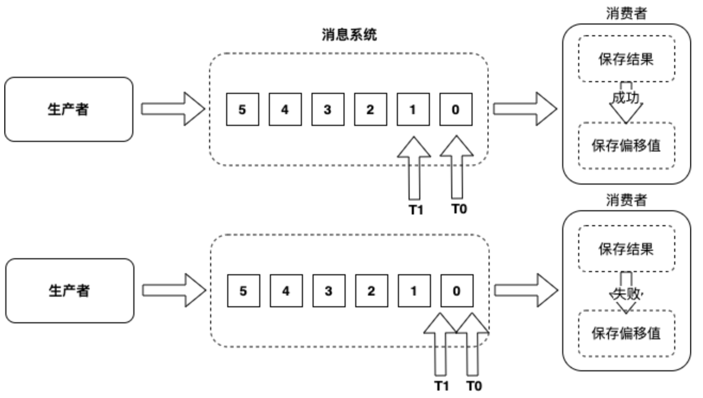

图例 4‑2 至少一次

### 最多一次

最多一次范例涉及一种机制，该机制在实际处理事件并将结果保留下来之前，先保存接收到的最后一个事件的位置，这样如果发生故障并且消费者重新启动，消费者将不会尝试再次读取旧的事件。但是由于不能保证已接收到的事件都已全部处理，而且它们再也不会被提取，因此可能导致事件丢失，所以导致事件最多处理一次或根本不处理的行为。

理想情况下，最多一次适用的任何应用程序涉及更新即时行情自动收录器或仪表以显示当前值，以及任何累积的总和，计数器或其他汇总的应用程序，要求的条件是精度不是强制性的，或者应用程序不是绝对需要所有事件。任何丢失的事件都将导致错误的结果或结果丢失。消费者的操作顺序如下：（1）保存偏移量，（2）保存结果。图例
4‑3显示了如果发生故障并且消费者重新启动后会发生的情况。由于存在尚未处理事件但保存了偏移量，因此消费者将从已保存的偏移量中读取数据，从而导致消耗的事件出现间隔，图中出现了从未处理事件0：

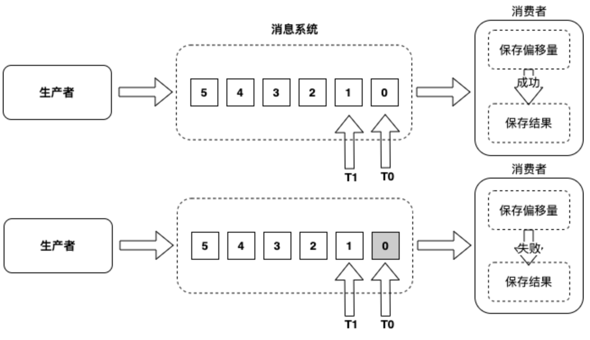

图例 4‑3 最多一次

### 恰好一次

恰好一次范例与至少一次使用范例相似，并且涉及一种机制，该机制仅在事件已被实际处理并且结果被持久化之后，保存最后接收到的事件位置，以便在发生故障时并且消费者重新启动后，消费者将再次读取旧事件并进行处理。但是，由于不能保证所接收的事件被全部或部分地处理，因此再次提取事件时可能会导致事件重复。但是，与至少一次范例不同，重复事件不会被处理并被丢弃，从而导致恰好处理一次的范例。恰好一次处理范例适用于涉及精确计数器，聚合或通常只需要每个事件仅处理一次且肯定要处理一次（无损失）的任何应用程序。消费者的操作顺序如下：（1）保存结果，（2）保存偏移量。显示了如果发生故障并且消费者重新启动会发生的情况。由于事件已被处理，但偏移量尚未保存，因此消费者将从先前保存的偏移量中读取数据，从而导致重复，在图中事件0仅处理一次，因为消费者删除了重复的事件0：

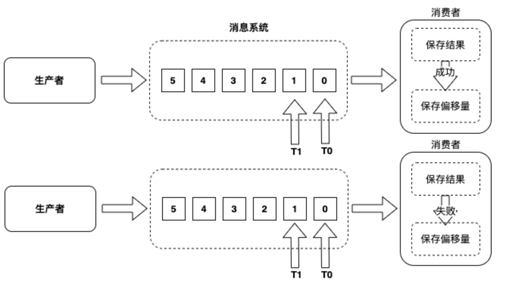

图例 4‑4 恰好一次

恰好一次范例如何删除重复项？这里有两种技术可以起作用：幂等更新和事务更新。幂等更新涉及基于生成的某些唯一ID保存结果，因此如果存在重复，则生成的唯一ID
已经存在于结果中（例如数据库），以便消费者可以删除副本而无需更新结果。因为并非总是可能而且方便地生成唯一ID，所以这很复杂，而且这还需要在消费者上进行额外的处理。另一点是数据库可以针对结果和偏移量进行分离。事务更新将结果保存在具有事务开始和事务提交阶段的批处理中，以便在发生提交时我们知道事件已成功处理，因此当收到重复事件时，可以删除它们而不更新结果。这种技术比幂等更新要复杂得多，因为现在我们需要一些事务性数据存储。另一点是数据库针对结果和偏移量必须一致。

从 Spark 3.x 开始，Structured Streaming 成为流处理主线；在 Spark 4.x 中建议优先使用 Structured Streaming。

## 理解时间

我们可能遇到两种形式的数据：一是静止的，以文件的形式，数据库的内容或者各种记录的形式；二是运动的，作为连续生成的信号序列，例如传感器的测量或来自移动车辆的GPS信号。

我们已经讨论过，流式处理程序是一个假定其输入数据大小可能无限的程序，更具体地说，流式处理程序假定其输入数据是随时间推移观察到的不确定长度的信号序列。从时间轴的角度来看，静止数据是过去的数据，可以说是有界数据集。无论是存储在文件中还是包含在数据库中，最初都是随着时间推移收集到某个存储中的数据流，例如用户数据库中的上一季度的所有订单，城市出租车行驶的GPS坐标等，都是从单个事件开始的被收集到存储库中。

但是，更具挑战性的是试图研究运动的数据。在最初生成数据的时刻与数据被处理的时刻之间存在时间差，该时间增量可能很短，例如在同一数据中心内生成和处理的Web日志事件；该时间增量也可能更长，例如汽车通过隧道时的GPS数据，只有当车辆离开隧道后重新建立无线连接时，GPS数据才会被调度。我们可以看到，其中包含一个事件发生的时间轴，还包含另一个事件经过流式处理系统时间轴。这些时间表非常重要，我们为它们指定了特定的名称：

  - 事件时间

创建事件的时间，时间信息由生成事件设备的本地时钟提供。

  - 处理时间

流式系统处理事件的时间，这是服务器运行处理逻辑的时钟，通常与技术原因相关，例如计算处理延迟，或作为标准确定重复输出。

当我们需要相互关联，排序或聚合事件时，这些时间线之间的区别变得非常重要。数据流中的元素始终具有处理时间，因为流处理系统观察到来自数据源新事件然后进行处理，处理运行时可以记录一个时间，这个时间并且完全独立于流元素的内容。但是对于大多数数据流，我们另外提到事件时间的概念，即数据流事件实际发生的时间。如果流处理系统具有检测和记录事件的能力，通常将此事件时间作为流中消息有效负载的一部分。在事件中定义时间戳就是在消息生成时添加一个时间寄存器，该时间将成为数据流的一部分，例如某些不起眼的嵌入式设备（一般都有时钟系统）以及金融交易系统中的日志中都存在定义时间戳的做法，这就可以作为事件时间。

时间戳的重要性在于可以考虑使用数据生成的时间来分析，例如晨跑时使用可穿戴设备，回到家时将设备中的数据同步到手机，查看一下刚才穿过公园时的心率和速度等详细信息，在将数据上传到某些云服务器时，这些数据是具有时间戳的。时间戳为数据提供了时间的上下文，根据事件发生时记录的时间戳进行分析才更有意义。因此，基于时间戳的日志构成了当今正在分析数据流的很大一部分，因此这些时间戳有助于弄清楚特定时间在给定系统上发生了什么。当将数据从创建数据的各种系统或设备传输到处理该数据的群集，通常会出现令人难以捉摸的情况，这是因为跨系统之间的传输操作易于发生不同形式的故障，例如延迟、重新排序或丢失。通常，用户希望框架具有容错机制为这种可能发生的故障提供技术解决，而且不牺牲系统的响应能力。为了实现这种愿景，基于事件时间的流处理系统需要解决两个原则问题：其一是可以清楚标记正确和重新排序的结果，另外时可以产生中间预期结果。这两个原则构成了事件时间处理的基础。在Spark中，此功能仅由结构化流提供，离散流缺乏对事件时间处理的内置支持。

## 离散化流

> 兼容性说明：本节基于 DStream（Spark Streaming）讲解微批原理与历史 API，适用于维护存量系统；新项目建议直接使用 Structured Streaming。

Spark
Streaming是Spark核心的扩展组件之一，可扩展地实现实时数据流的高吞吐量、容错处理。数据可以从诸如Kafka、Flume、Kinesis或TCP套接字的许多来源中获取，并且可以使用由高级功能表达的复杂算法进行处理。处理后的数据可以推送到文件系统、数据库和实时仪表板，也可以将Spark的[机器学习](https://translate.googleusercontent.com/translate_c?act=url&depth=1&hl=en&ie=UTF8&prev=_t&rurl=translate.google.com&sl=en&sp=nmt4&tl=zh-CN&u=http://spark.apache.org/docs/latest/ml-guide.html&usg=ALkJrhh_KZdVK7_hO8ZigAts2yULDkjc9g)和图处理算法应用于数据流。

Spark Streaming总体架构通常由以下组件构成（图例
4‑5）。首先是要处理的数据必须来自某个外部动态数据源，例如传感器、移动应用程序、Web客户端、服务器日志等等，这个数据通过消息机制传送给数据采集系统，如Kafka、Flume等，递送或沉积在文件系统中。

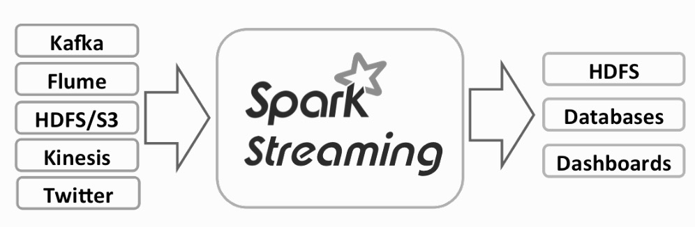

图例 4‑5 Spark数据流总体框架

然后是流处理过程，获得的数据由Spark
Streaming系统进行处理，接下来是基于NoSql的数据存储，如HBase等用于存储处理的数据，该系统必须能够实现低延迟地、快速地读写操作，最后是通过终端应用程序显示或分析，终端应用程序可以包括仪表板、商业智能工具和其他使用已处理的流数据进行分析的应用程序，输出的数据也可以存储在数据库中，以便稍后进一步处理。

Spark Streaming的内部工作原理如下（图例
4‑6）。Spark数据流接收实时输入数据流并将数据分成批，然后由Spark引擎进行处理，以批量生成最终的结果流。

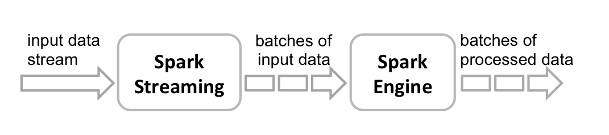

图例 4‑6 Spark Streaming工作原理

Spark Streaming提供称为离散化数据流（Discretized
Stream，DStream）的高级抽象，可以简称离散流，它代表连续产生的数据流。可以从诸如Kafka、Flume和Kinesis等来源的输入数据流中创建离散流，或者通过对其他离散流应用高级操作来创建。在内部，离散流可以表示为一个批次接着一个批次以RDD为底层结构的数据流。

数据流本身是连续的，但是为了处理数据流需要批量化。Spark
Streaming将数据流分割成x毫秒的批次，这些批次总称离散流。离散流是这种批次的一组序列，其中序列中的每个小批量表示为RDD，数据流被分解成时间间隔相同的RDD段。按照Spark批处理的间隔，在离散流中的每个RDD包含了由Spark
Streaming应用程序接收的记录。

有两种类型的离散流操作：转换和输出。在Spark应用程序中，在离散流上应用转换操作，例如map()、reduce()和join()等，处理其中的每个RDD，在这个过程中创造新的RDD，施加在离散流上的任何转换会应用到上一级离散流，然后依次施加转换到每个RDD上。输出是类似于RDD操作的动作，因为它们将数据写到外部系统。在Spark数据流中，它们在每个时间步长周期性运行，批量生成输出。

### 一个例子

在详细介绍Spark数据流程序之前，来看一个简单的Spark数据流程序，这个程序通过Spark
Streaming的TCP套接字接口侦听NetCat发生的数据，统计接收到的文本数据中的字数，这个代码的主程序为：

import org.apache.spark.SparkConf

import org.apache.spark.streaming.{Seconds, StreamingContext}

object NetworkWordCount {

def main(args: Array\[String\]) {

if (args.length \< 2) {

System.err.println("Usage: NetworkWordCount \<hostname\> \<port\>")

System.exit(1)

}

val sparkConf = new
SparkConf().setAppName("NetworkWordCount").setMaster("local\[2\]")

val ssc = new StreamingContext(sparkConf, Seconds(10))

val lines = ssc.socketTextStream(args(0), args(1).toInt)

val words = lines.flatMap(\_.split(" "))

val wordCounts = words.map(x =\> (x, 1)).reduceByKey(\_ + \_)

wordCounts.print()

ssc.start()

ssc.awaitTermination()

}

}

代码 4‑1

这个代码是一个简单的Spark应用程序，首先导入与Spark数据流相关的类，主要是SparkConf和StreamingContext。SparkConf用来设置启动Spark应用程序的参数，创建的应用的名称为NetworkWordCount，并带有两个执行线程（local\[2\]）的本地StreamingContext，批处理时间间隔为10秒。StreamingContext是所有完成Spark
Streaming功能的主要入口点，使用ssc.socketTextStream可以创建一个离散流，代表一个来自TCP套接字源的流数据，通过参数传入，args(0)指定为主机名（例如localhost
）和args(1)指定为端口（例如9999
）。lines为离散流对象，表示将从NetCat数据服务器接收的数据流，此离散流中的每条记录都是一行文本。接下来，\_.split("
")将包含空格字符的行分割成单词，flatMap()将包含多个单词的集合扁平化拆分成包含独立单词的离散流，通过从源离散流中的每条输入记录生成多个新记录来创建新的输出离散流。在这种情况下，每一行将被分割成多个单词并且创建words离散流。接下来，通过在words离散流上应用聚合操作统计这些单词的数量。首先，通过map()操作将words一对一转换成包含键值对(word,
1)的离散流，然后通过reduceByKey()以获得每批数据中的单词统计离散流wordCounts。最后，wordCounts.print()将打印每秒输入的单词计数。请注意，当描述完这些操作过程后，这个单词计数的数据流应用程序仅定义了需要执行的计算过程，但是尚未开始实际处理。在所有转换操作设置完成后如果要开始处理，最终需要调用ssc.start。

在虚拟实验环境中已经编译和打包了上面的应用程序，我们需要通过spark-submit启动这个应用程序包。首先需要运行Netcat作为数据服务器，使用Docker
exec 命令进入到容器中打开一个终端界面：

root@48feaa001420:\~\# { while :; do echo "Hello Apache Spark"; sleep
0.05; done; } | netcat -l -p 9999

代码 4‑2

使用Docker exec 命令进入到容器中打开另一终端界面，运行Spark应用程序：

root@48feaa001420:\~\# spark-submit --class NetworkWordCount
/data/application/simple-streaming/target/scala-2.13/simple-streaming\_2.13-0.1.jar
localhost 9999

20/03/26 08:28:39 WARN NativeCodeLoader: Unable to load native-hadoop
library for your platform... using builtin-java classes where applicable

\-------------------------------------------

Time: 1585211330000 ms

\-------------------------------------------

(Hello,1028)

(Apache,1028)

(Spark,1028)

\-------------------------------------------

Time: 1585211340000 ms

\-------------------------------------------

(Hello,188)

(Apache,188)

(Spark,188)

代码 4‑3

就这样，第一个终端窗口负责发送数据（代码 4‑2），第二个终端窗口负责接收处理数据（代码 4‑3）。

### 迁移对照：DStream 到 Structured Streaming

为了便于从存量DStream迁移到Spark 4.x主线API，下面给出与“词频统计”对应的Structured Streaming写法。该示例使用Kafka作为输入源，并显式设置watermark与checkpoint目录。

```scala
import org.apache.spark.sql.SparkSession
import org.apache.spark.sql.functions._

val spark = SparkSession.builder()
  .appName("StructuredWordCountKafka")
  .getOrCreate()

import spark.implicits._

val lines = spark.readStream
  .format("kafka")
  .option("kafka.bootstrap.servers", "localhost:9092")
  .option("subscribe", "words")
  .option("startingOffsets", "latest")
  .load()
  .selectExpr("CAST(value AS STRING) as line", "timestamp")

val words = lines
  .select(
    col("timestamp"),
    explode(split(col("line"), "\\\\s+")).as("word")
  )
  .filter(length(col("word")) > 0)

// 使用事件时间窗口 + watermark，避免状态无限增长
val counts = words
  .withWatermark("timestamp", "10 minutes")
  .groupBy(
    window(col("timestamp"), "1 minute", "30 seconds"),
    col("word")
  )
  .count()

val query = counts.writeStream
  .outputMode("append")
  .format("console")
  .option("truncate", "false")
  .option("checkpointLocation", "/tmp/spark-checkpoints/structured-wordcount")
  .start()

query.awaitTermination()
```

对应关系可总结为：

（1）`StreamingContext + DStream` -> `SparkSession + DataFrame/Dataset`

（2）`reduceByKeyAndWindow` 等窗口聚合 -> `groupBy(window(...))`

（3）`ssc.checkpoint(...)` -> `writeStream.option("checkpointLocation", ...)`

（4）微批时间间隔 -> `trigger(...)`（按需设置）

### StreamingContext

StreamingContext是流传输的主要入口点，本质上负责流传输应用程序，包括检查点，转换和对RDD的DStreams的操作。StreamingContext是所有数据流功能切入点，提供了访问方法可以创建来自各种输入源的离散流。StreamingContext可以从现有SparkContext
或 SparkConf 创建，其指定了Master URL和应用程序名称等其他配置信息：

  - new StreamingContext(conf: SparkConf, batchDuration: Duration)

通过提供新的SparkContext所需的配置来创建StreamingContext。

  - new StreamingContext(sparkContext: SparkContext, batchDuration:
    Duration)

使用现有的SparkContext创建一个StreamingContext。

上面StreamingContext两个构造这里的第二个参数是batchDuration，这是数据流被分批的时间间隔。无论使用Spark交互界面或创建一个独立的应用程序，需要创建一个新的StreamingContext。要初始化Spark数据流程序，必须创建一个StreamingContext对象，它是所有Spark数据流功能的主要入口点。可以通过两种方式创建新的StreamingContext：

（1）如果是在Spark应用程序中，StreamingContext对象可以从SparkConf对象创建。

import org.apache.spark.\_

import org.apache.spark.streaming.\_

val conf = new SparkConf().setAppName(appName).setMaster(master)

val ssc = new StreamingContext(conf, Seconds(1))

代码 4‑4

appName参数是应用程序在集群监控界面上显示的名称。master可以是Spark、Kubernetes或YARN集群URL，或者以本地模式运行的特殊字符串local
\[\*\]。实际上，当在集群上运行时，不需要在应用程序中硬编码master，而是使用spark-submit启动应用程序并设置master参数。但是，对于本地测试和单元测试，可以通过local\[\*\]来运行Spark
Streaming（检测本地系统中的核心数）。请注意，这在内部创建一个SparkContext（所有Spark功能的起始点），可以通过ssc.sparkContext进行访问。批处理间隔必须根据应用程序的延迟要求和可用的集群资源进行设置。

（2）如果通过spark-shell打开交互界面，StreamingContext对象也可以从现有的SparkContext对象创建。

scala\> import org.apache.spark.streaming.\_

import org.apache.spark.streaming.\_

scala\> val ssc = new StreamingContext(sc, Seconds(10))

ssc: org.apache.spark.streaming.StreamingContext =
org.apache.spark.streaming.StreamingContext@3c4231e5

代码 4‑5

定义好StreamingContext后，必须执行以下操作：

（1）通过创建输入离散流来定义输入源。

（2）通过将转换和输出操作应用于DStream来定义流式计算。

（3）使用StreamingContext.start开始接收数据。

（4）使用StreamingContext.awaitTermination等待处理停止（手动或由于任何错误）。

（5）可以使用StreamingContext.stop手动停止处理。

注意，一旦StreamingContext对象已经开始启动，就不能建立或添加新的数据流操作，只能按照定义好的操作运行；一旦当前的StreamingContext对象被停止，就无法重新启动这个StreamingContext对象；只有一个StreamingContext对象可以同时在JVM中处于活动状态；StreamingContext对象上的stop()方法也会停止SparkContext对象；如果仅停止StreamingContext对象，可以将stop()方法的可选参数stopSparkContext设置为false；只要先前的StreamingContext对象在创建下一个之前停止，而且不停止SparkContext对象，就可以使用这个SparkContext对象重复创建StreamingContext对象。

  - stop(stopSparkContext: Boolean = ...): Unit

这个方法立即停止StreamingContext()的执行，不等待所有接收的数据被处理。默认情况下，如果没有指定stopSparkContext参数，SparkContext对象将被停止，也可以使用SparkConf对象配置spark.streaming.stopSparkContextByDefault参数来配置此隐式行为。

### 输入流

可以使用StreamingContext创建多种类型的输入流，例如receiverStream和fileStream。在代码
4‑1中，lines是一个输入离散流，通过socketTextStream从NetCat服务器接收的数据流。每个输入流与接收器（Receiver）对象相关联，该对象接收数据并将其存储在内存中进行处理。

  - abstract class Receiver\[T\] extends Serializable

这是接收外部数据的抽象类，接收器可以在Spark集群的工作节点上运行，可以通过定义方法onStart()和onStop()来定义自定义接收器，onStart()定义开始接收数据所需的设置步骤，onStop()定义停止接收数据所需的清除步骤，接收到异常时可以通过restart()重新启动接收机或通过stop()全停止来处理。

Spark
Streaming具有两类输入源，第一类是StreamingContext中直接提供的输入源，例如textFileStream和socketTextStream等，第二类是通过额外的接口获得Kafka、Flume、Kinesis等输入流。如果要在Spark
Streaming应用程序中并行接收多个输入源，这将创建多个接收器同时接收多个数据流，但是接收器占据分配给Spark
Streaming应用程序的一个CPU核心，所以重要的是要记住，Spark
Streaming应用程序需要至少分配两个CPU内核，其中一个内核运行接收器，余下的内核用来处理接收到的数据。当本地运行Spark
Streaming应用程序时，请勿使用“local”或“local \[1\]”设置master
参数，因为这意味着只有一个线程用于在本地运行任务，这个线程将用于运行接收器，不会留出线程来处理接收到的数据。因此，当通过本地模式运行Spark
Streaming应用程序时，始终使用local\[n\]设置master参数，其中n
要大于需要运行接收器的数量。如果将此规则扩展到在Spark集群上，分配给Spark
Streaming应用程序的内核数量必须大于接收器数量，否则系统将收到数据，但无法处理。

另外，基于接收信息的可靠性也可以用来区分数据接收器。当数据被接收并且复制存储在Spark中时，接收器正确地向可靠的数据源发送确认，可靠的数据源，如Kafka和Flume，实现了传输数据的确认机制，接收器可以确认接收的数据，可以确保在产生故障时不会丢失任何数据。如果接收器不向数据源发送确认信息，可以使用不支持发送确认的数据源，也可以使用可靠的数据源但是不需要进行复杂的确认。

下面我们介绍几种接收器。SocketTextStream已经在代码 4‑1中使用了，通过TCP套接字接口接收文本数据，创建一个离散流。

  - socketTextStream(hostname: String, port: Int, storageLevel:
    StorageLevel = StorageLevel.MEMORY\_AND\_DISK\_SER\_2):
    ReceiverInputDStream\[String\]

从hostname:port地址接收数据创建输入流，使用TCP套接字接收数据，使用UTF8编码接收文本，换行作为分隔。

  - > hostname：要连接的用于接收数据的主机名

  - > port：要连接的用于接收数据的端口

  - > storageLevel：接收对象的存储级别（默认值为StorageLevel.MEMORY\_AND\_DISK\_SER\_2）

除了套接字之外，StreamingContext提供了从文件创建离散流作为输入源的方法，即从与Hadoop兼容的任何文件系统上读取文件数据。

  - def fileStream\[K: ClassTag, V: ClassTag, F \<: NewInputFormat\[K,
    V\]:ClassTag\] (directory: String): InputDStream\[(K, V)\]

创建一个输入流，该输入流监视文件系统中的新文件，并使用给定的键值类型和输入格式读取它们。必须通过将文件从同一文件系统中的一个位置移动到受监控目录中，以点“.”开头的隐含文件名将被忽略。

  - textFileStream(directory: String): DStream\[String\]

创建一个输入流，该流监视与Hadoop兼容的文件系统中的新文件，并将其读取为文本文件（使用键作为LongWritable，将值作为Text，将输入格式作为TextInputFormat）。
必须通过将文件从同一文件系统中的另一个位置移动到受监控目录中。 文件名以开头。
被忽略：创建一个输入流，该输入流监视文件系统中的新文件，并将其作为文本文件读取，键的数据类型为LongWritable，值的数据类型为Text，输入格式为TextInputFormat。必须通过将文件从同一文件系统中的一个位置移动到受监控目录中，以点“.”开头的隐含文件名将被忽略。在虚拟环境的终端界面启动spark-shell，使用textFileStream创建输入流：

scala\> import org.apache.spark.streaming.\_

import org.apache.spark.streaming.\_

scala\> val ssc = new StreamingContext(sc, Seconds(10))

ssc: org.apache.spark.streaming.StreamingContext =
org.apache.spark.streaming.StreamingContext@54a5eff

scala\> val lines = ssc.textFileStream("/data/input")

lines: org.apache.spark.streaming.dstream.DStream\[String\] =
org.apache.spark.streaming.dstream.MappedDStream@3a70acd5

scala\> val words = lines.flatMap(\_.split(" "))

words: org.apache.spark.streaming.dstream.DStream\[String\] =
org.apache.spark.streaming.dstream.FlatMappedDStream@c4fc610

scala\> val wordCounts = words.map(x =\> (x, 1)).reduceByKey(\_ + \_)

wordCounts: org.apache.spark.streaming.dstream.DStream\[(String, Int)\]
= org.apache.spark.streaming.dstream.ShuffledDStream@3a5922ec

scala\> wordCounts.print()

scala\> ssc.start()

scala\> ssc.awaitTermination()

\-------------------------------------------

Time: 1585054770000 ms

\-------------------------------------------

代码 4‑6

此时，应该看到终端界面中每10秒刷新一次。现在打开另一个终端界面，将文本文件添加到/data/input目录中：

cp /usr/local/spark/README.md /root/data/input/1.txt

一旦将文件添加到目录中，应该可以在执行程序的终端中看到刚添加文件的单词统计输出：

\-------------------------------------------

Time: 1585054780000 ms

\-------------------------------------------

(stream,1)

(review,1)

(its,1)

(\[run,1)

(can,6)

(guidance,2)

(have,1)

(locally,2)

(sc.parallelize(1,1)

(,72)

...

要停止流式传输，在运行程序的终端中使用Ctrl+C。还可以使用QueueStream创建基于RDD队列的离散流，推送到队列中的每个RDD将被视为离散流中的一批数据，并像流一样处理。

  - def queueStream\[T: ClassTag\](queue: Queue\[RDD\[T\]\], oneAtATime:
    Boolean =true): InputDStream\[T\]

下面代码每隔1秒创建一个RDD放入到队列中，QueueStream每隔1秒接收队列中的数据进行处理：

scala\> import org.apache.spark.rdd.RDD

import org.apache.spark.rdd.RDD

scala\> import org.apache.spark.streaming.{Seconds, StreamingContext}

import org.apache.spark.streaming.{Seconds, StreamingContext}

scala\> import scala.collection.mutable.Queue

import scala.collection.mutable.Queue

scala\> val ssc = new StreamingContext(sc, Seconds(1))

ssc: org.apache.spark.streaming.StreamingContext =
org.apache.spark.streaming.StreamingContext@3031d9e9

scala\> val rddQueue = new Queue\[RDD\[Int\]\]()

rddQueue:
scala.collection.mutable.Queue\[org.apache.spark.rdd.RDD\[Int\]\] =
Queue()

scala\> val inputStream = ssc.queueStream(rddQueue)

inputStream: org.apache.spark.streaming.dstream.InputDStream\[Int\] =
org.apache.spark.streaming.dstream.QueueInputDStream@80f3111

scala\> val mappedStream = inputStream.map(x =\> (x % 10, 1))

mappedStream: org.apache.spark.streaming.dstream.DStream\[(Int, Int)\] =
org.apache.spark.streaming.dstream.MappedDStream@222e9ace

scala\> val reducedStream = mappedStream.reduceByKey(\_ + \_)

reducedStream: org.apache.spark.streaming.dstream.DStream\[(Int, Int)\]
= org.apache.spark.streaming.dstream.ShuffledDStream@6a636c62

scala\> reducedStream.print()

scala\> ssc.start()

scala\> for (i \<- 1 to 30) {

| rddQueue.synchronized {

| rddQueue += ssc.sparkContext.makeRDD(1 to 1000, 10)

| }

| Thread.sleep(1000)

| }

\-------------------------------------------

Time: 1585059428000 ms

\-------------------------------------------

(0,100)

(1,100)

(2,100)

(3,100)

(4,100)

(5,100)

(6,100)

(7,100)

(8,100)

(9,100)

  - def rawSocketStream\[T: ClassTag\](hostname: String, port: Int,
    storageLevel: StorageLevel =
    StorageLevel.MEMORY\_AND\_DISK\_SER\_2): ReceiverInputDStream\[T\]

从网络地址hostname:port创建一个输入流，这个输入流将数据作为序列化的块接收，可以将其直接推送到块管理器而无需反序列化它们，这是接收数据的最有效方法。

  - def binaryRecordsStream(directory: String, recordLength:
    Int):DStream\[Array\[Byte\]\]

创建一个输入流，该输入流监视的文件系统中的新文件，并将它们读取为二进制文件，假定每条记录的长度固定，每条记录生成一个字节数组，必须通过将文件从同一文件系统中的一个位置移动到受监控目录中，以点“.”开头的隐含文件名将被忽略。

## 离散流的操作

Spark
Streaming是基于离散流构建的，离散流是数据流的一种基本抽象，表示连续的，分批次的数据流。在内部，离散流由连续的一系列RDD组成，这是Spark不可变的分布式数据集，离散流中的每个RDD都包含一定时间间隔的数据，如图例
4‑7所示。

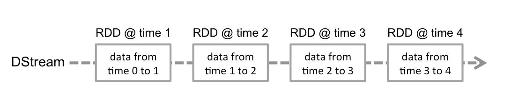

图例 4‑7 一定时间段的数据流

对离散流应用的任何操作都将转换为底层RDD上的操作，例如代码
4‑1将输入流lines通过flatMap()转换为包含单词的离散流words，如下图所示：

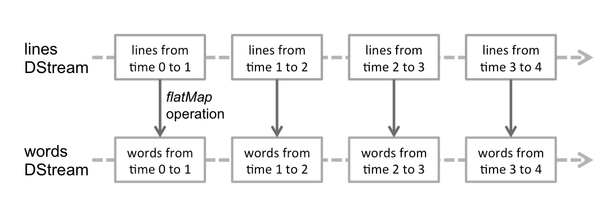

图例 4‑8 对每个时间段的数据进行转换操作

离散流本质上根据时间间隔不断的将数据流划分为较小的块，称为微批（Micro-Batch），将每个单独的微批实现为RDD，然后将其作为常规RDD进行处理。每个这样的微批处理都是独立处理的，微批处理之间不会保持任何状态，从而使处理本质上是无状态的。假设批处理间隔为5秒，然后在消耗事件时，每隔5秒创建一个微批，并将微批移交给RDD进行进一步处理。Spark
Streaming的主要优点之一是，处理微批的API与Spark紧密地集成到一起，并与Spark的其余组件无缝结合。

  - 每个离散流中的批代表一个RDD，这句话对吗？

我们已经了解了Spark
Streaming的核心概念DStream，以及如何将微批执行模型与函数编程API融合在一起，从而为Spark上的流处理提供了完整的基础。接下来，我们将探究Spark
Streaming通过DStream抽象提供的API，以流方式实现任意复杂的业务逻辑。从API的角度来看，DStream将其大部分工作委托给Spark中的基础数据结构RDD，所以理解RDD概念和及其API对于理解DStream的工作方式至关重要，离散流上的转换类似于Spark核心RDD的转换。RDD是一个单一的数据结构，作为其API和库的基本元素，也是一个表示一堆元素的多态集合，其中要分析的数据表示为任意Scala类型。数据集分布在集群的执行器上，并使用这些机器进行处理。自从Spark
SQL引入以来，DataFrame和Dataset抽象成为Spark的推荐编程接口。在最新版本中，仅函数库程序员才需要了解RDD
API。尽管RDD在接口级别上并不经常可见，但它们仍可驱动核心引擎的分布式计算功能。为了了解Spark的工作原理，建议通过前面几章了解RDD级别编程的一些基本知识。

### 基本操作

DStream编程API由转换或高阶函数组成，并将另一个函数作为参数。在API级别，DStream
\[T\]是强类型数据结构，表示类型T的数据流。DStream是不可变的，这意味着我们无法在适当位置更改其内容。相反，我们通过对输入DStream进行一系列转换来实现预期的应用程序逻辑。每次转换都会创建一个新的DStream，用来表示来自父DStream转换后的数据。DStream转换是惰性的，这意味着在系统需要具体化结果之前，实际不会处理原始数据。
对于DStream，当我们想通过输出操作向流接收器生成结果时，将触发此数量流的处理过程。

DStream是一种数据流的抽象，其中的元素在时间维度上分为微批，每个微批由RDD表示，如图例 4‑7所示。在执行级别，Spark
Streaming的主要任务是计划和管理及时收集数据块并将其交付给Spark核心，Spark核心引擎把操作序列应用于数据，构成应用程序逻辑。

由于离散流由RDD组成，因此转换也适用于每个RDD生成转换后的RDD，然后创建转换后的离散流，每次转换都会创建特定的离散流派生类。与RDD类似，转换允许修改来自输入离散流的数据。离散流支持常规RDD上可用的以元素为中心的转换，从而在Spark中统一了批处理和流模式之间的开发经验。一些常见的转换如下，通过删除隐式参数来简化签名：

  - map\[U\](mapFunc:(T)=\>U):DStream\[U\]

通过传递源离散流的每个元素到函数mapFunc进行运算，返回一个新的离散流，而RDD结构保持不变。像在RDD中一样，这种转换适合进行大规模并行操作，因为其输入是否处于特定位置相对于其余数据并不重要。

  - flatMap\[U\](flatMapFunc: (T) ⇒ TraversableOnce\[U\]):DStream\[U\]

与map类似，但每个输入项可以映射到0个或更多的输出项。flatmap()不返回U类型的元素，而是返回一个TraversableOnce\[U\]类型，所有Scala集合都实现了TraversableOnce接口，可用作此函数的目标类型。

  - mapPartitions\[U\](mapPartFunc: (Iterator\[T\]) ⇒ Iterator\[U\],
    preservePartitioning: Boolean = false): DStream\[U\]

就像在RDD上定义的同名函数一样，使我们可以直接在RDD的每个分区上应用映射操作，结果产生一个新的DStream
\[U\]。此函数很有用，因为它使我们可以执行特定于执行器的行为。也就是说，某些逻辑不会对每个元素重复执行，而是会对处理数据的每个执行器执行一次。一个经典的示例是初始化随机数生成器，然后将其用于分区上的每个元素，可通过Iterator\[T\]访问；另一个有用的情况是减少昂贵资源（例如服务器或数据库连接）的创建，并重用此类资源来处理每个输入元素。
另一个优点是，初始化代码直接在执行程序上运行，使我们可以在分布式计算过程中使用不可序列化的库。

  - filter(filterFunc: (T) ⇒ Boolean): DStream\[T\]

通过仅选择filterFunc返回true的源离散流的记录来返回新的离散流。

  - repartition(numPartitions: Int): DStream\[T\]

通过创建更多或更少的分区来更改此离散流中的并行级别。

  - union(that: DStream\[T\]): DStream\[T\]

返回一个新的离散流，它包含源离散流和另一个离散流中元素的并集。

  - count(): DStream\[Long\]

通过计算源离散流的每个RDD中的元素数量，返回单元素RDD的新离散流。

  - reduce(reduceFunc: (T, T) ⇒ T): DStream\[T\]

通过使用函数func
（其接受两个参数并返回一个）聚合源离散流的每个RDD中的元素来返回单个元素RDD的新离散流。该函数应该是关联的和可交换的，以便可以并行计算。

  - countByValue(numPartitions: Int = ssc.sc.defaultParallelism):
    DStream\[(T, Long)\]

当调用K类元素的离散流时，返回新的(K, Long)键值对DStream，其中每个键的值是源离散流的每个RDD中键的频次。

  - reduceByKey(reduceFunc: (V, V) ⇒ V, numPartitions: Int):
    DStream\[(K, V)\]

当调用(K, V)键值对离散流时，返回新的(K,
V)键值对离散流，其中使用给定的reduce函数聚合每个键的值。默认情况下，它使用Spark的默认并行任务数进行分组。本地模式任务数为2；群集模式中的数字由配置属性spark.default.parallelism确定。可以传递可选的numPartitions参数来设置不同数量的任务。

  - join\[W\](other: DStream\[(K, W)\], numPartitions: Int):
    DStream\[(K, (V, W))\]

当包含(K, V)和(K, W)键值对的两个离散流被调用时，返回一个新的(K, (V, W))键值对离散流，每个键对应所有的元素。

  - cogroup\[W\](other: DStream\[(K, W)\], numPartitions: Int):
    DStream\[(K, (Iterable\[V\], Iterable\[W\]))\]

当调用(K, V)和(K, W)对的DStream时，返回一个新的DStream(K, Seq \[V\], Seq \[W\])元组。

### transform

回顾上面的代码，我们看到这些转换操作是针对单个元素进行的，例如经典的map()，filter()等。这些操作遵循相同的分布式执行原则，并遵守相同的序列化约束。还有一些操作，例如transform()和foreachRDD()，它们是针对RDD而不是元素进行操作。这些操作由Spark
Streaming调度程序执行，并且提供给这些操作的函数在驱动程序中。在这些操作的范围内，我们可以实现跨越微批处理范围的逻辑，例如簿记历史或维护应用程序级计数器。它们还提供对所有Spark执行上下文的访问。在这些运算符中，我们可以与Spark
SQL、Spark
ML进行交互，甚至管理流应用程序的生命周期。这些操作是循环流式微批处理调度，元素级转换和Spark运行时上下文之间的真正桥梁。

transform()允许将任意的RDD转换方法应用于离散流：

  - transform\[U\](transformFunc: (RDD\[T\]) ⇒ RDD\[U\]: DStream\[U\]

  - transform\[U\](transformFunc: (RDD\[T\], Time) ⇒ RDD\[U\]):
    DStream\[U\]

Spark
Streaming提供了两个transform()转换，第一个transformFunc的输入参数只有RDD\[T\]，第二个transformFunc的输入参数有两个，分别是RDD\[T\]和批次时间Time，可以获取到批次时间，可以依据批次时间做处理。transform()将transformFunc函数应用于一个数据批的RDD\[T\]上，应用任何未在DStream
API中公开的RDD操作，例如将数据流中的每个批处理与其他数据集相结合的功能，而这个数据集不会直接暴露在DStream
API中，可以轻松地使用transform()来做到这一点，可以通过将输入数据流与预定义的垃圾邮件信息进行实时数据清理，然后基于它进行过滤。请注意，提供的函数在每个批次间隔中被调用，这允许根据批次间隔进行RDD操作，对于RDD操作、分区数、广播变量等可以在批次之间更改。下面的代码利用transform()将批处理中键值为“Hello”的结果过滤掉：

import org.apache.spark.SparkConf

import org.apache.spark.streaming.{Seconds, StreamingContext}

object TransformFilterWord {

def main(args: Array\[String\]): Unit = {

val conf = new
SparkConf().setMaster("local\[2\]").setAppName("TransformFilterWord")

val ssc = new StreamingContext(conf, Seconds(5))

val lines = ssc.socketTextStream("localhost", 9999)

val words = lines.flatMap(\_.split(" ")) // not necessary since Spark
1.3 // Count each word in each batch

val pairs = words.map(word =\> (word, 1))

val wordCounts = pairs.reduceByKey(\_ + \_)

val cleanedDStream = wordCounts.transform(rdd =\> {

rdd.filter(a =\> \!a.\_1.equals("Hello"))

})

cleanedDStream.print()

ssc.start()

ssc.awaitTermination()

}

}

我们可以参考代码 4‑2和代码 4‑3的执行过程来验证上面的transform()方法的运行结果。使用Docker exec
命令进入到容器中打开另一终端界面，运行Spark应用程序，然后观察运行结果：

spark-submit --class TransformFilterWord
/data/application/simple-streaming/target/scala-2.13/simple-streaming\_2.13-0.1.jar
localhost 9999

### 连接操作

值得强调的是可以轻松地在Spark 数据流中执行不同种类的连接，流可以非常容易地与其他流连接。

val stream1: DStream\[String, String\] = ...

val stream2: DStream\[String, String\] = ...

val joinedStream = stream1.join(stream2)

代码 4‑7

在代码
4‑11中，由stream1生成的RDD将与stream2生成的RDD相连，默认innerJoin，也可以做leftOuterJoin，rightOuterJoin，fullOuterJoin。此外，在数据流的窗口上进行联接通常是非常有用的。这也很容易。

val windowedStream1 = stream1.window(Seconds(20))

val windowedStream2 = stream2.window(Minutes(1))

val joinedStream = windowedStream1.join(windowedStream2)

代码 4‑8

这是另一个连接窗口流与数据集的例子，使用了之前已经说明的transform()操作。

val dataset: RDD\[String, String\] = ...

val windowedStream = stream.window(Seconds(20))...

val joinedStream = windowedStream.transform { rdd =\> rdd.join(dataset)
}

代码 4‑9

实际上，也可以动态更改要加入的数据集，tranform中的函数每个批次间隔进行计算，因此将使用dataset引用指向的当前数据集。

### SQL操作

可以轻松地在数据流上使用DataFrame和SQL操作，必须使用StreamingContext中的SparkContext创建一个SparkSession，并且必须可以在驱动程序故障时重新启动，通过创建延迟实例化的SparkSession单例实例可以被完成。下面的例子会修改前面的字计数，使用DataFrame和SQL生成字数。每个RDD被转换成DataFrame，并注册为一个临时表，然后使用SQL查询。

val words: DStream\[String\] = ...

words.foreachRDD { rdd =\>

// Get the singleton instance of SparkSession

val spark =
SparkSession.builder.config(rdd.sparkContext.getConf).getOrCreate()

import spark.implicits.\_

// Convert RDD\[String\] to DataFrame

val wordsDataFrame = rdd.toDF("word")

// Create a temporary view

wordsDataFrame.createOrReplaceTempView("words")

// Do word count on DataFrame using SQL and print it

val wordCountsDataFrame =

spark.sql("select word, count(\*) as total from words group by word")

wordCountsDataFrame.show()

}

代码 4‑10

也可以在表上运行SQL查询，表是在不同线程的流数据定义的，即异步运行的StreamingContext。我们需要确保设置StreamingContext记住足够量的流数据，使得查询可运行。否则没有感知到任何异步SQL查询，StreamingContext会删除掉之前查询已经完成的旧流数据。例如如果想查询的最后一个数据批，但查询需要花5分钟来运行，我们可以调用streamingContext.remember(Minutes(5))。

### 输出操作 

输出操作允许离散流中的数据推给外部系统，如数据库或文件系统。由于输出操作实际上允许转换后的数据通过外部系统使用，所以它们引发的所有离散流转换的实际执行，类似RDD操作中的动作，目前包括以下输出操作：

  - print()

在运行流应用程序的驱动程序节点上，打印离散流中每批数据的前十个元素。这对开发和调试很有用。

  - saveAsTextFiles(prefix，\[suffix\])

将此离散流的内容另存为文本文件，每个批处理间隔的文件名是根据前缀和后缀prefix-TIME\_IN\_MS \[.suffix\]生成的。

  - saveAsObjectFiles(prefix，\[suffix\])

将此离散流的内容另存为序列化Java对象，每个批处理间隔的文件名是根据前缀和后缀prefix-TIME\_IN\_MS
\[.suffix\]生成的。

  - saveAsHadoopFiles(prefix，\[suffix\])

将此离散流的内容另存为Hadoop文件，每个批处理间隔的文件名是根据前缀和后缀prefix-TIME\_IN\_MS
\[.suffix\]生成的。

  - foreachRDD(func)

对于从数据流生成的每个RDD应用函数func，这是最通用的输出运算符。此功能应将每个RDD中的数据推送到外部系统，例如将RDD保存到文件，或将其通过网络写入数据库。请注意，函数func在运行应用程序的驱动程序进程中执行，并且通常会在其中包含RDD的动作，将强制离散流中RDD的计算。

foreachRDD有一个强大的功能，允许数据被发送到外部系统，然而要了解如何正确、有效地使用这种功能是很重要的，以下是一些常见的错误需要避免。

常常将数据写入到外部系统需要创建一个连接对象，例如TCP连接到远程服务器，并用它来将数据发送到远程系统。为此，开发人员可能会不经意地尝试在Spark驱动程序创建一个连接对象，然后尝试使用它在Spark工作节点上保存RDD记录。

dstream.foreachRDD { rdd =\>

val connection = createNewConnection() // executed at the driver

rdd.foreach { record =\>

connection.send(record) // executed at the worker

}

}

代码 4‑11

代码
4‑13是不正确的，这需要被序列化，并将连接对象从驱动程序发送到工作节点，这样的连接对象在跨机器之间是不能转换的。这种错误可能表现为序列化错误（连接对象是不可序列化的）和初始化错误（需要在工作节点初始化连接对象）等。正确的解决办法是在工作节点创建连接对象（代码
4‑14），然而这可能会导致另一个常见的错误，为每个记录创建一个新的连接：

dstream.foreachRDD { rdd =\>

rdd.foreach { record =\>

val connection = createNewConnection()

connection.send(record)

connection.close()

}

}

代码 4‑12

通常情况下，创建一个连接对象有时间和资源开销，因此创建和销毁每个连接对象可以招致不必要的高开销并能显著降低系统的整体吞吐量。一个更好的解决方案是使用foreachPartition()来创建一个单一的连接对象，并使用该连接在RDD分区中发送所有记录。

dstream.foreachRDD { rdd =\>

rdd.foreachPartition { partitionOfRecords =\>

val connection = createNewConnection()

partitionOfRecords.foreach(record =\> connection.send(record))

connection.close()

}

}

代码 4‑13

上面的代码进行摊销多条记录建立连接的开销。最后，这可以进一步优化，通过在每个批次的多个RDD上重新使用的连接对象，可以维持的连接对象静态池，被推出来作为外部系统被多个批次的RDD重用，从而进一步降低了开销。

dstream.foreachRDD { rdd =\>

rdd.foreachPartition { partitionOfRecords =\>

// ConnectionPool is a static, lazily initialized pool of connections

val connection = ConnectionPool.getConnection()

partitionOfRecords.foreach(record =\> connection.send(record))

ConnectionPool.returnConnection(connection) // return to the pool for
future reuse

}

}

代码 4‑14

在池中的连接应该按需延迟创建，并且如果一段时间不使用进行超时处理。这实现了数据到外部系统最有效地传送。

其他还需要注意的：离散流通过输出操作被执行，就像RDD的动作，具体而言就是在离散流输出操作内的RDD动作迫使所接收的数据处理。因此，如果的应用程序没有任何输出操作，或只有一个输出操作foreachRDD()但是其中没有任何RDD行动，那么什么都不会得到执行。该系统将简单地接收数据并丢弃。默认情况下，输出的动作一次执行一个，以应用程序中定义的顺序执行。

### 窗口操作 

流处理系统通常处理实时发生的行动，如社交媒体消息，网页点击、电子商务交易，金融事件或传感器读数也是此类事件的常见例子，我们可能有兴趣查看最近一段时间内发生的事件，例如最后15分钟或最后一个小时，甚至两者都可以。此外，流处理系统应该长时间运行，处理连续的数据流。随着这些事件的不断出现，较旧的事件通常与我们要完成的任何处理都越来越不相关，所以需要定期的和基于时间的数据流操作，可以称之为基于时间窗口的操作，如果是执行聚合操作就是每X时间段进行分组，例如每小时最大和最低环境温度或每15分钟的总能耗都是窗口聚合的操作。如果时间段是连续且不重叠的，可以称此为固定时间段的分组，其中每个组都跟随前一个组并且不重叠，从而使时间窗口滚动。当我们需要定期生成数据汇总时选择使用滚动窗口，每个周期都独立于以前的周期。滑动窗口是一段时间内的聚合，报告周期比聚合周期要短。滑动窗口具有两个时间规格的聚合：窗口长度和报告周期，它通常解读为每隔时间周期X进行一次聚合函数的报告，聚合函数本身的周期为Y，X\<Y，例如对过去一天的平均股价每小时报告一次。我们可能已经注意到，如果将滑动窗口与平均值函数进行组合就是滑动窗口最广为人知的形式，通常称为移动平均值。

Spark
Streaming提供窗口处理，可让我们在事件的滑动窗口上应用转换，在指定的间隔内创建滑动窗口。每次窗口在源离散流上滑动时，落入特定窗口的RDD将被合并和操作产生窗口化离散流，下图说明了这个滑动窗口。

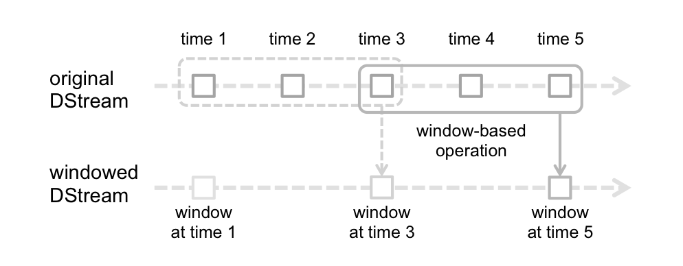

图例 4‑9 Spark流的窗口操作

如图例
4‑7所示，每当窗口滑过源离散流时，落在窗口内的源RDD被组合起来并进行操作以产生窗口化的离散流，图中的操作使用最近3个时间单位的窗口数据，并以2个时间单位滑动这个窗口，这表明任何窗口操作需要指定两个参数：

（1）窗口长度（Window Length），表示窗口持续时间，图例 4‑9中为3。

（2）滑动间隔（Sliding Interval），表示执行窗口操作的时间间隔，图例 4‑9中为2。

这两个参数必须是源离散流批次间隔的倍数，图例 4‑9中源离散流批次间隔为1。让我们用一个例子说明窗口操作，扩展前面的示例（代码
4‑1）通过对数据的持续30秒，每隔10秒生成单词统计，要做到这一点，必须这是使用reduceByKeyAndWindow操作来完成。

val windowedWordCounts = words.map(x =\> (x, 1)).reduceByKeyAndWindow(\_
+ \_, Seconds(30), Seconds(10))

代码 4‑15

下面是一些常见的窗口操作，所有这些操作都使用了上述两个参数：窗口长度（windowLength）和滑动间隔（slideInterval）：

  - window（windowLength，slideInterval）

返回基于源离散流的窗口批次创建的新离散流。

  - countByWindow(windowLength，slideInterval)

返回流中元素的滑动窗口数。

  - reduceByWindow(func，windowLength，slideInterval)

返回一个新的单元素流，通过使用func在滑动间隔内通过流中的元素聚合创建。该函数应该是关联的和可交换的，以便它可以并行计算。

  - reduceByKeyAndWindow(func，windowLength，slideInterval，\[numTasks\])

当在键值对(K, V)离散流上调用时，返回一个新的键值对(K,
V)离散流，其中每个键的值使用给定的聚合函数在滑动窗口的批次中进行计算。默认情况下，它使用Spark的默认并行任务数进行分组（2为本地模式，群集模式中的数字由config属性spark.default.parallelism确定），也可以设置可选的numTasks参数来设置不同数量的任务。

  - reduceByKeyAndWindow(func，invFunc，windowLength，slideInterval，\[numTasks\])

这个方法是一个更有效的版本，使用前一窗口的聚合值递增地计算每个窗口的聚合值。这是通过聚合进入滑动窗口的新数据并“逆向聚合”离开窗口的旧数据来完成的，例如是在窗口滑动时增加和减少键的计数。但是它仅适用于可逆聚合函数，即具有相应的逆聚合功能（作为invFunc参数）。同上一个方法一样，聚合任务的数量可以通过可选参数配置。请注意，必须启用检查点才能使用此操作。

  - countByValueAndWindow(windowLength，slideInterval，\[numTasks\])

当在键值对(K,
V)离散流上调用时，返回一个新的键值对(K,Long)离散流，其中每个键对应的值是键在滑动窗口内的频次。像reduceByKeyAndWindow一样，通过可选参数可以配置聚合信任务的数量。

### 有状态转换

Spark
Streaming使用离散流的概念，离散流本质上是作为RDD的数据微批处理。我们还看到基于离散流上可能的转换类型，离散流上的转换可以分为两种类型：无状态转换和有状态转换。在无状态转换中，每个微批数据的处理均不依赖于先前的数据批次，因此这是无状态转换，每个批处理都独立于之前发生的任何事情。在有状态转换中，每个微批数据的处理完全或部分取决于先前的数据批。因此这是一个有状态的转换，每个批次都考虑该批次之前发生的情况，然后在计算该批次中的数据时使用之前的信息。无状态转换通过将转换应用于离散流中的每个RDD来将一个离散流转换为另一个，诸如map()、flatMap()、union()、join()和reduceByKey()之类的转换都是无状态转换的示例。在离散流上运行有状态转换，计算取决于先前的处理状态。countByValueAndWindow()、reduceByKeyAndWindow()、mapWithState()和updateStateByKey等操作都是有状态转换的示例。实际上，所有基于窗口的转换都是有状态的，因为根据窗口操作的定义，我们需要跟踪离散流的窗口长度和滑动间隔。

许多复杂的数据流处理管道必须在一段时间内保持状态，例如需要实时了解网站上的用户行为，则必须将网站上每个用户会话的信息保持为持久状态，并根据用户的操作持续更新此状态，这种有状态的数据流式计算可以使用其updateStateByKey()操作实现。

  - updateStateByKey\[S\](updateFunc: (Iterator\[(K, Seq\[V\],
    Option\[S\])\]) ⇒ Iterator\[(K, S)\], partitioner: Partitioner,
    rememberPartitioner: Boolean, initialRDD: RDD\[(K, S)\]):
    DStream\[(K, S)\]

返回一个新的“状态”离散流，其中更新每个键的状态，通过在这个键上先前状态和这个键的新值上应用给定的方法。这可以用来维护每个键的任意状态数据，参数定义如下：

  - > S：状态类型

  - > updateFunc：状态更新方法。请注意，该方法可能会使用与输入键不同的键生成不同的元组。因此，键可能以这种方式被删除或添加键。开发人员决定是否记住分区器，尽管键被改变了。

  - > partitioner：用于控制新离散流中每个RDD分区的分区器。

  - > rememberPartitioner：是否记住生成的RDD中的分区对象。

  - > initialRDD：每个键的初始状态值。

有这样一个用例需要维护当前键值对离散流的状态，以便在下一个离散流中使用它，例如单词“Apache”在上一个数据批中出现了一次，将这个单词的出现次数计算为为1。对于代码
4‑1，在下一个数据批中它的状态将会丢失需要重新计数，如果又出现一个单词“Apache”，其值仍然为1，如果要保持“Apache”的计数状态，在下一个数据批中出现“Apache”时，将这个单词的出现次数累计为2，我们需要使用updateStateByKey(func)方法实现这个功能，代码如下：

import org.apache.spark.SparkConf

import org.apache.spark.streaming.{Seconds, StreamingContext}

object StatefulNetworkWordCount {

def main(args: Array\[String\]) {

val conf = new
SparkConf().setMaster("local\[2\]").setAppName("StatefulNetworkWordCount")

val ssc = new StreamingContext(conf, Seconds(5))

ssc.checkpoint(".")

val lines = ssc.socketTextStream("localhost", 9999)

val words = lines.flatMap(\_.split(" "))

val pairs = words.map(word =\> (word, 1))

val runningCounts = pairs.updateStateByKey\[Int\](updateFunction \_)

runningCounts.print()

ssc.start()

ssc.awaitTermination()

}

def updateFunction(newValues: Seq\[Int\], runningCount: Option\[Int\]):
Option\[Int\] = {

val newCount = runningCount.getOrElse(0) + newValues.sum

Some(newCount)

}

代码 4‑16

我们可以参考代码 4‑2和代码 4‑3的执行过程来验证上面的updateStateByKey()方法的运行结果。使用Docker exec
命令进入到容器中打开另一终端界面，运行Spark应用程序，然后观察运行结果：

spark-submit --class StatefulNetworkWordCount
/data/application/simple-streaming/target/scala-2.13/simple-streaming\_2.13-0.1.jar
localhost 9999

代码 4‑17

updateStateByKey(func)操作允许在使用新的信息持续更新时保持任意状态，要使用这个方法将必须做两个步骤：定义可以是任意数据类型的状态；指定函数如何更新状态，函数中使用以前的状态以及来自输入流的新值。

对于每个批次，Spark将对所有现存的键应用状态更新方法func，无论它们是否在一个数据批中有新数据。如果更新方法返回None，则键值对将被消除。假设想保持在文本数据流中每个单词的累计频次，在代码
4‑16中，updateFunction(func)方法应用于pairs离散流上，pairs包含单词键值对(word,
1)，对每个单词调用更新方法。累计频次runningCount:
Option\[Int\]是原来的状态，被定义为一个整数；newValues:
Seq\[Int\]是多个“1”的序列，每个“1”代表当前数据批中单词出现一次；newCount就是当前的状态，是原来状态与新值相加的结果。使用updateStateByKey()需要配置检查点目录，这在检查点将在后面的部分中详细讨论。

生成环境的流式应用必须全天候运行，因此对于跟应用逻辑无关的失败必须是弹性的，例如系统故障、JVM崩溃等。为了使这成为可能，Spark流应用程序需要检查点获得足够的信息来容错存储系统，使得它可以从故障中恢复。有两种类型的数据可以被设置检查点：

  - 元数据检查点

保存定义流计算的信息到容错存储上（例如HDFS），这是用来从运行流式应用的驱动程序节点的故障中恢复。元数据包括用于创建流应用程序的配置；定义流应用程序的离散流操作；未完成批次，批次的作业进入到队列中但尚未完成。

  - 数据检查点

将生成的RDD保存到可靠存储中，对于跨越多个批次合并数据的有状态转换，这是一种必要的条件。在这样的转化中，所生成的RDD取决于前面的批次的RDD，这会导致依赖链的长度随时间的增加而变长。为了避免恢复时间（正比于依赖链）无限制的增加，有状态转换的中间RDD被周期性地通过检查点保存到可靠的存储上以切断依赖链。

总而言之，元数据检查点主要用于从驱动程序故障中恢复，如果使用有状态转换，数据或RDD检查点是必需的。对于具有以下任何需求的应用程序，检查点必须启用：

  - 有状态转换的使用

如果任何一个updateStateByKey()或reduceByKeyAndWindow()在应用程序中被使用，则必须提供检查点的目录，以允许定期检查点RDD。

  - 从运行应用程序的驱动程序上进行故障恢复

元数据检查点使用进度信息进行恢复。

检查点可以通过在容错，可靠的文件系统（例如HDFS等）上设定一个目录，检查点信息将被保存，通过使用streamingContext.checkpoint(checkpointDirectory)方法完成，这将允许使用有状态的转换。此外，如果想使应用程序可以从驱动程序故障中恢复，应该重写流应用程序，使其有以下行为：

（1）当应用程序被首次启动，它会创建一个新的StreamingContext，设置好所有的数据流，然后调用start()。

（2当应用程序失败后重新启动，这将从检查点目录中的数据重新创建StreamingContext。

这种行为通过简单地使用StreamingContext.getOrCreate实现，代码如下：

// Function to create and setup a new StreamingContext

def functionToCreateContext(): StreamingContext = {

val ssc = new StreamingContext(...) // new context

val lines = ssc.socketTextStream(...) // create DStreams

...

ssc.checkpoint(checkpointDirectory) // set checkpoint directory

ssc

}

// Get StreamingContext from checkpoint data or create a new one

val context = StreamingContext.getOrCreate(checkpointDirectory,
functionToCreateContext \_)

// Do additional setup on context that needs to be done,

// irrespective of whether it is being started or restarted

context. ...

// Start the context

context.start()

context.awaitTermination()

代码 4‑18

如果checkpointDirectory存在，那么上下文将被从检查点数据重建，如果该目录不存在，即第一次运行，则该函数functionToCreateContext将被调用来创建新的上下文并设置离散流。除了使用getOrCreate()，还需要另一件事就是确保自动重新启动失败的驱动程序，这只能由用来运行应用程序的设施基础部署来完成

注意，RDD的检查点产生了保存到可靠存储的计算成本，这可能会导致这些批次的处理时间的增加，因此进行检查的时间间隔需要被仔细设置。对于小批量（例如1秒），每批次进行检查可显著降低操作量。相反，检查的时间间隔过长会引起RDD的谱系和任务尺寸的增长，这可能有不利影响。对于需要RDD检查点的有状态转换，该默认间隔是批处理间隔的倍数，其至少10秒，可以通过dstream.checkpoint(checkpointInterval)设置。通常情况下，一个离散流的5到10个滑动间隔作为一个检查点间隔是一个不错的选择。

无法从Spark
Streaming中的检查点恢复累加器和广播变量。如果启用检查点并同时使用累加器或广播变量，则必须为累加器和广播变量创建延迟实例化的单例实例，以便在驱动程序发生故障重新启动后可以重新实例化它们，在下面的示例中显示：

object WordBlacklist {

@volatile private var instance: Broadcast\[Seq\[String\]\] = null

def getInstance(sc: SparkContext): Broadcast\[Seq\[String\]\] = {

if (instance == null) {

synchronized {

if (instance == null) {

val wordBlacklist = Seq("a", "b", "c")

instance = sc.broadcast(wordBlacklist)

}

}

}

instance

}

}

object DroppedWordsCounter {

@volatile private var instance: LongAccumulator = null

def getInstance(sc: SparkContext): LongAccumulator = {

if (instance == null) {

synchronized {

if (instance == null) {

instance = sc.longAccumulator("WordsInBlacklistCounter")

}

}

}

instance

}

}

wordCounts.foreachRDD { (rdd: RDD\[(String, Int)\], time: Time) =\>

// Get or register the blacklist Broadcast

val blacklist = WordBlacklist.getInstance(rdd.sparkContext)

// Get or register the droppedWordsCounter Accumulator

val droppedWordsCounter =
DroppedWordsCounter.getInstance(rdd.sparkContext)

// Use blacklist to drop words and use droppedWordsCounter to count them

val counts = rdd.filter { case (word, count) =\>

if (blacklist.value.contains(word)) {

droppedWordsCounter.add(count)

false

} else {

true

}

}.collect().mkString("\[", ", ", "\]")

val output = "Counts at time " + time + " " + counts

})

## 结构化流

结构化流是基于Spark
SQL引擎构建的可伸缩且容错的流处理引擎，可以像对静态数据进行批处理计算一样来表示流计算。当流数据继续到达时，Spark
SQL引擎将负责逐步递增地运行它并更新最终结果，可以在Scala、Java、Python或R中使用Dataset或DataFrame
API来表示流聚合、事件时间窗口、流到批的连接等，计算可以在同一个优化的Spark
SQL引擎上执行。最后系统通过检查点和预写日志来确保端到端的恰好一次容错保证。简而言之，结构化流提供了快速的、可扩展的、容错的、端到端的恰好一次流处理，而用户不必推理流。

在内部，默认情况下结构化流查询使用微批量处理引擎，该引擎将数据流作为一系列小批量作业处理，从而实现了低至100毫秒的端到端延迟以及恰好一次的容错保证。但是从Spark
2.3开始，Spark
Streaming引入了一种新的低延迟处理模式，称为连续处理。该模式可以实现至少一次容错，低至1毫秒的端到端延迟。在不更改查询中的Dataset或DataFrame操作的情况下，我们将能够根据应用程序需求选择模式。

### 一个例子

假设我们要保持从数据服务器上侦听TCP套接字的文本数据，并且运行字数统计。让我们看看如何使用结构化流来实现这个功能。我们可以从Spark的安装目录中直接运行该示例，在这里让我们逐步介绍示例并了解其工作原理。首先，我们必须导入必要的类并创建本地SparkSession，这是与Spark相关的所有功能的起点。

import org.apache.spark.sql.functions.\_

import org.apache.spark.sql.SparkSession

val spark = SparkSession

.builder

.appName("StructuredNetworkWordCount")

.getOrCreate()

import spark.implicits.\_

代码 4‑19

接下来，让我们创建一个DataFrame流，表示从侦听localhost:9999的服务器接收的文本数据，并操作该DataFrame以计算字数。

val lines = spark.readStream

.format("socket")

.option("host", "localhost")

.option("port", 9999)

.load()

val words = lines.as\[String\].flatMap(\_.split(" "))

val wordCounts = words.groupBy("value").count()

lines表示一个包含流文本数据的无界表，添加到流中的新记录就像将行追加到lines表中一样。该表包含一列名为“value”的字符串，流文本数据中的每一行都成为表中的一行。由于我们正在设置转换并且尚未开始启动，因此当前未接收到任何数据。接下来，我们使用.as\[String\]将DataFrame转换为包含字符串的Dataset，以便我们可以应用flatMap操作将每一行拆分为多个单词，结果的words包含所有单词。最后，我们通过对words中的唯一值进行分组并对其进行计数来定义wordCounts，这是一个DataFrame流，它表示结构化流中正在运行的字数。现在我们在流数据设置了查询，剩下的就是实际开始接收数据并计算字数了。为此，我们将其设置为在每次更新计数时将完整的计数集打印到控制台，此操作由outputMode("complete")指定，然后使用start()启动流计算。

val query = wordCounts.writeStream

.outputMode("complete")

.format("console")

.start()

query.awaitTermination()

执行此代码后，流计算将在后台开始，query对象是激活的流查询句柄，并且已使用awaitTermination()等待查询终止，以防止该查询处于活动状态时退出该过程。要实际执行此示例代码，可以在自己的Spark应用程序中编译代码，也可以在Spark的安装目录中直接运行示例，下面的运行过程使用虚拟环境中Spark安装目录中的例子。我们首先需要通过使用以下命令启动Netcat数据服务，先进入虚拟环境的终端然后运行命令：

docker exec -it spark /bin/bash

root@48feaa001420:\~\# { while :; do echo "Hello Apache Spark"; sleep
0.05; done; } | netcat -l -p 9999

代码 4‑20

命令中的spark是第一章介绍的Docker容器名称，然后打开虚拟环境的另一个终端，我们可以通过使用：

spark-submit --class StructuredNetworkWordCount
/data/application/simple-streaming/target/scala-2.13/simple-streaming\_2.13-0.1.jar
localhost 9999

代码 4‑21

然后，在第一个运行Netcat服务的终端中会不断的自动输入“Hello Apache
Spark”，在第二个终端中进行统计计数和打印，输出内容类似于以下：

Batch: 0

\-------------------------------------------

\+-----+-----+

|value|count|

\+-----+-----+

\+-----+-----+

\-------------------------------------------

Batch: 1

\-------------------------------------------

\+------+-----+

| value|count|

\+------+-----+

|Apache| 927|

| Hello| 927|

| Spark| 927|

\+------+-----+

代码 4‑22

StreamingContext是所有完成Spark流功能的主要入口点，创建一个带有两个执行线程的本地StreamingContext，批处理间隔为1秒。使用ssc.socketTextStream，可以创建一个DStream，它代表一个来自TCP源的流数据，通过参数传入，指定为主机名（例如localhost
）和端口（例如9999）。lines为DStream，表示将从数据服务器接收的数据流。此DStream中的每条记录都是一行文本。接下来，要将空格字符的行分割成单词。flatMap是一对多的DStream操作，通过从源DStream中的每个记录生成多个新记录来创建新的DStream。在这种情况下，每一行将被分割成多个单词，并将单词流表示为words。接下来，想计算这些单词的数量。通过map操作，words一对一变换转换成包含键值对(word,
1)的DStream，然后通过reduceByKey()以获得每批数据中的单词频率wordCounts，最后wordCounts.print()将打印每秒产生的几个计数。请注意，当执行这些操作之后，Spark数据流仅定了启动时需要执行的计算，并且尚未开始实际处理。在所有转换设置完成后如果要开始处理，最终需要调用ssc.start()。

### 工作机制

结构化数据流传输中的关键思想是将实时数据流视为被连续添加的表，这导致了一个新的流处理模型，该模型与批处理模型非常相似，就像在静态表上一样将流计算表示为类似于批处理的标准查询，Spark
在无界输入表上将其作为增量查询运行。让我们更详细地了解此模型的工作机制。

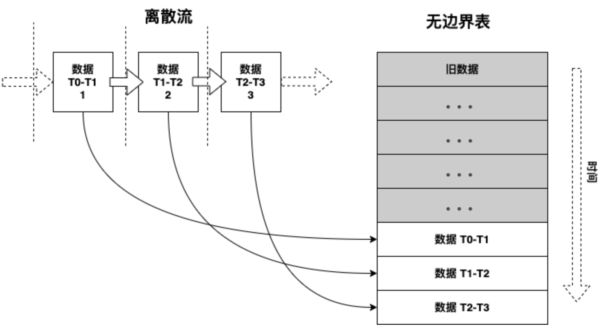

图例 4‑10 将新数据从离散流添加到无边界表

在输入上进行查询将生成结果表，在每个触发间隔新行将附加到输入表中，并最终更新结果表。无论何时更新结果表，我们都希望将更改后的结果行写入外部接收器，图例
4‑11显示了无边界表的输出：

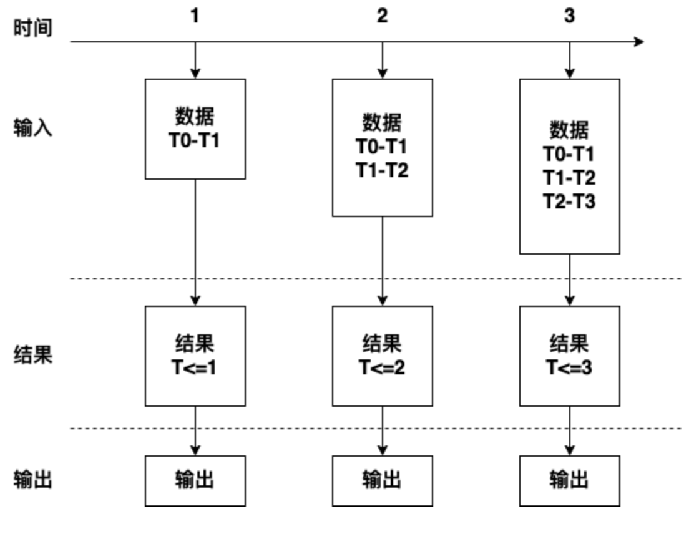

图例 4‑11在无边界表上计算结果

随着离散流随时间不断变化，越来越多的数据被处理以生成结果，因此使用无边界表生成结果表，可以将输出或结果表写入称为外部接收器，输出被定义为写到外部存储器的内容，可以在不同的模式下定义输出，其模式包括完全模式、追加模式和更新模式。

（1）完全模式表示将整个更新的结果表将被写入外部存储器，由存储连接器决定如何处理整个表的写入。

（2）追加模式表示仅将自上次触发以来追加在结果表中的新行写入外部存储器，这仅适用于结果表中预期现有行不会更改的查询。

（3）更新模式表示仅将自上次触发以来在结果表中已更新的行写入外部存储。请注意，这与完整模式的不同之处在于此模式仅输出自上次触发以来已更改的行，如果查询不包含聚合，将等同于追加模式。

结构化流基于Spark SQL的DataFrame和Dataset为基础，通过扩展这些Spark SQL
API以支持流工作负载，并且继承了Spark
SQL引入的高级语言特性以及底层的优化，包括Catalyst查询优化器的使用以及由Tungsten提供的低开销内存管理和代码生成，可以在所有支持Spark
SQL的开发语言中使用结构化流，这些开发语言包括：Scala，Java，Python和R，但是某些高级状态管理功能当前仅在Scala中可用。由于Spark
SQL中使用了中间查询表示形式，因此无论使用哪种语言绑定，程序的性能都是相同的。结构化流引入了在所有窗口和聚合操作中事件时间的支持，事件生成时间而不是处理时间可以使得逻辑编程变得容易。

借助Spark生态系统中结构化流的可用性，Spark设法统一了经典批处理和基于流的数据处理之间的开发经验。在本节中，我们将按照结构化流创建流作业的通常步骤，检查结构化流的编程模型：

  - 初始化Spark

  - 从源获取流数据

  - 定义要应用于流数据的操作

  - 输出结果数据

SparkSession成为结构化流和批处理应用程序的单一入口点，因此我们需要首先初始化SparkSession对象。

import org.apache.spark.sql.SparkSession

val spark = SparkSession

.builder()

.appName("StreamProcessing")

.master("local\[\*\]")

.getOrCreate()

代码 4‑23

使用Spark交互界面时，已经提供spark作为SparkSession对象，我们不需要创建任何其他上下文即可使用结构化流。SparkSession提供了一个生成器方法readStream()，该方法调用format()以指定数据流的源并提供配置。例如代码
4‑21中创建了一个文件流源。我们使用format()方法指定源的类型，schema()使我们能够为数据流提供数据结构模式，这对于某些源类型是必需的，例如此文件类型源。

val fileStream = spark.readStream

.format("json")

.schema(schema)

.option("mode","DROPMALFORMED")

.load("/tmp/datasrc")

代码 4‑24

每个数据流源实现都有不同的选项，有些具有可调参数。在代码
4‑21中，我们将选项mode设置为DROPMALFORMED，此选项指示JSON流处理器删除既不符合JSON格式也不符合schema的任何行。在后台，
readStream()方法将创建一个DataStreamReader实例，该实例负责管理不同的选项，在此DataStreamReader实例上调用load()会验证各种设置的选项，如果一切检查完毕将返回流式DataFrame。在我们的示例中，此流式DataFrame表示数据流，通过监视提供的路径/tmp/datasrc，使用提供的模式将该路径中的每个新文件进行解析，就这样数据流被处理产生，所有格式错误的文件都将从该数据流中删除。

加载数据流的过程是惰性的，当前我们只是得到了数据流的表示形式，是一个流式DataFrame实例。我们可以在其上应用的一系列转换，以实现特定业务逻辑。在数据流实现之前，创建流DataFrame不会导致实际消耗或处理任何数据。

从Spark
在Spark 4.x中，常见流数据源包括：JSON、ORC、Parquet、CSV、text、textFile（文件源），以及socket、Kafka和Rate数据源。Rate数据源常用于压测与功能验证，它会按指定速率生成带时间戳与递增值的测试数据。

调用load()方法的结果是产生流式DataFrame，可以使用Dataset或DataFrame
API表示要应用于数据流中业务逻辑，以实现我们的特定用例。这里需要回顾一下结构化数据中的内容，DataFrame是Dataset
\[Row\]的别名，尽管从技术上来说这似乎是一个很小的区别，但是在Scala中使用时，Dataset会提供一个静态类型接口，而DataFrame的用法是无类型的，如果在动态类型语言Python中使用结构化API时，DataFrame
是唯一可用的API。在静态类型的Dataset上使用操作时，也会对性能产生影响。当使用的SQL表达式，尽管查询计划程序可以解释并进一步优化DataFrame，但是Dataset操作中提供的变量和方法对于查询计划程序而言是不透明的，因此运行速度可能比完全相同的DataFrame慢。

假设我们正在使用来自传感器网络的数据，在代码
4‑22中，我们从sensorStream中选择字段deviceId、timestamp、sensorType和value，并仅过滤出传感器类型为温度且其值超过给定的阈值。

val highTempSensors = sensorStream

.select($"deviceId", $"timestamp", $"sensorType", $"value")

.where($"sensorType" === "temperature" && $"value" \> threshold)

代码 4‑25

同样，我们可以汇总数据并将操作应用于一段时间。例8-4显示了我们可以使用事件本身的时间戳信息来定义一个五分钟的时间窗口，该时间窗口将每分钟滑动一次，在窗口操作中应用事件时间在后面会有详细的描述。

val avgBySensorTypeOverTime = sensorStream

.select($"timestamp", $"sensorType", $"value")

.groupBy(window($"timestamp", "5 minutes", "1 minute"), $"sensorType")

.agg(avg($"value")

基于数据流的DataFrame或Dataset不支持一些标准的DataFrame或Dataset操作。其中一些如下。

（1）数据流Dataset不支持多个流聚合（即数据流DataFrame上的聚合链），

（2）数据流Dataset不支持limit()和take(n)，

（3）数据流Dataset不支持distinct()操作，

（4）仅在聚合之后且在完整输出模式下，数据流Dataset才支持sort()操作，

（5）数据流Dataset不支持很少类型的外部连接。

此外，有些Dataset方法在数据流上不适用，它们是将立即运行查询并返回结果的操作，这对于流数据集没有意义，可以通过显式启动流查询来完成这些功能，例如：

（1）count()方法无法从数据流Dataset中返回单个计数，而是使用ds.groupBy().count()返回包含运行计数的数据流Dataset，

（2）foreach()方法需要使用ds.writeStream.foreach()的方式，

（3）show()方法可以使用控制台接收器代替。

如果尝试这些操作中的任何一个，我们将看到一个AnalysisException异常，例如“operation XYZ is not
supported with streaming
DataFrames/Datasets”。尽管将来的Spark版本可能会支持其中一些功能，但从根本上讲，还有一些功能很难有效地在流数据上实现，例如不支持对输入流进行排序，因为它需要跟踪流中接收到的所有数据，因从根本上讲这很难有效执行。但是，在对数据流应用聚合函数后一些不被支持的操作将被定义，尽管我们无法对数据流进行计数，但我们可以根据每分钟的时间窗口进行分组后计数，也可以计算某种类型的设备数。在代码
4‑23中，我们定义了每种sensorType在每分钟的事件计数。

val avgBySensorTypeOverTime = sensorStream

.select($"timestamp", $"sensorType")

.groupBy(window($"timestamp", "1 minutes", "1 minute"), $"sensorType")

.count()

代码 4‑26

尽管某些操作，例如count()或limit()，数据流操作不能直接支持，但其他一些数据流操作在计算上却很困难，例如distinct()要过滤数据流中的重复项，将需要记住到目前为止经过的所有数据，并将每个新记录与已经看到的所有记录进行比较。第一个条件将需要无限的存储空间，第二个条件将具有\(O\left( n^{2} \right)\)的计算复杂度，随着元素数\(n\ \)的增加，该复杂度变得难以承受。但是，如果我们可以定义一个键来告知是否在过去的某个时刻已经看到这个元素，我们可以使用它来删除重复项：

stream.dropDuplicates("\<key-column\>")

代码 4‑27

到目前为止，我们介绍的操作包括创建流和对其进行转换，但是这些都是声明性的，定义了从何处使用数据以及我们要对其应用哪些操作，但是到目前为止，仍然没有实际的数据加载到流系统中。在启动数据流之前，我们需要首先定义输出数据的去向和方式：

（1）输出接收器的详细信息（format()方法和path选项），包括数据格式，位置等。

（2）输出模式（outputMode()方法）用来指定要写入输出接收器的内容。

（3）查询名称（queryName()方法，可选）指定查询的唯一名称以进行标识。

（4）触发间隔（trigger()方法，可选）指定触发间隔，如果未指定，则先前的处理完成后系统将检查新数据的可用性，如果由于先前的处理尚未完成而错过了触发时间，则系统将立即触发处理。

（5）检查点位置（checkpointLocation选项），对于某些可以确保端到端容错的输出接收器，请指定系统将在其中写入所有检查点信息的位置，这应该是与HDFS兼容的容错文件系统中的目录。

从API角度来看，我们通过在数据流DataFrame或Dataset上调用writeStream()来实现数据流的实际加载。如代码
4‑25所示，在数据流Dataset上调用writeStream()会创建一个DataStreamWriter，这是一个构建器实例，提供了用于配置数据流处理过程中输出行为的方法。

val query = stream.writeStream

.format("json")

.queryName("json-writer")

.outputMode("append")

.option("path", "/target/dir")

.option("checkpointLocation", "/checkpoint/dir")

.trigger(ProcessingTime("5 seconds"))

.start()

代码 4‑28

format()方法使我们可以通过提供内置接收器的名称或自定义接收器的完全限定名称来指定输出接收器。在Spark 4.x中，常见流接收器如下：

  - 控制台接收器

打印到标准输出的接收器，它显示了可通过numRows选项配置的行数。

  - 文件接收器

基于文件和特定格式的接收器，可将结果写入文件系统，通过提供格式名称来指定格式：csv、hive、json、orc、parquet、avro或text。

  - Kafka接收器

一种特定于Kafka的生产者接收器，能够写入一个或多个Kafka主题。

  - 内存接收器

使用提供的查询名称作为表名称创建内存表，该表接收流结果的连续更新。

  - foreach接收器

提供一个编程接口来访问流内容，每次一个元素。

  - foreachBatch接收器

foreachBatch是一个程序接收器接口，提供对完整DataFrame的访问，该DataFrame对应于结构化流执行的每个基础微批。

使用outputMode()方法指定如何将记录添加到数据流的输出，支持的三种模式为追加、更新和完全：

  - 附加

（默认模式）仅将最终记录添加到输出流，当传入流的任何新记录都无法修改其值时，该记录被视为最终的，对于线性变换，例如应用投影、过滤和映射所产生的线性变换，情况总是如此，此模式保证每个结果记录仅输出一次。

  - 更新

自上次触发以来，将新的和更新的记录添加到输出流。这种模式仅在聚合的上下文中更新才有意义，聚合的值会随着新记录的到达而发生变化，如果一个以上的输入记录更改一个结果，则触发间隔之间的所有更改将整理到一个输出记录中。

  - 完全

此模式输出完整数据流的内部表示，也与聚合有关。对于非聚合流，需要记住到目前为止经过数据流的所有记录，这是不现实的。从实践的角度来看，仅当我们需要汇总低基数标准的值时才建议使用完整模式，例如按国家或地区划分的访问者数量，因为我们知道国家或地区的数量是有限的。

当数据流的查询包含聚合时，最终的定义将变得很简单。在聚合计算中，当新传入的记录符合所使用的聚合条件时，可能会更改现有的聚合值。按照我们的定义，在知道其值是最终值之前无法使用附加模式输出记录。因此，附加输出模式与聚合查询结合仅限于使用事件时间表示聚合并且定义了水印查询。在这种情况下，附加模式将在水印到期后立即输出一个事件，因此认为没有新记录可以更改汇总值，附加模式下的输出事件将被延迟，通过聚合时间窗口加上水印偏移量。

借助queryName()方法，我们可以为某些接收器使用的查询提供名称，并在Spark控制台的作业描述中展现该名称。使用option()方法，我们可以为数据流提供特定的键值对配置，类似于定义数据源的配置。每个接收器可以有特定的配置，我们可以使用此方法自定义。我们可以根据需要添加任意多个option()方法以配置接收器。options()方法是使用Map
\[String，String\]作为配置选项的替代方法，该Map包含所要设置的键值配置参数。这种选择对外部化配置模型更为友好，因为在这种情况下我们事先不知道要传递到接收器配置的设置。可选的trigger()方法使我们可以指定想要产生结果的频率。默认情况下，结构化流将处理输入并尽快的产生结果。指定触发条件后，将在每个触发间隔产生输出。trigger()可以使用以下几种触发器：

（1）ProcessingTime(\<interval\>)，让我们指定一个时间间隔interval，该时间间隔将决定查询结果的频率。

（2）Once()，是一种特殊的触发器，使我们可以执行一次流作业，这对于测试以及将定义的流作业作为单次批处理操作很有用。

（3）Continuous(\<checkpoint-interval\>)，此触发器将执行引擎切换到实验性连续引擎以进行低延迟处理，checkpoint-interval参数指定用于数据弹性的异步检查点的频率，请勿将其与ProcessingTime触发器的批处理间隔混淆。

为了实现数据流计算，我们需要启动数据流的处理过程。start()方法将之前定义的完整作业描述具体化为数据流的计算，并启动内部调度过程从而开始从源接收数据，处理并生成到接收器。start()方法返回StreamingQuery对象，该对象是用于管理每个数据流查询的各个生命周期的对象，这意味着我们可以在同一SparkSession中彼此独立地同时启动和停止多个查询。

### 窗口操作

事件时间是嵌入到数据本身的时间。对于许多应用程序，我们可能希望对事件时间进行操作。例如如果要获取每分钟由物联网设备生成的事件，可能要使用生成数据的事件时间，而不是Spark接收到的时间，事件时间在此模型中非常自然地表示为：设备中的每个事件是表中的一行，而事件时间是该行中的列值。为了说明这一概念，让我们探索一个熟悉的示例，考虑用于监视本地天气状况的气象站网络。一些远程站通过移动网络连接，可以保障数据的实时传输，而另一些是托管的远程站，可以访问质量不稳定的互联网连接。天气监视系统不能依赖事件的到达顺序进行依次处理，因为该顺序主要取决于事件所连接的网络速度和可靠性。取而代之的是，气象应用程序依赖于每个气象站为提交事件加盖时间戳，然后我们的数据流处理程序将使用这些时间戳来计算天气预报系统的基于时间的聚合。

数据流处理引擎可以使用事件时间的能力很重要，因为我们通常对事件产生的相对顺序感兴趣，而不是对事件处理的顺序感兴趣。这样一来基于窗口的聚合（例如每分钟的事件数）成为事件时间列上一种特殊的分组和聚合类型，每个时间窗口都是一个组，每行可以属于多个窗口或组，因此可以在静态数据集，例如穿戴设备上收集的事件日志，然后传递给数据流处理系统，我们可以在数据流上一致地定义这样的基于事件时间窗口的聚合查询，这使得基于事件时间的窗口操作变得更加容易。

此外，此模型自然会根据事件时间处理比预期晚到达的数据。由于Spark可以不断的更新结果表，因此它具有完全控制权，可以在有较晚数据时更新旧聚合，并可以清除旧聚合以限制中间状态数据的大小。从Spark
2.1开始支持水印功能，该功能允许用户指定最新数据的阈值，并允许引擎相应地清除旧状态。

滑动事件时间窗口上的聚合对于结构化数据流而言非常简单，并且与分组聚合非常相似。在分组汇总中，在用户指定的分组列中为每个唯一值维护汇总值（例如计数）。在基于窗口的聚合的情况下，每行记录包含事件时间，其所属的每个窗口都会维护聚合值，让我们通过图例
4‑12来了解这一点。想象一下我们将代码
4‑19进行修改，数据流现在包含字符行以及生成行的时间。我们希望在10分钟窗口内对字数进行计数，每5分钟更新一次。也就是说，在10分钟的窗口12:00-12:10、12:05-12:15、12:10-12:20之间接收的单词，并统计每个窗口的单词计数。请注意，12:00-12:10表示数据在12:00之后但12:10之前到达。现在考虑在12:07收到单词(owl
cat)，将会增加对应于两个窗口12:00-12:10和12:05-12:15中的单词计数，因此单词计数将通过分组键（即单词）和窗口（通过事件时间计算）来索引，计算结果保存在结果表中。

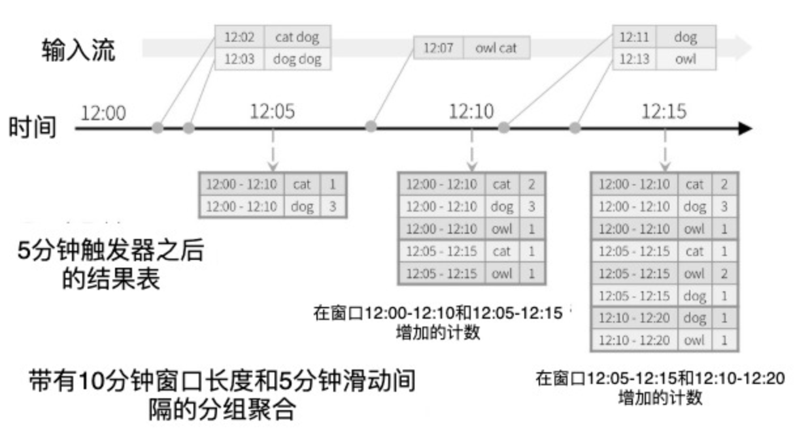

图例 4‑12 基于窗口操作的分组聚合

由于此窗口化类似于分组，因此在代码中我们可以使用groupBy()和window()操作来表示窗口化聚合（代码 4‑26）。

// Split the lines into words, retaining timestamps

val words = lines.as\[(String, Timestamp)\].flatMap(line =\>

line.\_1.split(" ").map(word =\> (word, line.\_2))

).toDF("word", "timestamp")

// Group the data by window and word and compute the count of each group

val windowedCounts = words.groupBy(

window($"timestamp", windowDuration, slideDuration), $"word"

).count().orderBy("window")

代码 4‑29

在虚拟实验环境中已经编译和打包了上面的应用程序，我们需要通过spark-submit启动这个应用程序包。首先需要运行Netcat作为数据服务器，使用Docker
exec 命令进入到容器中打开一个终端界面：

root@48feaa001420:\~\# { while :; do echo "Hello Apache Spark"; sleep
0.05; done; } | netcat -l -p 9999

代码 4‑30

然后打开虚拟环境的另一个终端运行下面的代码：

spark-submit --class StructuredNetworkWordCountWindowed
/data/application/simple-streaming/target/scala-2.13/simple-streaming\_2.13-0.1.jar
localhost 9999 10 5

代码 4‑31

然后，在第一个运行Netcat服务的终端中会不断的自动输入“Hello Apache
Spark”，在第二个终端中进行统计计数和打印，输出内容类似于以下：

\-------------------------------------------

Batch: 0

\-------------------------------------------

\+------+----+-----+

|window|word|count|

\+------+----+-----+

\+------+----+-----+

\-------------------------------------------

Batch: 1

\-------------------------------------------

\+------------------------------------------+------+-----+

|window |word |count|

\+------------------------------------------+------+-----+

|\[2020-04-03 09:08:35, 2020-04-03 09:08:45\]|Apache|225 |

|\[2020-04-03 09:08:35, 2020-04-03 09:08:45\]|Hello |225 |

|\[2020-04-03 09:08:35, 2020-04-03 09:08:45\]|Spark |225 |

|\[2020-04-03 09:08:40, 2020-04-03 09:08:50\]|Apache|282 |

|\[2020-04-03 09:08:40, 2020-04-03 09:08:50\]|Spark |282 |

|\[2020-04-03 09:08:40, 2020-04-03 09:08:50\]|Hello |282 |

|\[2020-04-03 09:08:45, 2020-04-03 09:08:55\]|Hello |57 |

|\[2020-04-03 09:08:45, 2020-04-03 09:08:55\]|Spark |57 |

|\[2020-04-03 09:08:45, 2020-04-03 09:08:55\]|Apache|57 |

\+------------------------------------------+------+-----+

代码 4‑32

现在考虑如果事件之一迟到了应用程序会发生什么。例如流式处理程序在12:11（处理时间）接收到在12:04（事件时间）生成的单词，应用程序应使用12:04而不是12:11来更新窗口12:00-12:10的旧计数，这中计算方式很自然的发生在基于窗口的分组操作中，结构化流可以长时间保持部分聚合的中间状态，以便后期数据可以正确更新旧窗口的聚合，如图例
4‑13所示。

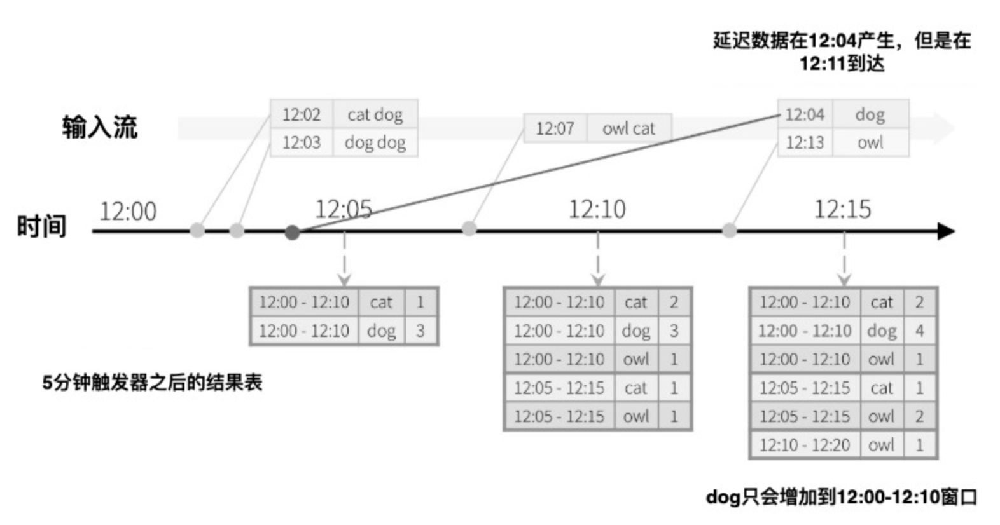

图例 4‑13 在窗口分组聚合中处理延迟数据

但是要连续几天运行此查询，系统必须限制其累积在内存中间状态的数量。这意味着系统需要知道何时可以从内存状态中删除旧聚合，因为应用程序将不再接收该聚合的最新数据。为此，在Spark
2.1中我们引入了水印功能，该功能使引擎自动跟踪数据中的当前事件时间，并尝试相应地清除旧状态。我们可以通过指定事件时间列以及期望数据延迟的阈值来定义查询的水印。对于在时间T结束的特定窗口，引擎将维持状态并允许延迟数据更新状态，直到引擎发现最大事件时间减去延迟阈值小于T。换句话说阈值内的延迟数据将被汇总，但阈值后的数据将开始被丢弃。让我们通过一个例子来理解这一点，可以使用withWatermark()在前面的示例中轻松定义水印，如下所示。

// Split the lines into words, retaining timestamps

val words = lines.as\[(String, Timestamp)\].flatMap(line =\>

line.\_1.split(" ").map(word =\> (word, line.\_2))

).toDF("word", "timestamp")

// Group the data by window and word and compute the count of each group

val windowedCounts = words

.withWatermark("timestamp", delayDuration)

.groupBy(

window($"timestamp", windowDuration, slideDuration), $"word"

).count().orderBy("window")

代码 4‑33

测试这个代码，我们可以在虚拟实验环境中运行下面的代码，然后查看运行结果：

spark-submit --class StructuredNetworkWordCountWindowedWaterMark
/data/application/simple-streaming/target/scala-2.13/simple-streaming\_2.13-0.1.jar
localhost 9999 10 5

代码 4‑34

## 案例分析

数据流是连续到达的无限序列数据。流式处理将不断流动的输入数据分成独立单元进行处理，是对流数据的低延迟处理和分析。Spark
Streaming是Spark API核心的扩展，可实现实时数据的可扩展、高吞吐量、容错流式处理。Spark
Streaming适用于需要大量数据一旦到达即可快速处理的用例，实时用例包括：

  - 网站监控、网络监控

  - 欺诈识别

  - 网页点击

  - 广告

  - 物联网传感器

Spark Streaming将数据流划分为每X秒的批次，称为DStream，它在内部是一系列RDD。Spark应用程序使用Spark
API处理RDD，并且批处理返回RDD操作的处理结果。

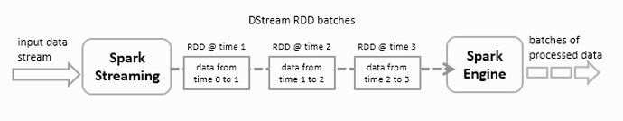

图例 4‑14 将数据流划分为X秒的批次

Spark
Streaming支持HDFS目录、TCP套接字、Kafka、Flume等数据源。数据流可以使用Spark的核心API，DataFrames
SQL或机器学习API进行处理，并且可以保存到文件系统、HDFS、数据库或提供Hadoop OutputFormat的任何数据源。

在本节中，我们将创建离散流和并将输出保存到HBase的表。在这里讨论的示例是监控油井的应用程序，由石油钻井平台的传感器产生的数据流，通过Spark
Streaming进行处理并将结果存储在 HBase中，供其他分析和报告工具使用。

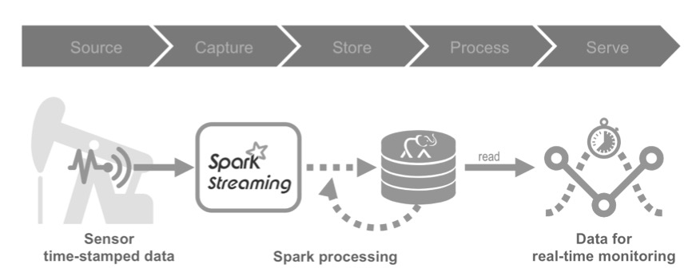

图例 4‑15 流数据处理阶段

要在HBase中存储数据流中的每一个事件，还需要筛选和存储报警信息，以及每天的汇总统计信息。Spark
Streaming示例流程首先读取传感器产生的日志信息，然后处理流数据，并将处理后的数据写入到
HBase表。Spark Streaming示例代码执行以下操作：

  - 读取日志信息。

  - 处理流数据。

  - 将处理后的数据写入HBase表。

汇总统计的代码执行以下操作：

  - 读取写入HBase的数据

  - 计算每日摘要统计信息

  - 写汇总统计到 HBase表

### 探索数据

传感器日志信息的数据列包括日期、时间和一些与来自传感器读数的相关度量，例如psi、流量等，另外还包括传感器的维护和生产厂家信息。

#### 传感器日志

scala\> :paste

// Entering paste mode (ctrl-D to finish)

val schema =

StructType(

Array(

StructField("resid", StringType, nullable=false),

StructField("date", StringType, nullable=false),

StructField("time", StringType, nullable=false),

StructField("hz", DoubleType, nullable=false),

StructField("disp", DoubleType, nullable=false),

StructField("flo", LongType, nullable=false),

StructField("sedPPM", DoubleType, nullable=false),

StructField("psi", LongType, nullable=false),

StructField("chlPPM", DoubleType, nullable=false)

)

)

// Exiting paste mode, now interpreting.

schema: org.apache.spark.sql.types.StructType =
StructType(StructField(resid,StringType,false),
StructField(date,StringType,false), StructField(time,StringType,false),
StructField(hz,DoubleType,false), StructField(disp,DoubleType,false),
StructField(flo,LongType,false), StructField(sedPPM,DoubleType,false),
StructField(psi,LongType,false), StructField(chlPPM,DoubleType,false))

scala\> case class Sensor(resid: String, date: String, time: String, hz:
Double, disp: Double, flo: Double, sedPPM: Double, psi: Double, chlPPM:
Double)

defined class Sensor

scala\> val df =
spark.read.schema(schema).csv("/data/sensordata.csv").as\[Sensor\]

df: org.apache.spark.sql.Dataset\[Sensor\] = \[sensorname: string, date:
string ... 7 more fields\]

scala\> df.show(5)

\+----------+-------+----+-----+-----+---+------+---+------+

| resid | date|time| hz| disp|flo|sedPPM|psi|chlPPM|

\+----------+-------+----+-----+-----+---+------+---+------+

| COHUTTA|3/10/14|1:01|10.27| 1.73|881| 1.56| 85| 1.94|

| COHUTTA|3/10/14|1:02| 9.67|1.731|882| 0.52| 87| 1.79|

| COHUTTA|3/10/14|1:03|10.47|1.732|882| 1.7| 92| 0.66|

| COHUTTA|3/10/14|1:05| 9.56|1.734|883| 1.35| 99| 0.68|

| COHUTTA|3/10/14|1:06| 9.74|1.736|884| 1.27| 92| 0.73|

\+----------+-------+----+-----+-----+---+------+---+------+

only showing top 5 rows

#### 维护信息

scala\> :paste

// Entering paste mode (ctrl-D to finish)

val maintSchema =

StructType(

Array(

StructField("resid", StringType, nullable=false),

StructField("eventDate", StringType, nullable=false),

StructField("technician", StringType, nullable=false),

StructField("description", StringType, nullable=false)

)

)

// Exiting paste mode, now interpreting.

maintSchema: org.apache.spark.sql.types.StructType =
StructType(StructField(resid,StringType,false),
StructField(eventDate,StringType,false),
StructField(technician,StringType,false),
StructField(description,StringType,false))

scala\> case class Maint(resid: String, eventDate: String, technician:
String, description: String)

scala\> df.show(5)

\+----------+---------+----------+--------------------+

| resid|eventDate|technician| description|

\+----------+---------+----------+--------------------+

| COHUTTA| 3/15/11| J.Thomas| Install|

| COHUTTA| 2/20/12| J.Thomas| Inspection|

| COHUTTA| 1/13/13| J.Thomas| Inspection|

| COHUTTA| 6/15/13| J.Thomas| Tighten Mounts|

| COHUTTA| 2/27/14| J.Thomas| Inspection|

\+----------+---------+----------+--------------------+

only showing top 5 rows

#### 生产厂家

scala\> :paste

// Entering paste mode (ctrl-D to finish)

val pumpInfoSchema =

StructType(

Array(

StructField("resid", StringType, nullable=false),

StructField("pumpType", StringType, nullable=false),

StructField("purchaseDate", StringType, nullable=false),

StructField("serviceDate", StringType, nullable=false),

StructField("vendor", StringType, nullable=false),

StructField("longitude", FloatType, nullable=false),

StructField("latitude", FloatType, nullable=false)

)

)

// Exiting paste mode, now interpreting.

pumpInfoSchema: org.apache.spark.sql.types.StructType =
StructType(StructField(resid,StringType,false),
StructField(pumpType,StringType,false),
StructField(purchaseDate,StringType,false),
StructField(serviceDate,StringType,false),
StructField(vendor,StringType,false),
StructField(longitude,FloatType,false),
StructField(latitude,FloatType,false))

scala\> case class PumpInfo(resid: String, pumpType: String,
purchaseDate: String, serviceDate: String, vendor: String, longitude:
Float, latitude: Float)

defined class PumpInfo

scala\> val df =
spark.read.schema(pumpInfoSchema).csv("/data/sensorvendor.csv").as\[PumpInfo\]

df: org.apache.spark.sql.Dataset\[PumpInfo\] = \[resid: string,
pumpType: string ... 5 more fields\]

scala\> df.show(5)

\+----------+---------+------------+-----------+--------+---------+---------+

| resid| pumpType|purchaseDate|serviceDate| vendor|longitude| latitude|

\+----------+---------+------------+-----------+--------+---------+---------+

| COHUTTA|HYDROPUMP| 11/27/10| 3/15/11|HYDROCAM|29.687277|-91.16249|

|NANTAHALLA|HYDROPUMP| 11/27/10| 3/15/11|HYDROCAM|29.687128| -91.1625|

|THERMALITO|HYDROPUMP| 5/25/08| 9/26/09| GENPUMP|29.687277|-91.16249|

| BUTTE|HYDROPUMP| 5/25/08| 9/26/09| GENPUMP| 29.68693| -91.1625|

| CARGO|HYDROPUMP| 5/25/08| 9/26/09| GENPUMP|29.683147|-91.14545|

\+----------+---------+------------+-----------+--------+---------+---------+

only showing top 5 rows

#### HBase表格

传感器日志流数据的HBase表格模式如下：

（1）Row key：（resid + date + time）的复合行键

（2）data列族：包括与输入数据字段相对应的列，

（3）alert列族：具有对应报警值的列。请注意，data和alert列族可能会设置为在一段时间后过期。

每日统计汇总的HBase表格模式如下：

（1）Row key：（resid + date）的复合行键

（2）stats列族：最小值、最大值和平均值的列。

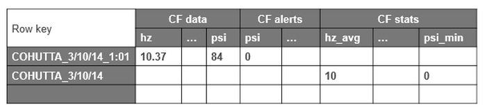

图例 4‑16数据格式

创建HBase表：

hbase(main):001:0\> create 'sensor', {NAME=\>'data'}, {NAME=\>'alert'},
{NAME=\>'stats'}

Created table sensor

Took 1.2132 seconds

\=\> Hbase::Table - sensor

hbase(main):002:0\> list

TABLE

sensor

1 row(s)

Took 0.0462 seconds

\=\> \["sensor"\]

hbase(main):004:0\> scan 'sensor'

ROW COLUMN+CELL

0 row(s)

Took 0.1649 seconds

### 创建数据流

传感器数据来自逗号分隔的CSV文件，将其保存到一个目录中，Spark
Streaming将监视目录并处理添加到该目录中的任何文件。如前所述，Spark
数据流支持不同的流式数据源，为简单起见此示例将使用CSV文件。

下面的函数将Sensor对象转换为HBase Put对象，该对象用于将行插入到HBase中。可以使用Spark
的TableOutputFormat类写入HBase表，这与从MapReduce写入HBase表的方式类似。下面使用TableOutputFormat类设置写入HBase的配置，将通过示例应用程序代码完成这些步骤。首先使用Scala案例类定义与传感器数据CSV文件对应的Sensor模式：

case class Sensor(resid: String, date: String, time: String, hz: Double,
disp: Double, flo: Double, sedPPM: Double, psi: Double, chlPPM: Double)
extends Serializable

代码 4‑35

parseSensor方法解析CSV文件，根据逗号分隔符提取出数值，用其定义Sensor类。

def parseSensor(str: String): Sensor = {

val p = str.split(",")

Sensor(p(0), p(1), p(2), p(3).toDouble, p(4).toDouble, p(5).toDouble,
p(6).toDouble, p(7).toDouble, p(8).toDouble)

}

代码 4‑36

在本节中将创建离散流，这里显示的是Spark 数据流代码的基本步骤：

  - 首先初始化一个Spark的StreamingContext 对象。

  - 使用StreamingContext对象创建一个离散流，用来表示为输入数据流，在DStream对象上应用转换和输出操作。

  - 然后可以开始接收数据，并使用StreamingContext.start()处理它。

  - 最后等待使用streamingContext.awaitTermination()停止处理

通过下面的代码显示这些步骤，Spark数据流应用的最佳运行方案是通过使用Maven或SBT构建独立的应用程序。第一步是建立一个StreamingContext，这是用于流功能的主入口点，在这个例子中将使用2秒批次时间间隔。

val sparkConf = new SparkConf().setAppName("HBaseStream")

val ssc = new StreamingContext(sparkConf, Seconds(2))

val linesDStream = ssc.textFileStream("/root/data/stream")

val sensorDStream = linesDStream.map(Sensor.parseSensor)

代码 4‑37

可以创建表示源数据的离散流linesDStream。在这个例子中，使用的StreamingContext.textFileStream()方法来创建输入流，来监视与Hadoop兼容文件系统的新文件，并处理在该目录中创建的任何文件。

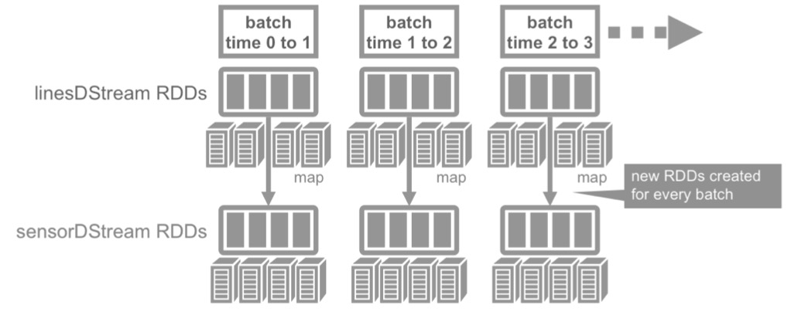

图例 4‑17创建输入流

这种摄取类型支持将新文件写入目录的工作流程，并使用Spark
Streaming检测它们，提取并处理数据，这种摄取类型只能将文件移动或复制到目录中使用。linesDStream表示传入的数据流，其中每个记录是一行文本流。一个离散流的内部是RDD的序列，每个RDD之间时间间隔2秒。接下来，将解析数据行为Sensor对象，使用linesDStream.map()操作，map()操作在RDD上应用parseSensor()方法，产生包含Sensor对象的RDD。

施加在离散流上的任何操作，被转移为对底层RDD的操作，对linesDStream上每个RDD的map()操作，将产生sensorDStream中的每个RDD，接下来使用Dstream.foreachRDD()方法来应用处理在离散流上的RDD。对低PSI的传感器对象进行过滤，以创建一个警报传感器对象的RDD，然后使用convertToPut()和convertToPutAlert()将Sensor数据转换给HBase
Put对象。

sensorDStream.foreachRDD { rdd =\>

// 过滤传感器低psi的数据

val alertRDD = rdd.filter(sensor =\> sensor.psi \< 5.0)

alertRDD.take(1).foreach(println)

// 将传感器数据转换成put对象，写入HBase表的列族中

rdd.map(Sensor.convertToPut).

saveAsHadoopDataset(jobConfig)

alertRDD.map(Sensor.convertToPutAlert).

saveAsHadoopDataset(jobConfig)

}

代码 4‑38

要开始接收数据时，必须明确地调用StreamingContext.start()方法，然后调用awaitTermination()方法，等待流计算完成。

println("start streaming")

ssc.start()

ssc.awaitTermination()

代码 4‑39

在本节中，将被处理的流数据保存到HBase表中。注册DataFrame作为一个表，这使能够在随后的SQL语句中使用它，现在可以检查数据。这个convertToPut方法将Sensor对象转换成
HBase的Put对象，其用于在HBase中插入行。

def convertToPut(sensor: Sensor): (ImmutableBytesWritable, Put) = {

val dateTime = sensor.date + " " + sensor.time

// 创建一个组合行键: sensorid\_date time

val rowkey = sensor.resid + "\_" + dateTime

val put = new Put(Bytes.toBytes(rowkey))

// 增加列族数据

put.addColumn(cfDataBytes, colHzBytes, Bytes.toBytes(sensor.hz))

put.addColumn(cfDataBytes, colDispBytes, Bytes.toBytes(sensor.disp))

put.addColumn(cfDataBytes, colFloBytes, Bytes.toBytes(sensor.flo))

put.addColumn(cfDataBytes, colSedBytes, Bytes.toBytes(sensor.sedPPM))

put.addColumn(cfDataBytes, colPsiBytes, Bytes.toBytes(sensor.psi))

put.addColumn(cfDataBytes, colChlBytes, Bytes.toBytes(sensor.chlPPM))

return (new ImmutableBytesWritable(Bytes.toBytes(rowkey)), put)

}

代码 4‑40

接下来使用PairRDDFunctions.saveAsHadoopDataset()方法写入传感器和警报数据。

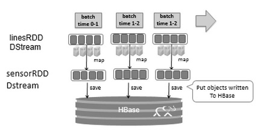

图例 4‑18使用 saveAsHadoopDataset 方法写入到HBase中

这将使用该存储系统的Hadoop Configuration对象将RDD输出到任何Hadoop支持的存储系统上，将sensorRDD
对象转换为Put对象，然后使用
saveAsHadoopDataset()方法写入到HBase中。现在要读取HBase传感器表数据，然后计算每日摘要统计信息并将这些统计信息写入统计信息列族，以下代码读取HBase表传感器表psi列数据，使用StatCounter计算此数据的统计数据，然后将统计数据写入传感器统计数据列系列。

val conf = HBaseConfiguration.create()

conf.set(TableInputFormat.INPUT\_TABLE, HBaseSensorStream.tableName)

//读取列族psi列中的数据

conf.set(TableInputFormat.SCAN\_COLUMNS, "data:psi")

//加载(row key,row Result)RDD元组

val hBaseRDD = sc.newAPIHadoopRDD(conf, classOf\[TableInputFormat\],

classOf\[org.apache.hadoop.hbase.io.ImmutableBytesWritable\],

classOf\[org.apache.hadoop.hbase.client.Result\])

//转换(row key,row Result)元组为resultRDD

val resultRDD = hBaseRDD.map(tuple =\> tuple.\_2)

val keyValueRDD = resultRDD.

map(result =\> (Bytes.toString(result.getRow()).

split(" ")(0), Bytes.toDouble(result.value)))

// 通过rowkey分组,得到列值的统计

val keyStatsRDD = keyValueRDD.

groupByKey().

mapValues(list =\> StatCounter(list))

keyStatsRDD.map { case (k, v) =\> convertToPut(k, v)
}.saveAsHadoopDataset(jobConfig)

代码 4‑41

newAPIHadoopRDD()的输出是键值对RDD，PairRDDFunctions.saveAsHadoopDataset()方法将Put对象保存到HBase。现在，让我们看一看代码运行步骤和输出结果。

步骤1：启动流媒体应用

spark-submit --class HBaseSensorStream
/data/application/sensor-streaming/target/scala-2.13/sensor-streaming-assembly-0.1.jar

代码 4‑42

步骤2：将流数据文件复制到流目录

cp /data/sensordata.csv /root/data/stream/

代码 4‑43

步骤3：我们可以扫描写入表的数据，但是无法从shell界面读取二进制double值。启动hbase
shell命令，扫描data列族和alert列族

hbase(main):007:0\> scan 'sensor', {COLUMNS=\>\['data'\], LIMIT =\> 1}

ROW COLUMN+CELL

ANDOUILLE\_3/10/14 10:01 column=data:chlPPM, timestamp=1586161685698,
value=?\\xF7\\x0A=p\\xA3\\xD7\\x0A

ANDOUILLE\_3/10/14 10:01 column=data:disp, timestamp=1586161685698,
value=?\\xFB|\\xED\\x91hr\\xB0

ANDOUILLE\_3/10/14 10:01 column=data:flo, timestamp=1586161685698,
value=@\\x93\\xEC\\x00\\x00\\x00\\x00\\x00

ANDOUILLE\_3/10/14 10:01 column=data:hz, timestamp=1586161685698,
value=@\#\\xA3\\xD7\\x0A=p\\xA4

ANDOUILLE\_3/10/14 10:01 column=data:psi, timestamp=1586161685698,
value=@S\\x00\\x00\\x00\\x00\\x00\\x00

ANDOUILLE\_3/10/14 10:01 column=data:sedPPM, timestamp=1586161685698,
value=?\\xD3333333

1 row(s)

Took 0.0186 seconds

hbase(main):006:0\> scan 'sensor', {COLUMNS=\>\['alert'\], LIMIT =\> 2}

ROW COLUMN+CELL

LAGNAPPE\_3/14/14 19:39 column=alert:psi, timestamp=1586161686313,
value=\\x00\\x00\\x00\\x00\\x00\\x00\\x00\\x00

LAGNAPPE\_3/14/14 19:41 column=alert:psi, timestamp=1586161686313,
value=\\x00\\x00\\x00\\x00\\x00\\x00\\x00\\x00

2 row(s)

代码 4‑44

步骤4：启动以下程序之一以读取数据并计算每日统计数据

（1）计算一列的统计信息

root@48feaa001420:\~\# spark-submit --class HBaseReadWrite
/data/application/sensor-streaming/target/scala-2.13/sensor-streaming-assembly-0.1.jar

20/04/06 13:35:19 WARN NativeCodeLoader: Unable to load native-hadoop
library for your platform... using builtin-java classes where applicable

(COHUTTA\_3/10/14,95.0)

(COHUTTA\_3/10/14,88.0)

(COHUTTA\_3/10/14,(count: 958, mean: 87.586639, stdev: 7.309181, max:
100.000000, min: 75.000000))

代码 4‑45

（2）计算整列的统计信息

root@48feaa001420:\~\# spark-submit --class HBaseReadRowWriteStats
/data/application/sensor-streaming/target/scala-2.13/sensor-streaming-assembly-0.1.jar

20/04/06 13:37:56 WARN NativeCodeLoader: Unable to load native-hadoop
library for your platform... using builtin-java classes where applicable

root

|-- rowkey: string (nullable = true)

|-- hz: double (nullable = false)

|-- disp: double (nullable = false)

|-- flo: double (nullable = false)

|-- sedPPM: double (nullable = false)

|-- psi: double (nullable = false)

|-- chlPPM: double (nullable = false)

\+-----------------+----+-----+------+------+----+------+

| rowkey| hz| disp| flo|sedPPM| psi|chlPPM|

\+-----------------+----+-----+------+------+----+------+

|ANDOUILLE\_3/10/14|9.82|1.718|1275.0| 0.3|76.0| 1.44|

|ANDOUILLE\_3/10/14|9.88|1.716|1273.0| 0.1|80.0| 0.89|

\+-----------------+----+-----+------+------+----+------+

only showing top 2 rows

\[MOJO\_3/10/14,87.20876826722338\]

\[CARGO\_3/11/14,87.2901878914405\]

root

|-- rowkey: string (nullable = true)

|-- maxhz: double (nullable = true)

|-- minhz: double (nullable = true)

|-- avghz: double (nullable = true)

|-- maxdisp: double (nullable = true)

|-- mindisp: double (nullable = true)

|-- avgdisp: double (nullable = true)

|-- maxflo: double (nullable = true)

|-- minflo: double (nullable = true)

|-- avgflo: double (nullable = true)

|-- maxsedPPM: double (nullable = true)

|-- minsedPPM: double (nullable = true)

|-- avgsedPPM: double (nullable = true)

|-- maxpsi: double (nullable = true)

|-- minpsi: double (nullable = true)

|-- avgpsi: double (nullable = true)

|-- maxchlPPM: double (nullable = true)

|-- minchlPPM: double (nullable = true)

|-- avgchlPPM: double (nullable = true)

\[MOJO\_3/10/14,10.5,9.5,9.999457202505226,3.345,1.828,2.6188089770354934,1770.0,967.0,1385.8131524008352,2.0,0.0,0.9798121085594999,100.0,75.0,87.20876826722338,2.0,0.5,1.2699686847599168\]

\[CARGO\_3/11/14,10.5,9.5,10.010824634655517,3.864,1.983,2.948458246346556,1579.0,810.0,1204.7265135699374,2.0,0.0,0.9811482254697279,100.0,75.0,87.2901878914405,2.0,0.5,1.2506784968684743\]

SensorStatsRow(MOJO\_3/10/14,10.5,9.5,9.999457202505226,3.345,1.828,2.6188089770354934,1770.0,967.0,1385.8131524008352,2.0,0.0,0.9798121085594999,100.0,75.0,87.20876826722338,2.0,0.5,1.2699686847599168)

SensorStatsRow(CARGO\_3/11/14,10.5,9.5,10.010824634655517,3.864,1.983,2.948458246346556,1579.0,810.0,1204.7265135699374,2.0,0.0,0.9811482254697279,100.0,75.0,87.2901878914405,2.0,0.5,1.2506784968684743)

代码 4‑46

（3）启动HBase shell并扫描统计信息

hbase(main):002:0\> scan 'sensor' , {COLUMNS=\>\['stats'\], LIMIT =\> 1}

ROW COLUMN+CELL

ANDOUILLE\_3/10/14 column=stats:chlPPMmax, timestamp=1586180290366,
value=@\\x00\\x00\\x00\\x00\\x00\\x00\\x00

ANDOUILLE\_3/10/14 column=stats:chlPPMmin, timestamp=1586180290366,
value=?\\xE0\\x00\\x00\\x00\\x00\\x00\\x00

ANDOUILLE\_3/10/14 column=stats:dispavg, timestamp=1586180290366,
value=?\\xF9\\x83KY3\\x88\\x8D

ANDOUILLE\_3/10/14 column=stats:dispmax, timestamp=1586180290366,
value=@\\x00\\xE7l\\x8BC\\x95\\x81

ANDOUILLE\_3/10/14 column=stats:dispmin,

代码 4‑47

### 转换操作

本节将学习如何在离散流上应用操作，现在有了输入数据流想回答一些问题，例如：

  - 产生低压警报传感器的生产厂家和维护信息是什么？

为了回答这些问题，将在刚刚创建的离散流滤警报数据，并与供应商和维护信息进行连接操作，这些信息在产生数据流之前被读入并缓存。每个RDD被转换成DataFrame，并注册为一个临时表，然后使用SQL查询，下面的查询回答的第一个问题。

val pumpRDD =
sc.textFile("/root/data/sensorvendor.csv").map(parsePumpInfo)

val maintRDD = sc.textFile("/root/data/sensormaint.csv").map(parseMaint)

val maintDF = maintRDD.toDF()

val pumpDF = pumpRDD.toDF()

maintDF.createOrReplaceTempView ("maint")

pumpDF.createOrReplaceTempView ("pump")

sensorDStream.foreachRDD(rdd =\> {

rdd.filter { sensor =\> sensor.psi \< 5.0
}.toDF.registerTempTable("alert")

val alertPumpMaint = sqlContext.sql("select
a.resid,a.date,a.psi,p.pumpType,p.vendor,m.date,m.technician from alert
a join pump p on a.resid = p.resid join maint m on p.resid = m.resid")

alertPumpMaint.show()

})

代码 4‑48

Spark
Streaming提供了一组关于离散流的转换，这些转换类似于RDD上的转换，包括map()、flatMap()、filter()、join()和reduceByKey()等等。Spark
Streaming还提供诸如reduce()和count()等运算符，这些运算符返回由单一元素组成的离散流，但是在不同于RDD的reduce()和count()运算符，这些不触发离散流上的实际计算，他们不是动作，而是定义另一个离散流。有状态的转换可以跨越批次保持状态，使用数据或来自先前批的中间结果以计算当前批次的结果，包括基于滑动窗口的转换和跨越时间的跟踪状态。流式转换应用于在离散流中的每个RDD，依次施加转换到RDD的元素。动作是输出运算符，调用时在
离散流上触发计算，他们包括：

（1）print()将每个批次的前10个元素打印到控制台，通常用于调试和测试。

（2）saveAsObjectFile()、saveAsTextFiles()和saveAsHadoopFiles()函数将数据流输出为Hadoop兼容的文件格式。

（2）foreachRDD()运算符应用到离散流的每个批次内的RDD上。

现在，让我们看一看代码运行步骤和输出结果。

root@48feaa001420:\~\# spark-submit --class SensorStreamSQL
/data/application/sensor-streaming/target/scala-2.13/sensor-streaming-assembly-0.1.jar

20/04/06 14:35:26 WARN NativeCodeLoader: Unable to load native-hadoop
library for your platform... using builtin-java classes where applicable

Starting streaming process

Low pressure alert

Sensor(NANTAHALLA,3/13/14,2:05,0.0,0.0,0.0,1.73,0.0,1.51)

Alert pump maintenance data

\+----------+-------+---+---------+------------+-----------+--------+---------+----------+-----------+

| resid| date|psi| pumpType|purchaseDate|serviceDate|
vendor|eventDate|technician|description|

\+----------+-------+---+---------+------------+-----------+--------+---------+----------+-----------+

|NANTAHALLA|3/13/14|0.0|HYDROPUMP| 11/27/10| 3/15/11|HYDROCAM| 3/15/11|
J.Thomas| Install|

\+----------+-------+---+---------+------------+-----------+--------+---------+----------+-----------+

only showing top 1 row

代码 4‑49

### 窗口操作

通过窗口操作，可以在数据的滑动窗口上应用转换，可以多批次合并结果，在StreamingContext中指定的时间间隔进行计算。

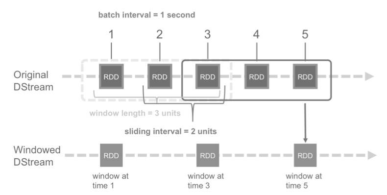

图例 4‑19数据的滑动窗口

在图例 4‑19中，Original DStream以一秒的间隔进入。滑动窗口的长度由window
length指定，在这种情况下为3个单位，窗口在离散流上按照指定的滑动间隔进行滑动，在这种情况下是2个单元。窗口长度和滑动间隔必须是离散流批次间隔的倍数，当前为1秒。当窗口在离散流上滑动时，所有落在该窗口中RDD被组合，该操作被应用于组合的RDD上，产生了窗口流中的RDD，所有窗口操作都需要两个参数：

  - 窗口长度是指窗口的持续时间，在此示例中窗口长度为3个单位。

  - 滑动间隔是指操作窗口执行的间隔，在此例子中滑动间隔是2个单位。

再次，这两个参数必须是离散流的批次间隔的倍数。例如要每4秒生成单词计数，并且持续6秒的数据，应用reduceByKey操作在键值对离散流上，使用reduceByKeyAndWindow窗口操作设置窗口长度为6，滑动间隔为4：

val windowsWordCounts = pairs.reduceByKeyAndWindow(a:Int,b:Int)=\>(a+b),
Seconds(6),Seconds(4))

代码 4‑50

使用窗口操作回答一下两个问题：

  - 传感器事件计数是多少？

  - 什么是最大，最小和平均的psi？

为了回答这些问题，将在窗口流上使用操作。每2秒的时间间隔使用持续6秒的窗口数据流回答上述的两个问题：

sensorDStream.window(Seconds(6), Seconds(2))

.foreachRDD { rdd =\>

if (\!rdd.partitions.isEmpty) {

val sensorDF = rdd.toDF()

println("sensor data")

sensorDF.show()

sensorDF.createOrReplaceTempView("sensor")

val res = spark.sql("SELECT resid, date, count(resid) as total FROM
sensor GROUP BY resid, date")

println("sensor count ")

res.show

val res2 = spark.sql("SELECT resid, date, MAX(psi) as maxpsi, min(psi)
as minpsi, avg(psi) as avgpsi FROM sensor GROUP BY resid,date")

println("sensor max, min, averages ")

res2.show

}

代码 4‑51

在代码
4‑47中，通过res可以回答第一个问题，通过res2的结果回答了什么是最大、最小和平均的psi，使用相同的窗口操作在每个传感器RDD上收集psi数据。现在，让我们看一看代码运行步骤和输出结果。

root@48feaa001420:\~\# spark-submit --class SensorStreamWindow
/data/application/sensor-streaming/target/scala-2.13/sensor-streaming-assembly-0.1.jar

20/04/06 14:35:29 WARN NativeCodeLoader: Unable to load native-hadoop
library for your platform... using builtin-java classes where applicable

Starting streaming process

Sensor count

\+-----+-------+-----+

|resid| date|total|

\+-----+-------+-----+

| CHER|3/10/14| 958|

\+-----+-------+-----+

only showing top 1 row

Sensor max, min, averages

\+-----+-------+------+------+-----------------+

|resid| date|maxpsi|minpsi| avgpsi|

\+-----+-------+------+------+-----------------+

| CHER|3/10/14| 100.0| 75.0|87.44885177453027|

\+-----+-------+------+------+-----------------+

only showing top 1 row

Sensor count

\+-----+-------+-----+

|resid| date|total|

\+-----+-------+-----+

| CHER|3/10/14| 958|

\+-----+-------+-----+

only showing top 1 row

Sensor max, min, averages

\+-----+-------+------+------+-----------------+

|resid| date|maxpsi|minpsi| avgpsi|

\+-----+-------+------+------+-----------------+

| CHER|3/10/14| 100.0| 75.0|87.44885177453027|

\+-----+-------+------+------+-----------------+

only showing top 1 row

Sensor count

\+-----+-------+-----+

|resid| date|total|

\+-----+-------+-----+

| CHER|3/10/14| 958|

\+-----+-------+-----+

only showing top 1 row

Sensor max, min, averages

\+-----+-------+------+------+-----------------+

|resid| date|maxpsi|minpsi| avgpsi|

\+-----+-------+------+------+-----------------+

| CHER|3/10/14| 100.0| 75.0|87.44885177453027|

\+-----+-------+------+------+-----------------+

only showing top 1 row

代码 4‑52

  - 当什么情况下窗口操作是非常有用的？

## 小结

在本章中，学习了流式处理程序的基础知识；学习了怎样在Spark
Streaming中操作离散化流和结构化流，还了解了Spark数据流的输入源类型以及各种数据流操作。


