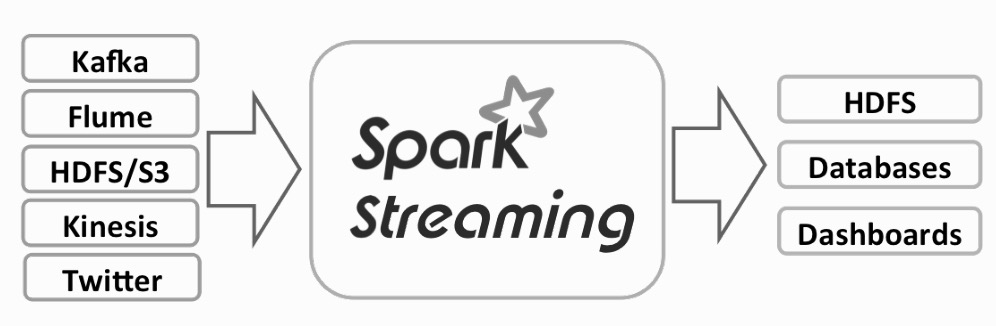
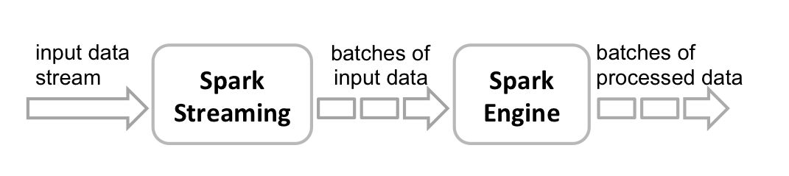

# 5.6 离散化流（DStream，历史 API）

> 兼容性说明：本节介绍 DStream / Spark Streaming，用于理解 Spark 微批模型与维护历史系统。在 Spark 4.x 的新项目中，不应再以 DStream 作为首选实现模板；请将 5.8 和 5.9 视为本章主线。

Spark Streaming 是 Spark 早期的流处理扩展，其核心抽象是 DStream。它通过把连续数据流切成一系列小批次，再把每个批次表示为底层 RDD 来执行计算。这个模型帮助 Spark 以较低改造成本获得了流处理能力，也解释了为什么很多老系统仍保留 `StreamingContext`、`socketTextStream`、`foreachRDD` 等 API。

从今天的工程视角看，DStream 更适合回答两个问题：一是 Spark 的微批模型是怎样形成的；二是旧系统代码为何大量围绕 RDD 和批次间隔编写。理解这些之后，再回头看 Structured Streaming，会更容易理解“无界表 + 增量执行”的统一模型。

Spark Streaming总体架构通常由以下组件构成（图例 5‑5）。首先是要处理的数据必须来自某个外部动态数据源，例如传感器、移动应用程序、Web客户端、服务器日志等等，这个数据通过消息机制传送给数据采集系统，如Kafka、Flume等，递送或沉积在文件系统中。



图例 5‑5 Spark数据流总体框架

然后是流处理过程，获得的数据由Spark
Streaming系统进行处理，接下来是基于NoSql的数据存储，如HBase等用于存储处理的数据，该系统必须能够实现低延迟地、快速地读写操作，最后是通过终端应用程序显示或分析，终端应用程序可以包括仪表板、商业智能工具和其他使用已处理的流数据进行分析的应用程序，输出的数据也可以存储在数据库中，以便稍后进一步处理。

Spark Streaming的内部工作原理如下（图例 5‑6）。Spark数据流接收实时输入数据流并将数据分成批，然后由Spark引擎进行处理，以批量生成最终的结果流。



图例 5‑6 Spark Streaming工作原理

Spark Streaming提供称为离散化数据流（Discretized
Stream，DStream）的高级抽象，可以简称离散流，它代表连续产生的数据流。可以从诸如Kafka、Flume和Kinesis等来源的输入数据流中创建离散流，或者通过对其他离散流应用高级操作来创建。在内部，离散流可以表示为一个批次接着一个批次以RDD为底层结构的数据流。

数据流本身是连续的，但是为了处理数据流需要批量化。Spark
Streaming将数据流分割成x毫秒的批次，这些批次总称离散流。离散流是这种批次的一组序列，其中序列中的每个小批量表示为RDD，数据流被分解成时间间隔相同的RDD段。按照Spark批处理的间隔，在离散流中的每个RDD包含了由Spark
Streaming应用程序接收的记录。

有两种类型的离散流操作：转换和输出。在Spark应用程序中，在离散流上应用转换操作，例如map()、reduce()和join()等，处理其中的每个RDD，在这个过程中创造新的RDD，施加在离散流上的任何转换会应用到上一级离散流，然后依次施加转换到每个RDD上。输出是类似于RDD操作的动作，因为它们将数据写到外部系统。在Spark数据流中，它们在每个时间步长周期性运行，批量生成输出。

### 5.6.1 一个例子

在详细介绍Spark数据流程序之前，来看一个简单的Spark数据流程序，这个程序通过Spark
Streaming的TCP套接字接口侦听NetCat发生的数据，统计接收到的文本数据中的字数，这个代码的主程序为：

import org.apache.spark.SparkConf

import org.apache.spark.streaming.{Seconds, StreamingContext}

object NetworkWordCount {

def main(args: Array\[String\]) {

if (args.length \< 2) {

System.err.println("Usage: NetworkWordCount \<hostname\> \<port\>")

System.exit(1)

}

val sparkConf = new
SparkConf().setAppName("NetworkWordCount").setMaster("local\[2\]")

val ssc = new StreamingContext(sparkConf, Seconds(10))

val lines = ssc.socketTextStream(args(0), args(1).toInt)

val words = lines.flatMap(\_.split(" "))

val wordCounts = words.map(x =\> (x, 1)).reduceByKey(\_ + \_)

wordCounts.print()

ssc.start()

ssc.awaitTermination()

}

}

代码 5‑1

这个代码是一个简单的Spark应用程序，首先导入与Spark数据流相关的类，主要是SparkConf和StreamingContext。SparkConf用来设置启动Spark应用程序的参数，创建的应用的名称为NetworkWordCount，并带有两个执行线程（local\[2\]）的本地StreamingContext，批处理时间间隔为10秒。StreamingContext是所有完成Spark
Streaming功能的主要入口点，使用ssc.socketTextStream可以创建一个离散流，代表一个来自TCP套接字源的流数据，通过参数传入，args(0)指定为主机名（例如localhost
）和args(1)指定为端口（例如9999
）。lines为离散流对象，表示将从NetCat数据服务器接收的数据流，此离散流中的每条记录都是一行文本。接下来，\_.split("
")将包含空格字符的行分割成单词，flatMap()将包含多个单词的集合扁平化拆分成包含独立单词的离散流，通过从源离散流中的每条输入记录生成多个新记录来创建新的输出离散流。在这种情况下，每一行将被分割成多个单词并且创建words离散流。接下来，通过在words离散流上应用聚合操作统计这些单词的数量。首先，通过map()操作将words一对一转换成包含键值对(word,
1)的离散流，然后通过reduceByKey()以获得每批数据中的单词统计离散流wordCounts。最后，wordCounts.print()将打印每秒输入的单词计数。请注意，当描述完这些操作过程后，这个单词计数的数据流应用程序仅定义了需要执行的计算过程，但是尚未开始实际处理。在所有转换操作设置完成后如果要开始处理，最终需要调用ssc.start。

在虚拟实验环境中已经编译和打包了上面的应用程序，我们需要通过spark-submit启动这个应用程序包。首先需要运行Netcat作为数据服务器，使用Docker
exec 命令进入到容器中打开一个终端界面：

root@48feaa001420:\~\# { while :; do echo "Hello Apache Spark"; sleep
0.05; done; } | netcat -l -p 9999

代码 5‑2

使用Docker exec 命令进入到容器中打开另一终端界面，运行Spark应用程序：

root@48feaa001420:\~\# spark-submit --class NetworkWordCount
/data/application/simple-streaming/target/scala-2.13/simple-streaming\_2.13-0.1.jar
localhost 9999

20/03/26 08:28:39 WARN NativeCodeLoader: Unable to load native-hadoop
library for your platform... using builtin-java classes where applicable

```text
-------------------------------------------
Time: 1585211330000 ms
-------------------------------------------
(Hello,1028)
(Apache,1028)
(Spark,1028)
-------------------------------------------
Time: 1585211340000 ms
-------------------------------------------
(Hello,188)
(Apache,188)
(Spark,188)
```

代码 5‑3

就这样，第一个终端窗口负责发送数据（代码 5‑2），第二个终端窗口负责接收处理数据（代码 5‑3）。

### 5.6.2 迁移对照：DStream 到 Structured Streaming

为了便于从存量DStream迁移到Spark 4.x主线API，下面给出与“词频统计”对应的Structured Streaming写法。该示例使用Kafka作为输入源，并显式设置watermark与checkpoint目录。

```scala
import org.apache.spark.sql.SparkSession
import org.apache.spark.sql.functions._

val spark = SparkSession.builder()
  .appName("StructuredWordCountKafka")
  .getOrCreate()

import spark.implicits._

val lines = spark.readStream
  .format("kafka")
  .option("kafka.bootstrap.servers", "localhost:9092")
  .option("subscribe", "words")
  .option("startingOffsets", "latest")
  .load()
  .selectExpr("CAST(value AS STRING) as line", "timestamp")

val words = lines
  .select(
    col("timestamp"),
    explode(split(col("line"), "\\\\s+")).as("word")
  )
  .filter(length(col("word")) > 0)

// 使用事件时间窗口 + watermark，避免状态无限增长
val counts = words
  .withWatermark("timestamp", "10 minutes")
  .groupBy(
    window(col("timestamp"), "1 minute", "30 seconds"),
    col("word")
  )
  .count()

val query = counts.writeStream
  .outputMode("append")
  .format("console")
  .option("truncate", "false")
  .option("checkpointLocation", "/tmp/spark-checkpoints/structured-wordcount")
  .start()

query.awaitTermination()
```

对应关系可总结为：

（1）`StreamingContext + DStream` -> `SparkSession + DataFrame/Dataset`

（2）`reduceByKeyAndWindow` 等窗口聚合 -> `groupBy(window(...))`

（3）`ssc.checkpoint(...)` -> `writeStream.option("checkpointLocation", ...)`

（4）微批时间间隔 -> `trigger(...)`（按需设置）

### 5.6.3 StreamingContext

StreamingContext是流传输的主要入口点，本质上负责流传输应用程序，包括检查点，转换和对RDD的DStreams的操作。StreamingContext是所有数据流功能切入点，提供了访问方法可以创建来自各种输入源的离散流。StreamingContext可以从现有SparkContext
或 SparkConf 创建，其指定了Master URL和应用程序名称等其他配置信息：

  - new StreamingContext(conf: SparkConf, batchDuration: Duration)

通过提供新的SparkContext所需的配置来创建StreamingContext。

  - new StreamingContext(sparkContext: SparkContext, batchDuration:
    Duration)

使用现有的SparkContext创建一个StreamingContext。

上面StreamingContext两个构造这里的第二个参数是batchDuration，这是数据流被分批的时间间隔。无论使用Spark交互界面或创建一个独立的应用程序，需要创建一个新的StreamingContext。要初始化Spark数据流程序，必须创建一个StreamingContext对象，它是所有Spark数据流功能的主要入口点。可以通过两种方式创建新的StreamingContext：

（1）如果是在Spark应用程序中，StreamingContext对象可以从SparkConf对象创建。

import org.apache.spark.\_

import org.apache.spark.streaming.\_

val conf = new SparkConf().setAppName(appName).setMaster(master)

val ssc = new StreamingContext(conf, Seconds(1))

代码 5‑4

appName参数是应用程序在集群监控界面上显示的名称。master可以是Spark、Kubernetes或YARN集群URL，或者以本地模式运行的特殊字符串local
\[\*\]。实际上，当在集群上运行时，不需要在应用程序中硬编码master，而是使用spark-submit启动应用程序并设置master参数。但是，对于本地测试和单元测试，可以通过local\[\*\]来运行Spark
Streaming（检测本地系统中的核心数）。请注意，这在内部创建一个SparkContext（所有Spark功能的起始点），可以通过ssc.sparkContext进行访问。批处理间隔必须根据应用程序的延迟要求和可用的集群资源进行设置。

（2）如果通过spark-shell打开交互界面，StreamingContext对象也可以从现有的SparkContext对象创建。

```scala
scala> import org.apache.spark.streaming._
import org.apache.spark.streaming._
scala> val ssc = new StreamingContext(sc, Seconds(10))
ssc: org.apache.spark.streaming.StreamingContext =
org.apache.spark.streaming.StreamingContext@3c4231e5
```

代码 5‑5

定义好StreamingContext后，必须执行以下操作：

（1）通过创建输入离散流来定义输入源。

（2）通过将转换和输出操作应用于DStream来定义流式计算。

（3）使用StreamingContext.start开始接收数据。

（4）使用StreamingContext.awaitTermination等待处理停止（手动或由于任何错误）。

（5）可以使用StreamingContext.stop手动停止处理。

注意，一旦StreamingContext对象已经开始启动，就不能建立或添加新的数据流操作，只能按照定义好的操作运行；一旦当前的StreamingContext对象被停止，就无法重新启动这个StreamingContext对象；只有一个StreamingContext对象可以同时在JVM中处于活动状态；StreamingContext对象上的stop()方法也会停止SparkContext对象；如果仅停止StreamingContext对象，可以将stop()方法的可选参数stopSparkContext设置为false；只要先前的StreamingContext对象在创建下一个之前停止，而且不停止SparkContext对象，就可以使用这个SparkContext对象重复创建StreamingContext对象。

  - stop(stopSparkContext: Boolean = ...): Unit

这个方法立即停止StreamingContext()的执行，不等待所有接收的数据被处理。默认情况下，如果没有指定stopSparkContext参数，SparkContext对象将被停止，也可以使用SparkConf对象配置spark.streaming.stopSparkContextByDefault参数来配置此隐式行为。

### 5.6.4 输入流

可以使用StreamingContext创建多种类型的输入流，例如receiverStream和fileStream。在代码 5‑1中，lines是一个输入离散流，通过socketTextStream从NetCat服务器接收的数据流。每个输入流与接收器（Receiver）对象相关联，该对象接收数据并将其存储在内存中进行处理。

  - abstract class Receiver\[T\] extends Serializable

这是接收外部数据的抽象类，接收器可以在Spark集群的工作节点上运行，可以通过定义方法onStart()和onStop()来定义自定义接收器，onStart()定义开始接收数据所需的设置步骤，onStop()定义停止接收数据所需的清除步骤，接收到异常时可以通过restart()重新启动接收机或通过stop()全停止来处理。

Spark
Streaming具有两类输入源，第一类是StreamingContext中直接提供的输入源，例如textFileStream和socketTextStream等，第二类是通过额外的接口获得Kafka、Flume、Kinesis等输入流。如果要在Spark
Streaming应用程序中并行接收多个输入源，这将创建多个接收器同时接收多个数据流，但是接收器占据分配给Spark
Streaming应用程序的一个CPU核心，所以重要的是要记住，Spark
Streaming应用程序需要至少分配两个CPU内核，其中一个内核运行接收器，余下的内核用来处理接收到的数据。当本地运行Spark
Streaming应用程序时，请勿使用“local”或“local \[1\]”设置master
参数，因为这意味着只有一个线程用于在本地运行任务，这个线程将用于运行接收器，不会留出线程来处理接收到的数据。因此，当通过本地模式运行Spark
Streaming应用程序时，始终使用local\[n\]设置master参数，其中n
要大于需要运行接收器的数量。如果将此规则扩展到在Spark集群上，分配给Spark
Streaming应用程序的内核数量必须大于接收器数量，否则系统将收到数据，但无法处理。

另外，基于接收信息的可靠性也可以用来区分数据接收器。当数据被接收并且复制存储在Spark中时，接收器正确地向可靠的数据源发送确认，可靠的数据源，如Kafka和Flume，实现了传输数据的确认机制，接收器可以确认接收的数据，可以确保在产生故障时不会丢失任何数据。如果接收器不向数据源发送确认信息，可以使用不支持发送确认的数据源，也可以使用可靠的数据源但是不需要进行复杂的确认。

下面我们介绍几种接收器。SocketTextStream已经在代码 5‑1中使用了，通过TCP套接字接口接收文本数据，创建一个离散流。

  - socketTextStream(hostname: String, port: Int, storageLevel:
    StorageLevel = StorageLevel.MEMORY\_AND\_DISK\_SER\_2):
    ReceiverInputDStream\[String\]

从hostname:port地址接收数据创建输入流，使用TCP套接字接收数据，使用UTF8编码接收文本，换行作为分隔。

  - > hostname：要连接的用于接收数据的主机名

  - > port：要连接的用于接收数据的端口

  - > storageLevel：接收对象的存储级别（默认值为StorageLevel.MEMORY\_AND\_DISK\_SER\_2）

除了套接字之外，StreamingContext提供了从文件创建离散流作为输入源的方法，即从与Hadoop兼容的任何文件系统上读取文件数据。

  - def fileStream\[K: ClassTag, V: ClassTag, F \<: NewInputFormat\[K,
    V\]:ClassTag\] (directory: String): InputDStream\[(K, V)\]

创建一个输入流，该输入流监视文件系统中的新文件，并使用给定的键值类型和输入格式读取它们。必须通过将文件从同一文件系统中的一个位置移动到受监控目录中，以点“.”开头的隐含文件名将被忽略。

  - textFileStream(directory: String): DStream\[String\]

创建一个输入流，该流监视与Hadoop兼容的文件系统中的新文件，并将其读取为文本文件（使用键作为LongWritable，将值作为Text，将输入格式作为TextInputFormat）。
必须通过将文件从同一文件系统中的另一个位置移动到受监控目录中。 文件名以开头。
被忽略：创建一个输入流，该输入流监视文件系统中的新文件，并将其作为文本文件读取，键的数据类型为LongWritable，值的数据类型为Text，输入格式为TextInputFormat。必须通过将文件从同一文件系统中的一个位置移动到受监控目录中，以点“.”开头的隐含文件名将被忽略。在虚拟环境的终端界面启动spark-shell，使用textFileStream创建输入流：

```scala
scala> import org.apache.spark.streaming._
import org.apache.spark.streaming._
scala> val ssc = new StreamingContext(sc, Seconds(10))
ssc: org.apache.spark.streaming.StreamingContext =
org.apache.spark.streaming.StreamingContext@54a5eff
scala> val lines = ssc.textFileStream("/data/input")
lines: org.apache.spark.streaming.dstream.DStream[String] =
org.apache.spark.streaming.dstream.MappedDStream@3a70acd5
scala> val words = lines.flatMap(_.split(" "))
words: org.apache.spark.streaming.dstream.DStream[String] =
org.apache.spark.streaming.dstream.FlatMappedDStream@c4fc610
scala> val wordCounts = words.map(x => (x, 1)).reduceByKey(_ + _)
wordCounts: org.apache.spark.streaming.dstream.DStream[(String, Int)]
= org.apache.spark.streaming.dstream.ShuffledDStream@3a5922ec
scala> wordCounts.print()
scala> ssc.start()
scala> ssc.awaitTermination()
-------------------------------------------
Time: 1585054770000 ms
-------------------------------------------
```

代码 5‑6

此时，应该看到终端界面中每10秒刷新一次。现在打开另一个终端界面，将文本文件添加到/data/input目录中：

cp /usr/local/spark/README.md /root/data/input/1.txt

一旦将文件添加到目录中，应该可以在执行程序的终端中看到刚添加文件的单词统计输出：

```text
-------------------------------------------
Time: 1585054780000 ms
-------------------------------------------
(stream,1)
(review,1)
(its,1)
([run,1)
(can,6)
(guidance,2)
(have,1)
(locally,2)
(sc.parallelize(1,1)
(,72)
...
```

要停止流式传输，在运行程序的终端中使用Ctrl+C。还可以使用QueueStream创建基于RDD队列的离散流，推送到队列中的每个RDD将被视为离散流中的一批数据，并像流一样处理。

  - def queueStream\[T: ClassTag\](queue: Queue\[RDD\[T\]\], oneAtATime:
    Boolean =true): InputDStream\[T\]

下面代码每隔1秒创建一个RDD放入到队列中，QueueStream每隔1秒接收队列中的数据进行处理：

```scala
scala> import org.apache.spark.rdd.RDD
import org.apache.spark.rdd.RDD
scala> import org.apache.spark.streaming.{Seconds, StreamingContext}
import org.apache.spark.streaming.{Seconds, StreamingContext}
scala> import scala.collection.mutable.Queue
import scala.collection.mutable.Queue
scala> val ssc = new StreamingContext(sc, Seconds(1))
ssc: org.apache.spark.streaming.StreamingContext =
org.apache.spark.streaming.StreamingContext@3031d9e9
scala> val rddQueue = new Queue[RDD[Int]]()
rddQueue:
scala.collection.mutable.Queue[org.apache.spark.rdd.RDD[Int]] =
Queue()
scala> val inputStream = ssc.queueStream(rddQueue)
inputStream: org.apache.spark.streaming.dstream.InputDStream[Int] =
org.apache.spark.streaming.dstream.QueueInputDStream@80f3111
scala> val mappedStream = inputStream.map(x => (x % 10, 1))
mappedStream: org.apache.spark.streaming.dstream.DStream[(Int, Int)] =
org.apache.spark.streaming.dstream.MappedDStream@222e9ace
scala> val reducedStream = mappedStream.reduceByKey(_ + _)
reducedStream: org.apache.spark.streaming.dstream.DStream[(Int, Int)]
= org.apache.spark.streaming.dstream.ShuffledDStream@6a636c62
scala> reducedStream.print()
scala> ssc.start()
scala> for (i <- 1 to 30) {
| rddQueue.synchronized {
| rddQueue += ssc.sparkContext.makeRDD(1 to 1000, 10)
| }
| Thread.sleep(1000)
| }
-------------------------------------------
Time: 1585059428000 ms
-------------------------------------------
(0,100)
(1,100)
(2,100)
(3,100)
(4,100)
(5,100)
(6,100)
(7,100)
(8,100)
(9,100)
  - def rawSocketStream[T: ClassTag](hostname: String, port: Int,
    storageLevel: StorageLevel =
    StorageLevel.MEMORY_AND_DISK_SER_2): ReceiverInputDStream[T]
```

从网络地址hostname:port创建一个输入流，这个输入流将数据作为序列化的块接收，可以将其直接推送到块管理器而无需反序列化它们，这是接收数据的最有效方法。

  - def binaryRecordsStream(directory: String, recordLength:
    Int):DStream\[Array\[Byte\]\]

创建一个输入流，该输入流监视的文件系统中的新文件，并将它们读取为二进制文件，假定每条记录的长度固定，每条记录生成一个字节数组，必须通过将文件从同一文件系统中的一个位置移动到受监控目录中，以点“.”开头的隐含文件名将被忽略。
