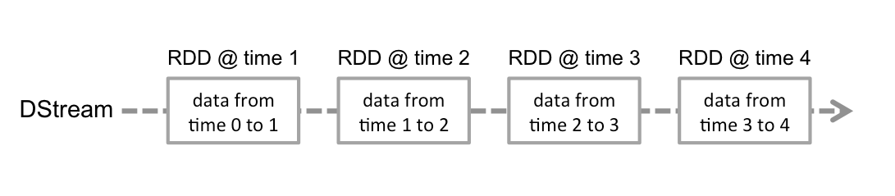
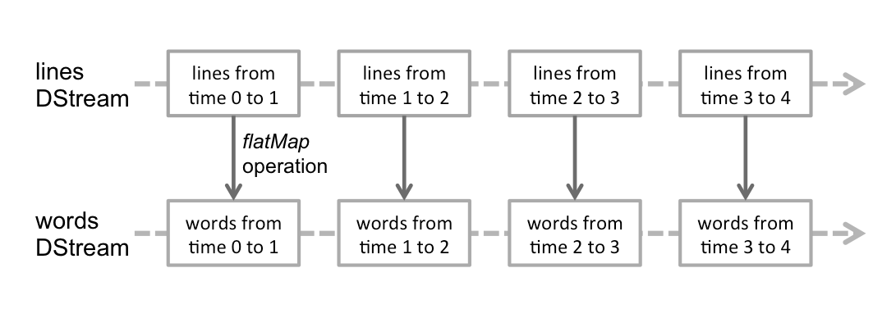
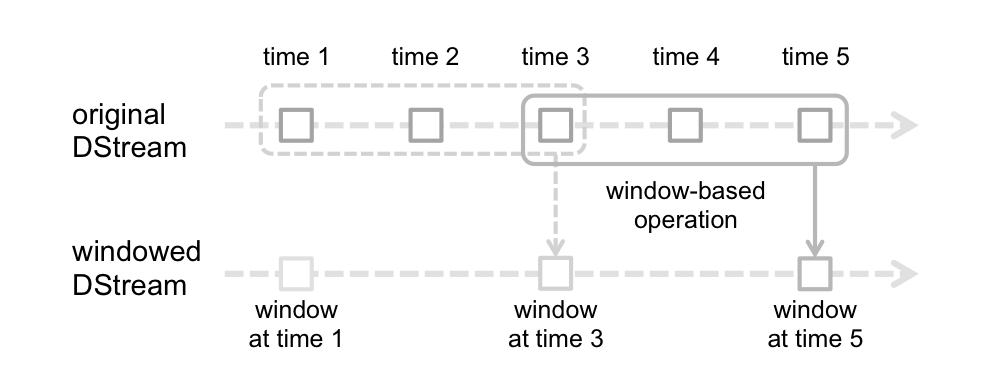

# 5.6 离散流的操作

Spark
Streaming 是基于离散流构建的，离散流是数据流的一种基本抽象，表示连续的、分批次的数据流。在内部，离散流由连续的一系列 RDD 组成，这是 Spark 不可变的分布式数据集，离散流中的每个 RDD 都包含一定时间间隔的数据，如图例 5‑7 所示。

<p align="center"></p>
<p align="center">图例 5‑7 一定时间段的数据流</p>


对离散流应用的任何操作都将转换为底层RDD上的操作，例如将输入流lines通过flatMap()转换为包含单词的离散流words，如下图所示：

<p align="center"></p>
<p align="center">图例 5‑8 对每个时间段的数据进行转换操作</p>


离散流本质上根据时间间隔不断的将数据流划分为较小的块，称为微批（Micro-Batch），将每个单独的微批实现为RDD，然后将其作为常规RDD进行处理。每个这样的微批处理都是独立处理的，微批处理之间不会保持任何状态，从而使处理本质上是无状态的。假设批处理间隔为5秒，然后在消耗事件时，每隔5秒创建一个微批，并将微批移交给RDD进行进一步处理。Spark
Streaming的主要优点之一是，处理微批的API与Spark紧密地集成到一起，并与Spark的其余组件无缝结合。

  - 每个离散流中的批代表一个RDD，这句话对吗？

我们已经了解了Spark
Streaming的核心概念DStream，以及如何将微批执行模型与函数编程API融合在一起，从而为Spark上的流处理提供了完整的基础。接下来，我们将探究Spark
Streaming通过DStream抽象提供的API，以流方式实现任意复杂的业务逻辑。从API的角度来看，DStream将其大部分工作委托给Spark中的基础数据结构RDD，所以理解RDD概念和及其API对于理解DStream的工作方式至关重要，离散流上的转换类似于Spark核心RDD的转换。RDD是一个单一的数据结构，作为其API和库的基本元素，也是一个表示一堆元素的多态集合，其中要分析的数据表示为任意Scala类型。数据集分布在集群的执行器上，并使用这些机器进行处理。自从Spark
SQL引入以来，DataFrame和Dataset抽象成为Spark的推荐编程接口。在最新版本中，仅函数库程序员才需要了解RDD
API。尽管RDD在接口级别上并不经常可见，但它们仍可驱动核心引擎的分布式计算功能。为了了解Spark的工作原理，建议通过前面几章了解RDD级别编程的一些基本知识。

### 5.6.1 基本操作

DStream编程API由转换或高阶函数组成，并将另一个函数作为参数。在API级别，DStream
\[T\]是强类型数据结构，表示类型T的数据流。DStream是不可变的，这意味着我们无法在适当位置更改其内容。相反，我们通过对输入DStream进行一系列转换来实现预期的应用程序逻辑。每次转换都会创建一个新的DStream，用来表示来自父DStream转换后的数据。DStream转换是惰性的，这意味着在系统需要具体化结果之前，实际不会处理原始数据。
对于DStream，当我们想通过输出操作向流接收器生成结果时，将触发此数量流的处理过程。

DStream 是一种数据流的抽象，其中的元素在时间维度上分为微批，每个微批由 RDD 表示，如图例 5‑7 所示。在执行级别，Spark Streaming 的主要任务是计划和管理数据块的及时收集，并把它们交付给 Spark 核心引擎，再由后者把操作序列应用到数据上，构成应用程序逻辑。

由于离散流由RDD组成，因此转换也适用于每个RDD生成转换后的RDD，然后创建转换后的离散流，每次转换都会创建特定的离散流派生类。与RDD类似，转换允许修改来自输入离散流的数据。离散流支持常规RDD上可用的以元素为中心的转换，从而在Spark中统一了批处理和流模式之间的开发经验。一些常见的转换如下，通过删除隐式参数来简化签名：

  - map\[U\](mapFunc:(T)=\>U):DStream\[U\]

通过传递源离散流的每个元素到函数mapFunc进行运算，返回一个新的离散流，而RDD结构保持不变。像在RDD中一样，这种转换适合进行大规模并行操作，因为其输入是否处于特定位置相对于其余数据并不重要。

  - flatMap\[U\](flatMapFunc: (T) ⇒ TraversableOnce\[U\]):DStream\[U\]

与map类似，但每个输入项可以映射到0个或更多的输出项。flatmap()不返回U类型的元素，而是返回一个TraversableOnce\[U\]类型，所有Scala集合都实现了TraversableOnce接口，可用作此函数的目标类型。

  - mapPartitions\[U\](mapPartFunc: (Iterator\[T\]) ⇒ Iterator\[U\],
    preservePartitioning: Boolean = false): DStream\[U\]

就像在RDD上定义的同名函数一样，使我们可以直接在RDD的每个分区上应用映射操作，结果产生一个新的DStream
\[U\]。此函数很有用，因为它使我们可以执行特定于执行器的行为。也就是说，某些逻辑不会对每个元素重复执行，而是会对处理数据的每个执行器执行一次。一个经典的示例是初始化随机数生成器，然后将其用于分区上的每个元素，可通过Iterator\[T\]访问；另一个有用的情况是减少昂贵资源（例如服务器或数据库连接）的创建，并重用此类资源来处理每个输入元素。
另一个优点是，初始化代码直接在执行程序上运行，使我们可以在分布式计算过程中使用不可序列化的库。

  - filter(filterFunc: (T) ⇒ Boolean): DStream\[T\]

通过仅选择filterFunc返回true的源离散流的记录来返回新的离散流。

  - repartition(numPartitions: Int): DStream\[T\]

通过创建更多或更少的分区来更改此离散流中的并行级别。

  - union(that: DStream\[T\]): DStream\[T\]

返回一个新的离散流，它包含源离散流和另一个离散流中元素的并集。

  - count(): DStream\[Long\]

通过计算源离散流的每个RDD中的元素数量，返回单元素RDD的新离散流。

  - reduce(reduceFunc: (T, T) ⇒ T): DStream\[T\]

通过使用函数func
（其接受两个参数并返回一个）聚合源离散流的每个RDD中的元素来返回单个元素RDD的新离散流。该函数应该是关联的和可交换的，以便可以并行计算。

  - countByValue(numPartitions: Int = ssc.sc.defaultParallelism):
    DStream\[(T, Long)\]

当调用K类元素的离散流时，返回新的(K, Long)键值对DStream，其中每个键的值是源离散流的每个RDD中键的频次。

  - reduceByKey(reduceFunc: (V, V) ⇒ V, numPartitions: Int):
    DStream\[(K, V)\]

当调用(K, V)键值对离散流时，返回新的(K,
V)键值对离散流，其中使用给定的reduce函数聚合每个键的值。默认情况下，它使用Spark的默认并行任务数进行分组。本地模式任务数为2；集群模式中的数字由配置属性spark.default.parallelism确定。可以传递可选的numPartitions参数来设置不同数量的任务。

  - join\[W\](other: DStream\[(K, W)\], numPartitions: Int):
    DStream\[(K, (V, W))\]

当包含(K, V)和(K, W)键值对的两个离散流被调用时，返回一个新的(K, (V, W))键值对离散流，每个键对应所有的元素。

  - cogroup\[W\](other: DStream\[(K, W)\], numPartitions: Int):
    DStream\[(K, (Iterable\[V\], Iterable\[W\]))\]

当调用(K, V)和(K, W)对的DStream时，返回一个新的DStream(K, Seq \[V\], Seq \[W\])元组。

### 5.6.2 transform

回顾上面的代码，我们看到这些转换操作是针对单个元素进行的，例如经典的map()，filter()等。这些操作遵循相同的分布式执行原则，并遵守相同的序列化约束。还有一些操作，例如transform()和foreachRDD()，它们是针对RDD而不是元素进行操作。这些操作由Spark
Streaming调度程序执行，并且提供给这些操作的函数在驱动程序中。在这些操作的范围内，我们可以实现跨越微批处理范围的逻辑，例如簿记历史或维护应用程序级计数器。它们还提供对所有Spark执行上下文的访问。在这些运算符中，我们可以与Spark
SQL、Spark
ML进行交互，甚至管理流应用程序的生命周期。这些操作是循环流式微批处理调度，元素级转换和Spark运行时上下文之间的真正桥梁。

transform()允许将任意的RDD转换方法应用于离散流：

  - transform\[U\](transformFunc: (RDD\[T\]) ⇒ RDD\[U\]: DStream\[U\]

  - transform\[U\](transformFunc: (RDD\[T\], Time) ⇒ RDD\[U\]):
    DStream\[U\]

Spark Streaming 为 `transform()` 提供了两种函数签名：一种只接收当前批次的 `RDD[T]`，另一种同时接收 `RDD[T]` 与批次时间 `Time`。它的价值在于：当 DStream API 本身没有直接暴露某个操作时，我们仍然可以退回到底层 RDD 级别处理。典型用法包括把当前批次和一份外部数据集做关联、按批次时间应用不同逻辑，或临时调整分区和广播变量。下面的例子就利用 `transform()` 把键值为 `Hello` 的结果过滤掉。
```scala
import org.apache.spark.SparkConf
import org.apache.spark.streaming.{Seconds, StreamingContext}

object TransformFilterWord {
  def main(args: Array[String]): Unit = {
    val conf = new SparkConf()
      .setMaster("local[2]")
      .setAppName("TransformFilterWord")

    val ssc = new StreamingContext(conf, Seconds(5))
    val lines = ssc.socketTextStream("localhost", 9999)
    val words = lines.flatMap(_.split(" "))
    val pairs = words.map(word => (word, 1))
    val wordCounts = pairs.reduceByKey(_ + _)

    val cleanedDStream = wordCounts.transform { rdd =>
      rdd.filter(a => !a._1.equals("Hello"))
    }

    cleanedDStream.print()
    ssc.start()
    ssc.awaitTermination()
  }
}
```

我们可以参考 和 的执行过程来验证上面的 `transform()` 方法的运行结果。使用 `docker exec` 命令进入容器后，在另一终端运行 Spark 应用程序并观察结果：
```bash
spark-submit --class TransformFilterWord \
  /data/application/simple-streaming/target/scala-2.13/simple-streaming_2.13-0.1.jar \
  localhost 9999
```

### 5.6.3 连接操作

值得强调的是可以轻松地在Spark 数据流中执行不同种类的连接，流可以非常容易地与其他流连接。
```scala

val stream1: DStream\[String, String\] = ...

val stream2: DStream\[String, String\] = ...

val joinedStream = stream1.join(stream2)

```


在中，由stream1生成的RDD将与stream2生成的RDD相连，默认innerJoin，也可以做leftOuterJoin，rightOuterJoin，fullOuterJoin。此外，在数据流的窗口上进行联接通常是非常有用的。这也很容易。
```scala

val windowedStream1 = stream1.window(Seconds(20))

val windowedStream2 = stream2.window(Minutes(1))

val joinedStream = windowedStream1.join(windowedStream2)

```


这是另一个连接窗口流与数据集的例子，使用了之前已经说明的transform()操作。
```scala
val dataset: RDD[(String, String)] = ...
val windowedStream = stream.window(Seconds(20))

val joinedStream = windowedStream.transform { rdd =>
  rdd.join(dataset)
}
```


如果外部数据集会随时间变化，也可以在 `transform()` 中按批次重新读取或更新引用。因为该函数会在每个批次间隔上重新执行，所以它拿到的始终是当前那一版数据集。

### 5.6.4 SQL操作

在 DStream 上也可以使用 DataFrame 和 SQL，只是思路和 Structured Streaming 不同：这里不是直接在“流式 DataFrame”上持续查询，而是把每个批次里的 RDD 单独转成 DataFrame，再注册成临时表后执行 SQL。为了在驱动故障恢复后仍能重新拿到 `SparkSession`，常见做法是使用延迟实例化的单例。下面的例子就把前面的单词统计改写成“每个批次转 DataFrame，再用 SQL 聚合”。
```scala
val words: DStream[String] = ...

words.foreachRDD { rdd =>
  // Get the singleton instance of SparkSession
  val spark = SparkSession.builder
    .config(rdd.sparkContext.getConf)
    .getOrCreate()

  import spark.implicits._

  // Convert RDD[String] to DataFrame
  val wordsDataFrame = rdd.toDF("word")

  // Create a temporary view
  wordsDataFrame.createOrReplaceTempView("words")

  // Do word count on DataFrame using SQL and print it
  val wordCountsDataFrame =
    spark.sql("select word, count(*) as total from words group by word")

  wordCountsDataFrame.show()
}
```


也可以在表上运行SQL查询，表是在不同线程的流数据定义的，即异步运行的StreamingContext。我们需要确保设置StreamingContext记住足够量的流数据，使得查询可运行。否则没有感知到任何异步SQL查询，StreamingContext会删除掉之前查询已经完成的旧流数据。例如如果想查询的最后一个数据批，但查询需要花5分钟来运行，我们可以调用streamingContext.remember(Minutes(5))。

### 5.6.5 输出操作 

输出操作允许离散流中的数据推给外部系统，如数据库或文件系统。由于输出操作实际上允许转换后的数据通过外部系统使用，所以它们引发的所有离散流转换的实际执行，类似RDD操作中的动作，目前包括以下输出操作：

  - print()

在运行流应用程序的驱动程序节点上，打印离散流中每批数据的前十个元素。这对开发和调试很有用。

  - saveAsTextFiles(prefix，\[suffix\])

将此离散流的内容另存为文本文件，每个批处理间隔的文件名是根据前缀和后缀prefix-TIME\_IN\_MS \[.suffix\]生成的。

  - saveAsObjectFiles(prefix，\[suffix\])

将此离散流的内容另存为序列化Java对象，每个批处理间隔的文件名是根据前缀和后缀prefix-TIME\_IN\_MS
\[.suffix\]生成的。

  - saveAsHadoopFiles(prefix，\[suffix\])

将此离散流的内容另存为Hadoop文件，每个批处理间隔的文件名是根据前缀和后缀prefix-TIME\_IN\_MS
\[.suffix\]生成的。

  - foreachRDD(func)

`foreachRDD(func)` 是 DStream 最通用的输出运算符。它会在每个批次到来时把当前 RDD 交给 `func` 处理，因此特别适合把结果写到文件、数据库、消息系统或其他外部服务。需要注意的是，`func` 本身运行在驱动进程中，而真正的数据处理仍发生在 RDD 的动作触发之后。也正因为它太灵活，`foreachRDD` 很容易被写成低效甚至不安全的外部输出逻辑，所以下面会专门强调几类常见误区。

常常将数据写入到外部系统需要创建一个连接对象，例如TCP连接到远程服务器，并用它来将数据发送到远程系统。为此，开发人员可能会不经意地尝试在Spark驱动程序创建一个连接对象，然后尝试使用它在Spark工作节点上保存RDD记录。
```scala
dstream.foreachRDD { rdd =>
  val connection = createNewConnection() // executed at the driver

  rdd.foreach { record =>
    connection.send(record) // executed at the worker
  }
}
```


是不正确的，这需要被序列化，并将连接对象从驱动程序发送到工作节点，这样的连接对象在跨机器之间是不能转换的。这种错误可能表现为序列化错误（连接对象是不可序列化的）和初始化错误（需要在工作节点初始化连接对象）等。正确的解决办法是在工作节点创建连接对象（），然而这可能会导致另一个常见的错误，为每个记录创建一个新的连接：
```scala
dstream.foreachRDD { rdd =>
  rdd.foreach { record =>
    val connection = createNewConnection()
    connection.send(record)
    connection.close()
  }
}
```


通常情况下，创建一个连接对象有时间和资源开销，因此创建和销毁每个连接对象可以招致不必要的高开销并能显著降低系统的整体吞吐量。一个更好的解决方案是使用foreachPartition()来创建一个单一的连接对象，并使用该连接在RDD分区中发送所有记录。
```scala
dstream.foreachRDD { rdd =>
  rdd.foreachPartition { partitionOfRecords =>
    val connection = createNewConnection()
    partitionOfRecords.foreach(record => connection.send(record))
    connection.close()
  }
}
```


上面的代码进行摊销多条记录建立连接的开销。最后，这可以进一步优化，通过在每个批次的多个RDD上重新使用的连接对象，可以维持的连接对象静态池，被推出来作为外部系统被多个批次的RDD重用，从而进一步降低了开销。
```scala
dstream.foreachRDD { rdd =>
  rdd.foreachPartition { partitionOfRecords =>
    // ConnectionPool is a static, lazily initialized pool of connections
    val connection = ConnectionPool.getConnection()
    partitionOfRecords.foreach(record => connection.send(record))
    ConnectionPool.returnConnection(connection) // return to the pool for future reuse
  }
}
```


在池中的连接应该按需延迟创建，并且如果一段时间不使用进行超时处理。这实现了数据到外部系统最有效地传送。

其他还需要注意的：离散流通过输出操作被执行，就像RDD的动作，具体而言就是在离散流输出操作内的RDD动作迫使所接收的数据处理。因此，如果的应用程序没有任何输出操作，或只有一个输出操作foreachRDD()但是其中没有任何RDD行动，那么什么都不会得到执行。该系统将简单地接收数据并丢弃。默认情况下，输出的动作一次执行一个，以应用程序中定义的顺序执行。

### 5.6.6 窗口操作 

流处理系统通常处理实时发生的行动，如社交媒体消息，网页点击、电子商务交易，金融事件或传感器读数也是此类事件的常见例子，我们可能有兴趣查看最近一段时间内发生的事件，例如最后15分钟或最后一个小时，甚至两者都可以。此外，流处理系统应该长时间运行，处理连续的数据流。随着这些事件的不断出现，较旧的事件通常与我们要完成的任何处理都越来越不相关，所以需要定期的和基于时间的数据流操作，可以称之为基于时间窗口的操作，如果是执行聚合操作就是每X时间段进行分组，例如每小时最大和最低环境温度或每15分钟的总能耗都是窗口聚合的操作。如果时间段是连续且不重叠的，可以称此为固定时间段的分组，其中每个组都跟随前一个组并且不重叠，从而使时间窗口滚动。当我们需要定期生成数据汇总时选择使用滚动窗口，每个周期都独立于以前的周期。滑动窗口是一段时间内的聚合，报告周期比聚合周期要短。滑动窗口具有两个时间规格的聚合：窗口长度和报告周期，它通常解读为每隔时间周期X进行一次聚合函数的报告，聚合函数本身的周期为Y，X\<Y，例如对过去一天的平均股价每小时报告一次。我们可能已经注意到，如果将滑动窗口与平均值函数进行组合就是滑动窗口最广为人知的形式，通常称为移动平均值。

Spark
Streaming提供窗口处理，可让我们在事件的滑动窗口上应用转换，在指定的间隔内创建滑动窗口。每次窗口在源离散流上滑动时，落入特定窗口的RDD将被合并和操作产生窗口化离散流，下图说明了这个滑动窗口。

<p align="center"></p>
<p align="center">图例 5‑9 Spark流的窗口操作</p>


如图例 5‑7 所示，每当窗口滑过源离散流时，落在窗口内的源 RDD 会被组合起来并进行操作，从而产生窗口化的离散流。图中的操作使用最近 3 个时间单位的窗口数据，并以 2 个时间单位滑动这个窗口，因此任何窗口操作都需要指定两个参数：

（1）窗口长度（Window Length），表示窗口持续时间，图例 5‑9 中为 3。

（2）滑动间隔（Sliding Interval），表示执行窗口操作的时间间隔，图例 5‑9 中为 2。

这两个参数都必须是源离散流批次间隔的整数倍，图例 5‑9 中源离散流的批次间隔为 1。下面继续扩展前面的示例（），演示如何在持续 30 秒的数据上每隔 10 秒生成一次单词统计；实现时可以使用 `reduceByKeyAndWindow` 操作。
```scala
val windowedWordCounts = words
  .map(x => (x, 1))
  .reduceByKeyAndWindow(_ + _, Seconds(30), Seconds(10))
```


下面是一些常见的窗口操作，所有这些操作都使用了上述两个参数：窗口长度（windowLength）和滑动间隔（slideInterval）：

  - window（windowLength，slideInterval）

返回基于源离散流的窗口批次创建的新离散流。

  - countByWindow(windowLength，slideInterval)

返回流中元素的滑动窗口数。

  - reduceByWindow(func，windowLength，slideInterval)

返回一个新的单元素流，通过使用func在滑动间隔内通过流中的元素聚合创建。该函数应该是关联的和可交换的，以便它可以并行计算。

  - reduceByKeyAndWindow(func，windowLength，slideInterval，\[numTasks\])

当在键值对(K, V)离散流上调用时，返回一个新的键值对(K,
V)离散流，其中每个键的值使用给定的聚合函数在滑动窗口的批次中进行计算。默认情况下，它使用Spark的默认并行任务数进行分组（2为本地模式，集群模式中的数字由config属性spark.default.parallelism确定），也可以设置可选的numTasks参数来设置不同数量的任务。

  - reduceByKeyAndWindow(func，invFunc，windowLength，slideInterval，\[numTasks\])

这个版本更高效，因为它不会在每次窗口滑动时都从头重算，而是基于上一轮窗口结果做增量更新：把新进入窗口的数据加进来，再把滑出窗口的旧数据“减出去”。这种写法只适用于存在逆操作的聚合函数，也就是必须提供 `invFunc`。和上一种方法一样，任务并行度可以通过可选参数调整；另外，使用这一增量窗口操作时必须启用检查点。

  - countByValueAndWindow(windowLength，slideInterval，\[numTasks\])

当在键值对(K,
V)离散流上调用时，返回一个新的键值对(K,Long)离散流，其中每个键对应的值是键在滑动窗口内的频次。像reduceByKeyAndWindow一样，通过可选参数可以配置聚合信任务的数量。

### 5.6.7 有状态转换

在 DStream 模型里，转换大体可以分成两类：无状态转换和有状态转换。无状态转换只关心当前这个微批内部的数据，例如 `map()`、`flatMap()`、`union()`、`join()`、`reduceByKey()`；每一批的处理结果都不依赖前一批发生过什么。有状态转换则不同，它需要把前面批次中累积下来的信息一起带入当前计算，例如窗口统计、累计计数、会话状态或其他跨批次聚合。`countByValueAndWindow()`、`reduceByKeyAndWindow()`、`mapWithState()`、`updateStateByKey()` 都属于这一类。只要计算结果需要记住过去的某些状态，就应该把它看成有状态处理。

许多复杂的数据流处理管道必须在一段时间内保持状态，例如需要实时了解网站上的用户行为，则必须将网站上每个用户会话的信息保持为持久状态，并根据用户的操作持续更新此状态，这种有状态的数据流式计算可以使用其updateStateByKey()操作实现。

  - updateStateByKey\[S\](updateFunc: (Iterator\[(K, Seq\[V\],
    Option\[S\])\]) ⇒ Iterator\[(K, S)\], partitioner: Partitioner,
    rememberPartitioner: Boolean, initialRDD: RDD\[(K, S)\]):
    DStream\[(K, S)\]

返回一个新的“状态”离散流，其中更新每个键的状态，通过在这个键上先前状态和这个键的新值上应用给定的方法。这可以用来维护每个键的任意状态数据，参数定义如下：

  - > S：状态类型

  - > updateFunc：状态更新方法。请注意，该方法可能会使用与输入键不同的键生成不同的元组。因此，键可能以这种方式被删除或添加键。开发人员决定是否记住分区器，尽管键被改变了。

  - > partitioner：用于控制新离散流中每个RDD分区的分区器。

  - > rememberPartitioner：是否记住生成的RDD中的分区对象。

  - > initialRDD：每个键的初始状态值。

有些场景需要把前一批次留下的状态继续带到下一批次使用。例如，单词 “Apache” 在上一个批次里出现过 1 次，如果下一批次又出现一次，我们希望把累计结果更新为 2，而不是重新从 1 开始计算。`updateStateByKey(func)` 解决的就是这类“跨批次累积状态”的问题，下面的代码给出最基本的实现方式：
```scala
import org.apache.spark.SparkConf
import org.apache.spark.streaming.{Seconds, StreamingContext}

object StatefulNetworkWordCount {
  def main(args: Array[String]): Unit = {
    val conf = new SparkConf()
      .setMaster("local[2]")
      .setAppName("StatefulNetworkWordCount")

    val ssc = new StreamingContext(conf, Seconds(5))
    ssc.checkpoint(".")

    val lines = ssc.socketTextStream("localhost", 9999)
    val words = lines.flatMap(_.split(" "))
    val pairs = words.map(word => (word, 1))
    val runningCounts = pairs.updateStateByKey[Int](updateFunction _)

    runningCounts.print()
    ssc.start()
    ssc.awaitTermination()
  }

  def updateFunction(
    newValues: Seq[Int],
    runningCount: Option[Int]
  ): Option[Int] = {
    val newCount = runningCount.getOrElse(0) + newValues.sum
    Some(newCount)
  }
}
```


我们可以参考 和 的执行过程来验证上面的 `updateStateByKey()` 方法的运行结果。使用 `docker exec` 命令进入容器后，在另一终端运行 Spark 应用程序并观察结果：
```bash
spark-submit --class StatefulNetworkWordCount \
  /data/application/simple-streaming/target/scala-2.13/simple-streaming_2.13-0.1.jar \
  localhost 9999
```


updateStateByKey(func)操作允许在使用新的信息持续更新时保持任意状态，要使用这个方法将必须做两个步骤：定义可以是任意数据类型的状态；指定函数如何更新状态，函数中使用以前的状态以及来自输入流的新值。

对于每个批次，Spark将对所有现存的键应用状态更新方法func，无论它们是否在一个数据批中有新数据。如果更新方法返回None，则键值对将被消除。假设想保持在文本数据流中每个单词的累计频次，在中，updateFunction(func)方法应用于pairs离散流上，pairs包含单词键值对(word,
1)，对每个单词调用更新方法。累计频次runningCount:
Option\[Int\]是原来的状态，被定义为一个整数；newValues:
Seq\[Int\]是多个“1”的序列，每个“1”代表当前数据批中单词出现一次；newCount就是当前的状态，是原来状态与新值相加的结果。使用updateStateByKey()需要配置检查点目录，这在检查点将在后面的部分中详细讨论。

生成环境的流式应用必须全天候运行，因此对于跟应用逻辑无关的失败必须是弹性的，例如系统故障、JVM崩溃等。为了使这成为可能，Spark流应用程序需要检查点获得足够的信息来容错存储系统，使得它可以从故障中恢复。有两种类型的数据可以被设置检查点：

  - 元数据检查点

保存定义流计算的信息到容错存储上（例如HDFS），这是用来从运行流式应用的驱动程序节点的故障中恢复。元数据包括用于创建流应用程序的配置；定义流应用程序的离散流操作；未完成批次，批次的作业进入到队列中但尚未完成。

  - 数据检查点

将生成的RDD保存到可靠存储中，对于跨越多个批次合并数据的有状态转换，这是一种必要的条件。在这样的转化中，所生成的RDD取决于前面的批次的RDD，这会导致依赖链的长度随时间的增加而变长。为了避免恢复时间（正比于依赖链）无限制的增加，有状态转换的中间RDD被周期性地通过检查点保存到可靠的存储上以切断依赖链。

可以把检查点理解成两层保障：元数据检查点主要负责在驱动程序失败后恢复流式作业本身的定义和进度；而数据/RDD检查点主要负责切断有状态计算不断增长的依赖链。如果应用里使用了有状态转换，或者明确要求从驱动程序故障中恢复，那么检查点就不是可选项，而是必须启用的基础设施。

  - 有状态转换的使用

如果任何一个updateStateByKey()或reduceByKeyAndWindow()在应用程序中被使用，则必须提供检查点的目录，以允许定期检查点RDD。

  - 从运行应用程序的驱动程序上进行故障恢复

元数据检查点使用进度信息进行恢复。

检查点可以通过在容错，可靠的文件系统（例如HDFS等）上设定一个目录，检查点信息将被保存，通过使用streamingContext.checkpoint(checkpointDirectory)方法完成，这将允许使用有状态的转换。此外，如果想使应用程序可以从驱动程序故障中恢复，应该重写流应用程序，使其有以下行为：

（1）当应用程序被首次启动，它会创建一个新的StreamingContext，设置好所有的数据流，然后调用start()。

（2当应用程序失败后重新启动，这将从检查点目录中的数据重新创建StreamingContext。

这种“首次创建、失败后从检查点恢复”的行为，通常通过 `StreamingContext.getOrCreate()` 实现：
```scala
// Function to create and setup a new StreamingContext
def functionToCreateContext(): StreamingContext = {
  val ssc = new StreamingContext(...) // new context
  val lines = ssc.socketTextStream(...) // create DStreams
  ...
  ssc.checkpoint(checkpointDirectory) // set checkpoint directory
  ssc
}

// Get StreamingContext from checkpoint data or create a new one
val context = StreamingContext.getOrCreate(
  checkpointDirectory,
  functionToCreateContext _
)

// Do additional setup on context that needs to be done,
// irrespective of whether it is being started or restarted
context ...

// Start the context
context.start()
context.awaitTermination()
```


如果 `checkpointDirectory` 已经存在，那么上下文会直接从检查点中重建；如果目录不存在，也就是第一次运行，则会调用 `functionToCreateContext` 创建新的上下文并重新定义各条 DStream。除了 `getOrCreate()`，还要配合底层部署环境确保驱动故障后能够自动重启，否则恢复逻辑本身无从触发。

需要注意，RDD 检查点并不是免费的。它会把中间状态写入可靠存储，因此可能拉长某些批次的处理时间；但如果检查点间隔过长，又会让 RDD 谱系和任务规模持续增长。对需要检查点的有状态转换来说，默认间隔通常至少是 10 秒，并且应当是批次间隔的整数倍；实践里，常把 5 到 10 个滑动间隔作为一个经验性的检查点周期，再根据延迟和容错要求继续调整。

另外，Spark Streaming 的检查点不会自动恢复累加器和广播变量。如果流作业同时依赖这些对象，就应把它们封装成延迟实例化的单例，以便在驱动重启后能够重新创建。下面的示例展示的就是这种写法。
```scala
object WordBlacklist {
  @volatile private var instance: Broadcast[Seq[String]] = null

  def getInstance(sc: SparkContext): Broadcast[Seq[String]] = {
    if (instance == null) {
      synchronized {
        if (instance == null) {
          val wordBlacklist = Seq("a", "b", "c")
          instance = sc.broadcast(wordBlacklist)
        }
      }
    }

    instance
  }
}

object DroppedWordsCounter {
  @volatile private var instance: LongAccumulator = null

  def getInstance(sc: SparkContext): LongAccumulator = {
    if (instance == null) {
      synchronized {
        if (instance == null) {
          instance = sc.longAccumulator("WordsInBlacklistCounter")
        }
      }
    }

    instance
  }
}

wordCounts.foreachRDD { (rdd: RDD[(String, Int)], time: Time) =>
  // Get or register the blacklist Broadcast
  val blacklist = WordBlacklist.getInstance(rdd.sparkContext)

  // Get or register the droppedWordsCounter Accumulator
  val droppedWordsCounter =
    DroppedWordsCounter.getInstance(rdd.sparkContext)

  // Use blacklist to drop words and use droppedWordsCounter to count them
  val counts = rdd.filter { case (word, count) =>
    if (blacklist.value.contains(word)) {
      droppedWordsCounter.add(count)
      false
    } else {
      true
    }
  }.collect().mkString("[", ", ", "]")

  val output = "Counts at time " + time + " " + counts
}
```


