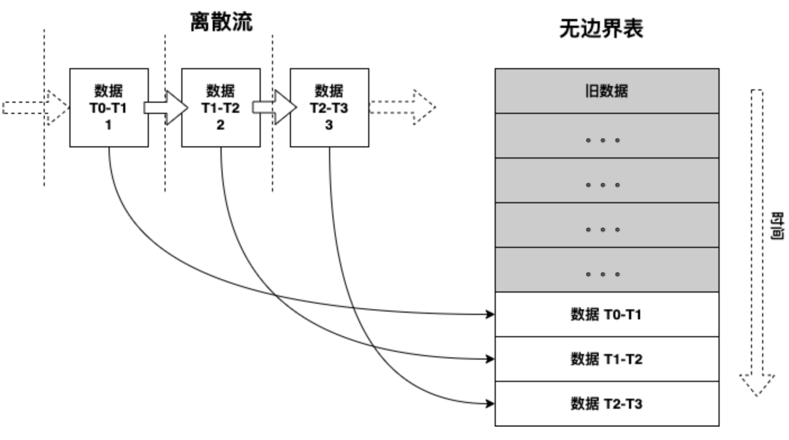
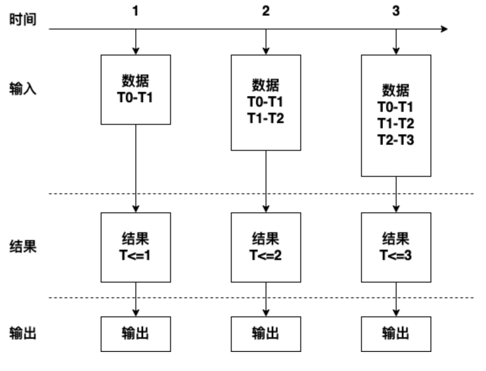
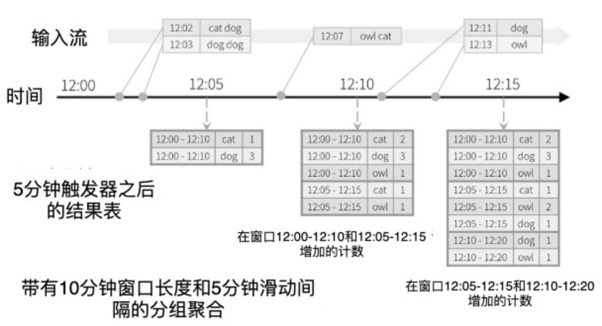
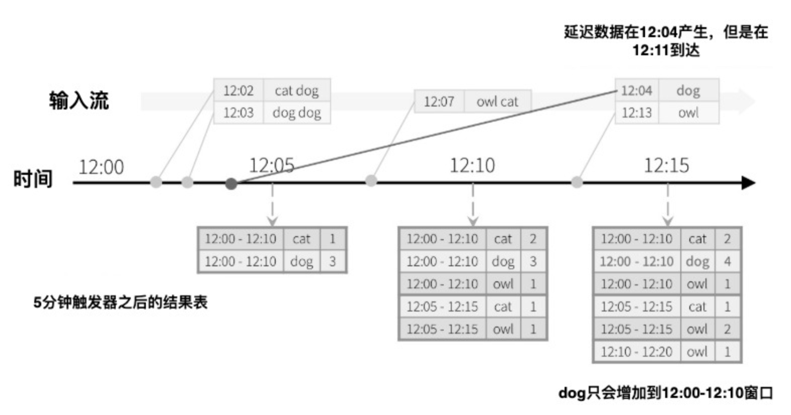

# 5.8 结构化流

本节开始进入本章推荐主线。Structured Streaming 建立在 Spark SQL 引擎之上，把流数据建模为持续追加的无界表，并用 DataFrame/Dataset 查询描述计算逻辑。这样一来，批处理与流处理在 API、优化器和运行时上尽量统一，开发者可以把重点放在业务逻辑、时间语义和状态管理上。

在 Spark 4.x 中，Structured Streaming 是生产系统的默认选择：它与 SQL、DataFrame/Dataset、Kafka 集成、窗口聚合、水位线、状态管理和 checkpoint 机制配合更自然。默认执行模式仍是微批；当场景需要时，可以在引擎能力和语义约束允许的范围内选择更低延迟的处理方式。

把它放回一个常见业务链路里理解会更直观：事件先从 Kafka、文件流或其他消息系统进入 Spark，再经过解析、过滤、时间窗口聚合和状态更新，最后把结果写到控制台、对象存储、数据库或下游分析系统。结构化流的价值，不在于“又多了一套流式 API”，而在于这条链路依然可以沿用 Spark SQL / DataFrame 的主线来表达，并把时间语义、容错恢复和持续输出收敛到统一模型里。

### 5.8.1 一个例子

先看一个最小的 Structured Streaming 例子：从 TCP 套接字持续接收文本，并实时统计单词出现次数。这个例子本身很简单，但它足够展示结构化流的基本组织方式: 创建 `SparkSession`，声明输入源，定义查询，再通过 `writeStream.start()` 启动持续运行的流查询。

import org.apache.spark.sql.functions.\_

import org.apache.spark.sql.SparkSession

val spark = SparkSession

.builder

.appName("StructuredNetworkWordCount")

.getOrCreate()

import spark.implicits.\_

代码 5‑19

接下来，创建一个流式 DataFrame，表示从 `localhost:9999` 持续到来的文本数据，并在其上定义拆词和聚合逻辑。

val lines = spark.readStream

.format("socket")

.option("host", "localhost")

.option("port", 9999)

.load()

val words = lines.as\[String\].flatMap(\_.split(" "))

val wordCounts = words.groupBy("value").count()

这里的 `lines` 可以理解为一张持续追加的无界表: 输入流里每到一行文本，这张表里就多一行数据。`as[String]` 把单列 DataFrame 转成便于函数式处理的 Dataset，然后用 `flatMap` 把一行文本拆成多个单词，再通过 `groupBy("value").count()` 定义持续更新的计数结果 `wordCounts`。到这一步为止，我们仍然只是在声明查询逻辑，真正的数据读取与计算，要等到 `writeStream.start()` 被调用之后才会开始。

val query = wordCounts.writeStream

.outputMode("complete")

.format("console")

.start()

query.awaitTermination()

执行上述代码后，流查询会在后台持续运行。`query` 是一个 `StreamingQuery` 句柄，可用于查看状态、停止查询或等待查询结束。这里调用 `awaitTermination()`，是为了让驱动程序保持运行，而不是在查询刚启动后立即退出。为了复现实验，可以先启动一个简单的 Netcat 文本服务，持续向 9999 端口写入测试数据：

docker exec -it spark /bin/bash

root@48feaa001420:\~\# { while :; do echo "Hello Apache Spark"; sleep
0.05; done; } | netcat -l -p 9999

代码 5‑20

命令中的 `spark` 是第一章介绍的 Docker 容器名。再打开另一个终端，通过下面的命令提交结构化流示例：

spark-submit --class StructuredNetworkWordCount
/data/application/simple-streaming/target/scala-2.13/simple-streaming\_2.13-0.1.jar
localhost 9999

代码 5‑21

第一个终端会持续写入 `Hello Apache Spark`，第二个终端则会按批次打印聚合结果，输出内容类似于：

Batch: 0

```text
-------------------------------------------
+-----+-----+
|value|count|
+-----+-----+
+-----+-----+
-------------------------------------------
Batch: 1
-------------------------------------------
+------+-----+
| value|count|
+------+-----+
|Apache| 927|
| Hello| 927|
| Spark| 927|
+------+-----+
```

代码 5‑22

这个例子最值得记住的，不是 socket 本身，而是结构化流的编程模型：`readStream` 负责声明输入，DataFrame/Dataset 变换负责声明查询，`writeStream` 负责声明输出，`start()` 才真正让查询进入持续运行状态。后续无论接 Kafka、文件流还是湖仓表，整体组织方式都保持一致。

### 5.8.2 工作机制

Structured Streaming 的核心思想，是把实时事件流看成一张持续追加的无界表，然后把流处理写成对这张表的增量查询。这样做的好处是，开发者不需要先学习一套完全不同的“流式专用 API”，而是可以继续沿用 Spark SQL、DataFrame 和 Dataset 的表达方式，只是在执行层面由引擎持续处理新到达的数据。



图例 5‑10 将新数据从离散流添加到无边界表

每次触发到来时，新数据会被追加到输入表中，增量执行逻辑会更新结果表。随后，引擎再把结果表中新产生或发生变化的部分写入外部接收器。图例 5‑11 展示了这一过程：



图例 5‑11 在无边界表上计算结果

随着输入流不断到达，结果表也会持续变化。Structured Streaming 通过不同的输出模式，控制“每次触发后究竟写出哪些结果”。最常见的模式包括 complete、append 和 update：

（1）完全模式（complete）表示每次都把整个结果表重新写出，适合控制台调试或小规模聚合结果展示。

（2）追加模式（append）表示只写出自上次触发以来新增的结果行，适合追加型结果不会被后续修改的场景。

（3）更新模式（update）表示只写出自上次触发以来被更新过的结果行。对于包含聚合或状态更新的查询，它通常比 complete 更节省输出成本；如果查询本身没有更新旧结果，那么它的行为会接近 append。

Structured Streaming 建立在 Spark SQL 的结构化 API 之上，因此天然继承了 Catalyst 优化器、Tungsten 执行引擎、统一数据源接口和跨语言使用方式。对开发者来说，这意味着“批处理里怎么组织 DataFrame 查询，流处理里就尽量怎么组织”；真正需要额外理解的部分，主要集中在事件时间、水位线、状态管理、输出模式和故障恢复。

Structured Streaming 的意义，在于它把流处理尽量拉回到了 Spark SQL / DataFrame 的主线里：同样的查询表达方式、同样的 Catalyst 优化思路、同样的数据源和输出接口。下面就按一个典型结构化流作业的组织顺序，来看它的编程模型：

  - 初始化Spark

  - 从源获取流数据

  - 定义要应用于流数据的操作

  - 输出结果数据

SparkSession 仍然是结构化流与批处理应用的统一入口，因此第一步依然是初始化 SparkSession。

import org.apache.spark.sql.SparkSession

val spark = SparkSession

.builder()

.appName("StreamProcessing")

.master("local\[\*\]")

.getOrCreate()

代码 5‑23

在 `spark-shell` 中，系统通常已经预先创建了名为 `spark` 的 SparkSession，因此不必重复初始化。接下来可以通过 `readStream()` 创建流式输入；`format()` 用来指定数据源类型，`schema()` 用来声明输入结构，这对文件流、JSON 等源尤其重要。

val fileStream = spark.readStream

.format("json")

.schema(schema)

.option("mode","DROPMALFORMED")

.load("/tmp/datasrc")

代码 5‑24

不同输入源支持的选项并不相同。上面的示例里，`mode = DROPMALFORMED` 表示丢弃既不符合 JSON 格式也不符合给定 schema 的记录。调用 `load()` 之后，Spark 返回的是一个流式 DataFrame 表示，而不是立刻读取完所有数据；真正的持续监听与处理，仍要等查询启动后才发生。

因此，创建流式 DataFrame 这一步本质上仍然是惰性的: 我们得到的是一份查询定义，可以继续在其上叠加过滤、投影、聚合和窗口等变换，而不会立刻触发数据消费。

在 Spark 4.x 中，常见流数据源包括 JSON、ORC、Parquet、CSV、text、textFile 等文件源，以及 socket、Kafka 和 rate。rate 数据源常用于压测和功能验证，它会按指定速率生成带时间戳与递增值的测试数据。

`load()` 返回的流式 DataFrame，后续就可以用 DataFrame 或 Dataset API 来描述业务逻辑。这里的取舍与第 4 章类似：DataFrame 更贴近 SQL 和优化器主线，Dataset 在 Scala 中可以提供更强的类型约束；如果表达式已经能用结构化列运算写清楚，优先保持在 DataFrame 主线里，通常更利于优化器理解。

假设我们正在处理传感器网络数据。代码 5-25 从 `sensorStream` 中选取 `deviceId`、`timestamp`、`sensorType` 和 `value` 四个字段，并过滤出温度值超过阈值的记录：

val highTempSensors = sensorStream

.select($"deviceId", $"timestamp", $"sensorType", $"value")

.where($"sensorType" === "temperature" && $"value" \> threshold)

代码 5‑25

除了逐条过滤，也可以按时间窗口聚合数据。下面的例子使用事件自带的时间戳定义一个 5 分钟窗口，并让窗口每 1 分钟滑动一次；窗口与事件时间、水位线之间的关系，会在后文专门展开。

val avgBySensorTypeOverTime = sensorStream

.select($"timestamp", $"sensorType", $"value")

.groupBy(window($"timestamp", "5 minutes", "1 minute"), $"sensorType")

.agg(avg($"value")

流式 DataFrame 或 Dataset 并不是所有批处理操作都支持。原因通常不是 API 缺失，而是某些操作对“无界数据”本身没有明确或可控的计算边界。常见限制包括：

（1）流式 Dataset 不支持多个流聚合（即在流式 DataFrame 上连续叠加聚合），

（2）流式 Dataset 不支持 `limit()` 和 `take(n)`，

（3）流式 Dataset 不支持无界意义下的 `distinct()`，

（4）只有在聚合之后且使用 complete 输出模式时，流式 Dataset 才支持 `sort()`，

（5）流式 Dataset 只支持受约束的一部分外连接场景。

此外，一些会“立刻执行并直接返回结果”的方法，也不适用于持续运行的数据流；这类需求通常应改写成显式的流式查询输出，例如：

（1）`count()` 不能直接从流式 Dataset 返回一个静态计数值，而应改写为 `ds.groupBy().count()` 这样的持续聚合，

（2）`foreach()` 应改用 `ds.writeStream.foreach()`，

（3）`show()` 这类即时展示需求，通常可用控制台 sink 代替。

如果直接调用这些不支持的操作，通常会看到 `AnalysisException`，提示某个操作不能用于 streaming DataFrame/Dataset。以排序为例，如果没有额外边界条件，引擎就必须记住迄今为止看到的全部数据，才能给出全局有序结果，这对无界数据来说通常不可行。不过，一旦问题被改写成“按窗口统计”或“按键聚合”，很多原本无法直接回答的问题就能转化为可持续维护的状态计算。代码 5-26 就定义了每类 `sensorType` 在每分钟窗口中的事件数。

val avgBySensorTypeOverTime = sensorStream

.select($"timestamp", $"sensorType")

.groupBy(window($"timestamp", "1 minutes", "1 minute"), $"sensorType")

.count()

代码 5‑26

以 `distinct()` 为例，如果要在无界流上做“全局去重”，系统理论上需要记住历史上出现过的所有记录，并让每条新记录与全部历史做比较，这会带来难以接受的存储和计算开销。更现实的做法，是基于业务键或时间范围做受控去重，例如：

stream.dropDuplicates("\<key-column\>")

代码 5‑27

到这里为止，我们介绍的仍然都是声明式查询: 数据从哪里来、经过哪些变换、最终要形成什么结果。真正启动查询之前，还需要把“结果写到哪里、以什么模式写、失败后如何恢复”这些运行时信息补齐：

（1）输出接收器的详细信息（format()方法和path选项），包括数据格式，位置等。

（2）输出模式（`outputMode()` 方法），决定每次触发后究竟写出完整结果、增量结果，还是被更新过的结果。

（3）查询名称（`queryName()` 方法，可选），用于在 Web UI、日志和内存 sink 中识别这条查询。

（4）触发策略（`trigger()` 方法，可选），决定查询多久检查一次新数据；如果不显式指定，系统会在上一轮处理完成后尽快进入下一轮。

（5）检查点位置（`checkpointLocation` 选项），用于保存进度、状态和恢复信息。生产环境里它通常应落在可靠的分布式存储上，例如 HDFS、对象存储或湖仓底层文件系统。

从 API 角度看，在流式 DataFrame 或 Dataset 上调用 `writeStream()` 后，会得到一个 `DataStreamWriter`。它负责配置输出格式、输出模式、触发策略、查询名称和 checkpoint 路径；只有在最后调用 `start()` 之后，整个流查询才会真正开始运行。

val query = stream.writeStream

.format("json")

.queryName("json-writer")

.outputMode("append")

.option("path", "/target/dir")

.option("checkpointLocation", "/checkpoint/dir")

.trigger(ProcessingTime("5 seconds"))

.start()

代码 5‑28

`format()` 用来指定输出接收器。在 Spark 4.x 中，常见 sink 包括：

  - 控制台接收器

将结果打印到标准输出，适合调试和教学演示，可通过 `numRows` 等选项控制显示行数。

  - 文件接收器

把结果写入文件系统或对象存储，常见格式包括 `csv`、`json`、`orc`、`parquet`、`avro` 和 `text`。

  - Kafka接收器

把结构化流结果写回一个或多个 Kafka 主题。

  - 内存接收器

用查询名创建内存表，便于在同一会话中调试和查看结果。

  - foreach接收器

按记录级别提供编程接口，适合把每条结果交给自定义逻辑处理。

  - foreachBatch接收器

按微批提供 DataFrame 级接口，适合把每个批次交给自定义写出逻辑或复用批处理代码。

`outputMode()` 用来指定“每次触发后到底写出哪些结果”。常见的三种模式如下：

  - 附加

（默认模式）只输出自上次触发以来新增且不会再被后续数据修改的结果，最适合追加型查询。

  - 更新

输出自上次触发以来新增或被更新过的结果，常用于聚合和状态计算。

  - 完全

每次触发都输出完整结果表，最适合控制台演示或低基数聚合场景；在结果集很大时，这种模式通常不够经济。

一旦查询里包含聚合，选择输出模式就要结合“结果是否还会被后续事件改写”来判断。以 append 为例，只有当系统能够确认某条聚合结果已经“定稿”时，它才适合被输出；这通常意味着查询使用了事件时间聚合，并且通过水位线给出了可接受的迟到范围。否则，系统无法判断未来是否还会有迟到事件来改写已有结果。

`queryName()` 可以给查询起一个可识别的名字，便于在 Web UI、日志和内存 sink 中定位。`option()` 或 `options()` 则用来传入 sink 相关配置，例如输出路径、checkpoint 路径、Kafka 参数等。`trigger()` 用来控制输出节奏；如果不显式指定，Structured Streaming 会在上一个批次处理完成后尽快检查新数据并启动下一次触发。常见触发方式包括：

（1）`ProcessingTime(<interval>)`：按给定时间间隔触发微批，是最常见的选择。

（2）`Once()`：执行一次流查询后退出，适合测试或把同一套流式定义当作一次性批任务运行。

（3）`Continuous(<checkpoint-interval>)`：切换到连续处理引擎以追求更低延迟，但能力边界和适用范围更严格，使用前应先确认当前场景与版本支持情况。

最后，调用 `start()` 才会真正启动流处理。它会把之前声明的输入、变换、输出和触发策略具体化为一个持续运行的查询，并返回 `StreamingQuery` 对象。借助这个对象，我们可以查询状态、停止任务、等待结束，也可以在同一个 SparkSession 中并行管理多个相互独立的流查询。

在生产环境里，还应把 checkpoint 目录视作“查询身份”的一部分。尤其是带状态的聚合、去重或流流 Join，一旦需要依赖 checkpoint 恢复，就不应随意修改会影响状态布局和任务切分的关键设置，例如 Shuffle 分区数、状态存储实现或多水位线策略；如果这些前提已经变化，更稳妥的做法通常是启用新的 checkpoint 目录重新启动查询。类似地，多条相互独立的流查询也不应共享同一个 checkpoint 路径，否则恢复语义会混在一起，排障会变得非常困难。

`queryName()` 在这里还有一个容易被低估的价值：当查询真正跑起来后，它不仅会出现在日志和内存 sink 里，也会出现在 Spark Web UI 的 Structured Streaming 视图中。排查“输入速率是否上来了、批次是否越跑越慢、状态算子是否膨胀”这类问题时，一个稳定且可识别的查询名会明显降低定位成本。

把这些运行时边界想清楚之后，再回头看窗口、水位线和事件时间语义，就更容易理解为什么 Structured Streaming 既强调声明式写法，又要求开发者对状态生命周期保持清醒。

### 5.8.3 窗口操作

事件时间是事件在业务世界中真正发生的时间，而不是 Spark 收到它的时间。对于很多流处理场景，我们关心的是“事件什么时候发生”，而不是“系统什么时候看到它”。例如监测物联网设备、天气站或交易流水时，网络链路质量和上报延迟都可能让事件乱序到达；如果只按处理时间统计，结果就会偏离业务事实。Structured Streaming 之所以强调事件时间，就是为了让开发者把时间语义显式写进查询里。

一旦把事件时间作为显式列来处理，窗口聚合就可以被理解为“按时间区间分组”。每个时间窗口都像一个特殊的分组键，一条记录可能同时属于多个滑动窗口，因此可以自然表达“过去 10 分钟、每 5 分钟滑动一次”这类统计需求。对开发者来说，这和按普通维度列做 `groupBy` 的思路是连续的，只是分组键从业务字段变成了时间窗口。

这个模型还天然支持迟到数据处理。只要某个旧窗口的状态还被保留，引擎就可以在迟到事件到达时继续修正它。问题在于，状态不能无限期保留，否则内存与状态存储会持续膨胀。水位线的作用，就是告诉引擎“可以接受多晚到的数据”，从而在正确性与资源占用之间做出明确权衡。

滑动事件时间窗口上的聚合，本质上仍然是在做 `groupBy`，只是分组键里多了一列“时间窗口”。比如我们把代码 5‑19 改成“统计单词在最近 10 分钟窗口中的出现次数，并每 5 分钟更新一次”，那么窗口 `[12:00,12:10)`、`[12:05,12:15)`、`[12:10,12:20)` 就会像普通分组键一样维护各自的聚合结果。一条在 `12:07` 到达的记录，例如单词 `(owl, cat)`，会同时落入前两个窗口，因此会同时更新这两个窗口里的计数。换句话说，结果表中的索引不再只是“单词”，而是“单词 + 事件时间窗口”这组联合键。



图例 5‑12 基于窗口操作的分组聚合

由于窗口化聚合和普通分组的思路是一致的，所以在代码里通常直接组合 `groupBy()` 与 `window()` 来表达（见代码 5‑26）。

// Split the lines into words, retaining timestamps

val words = lines.as\[(String, Timestamp)\].flatMap(line =\>

line.\_1.split(" ").map(word =\> (word, line.\_2))

).toDF("word", "timestamp")

// Group the data by window and word and compute the count of each group

val windowedCounts = words.groupBy(

window($"timestamp", windowDuration, slideDuration), $"word"

).count().orderBy("window")

代码 5‑29

在虚拟实验环境中，上面的应用已经完成编译和打包。为了复现实验，先在一个终端里启动 Netcat 作为文本输入源：

```bash
{ while :; do echo "Hello Apache Spark"; sleep 0.05; done; } | netcat -l -p 9999
```

代码 5‑30

再打开另一个终端，提交窗口版 Structured Streaming 程序：

```bash
spark-submit --class StructuredNetworkWordCountWindowed \
  /data/application/simple-streaming/target/scala-2.13/simple-streaming_2.13-0.1.jar \
  localhost 9999 10 5
```

代码 5‑31

这时，第一个终端会持续写入 “Hello Apache Spark”，第二个终端则会按窗口打印聚合结果，输出大致如下：

```text
-------------------------------------------
Batch: 0
-------------------------------------------
+------+----+-----+
|window|word|count|
+------+----+-----+
+------+----+-----+
-------------------------------------------
Batch: 1
-------------------------------------------
+------------------------------------------+------+-----+
|window |word |count|
+------------------------------------------+------+-----+
|[2020-04-03 09:08:35, 2020-04-03 09:08:45]|Apache|225 |
|[2020-04-03 09:08:35, 2020-04-03 09:08:45]|Hello |225 |
|[2020-04-03 09:08:35, 2020-04-03 09:08:45]|Spark |225 |
|[2020-04-03 09:08:40, 2020-04-03 09:08:50]|Apache|282 |
|[2020-04-03 09:08:40, 2020-04-03 09:08:50]|Spark |282 |
|[2020-04-03 09:08:40, 2020-04-03 09:08:50]|Hello |282 |
|[2020-04-03 09:08:45, 2020-04-03 09:08:55]|Hello |57 |
|[2020-04-03 09:08:45, 2020-04-03 09:08:55]|Spark |57 |
|[2020-04-03 09:08:45, 2020-04-03 09:08:55]|Apache|57 |
+------------------------------------------+------+-----+
```

代码 5‑32

现在考虑迟到事件的情况。假设流处理程序在 12:11 收到了一条事件时间为 12:04 的记录，那么正确的做法不是把它算进 12:11 所在的处理时刻，而是回到 12:00-12:10 这个事件时间窗口里更新旧结果。Structured Streaming 正是通过保留窗口状态，来支持这种“按业务时间回补”的计算方式，如图例 5‑13 所示。



图例 5‑13 在窗口分组聚合中处理延迟数据

如果查询要持续运行很多天，就必须控制状态大小。系统需要知道“某个旧窗口还能不能继续等待迟到数据”，否则所有历史窗口都要一直保留。水位线就是为此引入的机制：我们通过事件时间列和允许迟到的阈值，告诉引擎在多大范围内继续接受迟到数据。一旦窗口结束时间早于“当前最大事件时间减去迟到阈值”，对应状态就可以逐步清理；超出阈值才到达的事件，也会被视为过晚数据而不再纳入该窗口。下面的例子在前面的窗口查询上加上 `withWatermark()`，用来显式声明这一边界：

// Split the lines into words, retaining timestamps

val words = lines.as\[(String, Timestamp)\].flatMap(line =\>

line.\_1.split(" ").map(word =\> (word, line.\_2))

).toDF("word", "timestamp")

// Group the data by window and word and compute the count of each group

val windowedCounts = words

.withWatermark("timestamp", delayDuration)

.groupBy(

window($"timestamp", windowDuration, slideDuration), $"word"

).count().orderBy("window")

代码 5‑33

要在实验环境里验证这段代码，可以继续用下面的命令提交带水位线的版本：

```bash
spark-submit --class StructuredNetworkWordCountWindowedWaterMark \
  /data/application/simple-streaming/target/scala-2.13/simple-streaming_2.13-0.1.jar \
  localhost 9999 10 5
```

代码 5‑34
