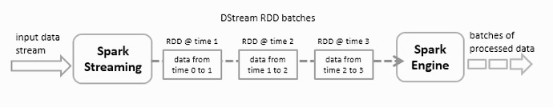
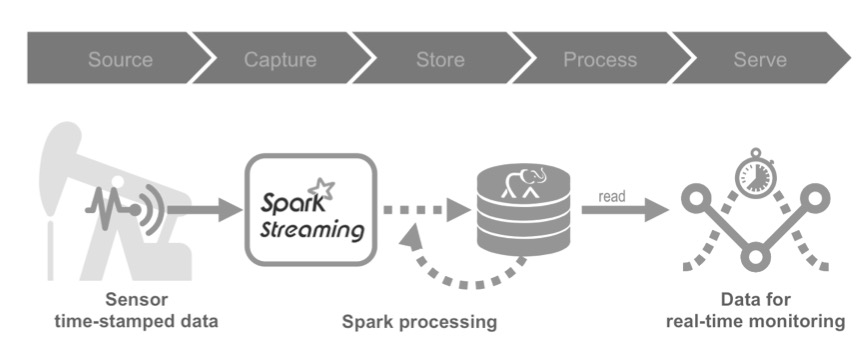
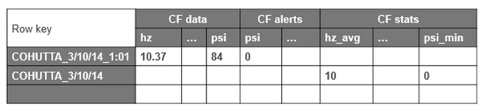
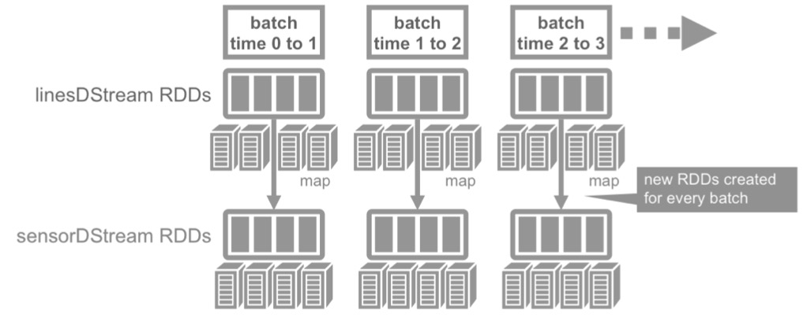
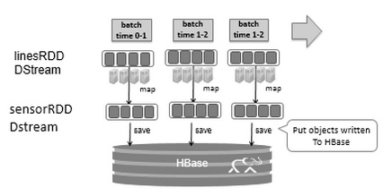
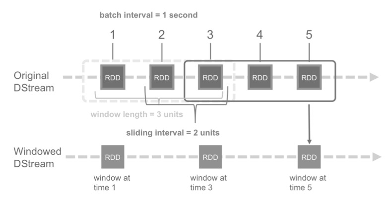

# 5.8 案例分析（DStream 历史案例）

本节保留一个基于 DStream + HBase 的历史工程案例，用来说明早期 Spark Streaming 如何围绕微批、目录监控和 `foreachRDD` 组织处理链路。它对理解存量系统仍然有价值，但不应被视为 Spark 4.x 新项目的默认模板；如果今天重新实现同类需求，应优先考虑 Structured Streaming、DataFrame/Dataset、checkpoint 与事件时间语义。

案例场景仍然采用油井传感器日志：持续接收设备上报数据，筛选告警事件，并把明细与汇总结果写入外部存储。这里保留 HBase 写入流程，目的是帮助读者读懂“Spark Streaming + HBase”这一类历史架构。典型实时用例包括：

  - 网站监控、网络监控

  - 欺诈识别

  - 网页点击

  - 广告

  - 物联网传感器

早期 Spark Streaming 会把连续到达的数据按固定时间间隔切成一批批小 RDD，这种抽象就叫 DStream。对开发者来说，它的编程体验很像“持续不断地处理一串按时间到达的 RDD”；每个批次里仍然使用熟悉的 Spark Core API，而微批调度负责把这些批次串起来持续执行。

<div align="center">

图例 5‑14 将数据流划分为X秒的批次
</div>

Spark Streaming 可以接入 HDFS 目录、TCP 套接字、Kafka、Flume 等输入源，再把结果写到文件系统、HDFS、数据库，或任何支持 Hadoop OutputFormat 的外部系统。理解这一点有助于读懂下面的历史案例：它本质上就是“以微批方式接入日志，再通过 RDD 转换和 `foreachRDD` 把结果落到外部存储”。

下面这个历史案例继续沿用 DStream + HBase 的组合，目的是说明一个典型微批流式应用怎样从输入流一路走到外部存储。示例背景是油井监控：钻井平台传感器持续产生日志数据，Spark Streaming 负责实时处理，再把结果写入 HBase，供后续分析和报表使用。

<div align="center">

图例 5‑15 流数据处理阶段
</div>

这个案例除了把每条原始事件写入 HBase，还会额外筛选告警数据，并计算按天汇总的统计信息。整体处理链路并不复杂：先读入传感器日志，再在每个微批上做过滤、转换和写出，最后把明细与汇总分别落到 HBase。

  - 读取日志信息。

  - 处理流数据。

  - 将处理后的数据写入 HBase 表。

汇总统计部分则继续围绕同一批输入数据做两类附加处理：

  - 读取已写入 HBase 的数据

  - 计算每日摘要统计信息

  - 把汇总统计写回 HBase 表

### 5.8.1 探索数据

传感器日志信息的数据列包括日期、时间和一些与来自传感器读数的相关度量，例如psi、流量等，另外还包括传感器的维护和生产厂家信息。

#### 5.8.1.1 传感器日志

```scala
scala> :paste
// Entering paste mode (ctrl-D to finish)
val schema =
StructType(
Array(
StructField("resid", StringType, nullable=false),
StructField("date", StringType, nullable=false),
StructField("time", StringType, nullable=false),
StructField("hz", DoubleType, nullable=false),
StructField("disp", DoubleType, nullable=false),
StructField("flo", LongType, nullable=false),
StructField("sedPPM", DoubleType, nullable=false),
StructField("psi", LongType, nullable=false),
StructField("chlPPM", DoubleType, nullable=false)
)
)
// Exiting paste mode, now interpreting.
schema: org.apache.spark.sql.types.StructType =
StructType(StructField(resid,StringType,false),
StructField(date,StringType,false), StructField(time,StringType,false),
StructField(hz,DoubleType,false), StructField(disp,DoubleType,false),
StructField(flo,LongType,false), StructField(sedPPM,DoubleType,false),
StructField(psi,LongType,false), StructField(chlPPM,DoubleType,false))
scala> case class Sensor(resid: String, date: String, time: String, hz:
Double, disp: Double, flo: Double, sedPPM: Double, psi: Double, chlPPM:
Double)
defined class Sensor
scala> val df =
spark.read.schema(schema).csv("/data/sensordata.csv").as[Sensor]
df: org.apache.spark.sql.Dataset[Sensor] = [sensorname: string, date:
string ... 7 more fields]
scala> df.show(5)
+----------+-------+----+-----+-----+---+------+---+------+
| resid | date|time| hz| disp|flo|sedPPM|psi|chlPPM|
+----------+-------+----+-----+-----+---+------+---+------+
| COHUTTA|3/10/14|1:01|10.27| 1.73|881| 1.56| 85| 1.94|
| COHUTTA|3/10/14|1:02| 9.67|1.731|882| 0.52| 87| 1.79|
| COHUTTA|3/10/14|1:03|10.47|1.732|882| 1.7| 92| 0.66|
| COHUTTA|3/10/14|1:05| 9.56|1.734|883| 1.35| 99| 0.68|
| COHUTTA|3/10/14|1:06| 9.74|1.736|884| 1.27| 92| 0.73|
+----------+-------+----+-----+-----+---+------+---+------+
only showing top 5 rows
```

#### 5.8.1.2 维护信息

```scala
scala> :paste
// Entering paste mode (ctrl-D to finish)
val maintSchema =
StructType(
Array(
StructField("resid", StringType, nullable=false),
StructField("eventDate", StringType, nullable=false),
StructField("technician", StringType, nullable=false),
StructField("description", StringType, nullable=false)
)
)
// Exiting paste mode, now interpreting.
maintSchema: org.apache.spark.sql.types.StructType =
StructType(StructField(resid,StringType,false),
StructField(eventDate,StringType,false),
StructField(technician,StringType,false),
StructField(description,StringType,false))
scala> case class Maint(resid: String, eventDate: String, technician:
String, description: String)
scala> df.show(5)
+----------+---------+----------+--------------------+
| resid|eventDate|technician| description|
+----------+---------+----------+--------------------+
| COHUTTA| 3/15/11| J.Thomas| Install|
| COHUTTA| 2/20/12| J.Thomas| Inspection|
| COHUTTA| 1/13/13| J.Thomas| Inspection|
| COHUTTA| 6/15/13| J.Thomas| Tighten Mounts|
| COHUTTA| 2/27/14| J.Thomas| Inspection|
+----------+---------+----------+--------------------+
only showing top 5 rows
```

#### 5.8.1.3 生产厂家

```scala
scala> :paste
// Entering paste mode (ctrl-D to finish)
val pumpInfoSchema =
StructType(
Array(
StructField("resid", StringType, nullable=false),
StructField("pumpType", StringType, nullable=false),
StructField("purchaseDate", StringType, nullable=false),
StructField("serviceDate", StringType, nullable=false),
StructField("vendor", StringType, nullable=false),
StructField("longitude", FloatType, nullable=false),
StructField("latitude", FloatType, nullable=false)
)
)
// Exiting paste mode, now interpreting.
pumpInfoSchema: org.apache.spark.sql.types.StructType =
StructType(StructField(resid,StringType,false),
StructField(pumpType,StringType,false),
StructField(purchaseDate,StringType,false),
StructField(serviceDate,StringType,false),
StructField(vendor,StringType,false),
StructField(longitude,FloatType,false),
StructField(latitude,FloatType,false))
scala> case class PumpInfo(resid: String, pumpType: String,
purchaseDate: String, serviceDate: String, vendor: String, longitude:
Float, latitude: Float)
defined class PumpInfo
scala> val df =
spark.read.schema(pumpInfoSchema).csv("/data/sensorvendor.csv").as[PumpInfo]
df: org.apache.spark.sql.Dataset[PumpInfo] = [resid: string,
pumpType: string ... 5 more fields]
scala> df.show(5)
+----------+---------+------------+-----------+--------+---------+---------+
| resid| pumpType|purchaseDate|serviceDate| vendor|longitude| latitude|
+----------+---------+------------+-----------+--------+---------+---------+
| COHUTTA|HYDROPUMP| 11/27/10| 3/15/11|HYDROCAM|29.687277|-91.16249|
|NANTAHALLA|HYDROPUMP| 11/27/10| 3/15/11|HYDROCAM|29.687128| -91.1625|
|THERMALITO|HYDROPUMP| 5/25/08| 9/26/09| GENPUMP|29.687277|-91.16249|
| BUTTE|HYDROPUMP| 5/25/08| 9/26/09| GENPUMP| 29.68693| -91.1625|
| CARGO|HYDROPUMP| 5/25/08| 9/26/09| GENPUMP|29.683147|-91.14545|
+----------+---------+------------+-----------+--------+---------+---------+
only showing top 5 rows
```

#### 5.8.1.4 HBase表格

传感器日志流数据的HBase表格模式如下：

（1）Row key：（resid + date + time）的复合行键

（2）data列族：包括与输入数据字段相对应的列，

（3）alert列族：具有对应报警值的列。请注意，data和alert列族可能会设置为在一段时间后过期。

每日统计汇总的HBase表格模式如下：

（1）Row key：（resid + date）的复合行键

（2）stats列族：最小值、最大值和平均值的列。

<div align="center">

图例 5‑16 数据格式
</div>

创建HBase表：

hbase(main):001:0\> create 'sensor', {NAME=\>'data'}, {NAME=\>'alert'},
{NAME=\>'stats'}

Created table sensor

Took 1.2132 seconds

\=\> Hbase::Table - sensor

hbase(main):002:0\> list

TABLE

sensor

1 row(s)

Took 0.0462 seconds

\=\> \["sensor"\]

hbase(main):004:0\> scan 'sensor'

ROW COLUMN+CELL

0 row(s)

Took 0.1649 seconds

### 5.8.2 创建数据流

传感器数据来自逗号分隔的 CSV 文件，并持续写入某个目录。Spark Streaming 会监视这个目录，并在发现新文件时把它们纳入后续微批处理。如前所述，流式应用当然可以接入多种数据源，但为了把历史 DStream 链路讲清楚，这里仍然使用目录中的 CSV 文件作为输入。

下面先定义两个最基础的部件：一是与 CSV 记录对应的 `Sensor` 案例类，二是把 `Sensor` 转成 HBase `Put` 的辅助函数。这里继续使用 `TableOutputFormat` 写入 HBase，风格上和早期 MapReduce/HBase 集成方式很接近，也正好能说明这类历史系统通常怎么组织输出链路。
```scala
case class Sensor(
  resid: String,
  date: String,
  time: String,
  hz: Double,
  disp: Double,
  flo: Double,
  sedPPM: Double,
  psi: Double,
  chlPPM: Double
) extends Serializable
```


`parseSensor` 方法负责解析 CSV 记录，并把逗号分隔的字段装配成 `Sensor` 对象。
```scala
def parseSensor(str: String): Sensor = {
  val p = str.split(",")
  Sensor(
    p(0),
    p(1),
    p(2),
    p(3).toDouble,
    p(4).toDouble,
    p(5).toDouble,
    p(6).toDouble,
    p(7).toDouble,
    p(8).toDouble
  )
}
```


本小节继续沿用上面的历史案例，因此输入源仍采用目录文件 + `textFileStream`，写出仍以 HBase 为目标。这种写法便于演示 DStream 的微批处理链路，但在 Spark 4.x 的新系统中，更常见的做法是使用 Structured Streaming 从 Kafka、对象存储或湖仓增量源读取数据，再通过 DataFrame API 完成转换与输出。

这一部分对应历史案例里的“创建输入流”步骤，代码链路本身并不复杂，核心可以概括为三步：

  - 初始化 `StreamingContext`，它是 DStream 编程模型的入口。

  - 用 `StreamingContext` 创建输入 DStream，并在其上声明转换和输出操作。

  - 调用 `start()` 开始接收和处理微批数据。

  - 调用 `awaitTermination()` 让驱动进程持续等待流任务运行。

下面的代码把这几个步骤串起来。和前面章节里的建议一致，这类流式任务更适合作为独立应用通过 Maven 或 SBT 打包提交；这里的 `StreamingContext` 使用 2 秒批次间隔，目的是让微批边界更容易观察。
```scala
val sparkConf = new SparkConf().setAppName("HBaseStream")
val ssc = new StreamingContext(sparkConf, Seconds(2))
val linesDStream = ssc.textFileStream("/root/data/stream")
val sensorDStream = linesDStream.map(Sensor.parseSensor)
```


这段代码里，`linesDStream` 表示源数据流。`StreamingContext.textFileStream()` 会持续监视兼容 Hadoop 的文件系统目录，并在检测到新文件时把它们纳入后续批次处理。

<div align="center">

图例 5‑17 创建输入流
</div>

这种摄取方式适合“不断把新文件移动或复制到目录里”的工作流。`linesDStream` 中的每条记录都是一行文本，而 DStream 内部则是一串按 2 秒间隔切分的 RDD。随后通过 `map(parseSensor)` 把文本转换成 `Sensor` 对象，再用 `foreachRDD()` 在每个批次上执行真正的处理逻辑：筛选低 PSI 告警、把普通数据与告警数据分别转换成 HBase `Put`，并写入外部表。
```scala
sensorDStream.foreachRDD { rdd =>
  // 过滤传感器低 psi 的数据
  val alertRDD = rdd.filter(sensor => sensor.psi < 5.0)

  alertRDD.take(1).foreach(println)

  // 将传感器数据转换成 Put 对象，写入 HBase 表的列族中
  rdd.map(Sensor.convertToPut)
    .saveAsHadoopDataset(jobConfig)

  alertRDD.map(Sensor.convertToPutAlert)
    .saveAsHadoopDataset(jobConfig)
}
```


当输入流、转换和输出逻辑都定义好之后，还需要显式调用 `StreamingContext.start()` 才会真正开始接收数据；随后再用 `awaitTermination()` 让驱动进程持续等待流计算运行。
```scala
println("start streaming")
ssc.start()
ssc.awaitTermination()
```


接下来就是把处理后的流数据写入 HBase。这里会先把数据组织成便于查询和检查的结构，再通过 `convertToPut` 把 `Sensor` 对象转换成 HBase 所需的 `Put` 对象，作为最终写入动作的输入。
```scala
def convertToPut(sensor: Sensor): (ImmutableBytesWritable, Put) = {
  val dateTime = sensor.date + " " + sensor.time

  // 创建一个组合行键: sensorid_date time
  val rowkey = sensor.resid + "_" + dateTime
  val put = new Put(Bytes.toBytes(rowkey))

  // 增加列族数据
  put.addColumn(cfDataBytes, colHzBytes, Bytes.toBytes(sensor.hz))
  put.addColumn(cfDataBytes, colDispBytes, Bytes.toBytes(sensor.disp))
  put.addColumn(cfDataBytes, colFloBytes, Bytes.toBytes(sensor.flo))
  put.addColumn(cfDataBytes, colSedBytes, Bytes.toBytes(sensor.sedPPM))
  put.addColumn(cfDataBytes, colPsiBytes, Bytes.toBytes(sensor.psi))
  put.addColumn(cfDataBytes, colChlBytes, Bytes.toBytes(sensor.chlPPM))

  (new ImmutableBytesWritable(Bytes.toBytes(rowkey)), put)
}
```


接下来使用PairRDDFunctions.saveAsHadoopDataset()方法写入传感器和警报数据。

<div align="center">

图例 5‑18 使用 `saveAsHadoopDataset` 方法写入到 HBase 中
</div>

这将使用该存储系统的Hadoop Configuration对象将RDD输出到任何Hadoop支持的存储系统上，将sensorRDD
对象转换为Put对象，然后使用
saveAsHadoopDataset()方法写入到HBase中。现在要读取HBase传感器表数据，然后计算每日摘要统计信息并将这些统计信息写入统计信息列族，以下代码读取HBase表传感器表psi列数据，使用StatCounter计算此数据的统计数据，然后将统计数据写入传感器统计数据列系列。
```scala
val conf = HBaseConfiguration.create()
conf.set(TableInputFormat.INPUT_TABLE, HBaseSensorStream.tableName)

// 读取列族 psi 列中的数据
conf.set(TableInputFormat.SCAN_COLUMNS, "data:psi")

// 加载 (row key, row Result) RDD 元组
val hBaseRDD = sc.newAPIHadoopRDD(
  conf,
  classOf[TableInputFormat],
  classOf[org.apache.hadoop.hbase.io.ImmutableBytesWritable],
  classOf[org.apache.hadoop.hbase.client.Result]
)

// 转换 (row key, row Result) 元组为 resultRDD
val resultRDD = hBaseRDD.map(tuple => tuple._2)

val keyValueRDD = resultRDD.map { result =>
  (Bytes.toString(result.getRow()).split(" ")(0), Bytes.toDouble(result.value))
}

// 通过 rowkey 分组, 得到列值的统计
val keyStatsRDD = keyValueRDD
  .groupByKey()
  .mapValues(list => StatCounter(list))

keyStatsRDD.map { case (k, v) => convertToPut(k, v) }
  .saveAsHadoopDataset(jobConfig)
```


newAPIHadoopRDD()的输出是键值对RDD，PairRDDFunctions.saveAsHadoopDataset()方法将Put对象保存到HBase。现在，让我们看一看代码运行步骤和输出结果。

步骤1：启动流媒体应用
```bash
spark-submit --class HBaseSensorStream \
  /data/application/sensor-streaming/target/scala-2.13/sensor-streaming-assembly-0.1.jar
```


步骤2：将流数据文件复制到流目录
```bash
cp /data/sensordata.csv /root/data/stream/
```


步骤3：我们可以扫描写入表的数据，但是无法从shell界面读取二进制double值。启动hbase
shell命令，扫描data列族和alert列族
```text
hbase(main):007:0> scan 'sensor', {COLUMNS=>['data'], LIMIT => 1}

ROW COLUMN+CELL

ANDOUILLE_3/10/14 10:01 column=data:chlPPM, timestamp=1586161685698, value=?\xF7\x0A=p\xA3\xD7\x0A
ANDOUILLE_3/10/14 10:01 column=data:disp, timestamp=1586161685698, value=?\xFB|\xED\x91hr\xB0
ANDOUILLE_3/10/14 10:01 column=data:flo, timestamp=1586161685698, value=@\x93\xEC\x00\x00\x00\x00\x00
ANDOUILLE_3/10/14 10:01 column=data:hz, timestamp=1586161685698, value=@#\xA3\xD7\x0A=p\xA4
ANDOUILLE_3/10/14 10:01 column=data:psi, timestamp=1586161685698, value=@S\x00\x00\x00\x00\x00\x00
ANDOUILLE_3/10/14 10:01 column=data:sedPPM, timestamp=1586161685698, value=?\xD3333333

1 row(s)
Took 0.0186 seconds

hbase(main):006:0> scan 'sensor', {COLUMNS=>['alert'], LIMIT => 2}

ROW COLUMN+CELL

LAGNAPPE_3/14/14 19:39 column=alert:psi, timestamp=1586161686313, value=\x00\x00\x00\x00\x00\x00\x00\x00
LAGNAPPE_3/14/14 19:41 column=alert:psi, timestamp=1586161686313, value=\x00\x00\x00\x00\x00\x00\x00\x00

2 row(s)
```


步骤4：启动以下程序之一以读取数据并计算每日统计数据

（1）计算一列的统计信息
```text
root@48feaa001420:~# spark-submit --class HBaseReadWrite /data/application/sensor-streaming/target/scala-2.13/sensor-streaming-assembly-0.1.jar

20/04/06 13:35:19 WARN NativeCodeLoader: Unable to load native-hadoop library for your platform... using builtin-java classes where applicable

(COHUTTA_3/10/14,95.0)
(COHUTTA_3/10/14,88.0)
(COHUTTA_3/10/14,(count: 958, mean: 87.586639, stdev: 7.309181, max: 100.000000, min: 75.000000))
```


（2）计算整列的统计信息
```text
root@48feaa001420:~# spark-submit --class HBaseReadRowWriteStats /data/application/sensor-streaming/target/scala-2.13/sensor-streaming-assembly-0.1.jar

20/04/06 13:37:56 WARN NativeCodeLoader: Unable to load native-hadoop library for your platform... using builtin-java classes where applicable

root
|-- rowkey: string (nullable = true)
|-- hz: double (nullable = false)
|-- disp: double (nullable = false)
|-- flo: double (nullable = false)
|-- sedPPM: double (nullable = false)
|-- psi: double (nullable = false)
|-- chlPPM: double (nullable = false)

+-----------------+----+-----+------+------+----+------+
| rowkey| hz| disp| flo|sedPPM| psi|chlPPM|
+-----------------+----+-----+------+------+----+------+
|ANDOUILLE_3/10/14|9.82|1.718|1275.0| 0.3|76.0| 1.44|
|ANDOUILLE_3/10/14|9.88|1.716|1273.0| 0.1|80.0| 0.89|
+-----------------+----+-----+------+------+----+------+

only showing top 2 rows

[MOJO_3/10/14,87.20876826722338]
[CARGO_3/11/14,87.2901878914405]

root
|-- rowkey: string (nullable = true)
|-- maxhz: double (nullable = true)
|-- minhz: double (nullable = true)
|-- avghz: double (nullable = true)
|-- maxdisp: double (nullable = true)
|-- mindisp: double (nullable = true)
|-- avgdisp: double (nullable = true)
|-- maxflo: double (nullable = true)
|-- minflo: double (nullable = true)
|-- avgflo: double (nullable = true)
|-- maxsedPPM: double (nullable = true)
|-- minsedPPM: double (nullable = true)
|-- avgsedPPM: double (nullable = true)
|-- maxpsi: double (nullable = true)
|-- minpsi: double (nullable = true)
|-- avgpsi: double (nullable = true)
|-- maxchlPPM: double (nullable = true)
|-- minchlPPM: double (nullable = true)
|-- avgchlPPM: double (nullable = true)

[MOJO_3/10/14,10.5,9.5,9.999457202505226,3.345,1.828,2.6188089770354934,1770.0,967.0,1385.8131524008352,2.0,0.0,0.9798121085594999,100.0,75.0,87.20876826722338,2.0,0.5,1.2699686847599168]
[CARGO_3/11/14,10.5,9.5,10.010824634655517,3.864,1.983,2.948458246346556,1579.0,810.0,1204.7265135699374,2.0,0.0,0.9811482254697279,100.0,75.0,87.2901878914405,2.0,0.5,1.2506784968684743]
SensorStatsRow(MOJO_3/10/14,10.5,9.5,9.999457202505226,3.345,1.828,2.6188089770354934,1770.0,967.0,1385.8131524008352,2.0,0.0,0.9798121085594999,100.0,75.0,87.20876826722338,2.0,0.5,1.2699686847599168)
SensorStatsRow(CARGO_3/11/14,10.5,9.5,10.010824634655517,3.864,1.983,2.948458246346556,1579.0,810.0,1204.7265135699374,2.0,0.0,0.9811482254697279,100.0,75.0,87.2901878914405,2.0,0.5,1.2506784968684743)
```


（3）启动HBase shell并扫描统计信息
```text
hbase(main):002:0> scan 'sensor' , {COLUMNS=>['stats'], LIMIT => 1}

ROW COLUMN+CELL

ANDOUILLE_3/10/14 column=stats:chlPPMmax, timestamp=1586180290366, value=@\x00\x00\x00\x00\x00\x00\x00
ANDOUILLE_3/10/14 column=stats:chlPPMmin, timestamp=1586180290366, value=?\xE0\x00\x00\x00\x00\x00\x00
ANDOUILLE_3/10/14 column=stats:dispavg, timestamp=1586180290366, value=?\xF9\x83KY3\x88\x8D
ANDOUILLE_3/10/14 column=stats:dispmax, timestamp=1586180290366, value=@\x00\xE7l\x8BC\x95\x81
ANDOUILLE_3/10/14 column=stats:dispmin, ...
```


### 5.8.3 转换操作

有了输入数据流之后，就可以在每个微批上继续做关联和分析。本节关注的一个代表性问题是：

  - 产生低压警报传感器的生产厂家和维护信息是什么？

为回答这个问题，下面会先从离散流中过滤告警数据，再与提前读入并缓存的供应商信息、维护信息做连接。随后把每个 RDD 转成 DataFrame、注册成临时表，并通过 SQL 查询得到结果。下面这段查询首先回答“低压告警来自哪些厂家和维护记录”这一问题。
```scala
val pumpRDD =
  sc.textFile("/root/data/sensorvendor.csv").map(parsePumpInfo)

val maintRDD = sc.textFile("/root/data/sensormaint.csv").map(parseMaint)

val maintDF = maintRDD.toDF()
val pumpDF = pumpRDD.toDF()

maintDF.createOrReplaceTempView("maint")
pumpDF.createOrReplaceTempView("pump")

sensorDStream.foreachRDD { rdd =>
  rdd.filter { sensor => sensor.psi < 5.0 }
    .toDF()
    .createOrReplaceTempView("alert")

  val alertPumpMaint = sqlContext.sql(
    """select a.resid, a.date, a.psi, p.pumpType, p.vendor, m.date, m.technician
      |from alert a
      |join pump p on a.resid = p.resid
      |join maint m on p.resid = m.resid""".stripMargin
  )

  alertPumpMaint.show()
}
```


Spark Streaming 为 DStream 提供了一组与 RDD 很相似的转换，例如 `map()`、`flatMap()`、`filter()`、`join()` 和 `reduceByKey()`。它也提供 `reduce()`、`count()` 这类返回单元素 DStream 的运算符，但这些在流式语境里并不是立刻触发执行的动作，而是继续定义下一层 DStream。除此之外，还有一类更重要的有状态转换：它们可以跨批次保留中间结果，用来支持窗口统计、跨时间跟踪状态等任务。真正触发计算的仍然是输出操作，常见的包括：

（1）print()将每个批次的前10个元素打印到控制台，通常用于调试和测试。

（2）saveAsObjectFile()、saveAsTextFiles()和saveAsHadoopFiles()函数将数据流输出为Hadoop兼容的文件格式。

（2）foreachRDD()运算符应用到离散流的每个批次内的RDD上。

现在，让我们看一看代码运行步骤和输出结果。
```text
root@48feaa001420:~# spark-submit --class SensorStreamSQL /data/application/sensor-streaming/target/scala-2.13/sensor-streaming-assembly-0.1.jar

20/04/06 14:35:26 WARN NativeCodeLoader: Unable to load native-hadoop library for your platform... using builtin-java classes where applicable

Starting streaming process
Low pressure alert
Sensor(NANTAHALLA,3/13/14,2:05,0.0,0.0,0.0,1.73,0.0,1.51)

Alert pump maintenance data
+----------+-------+---+---------+------------+-----------+--------+---------+----------+-----------+
| resid| date|psi| pumpType|purchaseDate|serviceDate|vendor|eventDate|technician|description|
+----------+-------+---+---------+------------+-----------+--------+---------+----------+-----------+
|NANTAHALLA|3/13/14|0.0|HYDROPUMP| 11/27/10| 3/15/11|HYDROCAM| 3/15/11|J.Thomas| Install|
+----------+-------+---+---------+------------+-----------+--------+---------+----------+-----------+
only showing top 1 row
```


### 5.8.4 窗口操作

窗口操作的意义，在于把多个连续微批合并成一个“按时间滚动观察”的结果视图。这样就可以回答“过去 6 秒内发生了什么”“每隔 2 秒重新统计一次最近窗口”这一类问题，而不必只盯着单个批次。

<div align="center">

图例 5‑19 数据的滑动窗口
</div>

在图例 5‑19 中，原始 DStream 以 1 秒间隔到达。窗口长度由 `windowLength` 指定，这里是 3 个时间单位；窗口每隔 2 个单位向前滑动一次。需要记住的约束只有一个：窗口长度和滑动间隔都必须是批次间隔的整数倍。每当窗口滑动时，落入该窗口范围内的多个 RDD 会被合并视作一个新的窗口 RDD，并在其上执行后续操作。因而，窗口操作通常只需要两个参数：

  - 窗口长度：窗口覆盖的持续时间，本例中为 3 个单位。

  - 滑动间隔：窗口重新计算的频率，本例中为 2 个单位。

再次强调，这两个参数都必须是批次间隔的倍数。比如希望“每 4 秒输出一次最近 6 秒的单词计数”，就可以在键值对 DStream 上使用 `reduceByKeyAndWindow()`：
```scala
val windowsWordCounts =
  pairs.reduceByKeyAndWindow((a: Int, b: Int) => a + b, Seconds(6), Seconds(4))
```


在这个历史案例里，窗口操作主要用来回答两个问题：

  - 传感器事件计数是多少？

  - 什么是最大，最小和平均的psi？

下面这段代码演示的是“每 2 秒重新统计一次最近 6 秒数据”的窗口查询。它会把同一窗口里的传感器记录先转成 DataFrame，再用 SQL 分别计算事件数量和 PSI 的最大值、最小值、平均值：
```scala
sensorDStream.window(Seconds(6), Seconds(2))
  .foreachRDD { rdd =>
    if (!rdd.partitions.isEmpty) {
      val sensorDF = rdd.toDF()

      println("sensor data")
      sensorDF.show()

      sensorDF.createOrReplaceTempView("sensor")

      val res = spark.sql(
        "SELECT resid, date, count(resid) as total FROM sensor GROUP BY resid, date"
      )

      println("sensor count ")
      res.show()

      val res2 = spark.sql(
        "SELECT resid, date, MAX(psi) as maxpsi, min(psi) as minpsi, avg(psi) as avgpsi FROM sensor GROUP BY resid, date"
      )

      println("sensor max, min, averages ")
      res2.show()
    }
  }
```


在这个查询里，`res` 回答的是“窗口内各传感器记录数”，`res2` 回答的是“窗口内 PSI 的最大值、最小值和平均值”。这正体现了 DStream 窗口操作的典型思路：先按时间把多个微批拼成一个更大的观察窗口，再在窗口上复用熟悉的聚合逻辑。

root@48feaa001420:\~\# spark-submit --class SensorStreamWindow
/data/application/sensor-streaming/target/scala-2.13/sensor-streaming-assembly-0.1.jar

20/04/06 14:35:29 WARN NativeCodeLoader: Unable to load native-hadoop
library for your platform... using builtin-java classes where applicable

Starting streaming process

Sensor count

\+-----+-------+-----+

|resid| date|total|

\+-----+-------+-----+

| CHER|3/10/14| 958|

\+-----+-------+-----+

only showing top 1 row

Sensor max, min, averages

\+-----+-------+------+------+-----------------+

|resid| date|maxpsi|minpsi| avgpsi|

\+-----+-------+------+------+-----------------+

| CHER|3/10/14| 100.0| 75.0|87.44885177453027|

\+-----+-------+------+------+-----------------+

only showing top 1 row

Sensor count

\+-----+-------+-----+

|resid| date|total|

\+-----+-------+-----+

| CHER|3/10/14| 958|

\+-----+-------+-----+

only showing top 1 row

Sensor max, min, averages

\+-----+-------+------+------+-----------------+

|resid| date|maxpsi|minpsi| avgpsi|

\+-----+-------+------+------+-----------------+

| CHER|3/10/14| 100.0| 75.0|87.44885177453027|

\+-----+-------+------+------+-----------------+

only showing top 1 row

Sensor count

\+-----+-------+-----+

|resid| date|total|

\+-----+-------+-----+

| CHER|3/10/14| 958|

\+-----+-------+-----+

only showing top 1 row

Sensor max, min, averages

\+-----+-------+------+------+-----------------+

|resid| date|maxpsi|minpsi| avgpsi|

\+-----+-------+------+------+-----------------+

| CHER|3/10/14| 100.0| 75.0|87.44885177453027|

\+-----+-------+------+------+-----------------+
```text

only showing top 1 row

```


  - 在什么情况下，窗口操作会特别有用？


