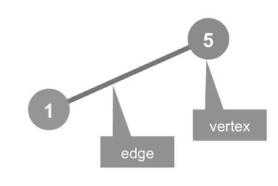
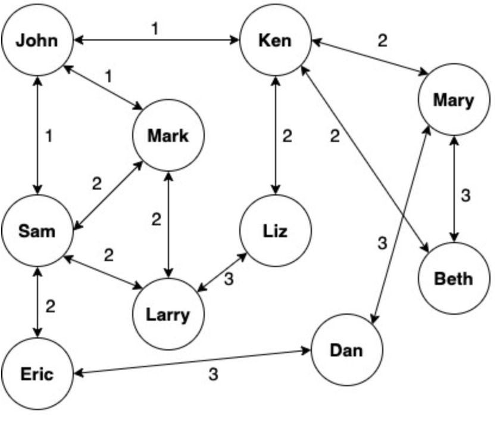
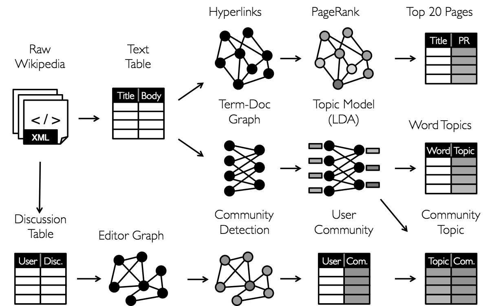
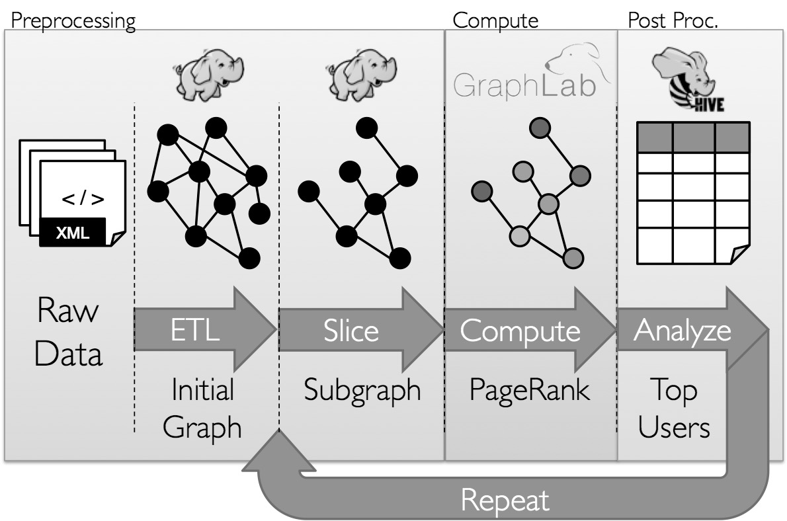
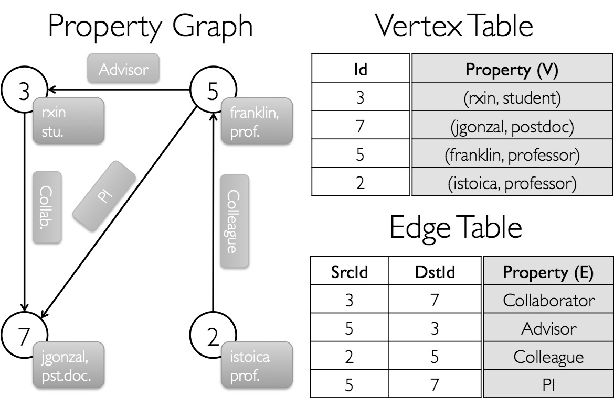
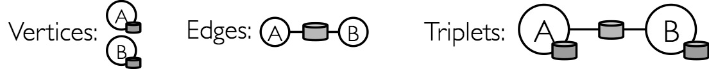
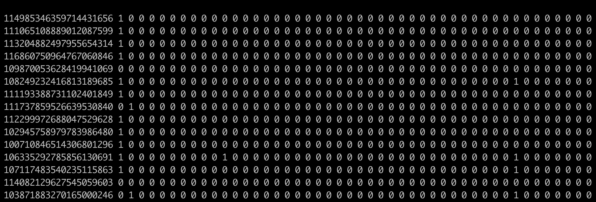
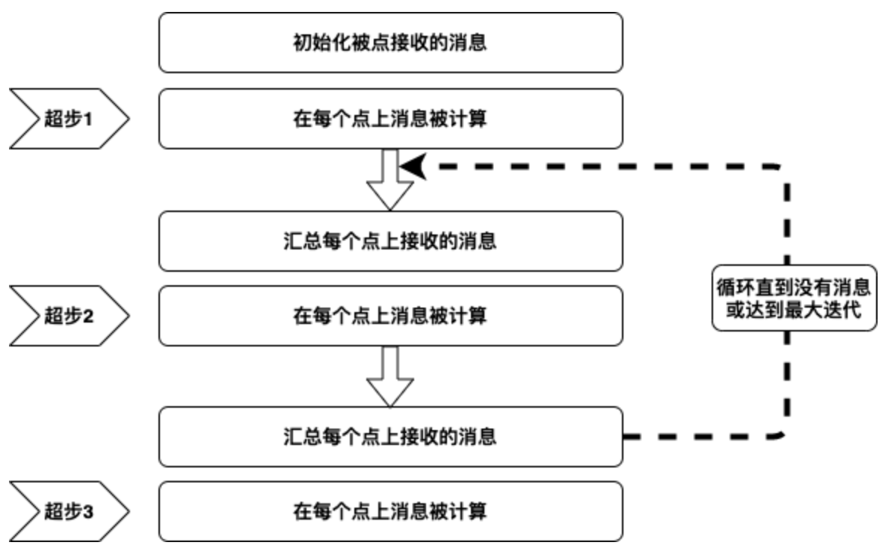

# 分布式的图处理

Spark
GraphX是一个分布式图处理框架，是基于Spark平台提供对图计算和图挖掘简洁易用的而丰富的接口，极大的方便了对分布式图处理的需求。众所周知，社交网络中人与人之间有很多关系链，例如Twitter、Facebook、微博和微信等，这些都是大数据产生的地方都需要图计算，现在的图处理基本都是分布式的图处理，而并非单机处理。Spark
GraphX由于底层是基于Spark来处理的，所以自然就是一个分布式的图处理系统。

## 理解图的概念

图论算法在计算机科学中扮演着很重要的角色，它提供了对很多问题都有效的一种简单而系统的建模方式。很多问题都可以转化为图论问题，然后用图论的基本算法加以解决。遗传算法是解优化问题的有效算法，而并行遗传算法是遗传算法研究中的一个重要方向，受到了研究人员的高度重视。图论算法主要研究对象就是图（Graph），是数据结构和算法学中最强大的框架之一，几乎可以用来表现所有类型的结构或系统，从交通网络到通信网络，从下棋游戏到最优流程，从任务分配到人际交互网络，图都有广阔的用武之地。而要进入图论的世界，清晰、准确的基本概念是必须的前提和基础，下面对其最核心和最重要的概念作出说明。

图并不是指图形图像或地图，而是代表一种复杂的网络数据结构。通常来说，我们会把图视为一种由点（Vertex）组成的抽象网络，网络中的各点可以通过边（Edge）实现彼此的连接，表示两点有关联，注意上面图定义中的两个关键字，由此得到两个最基本的概念，点和边。另外，图也是一种复杂的非线性结构，在图结构中每个元素都可以有零个或多个前驱元素，也可以有零个或多个后继元素，也就是说元素之间的关系是任意的。从数学概念上讲，图是由点的有穷非空集合和点之间边的集合组成，通常表示为\(G(V,E)\)，其中\(G\)表示一个图，\(V\)是图\(G\)中点的集合，\(E\)是图\(G\)中边的集合。

图例 4‑1图的基本组成

一个图\(G\)由两类元素构成，分别称为点（或节点、结点）和边，每条边有两个点作为其端点，我们称这条边连接了它的两个端点，因此边可定义为由两个点构成的集合，在有向图中为有序对，边是有方向的。一个点一般表示为一个点或小圆圈。一个图\(G\)的点集合一般记作\(V(G)\)，当不发生混淆时可简记为\(V\)。图\(G\)的阶为其点数目，亦即|\(V(G)\)|。一条边一般表示为连接其两个端点的曲线。以两个点\(u\)、\(v\)为端点的边一般记作\((u,v)\)、\(\{ u,v\}\)或\(\text{uv}\)，一条边连接两个点\(u\)和\(v\)时，则称\(u\)与\(v\)相邻。图\(G\)的边集一般记作\(E(G)\)，当不发生混淆时可简记为\(E\)，如图例
4‑2所示，点集\(V = \left\{ 1,\ 2,\ 3,\ 4,\ 5,\ 6 \right\}\)，边集\(E = \ \{\{ 1,2\},\ \{ 1,5\},\ \{ 2,3\},\ \{ 2,5\},\ \{ 3,4\},\ \{ 4,5\},\ \{ 4,6\}\}\)。

图例 4‑2点集和边集

若两个点之间有一条边，则这两个点相邻。关联一个点\(v\)边的条数称为是\(点v\)的度数或价。距离是两个点之间经过最短路径的边的数目，通常用\(d_{G}(u,v)\)表示。点\(v\)的偏心率用来表示连接图\(G\)中的点
\(v\)到图\(G\)中其它点之间的最大距离，用符号\(\epsilon_{G}(v)\)表示。图的直径，表示取遍图的所有点，得到的偏心率的最大值，记作
\(diam(G)\)。相对于图直径的概念是图半径，表示图的所有点的偏心率的最小值，记作\(rad(G)\)，这两者间的关系是\(diam(G) \leqslant 2rad(G)\)。如果给图的每条边规定一个方向，那么得到的图称为有向图，其边也称为有向边。在有向图中，与一个节点相关联的边有出边和入边之分，而与一个有向边关联的两个点也有始点和终点之分，相反边没有方向的图称为无向图。

正则图是指各点的度均相同的无向简单图。在图论中，正则图中每个点具有相同数量的邻点；
即每个点具有相同的度或价态。正则的有向图也必须满足更多的条件，即每个点的内外自由度都要彼此相等。具有\(k\)个自由度的点的正则图被称为\(k\)度的\(k\)-正则图。此外，奇数程度的正则图形将包含偶数个点。最多2个等级的正则图很容易分类：0-正则图由断开的点组成，1-正则图由断开的边缘组成，2-正则图由断开的循环和无限链组成，3-正则图被称为立方图。强规则图也是常规图，其中每个相邻的点对具有相同数量的相邻的相邻数目，并且每个不相邻的点对具有相同数量的n个相邻的相邻公共点。常规但不太规则的最小图是循环图和6个点的循环图。

为了更好地理解图的概念，让我们看一下通常使用社交软件的方式，每天都可以使用智能手机在朋友圈中张贴消息或更新状态，我们的朋友也可以发布了自己的消息，照片和视频。我们有朋友，朋友还会有朋友等等，社交软件的设置可让我们结交新朋友或从朋友列表中删除朋友。社交软件还具有权限设置的功能，可以对谁看到什么以及可以与谁进行通信进行精细控制。当考虑社交软件平台具有有十亿个用户时，管理所有用户以及用户之间的关系和权限变得非常庞大和复杂。我们需要建立有关用户和关系数据的存储和检索，以便允许回答这样的问题，例如：X是Y的朋友吗？X和Y是直接关联还是在两个步之内的间接关联？X有多少个朋友？我们可以从尝试从一个简单的数据结构开始，使每个人都有一个朋友数组，因此可以很容易就用数组的长度来回答第三个问题，也可以只扫描数组并快速回答第一个问题，而第二个问题将需要做更多的工作。如下面的示例所示，我们通过使用专门的数据结构来解决该问题，在代码
4‑1中我们创建了一个案例类Person，然后添加朋友来建立John、Ken、Mary、Dan用户之间的关系：

scala\> :paste

// Entering paste mode (ctrl-D to finish)

case class Person(name: String) {

val friends = scala.collection.mutable.ArrayBuffer\[Person\]()

def numberOfFriends() = friends.length

def isFriend(other: Person) = friends.find(\_.name == other.name)

def isConnectedWithin2Steps(other: Person) = {

for {f \<- friends} yield {

f.name == other.name ||

f.isFriend(other).isDefined

}

}.find(\_ == true).isDefined

}

// Exiting paste mode, now interpreting.

defined class Person

scala\> val john = Person("John")

john: Person = Person(John)

scala\> val ken = Person("Ken")

ken: Person = Person(Ken)

scala\> val mary = Person("Mary")

mary: Person = Person(Mary)

scala\> val dan = Person("Dan")

dan: Person = Person(Dan)

scala\> john.numberOfFriends

res0: Int = 0

scala\> john.friends += ken

res1: john.friends.type = ArrayBuffer(Person(Ken))

scala\> john.numberOfFriends

res2: Int = 1

scala\> ken.friends += mary

res3: ken.friends.type = ArrayBuffer(Person(Mary))

scala\> ken.numberOfFriends

res4: Int = 1

scala\> mary.friends += dan

res5: mary.friends.type = ArrayBuffer(Person(Dan))

scala\> mary.numberOfFriends

res6: Int = 1

scala\> john.isFriend(ken)

res7: Option\[Person\] = Some(Person(Ken))

scala\> john.isFriend(mary)

res8: Option\[Person\] = None

scala\> john.isFriend(dan)

res9: Option\[Person\] = None

scala\> john.isConnectedWithin2Steps(ken)

res10: Boolean = true

scala\> john.isConnectedWithin2Steps(mary)

res11: Boolean = true

scala\> john.isConnectedWithin2Steps(dan)

res12: Boolean = false

代码 4‑1

如果我们为所有用户构建Person()实例并将朋友添加到数组中，如前面的代码所示，我们将能够对谁是朋友以及两者之间的关系进行很多查询。图例
4‑3显示了Person()实例的数据结构以及它们在逻辑上的相互关系：

图例 4‑3 用户关系图

如果我们可以使用这个图查找John的朋友，可以快速找出直接朋友（边为1），间接朋友（边为2）和朋友朋友的朋友（边为3）。我们可以轻松扩展Person()类并提供越来越多的功能来回答不同的问题。我们通过该图显示了人和人之间的朋友关系，以及如何在人与人之间的关系网格中吸引每个人的所有朋友。

这种基于数学方式描述的图方便我们可以使用数学算法遍历和查询图，可以将这些技术应用于计算机科学以开发编程方法实现这些算法，并且可以达到一定的规模效率。我们已经尝试实现使用案例类Person程序构成了一个图的结构，但这只是最简单的用例。实际上，有很多可能的复杂扩展，例如要回答的以下问题：找到从X到Y的最佳路径，实际的应用就是GPS会找到前往目的地的最佳方法；认识到可能导致图分区的关键边，这个问题的一个示例是确定连接各个城市的Internet服务、水管或电力线的关键链接，如果关键链接中断将生成两个连接良好的城市子图，但是两个子图之间没有任何通信。

如果要回答上述问题将产生几种算法，例如最小生成树、最短路径，页面排名（Page Rank），交替最小二乘（Alternating Least
Squares，ALS），最大切割-最小流量算法（Max-Cut
Min-Flow）等，适用于广泛的用例，例如社交媒体软件的用户关系、网路搜索引擎的页面排名、航班时刻表、GPS导航等，其中我们可以清楚地看到基于点和边的数据结构，可以使用各种图算法进行分析，以产生不同的业务用例。

## 图并行系统

传统的数据分析方法侧重于事物本身，即实体，例如银行交易、资产注册等等。而图数据不仅关注事物，还关注事物之间的联系。例如，如果在通话记录中发现张三曾打电话给李四，就可以将张三和李四关联起来，这种关联关系提供了与两者相关的有价值的信息，这样的信息是不可能仅从两者单纯的个体数据中获取的。从社交网络到语言建模，以图为结构的数据规模和重要性日益增长，推动了许多新的图并行系统的发展。在社交网络及商品推荐场景中，对象和数据往往以图的形式展现出来，图计算系统在机器学习和数据挖掘中的重要性越来越凸显出来。随着计算规模和应用场景的增加，大量的图计算框架不断出现，例如Google
Pregel、Spark GraphX和GraphLab等图并行系统。

数据并行系统，像Spark和MapReduce等计算框架主要用于对数据集进行各种运算，在数据内部之间关联度不高的计算场景下能够有很高效的处理，由于数据之间的独立性，每部分数据都可以被分别进行处理，系统可以达到很高的并发度并具有良好的扩展性，可以简单地通过增加计算资源（CPU或节点数目）获取更高的处理能力。实际应用中，数据内部可能存在较高的关联度，如社交网络中不同用户之间就存在相关性。在对这样的数据进行处理时，并行计算框架就会面临较大的挑战，会引入大量的连接（Join）和聚集（Aggregation）操作，带来大量的计算和数据迁移，严重消耗集群资源，因此对图计算算法的优化就显得极为重要。针对数据并行计算框架在处理图计算时遇到的挑战，大量的图并行计算框架被开发出来，图并行计算主要针对图数据结构的特点，对数据进行更好的组织，充分挖掘图结构的特点，优化计算框架以达到较好的分布式计算性能。大部分图计算框架的原理都是对图数据进行分布式存储，在图数据上进行计算、传输和更新操作。通过操作图点的数据及与点相连的边上的数据，产生发送给与其相连的点的消息，消息通过网络或其他方式传输给指定点，点在收到消息或状态后进行更新，生成新的图数据。

在了解图并行系统之前，需要先了解关于通用的分布式图计算框架的两个常见问题：图存储模式和图计算模式。大规模图的存储总体上有边分割（Edge-Cut）和点分割（Vertex-Cut）两种存储方式。2013年，GraphLab2.0将其存储方式由边分割变为点分割，在性能上取得重大提升，目前基本上被业界广泛接受并使用。边分割的每个点都存储一次，但有的边会被打断分到两台机器上。这样做的好处是节省存储空间；坏处是对图进行基于边的计算时，对于一条两个点被分到不同机器上的边来说，要跨机器通信传输数据，内网通信流量大。点分割的每条边只存储一次，都只会出现在一台机器上。邻居多的点会被复制到多台机器上，增加了存储开销，同时会引发数据同步问题。好处是可以大幅减少内网通信量。虽然两种方法互有利弊，但现在是点分割占上风，各种分布式图计算框架都将自己底层的存储形式变成了点分割。主要原因有两个：（1）磁盘价格下降，存储空间不再是问题，而内网的通信资源没有突破性进展，集群计算时内网带宽是宝贵的，时间比磁盘更珍贵。这点就类似于常见的空间换时间的策略；（2）在当前的应用场景中，绝大多数网络都是无标度网络，遵循幂律分布，不同点的邻居数量相差非常悬殊。而边分割会使那些多邻居的点所相连的边大多数被分到不同的机器上，这样的数据分布会使得内网带宽更加捉襟见肘，于是边分割存储方式被渐渐抛弃了。

但是当图数据被分割后进入不同计算节点进行计算的时候，由于在不同节点中对于同一个节点有可能有多个副本，这个节点副本之间如何进行数据交换协同也成为了一个难题，于是GAS（Gather
Apply
Scatter）模型就被提出来解决这个难题。GAS模型主要分为3个阶段：Gather阶段、Apply阶段和Scatter阶段。Gather阶段的主要工作主要发生在各个计算节点，搜集这个计算节点图数据中某个点的相邻边和点的数据进行计算（例如在PageRank算法中计算某个点相邻的点的数量。Apply阶段的主要工作是将各个节点计算得到的数据，例如在PageRank算法中各计算节点计算出来的同一节点的相邻节点数，统一发送到某一个计算节点，由这个计算节点对图节点的数据进行汇总求和计算，这样就得到这个图点的所有相邻节点总数。Scatter阶段的主要工作是将中心计算节点计算的图点的所有相邻节点总数发送更新给各个计算节点中，这些收到更新信息的节点将会更新本计算节点中与这个图点相邻的点以及边的相关数据。

Pregel框架由谷歌提出，用于解决机器学习的数据同步和算法迭代，是基于BSP（Bulk Synchronous message
Passing）思想的图并行计算框架，它以点为中心，不断在点上进行算法迭代和数据同步。在Pregel计算模型中，输入数据是一个有向图，该有向图的每一个点包含点ID和属性值，这些属性可以被修改，其初始值由用户定义。有向边记录了源点和目的点的ID，并且也拥有用户定义的属性值。Pregel以点为中心，对边进行切割，将图数据分成若干个分区。每一个分区包含一组点以及由这组点为源点构成的边。

GraphLab由CMU的Select实验室提出，它是一个异步分布式共享存储模型。在GraphLab模型中，运行在点上的用户自定义程序可以对图中的点和边数据进行共享访问。程序可以访问当前作用的点、点相连接的边（包括入边和出边），以及相邻的点。GraphLab在进行图运算时，点是其最小的并行粒度和通信粒度，某个点可能被部署到多台机器上，其中一台机器上的为主点，其余机器上的为镜像点，与主点的数据保持同步。对边而言，GraphLab将其部署在某一台机器上，当图比较密，即边的数目较大时，可以减少边数据的存储量。GraphLab（图例
4‑4）通过限制可表达的计算类型和引入新技术来划分图进行并行分布，可以比一般的数据并行系统更高效地执行复杂的图算法。

图例 4‑4 图并行系统

为了使图并行系统实现显着性能提高，需要对其表达能力产生了限制，但是限制了它们在典型的图数据分析管道中表达许多重要阶段的能力。此外，虽然图并行系统针对像页面排名这样的迭代扩散算法进行了优化，但它们并不适用于构建图数据结构，这种结构需要随时大规模的更新或者跨越多个图进行计算等更基本的操作。而且，Hadoop的任务通常需要数据在图结构系统之外的移动，并且通常更自然地表达为在传统的数据并行系统中的表操作，例如MapReduce的并行数据处理。此外，我们如何看待数据取决于要实现的目标，并且在整个分析过程中相同的原始数据可能需要许多不同的表格和图表视图（图例
4‑5）：

图例 4‑5 图的分析过程

GraphLab通常需要能够在相同物理数据的表格和图表视图之间移动，并利用每个视图的属性来轻松高效地表达计算。但是，现有GraphLab图形分析管道组成图并行处理和数据并行系统，导致大量的数据移动和重复，导致了复杂的编程模型（图例
4‑6）。

图例 4‑6 图的分析管道

GraphX是构建于Spark上的图计算模型，GraphX利用Spark框架提供的内存缓存RDD、DAG和基于数据依赖的容错等特性，实现高效健壮的图计算框架。GraphX同样基于GAS模型，该模型将点分配给集群中各个节点进行存储，增大并行度，并解决真实情况下常会遇到的高出度点的情况，GraphX模型也是以边为中心，对点进行切割的。

## 一个例子

首先，通过Spark的交互界面让我们创建一个小型的社交网络，并探索网络中不同人员之间的关系。工作流程是在交互界面中进行操作，需要导入GraphX和RDD包以便我们可以调用其API：

scala\> import org.apache.spark.graphx.\_

import org.apache.spark.graphx.\_

scala\> import org.apache.spark.rdd.RDD

import org.apache.spark.rdd.RDD

代码 4‑2

SparkContext可以作为Spark程序的主要入口点，是在Spark
交互界面中自动创建的，还提供了有用的方法来通过集合创建RDD，或将本地或Hadoop文件系统中的数据加载到RDD中并将输出数据保存在磁盘上。在此示例中，我们将使用两个CSV文件people.csv和links.csv，包含在目录/data中，键入以下命令以将这些文件加载到Spark中：

scala\> val people = sc.textFile("/data/people.csv")

people: org.apache.spark.rdd.RDD\[String\] = /data/people.csv
MapPartitionsRDD\[1\] at textFile at \<console\>:28

scala\> val links = sc.textFile("/data/links.csv")

links: org.apache.spark.rdd.RDD\[String\] = /data/links.csv
MapPartitionsRDD\[3\] at textFile at \<console\>:28

代码 4‑3

加载CSV文件得到两个字符串的RDD，要创建图还需要将这些字符串解析为点和边的集合。在继续之前，让我们介绍一些关键的定义和图的抽象概念。在Spark中，图的抽象概念是由属性图表示的，属性图是在每个点和边上附加有用户定义对象，这些对象的类描述了图的属性，属性图通过Graph类定义为：

class Graph\[VD, ED\] {

val vertices: VertexRDD\[VD\]

val edges: EdgeRDD\[ED,VD\]

}

代码 4‑4

实际上，这是通过对Graph、VertexRDD和EdgeRDD类进行参数化来定义属性图，其中的VD和ED表示点或边的属性。此外，图的每个边定义为单向关系，但是任意一对点之间可以存在多个边。Graph类提供了获取方法来访问其点和边，它们被抽象为RDD的子类VertexRDD
\[VD\]和EdgeRDD
\[ED，VD\]，此处的VD和ED为Scala的类型参数。在社交网络示例中，这些类型的参数可以是原始类型（例如String），也可以是用户定义的类（例如Person类）。重要的是要注意，Spark中的属性图是有向多重图，意味着该图被允许在任意一对点之间具有多个边，而且每个边是有方向的，并定义了单向关系。例如这某些社交媒体中很容易理解，用户可以关注另一个用户，但是反之则不行；对于类似朋友关系需要建立双向链接，需要在节点之间定义两个边，分别指向相反的方向，关系的其他属性可以存储为边的属性。

接下来，我们将RDD转换为VertexRDD和EdgeRDD，回到上面的示例，分三步构造属性图，如下所示：

（1）定义一个案例类Person，具有名称和年龄作为类参数，以后需要对Person进行模式匹配时，案例类非常有用：

scala\> case class Person(name: String, age: Int)

defined class Person

代码 4‑5

（2）将两个CSV文件中的每一行，分别解析为Person和Edge类型的新对象，并结果集合定义为RDD \[(VertexId,
Person)\]和RDD \[Edge \[String\]\]：

scala\> val peopleRDD: RDD\[(VertexId, Person)\] =
people.map(\_.split(',')).map(row =\> (row(0).toInt, Person(row(1),
row(2).toInt)))

peopleRDD: org.apache.spark.rdd.RDD\[(org.apache.spark.graphx.VertexId,
Person)\] = MapPartitionsRDD\[5\] at map at \<console\>:31

scala\> type Connection = String

defined type alias Connection

scala\> val linksRDD: RDD\[Edge\[Connection\]\] =
links.map(\_.split(',')).map(row =\> Edge(row(0).toInt, row(1).toInt,
row(2)))

linksRDD:
org.apache.spark.rdd.RDD\[org.apache.spark.graphx.Edge\[Connection\]\] =
MapPartitionsRDD\[7\] at map at \<console\>:31

代码 4‑6

在GraphX中，VertexId定义为Long类型。Edge中定义为：

class Edge(srcId:VertexId, dstId:VertexId, attr:ED)

类参数srcId和dstId表示一个边的起始点和目标点VertexId。在我们的社交网络示例中，两个人之间的链接是单向的，其属性在Connection类型的attr中进行了描述。请注意，我们将Connection定义为String的类型别名，为了清楚起见通常将Edge的类型参数赋予一个有意义的名称。

（3）使用工厂方法Graph()创建社交网络图，并将其命名为tinySocial：

scala\> val tinySocial: Graph\[Person, Connection\] = Graph(peopleRDD,
linksRDD)

tinySocial: org.apache.spark.graphx.Graph\[Person,Connection\] =
<org.apache.spark.graphx.impl.GraphImpl@2dfc833b>

代码 4‑7

关于此构造函数，有两点需要注意。前面我们说过图的成员点和边是VertexRDD
\[VD\]和EdgeRDD\[ED，VD\]的实例，但是将RDD\[(VertexId,
Person)\]和RDD\[Edge
\[Connection\]\]传递给工厂方法Graph()，这是因为VertexRDD\[VD\]和EdgeRDD\[ED,
VD\]分别是RDD\[(VertexId, Person)\]和RDD\[Edge \[Connection\]\]的子类。
另外，VertexRDD\[VD\]增加了一个约束，VertexID仅仅发生一次，表示社交网络中的两个用户不能具有相同的点ID。
此外，VertexRDD \[VD\]和EdgeRDD \[ED,
VD\]提供了其他几种操作来转换点和边属性，我们将在后面的章节中看到更多这些内容。最后，我们将通过collect()方法来查看网络中的点和边：

scala\> tinySocial.vertices.collect()

res0: Array\[(org.apache.spark.graphx.VertexId, Person)\] =
Array((4,Person(Dave,25)), (6,Person(Faith,21)), (8,Person(Harvey,47)),
(2,Person(Bob,18)), (1,Person(Alice,20)), (3,Person(Charlie,30)),
(7,Person(George,34)), (9,Person(Ivy,21)), (5,Person(Eve,30)))

scala\> tinySocial.edges.collect()

res1: Array\[org.apache.spark.graphx.Edge\[Connection\]\] =
Array(Edge(1,2,friend), Edge(1,3,sister), Edge(2,4,brother),
Edge(3,2,boss), Edge(4,5,client), Edge(1,9,friend), Edge(6,7,cousin),
Edge(7,9,coworker), Edge(8,9,father))

代码 4‑8

现在，我们只想打印出tinySocial中特定的用户关系，需要定义一个关系列表profLinks：

scala\> val profLinks: List\[Connection\] = List("coworker", "boss",
"employee", "client", "supplier")

profLinks: List\[Connection\] = List(coworker, boss, employee, client,
supplier)

代码 4‑9

我们可以通过filter()方法过滤出特定关系的边，然后遍历过滤后的边，提取相应点的名称，并打印起始点和目标点之间的连接，以下代码中实现了这种方法：

scala\> :paste

// Entering paste mode (ctrl-D to finish)

val profNetwork = tinySocial.edges.filter {

case Edge(\_, \_, link) =\> profLinks.contains(link)

}

for {Edge(src, dst, link) \<- profNetwork.collect()

srcName = (peopleRDD.filter { case (id, person) =\> id == src }
first).\_2.name

dstName = (peopleRDD.filter { case (id, person) =\> id == dst }
first).\_2.name

} println(srcName + " is a " + link + " of " + dstName)

// Exiting paste mode, now interpreting.

warning: there were two feature warnings; re-run with -feature for
details

Charlie is a boss of Bob

Dave is a client of Eve

George is a coworker of Ivy

profNetwork:
org.apache.spark.rdd.RDD\[org.apache.spark.graphx.Edge\[Connection\]\] =
MapPartitionsRDD\[38\] at filter at \<pastie\>:35

代码 4‑10

代码
4‑10有两个问题。首先不是很简洁和富有表现力，其次for循环中的过滤操作效率不高，需要读取两遍图中数据。GraphX库提供了两种查看数据的方式：以图的方式或以表的方式，表中可以分别为边、点或三元组。对于每种方式，GraphX库都提供了一系列丰富的操作，并进行了优化。我们通常可以轻松地使用预定义的图操作或算法来处理图形，例如可以简化前面的代码并使之更高效，如下所示：

scala\> :paste

// Entering paste mode (ctrl-D to finish)

tinySocial.subgraph(epred = (edge) =\> profLinks.contains(edge.attr))

.triplets

.foreach(t =\> println(t.srcAttr.name + " is a " + t.attr + " of " +
t.dstAttr.name))

// Exiting paste mode, now interpreting.

Charlie is a boss of Bob

George is a coworker of Ivy

Dave is a client of Eve

代码 4‑11

我们仅使用subgraph()操作来过滤边，然后使用三元组视图同时访问边和点的属性，三元组运算符返回RDD为EdgeTriplet
\[Person, Connection\]。请注意，EdgeTriplet只是一个别名，代表三元组((VertexId, Person),
(VertexId, Person), Connection)的参数化类型，其包含有起始节点、目标节点和边属性的所有信息。

## 创建和探索图

在上一节中，我们构建了一个微型的社交网络，从本节开始我们将使用来自各种应用程序的真实数据集。实际上，图可以用于表示任何复杂的系统，因为它描述了系统组件之间的交互。尽管不同系统的形式、大小、性质和粒度各不相同，但是图论提供了一种通用语言和一组工具来表示和分析复杂系统。

在这一节，我们将遇到的第一种通信网络是电邮通信图，可以将组织内交换电子邮件的历史记录映射到通信图，以了解组织背后某种隐藏的结构。这样的图表还可以用于确定组织中有影响力的人员或枢纽，但是不一定是高级职位。电邮通信图是有向图的典型示例，因为每封电子邮件都是从起始节点链接到目标节点。我们将使用的语料库是由158名员工生成的电子邮件数据库，是在网络上向公众开放的大量公司电子邮件集合之一。另一个示例是成分与合成物网络，是一个二分图，将节点分为两个不相交的集合：成分节点和合成物节点。当食品成分中存在化学合成物时，将会存在一个成分与化合物链接。从成分与合成物网络可以创建所谓的调料网络。每当一对成分共享至少一种合成物时，调料网络就不会将食品成分与化合物连接起来，而是将这对成分链接在一起。在这一节，我们将构建成分与合成物网络，在下一节根据需要对图进行转换和成形，我们将从成分与合成物网络构建调料网络。分析此类图非常有趣，因为它们可以帮助我们更多地了解食物搭配和饮食文化，调料网络还可以帮助食品科学家或业余厨师创建新食谱。我们将在本节中探讨的最后一个数据集是社交媒体的自我中心网络的集合。数据集包括用户个人资料、他们的朋友圈和他们的自我中心网络。

作为Apache Spark组件，GraphX
主要实现了图的并行计算，位于Spark核心组件之上的分布式图处理框架。开发GraphX程序，首先需要将Spark和GraphX函数库导入到项目中，如下所示：

import org.apache.spark.\_

import org.apache.spark.graphx.\_

// To make some of the examples work we will also need RDD

import org.apache.spark.rdd.RDD

代码 4‑12

如果不使用Spark交互界面，还需要一个SparkContext。

### 属性图

属性图是一个有向多重图，用户定义的对象附加到每个点和边。有向多重图是具有潜在多个平行边的有向图，共享相同起始点和目标点的，支持平行边的能力简化了在同一点之间可以存在多个关系的建模场景（如同事和朋友）。每个点都有唯一的
64位长点标识符VertexId，GraphX不会对点标识符施加任何排序约束，类似地边具有对应的起始点和目标点标识符。

属性图在点类型VD和边类型ED上进行参数化，这些对象类型分别与每个点和边相关联。当对象类型是原始数据类型时，例如int、double等时，GraphX优化点和边类型的表示，通过将其存储在专门的数组中来减少内存占用。在某些情况下，可能希望在同一个图中具有不同属性类型的点，可以通过继承来实现，例如将用户和产品建模为二分图，可能会执行以下操作：

class VertexProperty()

case class UserProperty(val name: String) extends VertexProperty

case class ProductProperty(val name: String, val price: Double) extends
VertexProperty

// The graph might then have the type:

var graph: Graph\[VertexProperty, String\] = null

代码 4‑13

像RDD一样，属性图是不可变的、分布式的和容错的，通过生成新图来完成对图的值或结构的更改。请注意，原始图的重要部分（即未受影响的结构、属性和索引）在新图中重复使用，可降低此内在函数的数据结构成本。使用一系列点分割启发式方法，在执行器之间划分图结构，图的每个分区都可以在发生故障的情况下在不同的计算机上重新创建。逻辑上，属性图对应于一对带有类型的集合（vertices和edges），其中为每个点和边定义了属性，因此Graph类包含了访问点和边的成员：

class Graph\[VD, ED\] {

val vertices: VertexRDD\[VD\]

val edges: EdgeRDD\[ED\]

}

代码 4‑14

类VertexRDD\[VD\]和EdgeRDD\[ED\]扩展和优化了RDD\[(VertexId,
VD)\]和RDD\[Edge\[ED\]\]
版本，VertexRDD\[VD\]和EdgeRDD\[ED\]提供了基于图计算和利用内部优化的附加功能。假设要构建一个由GraphX项目中的各种协作者组成的属性图，点属性可能包含用户名和职业，可以用描述协作者之间关系的字符串来注释边：

图例 4‑7 属性图的定义

结果图将具有类型签名为：

val userGraph: Graph\[(String, String), String\]

代码 4‑15

有许多方法构建属性图，包括从原始文件、RDD、甚至合成生成器，最通用的方法是使用[Graph对象](https://translate.googleusercontent.com/translate_c?depth=1&hl=en&rurl=translate.google.com&sl=en&sp=nmt4&tl=zh-CN&u=http://spark.apache.org/docs/latest/api/scala/index.html&usg=ALkJrhidcKbBeXAVZTbwdX7KfoWhzqj2VQ#org.apache.spark.graphx.Graph$)，例如以下代码从RDD集合中构建一个图：

val sc: SparkContext

// 为点创建RDD

val users: RDD\[(VertexId, (String, String))\] =

sc.parallelize(Array((3L, ("rxin", "student")), (7L, ("jgonzal",
"postdoc")),

(5L, ("franklin", "prof")), (2L, ("istoica", "prof"))))

// 为边创建RDD

val relationships: RDD\[Edge\[String\]\] =

sc.parallelize(Array(Edge(3L, 7L, "collab"), Edge(5L, 3L, "advisor"),

Edge(2L, 5L, "colleague"), Edge(5L, 7L, "pi")))

// 定义默认用户，以防丢失用户

val defaultUser = ("John Doe", "Missing")

// 构建初始图

val graph = Graph(users, relationships, defaultUser)

代码 4‑16

在上面的例子中使用了Edge案例类，具有srcId和dstId属性，分别对应与起始点和目标点的标识符，此外Edge案例类具有attr成员，存储边属性。可以分别使用graph.vertices和graph.edges成员将图解构为相应的点和边视图。

val graph: Graph\[(String, String), String\] // Constructed from above

// 计算所有postdoc用户

graph.vertices.filter { case (id, (name, pos)) =\> pos == "postdoc"
}.count

// 计算所有边，满足srcId \> dstId

graph.edges.filter(e =\> e.srcId \> e.dstId).count

代码 4‑17

graph.vertices返回一个继承RDD\[(VertexId, (String,
String))\]类的VertexRDD\[(String,
String)\]类，因此使用case表达式来解构元组，另一方面graph.edges返回一个包含Edge\[String\]对象的EdgeRDD类，也可以使用案例类构造函数，如下所示：

graph.edges.filter { case Edge(src, dst, prop) =\> src \> dst }.count

代码 4‑18

除了属性图的点和边视图之外，GraphX还公开了一个三元组视图。三元组视图逻辑上连接点和边属性，产生包含[EdgeTriplet](https://translate.googleusercontent.com/translate_c?depth=1&hl=en&rurl=translate.google.com&sl=en&sp=nmt4&tl=zh-CN&u=http://spark.apache.org/docs/latest/api/scala/index.html&usg=ALkJrhidcKbBeXAVZTbwdX7KfoWhzqj2VQ#org.apache.spark.graphx.EdgeTriplet)类实例的RDD\[EdgeTriplet\[VD,
ED\]\]，此连接可以用以下SQL表达式表示：

SELECT src.id, dst.id, src.attr, e.attr, dst.attr

FROM edges AS e LEFT JOIN vertices AS src, vertices AS dst

ON e.srcId = src.Id AND e.dstId = dst.Id

代码 4‑19

或图形为：

图例 ‑8 GraphX的三元组视图

[EdgeTriplet](https://translate.googleusercontent.com/translate_c?depth=1&hl=en&rurl=translate.google.com&sl=en&sp=nmt4&tl=zh-CN&u=http://spark.apache.org/docs/latest/api/scala/index.html&usg=ALkJrhidcKbBeXAVZTbwdX7KfoWhzqj2VQ#org.apache.spark.graphx.EdgeTriplet)类通过分别添加包含起始和目标属性的srcAttr和dstAttr成员来扩展[Edge](https://translate.googleusercontent.com/translate_c?depth=1&hl=en&rurl=translate.google.com&sl=en&sp=nmt4&tl=zh-CN&u=http://spark.apache.org/docs/latest/api/scala/index.html&usg=ALkJrhidcKbBeXAVZTbwdX7KfoWhzqj2VQ#org.apache.spark.graphx.Edge)类。可以使用图的三元组视图来呈现描述用户之间关系的字符串集合。

val graph: Graph\[(String, String), String\] // Constructed from above

// 使用三元组视图创建RDD

val facts: RDD\[String\] =

graph.triplets.map(triplet =\>

triplet.srcAttr.\_1 + " is the " + triplet.attr + " of " +
triplet.dstAttr.\_1)

facts.collect.foreach(println(\_))

代码 4‑20

### 构建器

在GraphX中，有四个用于构建属性图的函数，每一个都要求应该以指定的方式构造数据。第一个是代码
4‑7中已经看到的Graph工厂方法，在名为Graph的伴随对象的apply()方法中定义，如下所示：

def apply\[VD, ED\](

vertices: RDD\[(VertexId, VD)\],

edges: RDD\[Edge\[ED\]\],

defaultVertexAttr: VD = null)

: Graph\[VD, ED\]

代码 4‑21

如我们之前所见，此函数采用两个RDD集合：RDD \[(VertexId, VD)\]和RDD \[Edge
\[ED\]\]作为点和边的参数，并且构造了Graph
\[VD，ED\]参数。defaultVertexAttr属性用于为点分配默认属性，该点存在于边edges中但不存在于顶点vertices中的，如果容易获得边和点RDD集合时，使用Graph工厂方法很方便。但是，另一种更常见的情况是原始数据集仅表示为边。在这种情况下，GraphX提供以下在GraphLoader类中定义的edgeListFile函数：

def edgeListFile(

sc: SparkContext,

path: String,

canonicalOrientation: Boolean = false,

minEdgePartitions: Int = 1)

: Graph\[Int, Int\]

代码 4‑22

该函数以包含边列表的文件路径作为参数，其中每一行代表图的边，由两个整数的表示为：sourceID和destinationID。在阅读文件列表时，该函数将忽略以“＃”开头的任何注释行，然后根据指定的边以及相应的点构造一个图。minEdgePartitions参数指定要生成的最小边分区数，如果HDFS文件具有更多块则边分区可能比指定的更多。

与GraphLoader.edgeListFile()相似，第三个函数Graph.fromEdges()使我们可以从RDD \[Edge
\[ED\]\]集合创建图，使用edges指定的VertexID参数以及defaultValue参数作为默认属性自动创建点：

def fromEdges\[VD, ED\](

edges: RDD\[Edge\[ED\]\],

defaultValue: VD)

: Graph\[VD, ED\]

代码 4‑23

最后一个图构建器函数是Graph.fromEdgeTuples，它仅从边元组的RDD创建图，形式为RDD \[(VertexId,
VertexId)\]类型的集合。默认情况下，为边缘分配属性值1：

def fromEdgeTuples\[VD\](

rawEdges: RDD\[(VertexId, VertexId)\],

defaultValue: VD,

uniqueEdges: Option\[PartitionStrategy\] = None)

: Graph\[VD, Int\]

代码 4‑24

### 创建图

现在让我们打开Spark交互界面构建三种类型的图：电邮通信网络有向图、成分与化合物连接的二分图，以及使用构建器产生的多图。我们将建立的第一个图是电邮通信网络。如果重新启动了Spark
Shell，则需要再次导入GraphX库。首先，在虚拟实验环境中有一个数据集/data/emailEnron.txt，包含员工之间电子邮件通信的邻接列表，表示了邮件之间的传递关系，我们可以将文件路径传递给GraphLoader.edgeListFile方法：

scala\> import org.apache.spark.graphx.\_

import org.apache.spark.graphx.\_

scala\> import org.apache.spark.rdd.\_

import org.apache.spark.rdd.\_

scala\> val emailGraph = GraphLoader.edgeListFile(sc,
"/data/emailEnron.txt")

emailGraph: org.apache.spark.graphx.Graph\[Int,Int\] =
<org.apache.spark.graphx.impl.GraphImpl@7d6c383d>

代码 4‑25

请注意，GraphLoader.edgeListFile方法始终返回图对象，其点和边属性的类型为Int，的默认值为1，可以通过查看图表中的前五个点和边来进行检查：

scala\> emailGraph.vertices.take(5)

res15: Array\[(org.apache.spark.graphx.VertexId, Int)\] =
Array((18624,1), (32196,1), (32432,1), (9166,1), (7608,1))

scala\> emailGraph.edges.take(5)

res16: Array\[org.apache.spark.graphx.Edge\[Int\]\] = Array(Edge(0,1,1),
Edge(1,0,1), Edge(1,2,1), Edge(1,3,1), Edge(1,4,1))

代码 4‑26

第一个节点(19021,1)的点ID为19021，并且其属性确实设置为1，类似地第一个边Edge
(0,1,1)表示起始点为0和目标点为1之间的通信，边具有方向。
为了表达无向图或双向图，我们可以在两个方向上链接每个点，例如在电子邮件网络中，我们可以验证19021节点同时具有传入和传出链接，首先我们收集与节点19021通信的目标节点：

scala\> emailGraph.edges.filter(\_.srcId ==
19021).map(\_.dstId).collect()

res17: Array\[org.apache.spark.graphx.VertexId\] = Array(696, 4232,
6811, 8315, 26007)

代码 4‑27

事实证明，这些相同的节点也是19021的传入边的起始节点：

scala\> emailGraph.edges.filter(\_.dstId ==
19021).map(\_.srcId).collect()

res18: Array\[org.apache.spark.graphx.VertexId\] = Array(696, 4232,
6811, 8315, 26007)

代码 4‑28

在某些应用程序中，将系统视图表示为二分图很有用，二分图由两组节点组成，同一组中的节点不能连接，只能连接属于不同组的节点。这种图的一个示例是食品成分与化合物网络。在这里我们将处理文件ingr\_info.tsv、comp\_info.tsv和ingr\_comp.tsv，这些文件位于/data文件夹中，前两个文件分别包含有关食品成分和化合物的信息。让我们使用scala.io.Source的Source.fromFile()方法快速查看这两个文件的第一行，对该方法的唯一要求是简单地检查文本文件的开头：

scala\> import scala.io.Source

import scala.io.Source

scala\>
Source.fromFile("/data/ingr\_info.tsv").getLines().take(7).foreach(println)

\# id ingredient name category

0 magnolia\_tripetala flower

1 calyptranthes\_parriculata plant

2 chamaecyparis\_pisifera\_oil plant derivative

3 mackerel fish/seafood

4 mimusops\_elengi\_flower flower

5 hyssop herb

scala\>
Source.fromFile("/data/comp\_info.tsv").getLines().take(7).foreach(println)

\# id Compound name CAS number

0 jasmone 488-10-8

1 5-methylhexanoic\_acid 628-46-6

2 l-glutamine 56-85-9

3 1-methyl-3-methoxy-4-isopropylbenzene 1076-56-8

4 methyl-3-phenylpropionate 103-25-3

5 3-mercapto-2-methylpentan-1-ol\_(racemic) 227456-27-1

scala\>
Source.fromFile("/data/ingr\_comp.tsv").getLines().take(7).foreach(println)

\# ingredient id compound id

1392 906

1259 861

1079 673

22 906

103 906

1005 906

代码 4‑29

实际上，当前数据集没有以图构建器期望的形式出现。数据集有两个问题，首先不能简单地从邻接列表中创建图，因为成分和化合物的索引都从零开始并且彼此重叠，如果两个节点碰巧具有相同的点ID，则无法区分两个节点，其次有两种节点：成分和化合物。为了创建二分图，我们首先需要创建名为Ingredient和Compound的案例类，并使用Scala的继承，以便这两个类成为FNNode类的子级。

scala\> class FNNode(val name: String) extends Serializable

defined class FNNode

scala\> case class Ingredient(override val name: String, category:
String) extends FNNode(name)

defined class Ingredient

scala\> case class Compound(override val name: String, cas: String)
extends FNNode(name)

defined class Compound

代码 4‑30

之后，我们需要将所有Compound和Ingredients对象加载到RDD \[FNNode\]集合中，这部分需要一些数据处理：

scala\> :paste

// Entering paste mode (ctrl-D to finish)

val ingredients: RDD\[(VertexId, FNNode)\] =
sc.textFile("/data/ingr\_info.tsv")

.filter(\!\_.startsWith("\#"))

.map {

line =\>

val row = line split '\\t'

(row(0).toInt, Ingredient(row(1), row(2)))

}

// Exiting paste mode, now interpreting.

ingredients:
org.apache.spark.rdd.RDD\[(org.apache.spark.graphx.VertexId, FNNode)\] =
MapPartitionsRDD\[3\] at map at \<pastie\>:35

代码 4‑31

在代码
4‑31中，我们首先将comp\_info.tsv中的文本加载到RDD\[String\]中，并过滤掉以“＃”开头的注释行，然后我们将制表符分隔的行解析为RDD\[(VertexId,
FNNode)\]类型的ingredients，然后对comp\_info.tsv实现相似的操作，并创建一个RDD\[(VertexId,
FNNode)\]类型的compounds：

scala\> :paste

// Entering paste mode (ctrl-D to finish)

val compounds: RDD\[(VertexId, FNNode)\] =
sc.textFile("/data/comp\_info.tsv")

.filter(\!\_.startsWith("\#"))

.map {

line =\>

val row = line.split('\\t')

(10000L + row(0).toInt, Compound(row(1), row(2)))

}

// Exiting paste mode, now interpreting.

compounds: org.apache.spark.rdd.RDD\[(org.apache.spark.graphx.VertexId,
FNNode)\] = MapPartitionsRDD\[7\] at map at \<pastie\>:35

代码 4‑32

由于每个节点的索引应该唯一，因此必须将compounds索引的范围移动10000L，以使没有索引同时指向一种成分和一种化合物。接下来，我们创建一个RDD
\[Edge \[Int\]\] 集合，自名为ingr\_comp.tsv的数据集：

scala\> :paste

// Entering paste mode (ctrl-D to finish)

val links: RDD\[Edge\[Int\]\] = sc.textFile("/data/ingr\_comp.tsv")

.filter(\!\_.startsWith("\#"))

.map {

line =\>

val row = line.split('\\t')

Edge(row(0).toInt, 10000L + row(1).toInt, 1)

}

// Exiting paste mode, now interpreting.

links: org.apache.spark.rdd.RDD\[org.apache.spark.graphx.Edge\[Int\]\] =
MapPartitionsRDD\[11\] at map at \<pastie\>:32

代码 4‑33

解析数据集中邻接列表的行时，要将化合物的索引移动10000L，因为我们事先从数据集描述中知道了数据集中有多少种成分和化合物。接下来，由于成分和化合物之间的链接不包含任何权重或有意义的属性，因此我们仅将Edge类的参数设置为Int类型，并将每个链接属性的默认值设置为1，最后将两组节点集合ingredients和compounds连接起来形成一个RDD，并将其与links一起传递给Graph()工厂方法：

scala\> val nodes = ingredients ++ compounds

nodes: org.apache.spark.rdd.RDD\[(org.apache.spark.graphx.VertexId,
FNNode)\] = UnionRDD\[12\] at $plus$plus at \<console\>:33

scala\> val foodNetwork = Graph(nodes, links)

foodNetwork: org.apache.spark.graphx.Graph\[FNNode,Int\] =
<org.apache.spark.graphx.impl.GraphImpl@1435103b>

代码 4‑34

让我们看一下成分与化合物图foodNetwork的内部数据：

scala\> def showTriplet(t: EdgeTriplet\[FNNode, Int\]): String = "The
ingredient " ++ t.srcAttr.name ++ " contains " ++ t.dstAttr.name

showTriplet: (t:
org.apache.spark.graphx.EdgeTriplet\[FNNode,Int\])String

scala\> foodNetwork.triplets.take(5).foreach(showTriplet \_ andThen
println \_)

The ingredient calyptranthes\_parriculata contains citral\_(neral)

The ingredient chamaecyparis\_pisifera\_oil contains undecanoic\_acid

The ingredient hyssop contains myrtenyl\_acetate

The ingredient hyssop contains
4-(2,6,6-trimethyl-cyclohexa-1,3-dienyl)but-2-en-4-one

The ingredient buchu contains menthol

代码 4‑35

首先，我们定义了一个名为showTriplet()的辅助函数，该函数返回成分与化合物三元组描述，然后我们取前五个三元组并将它们打印在控制台上。在代码
4‑35中，我们使用了Scala的函数组合(showTriplet \_ andThen println
\_)，并将其传递给foreach()方法。

作为最后一个例子，根据前面介绍的社交媒体数据集构建一个自我中心网络，这是个人联系的图表示。准确地说，自我中心网络集中于单个节点，仅表示该节点与其邻居之间的链接。我们仅以建立一个人的自我中心网络为例，使用的数据集文件放在/data中，它们的描述如下：

ego.edges：这是自我中心网络的有向边，中心节点没有出现在此列表中，但是假定它关注的每个节点ID都出现在文件中。

ego.feat：这是每个节点的特征。

ego.featnames：这是每个特征维度的名称。如果用户的个人资料中具有此属性，则此功能为1，否则为0。

首先，从Breeze库中导入绝对值函数和SparseVector类，我们将使用它们：

scala\> import scala.math.abs

import scala.math.abs

scala\> import breeze.linalg.SparseVector

import breeze.linalg.SparseVector

代码 4‑36

然后，我们还为SparseVector \[Int\]定义一个名为Feature的类型同义词：

scala\> type Feature = breeze.linalg.SparseVector\[Int\]

defined type alias Feature

代码 4‑37

使用以下代码，我们可以读取ego.feat文件中的特征并将其放入到键值对集合中，键和值分别为Long和Feature类型：

scala\> import scala.io.Source

import scala.io.Source

scala\> :paste

// Entering paste mode (ctrl-D to finish)

val featureMap: Map\[Long, Feature\] = Source.fromFile("/data/ego.feat")

.getLines()

.map {

line =\>

val row = line.split(' ')

val key = abs(row.head.hashCode.toLong)

val feat = SparseVector(row.tail.map(\_.toInt))

(key, feat)

}.toMap

// Exiting paste mode, now interpreting.

featureMap: Map\[Long,Feature\] = Map(421252149 -\>
SparseVector(1319)((0,0), (1,1), (2,0), (3,0), (4,0), (5,0), (6,0),
(7,0), (8,0), (9,0), (10,0), (11,0), (12,0), (13,0), (14,0), (15,0),
(16,0), (17,0), (18,0), (19,0), (20,0), (21,0), (22,0), (23,0), (24,0),
(25,0), (26,0), (27,0), (28,0), (29,0), (30,0), (31,0), (32,0), (33,0),
(34,0), (35,0), (36,0), (37,0), (38,0), (39,0), (40,0), (41,0), (42,0),
(43,0), (44,0), (45,0), (46,0), (47,0), (48,0), (49,0), (50,0), (51,0),
(52,0), (53,0), (54,0), (55,0), (56,0), (57,0), (58,0), (59,0), (60,0),
(61,0), (62,0), (63,0), (64,0), (65,0), (66,0), (67,0), (68,0), (69,0),
(70,0), (71,0), (72,0), (73,0), (74,0), (75,0), (76,0), (77,0), (78,0),
(79,0), (80,0), (81,0), (82,0), (83,0), (84,0), (85,0), (86,0), (87,0),
(88,0), (89,0), (90,0), (91,0), (92...

代码 4‑38

让我们快速浏览ego.feat文件，以了解前面的RDD转换正在做什么以及为什么需要它。ego.feat中的每一行都具有以下形式：

图例 4‑9

每行中的第一个数字对应于自我中心网络中的节点ID，其余的0和1数字表示此特定节点具有的特征，例如节点ID之后的第一个为性别特征，如果为1代表该节点具有此特征，如果为0则反之。实际上，每个特征都是由(description:value)形式设计的。我们需要进行一些数据整理，自我网络中的每个顶点都应具有Long类型的顶点ID，但是数据集中的节点ID超出了Long的允许范围，例如114985346359714431656，因此我们必须为节点创建新索引。其次，我们需要解析数据中的0和1字符串以创建具有更方便形式的特征向量。我们需要将节点ID相对应的字符串进行哈希处理，如下所示：

val key = abs(row.head.hashCode.toLong)

代码 4‑39

然后，我们利用Breeze库中的SparseVector来有效地存储特征索引。接下来，我们可以读取ego.edges文件，在自我中心网络中创建链接的集合RDD
\[Edge
\[Int\]\]。相对于之前的示例，我们将自我中心网络建模为加权图。精确地，每个链接的属性将对应于每个连接节点对具有的共同特征的数量（计算两个节点特征向量的内积），通过以下转换完成的：

scala\> :paste

// Entering paste mode (ctrl-D to finish)

val edges: RDD\[Edge\[Int\]\] = sc.textFile("/data/ego.edges")

.map {

line =\>

val row = line split ' '

val srcId = abs(row(0).hashCode.toLong)

val dstId = abs(row(1).hashCode.toLong)

val srcFeat = featureMap(srcId)

val dstFeat = featureMap(dstId)

val numCommonFeats = srcFeat dot dstFeat

Edge(srcId, dstId, numCommonFeats)

}

// Exiting paste mode, now interpreting.

edges: org.apache.spark.rdd.RDD\[org.apache.spark.graphx.Edge\[Int\]\] =
MapPartitionsRDD\[32\] at map at \<pastie\>:36

代码 4‑40

最后，我们现在可以使用Graph.fromEdges()函数创建一个自我中心网络，此函数将RDD \[Edge
\[Int\]\]集合和点的默认值作为参数：

scala\> val egoNetwork: Graph\[Int, Int\] = Graph.fromEdges(edges, 1)

egoNetwork: org.apache.spark.graphx.Graph\[Int,Int\] =
org.apache.spark.graphx.impl.GraphImpl@659d6f74

代码 4‑41

然后，我们可以检查自我中心网络中具有共同特征的链接数量：

scala\> egoNetwork.edges.filter(\_.attr == 3).count()

res2: Long = 1852

scala\> egoNetwork.edges.filter(\_.attr == 2).count()

res3: Long = 9353

scala\> egoNetwork.edges.filter(\_.attr == 1).count()

res4: Long = 107934

代码 4‑42

### 探索图

现在，我们将探索这三个图，并介绍网络节点的重要属性，即节点的度。节点的度代表其与其他节点的链接数。在有向图中，我们可以区分节点的传入度或入度（即其传入链接的数量）与节点的传出度或出度（即其传出链接的数量），我们将探讨三个示例网络的度分布。

scala\> emailGraph.numEdges

res15: Long = 367662

scala\> emailGraph.numVertices

res16: Long = 36692

代码 4‑43

实际上，在此示例中员工的入度和出度完全相同，因为电子邮件网络图是双向的，可以通过查看平均度来确认：

scala\> emailGraph.inDegrees.map(\_.\_2).sum / emailGraph.numVertices

res17: Double = 10.020222391802028

scala\> emailGraph.outDegrees.map(\_.\_2).sum / emailGraph.numVertices

res18: Double = 10.020222391802028

代码 4‑44

如果我们想找到发送电子邮件给最多人的人，则可以定义并使用以下max函数：

scala\> :paste

// Entering paste mode (ctrl-D to finish)

def max(a: (VertexId, Int), b: (VertexId, Int)): (VertexId, Int) = {

if (a.\_2 \> b.\_2) a else b

}

// Exiting paste mode, now interpreting.

max: (a: (org.apache.spark.graphx.VertexId, Int), b:
(org.apache.spark.graphx.VertexId,
Int))(org.apache.spark.graphx.VertexId, Int)

代码 4‑45

让我们看一下输出：

scala\> emailGraph.outDegrees.reduce(max)

res19: (org.apache.spark.graphx.VertexId, Int) = (5038,1383)

代码 4‑46

此人可以是管理员工或普通员工，其已经充当了组织的枢纽。同样，我们可以定义一个min函数来查找人。现在，让我们使用以下代码检查电邮通讯网络中是否有一些孤立的员工组：

scala\> emailGraph.outDegrees.filter(\_.\_2 \<= 1).count

res20: Long = 11211

代码 4‑47

似乎有很多员工仅从一位员工（也许是老板或人力资源部门）接收电子邮件。对于二分图成分与化合物，我们还可以研究哪种食物中化合物的数量最多，或者哪种化合物在我们的成分列表中最普遍：

scala\> foodNetwork.outDegrees.reduce(max)

res21: (org.apache.spark.graphx.VertexId, Int) = (908,239)

scala\> foodNetwork.vertices.filter(\_.\_1 == 908).collect()

res22: Array\[(org.apache.spark.graphx.VertexId, FNNode)\] =
Array((908,Ingredient(black\_tea,plant derivative)))

scala\> foodNetwork.inDegrees.reduce(max)

res23: (org.apache.spark.graphx.VertexId, Int) = (10292,299)

scala\> foodNetwork.vertices.filter(\_.\_1 == 10292).collect()

res24: Array\[(org.apache.spark.graphx.VertexId, FNNode)\] =
Array((10292,Compound(1-octanol,111-87-5)))

代码 4‑48

前面两个问题的答案就是红茶（black\_tea）和化合物1-辛醇（1-octanol）。同样，我们可以计算自我网络中的连接度，让我们看一下网络中的最大和最小度：

scala\> egoNetwork.degrees.reduce(max)

res25: (org.apache.spark.graphx.VertexId, Int) = (1643293729,1084)

scala\> :paste

// Entering paste mode (ctrl-D to finish)

def min(a: (VertexId, Int), b: (VertexId, Int)): (VertexId, Int) = {

if (a.\_2 \< b.\_2) a else b

}

// Exiting paste mode, now interpreting.

min: (a: (org.apache.spark.graphx.VertexId, Int), b:
(org.apache.spark.graphx.VertexId,
Int))(org.apache.spark.graphx.VertexId, Int)

scala\> egoNetwork.degrees.reduce(min)

res26: (org.apache.spark.graphx.VertexId, Int) = (687907923,1)

代码 4‑49

假设我们现在要获得度的直方图数据，然后我们可以编写以下代码来做到这一点：

scala\> egoNetwork.degrees.map(t =\> (t.\_2, t.\_1)).groupByKey.map(t
=\> (t.\_1, t.\_2.size)).sortBy(\_.\_1).collect()

res27: Array\[(Int, Int)\] = Array((1,15), (2,19), (3,12), (4,17),
(5,11), (6,19), (7,14), (8,9), (9,8), (10,10), (11,1), (12,9), (13,6),
(14,7), (15,8), (16,6), (17,5), (18,5), (19,7), (20,6), (21,8), (22,5),
(23,8), (24,1), (25,2), (26,5), (27,8), (28,4), (29,6), (30,7), (31,5),
(32,10), (33,6), (34,10), (35,5), (36,9), (37,7), (38,8), (39,5),
(40,4), (41,3), (42,1), (43,3), (44,5), (45,7), (46,6), (47,3), (48,6),
(49,1), (50,9), (51,5), (52,8), (53,8), (54,4), (55,2), (56,5), (57,7),
(58,4), (59,8), (60,9), (61,12), (62,5), (63,15), (64,5), (65,7),
(66,6), (67,9), (68,4), (69,5), (70,4), (71,7), (72,9), (73,10), (74,2),
(75,6), (76,7), (77,10), (78,7), (79,9), (80,5), (81,3), (82,4), (83,7),
(84,7), (85,4), (86,6), (87,6), (88,10), (89,4), (90,6), (91,3), (92,4),
(93,7), (94,4), (95,6)...

代码 4‑50

## 图运算符

GraphX将图计算和数据计算集成到一个系统中，数据不仅可以被当作图来进行操作，同样也可以被当作表进行操作。它支持大量图计算的基本操作，如subgraph()、mapReduceTriplets()等操作，也支持数据并行计算的基本操作，如map()、reduce()、filter()、join()等。通过对上述这些操作的组合，GraphX可以实现一些通用图计算的数据模型，如Pregel等。经过优化，GraphX在保持数据操作灵活性的同时，可以达到或接近专用图处理框架的性能。GraphX项目的目标是通过一个可组合的API在一个系统中进行统一图并行和数据并行计算。GraphX
使用户能够以图与集合的形式查看数据，而无需移动或重复数据。通过结合图并行系统的最新计算，GraphX能够优化图操作的执行。

正如RDD具有基本操作map()、filter()和reduceByKey()，属性图也具有基本操作集合，可以使用用户定义函数，并生成具有转换的属性和结构的新图。在Graph中定义了具有优化实现的核心运算符，并且在GraphOps类中定义了表示为核心运算符组合的便利运算符，所以图的常用算法是集中抽象到GraphOps这个类中，在Graph里作了隐式转换，将Graph转换为GraphOps：

implicit def graphToGraphOps\[VD: ClassTag, ED: ClassTag\]

(g: Graph\[VD, ED\]): GraphOps\[VD, ED\] = g.ops

代码 4‑51

然后就可以通过Graph对象调用GraphOps类中的方法，例如可以通过以下方法计算每个点的度数，inDegrees()是在GraphOps类中定义。

val graph: Graph\[(String, String), String\]

// Use the implicit GraphOps.inDegrees operator

val inDegrees: VertexRDD\[Int\] = graph.inDegrees

代码 4‑52

区分核心图操作和GraphOps类的原因是能够在将来支持不同的图表示，每个图表示必须提供核心操作的实现，并且重用GraphOps类中定义的许多有用操作。以下是在Graph和GraphOps中定义函数的快速汇总，但为简单起见统一作为Graph的成员呈现。请注意，已经简化了一些功能签名，例如删除了默认参数和类型约束，并且已经删除了一些更高级的函数，因此请参阅API文档以获取正式的操作列表。

  - 关于图的信息

<!-- end list -->

  - val numEdges: Long

  - val numVertices: Long

  - val inDegrees: VertexRDD\[Int\]

  - val outDegrees: VertexRDD\[Int\]

  - val degrees: VertexRDD\[Int\]

<!-- end list -->

  - 关于图的集合视图

<!-- end list -->

  - val vertices: VertexRDD\[VD\]

  - val edges: EdgeRDD\[ED\]

  - val triplets: RDD\[EdgeTriplet\[VD, ED\]\]

<!-- end list -->

  - 关于缓存图的方法

<!-- end list -->

  - def persist(newLevel: StorageLevel = StorageLevel.MEMORY\_ONLY):
    Graph\[VD, ED\]

  - def cache(): Graph\[VD, ED\]

  - def unpersistVertices(blocking: Boolean = true): Graph\[VD, ED\]

<!-- end list -->

  - 改变分区

<!-- end list -->

  - def partitionBy(partitionStrategy: PartitionStrategy): Graph\[VD,
    ED\]

<!-- end list -->

  - 关于相邻三联体的综合信息

<!-- end list -->

  - def collectNeighborIds(edgeDirection: EdgeDirection):
    VertexRDD\[Array\[VertexId\]\]

  - def collectNeighbors(edgeDirection: EdgeDirection):
    VertexRDD\[Array\[(VertexId, VD)\]\]

  - def aggregateMessages\[Msg: ClassTag\](sendMsg: EdgeContext\[VD, ED,
    Msg\] =\> Unit, mergeMsg: (Msg, Msg) =\> Msg, tripletFields:
    TripletFields = TripletFields.All): VertexRDD\[A\]

<!-- end list -->

  - 迭代图并行计算

<!-- end list -->

  - def pregel\[A\](initialMsg: A, maxIterations: Int, activeDirection:
    EdgeDirection)(vprog: (VertexId, VD, A) =\> VD,sendMsg:
    EdgeTriplet\[VD, ED\] =\> Iterator\[(VertexId,A)\],mergeMsg: (A, A)
    =\> A): Graph\[VD, ED\]

<!-- end list -->

  - 基本图算法

<!-- end list -->

  - def pageRank(tol: Double, resetProb: Double = 0.15): Graph\[Double,
    Double\]

  - def connectedComponents(): Graph\[VertexId, ED\]

  - def triangleCount(): Graph\[Int, ED\]

  - def stronglyConnectedComponents(numIter: Int): Graph\[VertexId,
    ED\]}

### 属性运算符

  - 顶底和边的转换

<!-- end list -->

  - def mapVertices\[VD2\](map: (VertexId, VD) =\> VD2): Graph\[VD2,
    ED\]

  - def mapEdges\[ED2\](map: Edge\[ED\] =\> ED2): Graph\[VD, ED2\]

  - def mapEdges\[ED2\](map: (PartitionID, Iterator\[Edge\[ED\]\]) =\>
    Iterator\[ED2\]): Graph\[VD, ED2\]

  - def mapTriplets\[ED2\](map: EdgeTriplet\[VD, ED\] =\> ED2):
    Graph\[VD, ED2\]

  - def mapTriplets\[ED2\](map: (PartitionID, Iterator\[EdgeTriplet\[VD,
    ED\]\]) =\> Iterator\[ED2\]): Graph\[VD, ED2\]

与RDD的map()运算符一样，属性图包含mapVertices()、mapEdges()和mapTriplets()等方法，这些运算符中的每一个产生一个新的图，其点或边属性被用户定义的map()函数修改。注意，在每种情况下图结构都不受影响，这是这些运算符的一个关键特征，它允许生成的图重用原始图形的结构索引，以下代码片段（代码
4‑53和代码 4‑54）在逻辑上是等效的，但是第一个片段不保留结构索引，并且不会从GraphX系统优化中受益：

val newVertices = graph.vertices.map { case (id, attr) =\> (id,
mapUdf(id, attr)) }

val newGraph = Graph(newVertices, graph.edges)

代码 4‑53

而是使用mapVertices()来保存索引：

val newGraph = graph.mapVertices((id, attr) =\> mapUdf(id, attr))

代码 4‑54

这些运算符通常用于初始化特定计算或项目的图以避免不必要的属性，例如给出一个以度为点属性的图，为页面排序进行初始化：

// 定义一个图，点属性为出度

val inputGraph: Graph\[Int, String\] =

graph.outerJoinVertices(graph.outDegrees)((vid, \_, degOpt) =\>
degOpt.getOrElse(0))

// 构造一个图，每个边包含权重，每个点是初始化的页面排序

val outputGraph: Graph\[Double, Double\] =

inputGraph.mapTriplets(triplet =\> 1.0 /
triplet.srcAttr).mapVertices((id, \_) =\> 1.0)

代码 4‑55

### 结构运算符

  - 修改图的结构

<!-- end list -->

  - def reverse: Graph\[VD, ED\]

  - def subgraph(epred: EdgeTriplet\[VD,ED\] =\> Boolean = (x =\>
    true),vpred: (VertexId, VD) =\> Boolean = ((v, d) =\> true)):
    Graph\[VD, ED\]

  - def mask\[VD2, ED2\](other: Graph\[VD2, ED2\]): Graph\[VD, ED\]

  - def groupEdges(merge: (ED, ED) =\> ED): Graph\[VD, ED\]

目前，GraphX只支持一套简单的常用结构运算符，其中包括reverse()、subgraph()、mask()和groupEdges()，预计将来会增加更多。

reverse()运算符返回一个新的图，其所有边的方向都相反，这在例如尝试计算逆页面排序时是有用的，因为反向操作不会修改点或边属性以及不改变边的数量，无需数据移动或重复，所以可以有效地实现。

subgraph()使用两个返回布尔值的条件判定函数作为参数，第一个判定函数为epred，输入参数为EdgeTriplet，并在三元组满足该判定条件时返回true；第二个判定函数为vpred，输入一对(VertexId,
VD)，并在点满足判定条件时返回true。使用这些判定条件，subgraph()返回图中的点必须包含满足点判定，而且图中的边必须满足边判定。默认情况下，点或边判定函数在未提供时设置为返回true。这意味着我们可以只传递边判定，或只传递点判定或两者都传递。如果仅将点判定传递给subgraph()，并且滤除了一个连接的两个顶，则这个连接对应的边也会自动被滤除。在很多情况下，subgraph()运算符非常方便，例如在实践中图通常具有孤立的点或具有缺失点信息的边，我们可以使用subgraph()来消除这些图元素。subgraph()的另一种情况是可以删除图中的中心点，这节点有太多的连接。例如，在以下代码中删除断开的链接：

（1）为点创建RDD

scala\> :paste

// Entering paste mode (ctrl-D to finish)

val users: RDD\[(VertexId, (String, String))\] =

sc.parallelize(Array((3L, ("rxin", "student")), (7L, ("jgonzal",
"postdoc")),

(5L, ("franklin", "prof")), (2L, ("istoica", "prof")),

(4L, ("peter", "student"))))

// Exiting paste mode, now interpreting.

users: org.apache.spark.rdd.RDD\[(org.apache.spark.graphx.VertexId,
(String, String))\] = ParallelCollectionRDD\[100\] at parallelize at
\<pastie\>:34

代码 4‑56

（2）为边创建RDD

scala\> :paste

// Entering paste mode (ctrl-D to finish)

val relationships: RDD\[Edge\[String\]\] =

sc.parallelize(Array(Edge(3L, 7L, "collab"), Edge(5L, 3L, "advisor"),

Edge(2L, 5L, "colleague"), Edge(5L, 7L, "pi"),

Edge(4L, 0L, "student"), Edge(5L, 0L, "colleague")))

// Exiting paste mode, now interpreting.

relationships:
org.apache.spark.rdd.RDD\[org.apache.spark.graphx.Edge\[String\]\] =
ParallelCollectionRDD\[101\] at parallelize at \<pastie\>:34

代码 4‑57

（3）定义缺省的用户

scala\> val defaultUser = ("John Doe", "Missing")

defaultUser: (String, String) = (John Doe,Missing)

代码 4‑58

（4）构建初始Graph

scala\> val graph = Graph(users, relationships, defaultUser)

graph: org.apache.spark.graphx.Graph\[(String, String),String\] =
org.apache.spark.graphx.impl.GraphImpl@3517a60

scala\> :paste

// Entering paste mode (ctrl-D to finish)

graph.triplets.map(

triplet =\> triplet.srcAttr.\_1 + " is the " + triplet.attr + " of " +
triplet.dstAttr.\_1

).collect.foreach(println(\_))

// Exiting paste mode, now interpreting.

rxin is the collab of jgonzal

franklin is the advisor of rxin

istoica is the colleague of franklin

franklin is the pi of jgonzal

peter is the student of John Doe

franklin is the colleague of John Doe

代码 4‑59

注意到用户0L没有相应的信息，但是连接到用户4L（peter）和5L（franklin）。

（5）移除缺失点以及连接到它们的边，通过移出用户0L断开与用户4L（peter）和5L（franklin）的连接

scala\> val validGraph = graph.subgraph(vpred = (id, attr) =\> attr.\_2
\!= "Missing")

validGraph: org.apache.spark.graphx.Graph\[(String, String),String\] =
org.apache.spark.graphx.impl.GraphImpl@43995813

scala\> validGraph.vertices.collect.foreach(println(\_))

(2,(istoica,prof))

(3,(rxin,student))

(4,(peter,student))

(5,(franklin,prof))

(7,(jgonzal,postdoc))

scala\> :paste

// Entering paste mode (ctrl-D to finish)

validGraph.triplets.map(

triplet =\> triplet.srcAttr.\_1 + " is the " + triplet.attr + " of " +
triplet.dstAttr.\_1

).collect.foreach(println(\_))

// Exiting paste mode, now interpreting.

rxin is the collab of jgonzal

franklin is the advisor of rxin

istoica is the colleague of franklin

franklin is the pi of jgonzal

代码 4‑60

mask()运算符通过图进行过滤，由图中的点和边构建子图，例如表达式graph.mask(anotherGraph)返回一个graph的子图，该图包含在anotherGraph中找到的点和边。mask()可以与subgraph()运算符一起使用，以基于另一个相关图的属性来过滤图。考虑以下情况，我们想找到图的连接部分，但是要在结果图中删除缺少属性信息的点。我们可以通过connectedComponent()找到连接的部分，并将mask()和subgraph()一起使用以获得所需的结果，如下代码所示：

（1）获得连接的部分

scala\> val ccGraph = graph.connectedComponents()

ccGraph:
org.apache.spark.graphx.Graph\[org.apache.spark.graphx.VertexId,String\]
= <org.apache.spark.graphx.impl.GraphImpl@5025b871>

scala\> ccGraph.edges.collect.foreach(println(\_))

Edge(3,7,collab)

Edge(5,3,advisor)

Edge(2,5,colleague)

Edge(5,7,pi)

Edge(4,0,student)

Edge(5,0,colleague)

代码 4‑61

（2）移除缺失属性信息的点点以及连接到它们的边

scala\> val validGraph = graph.subgraph(vpred = (id, attr) =\> attr.\_2
\!= "Missing")

validGraph: org.apache.spark.graphx.Graph\[(String, String),String\] =
org.apache.spark.graphx.impl.GraphImpl@54d1dfa1

scala\> validGraph.edges.collect.foreach(println(\_))

Edge(3,7,collab)

Edge(5,3,advisor)

Edge(2,5,colleague)

Edge(5,7,pi)

代码 4‑62

（3）使用子图过滤

scala\> val validCCGraph = ccGraph.mask(validGraph)

validCCGraph:
org.apache.spark.graphx.Graph\[org.apache.spark.graphx.VertexId,String\]
= org.apache.spark.graphx.impl.GraphImpl@17645849

scala\> validCCGraph.edges.collect.foreach(println(\_))

Edge(3,7,collab)

Edge(5,3,advisor)

Edge(2,5,colleague)

Edge(5,7,pi)

代码 4‑63

允许Spark的属性图允许将任何连接的节点配对，所以可以构造多边图。groupEdges()运算符是另一种结构运算符，将每对节点之间的重复边合并为一个边。为此，groupEdges()需要一个名为merge()的函数作为参数，该参数接受一对边属性，类型为ED类型，并将它们组合为相同类型的单个属性值，groupEdges()返回的图与原始图具有相同的类型。

### 联结运算符

  - 连接RDD和图

<!-- end list -->

  - def joinVertices\[U\](table: RDD\[(VertexId, U)\])(mapFunc:
    (VertexId, VD, U) =\> VD): Graph\[VD, ED\]

  - def outerJoinVertices\[U, VD2\](table: RDD\[(VertexId,
    U)\])(mapFunc: (VertexId, VD, Option\[U\]) =\> VD2): Graph\[VD2,
    ED\]

在许多情况下，有必要使用图联结外部集合数据，例如可能有额外的用户属性，要与现有的图合并，或者可能希望将点属性从一个图拉到另一个。可以使用联结运算符来完成这些任务，其中包括joinVertices()和outerJoinVertices()等。

joinVertices()在Graph\[VD,ED\]对象上调用，需要两个输入参数，作为柯里化参数传递。首先，joinVertices()将图的顶点属性与RDD
\[(VertexId,
U)\]类型的输入点table联接。其次，还将用户定义的mapFunc()函数传递给joinVertices()，该函数将每个顶点的原始属性和传递属性联结到一个新的属性中，此新属性的返回类型必须与原始属性相同。
此外，在传递的RDD中没有匹配值的顶点将保留其原始值。第二个联结运算符是outerJoinVertices()，是比joinVertices()更通用的方法。虽然outerJoinVertices()仍然将顶点RDD和用户定义的mapFunc作为参数，但允许mapFunc函数更改顶点属性类型。此外，即使原始图中的所有顶点都不在联结的table中，也将对其进行转换。因此，mapFunc函数采用类型参数Option
\[U\]代替了joinVertices中的简单U类型。可能已经注意到这两个联结运算符使用的多个参数列表的柯里函数模式，例如f(a)(b)。虽然可以将f(a)(b)同样地写成f(a,b)，但这意味着b上的类型推断不会取决于a，因此用户需要为用户定义的函数提供类型注释。

  - Scala柯里化函数

柯里化(Currying)函数是一个带有多个参数，并引入到一个函数链中的函数，每个函数都使用一个参数。柯里化(Currying)函数用多个参数表定义，如下所示：

def strcat(s1: String)(s2: String) = s1 + s2

代码 4‑64

或者，还可以使用以下语法定义柯里化(Currying)函数：

def strcat(s1: String) = (s2: String) =\> s1 + s2

代码 4‑65

以下是调用柯里化(Currying)函数的语法：

strcat("foo")("bar")

代码 4‑66

可以根据需要在柯里化(Currying)函数上定义两个以上的参数。尝试下面一个简单的示例程序用来了解如何使用柯里化(Currying)函数：

object Demo {

def main(args: Array\[String\]) {

val str1:String = "Hello, "

val str2:String = "Scala\!"

println( "str1 + str2 = " + strcat(str1)(str2) )

}

def strcat(s1: String)(s2: String) = {

s1 + s2

}

}

代码 4‑67

上面代码的运行结果为：

str1 + str2 = Hello, Scala\!

代码 4‑68

我们现在用一个例子来说明这两个联结运算符的差异，让我们制作一个电影演员的信息图：

scala\> :paste

// Entering paste mode (ctrl-D to finish)

val actors: RDD\[(VertexId, String)\] = sc.parallelize(List(

(1L, "George Clooney"), (2L, "Julia Stiles"),

(3L, "Will Smith"), (4L, "Matt Damon"),

(5L, "Salma Hayek")))

// Exiting paste mode, now interpreting.

actors: org.apache.spark.rdd.RDD\[(org.apache.spark.graphx.VertexId,
String)\] = ParallelCollectionRDD\[277\] at parallelize at \<pastie\>:33

代码 4‑69

如果两个人一起出现在电影中出现，则图中的两个人将建立联系，每个边的属性将包含电影标题，让我们将该信息加载到称为movies的边RDD中：

scala\> :paste

// Entering paste mode (ctrl-D to finish)

val movies: RDD\[Edge\[String\]\] = sc.parallelize(List(

Edge(1L, 4L, "Ocean's Eleven"), Edge(2L, 4L, "Bourne Ultimatum"),

Edge(3L, 5L, "Wild Wild West"), Edge(1L, 5L, "From Dusk Till Dawn"),

Edge(3L, 4L, "The Legend of Bagger Vance")))

// Exiting paste mode, now interpreting.

movies:
org.apache.spark.rdd.RDD\[org.apache.spark.graphx.Edge\[String\]\] =
ParallelCollectionRDD\[278\] at parallelize at \<pastie\>:33

代码 4‑70

现在，我们可以构建图并查看其中的内容：

scala\> val movieGraph = Graph(actors, movies)

movieGraph: org.apache.spark.graphx.Graph\[String,String\] =
org.apache.spark.graphx.impl.GraphImpl@24e3ff69

scala\> movieGraph.triplets.foreach(t =\> println(t.srcAttr + " & " +
t.dstAttr + " appeared in " + t.attr))

Julia Stiles & Matt Damon appeared in Bourne Ultimatum

Will Smith & Salma Hayek appeared in Wild Wild West

George Clooney & Salma Hayek appeared in From Dusk Till Dawn

George Clooney & Matt Damon appeared in Ocean's Eleven

Will Smith & Matt Damon appeared in The Legend of Bagger Vance

代码 4‑71

现在，图中的点仅包含每个演员的名称：

scala\> movieGraph.vertices.foreach(println)

(2,Julia Stiles)

(4,Matt Damon)

(3,Will Smith)

(5,Salma Hayek)

(1,George Clooney)

代码 4‑72

假设我们可以访问演员简介的数据集，将这样的数据集加载到顶点RDD中：

scala\> case class Biography(birthname: String, hometown: String)

defined class Biography

scala\> :paste

// Entering paste mode (ctrl-D to finish)

val bio: RDD\[(VertexId, Biography)\] = sc.parallelize(List(

(2, Biography("Julia O'Hara Stiles", "NY City, NY, USA")),

(3, Biography("Willard Christopher Smith Jr.", "Philadelphia, PA,
USA")),

(4, Biography("Matthew Paige Damon", "Boston, MA, USA")),

(5, Biography("Salma Valgarma Hayek-Jimenez", "Coatzacoalcos, Veracruz,
Mexico")),

(6, Biography("José Antonio Domínguez Banderas", "Málaga, Andalucía,
Spain")),

(7, Biography("Paul William Walker IV", "Glendale, CA, USA"))))

// Exiting paste mode, now interpreting.

bio: org.apache.spark.rdd.RDD\[(org.apache.spark.graphx.VertexId,
Biography)\] = ParallelCollectionRDD\[296\] at parallelize at
\<pastie\>:35

代码 4‑73

我们将使用joinVertices()将此信息加入到movieGraph中，为此让我们创建一个用户定义的函数，该函数将演员的家乡附加到他们的名字之后：

scala\> def appendHometown(id: VertexId, name: String, bio: Biography):
String = name + ":" + bio.hometown

appendHometown: (id: org.apache.spark.graphx.VertexId, name: String,
bio: Biography)String

代码 4‑74

请记住，对于joinVertices()映射函数应返回一个字符串，因为这是原始图的点属性类型为字符串。现在，我们可以将演员介绍加入movieGraph的点属性中：

scala\> val movieJoinedGraph =
movieGraph.joinVertices(bio)(appendHometown)

movieJoinedGraph: org.apache.spark.graphx.Graph\[String,String\] =
org.apache.spark.graphx.impl.GraphImpl@808a07b

scala\> movieJoinedGraph.vertices.foreach(println)

(1,George Clooney)

(5,Salma Hayek:Coatzacoalcos, Veracruz, Mexico)

(3,Will Smith:Philadelphia, PA, USA)

(4,Matt Damon:Boston, MA, USA)

(2,Julia Stiles:NY City, NY, USA)

代码 4‑75

接下来，让我们使用outerJoinVertices()远算符，然后查看两者之间的差异。这次，我们将直接传递匿名映射函数联结演员名字和介绍，并返回一个包含这两个值的二元组：

scala\> val movieOuterJoinedGraph =
movieGraph.outerJoinVertices(bio)((\_, name, bio) =\> (name, bio))

movieOuterJoinedGraph: org.apache.spark.graphx.Graph\[(String,
Option\[Biography\]),String\] =
<org.apache.spark.graphx.impl.GraphImpl@5abf71b5>

代码 4‑76

请注意，outerJoinVertices()如何将点的属性类型从字符串更改为元组(String, Option
\[Biography\])，现在打印出点：

scala\> movieOuterJoinedGraph.vertices.foreach(println)

(3,(Will Smith,Some(Biography(Willard Christopher Smith
Jr.,Philadelphia, PA, USA))))

(5,(Salma Hayek,Some(Biography(Salma Valgarma
Hayek-Jimenez,Coatzacoalcos, Veracruz, Mexico))))

(1,(George Clooney,None))

(4,(Matt Damon,Some(Biography(Matthew Paige Damon,Boston, MA, USA))))

(2,(Julia Stiles,Some(Biography(Julia O'Hara Stiles,NY City, NY, USA))))

代码 4‑77

如前所述，即使在传递给outerJoinVertices()的简介数据集中没有“George
Clooney”，其新属性也已更改为None，这是可选类型Option\[Biography\]的有效实例，有时可以在Option\[T\]上定义getOrElse方法从可选值之中提取信息，为不存在的点提供默认的新属性值：

scala\> val movieOuterJoinedGraph =
movieGraph.outerJoinVertices(bio)((\_, name, bio) =\> (name,
bio.getOrElse(Biography("NA", "NA"))))

movieOuterJoinedGraph: org.apache.spark.graphx.Graph\[(String,
Biography),String\] = org.apache.spark.graphx.impl.GraphImpl@59aac4dd

scala\> movieOuterJoinedGraph.vertices.foreach(println)

(1,(George Clooney,Biography(NA,NA)))

(5,(Salma Hayek,Biography(Salma Valgarma Hayek-Jimenez,Coatzacoalcos,
Veracruz, Mexico)))

(3,(Will Smith,Biography(Willard Christopher Smith Jr.,Philadelphia, PA,
USA)))

(2,(Julia Stiles,Biography(Julia O'Hara Stiles,NY City, NY, USA)))

(4,(Matt Damon,Biography(Matthew Paige Damon,Boston, MA, USA)))

代码 4‑78

或者，可以为联结的点创建新的返回类型，例如我们可以创建一个Actor类型，然后生成一个新图，类型为Graph\[Actor,
String\]，如下所示：

scala\> case class Actor(name: String, birthname: String, hometown:
String)

defined class Actor

scala\> :paste

// Entering paste mode (ctrl-D to finish)

val movieOuterJoinedGraph = movieGraph.outerJoinVertices(bio)((\_, name,
b) =\> b match {

case Some(bio) =\> Actor(name, bio.birthname, bio.hometown)

case None =\> Actor(name, "", "")

})

// Exiting paste mode, now interpreting.

movieOuterJoinedGraph: org.apache.spark.graphx.Graph\[Actor,String\] =
<org.apache.spark.graphx.impl.GraphImpl@3f13c612>

代码 4‑79

列出新图中的点，看一看是不是得到预期的结果：

scala\> movieOuterJoinedGraph.vertices.foreach(println)

(1,Actor(George Clooney,,))

(5,Actor(Salma Hayek,Salma Valgarma Hayek-Jimenez,Coatzacoalcos,
Veracruz, Mexico))

(4,Actor(Matt Damon,Matthew Paige Damon,Boston, MA, USA))

(3,Actor(Will Smith,Willard Christopher Smith Jr.,Philadelphia, PA,
USA))

(2,Actor(Julia Stiles,Julia O'Hara Stiles,NY City, NY, USA))

代码 4‑80

请注意，尽管“Antonio Banderas”和“Paul Walker”存在于bio中，但它们不属于原始图中的节点，所以不会创建新顶点。

### 点和边操作

GraphX将存储在图内的点和边RDD视图暴露出来，然而GraphX以优化的数据结构维护点和边，这些数据结构提供额外的功能，该点和边分别返回VertexRDD和EdgeRDD集合，这些集合的类型分别是RDD\[(VertexID,
VD)\]和RDD\[Edge \[ED\]\]的子类型。在本节中，回顾一些在这些类型有用的附加功能。

首先介绍VertexRDD
和EdgeRDD的映射操作。mapValues()将一个map()函数作为输入参数，该函数转换VertexRDD中的每个点属性，然后返回一个新的VertexRDD对象，同时保留原始的点索引。mapValues()方法被重载，因此map()函数可以采用VD或(VertexId,
VD)类型的作为输入，新顶点属性的类型可以与VD类型不同。

  - def mapValues\[VD2\](map: VD =\> VD2): VertexRDD\[VD2\]

  - def mapValues\[VD2\](map: (VertexId, VD) =\> VD2): VertexRDD\[VD2\]

为了说明问题，让我们获取movieJoinedGraph 中明星和简介的VertexRDD集合：

scala\> val actorsBio = movieJoinedGraph.vertices

actorsBio: org.apache.spark.graphx.VertexRDD\[String\] =
VertexRDDImpl\[299\] at RDD at VertexRDD.scala:57

scala\> actorsBio.foreach(println)

(2,Julia Stiles:NY City, NY, USA)

(5,Salma Hayek:Coatzacoalcos, Veracruz, Mexico)

(1,George Clooney)

(3,Will Smith:Philadelphia, PA, USA)

(4,Matt Damon:Boston, MA, USA)

代码 4‑81

现在，我们可以使用mapValues()将其名称提取到新的VertexRDD集合中：

scala\> actorsBio.mapValues(s =\> s.split(':')(0)).foreach(println)

(4,Matt Damon)

(2,Julia Stiles)

(3,Will Smith)

(1,George Clooney)

(5,Salma Hayek)

使用重载的mapValues()方法，可以将点ID包含在map()函数的输入参数中，并且仍然得到类似的结果：

scala\> actorsBio.mapValues((vid,s) =\>
s.split(':')(0)).foreach(println)

(4,Matt Damon)

(1,George Clooney)

(5,Salma Hayek)

(3,Will Smith)

(2,Julia Stiles)

代码 4‑82

还有一种mapValues()方法可用于转换EdgeRDD：

  - def mapValues\[ED2\](f: Edge\[ED\] =\> ED2): EdgeRDD\[ED2\]

同样，mapValues()仅更改边属性，不会删除或添加边，也不会修改边的方向。接下来是过滤VertexRDD的操作。

使用filter()方法，我们还可以过滤VertexRDD集合。在不更改点索引的情况下，filter()删除不满足用户定义判定条件的点。与mapValues()不同，filter()没有重载，因此判定的类型必须为(VertexId,
VD)=\> Boolean，总结如下：

  - def filter(pred: (VertexId, VD) =\> Boolean): VertexRDD\[VD\]

除了filter()之外，diff()操作还过滤VertexRDD集合内部的点，使用另一个VertexRDD集作为输入，并从原始集合中移除也在输入集合中的顶点：

  - def diff(other: VertexRDD\[VD\]): VertexRDD\[VD\]

GraphX没有为EdgeRDD集合提供类似的filter()操作，因为使用结构运算符subgraph()可以直接有效地实现过滤边。

以下联接运算符针对VertexRDD集合进行了优化：

  - def innerJoin\[U, VD2\](other: RDD\[(VertexId, U)\])(f: (VertexId,
    VD, U) =\> VD2): VertexRDD\[VD2\]

  - def leftJoin\[U, VD2\](other: RDD\[(VertexId, VD2)\])(f: (VertexId,
    VD, Option\[U\]) =\> VD2): VertexRDD\[VD2\]

第一个运算符是innerJoin()，可以将VertexRDD和用户定义的函数f()作为输入参数，使用此功能将原始集合和输入VertexRDD集合中都存在的点属性结合在一起。换句话说，innerJoin()返回点的相交集合并根据f()函数合并其属性，因此给定moviegraph的点RDD，innerJoin()的结果将不包含“George
Clooney”、“Paul Walker”和“Jose AntonioDomínguezBanderas”：

scala\> val actors = movieGraph.vertices

actors: org.apache.spark.graphx.VertexRDD\[String\] =
VertexRDDImpl\[288\] at RDD at VertexRDD.scala:57

scala\> actors.innerJoin(bio)((vid, name, b) =\> name + " is from " +
b.hometown).foreach(println)

(4,Matt Damon is from Boston, MA, USA)

(2,Julia Stiles is from NY City, NY, USA)

(5,Salma Hayek is from Coatzacoalcos, Veracruz, Mexico)

(3,Will Smith is from Philadelphia, PA, USA)

代码 4‑83

第二个运算符leftJoin()类似于在Graph
\[VD，ED\]中定义的运算符outerJoinVertices()，除了输入VertexRDD集合外，还接受类型为(VertexId,
VD, Option \[U\])=\> VD2的用户定义函数f()。 生成的VertexRDD也将包含与原始VertexRDD相同的点。
由于函数f()的第三个输入参数是Option
\[U\]，因此它可以处理原始VertexRDD集合中不存在的点。使用前面的示例，我们将执行以下操作：

scala\> :paste

// Entering paste mode (ctrl-D to finish)

actors.leftJoin(bio)((vid, name, b) =\> b match {

case Some(bio) =\> name + " is from " + bio.hometown

case None =\> name + "\\'s hometown is unknown"

}).foreach(println)

// Exiting paste mode, now interpreting.

(3,Will Smith is from Philadelphia, PA, USA)

(5,Salma Hayek is from Coatzacoalcos, Veracruz, Mexico)

(2,Julia Stiles is from NY City, NY, USA)

(4,Matt Damon is from Boston, MA, USA)

(1,George Clooney's hometown is unknown)

代码 4‑84

在GraphX中，存在用于联接两个EdgeRDD的运算符innerJoin：

  - def innerJoin\[ED2, ED3\](other: EdgeRDD\[ED2\])(f: (VertexId,
    VertexId, ED, ED2) =\> ED3): EdgeRDD\[ED3\]

类似于VertexRDD的innerJoin()方法，除了其输入函数具有类型f: (VertexId, VertexId, ED, ED2)
=\> ED3，而且innerJoin()使用与原始EdgeRDD相同的分区策略。

以前，我们已经看到了reverse()操作，可以反转图的所有边。当我们只想反转图中边的子集时，以下定义为EdgeRDD对象的reverse()方法就很有用：

  - def reverse: EdgeRDD\[ED\]

例如，我们知道图属性在GraphX中是有方向的，建模无向图的唯一方法是为每个边添加反向链接，使用reverse()运算符轻松完成此操作。如下所示，首先我们将movieGraph图的边提取到EdgeRDD中：

scala\> val movies = movieGraph.edges

movies: org.apache.spark.graphx.EdgeRDD\[String\] = EdgeRDDImpl\[290\]
at RDD at EdgeRDD.scala:41

scala\> movies.foreach(println)

Edge(1,4,Ocean's Eleven)

Edge(2,4,Bourne Ultimatum)

Edge(3,5,Wild Wild West)

Edge(3,4,The Legend of Bagger Vance)

Edge(1,5,From Dusk Till Dawn)

代码 4‑85

然后，我们创建一个反向链接的新EdgeRDD集合，然后使用这两个EdgeRDD集合的并集获得双向图：

scala\> val bidirectedGraph = Graph(actors, movies union movies.reverse)

bidirectedGraph: org.apache.spark.graphx.Graph\[String,String\] =
org.apache.spark.graphx.impl.GraphImpl@152c0025

打印出新的边集合：

scala\> bidirectedGraph.edges.foreach(println)

Edge(2,4,Bourne Ultimatum)

Edge(1,5,From Dusk Till Dawn)

Edge(4,2,Bourne Ultimatum)

Edge(5,1,From Dusk Till Dawn)

Edge(3,5,Wild Wild West)

Edge(5,3,Wild Wild West)

Edge(1,4,Ocean's Eleven)

Edge(4,1,Ocean's Eleven)

Edge(3,4,The Legend of Bagger Vance)

Edge(4,3,The Legend of Bagger Vance)

代码 4‑86

### 收集相邻信息

在进行图计算时我们可能希望使用邻近信息，例如邻近顶点的属性，两个运算符collectNeighborIds()和collectNeighbors()允许我们执行此操作。collectNeighborIds()仅将每个节点的邻居点ID收集到VertexRDD中，而collectNeighbors()还会收集其属性：

  - def collectNeighborIds(edgeDirection: EdgeDirection):
    VertexRDD\[Array\[VertexId\]\]

  - def collectNeighbors(edgeDirection: EdgeDirection):
    VertexRDD\[Array\[(VertexId, VD)\]\]

这两个方法通过属性图调用，并与EdgeDirection一起作为输入参数传递，EdgeDirection属性可以采用四个可能的值：

Edge.Direction.In：每个点仅收集具有传入链接的相邻属性

Edge.Direction.Out：每个点仅收集具有传出链接的相邻属性

Edge.Direction.Either：每个顶点都收集其所有邻居的属性

Edge.Direction.Both：每个顶点都收集同时具有传入和传出链接的相邻属性

scala\> val nodes = ingredients ++ compounds

nodes: org.apache.spark.rdd.RDD\[(org.apache.spark.graphx.VertexId,
FNNode)\] = UnionRDD\[345\] at $plus$plus at \<console\>:36

scala\> val foodNetwork = Graph(nodes, links)

foodNetwork: org.apache.spark.graphx.Graph\[FNNode,Int\] =
<org.apache.spark.graphx.impl.GraphImpl@176ec7ba>

代码 4‑87

要创建新的调料网络，我们需要知道哪些成分共享某些合成物。这可以通过首先收集foodNetwork图中每个合成物节点的成分ID来完成，就是将具有相同合成物的成分ID收集并分组到元组的RDD集合中(compound
id, Array\[ingredient id\])，如下所示：

scala\> val similarIngr: RDD\[(VertexId, Array\[VertexId\])\] =
foodNetwork.collectNeighborIds(EdgeDirection.In)

similarIngr:
org.apache.spark.rdd.RDD\[(org.apache.spark.graphx.VertexId,
Array\[org.apache.spark.graphx.VertexId\])\] = VertexRDDImpl\[363\] at
RDD at VertexRDD.scala:57

代码 4‑88

接下来，我们创建一个函数pairIngredients()，参数的类型为(compound id, Array\[ingredient
id\])，并在数组中的每对成分之间创建一条边：

scala\> :paste

// Entering paste mode (ctrl-D to finish)

def pairIngredients(ingPerComp: (VertexId, Array\[VertexId\])):
Seq\[Edge\[Int\]\] =

for {

x \<- ingPerComp.\_2

y \<- ingPerComp.\_2

if x \!= y

} yield Edge(x, y, 1)

// Exiting paste mode, now interpreting.

pairIngredients: (ingPerComp: (org.apache.spark.graphx.VertexId,
Array\[org.apache.spark.graphx.VertexId\]))Seq\[org.apache.spark.graphx.Edge\[Int\]\]

代码 4‑89

一旦有了这些信息，我们就可以为每对共享网络中相同合成物的成分创建EdgeRDD集合，如下所示：

scala\> val flavorPairsRDD: RDD\[Edge\[Int\]\] = similarIngr flatMap
pairIngredients

flavorPairsRDD:
org.apache.spark.rdd.RDD\[org.apache.spark.graphx.Edge\[Int\]\] =
MapPartitionsRDD\[364\] at flatMap at \<console\>:36

代码 4‑90

最后，我们可以创建新的调料网络：

scala\> val flavorNetwork = Graph(ingredients, flavorPairsRDD).cache

flavorNetwork: org.apache.spark.graphx.Graph\[FNNode,Int\] =
<org.apache.spark.graphx.impl.GraphImpl@38ffea9f>

代码 4‑91

让我们在flavorNetwork中打印前5个三元组：

scala\> flavorNetwork.triplets.take(5).foreach(println)

((3,Ingredient(mackerel,fish/seafood)),(9,Ingredient(peanut\_butter,plant
derivative)),1)

((3,Ingredient(mackerel,fish/seafood)),(9,Ingredient(peanut\_butter,plant
derivative)),1)

((3,Ingredient(mackerel,fish/seafood)),(9,Ingredient(peanut\_butter,plant
derivative)),1)

((3,Ingredient(mackerel,fish/seafood)),(9,Ingredient(peanut\_butter,plant
derivative)),1)

((3,Ingredient(mackerel,fish/seafood)),(9,Ingredient(peanut\_butter,plant
derivative)),1)

代码 4‑92

我们会发现很多成分之间共享相同的合成物，当一对成分共享一个以上的化合物时，可能会出现重复的边。假设我们要将每对成分之间的平行边分组为一个边，该边包含两种成分之间共享的化合物的数量。
我们可以使用groupEdges方法做到这一点：

scala\> val flavorWeightedNetwork =
flavorNetwork.partitionBy(PartitionStrategy.EdgePartition2D).groupEdges((x,
y) =\> x + y)

flavorWeightedNetwork: org.apache.spark.graphx.Graph\[FNNode,Int\] =
org.apache.spark.graphx.impl.GraphImpl@7289694e

scala\> :paste

// Entering paste mode (ctrl-D to finish)

代码 4‑93

现在，让我们打印共享最多化合物的5对成分：

flavorWeightedNetwork.triplets.

sortBy(t =\> t.attr, false).take(5).

foreach(t =\> println(t.srcAttr.name + " and " + t.dstAttr.name + "
share " + t.attr + " compounds."))

// Exiting paste mode, now interpreting.

bantu\_beer and beer share 227 compounds.

beer and bantu\_beer share 227 compounds.

roasted\_beef and grilled\_beef share 207 compounds.

grilled\_beef and roasted\_beef share 207 compounds.

grilled\_beef and fried\_beef share 200 compounds.

代码 4‑94

## Pregel

从数学角度来说，图是非常有用的抽象可以用来解决许多实际的计算问题，例如借助PageRank图算法，今天我们可以搜索近50亿个网页；除了网络搜索之外，还有其他应用程序，例如社交媒体需要对其进行迭代图处理。图本质上具有递归数据结构，因为点的属性取决于其相邻节点的属性，而邻居的属性又依赖于其邻居的属性。因此，许多重要的图算法迭代地重新计算每个点的属性，直到达到一个固定点的条件，目前提出了一系列图并行抽象来表达这些迭代算法。在本节中，我们将学习如何使用计算模型Pregel完成此类任务。Pregel最初由Google提出，并已被Spark用作迭代图形计算的通用编程接口。我们将了解Pregel计算模型，通过具有示例说明Spark中Pregel运算符的接口和实现，并且将能够使用Pregel接口制定自己的算法。

Pregel的计算过程是由一系列被称为“超步”的迭代组成的。一次块同步并行计算模型 （Bulk Synchronous Parallel
Computing Model，BSP）计算过程包括一系列全局超步，所谓的超步就是计算中的一次迭代，每个超步主要包括三个组件：

局部计算：每个参与的处理器都有自身的计算任务。

通讯：处理器群相互交换数据。

栅栏同步（Barrier Synchronization）：当一个处理器遇到路障或栅栏，会等到其他所有处理器完成它们的计算步骤。

在每个超步中，每个顶点上面都会并行执行用户自定义的函数，该函数描述了一个顶点V在一个超步S中需要执行的操作。该函数可以读取前一个超步(S-1)中其他顶点发送给顶点V的消息，执行相应计算后，修改顶点V及其出射边的状态，然后沿着顶点V的出射边发送消息给其他顶点，而且，一个消息可能经过多条边的传递后被发送到任意已知ID的目标顶点上去。这些消息将会在下一个超步(S+1)中被目标顶点接收，然后像上述过程一样开始下一个超步(S+1)的迭代过程。在第0个超步，所有顶点处于活跃状态。当一个顶点不需要继续执行进一步的计算时，就会把自己的状态设置为“停机”，进入非活跃状态。当一个处于非活跃状态的顶点收到来自其他顶点的消息时，Pregel计算框架必须根据条件判断来决定是否将其显式唤醒进入活跃状态。当图中所有的顶点都已经标识其自身达到“非活跃（inactive）”状态，并且没有消息在传送的时候，算法就可以停止运行。在Pregel计算过程中，一个算法什么时候可以结束，是由所有顶点的状态决定的。

与其他标准的Pregel实现不同，GraphX中的点只能将消息发送到相邻点，并且使用用户定义的消息传递函数并行完成消息构造，这些限制允许在GraphX之中进行额外优化。

### 一个例子

在介绍Pregel
API之前，让我们用一个假设的社交网络示例来说明这些概念。我们假设每个人都需要一种算法来尝试使自己的财富平均化，当然这只是一个例子，但这将有助于阐明Pregel的工作方式。从本质上讲，每个人都会将自己的财富与朋友进行比较，然后将其中的一些财富发送给那些财富少的人。在这种情况下，我们可以使用Double作为算法的消息类型，在每次迭代的开始，每个人都会首先收到朋友在上一次迭代中捐赠的款项。根据他们对朋友现在拥有的资产的了解，他们会将自己的新财富与朋友的状况进行比较。这意味着他们需要找出收入减少的人，然后计算应该发送多少给这些朋友，同时他们还决定保留多少资金。正如我们所描述的那样，每个Pregel迭代都包含三个连续的任务，这就是为什么将其称为超步的原因，因此他们首先需要一个mergeMsg函数来合并可能从富裕的朋友那里收到的入站汇款：

scala\> def mergeMsg(fromA: Double, fromB: Double): Double = fromA +
fromB

mergeMsg: (fromA: Double, fromB: Double)Double

代码 4‑95

其次，他们还将需要一个称为顶点程序的函数，以计算在上一个超集中收到钱后所拥有的钱：

scala\> def vprog(id: VertexId, balance: Double, credit: Double) =
balance + credit

vprog: (id: org.apache.spark.graphx.VertexId, balance: Double, credit:
Double)Double

代码 4‑96

最后，还需要一个名为sendMsg的函数来在朋友之间进行汇款：

scala\> :paste

// Entering paste mode (ctrl-D to finish)

def sendMsg(t: EdgeTriplet\[Double, Int\]) =

if (t.srcAttr \<= t.dstAttr) Iterator.empty

else Iterator((t.dstId, t.srcAttr \* 0.05), (t.srcId, -t.srcAttr \*
0.05))

// Exiting paste mode, now interpreting.

sendMsg: (t:
org.apache.spark.graphx.EdgeTriplet\[Double,Int\])Iterator\[(org.apache.spark.graphx.VertexId,
Double)\]

代码 4‑97

从上一个函数签名可以看出，sendMsg将边缘三元组作为输入而不是顶点，因此我们可以访问源节点和目标节点。
我们将在下一节中找到sendMsg的正确实现。让我们通过考虑三个朋友之间的三角网络来进一步简化我们的示例：

scala\> val nodes: RDD\[(Long,Double)\] =
sc.parallelize(List((1,10.0),(2,3.0),(3,5.0)))

nodes: org.apache.spark.rdd.RDD\[(Long, Double)\] =
ParallelCollectionRDD\[403\] at parallelize at \<console\>:33

scala\> val edges =
sc.parallelize(List(Edge(1,2,1),Edge(2,1,1),Edge(1,3,1),Edge(3,1,1),Edge(2,3,1),Edge(3,2,1)))

edges: org.apache.spark.rdd.RDD\[org.apache.spark.graphx.Edge\[Int\]\] =
ParallelCollectionRDD\[404\] at parallelize at \<console\>:33

scala\> val graph = Graph(nodes, edges)

graph: org.apache.spark.graphx.Graph\[Double,Int\] =
org.apache.spark.graphx.impl.GraphImpl@5a94bd21

scala\> graph.vertices.foreach(println)

(2,3.0)

(3,5.0)

(1,10.0)

代码 4‑98

让我们看一下输出：

scala\> val afterOneIter = graph.pregel(0.0, 1)(vprog, sendMsg,
mergeMsg)

afterOneIter: org.apache.spark.graphx.Graph\[Double,Int\] =
org.apache.spark.graphx.impl.GraphImpl@2616f1aa

scala\> afterOneIter.vertices.foreach(println)

(3,5.25)

(1,9.0)

(2,3.75)

代码 4‑99

我们可以验证现在一切正常，如果我们增加最大迭代次数呢？让我们看看会发生什么：

scala\> val afterTenIter = graph.pregel(0.0, 10)(vprog, sendMsg,
mergeMsg)

afterTenIter: org.apache.spark.graphx.Graph\[Double,Int\] =
org.apache.spark.graphx.impl.GraphImpl@dbebab8

scala\> afterTenIter.vertices.foreach(println)

(1,5.999611965064453)

(2,6.37018749852539)

(3,5.630200536410156)

scala\> val afterHundredIters = graph.pregel(0.0, 100)(vprog, sendMsg,
mergeMsg)

afterHundredIters: org.apache.spark.graphx.Graph\[Double,Int\] =
org.apache.spark.graphx.impl.GraphImpl@7cc6b019

scala\> afterHundredIters.vertices.foreach(println)

(1,6.206716647163644)

(3,5.586245079113054)

(2,6.207038273723298)

代码 4‑100

即使进行了100次迭代，我们也可以看到帐户余额并没有收敛到理想值6美元，而是在其附近波动。 在我们的简单示例中，这是可以预期的。

### Pregel运算符

现在，让我们正式化Pregel操作员的编程接口。 这是它的定义：

class GraphOps\[VD, ED\] {

def pregel\[A\]

(initialMsg: A,

maxIter: Int = Int.MaxValue,

activeDir: EdgeDirection = EdgeDirection.Out)

(vprog: (VertexId, VD, A) =\> VD,

sendMsg: EdgeTriplet\[VD, ED\] =\> Iterator\[(VertexId, A)\],

mergeMsg: (A, A) =\> A)

: Graph\[VD, ED\]

}

代码 4‑101

Pregel方法在属性图上调用，并返回具有相同类型和结构的新图。 当边保持完整时，顶点的属性可能从一个超集更改为下一个超集。
Pregel接受以下两个参数列表。
第一个列表包含：•用户定义的类型A的初始消息-算法开始时，每个顶点都会接收到此消息•迭代的最大次数•发送消息所沿的边缘方向。

当没有更多消息要发送时，或者达到指定的最大迭代次数时，Pregel算法终止。
在实施算法时，务必限制迭代次数，尤其是在不能保证算法收敛的情况下。如果未指定有效边沿方向，则Pregel会假定仅针对每个顶点的出站边发送消息。
而且，如果一个顶点在上一个超集中未接收到消息，则在当前超集的末尾，将不会沿其输出边缘发送任何消息。

此外，第二个参数列表必须包含三个函数：

  - vprog: (VertexId, VD, A) =\> VD

此函数是点程序，将更新点的属性，这些点从先前迭代中接收到消息。

  - mergeMsg: (A, A) =\> A)

此函数合并每个点要接收的消息。

  - sendMsg: EdgeTriplet\[VD, ED\] =\> Iterator\[(VertexId, A)\]

此函数采用三元组，并创建要发送到起始节点或目标节点的消息。

### 标签传播算法

在以下部分中，我们将使用Pregel接口实现社区检测算法。标签传播算法（Label Propagation Algorithm
，LPA）是一种是基于图的半监督学习算法，基本思路是从已标记的节点标签信息来预测未标记的节点标签信息，利用样本间的关系，建立完全图模型，适用于无向图。每个节点标签按相似度传播给相邻节点，在节点传播的每一步，每个节点根据相邻节点的标签来更新自己的标签，与该节点相似度越大，其相邻节点对其标注的影响权值越大，相似节点的标签越趋于一致，其标签就越容易传播。在标签传播过程中，保持已标记的数据的标签不变，使其将标签传给未标注的数据。最终当迭代结束时，相似节点的概率分布趋于相似，可以划分到一类中。让我们快速描述标签传播算法的工作原理。根据LPA算法基本理论，每个节点的标签按相似度传播给相邻节点，在节点传播的每一步，每个节点根据相邻节点的标签来更新自己的标签，与该节点相似度越大，其相邻节点对其标注的影响权值越大，相似节点的标签越趋于一致，其标签就越容易传播。在标签传播过程中，保持已标注数据的标签不变，使其像一个源头把标签传向未标注数据。最终，当迭代过程结束时，相似节点的概率分布也趋于相似，可以划分到同一个类别中，从而完成标签传播过程。

通过在Pregel中实现此算法，我们希望获得一个图，其中点属性是社区隶属关系的标签。因此，我们将首先通过将每个点的标签设置为其标识符来初始化LPA图：

val lpaGraph = graph.mapVertices { case (vid, \_) =\> vid }

代码 4‑102

接下来，我们将定义发送给Map \[Label，Long\]的消息的类型，该消息将社区标签与具有该标签的邻居数量相关联。
将发送到每个节点的初始消息只是一个空映射：

type Label = VertexId

val initialMessage = Map\[Label, Long\]()

代码 4‑103

遵循Pregel编程模型，我们定义了sendMsg函数，每个节点使用该函数将其当前标签通知其邻居。
对于每个三元组，源节点将收到目标节点的标签，反之亦然：

def sendMsg(e: EdgeTriplet\[Label, ED\]): Iterator\[(VertexId,
Map\[Label, Long\])\] =

Iterator((e.srcId, Map(e.dstAttr -\> 1L)), (e.dstId, Map(e.srcAttr -\>
1L)))

代码 4‑104

上一个函数在每次迭代中都会返回其大多数邻居当前所属的社区的标签（即VertexId属性）。我们还需要一个mergeMsg函数来合并节点收到的所有消息。
它的邻居变成一张地图。 如果两个消息都包含相同的标签，我们只需简单地为该标签求和相应的邻居数：

def mergeMsg(count1: Map\[Label, Long\], count2: Map\[Label, Long\]):
Map\[VertexId, Long\] = {

(count1.keySet ++ count2.keySet).map { i =\> val count1Val =
count1.getOrElse(i, 0L)

val count2Val = count2.getOrElse(i, 0L) i -\>(count1Val + count2Val)

}.toMap

}

代码 4‑105

最后，我们可以通过调用图中的pregel方法来运行LPA算法，以实现社会财富均等化：

lpaGraph.pregel(initialMessage, 50)(vprog, sendMsg, mergeMsg)

代码 4‑106

LPA的主要优点是它的简单性和时间效率。 实际上，已经观察到收敛的迭代次数与图的大小无关，而每次迭代都具有线性时间复杂度。
尽管标签传播算法有其优点，但不一定会收敛，并且还可能导致不感兴趣的解决方案，例如将每个节点标识为单个社区。
实际上，该算法可能会为二分图或接近二分图的结构振动。

### PageRank算法

PageRank即网页排名，又称网页级别，是Google创始人拉里·佩奇和谢尔盖·布林于1997年构建早期的搜索系统原型时提出的链接分析算法，该算法成为其他搜索引擎和学术界十分关注的计算模型。目前很多重要的链接分析算法都是在PageRank算法基础上衍生出来的。PageRank也可以用来测量图中每个点的重要性，假设从\(u\)到\(v\)的边表示为\(u\)对\(v\)重要性的一种度量。例如如果一个用户被很多其他用户关注，则此用户会有更高的排名。GraphX自带的PageRank静态和动态方法实现，静态的PageRank运行一个固定次数的迭代，而动态的PageRank运行直到排名最终收敛到一个指定的误差范围，我们可以直接通过Graph调用这些GraphOps中的方法。

GraphX还包括一个社交网络数据集可以运行PageRank，用户为data/graphx/users.txt，用户之间的关系为data/graphx/followers.txt，计算每个用户的排名级别，如下所示：

scala\> import org.apache.spark.graphx.GraphLoader

import org.apache.spark.graphx.GraphLoader

//加载边为Graph

scala\> val graph = GraphLoader.edgeListFile(sc,
"/spark/data/graphx/followers.txt")

graph: org.apache.spark.graphx.Graph\[Int,Int\] =
<org.apache.spark.graphx.impl.GraphImpl@153f8c6a>

//运行PageRank

scala\> val ranks = graph.pageRank(0.0001).vertices

ranks: org.apache.spark.graphx.VertexRDD\[Double\] =
VertexRDDImpl\[3479\] at RDD at VertexRDD.scala:57

//用户名连接排名联结

scala\> :paste

// Entering paste mode (ctrl-D to finish)

val users = sc.textFile("/spark/data/graphx/users.txt").map { line =\>

val fields = line.split(",")

(fields(0).toLong, fields(1))

}

// Exiting paste mode, now interpreting.

users: org.apache.spark.rdd.RDD\[(Long, String)\] =
MapPartitionsRDD\[3488\] at map at \<pastie\>:34

scala\> :paste

// Entering paste mode (ctrl-D to finish)

val ranksByUsername = users.join(ranks).map {

case (id, (username, rank)) =\> (username, rank)

}

// Exiting paste mode, now interpreting.

ranksByUsername: org.apache.spark.rdd.RDD\[(String, Double)\] =
MapPartitionsRDD\[3492\] at map at \<pastie\>:37

//打印出结果

scala\> println(ranksByUsername.collect().mkString("\\n"))

(justinbieber,0.15007622780470478)

(matei\_zaharia,0.7017164142469724)

(ladygaga,1.3907556008752426)

(BarackObama,1.4596227918476916)

(jeresig,0.9998520559494657)

(odersky,1.2979769092759237)

代码 4‑107

我们已经看到GraphX中页面排名算法的使用方法，在下面让我们看看如何使用Pregel轻松实现这种著名的网页搜索算法，现在将简单地解释Pregel的实现方式：

（1）首先我们需要始化PageRank图，将每个边属性设置为1除以出度，每个点属性设置为1.0：

val rankGraph: Graph\[(Double, Double), Double\] =

// Associate the degree with each vertex

graph.outerJoinVertices(graph.outDegrees) {

(vid, vdata, deg) =\> deg.getOrElse(0)

}.mapTriplets(e =\> 1.0 / e.srcAttr)

.mapVertices((id, attr) =\> (0.0, 0.0))

代码 4‑108

（2）按照Pregel的抽象定义，实现PageRank所需的三个函数。首先我们定义点程序如下：

val resetProb = 0.15

def vProg(id: VertexId, attr: (Double, Double), msgSum: Double):
(Double, Double)

\= {

val (oldPR, lastDelta) = attr

val newPR = oldPR + (1.0 - resetProb) \* msgSum(newPR, newPR - oldPR)

}

代码 4‑109

接下来是创建消息函数：

val tol = 0.001

def sendMessage(edge: EdgeTriplet\[(Double, Double), Double\]) = {

if (edge.srcAttr.\_2 \> tol) {

Iterator((edge.dstId, edge.srcAttr.\_2 \* edge.attr))

} else {

Iterator.empty

}

}

代码 4‑110

第三个函数为mergeMsg，只是简单地增加等级：

def mergeMsg(a: Double, b: Double): Double = a + b

代码 4‑111

然后我们将获得点排名，如下所示：

rankGraph.pregel(initialMessage, activeDirection =

EdgeDirection.Out)(vProg, sendMsg, mergeMsg).mapVertices((vid, attr) =\>
attr.\_1)

代码 4‑112

## 案例分析

在案例分析中，将使用飞行数据更详细地描述创建属性图的每一步，使用航班数据作为输入数据，机场是属性图中的点，路线是边。我们使用2014年1月的航班信息，对于每个航班，我们都有以下信息：

| 字段                      | 描述          | 例子     |
| ----------------------- | ----------- | ------ |
| dOfM(String)            | 一个月中的某天     | 1      |
| dOfW (String)           | 星期几         | 4      |
| carrier (String)        | 运营商代码       | AA     |
| tailNum (String)        | 飞机的唯一标识符-尾号 | N787AA |
| flnum(Int)              | 航班号         | 21     |
| org\_id(String)         | 始发机场编号      | 12478  |
| origin(String)          | 始发机场代码      | JFK    |
| dest\_id (String)       | 目的地机场编号     | 12892  |
| dest (String)           | 目的地机场代码     | LAX    |
| crsdeptime(Double)      | 预定出发时间      | 900    |
| deptime (Double)        | 实际出发时间      | 855    |
| depdelaymins (Double)   | 出发延迟分钟      | 0      |
| crsarrtime (Double)     | 预定到达时间      | 1230   |
| arrtime (Double)        | 实际到达时间      | 1237   |
| arrdelaymins (Double)   | 到达延迟分钟      | 7      |
| crselapsedtime (Double) | 经过时间        | 390    |
| dist (Int)              | 距离          | 2475   |

表格 4‑1 航班数据

在这种情况下，我们将机场表示为顶点，将路线表示为边。我们希望了解有出发或到达的机场的数量。

### 定义点

首先，我们将导入GraphX包。

scala\> import org.apache.spark.graphx.{Edge, Graph, VertexId}

import org.apache.spark.graphx.{Edge, Graph, VertexId}

scala\> import scala.util.Try

import scala.util.Try

代码 4‑113

下面我们使用Scala案例类来定义与CSV数据文件相对应的数据结构Flight。

scala\> :paste

// Entering paste mode (ctrl-D to finish)

case class Flight(dofM: String, dofW: String, carrier: String, tailnum:
String,

flnum: Int, org\_id: Long, origin: String, dest\_id: Long, dest: String,

crsdeptime: Double, deptime: Double, depdelaymins: Double, crsarrtime:
Double,

arrtime: Double, arrdelay: Double, crselapsedtime: Double, dist: Int)

// Exiting paste mode, now interpreting.

defined class Flight

代码 4‑114

下面的函数将数据文件中的一行解析为Flight类。

scala\> :paste

// Entering paste mode (ctrl-D to finish)

def parseFlight(str: String): Flight = {

val line = str.split(',')

Flight(line(0), line(1), line(2),

line(3), line(4).toInt, line(5).toLong,

line(6), line(7).toLong, line(8),

line(9).toDouble, line(10).toDouble,

line(11).toDouble, line(12).toDouble,

Try(line(13).toDouble).getOrElse(0.0),

Try(line(14).toDouble).getOrElse(0.0),

line(15).toDouble, line(16).toInt)

}

// Exiting paste mode, now interpreting.

parseFlight: (str: String)Flight

代码 4‑115

下面，我们将CSV文件中的数据加载到RDD中，使用first()动作返回RDD中的第一个元素。

scala\> val textRDD = sc.textFile("/data/rita2014jan.csv")

textRDD: org.apache.spark.rdd.RDD\[String\] = /data/rita2014jan.csv
MapPartitionsRDD\[1\] at textFile at \<console\>:26

//用方法parseFlight解析每行RDD

scala\> val flightsRDD = textRDD.map(parseFlight).cache()

flightsRDD: org.apache.spark.rdd.RDD\[Flight\] = MapPartitionsRDD\[2\]
at map at \<console\>:29

scala\> flightsRDD.first

res9: Flight =
Flight(1,3,AA,N338AA,1,12478,JFK,12892,LAX,900.0,914.0,14.0,1225.0,1238.0,13.0,385.0,2475)

代码 4‑116

我们将机场定义为点，可以具有与之关联的属性，点具有的属性为机场名称(name:String)。

// 创建机场RDD

scala\> val airports = flightsRDD.map(flight =\> (flight.org\_id,
flight.origin)).distinct

airports: org.apache.spark.rdd.RDD\[(Long, String)\] =
MapPartitionsRDD\[6\] at distinct at \<console\>:27

scala\> airports.take(1)

res0: Array\[(Long, String)\] = Array((14057,PDX))

// 定义缺省点nowhere

scala\> val nowhere = "nowhere"

nowhere: String = nowhere

// 打印出机场信息

scala\> val airportMap = airports.map { case ((org\_id), name) =\>
(org\_id -\> name) }.collect.toList.toMap

airportMap: scala.collection.immutable.Map\[Long,String\] = Map(13024
-\> LMT, 10785 -\> BTV, 14574 -\> ROA, 14057 -\> PDX, 13933 -\> ORH,
10918 -...

代码 4‑117

### 定义边

边是机场之间的路线，必须具有始发点(org\_id:Long)和目标点(dest\_id:Long)，并且可以具有属性距离(dist:Int)。边RDD具有的形式为(src\_id,
dest\_id, dist）。

// 创建路径RDD(srcid, destid, distance)

scala\> val routes = flightsRDD.map(flight =\> ((flight.org\_id,
flight.dest\_id), flight.dist)).distinct

routes: org.apache.spark.rdd.RDD\[((Long, Long), Int)\] =
MapPartitionsRDD\[10\] at distinct at \<console\>:27

scala\> routes.take(2)

res16: Array\[((Long, Long), Int)\] = Array(((14869,14683),1087),
((14683,14771),1482))

// 创建边RDD(srcid, destid, distance)

scala\> val edges = routes.map { case ((org\_id, dest\_id), distance)
=\> Edge(org\_id.toLong, dest\_id.toLong, distance) }

edges: org.apache.spark.rdd.RDD\[org.apache.spark.graphx.Edge\[Int\]\] =
MapPartitionsRDD\[11\] at map at \<console\>:27

scala\> edges.take(1)

res17: Array\[org.apache.spark.graphx.Edge\[Int\]\] =
Array(Edge(14869,14683,1087))

代码 4‑118

### 创建图

要创建属性图，需要具有点RDD、边RDD和一个默认顶点。创建一个称为graph的属性图，然后回答几个问题。

// 定义图

scala\> val graph = Graph(airports, edges, nowhere)

graph: org.apache.spark.graphx.Graph\[String,Int\] =
org.apache.spark.graphx.impl.GraphImpl@422179c7

scala\> graph.vertices.take(2)

res3: Array\[(org.apache.spark.graphx.VertexId, String)\] =
Array((10208,AGS), (10268,ALO))

scala\> graph.edges.take(2)

res4: Array\[org.apache.spark.graphx.Edge\[Int\]\] =
Array(Edge(10135,10397,692), Edge(10135,13930,654))

代码 4‑119

  - 有几个机场？

scala\> val numairports = graph.numVertices

numairports: Long = 301

代码 4‑120

  - 有几条路线？

scala\> val numroutes = graph.numEdges

numroutes: Long = 4090

代码 4‑121

  - 哪些路线的距离大于1000？

scala\> graph.edges.filter { case (Edge(org\_id, dest\_id, distance))
=\> distance \> 1000 }.take(3)

res15: Array\[org.apache.spark.graphx.Edge\[Int\]\] =
Array(Edge(10140,10397,1269), Edge(10140,10821,1670),
Edge(10140,12264,1628))

代码 4‑122

  - EdgeTriplet类扩展Edge类，添加了srcAttr和dstAttr成员，打印输出看一看结果。

scala\> graph.triplets.take(3).foreach(println)

((10135,ABE),(10397,ATL),692)

((10135,ABE),(13930,ORD),654)

((10140,ABQ),(10397,ATL),1269)

代码 4‑123

  - 排序并打印出前10个最长的路线

scala\> :paste

// Entering paste mode (ctrl-D to finish)

graph.triplets.sortBy(\_.attr, ascending=false).map(triplet =\>

"Distance " + triplet.attr.toString + " from " + triplet.srcAttr + " to
" + triplet.dstAttr + ".").take(10).foreach(println)

// Exiting paste mode, now interpreting.

Distance 4983 from JFK to HNL.

Distance 4983 from HNL to JFK.

Distance 4963 from EWR to HNL.

Distance 4963 from HNL to EWR.

Distance 4817 from HNL to IAD.

Distance 4817 from IAD to HNL.

Distance 4502 from ATL to HNL.

Distance 4502 from HNL to ATL.

Distance 4243 from HNL to ORD.

Distance 4243 from ORD to HNL.

代码 4‑124

  - 计算点的出入度最大值

// 定义一个聚合函数计算点的出入度最大值

scala\> :paste

// Entering paste mode (ctrl-D to finish)

def max(a: (VertexId, Int), b: (VertexId, Int)): (VertexId, Int) = {

if (a.\_2 \> b.\_2) a else b

}

// Exiting paste mode, now interpreting.

max: (a: (org.apache.spark.graphx.VertexId, Int), b:
(org.apache.spark.graphx.VertexId,
Int))(org.apache.spark.graphx.VertexId, Int)

scala\> val maxInDegree: (VertexId, Int) = graph.inDegrees.reduce(max)

maxInDegree: (org.apache.spark.graphx.VertexId, Int) = (10397,152)

scala\> val maxOutDegree: (VertexId, Int) = graph.outDegrees.reduce(max)

maxOutDegree: (org.apache.spark.graphx.VertexId, Int) = (10397,153)

scala\> val maxDegrees: (VertexId, Int) = graph.degrees.reduce(max)

maxDegrees: (org.apache.spark.graphx.VertexId, Int) = (10397,305)

//得到10397的机场名称

scala\> airportMap(10397)

res0: String = ATL

代码 4‑125

  - 前3个进港航班最多的机场？

scala\> val maxIncoming = graph.inDegrees.collect.sortWith(\_.\_2 \>
\_.\_2).map(x =\> (airportMap(x.\_1), x.\_2)).take(3)

maxIncoming: Array\[(String, Int)\] = Array((ATL,152), (ORD,145),
(DFW,143))

代码 4‑126

  - 前3个出港航班最多的机场？

scala\> val maxout= graph.outDegrees.join(airports).sortBy(\_.\_2.\_1,
ascending=false).take(3)

maxout: Array\[(org.apache.spark.graphx.VertexId, (Int, String))\] =
Array((10397,(153,ATL)), (13930,(146,ORD)), (11298,(143,DFW)))

代码 4‑127

### PageRank

另一个GraphX运算符是PageRank，是基于谷歌PageRank算法的。PageRank通过确定哪些顶点与其他顶点的边最多，来衡量图中每个顶点的重要性。在我们的示例中，我们可以使用PageRank测量哪些机场与其他机场的联系最多，来确定哪些机场最重要。我们必须指定误差，这是收敛的量度。

  - 根据PageRank，最重要的机场是哪些？

scala\> val ranks = graph.pageRank(0.1).vertices

ranks: org.apache.spark.graphx.VertexRDD\[Double\] =
VertexRDDImpl\[164\] at RDD at VertexRDD.scala:57

// 联结机场RDD

scala\> val temp= ranks.join(airports)

temp: org.apache.spark.rdd.RDD\[(org.apache.spark.graphx.VertexId,
(Double, String))\] = MapPartitionsRDD\[173\] at join at \<console\>:29

scala\> temp.take(1)

res1: Array\[(org.apache.spark.graphx.VertexId, (Double, String))\] =
Array((15370,(1.0946033493995184,TUL)))

// 进行排序

scala\> val temp2 = temp.sortBy(\_.\_2.\_1, false)

temp2: org.apache.spark.rdd.RDD\[(org.apache.spark.graphx.VertexId,
(Double, String))\] = MapPartitionsRDD\[178\] at sortBy at
\<console\>:27

scala\> temp2.take(2)

res2: Array\[(org.apache.spark.graphx.VertexId, (Double, String))\] =
Array((10397,(11.080729516515449,ATL)), (13930,(11.04763496562952,ORD)))

scala\> val impAirports =temp2.map(\_.\_2.\_2)

impAirports: org.apache.spark.rdd.RDD\[String\] =
MapPartitionsRDD\[179\] at map at \<console\>:27

//获得前4个重要的机场

scala\> impAirports.take(4)

res3: Array\[String\] = Array(ATL, ORD, DFW, DEN)

代码 4‑128

### Pregel

许多重要的图算法是迭代算法，因为点的性质取决于他们的邻居。Pregel是谷歌研发的一种迭代图处理模型，使用图中点之间传递一系列消息迭代序列。GraphX实现了类似Pregel的批量同步消息传递API。使用GraphX中的Pregel实现时，点只能将消息发送到相邻的顶点。Pregel运算符在一系列超步中执行，在每个超步中，顶点从上一个超步接收入站消息的汇总，为点属性计算一个新值，在下一个超步中，将消息发送到相邻顶点。当没有更多消息时，Pregel运算符将结束迭代，并返回最终图。

图例 4‑10 Pregel计算过程

下面的代码使用Pregel计算最便宜的机票，其中使用的公式为：50 +距离/ 20

// 起始点

scala\> val sourceId: VertexId = 13024

sourceId: org.apache.spark.graphx.VertexId = 13024

// 定义一个图，其中的边包含机票计算公式

scala\> val gg = graph.mapEdges(e =\> 50.toDouble + e.attr.toDouble/20 )

gg: org.apache.spark.graphx.Graph\[String,Double\] =
org.apache.spark.graphx.impl.GraphImpl@eba03c9

// 初始化图，除了起始点，所以点都是距离无穷大

scala\> val initialGraph = gg.mapVertices((id, \_) =\> if (id ==
sourceId) 0.0 else Double.PositiveInfinity)

initialGraph: org.apache.spark.graphx.Graph\[Double,Double\] =
<org.apache.spark.graphx.impl.GraphImpl@2ab0ee54>

// 在图上调用pregel

scala\> :paste

// Entering paste mode (ctrl-D to finish)

val sssp = initialGraph.pregel(Double.PositiveInfinity)(

// Vertex Program

(id, dist, newDist) =\> math.min(dist, newDist),

triplet =\> {

// Send Message

if (triplet.srcAttr + triplet.attr \< triplet.dstAttr) {

Iterator((triplet.dstId, triplet.srcAttr + triplet.attr))

} else {

Iterator.empty

}

},

// Merge Message

(a,b) =\> math.min(a,b)

)

// Exiting paste mode, now interpreting.

sssp: org.apache.spark.graphx.Graph\[Double,Double\] =
org.apache.spark.graphx.impl.GraphImpl@1d7f6ec1

// routes , lowest flight cost

scala\> println(sssp.edges.take(4).mkString("\\n"))

Edge(10135,10397,84.6)

Edge(10135,13930,82.7)

Edge(10140,10397,113.45)

Edge(10140,10821,133.5)

// routes with airport codes , lowest flight cost

scala\> sssp.edges.map{ case ( Edge(org\_id, dest\_id,price))=\> (
(airportMap(org\_id), airportMap(dest\_id), price))
}.takeOrdered(10)(Ordering.by(\_.\_3))

res6: Array\[(String, String, Double)\] = Array((WRG,PSG,51.55),
(PSG,WRG,51.55), (CEC,ACV,52.8), (ACV,CEC,52.8), (ORD,MKE,53.35),
(IMT,RHI,53.35), (MKE,ORD,53.35), (RHI,IMT,53.35), (STT,SJU,53.4),
(SJU,STT,53.4))

// airports , lowest flight cost

scala\> println(sssp.vertices.take(4).mkString("\\n"))

(10208,277.79999999999995)

(10268,260.7)

(14828,261.65)

(14698,125.25)

// airport codes , sorted lowest flight cost

scala\> sssp.vertices.collect.map(x =\> (airportMap(x.\_1),
x.\_2)).sortWith(\_.\_2 \< \_.\_2)

res8: Array\[(String, Double)\] = Array((LMT,0.0), (PDX,62.05),
(SFO,65.75), (EUG,117.35), (RDM,117.85), (SEA,118.5), (MRY,119.6),
(MOD,119.65), (SMF,120.05), (CIC,123.4), (FAT,123.65), (SBP,125.25),
(RNO,125.35), (MMH,125.4), (RDD,125.7), (BFL,127.65), (ACV,128.25),
(SBA,128.85), (CEC,130.95), (BUR,132.05), (MFR,132.2), (LAX,132.6),
(LGB,133.45), (ONT,133.9), (SNA,134.35), (OTH,136.35), (LAS,136.45),
(PSP,136.8), (SAN,138.1), (OAK,139.2), (SJC,140.5), (BOI,141.85),
(SLC,143.55), (SUN,145.1), (PSC,146.75), (PHX,148.3), (JAC,152.6),
(TUS,153.3), (BZN,156.1), (ASE,158.15), (ABQ,160.55), (DEN,161.6),
(COS,163.95), (GEG,179.7), (MSP,183.35), (OKC,184.95),
(MCI,186.14999999999998), (CLD,186.89999999999998), (DFW,188.95),
(ANC,189.14999999999998), (SMX,189.3), (SAT,189.85), (AUS,190.95),
(YUM,1...

代码 4‑129

## 小结

对于图形和图形并行计算，Apache Spark提供了GraphX API。 在本章中，学习了Spark中GraphX
API以及属性图的概念；介绍图形运算符和Pregel
API。另外，还学习了GraphX的方法和GraphX API的用例。
