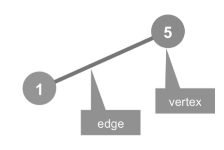
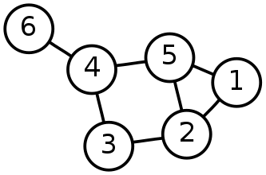
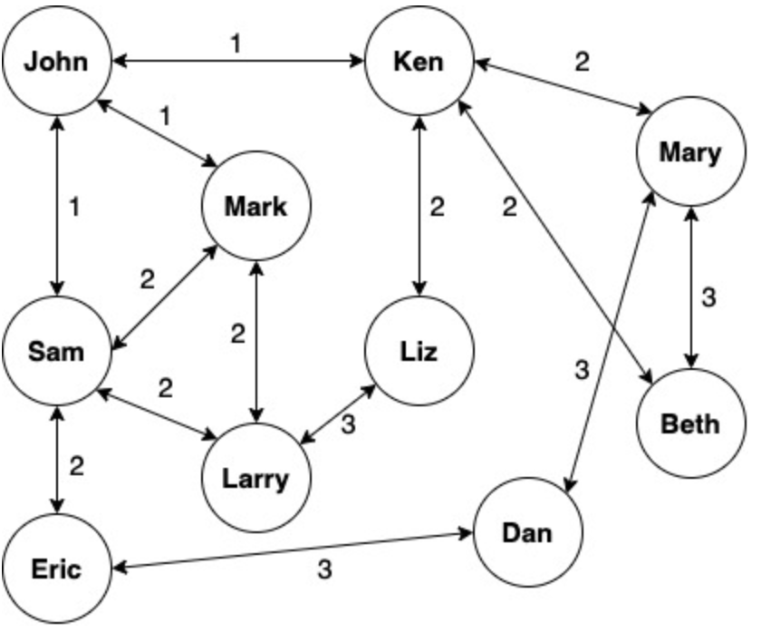

# 6.3 理解图的概念

图是一种非常通用的关系建模方式。只要问题同时包含“对象”和“对象之间的关系”，就可以考虑用图来表达。从交通网络、社交关系、推荐链路到风险传播，很多问题都可以转化为图论问题，再借助相应算法求解。因此，在进入 GraphX 之前，先把图的基本概念讲清楚是必要的。

图并不是指图形图像或地图，而是代表一种复杂的网络数据结构。通常来说，我们会把图视为一种由点（Vertex）组成的抽象网络，网络中的各点可以通过边（Edge）实现彼此的连接，表示两点有关联，注意上面图定义中的两个关键字，由此得到两个最基本的概念，点和边。另外，图也是一种复杂的非线性结构，在图结构中每个元素都可以有零个或多个前驱元素，也可以有零个或多个后继元素，也就是说元素之间的关系是任意的。从数学概念上讲，图是由点的有穷非空集合和点之间边的集合组成，通常表示为\(G(V,E)\)，其中\(G\)表示一个图，\(V\)是图\(G\)中点的集合，\(E\)是图\(G\)中边的集合。



图例 6‑1图的基本组成

一个图\(G\)由两类元素构成，分别称为点（或节点、结点）和边，每条边有两个点作为其端点，我们称这条边连接了它的两个端点，因此边可定义为由两个点构成的集合，在有向图中为有序对，边是有方向的。一个点一般表示为一个点或小圆圈。一个图\(G\)的点集合一般记作\(V(G)\)，当不发生混淆时可简记为\(V\)。图\(G\)的阶为其点数目，亦即|\(V(G)\)|。一条边一般表示为连接其两个端点的曲线。以两个点\(u\)、\(v\)为端点的边一般记作\((u,v)\)、\(\{ u,v\}\)或\(\text{uv}\)，一条边连接两个点\(u\)和\(v\)时，则称\(u\)与\(v\)相邻。图\(G\)的边集一般记作\(E(G)\)，当不发生混淆时可简记为\(E\)，如图例 6‑2所示，点集\(V = \left\{ 1,\ 2,\ 3,\ 4,\ 5,\ 6 \right\}\)，边集\(E = \ \{\{ 1,2\},\ \{ 1,5\},\ \{ 2,3\},\ \{ 2,5\},\ \{ 3,4\},\ \{ 4,5\},\ \{ 4,6\}\}\)。



图例 6‑2点集和边集

若两个点之间有一条边，则这两个点相邻。关联一个点\(v\)边的条数称为是\(点v\)的度数或价。距离是两个点之间经过最短路径的边的数目，通常用\(d_{G}(u,v)\)表示。点\(v\)的偏心率用来表示连接图\(G\)中的点
\(v\)到图\(G\)中其它点之间的最大距离，用符号\(\epsilon_{G}(v)\)表示。图的直径，表示取遍图的所有点，得到的偏心率的最大值，记作
\(diam(G)\)。相对于图直径的概念是图半径，表示图的所有点的偏心率的最小值，记作\(rad(G)\)，这两者间的关系是\(diam(G) \leqslant 2rad(G)\)。如果给图的每条边规定一个方向，那么得到的图称为有向图，其边也称为有向边。在有向图中，与一个节点相关联的边有出边和入边之分，而与一个有向边关联的两个点也有始点和终点之分，相反边没有方向的图称为无向图。

正则图是指各点的度均相同的无向简单图。在图论中，正则图中每个点具有相同数量的邻点；
即每个点具有相同的度或价态。正则的有向图也必须满足更多的条件，即每个点的内外自由度都要彼此相等。具有\(k\)个自由度的点的正则图被称为\(k\)度的\(k\)-正则图。此外，奇数程度的正则图形将包含偶数个点。最多2个等级的正则图很容易分类：0-正则图由断开的点组成，1-正则图由断开的边缘组成，2-正则图由断开的循环和无限链组成，3-正则图被称为立方图。强规则图也是常规图，其中每个相邻的点对具有相同数量的相邻的相邻数目，并且每个不相邻的点对具有相同数量的n个相邻的相邻公共点。常规但不太规则的最小图是循环图和6个点的循环图。

为了更好地理解图的概念，让我们看一下通常使用社交软件的方式，每天都可以使用智能手机在朋友圈中张贴消息或更新状态，我们的朋友也可以发布了自己的消息，照片和视频。我们有朋友，朋友还会有朋友等等，社交软件的设置可让我们结交新朋友或从朋友列表中删除朋友。社交软件还具有权限设置的功能，可以对谁看到什么以及可以与谁进行通信进行精细控制。当考虑社交软件平台具有有十亿个用户时，管理所有用户以及用户之间的关系和权限变得非常庞大和复杂。我们需要建立有关用户和关系数据的存储和检索，以便允许回答这样的问题，例如：X是Y的朋友吗？X和Y是直接关联还是在两个步之内的间接关联？X有多少个朋友？我们可以从尝试从一个简单的数据结构开始，使每个人都有一个朋友数组，因此可以很容易就用数组的长度来回答第三个问题，也可以只扫描数组并快速回答第一个问题，而第二个问题将需要做更多的工作。如下面的示例所示，我们通过使用专门的数据结构来解决该问题，在代码 6‑1中我们创建了一个案例类Person，然后添加朋友来建立John、Ken、Mary、Dan用户之间的关系：

```scala
scala> :paste
// Entering paste mode (ctrl-D to finish)
case class Person(name: String) {
val friends = scala.collection.mutable.ArrayBuffer[Person]()
def numberOfFriends() = friends.length
def isFriend(other: Person) = friends.find(_.name == other.name)
def isConnectedWithin2Steps(other: Person) = {
for {f <- friends} yield {
f.name == other.name ||
f.isFriend(other).isDefined
}
}.find(_ == true).isDefined
}
// Exiting paste mode, now interpreting.
defined class Person
scala> val john = Person("John")
john: Person = Person(John)
scala> val ken = Person("Ken")
ken: Person = Person(Ken)
scala> val mary = Person("Mary")
mary: Person = Person(Mary)
scala> val dan = Person("Dan")
dan: Person = Person(Dan)
scala> john.numberOfFriends
res0: Int = 0
scala> john.friends += ken
res1: john.friends.type = ArrayBuffer(Person(Ken))
scala> john.numberOfFriends
res2: Int = 1
scala> ken.friends += mary
res3: ken.friends.type = ArrayBuffer(Person(Mary))
scala> ken.numberOfFriends
res4: Int = 1
scala> mary.friends += dan
res5: mary.friends.type = ArrayBuffer(Person(Dan))
scala> mary.numberOfFriends
res6: Int = 1
scala> john.isFriend(ken)
res7: Option[Person] = Some(Person(Ken))
scala> john.isFriend(mary)
res8: Option[Person] = None
scala> john.isFriend(dan)
res9: Option[Person] = None
scala> john.isConnectedWithin2Steps(ken)
res10: Boolean = true
scala> john.isConnectedWithin2Steps(mary)
res11: Boolean = true
scala> john.isConnectedWithin2Steps(dan)
res12: Boolean = false
```

代码 6‑1

如果我们为所有用户构建Person()实例并将朋友添加到数组中，如前面的代码所示，我们将能够对谁是朋友以及两者之间的关系进行很多查询。图例 6‑3显示了Person()实例的数据结构以及它们在逻辑上的相互关系：



图例 6‑3 用户关系图

如果我们可以使用这个图查找John的朋友，可以快速找出直接朋友（边为1），间接朋友（边为2）和朋友朋友的朋友（边为3）。我们可以轻松扩展Person()类并提供越来越多的功能来回答不同的问题。我们通过该图显示了人和人之间的朋友关系，以及如何在人与人之间的关系网格中吸引每个人的所有朋友。

这种基于数学方式描述的图方便我们可以使用数学算法遍历和查询图，可以将这些技术应用于计算机科学以开发编程方法实现这些算法，并且可以达到一定的规模效率。我们已经尝试实现使用案例类Person程序构成了一个图的结构，但这只是最简单的用例。实际上，有很多可能的复杂扩展，例如要回答的以下问题：找到从X到Y的最佳路径，实际的应用就是GPS会找到前往目的地的最佳方法；认识到可能导致图分区的关键边，这个问题的一个示例是确定连接各个城市的Internet服务、水管或电力线的关键链接，如果关键链接中断将生成两个连接良好的城市子图，但是两个子图之间没有任何通信。

如果要回答上述问题将产生几种算法，例如最小生成树、最短路径，页面排名（Page Rank），交替最小二乘（Alternating Least
Squares，ALS），最大切割-最小流量算法（Max-Cut
Min-Flow）等，适用于广泛的用例，例如社交媒体软件的用户关系、网路搜索引擎的页面排名、航班时刻表、GPS导航等，其中我们可以清楚地看到基于点和边的数据结构，可以使用各种图算法进行分析，以产生不同的业务用例。
