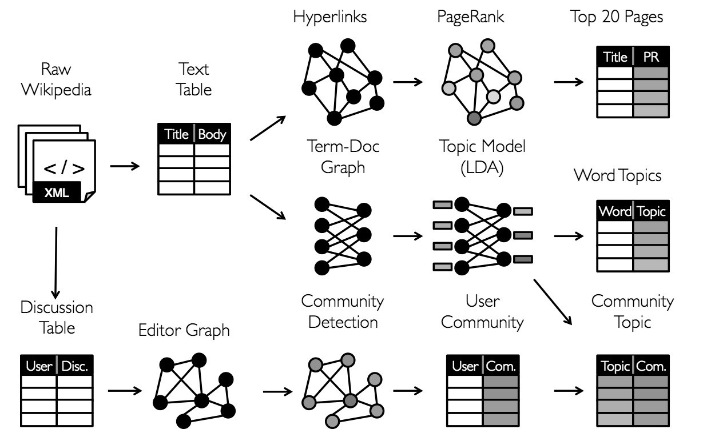
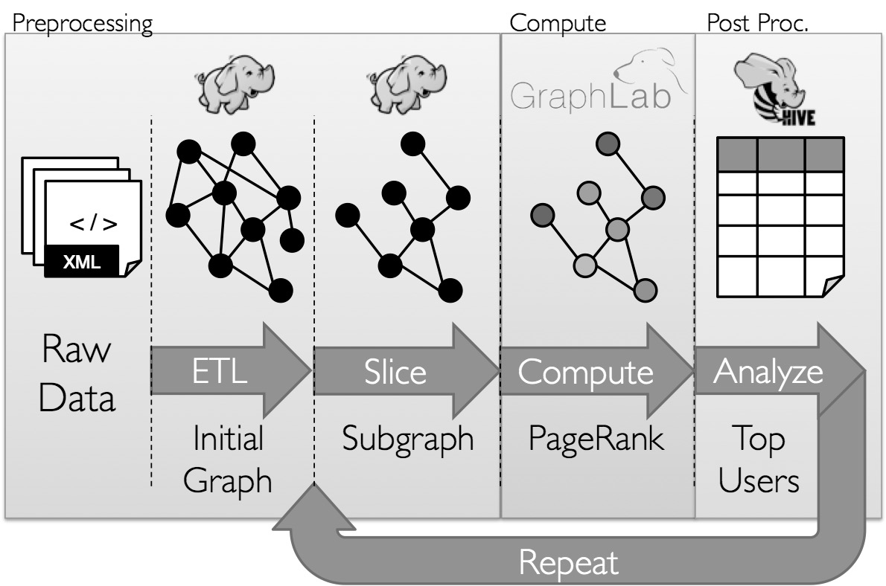

# 6.3 图并行系统

并不是所有带有关系的数据都必须进入图计算框架。如果任务只是一次性关联查询、统计分析或报表生成，DataFrame/SQL 往往更直接；图并行系统真正擅长的是大规模、迭代式图算法，例如 PageRank、社区发现、标签传播、最短路径等。本节的目标，就是说明这类系统为什么会出现，以及 GraphX 在其中扮演什么角色。

传统的数据分析方法侧重于事物本身，即实体，例如银行交易、资产注册等等。而图数据不仅关注事物，还关注事物之间的联系。例如，如果在通话记录中发现张三曾打电话给李四，就可以将张三和李四关联起来，这种关联关系提供了与两者相关的有价值的信息，这样的信息是不可能仅从两者单纯的个体数据中获取的。从社交网络到语言建模，以图为结构的数据规模和重要性日益增长，推动了许多新的图并行系统的发展。在社交网络及商品推荐场景中，对象和数据往往以图的形式展现出来，图计算系统在机器学习和数据挖掘中的重要性越来越凸显出来。随着计算规模和应用场景的增加，大量的图计算框架不断出现，例如Google
Pregel、Spark GraphX和GraphLab等图并行系统。

数据并行系统，像Spark和MapReduce等计算框架主要用于对数据集进行各种运算，在数据内部之间关联度不高的计算场景下能够有很高效的处理，由于数据之间的独立性，每部分数据都可以被分别进行处理，系统可以达到很高的并发度并具有良好的扩展性，可以简单地通过增加计算资源（CPU或节点数目）获取更高的处理能力。实际应用中，数据内部可能存在较高的关联度，如社交网络中不同用户之间就存在相关性。在对这样的数据进行处理时，并行计算框架就会面临较大的挑战，会引入大量的连接（Join）和聚集（Aggregation）操作，带来大量的计算和数据迁移，严重消耗集群资源，因此对图计算算法的优化就显得极为重要。针对数据并行计算框架在处理图计算时遇到的挑战，大量的图并行计算框架被开发出来，图并行计算主要针对图数据结构的特点，对数据进行更好的组织，充分挖掘图结构的特点，优化计算框架以达到较好的分布式计算性能。大部分图计算框架的原理都是对图数据进行分布式存储，在图数据上进行计算、传输和更新操作。通过操作图点的数据及与点相连的边上的数据，产生发送给与其相连的点的消息，消息通过网络或其他方式传输给指定点，点在收到消息或状态后进行更新，生成新的图数据。

在了解图并行系统之前，需要先了解关于通用的分布式图计算框架的两个常见问题：图存储模式和图计算模式。大规模图的存储总体上有边分割（Edge-Cut）和点分割（Vertex-Cut）两种存储方式。2013年，GraphLab2.0将其存储方式由边分割变为点分割，在性能上取得重大提升，目前基本上被业界广泛接受并使用。边分割的每个点都存储一次，但有的边会被打断分到两台机器上。这样做的好处是节省存储空间；坏处是对图进行基于边的计算时，对于一条两个点被分到不同机器上的边来说，要跨机器通信传输数据，内网通信流量大。点分割的每条边只存储一次，都只会出现在一台机器上。邻居多的点会被复制到多台机器上，增加了存储开销，同时会引发数据同步问题。好处是可以大幅减少内网通信量。虽然两种方法互有利弊，但现在是点分割占上风，各种分布式图计算框架都将自己底层的存储形式变成了点分割。主要原因有两个：（1）磁盘价格下降，存储空间不再是问题，而内网的通信资源没有突破性进展，集群计算时内网带宽是宝贵的，时间比磁盘更珍贵。这点就类似于常见的空间换时间的策略；（2）在当前的应用场景中，绝大多数网络都是无标度网络，遵循幂律分布，不同点的邻居数量相差非常悬殊。而边分割会使那些多邻居的点所相连的边大多数被分到不同的机器上，这样的数据分布会使得内网带宽更加捉襟见肘，于是边分割存储方式被渐渐抛弃了。

但是当图数据被分割后进入不同计算节点进行计算的时候，由于在不同节点中对于同一个节点有可能有多个副本，这个节点副本之间如何进行数据交换协同也成为了一个难题，于是GAS（Gather
Apply
Scatter）模型就被提出来解决这个难题。GAS模型主要分为3个阶段：Gather阶段、Apply阶段和Scatter阶段。Gather阶段的主要工作主要发生在各个计算节点，搜集这个计算节点图数据中某个点的相邻边和点的数据进行计算（例如在PageRank算法中计算某个点相邻的点的数量。Apply阶段的主要工作是将各个节点计算得到的数据，例如在PageRank算法中各计算节点计算出来的同一节点的相邻节点数，统一发送到某一个计算节点，由这个计算节点对图节点的数据进行汇总求和计算，这样就得到这个图点的所有相邻节点总数。Scatter阶段的主要工作是将中心计算节点计算的图点的所有相邻节点总数发送更新给各个计算节点中，这些收到更新信息的节点将会更新本计算节点中与这个图点相邻的点以及边的相关数据。

Pregel框架由谷歌提出，用于解决机器学习的数据同步和算法迭代，是基于BSP（Bulk Synchronous message
Passing）思想的图并行计算框架，它以点为中心，不断在点上进行算法迭代和数据同步。在Pregel计算模型中，输入数据是一个有向图，该有向图的每一个点包含点ID和属性值，这些属性可以被修改，其初始值由用户定义。有向边记录了源点和目的点的ID，并且也拥有用户定义的属性值。Pregel以点为中心，对边进行切割，将图数据分成若干个分区。每一个分区包含一组点以及由这组点为源点构成的边。

GraphLab由CMU的Select实验室提出，它是一个异步分布式共享存储模型。在GraphLab模型中，运行在点上的用户自定义程序可以对图中的点和边数据进行共享访问。程序可以访问当前作用的点、点相连接的边（包括入边和出边），以及相邻的点。GraphLab在进行图运算时，点是其最小的并行粒度和通信粒度，某个点可能被部署到多台机器上，其中一台机器上的为主点，其余机器上的为镜像点，与主点的数据保持同步。对边而言，GraphLab将其部署在某一台机器上，当图比较密，即边的数目较大时，可以减少边数据的存储量。GraphLab（图例 6‑4）通过限制可表达的计算类型和引入新技术来划分图进行并行分布，可以比一般的数据并行系统更高效地执行复杂的图算法。

图例 6‑4 图并行系统

为了使图并行系统实现显着性能提高，需要对其表达能力产生了限制，但是限制了它们在典型的图数据分析管道中表达许多重要阶段的能力。此外，虽然图并行系统针对像页面排名这样的迭代扩散算法进行了优化，但它们并不适用于构建图数据结构，这种结构需要随时大规模的更新或者跨越多个图进行计算等更基本的操作。而且，Hadoop的任务通常需要数据在图结构系统之外的移动，并且通常更自然地表达为在传统的数据并行系统中的表操作，例如MapReduce的并行数据处理。此外，我们如何看待数据取决于要实现的目标，并且在整个分析过程中相同的原始数据可能需要许多不同的表格和图表视图（图例 6‑5）：

图例 6‑5 图的分析过程

GraphLab通常需要能够在相同物理数据的表格和图表视图之间移动，并利用每个视图的属性来轻松高效地表达计算。但是，现有GraphLab图形分析管道组成图并行处理和数据并行系统，导致大量的数据移动和重复，导致了复杂的编程模型（图例 6‑6）。

图例 6‑6 图的分析管道

GraphX是构建于Spark上的图计算模型，GraphX利用Spark框架提供的内存缓存RDD、DAG和基于数据依赖的容错等特性，实现高效健壮的图计算框架。GraphX同样基于GAS模型，该模型将点分配给集群中各个节点进行存储，增大并行度，并解决真实情况下常会遇到的高出度点的情况，GraphX模型也是以边为中心，对点进行切割的。

