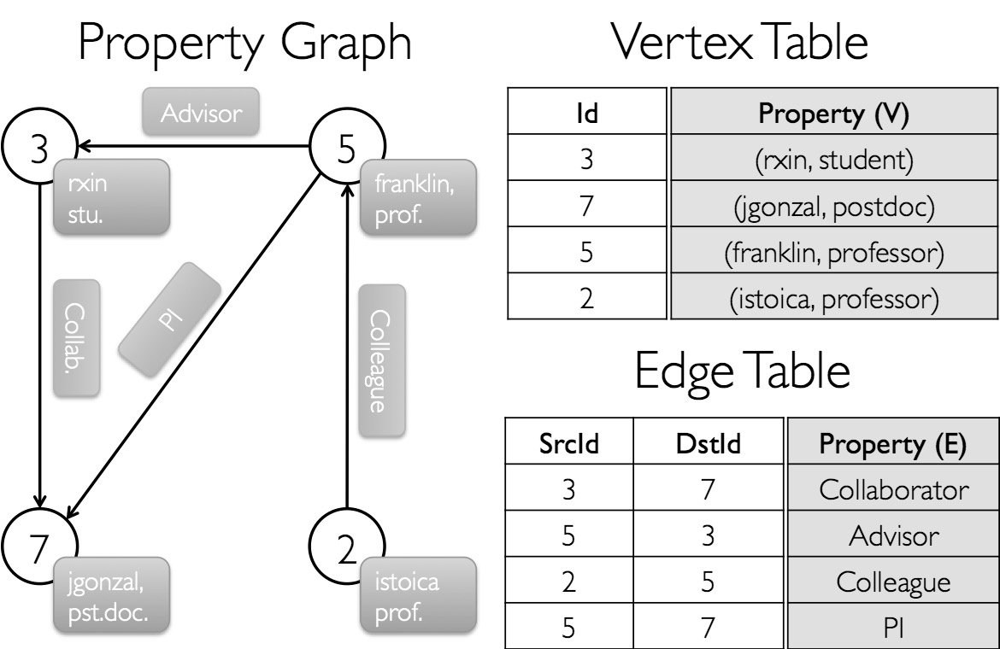
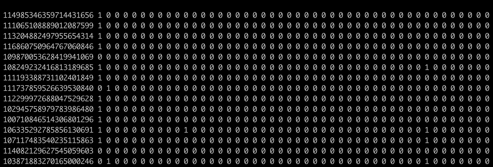

# 6.5 创建和探索图

在上一节中，我们构建了一个微型的社交网络，从本节开始我们将使用来自各种应用程序的真实数据集。实际上，图可以用于表示任何复杂的系统，因为它描述了系统组件之间的交互。尽管不同系统的形式、大小、性质和粒度各不相同，但是图论提供了一种通用语言和一组工具来表示和分析复杂系统。

在这一节，我们将遇到的第一种通信网络是电邮通信图，可以将组织内交换电子邮件的历史记录映射到通信图，以了解组织背后某种隐藏的结构。这样的图表还可以用于确定组织中有影响力的人员或枢纽，但是不一定是高级职位。电邮通信图是有向图的典型示例，因为每封电子邮件都是从起始节点链接到目标节点。我们将使用的语料库是由158名员工生成的电子邮件数据库，是在网络上向公众开放的大量公司电子邮件集合之一。另一个示例是成分与合成物网络，是一个二分图，将节点分为两个不相交的集合：成分节点和合成物节点。当食品成分中存在化学合成物时，将会存在一个成分与化合物链接。从成分与合成物网络可以创建所谓的调料网络。每当一对成分共享至少一种合成物时，调料网络就不会将食品成分与化合物连接起来，而是将这对成分链接在一起。在这一节，我们将构建成分与合成物网络，在下一节根据需要对图进行转换和成形，我们将从成分与合成物网络构建调料网络。分析此类图非常有趣，因为它们可以帮助我们更多地了解食物搭配和饮食文化，调料网络还可以帮助食品科学家或业余厨师创建新食谱。我们将在本节中探讨的最后一个数据集是社交媒体的自我中心网络的集合。数据集包括用户个人资料、他们的朋友圈和他们的自我中心网络。

作为Apache Spark组件，GraphX
主要实现了图的并行计算，位于Spark核心组件之上的分布式图处理框架。开发GraphX程序，首先需要将Spark和GraphX函数库导入到项目中，如下所示：
```scala

import org.apache.spark.\_

import org.apache.spark.graphx.\_

// To make some of the examples work we will also need RDD

import org.apache.spark.rdd.RDD

```


如果不使用Spark交互界面，还需要一个SparkContext。

### 6.5.1 属性图

属性图是一个有向多重图，用户定义的对象附加到每个点和边。有向多重图是具有潜在多个平行边的有向图，共享相同起始点和目标点的，支持平行边的能力简化了在同一点之间可以存在多个关系的建模场景（如同事和朋友）。每个点都有唯一的
64位长点标识符VertexId，GraphX不会对点标识符施加任何排序约束，类似地边具有对应的起始点和目标点标识符。

属性图在点类型VD和边类型ED上进行参数化，这些对象类型分别与每个点和边相关联。当对象类型是原始数据类型时，例如int、double等时，GraphX优化点和边类型的表示，通过将其存储在专门的数组中来减少内存占用。在某些情况下，可能希望在同一个图中具有不同属性类型的点，可以通过继承来实现，例如将用户和产品建模为二分图，可能会执行以下操作：

```scala
class VertexProperty()

case class UserProperty(name: String) extends VertexProperty
case class ProductProperty(name: String, price: Double) extends VertexProperty

// The graph might then have the type:
var graph: Graph[VertexProperty, String] = null
```


像 RDD 一样，属性图也是不可变、分布式且具备容错能力的数据结构。对图的值或结构做修改时，GraphX 会返回一个新图；但未受影响的结构、属性和索引通常会被复用，因此不必把整张图都重新复制一遍。图结构会通过顶点切分等启发式方法分布到不同执行器上，故障时也可以基于谱系重新恢复。逻辑上，一个属性图可以看成两组带类型的集合：`vertices` 和 `edges`，其中顶点和边都带有各自的属性，因此 `Graph` 类会暴露访问两者的成员：

```scala
class Graph[VD, ED] {
  val vertices: VertexRDD[VD]
  val edges: EdgeRDD[ED]
}
```


类VertexRDD\[VD\]和EdgeRDD\[ED\]扩展和优化了RDD\[(VertexId,
VD)\]和RDD\[Edge\[ED\]\]
版本，VertexRDD\[VD\]和EdgeRDD\[ED\]提供了基于图计算和利用内部优化的附加功能。假设要构建一个由GraphX项目中的各种协作者组成的属性图，点属性可能包含用户名和职业，可以用描述协作者之间关系的字符串来注释边：



图例 6‑7 属性图的定义

结果图将具有类型签名为：
```scala
val userGraph: Graph[(String, String), String]
```


有许多方法构建属性图，包括从原始文件、RDD、甚至合成生成器，最通用的方法是使用[Graph对象](https://spark.apache.org/docs/latest/api/scala/org/apache/spark/graphx/Graph$.html)，例如以下代码从RDD集合中构建一个图：
```scala
val sc: SparkContext

// 为点创建RDD
val users: RDD[(VertexId, (String, String))] =
  sc.parallelize(
    Array(
      (3L, ("rxin", "student")),
      (7L, ("jgonzal", "postdoc")),
      (5L, ("franklin", "prof")),
      (2L, ("istoica", "prof"))
    )
  )

// 为边创建RDD
val relationships: RDD[Edge[String]] =
  sc.parallelize(
    Array(
      Edge(3L, 7L, "collab"),
      Edge(5L, 3L, "advisor"),
      Edge(2L, 5L, "colleague"),
      Edge(5L, 7L, "pi")
    )
  )

// 定义默认用户，以防丢失用户
val defaultUser = ("John Doe", "Missing")

// 构建初始图
val graph = Graph(users, relationships, defaultUser)
```


在上面的例子中使用了Edge案例类，具有srcId和dstId属性，分别对应与起始点和目标点的标识符，此外Edge案例类具有attr成员，存储边属性。可以分别使用graph.vertices和graph.edges成员将图解构为相应的点和边视图。
```scala
val graph: Graph[(String, String), String] // Constructed from above

// 计算所有 postdoc 用户
graph.vertices.filter { case (id, (name, pos)) => pos == "postdoc" }.count

// 计算所有边，满足 srcId > dstId
graph.edges.filter(e => e.srcId > e.dstId).count
```


graph.vertices返回一个继承RDD\[(VertexId, (String,
String))\]类的VertexRDD\[(String,
String)\]类，因此使用case表达式来解构元组，另一方面graph.edges返回一个包含Edge\[String\]对象的EdgeRDD类，也可以使用案例类构造函数，如下所示：

```scala
graph.edges.filter { case Edge(src, dst, prop) => src > dst }.count
```


除了属性图的点和边视图之外，GraphX还公开了一个三元组视图。三元组视图逻辑上连接点和边属性，产生包含[EdgeTriplet](https://spark.apache.org/docs/latest/api/scala/org/apache/spark/graphx/EdgeTriplet.html)类实例的RDD\[EdgeTriplet\[VD,
ED\]\]，此连接可以用以下 SQL 表达式表示：
```sql
SELECT src.id, dst.id, src.attr, e.attr, dst.attr
FROM edges AS e LEFT JOIN vertices AS src, vertices AS dst
ON e.srcId = src.Id AND e.dstId = dst.Id
```


或图形为：


图例 6‑8 GraphX的三元组视图

[EdgeTriplet](https://spark.apache.org/docs/latest/api/scala/org/apache/spark/graphx/EdgeTriplet.html)类通过分别添加包含起始和目标属性的srcAttr和dstAttr成员来扩展[Edge](https://spark.apache.org/docs/latest/api/scala/org/apache/spark/graphx/Edge.html)类。可以使用图的三元组视图来呈现描述用户之间关系的字符串集合。
```scala
val graph: Graph[(String, String), String] // Constructed from above

// 使用三元组视图创建RDD
val facts: RDD[String] =
  graph.triplets.map(triplet =>
    triplet.srcAttr._1 + " is the " + triplet.attr + " of " + triplet.dstAttr._1
  )

facts.collect.foreach(println(_))
```


### 6.5.2 构建器

在GraphX中，有四个用于构建属性图的函数，每一个都要求应该以指定的方式构造数据。第一个是中已经看到的Graph工厂方法，在名为Graph的伴随对象的apply()方法中定义，如下所示：
```scala
def apply[VD, ED](
  vertices: RDD[(VertexId, VD)],
  edges: RDD[Edge[ED]],
  defaultVertexAttr: VD = null
): Graph[VD, ED]
```


如我们之前所见，此函数采用两个RDD集合：RDD \[(VertexId, VD)\]和RDD \[Edge
\[ED\]\]作为点和边的参数，并且构造了Graph
\[VD，ED\]参数。defaultVertexAttr属性用于为点分配默认属性，该点存在于边edges中但不存在于顶点vertices中的，如果容易获得边和点RDD集合时，使用Graph工厂方法很方便。但是，另一种更常见的情况是原始数据集仅表示为边。在这种情况下，GraphX提供以下在GraphLoader类中定义的edgeListFile函数：
```scala
def edgeListFile(
  sc: SparkContext,
  path: String,
  canonicalOrientation: Boolean = false,
  minEdgePartitions: Int = 1
): Graph[Int, Int]
```


该函数以包含边列表的文件路径作为参数，其中每一行代表图的边，由两个整数的表示为：sourceID和destinationID。在阅读文件列表时，该函数将忽略以“＃”开头的任何注释行，然后根据指定的边以及相应的点构造一个图。minEdgePartitions参数指定要生成的最小边分区数，如果HDFS文件具有更多块则边分区可能比指定的更多。

与GraphLoader.edgeListFile()相似，第三个函数Graph.fromEdges()使我们可以从RDD \[Edge
\[ED\]\]集合创建图，使用edges指定的VertexID参数以及defaultValue参数作为默认属性自动创建点：
```scala
def fromEdges[VD, ED](
  edges: RDD[Edge[ED]],
  defaultValue: VD
): Graph[VD, ED]
```


最后一个图构建器函数是Graph.fromEdgeTuples，它仅从边元组的RDD创建图，形式为RDD \[(VertexId,
VertexId)\]类型的集合。默认情况下，为边缘分配属性值1：
```scala
def fromEdgeTuples[VD](
  rawEdges: RDD[(VertexId, VertexId)],
  defaultValue: VD,
  uniqueEdges: Option[PartitionStrategy] = None
): Graph[VD, Int]
```


### 6.5.3 创建图

下面开始在 Spark 交互环境中构建三种不同类型的图：电邮通信网络有向图、成分与化合物连接形成的二分图，以及由构造器生成的多图。第一个例子是电邮通信网络。如果之前重启过 Spark Shell，需要先重新导入 GraphX 相关包。实验环境里提供了 `/data/emailEnron.txt`，其中保存的是员工邮件通信的邻接列表；可以直接把这个路径传给 `GraphLoader.edgeListFile` 来建图：

```scala
scala> import org.apache.spark.graphx._
import org.apache.spark.graphx._
scala> import org.apache.spark.rdd._
import org.apache.spark.rdd._
scala> val emailGraph = GraphLoader.edgeListFile(sc,
"/data/emailEnron.txt")
emailGraph: org.apache.spark.graphx.Graph[Int,Int] =
<org.apache.spark.graphx.impl.GraphImpl@7d6c383d>
```


`GraphLoader.edgeListFile` 返回的图会把顶点属性和边属性都初始化为 `Int` 类型的默认值 `1`。看一下前几个顶点和边，就能直观看到这一点：

```scala
scala> emailGraph.vertices.take(5)
res15: Array[(org.apache.spark.graphx.VertexId, Int)] =
Array((18624,1), (32196,1), (32432,1), (9166,1), (7608,1))
scala> emailGraph.edges.take(5)
res16: Array[org.apache.spark.graphx.Edge[Int]] = Array(Edge(0,1,1),
Edge(1,0,1), Edge(1,2,1), Edge(1,3,1), Edge(1,4,1))
```


第一个节点(19021,1)的点ID为19021，并且其属性确实设置为1，类似地第一个边Edge
(0,1,1)表示起始点为0和目标点为1之间的通信，边具有方向。
为了表达无向图或双向图，我们可以在两个方向上链接每个点，例如在电子邮件网络中，我们可以验证19021节点同时具有传入和传出链接，首先我们收集与节点19021通信的目标节点：

```scala
scala> emailGraph.edges.filter(_.srcId ==
19021).map(_.dstId).collect()
res17: Array[org.apache.spark.graphx.VertexId] = Array(696, 4232,
6811, 8315, 26007)
```


事实证明，这些相同的节点也是19021的传入边的起始节点：

```scala
scala> emailGraph.edges.filter(_.dstId ==
19021).map(_.srcId).collect()
res18: Array[org.apache.spark.graphx.VertexId] = Array(696, 4232,
6811, 8315, 26007)
```


在一些应用里，把系统表示成二分图会更自然。二分图由两组节点组成，同组节点之间不直接连边，只能和另一组节点连接。食品成分与化合物网络就是一个典型例子。这里会用到 `/data` 目录下的 `ingr_info.tsv`、`comp_info.tsv` 和 `ingr_comp.tsv` 三个文件，前两个分别描述食品成分和化合物。开始建图前，可以先用 `scala.io.Source.fromFile()` 快速看一下文件头部，确认字段组织方式：

```scala
scala> import scala.io.Source
import scala.io.Source
scala>
Source.fromFile("/data/ingr_info.tsv").getLines().take(7).foreach(println)
# id ingredient name category
0 magnolia_tripetala flower
1 calyptranthes_parriculata plant
2 chamaecyparis_pisifera_oil plant derivative
3 mackerel fish/seafood
4 mimusops_elengi_flower flower
5 hyssop herb
scala>
Source.fromFile("/data/comp_info.tsv").getLines().take(7).foreach(println)
# id Compound name CAS number
0 jasmone 488-10-8
1 5-methylhexanoic_acid 628-46-6
2 l-glutamine 56-85-9
3 1-methyl-3-methoxy-4-isopropylbenzene 1076-56-8
4 methyl-3-phenylpropionate 103-25-3
5 3-mercapto-2-methylpentan-1-ol_(racemic) 227456-27-1
scala>
Source.fromFile("/data/ingr_comp.tsv").getLines().take(7).foreach(println)
# ingredient id compound id
1392 906
1259 861
1079 673
22 906
103 906
1005 906
```


实际上，当前数据集没有以图构建器期望的形式出现。数据集有两个问题，首先不能简单地从邻接列表中创建图，因为成分和化合物的索引都从零开始并且彼此重叠，如果两个节点碰巧具有相同的点ID，则无法区分两个节点，其次有两种节点：成分和化合物。为了创建二分图，我们首先需要创建名为Ingredient和Compound的案例类，并使用Scala的继承，以便这两个类成为FNNode类的子级。

```scala
scala> class FNNode(val name: String) extends Serializable
defined class FNNode
scala> case class Ingredient(override val name: String, category:
String) extends FNNode(name)
defined class Ingredient
scala> case class Compound(override val name: String, cas: String)
extends FNNode(name)
defined class Compound
```


之后，我们需要将所有Compound和Ingredients对象加载到RDD \[FNNode\]集合中，这部分需要一些数据处理：

```scala
scala> :paste
// Entering paste mode (ctrl-D to finish)
val ingredients: RDD[(VertexId, FNNode)] =
sc.textFile("/data/ingr_info.tsv")
.filter(!_.startsWith("#"))
.map {
line =>
val row = line split '\t'
(row(0).toInt, Ingredient(row(1), row(2)))
}
// Exiting paste mode, now interpreting.
ingredients:
org.apache.spark.rdd.RDD[(org.apache.spark.graphx.VertexId, FNNode)] =
MapPartitionsRDD[3] at map at <pastie>:35
```


在中，我们首先将comp\_info.tsv中的文本加载到RDD\[String\]中，并过滤掉以“＃”开头的注释行，然后我们将制表符分隔的行解析为RDD\[(VertexId,
FNNode)\]类型的ingredients，然后对comp\_info.tsv实现相似的操作，并创建一个RDD\[(VertexId,
FNNode)\]类型的compounds：

```scala
scala> :paste
// Entering paste mode (ctrl-D to finish)
val compounds: RDD[(VertexId, FNNode)] =
sc.textFile("/data/comp_info.tsv")
.filter(!_.startsWith("#"))
.map {
line =>
val row = line.split('\t')
(10000L + row(0).toInt, Compound(row(1), row(2)))
}
// Exiting paste mode, now interpreting.
compounds: org.apache.spark.rdd.RDD[(org.apache.spark.graphx.VertexId,
FNNode)] = MapPartitionsRDD[7] at map at <pastie>:35
```


由于每个节点的索引应该唯一，因此必须将compounds索引的范围移动10000L，以使没有索引同时指向一种成分和一种化合物。接下来，我们创建一个RDD
\[Edge \[Int\]\] 集合，自名为ingr\_comp.tsv的数据集：

```scala
scala> :paste
// Entering paste mode (ctrl-D to finish)
val links: RDD[Edge[Int]] = sc.textFile("/data/ingr_comp.tsv")
.filter(!_.startsWith("#"))
.map {
line =>
val row = line.split('\t')
Edge(row(0).toInt, 10000L + row(1).toInt, 1)
}
// Exiting paste mode, now interpreting.
links: org.apache.spark.rdd.RDD[org.apache.spark.graphx.Edge[Int]] =
MapPartitionsRDD[11] at map at <pastie>:32
```


解析数据集中邻接列表的行时，要将化合物的索引移动10000L，因为我们事先从数据集描述中知道了数据集中有多少种成分和化合物。接下来，由于成分和化合物之间的链接不包含任何权重或有意义的属性，因此我们仅将Edge类的参数设置为Int类型，并将每个链接属性的默认值设置为1，最后将两组节点集合ingredients和compounds连接起来形成一个RDD，并将其与links一起传递给Graph()工厂方法：

```scala
scala> val nodes = ingredients ++ compounds
nodes: org.apache.spark.rdd.RDD[(org.apache.spark.graphx.VertexId,
FNNode)] = UnionRDD[12] at $plus$plus at <console>:33
scala> val foodNetwork = Graph(nodes, links)
foodNetwork: org.apache.spark.graphx.Graph[FNNode,Int] =
<org.apache.spark.graphx.impl.GraphImpl@1435103b>
```


先看一下成分与化合物图 `foodNetwork` 的内部数据：

```scala
scala> def showTriplet(t: EdgeTriplet[FNNode, Int]): String = "The
ingredient " ++ t.srcAttr.name ++ " contains " ++ t.dstAttr.name
showTriplet: (t:
org.apache.spark.graphx.EdgeTriplet[FNNode,Int])String
scala> foodNetwork.triplets.take(5).foreach(showTriplet _ andThen
println _)
The ingredient calyptranthes_parriculata contains citral_(neral)
The ingredient chamaecyparis_pisifera_oil contains undecanoic_acid
The ingredient hyssop contains myrtenyl_acetate
The ingredient hyssop contains
4-(2,6,6-trimethyl-cyclohexa-1,3-dienyl)but-2-en-4-one
The ingredient buchu contains menthol
```


首先，我们定义了一个名为showTriplet()的辅助函数，该函数返回成分与化合物三元组描述，然后我们取前五个三元组并将它们打印在控制台上。在中，我们使用了Scala的函数组合(showTriplet \_ andThen println
\_)，并将其传递给foreach()方法。

作为最后一个例子，根据前面介绍的社交媒体数据集构建一个自我中心网络，这是个人联系的图表示。准确地说，自我中心网络集中于单个节点，仅表示该节点与其邻居之间的链接。我们仅以建立一个人的自我中心网络为例，使用的数据集文件放在/data中，它们的描述如下：

ego.edges：这是自我中心网络的有向边，中心节点没有出现在此列表中，但是假定它关注的每个节点ID都出现在文件中。

ego.feat：这是每个节点的特征。

ego.featnames：这是每个特征维度的名称。如果用户的个人资料中具有此属性，则此功能为1，否则为0。

首先，从Breeze库中导入绝对值函数和SparseVector类，我们将使用它们：

```scala
scala> import scala.math.abs
import scala.math.abs
scala> import breeze.linalg.SparseVector
import breeze.linalg.SparseVector
```


然后，我们还为SparseVector \[Int\]定义一个名为Feature的类型同义词：

```scala
scala> type Feature = breeze.linalg.SparseVector[Int]
defined type alias Feature
```


使用以下代码，我们可以读取ego.feat文件中的特征并将其放入到键值对集合中，键和值分别为Long和Feature类型：

```scala
scala> import scala.io.Source
import scala.io.Source
scala> :paste
// Entering paste mode (ctrl-D to finish)
val featureMap: Map[Long, Feature] = Source.fromFile("/data/ego.feat")
.getLines()
.map {
line =>
val row = line.split(' ')
val key = abs(row.head.hashCode.toLong)
val feat = SparseVector(row.tail.map(_.toInt))
(key, feat)
}.toMap
// Exiting paste mode, now interpreting.
featureMap: Map[Long,Feature] = Map(421252149 ->
SparseVector(1319)((0,0), (1,1), (2,0), (3,0), (4,0), (5,0), (6,0),
(7,0), (8,0), (9,0), (10,0), (11,0), (12,0), (13,0), (14,0), (15,0),
(16,0), (17,0), (18,0), (19,0), (20,0), (21,0), (22,0), (23,0), (24,0),
(25,0), (26,0), (27,0), (28,0), (29,0), (30,0), (31,0), (32,0), (33,0),
(34,0), (35,0), (36,0), (37,0), (38,0), (39,0), (40,0), (41,0), (42,0),
(43,0), (44,0), (45,0), (46,0), (47,0), (48,0), (49,0), (50,0), (51,0),
(52,0), (53,0), (54,0), (55,0), (56,0), (57,0), (58,0), (59,0), (60,0),
(61,0), (62,0), (63,0), (64,0), (65,0), (66,0), (67,0), (68,0), (69,0),
(70,0), (71,0), (72,0), (73,0), (74,0), (75,0), (76,0), (77,0), (78,0),
(79,0), (80,0), (81,0), (82,0), (83,0), (84,0), (85,0), (86,0), (87,0),
(88,0), (89,0), (90,0), (91,0), (92...
```


先快速看一下 `ego.feat` 文件，就能理解前面那串 RDD 转换到底在处理什么。`ego.feat` 的每一行都具有下面这样的结构：



图例 6‑9

每行中的第一个数字对应于自我中心网络中的节点ID，其余的0和1数字表示此特定节点具有的特征，例如节点ID之后的第一个为性别特征，如果为1代表该节点具有此特征，如果为0则反之。实际上，每个特征都是由(description:value)形式设计的。我们需要进行一些数据整理，自我网络中的每个顶点都应具有Long类型的顶点ID，但是数据集中的节点ID超出了Long的允许范围，例如114985346359714431656，因此我们必须为节点创建新索引。其次，我们需要解析数据中的0和1字符串以创建具有更方便形式的特征向量。我们需要将节点ID相对应的字符串进行哈希处理，如下所示：
```text

val key = abs(row.head.hashCode.toLong)

```


然后，我们利用Breeze库中的SparseVector来有效地存储特征索引。接下来，我们可以读取ego.edges文件，在自我中心网络中创建链接的集合RDD
\[Edge
\[Int\]\]。相对于之前的示例，我们将自我中心网络建模为加权图。精确地，每个链接的属性将对应于每个连接节点对具有的共同特征的数量（计算两个节点特征向量的内积），通过以下转换完成的：

```scala
scala> :paste
// Entering paste mode (ctrl-D to finish)
val edges: RDD[Edge[Int]] = sc.textFile("/data/ego.edges")
.map {
line =>
val row = line split ' '
val srcId = abs(row(0).hashCode.toLong)
val dstId = abs(row(1).hashCode.toLong)
val srcFeat = featureMap(srcId)
val dstFeat = featureMap(dstId)
val numCommonFeats = srcFeat dot dstFeat
Edge(srcId, dstId, numCommonFeats)
}
// Exiting paste mode, now interpreting.
edges: org.apache.spark.rdd.RDD[org.apache.spark.graphx.Edge[Int]] =
MapPartitionsRDD[32] at map at <pastie>:36
```


最后，我们现在可以使用Graph.fromEdges()函数创建一个自我中心网络，此函数将RDD \[Edge
\[Int\]\]集合和点的默认值作为参数：

```scala
scala> val egoNetwork: Graph[Int, Int] = Graph.fromEdges(edges, 1)
egoNetwork: org.apache.spark.graphx.Graph[Int,Int] =
org.apache.spark.graphx.impl.GraphImpl@659d6f74
```


然后，我们可以检查自我中心网络中具有共同特征的链接数量：

```scala
scala> egoNetwork.edges.filter(_.attr == 3).count()
res2: Long = 1852
scala> egoNetwork.edges.filter(_.attr == 2).count()
res3: Long = 9353
scala> egoNetwork.edges.filter(_.attr == 1).count()
res4: Long = 107934
```


### 6.5.4 探索图

现在，我们将探索这三个图，并介绍网络节点的重要属性，即节点的度。节点的度代表其与其他节点的链接数。在有向图中，我们可以区分节点的传入度或入度（即其传入链接的数量）与节点的传出度或出度（即其传出链接的数量），我们将探讨三个示例网络的度分布。

```scala
scala> emailGraph.numEdges
res15: Long = 367662
scala> emailGraph.numVertices
res16: Long = 36692
```


实际上，在此示例中员工的入度和出度完全相同，因为电子邮件网络图是双向的，可以通过查看平均度来确认：

```scala
scala> emailGraph.inDegrees.map(_._2).sum / emailGraph.numVertices
res17: Double = 10.020222391802028
scala> emailGraph.outDegrees.map(_._2).sum / emailGraph.numVertices
res18: Double = 10.020222391802028
```


如果我们想找到发送电子邮件给最多人的人，则可以定义并使用以下max函数：

```scala
scala> :paste
// Entering paste mode (ctrl-D to finish)
def max(a: (VertexId, Int), b: (VertexId, Int)): (VertexId, Int) = {
if (a._2 > b._2) a else b
}
// Exiting paste mode, now interpreting.
max: (a: (org.apache.spark.graphx.VertexId, Int), b:
(org.apache.spark.graphx.VertexId,
Int))(org.apache.spark.graphx.VertexId, Int)
```


先看输出结果：

```scala
scala> emailGraph.outDegrees.reduce(max)
res19: (org.apache.spark.graphx.VertexId, Int) = (5038,1383)
```


这个节点既可能对应管理层，也可能只是某个通信流量很高的普通员工；无论身份如何，它都已经在组织网络里形成了明显枢纽。类似地，我们也可以定义 `min` 函数去寻找度最小的节点。接下来再看一个更直接的问题：电邮通信网络里是否存在一些几乎孤立的员工群体？

```scala
scala> emailGraph.outDegrees.filter(_._2 <= 1).count
res20: Long = 11211
```


似乎有很多员工仅从一位员工（也许是老板或人力资源部门）接收电子邮件。对于二分图成分与化合物，我们还可以研究哪种食物中化合物的数量最多，或者哪种化合物在我们的成分列表中最普遍：

```scala
scala> foodNetwork.outDegrees.reduce(max)
res21: (org.apache.spark.graphx.VertexId, Int) = (908,239)
scala> foodNetwork.vertices.filter(_._1 == 908).collect()
res22: Array[(org.apache.spark.graphx.VertexId, FNNode)] =
Array((908,Ingredient(black_tea,plant derivative)))
scala> foodNetwork.inDegrees.reduce(max)
res23: (org.apache.spark.graphx.VertexId, Int) = (10292,299)
scala> foodNetwork.vertices.filter(_._1 == 10292).collect()
res24: Array[(org.apache.spark.graphx.VertexId, FNNode)] =
Array((10292,Compound(1-octanol,111-87-5)))
```


前面两个问题的答案分别是红茶（`black_tea`）和化合物 1-辛醇（`1-octanol`）。类似地，我们也可以继续计算自我网络中的连接度，先看它的最大度和最小度：

```scala
scala> egoNetwork.degrees.reduce(max)
res25: (org.apache.spark.graphx.VertexId, Int) = (1643293729,1084)
scala> :paste
// Entering paste mode (ctrl-D to finish)
def min(a: (VertexId, Int), b: (VertexId, Int)): (VertexId, Int) = {
if (a._2 < b._2) a else b
}
// Exiting paste mode, now interpreting.
min: (a: (org.apache.spark.graphx.VertexId, Int), b:
(org.apache.spark.graphx.VertexId,
Int))(org.apache.spark.graphx.VertexId, Int)
scala> egoNetwork.degrees.reduce(min)
res26: (org.apache.spark.graphx.VertexId, Int) = (687907923,1)
```


假设我们现在要获得度的直方图数据，然后我们可以编写以下代码来做到这一点：

```scala
scala> egoNetwork.degrees.map(t => (t._2, t._1)).groupByKey.map(t
=> (t._1, t._2.size)).sortBy(_._1).collect()
res27: Array[(Int, Int)] = Array((1,15), (2,19), (3,12), (4,17),
(5,11), (6,19), (7,14), (8,9), (9,8), (10,10), (11,1), (12,9), (13,6),
(14,7), (15,8), (16,6), (17,5), (18,5), (19,7), (20,6), (21,8), (22,5),
(23,8), (24,1), (25,2), (26,5), (27,8), (28,4), (29,6), (30,7), (31,5),
(32,10), (33,6), (34,10), (35,5), (36,9), (37,7), (38,8), (39,5),
(40,4), (41,3), (42,1), (43,3), (44,5), (45,7), (46,6), (47,3), (48,6),
(49,1), (50,9), (51,5), (52,8), (53,8), (54,4), (55,2), (56,5), (57,7),
(58,4), (59,8), (60,9), (61,12), (62,5), (63,15), (64,5), (65,7),
(66,6), (67,9), (68,4), (69,5), (70,4), (71,7), (72,9), (73,10), (74,2),
(75,6), (76,7), (77,10), (78,7), (79,9), (80,5), (81,3), (82,4), (83,7),
(84,7), (85,4), (86,6), (87,6), (88,10), (89,4), (90,6), (91,3), (92,4),
(93,7), (94,4), (95,6)...
```


