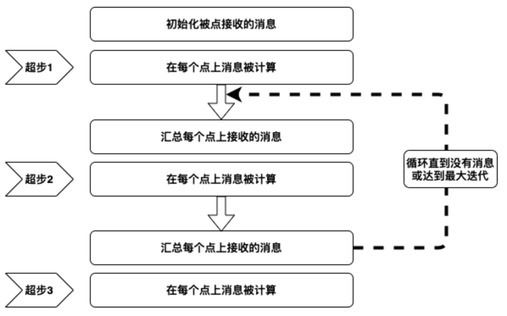

# 6.8 案例分析

在案例分析中，将使用飞行数据更详细地描述创建属性图的每一步，使用航班数据作为输入数据，机场是属性图中的点，路线是边。我们使用2014年1月的航班信息，对于每个航班，我们都有以下信息：

| 字段                      | 描述          | 例子     |
| ----------------------- | ----------- | ------ |
| dOfM(String)            | 一个月中的某天     | 1      |
| dOfW (String)           | 星期几         | 4      |
| carrier (String)        | 运营商代码       | AA     |
| tailNum (String)        | 飞机的唯一标识符-尾号 | N787AA |
| flnum(Int)              | 航班号         | 21     |
| org\_id(String)         | 始发机场编号      | 12478  |
| origin(String)          | 始发机场代码      | JFK    |
| dest\_id (String)       | 目的地机场编号     | 12892  |
| dest (String)           | 目的地机场代码     | LAX    |
| crsdeptime(Double)      | 预定出发时间      | 900    |
| deptime (Double)        | 实际出发时间      | 855    |
| depdelaymins (Double)   | 出发延迟分钟      | 0      |
| crsarrtime (Double)     | 预定到达时间      | 1230   |
| arrtime (Double)        | 实际到达时间      | 1237   |
| arrdelaymins (Double)   | 到达延迟分钟      | 7      |
| crselapsedtime (Double) | 经过时间        | 390    |
| dist (Int)              | 距离          | 2475   |

表格 6‑1 航班数据

在这种情况下，我们将机场表示为顶点，将路线表示为边。我们希望了解有出发或到达的机场的数量。

### 6.8.1 定义点

首先，我们将导入GraphX包。

```scala
scala> import org.apache.spark.graphx.{Edge, Graph, VertexId}
import org.apache.spark.graphx.{Edge, Graph, VertexId}
scala> import scala.util.Try
import scala.util.Try
```

代码 6‑113

下面我们使用Scala案例类来定义与CSV数据文件相对应的数据结构Flight。

```scala
scala> :paste
// Entering paste mode (ctrl-D to finish)
case class Flight(dofM: String, dofW: String, carrier: String, tailnum:
String,
flnum: Int, org_id: Long, origin: String, dest_id: Long, dest: String,
crsdeptime: Double, deptime: Double, depdelaymins: Double, crsarrtime:
Double,
arrtime: Double, arrdelay: Double, crselapsedtime: Double, dist: Int)
// Exiting paste mode, now interpreting.
defined class Flight
```

代码 6‑114

下面的函数将数据文件中的一行解析为Flight类。

```scala
scala> :paste
// Entering paste mode (ctrl-D to finish)
def parseFlight(str: String): Flight = {
val line = str.split(',')
Flight(line(0), line(1), line(2),
line(3), line(4).toInt, line(5).toLong,
line(6), line(7).toLong, line(8),
line(9).toDouble, line(10).toDouble,
line(11).toDouble, line(12).toDouble,
Try(line(13).toDouble).getOrElse(0.0),
Try(line(14).toDouble).getOrElse(0.0),
line(15).toDouble, line(16).toInt)
}
// Exiting paste mode, now interpreting.
parseFlight: (str: String)Flight
```

代码 6‑115

下面，我们将CSV文件中的数据加载到RDD中，使用first()动作返回RDD中的第一个元素。

```scala
scala> val textRDD = sc.textFile("/data/rita2014jan.csv")
textRDD: org.apache.spark.rdd.RDD[String] = /data/rita2014jan.csv
MapPartitionsRDD[1] at textFile at <console>:26
```

//用方法parseFlight解析每行RDD

```scala
scala> val flightsRDD = textRDD.map(parseFlight).cache()
flightsRDD: org.apache.spark.rdd.RDD[Flight] = MapPartitionsRDD[2]
at map at <console>:29
scala> flightsRDD.first
res9: Flight =
Flight(1,3,AA,N338AA,1,12478,JFK,12892,LAX,900.0,914.0,14.0,1225.0,1238.0,13.0,385.0,2475)
```

代码 6‑116

我们将机场定义为点，可以具有与之关联的属性，点具有的属性为机场名称(name:String)。

// 创建机场RDD

```scala
scala> val airports = flightsRDD.map(flight => (flight.org_id,
flight.origin)).distinct
airports: org.apache.spark.rdd.RDD[(Long, String)] =
MapPartitionsRDD[6] at distinct at <console>:27
scala> airports.take(1)
res0: Array[(Long, String)] = Array((14057,PDX))
```

// 定义缺省点nowhere

```scala
scala> val nowhere = "nowhere"
nowhere: String = nowhere
```

// 打印出机场信息

```scala
scala> val airportMap = airports.map { case ((org_id), name) =>
(org_id -> name) }.collect.toList.toMap
airportMap: scala.collection.immutable.Map[Long,String] = Map(13024
-> LMT, 10785 -> BTV, 14574 -> ROA, 14057 -> PDX, 13933 -> ORH,
10918 -...
```

代码 6‑117

### 6.8.2 定义边

边是机场之间的路线，必须具有始发点(org\_id:Long)和目标点(dest\_id:Long)，并且可以具有属性距离(dist:Int)。边RDD具有的形式为(src\_id,
dest\_id, dist）。

// 创建路径RDD(srcid, destid, distance)

```scala
scala> val routes = flightsRDD.map(flight => ((flight.org_id,
flight.dest_id), flight.dist)).distinct
routes: org.apache.spark.rdd.RDD[((Long, Long), Int)] =
MapPartitionsRDD[10] at distinct at <console>:27
scala> routes.take(2)
res16: Array[((Long, Long), Int)] = Array(((14869,14683),1087),
((14683,14771),1482))
```

// 创建边RDD(srcid, destid, distance)

```scala
scala> val edges = routes.map { case ((org_id, dest_id), distance)
=> Edge(org_id.toLong, dest_id.toLong, distance) }
edges: org.apache.spark.rdd.RDD[org.apache.spark.graphx.Edge[Int]] =
MapPartitionsRDD[11] at map at <console>:27
scala> edges.take(1)
res17: Array[org.apache.spark.graphx.Edge[Int]] =
Array(Edge(14869,14683,1087))
```

代码 6‑118

### 6.8.3 创建图

要创建属性图，需要具有点RDD、边RDD和一个默认顶点。创建一个称为graph的属性图，然后回答几个问题。

// 定义图

```scala
scala> val graph = Graph(airports, edges, nowhere)
graph: org.apache.spark.graphx.Graph[String,Int] =
org.apache.spark.graphx.impl.GraphImpl@422179c7
scala> graph.vertices.take(2)
res3: Array[(org.apache.spark.graphx.VertexId, String)] =
Array((10208,AGS), (10268,ALO))
scala> graph.edges.take(2)
res4: Array[org.apache.spark.graphx.Edge[Int]] =
Array(Edge(10135,10397,692), Edge(10135,13930,654))
```

代码 6‑119

  - 有几个机场？

```scala
scala> val numairports = graph.numVertices
numairports: Long = 301
```

代码 6‑120

  - 有几条路线？

```scala
scala> val numroutes = graph.numEdges
numroutes: Long = 4090
```

代码 6‑121

  - 哪些路线的距离大于1000？

```scala
scala> graph.edges.filter { case (Edge(org_id, dest_id, distance))
=> distance > 1000 }.take(3)
res15: Array[org.apache.spark.graphx.Edge[Int]] =
Array(Edge(10140,10397,1269), Edge(10140,10821,1670),
Edge(10140,12264,1628))
```

代码 6‑122

  - EdgeTriplet类扩展Edge类，添加了srcAttr和dstAttr成员，打印输出看一看结果。

```scala
scala> graph.triplets.take(3).foreach(println)
((10135,ABE),(10397,ATL),692)
((10135,ABE),(13930,ORD),654)
((10140,ABQ),(10397,ATL),1269)
```

代码 6‑123

  - 排序并打印出前10个最长的路线

```scala
scala> :paste
// Entering paste mode (ctrl-D to finish)
graph.triplets.sortBy(_.attr, ascending=false).map(triplet =>
"Distance " + triplet.attr.toString + " from " + triplet.srcAttr + " to
" + triplet.dstAttr + ".").take(10).foreach(println)
// Exiting paste mode, now interpreting.
Distance 4983 from JFK to HNL.
Distance 4983 from HNL to JFK.
Distance 4963 from EWR to HNL.
Distance 4963 from HNL to EWR.
Distance 4817 from HNL to IAD.
Distance 4817 from IAD to HNL.
Distance 4502 from ATL to HNL.
Distance 4502 from HNL to ATL.
Distance 4243 from HNL to ORD.
Distance 4243 from ORD to HNL.
```

代码 6‑124

  - 计算点的出入度最大值

// 定义一个聚合函数计算点的出入度最大值

```scala
scala> :paste
// Entering paste mode (ctrl-D to finish)
def max(a: (VertexId, Int), b: (VertexId, Int)): (VertexId, Int) = {
if (a._2 > b._2) a else b
}
// Exiting paste mode, now interpreting.
max: (a: (org.apache.spark.graphx.VertexId, Int), b:
(org.apache.spark.graphx.VertexId,
Int))(org.apache.spark.graphx.VertexId, Int)
scala> val maxInDegree: (VertexId, Int) = graph.inDegrees.reduce(max)
maxInDegree: (org.apache.spark.graphx.VertexId, Int) = (10397,152)
scala> val maxOutDegree: (VertexId, Int) = graph.outDegrees.reduce(max)
maxOutDegree: (org.apache.spark.graphx.VertexId, Int) = (10397,153)
scala> val maxDegrees: (VertexId, Int) = graph.degrees.reduce(max)
maxDegrees: (org.apache.spark.graphx.VertexId, Int) = (10397,305)
```

//得到10397的机场名称

```scala
scala> airportMap(10397)
res0: String = ATL
```

代码 6‑125

  - 前3个进港航班最多的机场？

```scala
scala> val maxIncoming = graph.inDegrees.collect.sortWith(_._2 >
_._2).map(x => (airportMap(x._1), x._2)).take(3)
maxIncoming: Array[(String, Int)] = Array((ATL,152), (ORD,145),
(DFW,143))
```

代码 6‑126

  - 前3个出港航班最多的机场？

```scala
scala> val maxout= graph.outDegrees.join(airports).sortBy(_._2._1,
ascending=false).take(3)
maxout: Array[(org.apache.spark.graphx.VertexId, (Int, String))] =
Array((10397,(153,ATL)), (13930,(146,ORD)), (11298,(143,DFW)))
```

代码 6‑127

### 6.8.4 PageRank

另一个GraphX运算符是PageRank，是基于谷歌PageRank算法的。PageRank通过确定哪些顶点与其他顶点的边最多，来衡量图中每个顶点的重要性。在我们的示例中，我们可以使用PageRank测量哪些机场与其他机场的联系最多，来确定哪些机场最重要。我们必须指定误差，这是收敛的量度。

  - 根据PageRank，最重要的机场是哪些？

```scala
scala> val ranks = graph.pageRank(0.1).vertices
ranks: org.apache.spark.graphx.VertexRDD[Double] =
VertexRDDImpl[164] at RDD at VertexRDD.scala:57
```

// 联结机场RDD

```scala
scala> val temp= ranks.join(airports)
temp: org.apache.spark.rdd.RDD[(org.apache.spark.graphx.VertexId,
(Double, String))] = MapPartitionsRDD[173] at join at <console>:29
scala> temp.take(1)
res1: Array[(org.apache.spark.graphx.VertexId, (Double, String))] =
Array((15370,(1.0946033493995184,TUL)))
```

// 进行排序

```scala
scala> val temp2 = temp.sortBy(_._2._1, false)
temp2: org.apache.spark.rdd.RDD[(org.apache.spark.graphx.VertexId,
(Double, String))] = MapPartitionsRDD[178] at sortBy at
<console>:27
scala> temp2.take(2)
res2: Array[(org.apache.spark.graphx.VertexId, (Double, String))] =
Array((10397,(11.080729516515449,ATL)), (13930,(11.04763496562952,ORD)))
scala> val impAirports =temp2.map(_._2._2)
impAirports: org.apache.spark.rdd.RDD[String] =
MapPartitionsRDD[179] at map at <console>:27
```

//获得前4个重要的机场

```scala
scala> impAirports.take(4)
res3: Array[String] = Array(ATL, ORD, DFW, DEN)
```

代码 6‑128

### 6.8.5 Pregel

许多重要的图算法是迭代算法，因为点的性质取决于他们的邻居。Pregel是谷歌研发的一种迭代图处理模型，使用图中点之间传递一系列消息迭代序列。GraphX实现了类似Pregel的批量同步消息传递API。使用GraphX中的Pregel实现时，点只能将消息发送到相邻的顶点。Pregel运算符在一系列超步中执行，在每个超步中，顶点从上一个超步接收入站消息的汇总，为点属性计算一个新值，在下一个超步中，将消息发送到相邻顶点。当没有更多消息时，Pregel运算符将结束迭代，并返回最终图。



图例 6‑10 Pregel计算过程

下面的代码使用Pregel计算最便宜的机票，其中使用的公式为：50 +距离/ 20

// 起始点

```scala
scala> val sourceId: VertexId = 13024
sourceId: org.apache.spark.graphx.VertexId = 13024
```

// 定义一个图，其中的边包含机票计算公式

```scala
scala> val gg = graph.mapEdges(e => 50.toDouble + e.attr.toDouble/20 )
gg: org.apache.spark.graphx.Graph[String,Double] =
org.apache.spark.graphx.impl.GraphImpl@eba03c9
```

// 初始化图，除了起始点，所以点都是距离无穷大

```scala
scala> val initialGraph = gg.mapVertices((id, _) => if (id ==
sourceId) 0.0 else Double.PositiveInfinity)
initialGraph: org.apache.spark.graphx.Graph[Double,Double] =
<org.apache.spark.graphx.impl.GraphImpl@2ab0ee54>
```

// 在图上调用pregel

```scala
scala> :paste
// Entering paste mode (ctrl-D to finish)
val sssp = initialGraph.pregel(Double.PositiveInfinity)(
// Vertex Program
(id, dist, newDist) => math.min(dist, newDist),
triplet => {
// Send Message
if (triplet.srcAttr + triplet.attr < triplet.dstAttr) {
Iterator((triplet.dstId, triplet.srcAttr + triplet.attr))
} else {
Iterator.empty
}
},
// Merge Message
(a,b) => math.min(a,b)
)
// Exiting paste mode, now interpreting.
sssp: org.apache.spark.graphx.Graph[Double,Double] =
org.apache.spark.graphx.impl.GraphImpl@1d7f6ec1
// routes , lowest flight cost
scala> println(sssp.edges.take(4).mkString("\n"))
Edge(10135,10397,84.6)
Edge(10135,13930,82.7)
Edge(10140,10397,113.45)
Edge(10140,10821,133.5)
// routes with airport codes , lowest flight cost
scala> sssp.edges.map{ case ( Edge(org_id, dest_id,price))=> (
(airportMap(org_id), airportMap(dest_id), price))
}.takeOrdered(10)(Ordering.by(_._3))
res6: Array[(String, String, Double)] = Array((WRG,PSG,51.55),
(PSG,WRG,51.55), (CEC,ACV,52.8), (ACV,CEC,52.8), (ORD,MKE,53.35),
(IMT,RHI,53.35), (MKE,ORD,53.35), (RHI,IMT,53.35), (STT,SJU,53.4),
(SJU,STT,53.4))
// airports , lowest flight cost
scala> println(sssp.vertices.take(4).mkString("\n"))
(10208,277.79999999999995)
(10268,260.7)
(14828,261.65)
(14698,125.25)
// airport codes , sorted lowest flight cost
scala> sssp.vertices.collect.map(x => (airportMap(x._1),
x._2)).sortWith(_._2 < _._2)
res8: Array[(String, Double)] = Array((LMT,0.0), (PDX,62.05),
(SFO,65.75), (EUG,117.35), (RDM,117.85), (SEA,118.5), (MRY,119.6),
(MOD,119.65), (SMF,120.05), (CIC,123.4), (FAT,123.65), (SBP,125.25),
(RNO,125.35), (MMH,125.4), (RDD,125.7), (BFL,127.65), (ACV,128.25),
(SBA,128.85), (CEC,130.95), (BUR,132.05), (MFR,132.2), (LAX,132.6),
(LGB,133.45), (ONT,133.9), (SNA,134.35), (OTH,136.35), (LAS,136.45),
(PSP,136.8), (SAN,138.1), (OAK,139.2), (SJC,140.5), (BOI,141.85),
(SLC,143.55), (SUN,145.1), (PSC,146.75), (PHX,148.3), (JAC,152.6),
(TUS,153.3), (BZN,156.1), (ASE,158.15), (ABQ,160.55), (DEN,161.6),
(COS,163.95), (GEG,179.7), (MSP,183.35), (OKC,184.95),
(MCI,186.14999999999998), (CLD,186.89999999999998), (DFW,188.95),
(ANC,189.14999999999998), (SMX,189.3), (SAT,189.85), (AUS,190.95),
(YUM,1...
```

代码 6‑129

