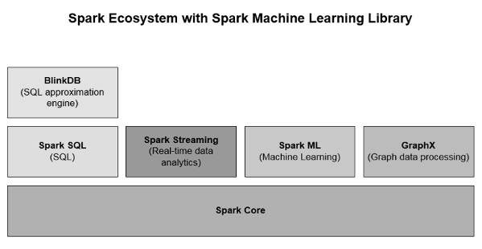
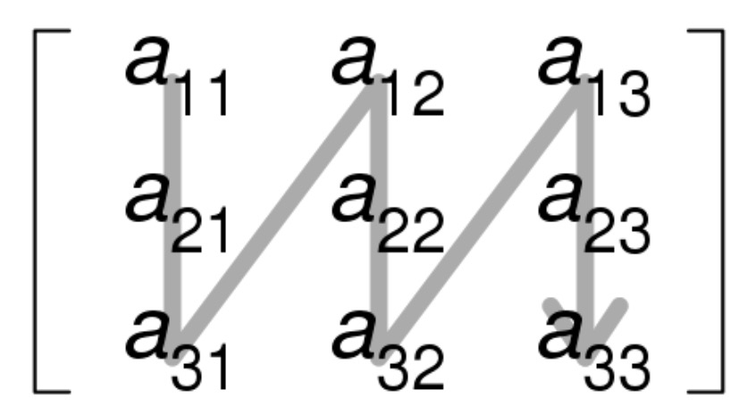
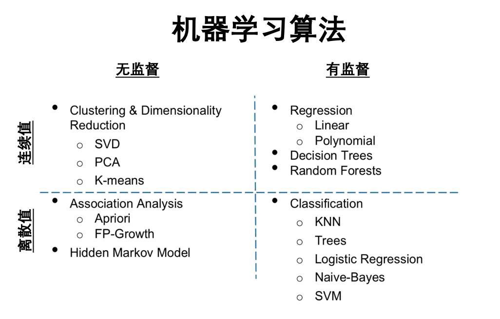
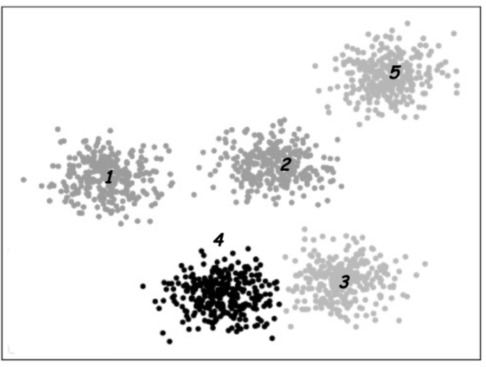
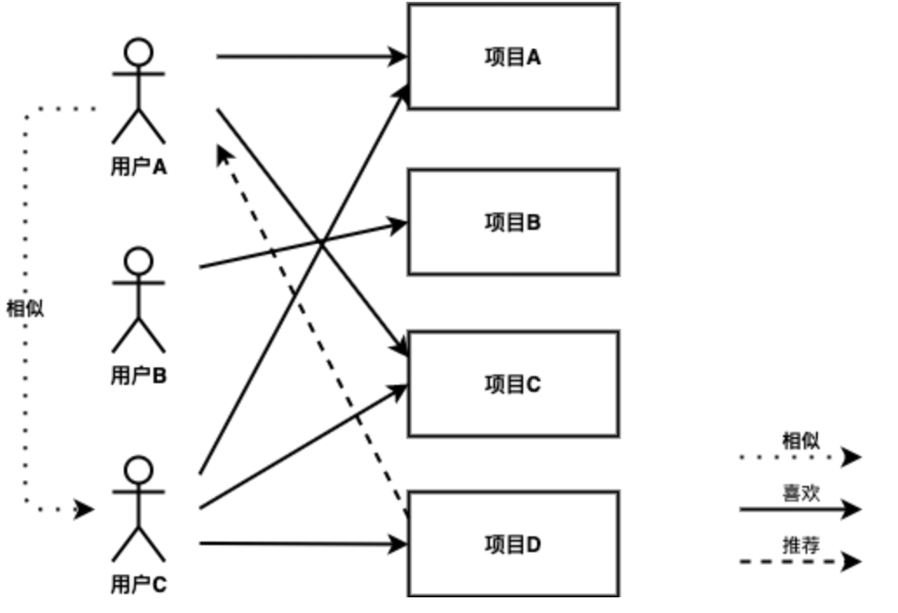
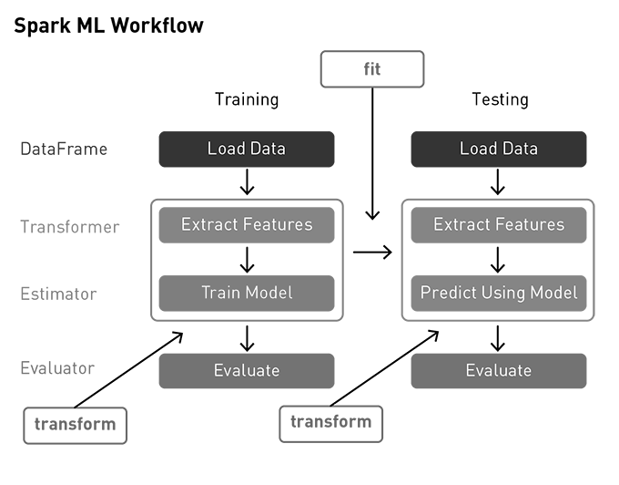
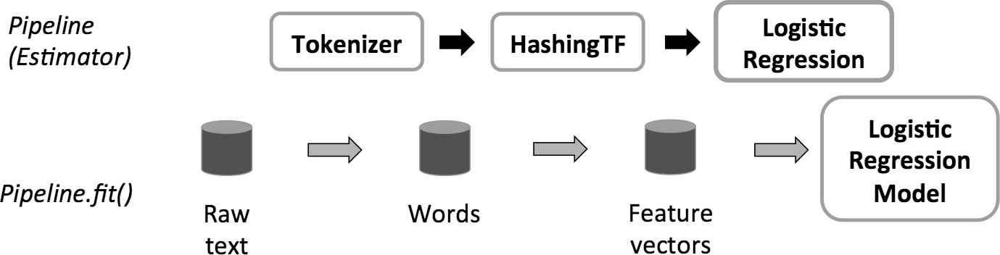
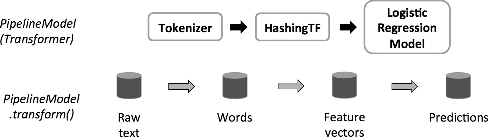
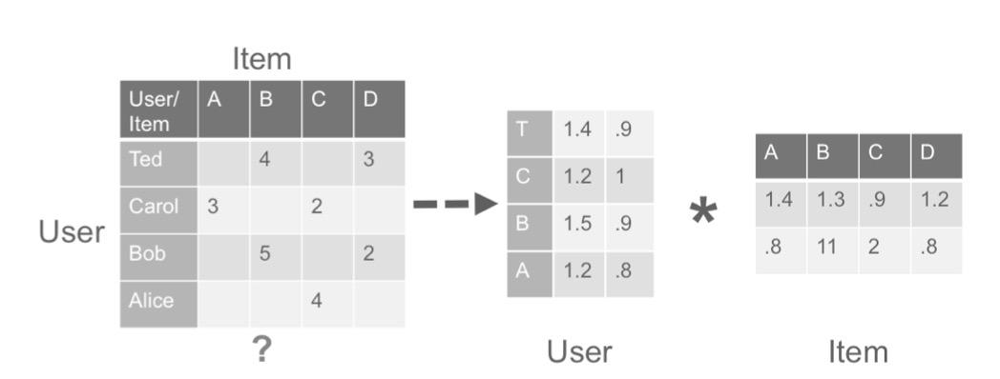
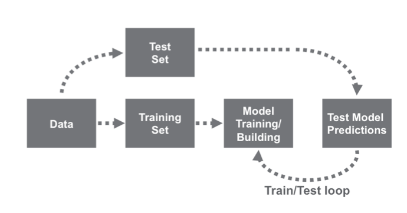

# 机器学习

## 本章先看懂什么
- Spark ML Pipeline 的核心链路：特征 -> 模型 -> 评估。
- 训练集/测试集划分与指标选择。
- 如何避免“能跑但不准”的常见问题。

## 一个最小例子
需求：预测用户是否会流失（二分类）。
1. 组装特征向量。
2. 训练 LogisticRegression。
3. 用 AUC/Accuracy 评估。
4. 调整正则化参数再训练。

先形成“训练-评估-迭代”的闭环，再追求更复杂模型。

> **版本基线（更新于 2026-02-13）**
> 本书默认适配 Apache Spark 4.1.1（稳定版），并兼容 4.0.2 维护分支。
> 推荐环境：JDK 17+（建议 JDK 21）、Scala 2.13、Python 3.10+。
机器学习是一门多领域交叉学科，涉及概率论、统计学、逼近论、凸分析、算法复杂度理论等多门学科。专门研究计算机怎样模拟或实现人类的学习行为，以获取新的知识或技能，重新组织已有的知识结构使之不断改善自身的性能。本课程将学习怎样定义Spark机器学习库；学习三种流行的机器学习技术：分类，聚类和协同过滤（推荐算法），并利用协同过滤来预测用户会喜欢什么。

## MLlib和ML

在本文中，将讨论机器学习概念以及如何使用Apache Spark
MLlib库来运行预测分析。将使用示例应用程序来说明Spark机器学习领域中功能强大的API。

> 迁移建议（Spark 4.x）：
> 本章部分示例仍使用`spark.mllib`（RDD API）以便解释算法原理与历史写法。新项目建议优先使用`spark.ml`（DataFrame API），并将特征工程、训练、评估与推理统一到Pipeline中。

目前，Spark 机器学习是Apache Spark生态系统中重要的大数据分析库，如图例 4‑1所示。Spark机器学习
API包括两个名为spark.mllib和spark.ml软件包。spark.mllib软件包基于弹性分布式数据集（RDD）的原始机器学习API，其提供机器学习的基本统计算法，包括相关性、分类和回归、协同过滤、聚类和降维。另一方面，
spark.ml包提供了建立在DataFrame上的机器学习API，DataFrame正在成为Spark
SQL库的核心部分。使用该包可用于开发和管理机器学习管道，还提供特征提取器、转换器、选择器，以及机器学习技术，如分类和回归，以及聚集算法。

图例 4‑1Spark的生态系统

基于RDD的MLlib API处于维护模式。Spark 4.x下，官方机器学习主线是`spark.ml`（基于DataFrame/Dataset的管道化API），而`spark.mllib`主要用于兼容历史代码并接收必要修复。实践中，新项目应优先使用`spark.ml`，仅在维护存量系统或处理个别未迁移能力时才使用RDD风格API。目前很多生产系统仍会在迁移过程中混合使用RDD与DataFrame能力，所以需要回答下面几个问题：

  - 为什么要将MLlib切换到基于DataFrame的API？

DataFrame提供比RDD更加用户友好的API。DataFrame的许多优点包括Spark数据源、SQL查询、Tungsten和Catalyst优化以及跨语言的统一API。基于DataFrame的MLlib为跨机器学习算法和跨多种语言提供了统一的API。DataFrame有助于实际的机器学习建立数据管道，特别是应用于特征变换。

  - 什么是Spark ML？

Spark
ML不是官方名称，而是偶尔用于引用基于DataFrame的API。这主要是由于基于DataFrame的API使用的Scala软件包名称为org.apache.spark.ml，以及最初用于强调数据管道的概念。

  - MLlib是否被弃用？

MLlib包括基于RDD的API和基于DataFrame的API，而基于RDD的API现在处于维护模式。所以MLlib
API没有被弃用，但不是Spark机器学习的全部。

## 数据类型

MLlib支持单个机器上存储的局部向量和矩阵，以及由一个或多个RDD支持的分布式矩阵。局部向量和局部矩阵是简单的数据类型，用作公共接口。局部向量和矩阵的基本线性代数运算由Breeze提供。另外，在有监督学习的训练示例中使用了MLlib中的标记点数据类型。

### 局部向量

局部向量将具有整数型、基于0的索引和双精度类型的值，存储在一台机器上。MLlib支持两种类型的局部向量：稠密和稀疏。稠密向量由表示其输入值的双精度数组支持，而稀疏向量由两个并行数组支持：索引和值。例如一个向量（1.0,0.0,3.0）可以用稠密格式表示为\[1.0,0.0,3.0\]，或者以(3,\[0,2\],\[1.0,3.0\])的稀疏格式表示，其中第一个值3为向量的大小，第二个值表示向量的索引，第三个值表示向量的值。局部向量的基类是Vector，提供了两个实现：DenseVector和SparseVector。建议使用Vectors中实现的工厂方法来创建局部向量。Scala默认导入scala.collection.immutable.Vector，所以必须明确地导入org.apache.spark.ml.linalg.Vector。

scala\> import org.apache.spark.ml.linalg.{Vectors, Vector}

import org.apache.spark.ml.linalg.{Vectors, Vector}

代码 4‑1

  - 创建稠密向量(1.0, 0.0, 3.0)

scala\> val dv: Vector = Vectors.dense(1.0, 0.0, 3.0)

dv: org.apache.spark.ml.linalg.Vector = \[1.0,0.0,3.0\]

代码 4‑2

  - 通过指定非零条目的索引和值，创建一个稀疏向量（1.0，0.0，3.0）。

scala\> val sv1: Vector = Vectors.sparse(3, Array(0, 2), Array(1.0,
3.0))

sv1: org.apache.spark.ml.linalg.Vector = (3,\[0,2\],\[1.0,3.0\])

代码 4‑3

  - 通过指定非零条目来创建一个稀疏向量（1.0，0.0，3.0）。

scala\> val sv2: Vector = Vectors.sparse(3, Seq((0, 1.0), (2, 3.0)))

sv2: org.apache.spark.ml.linalg.Vector = (3,\[0,2\],\[1.0,3.0\])

代码 4‑4

代码 4‑2、代码 4‑3、代码 4‑4分别创建相同的局部向量。

### 标签向量

标签向量是一个稠密或稀疏的局部向量，而且关联了标签。在MLlib中，标签向量用于有监督学习算法。使用双精度来存储标签，所以可以在回归和分类中使用标签向量。对于二元分类，标签应该是0（负）或1（正）。对于多类分类，标签应该是从零开始的类索引：0,1,2
...。标签向量由案例类LabeledPoint表示。

scala\> import org.apache.spark.ml.linalg.Vectors

import org.apache.spark.ml.linalg.Vectors

scala\> import org.apache.spark.ml.feature.LabeledPoint

import org.apache.spark.ml.feature.LabeledPoint

代码 4‑5

  - 使用正标签和稠密特征向量创建标签向量

scala\> val pos = LabeledPoint(1.0, Vectors.dense(1.0, 0.0, 3.0))

pos: org.apache.spark.ml.feature.LabeledPoint = (1.0,\[1.0,0.0,3.0\])

代码 4‑6

  - 使用负标签和稀疏特征向量创建标签向量

scala\> val neg = LabeledPoint(0.0, Vectors.sparse(3, Array(0, 2),
Array(1.0, 3.0)))

neg: org.apache.spark.ml.feature.LabeledPoint =
(0.0,(3,\[0,2\],\[1.0,3.0\]))

代码 4‑7

在实践中，使用稀疏的训练数据是很常见的。Spark
ML支持以LIBSVM格式存储的阅读训练样本，这是LIBSVM和LIBLINEAR使用的默认格式。这是一种文本格式，其中每行代表使用以下格式标记的稀疏特征向量：

label index1:value1 index2:value2 ...

代码 4‑8

索引从一开始并按升序排列。
加载后，特征索引将转换为基于零的索引。libsvm包用于将LIBSVM数据加载为DataFrame的数据源API。加载的DataFrame有两列：包含作为双精度存储的标签和包含作为向量存储的特征。要使用LIBSVM格式数据源，需要在DataFrameReader中将格式设置为“libsvm”，并可以指定option，例如：

val df = spark.read.format("libsvm").option("numFeatures", "780")

.load("data/mllib/sample\_libsvm\_data.txt")

代码 4‑9

libsvm数据源支持以下选项：

  - numFeatures

指定特征的数量，如果未指定或不是正数，特征的数量将自动确定，但需要额外计算的代价。当数据集已经被分割成多个文件并且你想单独加载时这也是有用的，因为某些特征可能不存在于某些文件中，这导致特征数量可能不一致，需要特别指定。

  - vectorType

特征向量类型，稀疏（默认）或稠密。

  - LIBSVM

LIBSVM是台湾大学林智仁(Lin
Chih-Jen)教授等开发设计的一个简单、易于使用和快速有效的SVM模式识别与回归的软件包，他不但提供了编译好的可在Windows系列系统的执行文件，还提供了源代码，方便改进、修改以及在其它操作系统上应用；该软件对SVM所涉及的参数调节相对比较少，提供了很多的默认参数，利用这些默认参数可以解决很多问题；并提供了交互检验(Cross
Validation)的功能。该软件可以解决C-SVM、ν-SVM、ε-SVR和ν-SVR等问题，包括基于一对一算法的多类模式识别问题。Libsvm
和 Liblinear 都是国立台湾大学的 Chih-Jen Lin 博士开发的，Libsvm主要是用来进行非线性svm
分类器的生成，而Liblinear则是应对large-scale的data
classification，因为linear分类器的训练比非线性分类器的训练计算复杂度要低很多，时间也少很多，而且在large
scale data上的性能和非线性的分类器性能相当，所以Liblinear是针对大数据而生的。

两者都是一个跨平台的通用工具库，支持windows/linux/mac
os,代码本身是c++写的，同时也有matlab，python，java，c/c++扩展接口，方便不同语言环境使用，可以说是科研和企业人员的首选！像我这样在学校的一般用matlab/c++，而我同学在百度则主要用的是python/c++，所以只是各自侧重不一样，但所使用的核心还是其svm库。

### 局部矩阵

局部矩阵具有整数类型的行和列索引以及双重类型的值，它们存储在单个计算机上。MLlib支持密集矩阵（其条目值以列优先顺序图例
4‑2存储在单个双精度数组中）和稀疏矩阵（其非零条目值以列优先顺序和压缩稀疏列格式存储）。

图例 4‑2按列排序从左到右，从上到下

例如下面的稠密矩阵：

\[\begin{pmatrix}
1.0 & 2.0 \\
3.0 & 4.0 \\
5.0 & 6.0 \\
\end{pmatrix}\]

公式 4‑1

以矩阵大小（3,2）存储在一维数组\[1.0,3.0,5.0,2.0,4.0,6.0\]中。局部矩阵的基类是Matrix，提供了两个实现：DenseMatrix和SparseMatrix。建议使用在矩阵中实现的工厂方法来创建局部矩阵。请记住，MLlib中的局部矩阵以列优先顺序存储。

scala\> import org.apache.spark.ml.linalg.{Matrix, Matrices}

import org.apache.spark.ml.linalg.{Matrix, Matrices}

代码 4‑10

  - 创建稠密矩阵((1.0, 2.0), (3.0, 4.0), (5.0, 6.0))

scala\> val dm: Matrix = Matrices.dense(3, 2, Array(1.0, 3.0, 5.0, 2.0,
4.0, 6.0))

dm: org.apache.spark.ml.linalg.Matrix =

1.0 2.0

3.0 4.0

5.0 6.0

代码 4‑11

  - 创建稀疏矩阵 ((9.0, 0.0), (0.0, 8.0), (0.0, 6.0))

scala\> val sm: Matrix = Matrices.sparse(3, 2, Array(0, 1, 3), Array(0,
2, 1), Array(9, 6, 8))

sm: org.apache.spark.ml.linalg.Matrix =

3 x 2 CSCMatrix

(0,0) 9.0

(2,1) 6.0

(1,1) 8.0

scala\> sm.toDense

res4: org.apache.spark.ml.linalg.DenseMatrix =

9.0 0.0

0.0 8.0

0.0 6.0

代码 4‑12

  - def sparse(numRows: Int, numCols: Int, colPtrs: Array\[Int\],
    rowIndices: Array\[Int\], values: Array\[Double\]): Matrix

使用列优先顺序格式，创建一个稀疏矩阵。

  - > numRows：行数

  - > numCols：列数

  - > colPtrs：对应与新列开始的索引

  - > rowIndices：行索引

  - > values：按列分布的非零值

通过对上面的例子详细描述，学习怎样创建稀疏矩阵。例子中，sparse方法的参数分别为numRows=3、numCols=2、colPtrs=
Array(0, 1, 3)、rowIndices= Array(0, 2, 1)、values=Array(9, 6,
8)，numRows和numCols代表此矩阵为3行2列；values代表矩阵中的非零数值为9、6、8，其顺序是按列分布排序的；rowIndices数组的长度与数值的个数相同，数组中的每个值代表对应数值的行索引；colPtrs数组的长度等于numCols+1，一般第一个元素为0，代表从第一个值9开始，第二个元素为1-0=1，代表第一列只包含一个值9，第三个元素为3-1=2，代表第二列包括两个值6和8。

### 分布矩阵

分布矩阵具有长整型行和列索引以及双型值，它们以分布式方式存储在一个或多个RDD中。选择正确的格式来存储大型的分布式矩阵是非常重要的。将分布式矩阵转换为不同的格式可能需要全局洗牌，这相当耗费系统资源。到目前为止，已经实现了四种类型的分布矩阵。基本类型称为RowMatrix，是面向行的分布式矩阵，例如特征向量的集合，行索引不具有意义。RowMatrix条目的保存格式为RDD，每行是一个局部向量。假设RowMatrix的列数并不是很大，因此如果单个局部向量可以合理地传递给驱动程序，也可以使用单个节点进行存储和操作。IndexedRowMatrix与RowMatrix类似，但具有行索引，可用于识别行和执行连接操作。CoordinateMatrix是以坐标列表格式存储的分布式矩阵，其条目的保存格式为RDD。BlockMatrix是分布式矩阵，其中是由包含MatrixBlock的RDD组成。MatrixBlock是(Int,Int,Matrix)的元组。

#### RowMatrix

RowMatrix就是将每行对应一个RDD，将矩阵的每行分布式存储，矩阵的每行是一个局部向量。由于每一行均由局部向量表示，因此列数受整数范围限制，但实际上应小得多。

scala\> import org.apache.spark.mllib.linalg.Vectors

import org.apache.spark.mllib.linalg.Vectors

scala\> import org.apache.spark.mllib.linalg.distributed.RowMatrix

import org.apache.spark.mllib.linalg.distributed.RowMatrix

代码 4‑13

创建RDD\[Vector\]：

scala\> val trainRDD = spark.sparkContext.parallelize(Seq(

| Vectors.dense(2.0, 3.0, 4.0),

| Vectors.dense(5.0, 5.0, 5.0),

| Vectors.dense(2.0, 3.0, 4.0)))

trainRDD:
org.apache.spark.rdd.RDD\[org.apache.spark.mllib.linalg.Vector\] =
ParallelCollectionRDD\[0\] at parallelize at \<console\>:25

代码 4‑14

从RDD\[Vector\]创建RowMatrix：

scala\> val mat: RowMatrix = new RowMatrix(trainRDD)

mat: org.apache.spark.mllib.linalg.distributed.RowMatrix =
<org.apache.spark.mllib.linalg.distributed.RowMatrix@14e8304b>

代码 4‑15

得到RowMatrix的长度：

scala\> val m = mat.numRows()

m: Long = 3

scala\> val n = mat.numCols()

n: Long = 3

代码 4‑16

#### IndexedRowMatrix

IndexedRowMatrix类似于RowMatrix，但行索引有意义。它由带索引行的RDD存储，因此每行都由长整型索引和局部向量表示。IndexedRowMatrix可以用RDD
\[IndexedRow\]实例创建，其中IndexedRow是一个基于(Long,Vector)的包装器。IndexedRowMatrix可以通过删除行索引来转换为RowMatrix。

scala\> import org.apache.spark.mllib.linalg.distributed.{IndexedRow,
IndexedRowMatrix}

import org.apache.spark.mllib.linalg.distributed.{IndexedRow,
IndexedRowMatrix}

scala\> val rows = spark.sparkContext.parallelize(Seq(

| IndexedRow(0, Vectors.dense(1, 3)),

| IndexedRow(1, Vectors.dense(4, 5))))

rows:
org.apache.spark.rdd.RDD\[org.apache.spark.mllib.linalg.distributed.IndexedRow\]
= ParallelCollectionRDD\[9\] at parallelize at \<console\>:28

代码 4‑17

用RDD\[IndexedRow\]创建IndexedRowMatrix：

scala\> val mat02: IndexedRowMatrix = new IndexedRowMatrix(rows)

mat02: org.apache.spark.mllib.linalg.distributed.IndexedRowMatrix =
<org.apache.spark.mllib.linalg.distributed.IndexedRowMatrix@46b4cddb>

代码 4‑18

得到长度：

scala\>val m02 = mat02.numRows()

m02: Long = 2

scala\>val n02 = mat02.numCols()

n02: Long = 2

代码 4‑19

去掉行索引：

scala\> val rowMat: RowMatrix = mat02.toRowMatrix()

rowMat: org.apache.spark.mllib.linalg.distributed.RowMatrix =
<org.apache.spark.mllib.linalg.distributed.RowMatrix@435e857c>

代码 4‑20

#### CoordinateMatrix

CoordinateMatrix也是分布式矩阵，每个条目由RDD保存。每个条目是(i:Long,j：Long,value：Double)的一个元组，其中i是行索引，j是列索引，value是条目值。CoordinateMatrix只有在矩阵的两个维度都很大且矩阵非常稀疏时才能使用。CoordinateMatrix可以由RDD
\[MatrixEntry\]实例创建，其中MatrixEntry是基于(Long,Long,Double)的包装器。可以通过调用toIndexedRowMatrix将CoordinateMatrix转换为具有稀疏行的IndexedRowMatrix。目前还不支持CoordinateMatrix的其他计算。

scala\> import org.apache.spark.mllib.linalg.distributed.{MatrixEntry,
CoordinateMatrix}

import org.apache.spark.mllib.linalg.distributed.{MatrixEntry,
CoordinateMatrix}

scala\> val entries03 = spark.sparkContext.parallelize(Seq(

| MatrixEntry(0, 1, 1), MatrixEntry(0, 2, 2), MatrixEntry(0, 3, 3),

| MatrixEntry(0, 4, 4), MatrixEntry(2, 3, 5), MatrixEntry(2, 4, 6),

| MatrixEntry(3, 4, 7)))

entries03:
org.apache.spark.rdd.RDD\[org.apache.spark.mllib.linalg.distributed.MatrixEntry\]
= ParallelCollectionRDD\[13\] at parallelize at \<console\>:30

代码 4‑21

用RDD\[MatrixEntry\]创建CoordinateMatrix：

scala\>val mat03: CoordinateMatrix = new CoordinateMatrix(entries03)

mat03: org.apache.spark.mllib.linalg.distributed.CoordinateMatrix =
<org.apache.spark.mllib.linalg.distributed.CoordinateMatrix@17c158ca>

代码 4‑22

得到长度：

scala\> val m03 = mat03.numRows()

m03: Long = 4

scala\>val n03 = mat03.numCols()

n03: Long = 5

代码 4‑23

转换成IndexRowMatrix，其中的行为稀疏向量：

scala\> val indexedRowMatrix = mat03.toIndexedRowMatrix()

indexedRowMatrix:
org.apache.spark.mllib.linalg.distributed.IndexedRowMatrix =
<org.apache.spark.mllib.linalg.distributed.IndexedRowMatrix@c34e260>

代码 4‑24

#### BlockMatrix

BlockMatrix是分布式矩阵，其中的MatrixBlock是由RDD方式保存。MatrixBlock是((Int，Int),Matrix)的元组，其中(Int,Int)是块的索引，Matrix是给定索引的子矩阵，其大小为rowsPerBlock\*colsPerBlock。BlockMatrix支持加和乘另一个BlockMatrix。BlockMatrix还有一个帮助函数validate，可以用来检查BlockMatrix是否正确设置。

BlockMatrix可以通过调用toBlockMatrix方便地从IndexedRowMatrix或CoordinateMatrix创建。toBlockMatrix默认创建大小为1024\*1024的块。用户可以通过toBlockMatrix(rowsPerBlock,colsPerBlock)方法提供值来改变块的大小。

scala\> import org.apache.spark.mllib.linalg.distributed.{MatrixEntry,
CoordinateMatrix, BlockMatrix}

import org.apache.spark.mllib.linalg.distributed.{MatrixEntry,
CoordinateMatrix, BlockMatrix}

scala\> val entries04 = spark.sparkContext.parallelize(Seq(

| MatrixEntry(0, 0, 1.2),

| MatrixEntry(1, 0, 2.1),

| MatrixEntry(6, 1, 3.7)))

entries04:
org.apache.spark.rdd.RDD\[org.apache.spark.mllib.linalg.distributed.MatrixEntry\]
= ParallelCollectionRDD\[18\] at parallelize at \<console\>:31

代码 4‑25

用RDD\[MatrixEntry\]创建CoordinateMatrix：

scala\> val coordMat: CoordinateMatrix = new CoordinateMatrix(entries04)

coordMat: org.apache.spark.mllib.linalg.distributed.CoordinateMatrix =
<org.apache.spark.mllib.linalg.distributed.CoordinateMatrix@2142b70d>

代码 4‑26

将CoordinateMatrix转换为BlockMatrix：

scala\> val matA: BlockMatrix = coordMat.toBlockMatrix().cache()

matA: org.apache.spark.mllib.linalg.distributed.BlockMatrix =
<org.apache.spark.mllib.linalg.distributed.BlockMatrix@42e58f8e>

代码 4‑27

验证BlockMatrix是否设置正确。当它是无效的，抛出一个异常。

scala\> matA.validate()

代码 4‑28

计算A^T A：

scala\> val ata = matA.transpose.multiply(matA)

ata: org.apache.spark.mllib.linalg.distributed.BlockMatrix =
<org.apache.spark.mllib.linalg.distributed.BlockMatrix@7e09407a>

代码 4‑29

## 统计基础

给定一个数据集，数据分析师一般会先观察一下数据集的基本情况，称之为汇总统计或者概要性统计。一般的概要性统计用于概括一系列观测值，包括位置或集中趋势（比如算术平均值、中位数、众数和四分位均值），展型（比如四分位间距、绝对偏差和绝对距离偏差、各阶矩等），统计离差，分布的形状，依赖性等。spark.mllib库也提供了一些基本的统计分析工具，包括相关性、分层抽样、假设检验，随机数生成等，包括在RDD和数据帧数据进行汇总统计功能；包括使用皮尔逊或斯皮尔曼方法计算数据之间的相关性；还提供了假设检验和随机数据生成的支持。

### 相关分析

计算两个系列数据之间的相关性是统计中的常见操作。spark.mllib提供了灵活性来计算许多序列之间的成对相关性。目前支持的相关分析是皮尔逊和斯皮尔曼。org.apache.spark.ml.stat提供了计算序列之间相关性的方法，根据输入的类型（两个RDD
\[Double\]或一个RDD \[Vector\]），输出分别是Double或相关矩阵。

scala\> import org.apache.spark.ml.linalg.{Matrix, Vectors}

import org.apache.spark.ml.linalg.{Matrix, Vectors}

scala\> import org.apache.spark.ml.stat.Correlation

import org.apache.spark.ml.stat.Correlation

scala\> import org.apache.spark.sql.Row

import org.apache.spark.sql.Row

scala\> val data = Seq(

| Vectors.sparse(4, Seq((0, 1.0), (3, -2.0))),

| Vectors.dense(4.0, 5.0, 0.0, 3.0),

| Vectors.dense(6.0, 7.0, 0.0, 8.0),

| Vectors.sparse(4, Seq((0, 9.0), (3, 1.0)))

| )

data: Seq\[org.apache.spark.ml.linalg.Vector\] =
List((4,\[0,3\],\[1.0,-2.0\]), \[4.0,5.0,0.0,3.0\], \[6.0,7.0,0.0,8.0\],
(4,\[0,3\],\[9.0,1.0\]))

scala\> val df = data.map(Tuple1.apply).toDF("features")

df: org.apache.spark.sql.DataFrame = \[features: vector\]

scala\> val Row(coeff1: Matrix) = Correlation.corr(df, "features").head

coeff1: org.apache.spark.ml.linalg.Matrix =

1.0 0.055641488407465814 NaN 0.4004714203168137

0.055641488407465814 1.0 NaN 0.9135958615342522

NaN NaN 1.0 NaN

0.4004714203168137 0.9135958615342522 NaN 1.0

scala\> val Row(coeff2: Matrix) = Correlation.corr(df, "features",
"spearman").head

coeff2: org.apache.spark.ml.linalg.Matrix =

1.0 0.10540925533894532 NaN 0.40000000000000174

0.10540925533894532 1.0 NaN 0.9486832980505141

NaN NaN 1.0 NaN

0.40000000000000174 0.9486832980505141 NaN 1.0

代码 4‑30

  - 皮尔逊相关系数(Pearson's correlation coefficient)

皮尔逊相关系数评估两个连续变量之间的线性关系。
当一个变量的变化与另一变量的比例变化相关时，关系是线性的。例如，可能使用皮尔逊相关系数来评估生产设备温度的升高是否与巧克力涂层厚度的降低有关。皮尔逊相关系数是一个介于-1和1之间的值，当两个变量的线性关系增强时，相关系数趋于1或-1；当一个变量增大，另一个变量也增大时，表明它之间是正相关的，相关系数大于0；如果一个变量增大，另一个变量却减小，表明它之间是负相关的，相关系数小于0；如果相关系数等于0，表明它们之间不存在线性相关关系。皮尔森相关系数计算公式如下：

\[\rho_{X,Y} = \frac{\text{cov}(X,Y)}{\sigma_{X}\sigma_{Y}}\]

公式 4‑4

分子是协方差，分母是两个变量标准差的乘积。显然要求X和Y的标准差都不能为0。

  - 斯皮尔曼相关系数(Spearman's correlation coefficient)

斯皮尔曼相关系数评估两个连续变量之间的单调关系。单调关系中，变量趋于一起变化，但不一定以恒定速率变化。斯皮尔曼相关系数评估两个连续或有序变量之间的单调关系。
在单调关系中，变量倾向于一起变化，但不一定以恒定的速率变化。
斯皮尔曼相关系数基于每个变量的排名值，而不是原始数据。斯皮尔曼相关系数通常用于评估涉及序数变量的关系。例如，可以使用斯皮尔曼相关系数来评估员工完成测试练习的顺序是否与他们受雇的月数有关。

\[r_{s} = \rho_{\text{rg}_{X},\text{rg}_{Y}} = \frac{\text{cov}(\text{rg}_{X},\text{rg}_{Y})}{\sigma_{\text{rg}_{X}}\sigma_{\text{rg}_{Y}}}\]

公式 4‑5

### 假设检验

假设检验是统计学中一个强大的工具，用来确定一个结果是否具有统计显着性，这个结果是否偶然发生。spark.ml目前支持皮尔森卡方检验（\(x^{2}\)）独立性测试。ChiSquareTest针对标签上的每个特征进行皮尔逊独立性测试。对于每个特征，将(feature,
label)对转换为列矩阵，针对该列矩阵计算卡方统计量。所有标签和特征值必须是分类的。

scala\> import org.apache.spark.ml.linalg.{Vector, Vectors}

import org.apache.spark.ml.linalg.{Vector, Vectors}

scala\> import org.apache.spark.ml.stat.ChiSquareTest

import org.apache.spark.ml.stat.ChiSquareTest

scala\> val data = Seq(

| (0.0, Vectors.dense(0.5, 10.0)),

| (0.0, Vectors.dense(1.5, 20.0)),

| (1.0, Vectors.dense(1.5, 30.0)),

| (0.0, Vectors.dense(3.5, 30.0)),

| (0.0, Vectors.dense(3.5, 40.0)),

| (1.0, Vectors.dense(3.5, 40.0))

| )

data: Seq\[(Double, org.apache.spark.ml.linalg.Vector)\] =
List((0.0,\[0.5,10.0\]), (0.0,\[1.5,20.0\]), (1.0,\[1.5,30.0\]),
(0.0,\[3.5,30.0\]), (0.0,\[3.5,40.0\]), (1.0,\[3.5,40.0\]))

scala\> val df = data.toDF("label", "features")

df: org.apache.spark.sql.DataFrame = \[label: double, features: vector\]

scala\> val chi = ChiSquareTest.test(df, "features", "label").head

chi: org.apache.spark.sql.Row =
\[\[0.6872892787909721,0.6822703303362126\],WrappedArray(2,
3),\[0.75,1.5\]\]

scala\> println("pValues = " + chi.getAs\[Vector\](0))

pValues = \[0.6872892787909721,0.6822703303362126\]

scala\> println("degreesOfFreedom = " +
chi.getSeq\[Int\](1).mkString("\[", ",", "\]"))

degreesOfFreedom = \[2,3\]

scala\> println("statistics = " + chi.getAs\[Vector\](2))

statistics = \[0.75,1.5\]

代码 4‑31

  - 卡方检验

卡方检验就是统计样本的实际观测值与理论推断值之间的偏离程度，实际观测值与理论推断值之间的偏离程度就决定卡方值的大小，卡方值越大，越不符合；卡方值越小，偏差越小，越趋于符合，若两个值完全相等时，卡方值就为0，表明理论值完全符合。卡方检验是以χ2分布为基础的一种常用假设检验方法，它的无效假设\(\mathbf{H}_{\mathbf{0}}\)是：观察频数与期望频数没有差别。该检验的基本思想是：首先假设\(\mathbf{H}_{\mathbf{0}}\)成立，基于此前提计算出χ2值，它表示观察值与理论值之间的偏离程度。根据χ2分布及自由度可以确定在H0假设成立的情况下获得当前统计量及更极端情况的概率P。如果P值很小，说明观察值与理论值偏离程度太大，应当拒绝无效假设，表示比较资料之间有显著差异；否则就不能拒绝无效假设，尚不能认为样本所代表的实际情况和理论假设有差别。

### 摘要统计

在spark.ml包中，Summarizer提供了DataFrame的向量列摘要统计信息。可用的度量是每列数据的最大值、最小值、平均值、方差和非零数以及总数。下面的示例演示如何使用Summarizer为输入DataFrame的向量列（带有和不带有权重列）计算均值和方差。

scala\> import org.apache.spark.ml.linalg.{Vector, Vectors}

import org.apache.spark.ml.linalg.{Vector, Vectors}

scala\> import org.apache.spark.ml.stat.Summarizer

import org.apache.spark.ml.stat.Summarizer

scala\> import spark.implicits.\_

import spark.implicits.\_

scala\> import Summarizer.\_

import Summarizer.\_

scala\> val data = Seq(

| (Vectors.dense(2.0, 3.0, 5.0), 1.0),

| (Vectors.dense(4.0, 6.0, 7.0), 2.0)

| )

data: Seq\[(org.apache.spark.ml.linalg.Vector, Double)\] =
List((\[2.0,3.0,5.0\],1.0), (\[4.0,6.0,7.0\],2.0))

scala\> val df = data.toDF("features", "weight")

df: org.apache.spark.sql.DataFrame = \[features: vector, weight:
double\]

scala\> val (meanVal, varianceVal) = df.select(metrics("mean",
"variance")

| .summary($"features", $"weight").as("summary")).select("summary.mean",
"summary.variance").as\[(Vector, Vector)\].first()

meanVal: org.apache.spark.ml.linalg.Vector =
\[3.333333333333333,5.0,6.333333333333333\]

varianceVal: org.apache.spark.ml.linalg.Vector = \[2.0,4.5,2.0\]

scala\> println(s"with weight: mean = ${meanVal}, variance =
${varianceVal}")

with weight: mean = \[3.333333333333333,5.0,6.333333333333333\],
variance = \[2.0,4.5,2.0\]

scala\> val (meanVal2, varianceVal2) = df.select(mean($"features"),
variance($"features")).as\[(Vector, Vector)\].first()

meanVal2: org.apache.spark.ml.linalg.Vector = \[3.0,4.5,6.0\]

varianceVal2: org.apache.spark.ml.linalg.Vector = \[2.0,4.5,2.0\]

scala\> println(s"without weight: mean = ${meanVal2}, sum =
${varianceVal2}")

without weight: mean = \[3.0,4.5,6.0\], sum = \[2.0,4.5,2.0\]

## 算法概述

MLlib
中包括了Spark的机器学习功能，实现了可以在计算机集群上并行完成的机器学习算法。MLlib拥有多种机器学习算法用于二元以及多元分类和回归问题的解决，这些方法包括线性模型、决策树和朴素贝叶斯方法等；使用基于交替最小二乘算法建立协同过滤推荐模型。在这一部分，将使用协同过滤算法来预测用户会喜欢什么样的电影。MLlib还提供了基于K均值的聚类，经常用于大型数据集的数据挖掘，支持使用RowMatrix类进行降维，提供奇异值分解和主成分分析的功能（表格
4‑1）。

| **机器学习算法** | **描述**                                |
| ---------- | ------------------------------------- |
| 分类和回归      | 包括线性模型、决策树和朴素贝叶斯                      |
| 协同过滤       | 支持基于交替最小二乘算法的协同过滤推荐模型                 |
| 聚集         | 支持K均值算法                               |
| 降维         | 支持使用RowMatrix类进行降维，其提供奇异值分解和主成分分析的功能。 |
| 特征抽取和转换    | 包括常用的几个特征转换的类                         |

表格 4‑1MLib中的机器学习算法

目前机器学习领域包括许多算法，同时还有更多新颖的算法被设计和开发。如果要搞清楚所有算法的原理，其学习曲线会非常陡峭。初学者经常面临着如何从各种各样的机器学习算法中选择解决不同问题的方法，要解决该问题可以考虑几个因素：数据量的大小和性质；可以接收的计算时间；任务的紧迫程度以及期望挖掘的内容。即使是经验丰富的数据科学家也无法在尝试所有可能的算法之前，就可以确定哪个算法性能最好。但是，初学者应该知道机器学习算法的功能和适用的实际问题。本小结只是希望能够提供一些指导性的建议，可以根据一些因素选择用于解决问题可能性较大的算法。本节提供两种方式来对机器学习算法进行分类：首先是通过学习方式进行分类，包括有监督学习和无监督学习，有监督学习算法使用带有标记的数据训练模型，而无监督学习算法不需要；第二种是按形式或功能上的相似性将算法分组。

图例 4‑3机器学习算法

### 有监督学习

利用一组已知类别的样本训练分类器（用于分类的机器学习算法称为分类器），然后调整分类器的参数使其达到一定的分类精度，这个过程被称为有监督学习。有监督学习是通过有标记的训练数据进行建模，然后进行推断的机器学习任务。训练数据包括实际的分类结果，可以将其理解为试卷的正确答案，学生可以通过正确答案判断是否学会了对应的知识点，这个过程可以理解为有监督学习的建模。对于分类器来说，就是找到特定方程的解法。对于相似的新问题，学生通过获得地知识找对应的答案，这个过程可以看作分类器进行推断的过程（使用上面的解法带入新的数据，最后得到结果）。在有监督学习中，每个训练数据实例都是由一个输入对象（通常为一组向量，称为特征）和一个期望的输出值（也称为标签）组成。监督学习算法分析训练数据，产生一个可以用来推断的运算方程，可以通过新的输入对象计算出新的输出值。在训练过程中，如果得到性能最佳的运算方程，将允许使用该运算方程来预测那些未分类的实例。这就要求机器学习算法是通过监督学习的方式从一种已知数据推断出未知的结果。监督学习可以分为两类：分类和回归。

分类（Classification）：如果数据用来预测一个类别变量，那么监督学习算法又称作分类，比如对一张图片标注标签（狗或者猫）。如果只有两个标签，则称作二元分类问题，当类别大于两个时，称作多元分类问题。分类的例子包括垃圾邮件检测、客户流失预测、情感分析、犬种检测等。

回归（Regression）：当预测变量为连续变量时，问题就转化为一个回归问题。回归问题根据先前观察到的数据预测数值；回归的例子包括房价预测、股价预测、身高-体重预测等。

分类算法是解决分类问题的方法，是数据挖掘、机器学习和模式识别中一个重要的研究领域。分类算法通过对已知类别训练集的分析，从中发现分类规则，以此预测新数据的类别。分类算法的应用非常广泛，银行中风险评估、客户类别分类、文本检索和搜索引擎分类、安全领域中的入侵检测以及软件项目中的应用等等。基于监督学习的分类算法将输入数据指定属于若干预先定义的分类中。一些常见的使用分类的案例包括信用卡欺诈检测和垃圾邮件检测，这两者都是二元分类问题，只有两种类别（是与非）。分类数据被标记，例如标记为垃圾邮件或非垃圾邮件、欺诈或非欺诈。分类算法通过训练模型为新数据分配标签或类别，可以根据预先确定的特征进行分类。

某些邮件系统基于电子邮件的数据，即发件人、收件人、主题和邮件正文，使用称为分类的机器学习技术来判断电子邮件是否为垃圾邮件。分类采用一组已知标签的数据，并学习如何根据该信息标记新记录。分类是有监督学习的算法意味着其使用标记的，训练数据和其标签将提供给分类算法。分类算法获取带有已知标签的数据，学会如何判断新数据的标签，例如基于已知垃圾邮件的数据特征，分类算法标识新邮件是否是垃圾邮件。亚马逊使用协同过滤（通常称为用户推荐）的机器学习技术，根据用户的历史记录和与其他用户的相似度来确定用户将会喜欢哪些产品。

### 无监督学习

如果训练数据没有标签，说明没有的先验知识，无监督学习需要从数据中计算出内在的规律，可以将训练数据想象成没有标准答案的试卷。一般来说，无监督学习适用于难以人工标注类别或进行人工类别标注的成本太高，希望计算机能代替完成这些工作，或至少提供一些帮助。根据没有被标记的训练数据解决模式识别中的各种问题，称之为无监督学习。无监督学习在没有标签的情况下自主获取输入数据本身的内在意义，例如聚类算法获取输入对象的内在分组模式。另外，用户还需要对通过无监督学习获取的内在意义进行理解，有时候可能找到未曾发现的知识。机器学习算法可以根据标题和内容将新闻文章分组到不同的类别。聚类算法发现数据集合中发生的分组。聚类算法仅基于数据本身对一组数据进行分组，事先不需要知道数据的任何分组信息。

聚类算法通过分析输入实例之间的相似性将其进行分类。聚集使用无监督的算法，其前提不需要输出。没有任何已知的类被用作参考，这与有监督算法不同的。在聚类中，算法通过分析输入示例之间的相似性将对象分组，聚集用途包括搜索结果的分组；数据的分组例如查找相似客户；异常检测例如欺诈检测；文本分组例如对书籍进行分类。在图例
4‑4例子中，给出了一组原始数据点。聚类算法的目标是创造一定数量的簇，使得簇中的点表示最相似的，或最近的数据。

图例 4‑4聚类分组

使用K-均值的聚类算法，开始通过初始化所有的坐标为重心。有多种方法可以初始化点，包括随机的方式。随着算法的每次迭代，每个点根据距离度量，通常为欧几里德距离，分配给其最接近的重心。然后在每次迭代中，对于所有被分配给重心的点，重心被更新为“中心”。算法根据多个参数条件停止运行，条件包括：从最后一次迭代中值的最小变化；足够小的簇内距离；足够大的簇间距离。

### 多种算法介绍

从功能角度来说，可以根据机器学习算法的共性（比如功能或运作方式）对机器学习算法分类，例如基于树的方法和基于神经网络的方法。一般来说，这是对机器学习算法进行分组的最有效的方法，但仍然有一些算法可以适合多个类别，例如“学习矢量量化”既是神经网络启发性方法又是基于实例的方法。下面的介绍尽量选择主观上最适合的分组来处理这些情况。

#### 回归算法

回归算法涉及将变量之间的关系进行建模，然后使用模型进行的预测，通过度量预测值与实际值之间的误差度量完成变量之间关系的迭代完善。回归算法是数学建模、分类和预测中最古老但功能非常强大的工具之一，已被选入统计机器学习中。目前，可能的回归算法包括：普通最小二乘回归、线性回归、逻辑回归、逐步回归、多元自适应回归样条、局部估计的散点图平滑。

#### 基于实例算法

基于实例的学习模型是一个决策问题，模型中包含训练数据的实例。通过与存储在模型中的训练数据做比较，对新输入的实例生成一个类别标签。模型训练过程不会从具体实例中生成抽象结果。这样的算法通常为示例数据建立的数据库，并使用相似性度量将新数据与数据库中的数据进行比较，以便找到最佳匹配并做出预测。基于实例算法的重点是存储实例以及实例之间的相似性度量。目前，可能的基于实例算法包括：k最近邻居、学习矢量量化、自组织图、本地加权学习、支持向量机。

#### 正则化算法

正则化算法是对另一种算法（通常是回归算法）的扩展。该算法根据模型的复杂性对模型进行优化，而倾向于更易于泛化的简单模型。在这里单独列出了正则化算法，因为它们是流行的，功能强大的，且通常简单的对其他算法进行修改。目前，可能的正则化算法包括：岭回归、最小绝对收缩和选择算子、弹性网、最小角度回归。

#### 决策树算法

决策树方法构建了一个决策模型，是基于数据中属性的实际值制定的。决策树有很多不同的变体，但是他们都是做相同的事情，细分特征空间到最相似标签的区域。决策树最容易理解和实现，但是当分支耗费过多而且树非常深时，很容易导致过拟合。决策树可以进行有关分类和回归问题的数据训练。决策树通常快速、准确，在机器学习中很受欢迎。目前，可能决策树算法是：分类和回归树、迭代二分频器3（ID3）、C4.5和C5.0（不同版本）、卡方自动互动检测（CHAID）、决策树桩、M5、条件决策树。

#### 贝叶斯算法

贝叶斯算法是将贝叶斯定理明确应用于分类和回归等问题。当前，可能的贝叶斯算法是：朴素贝叶斯、高斯朴素贝叶斯、多项式朴素贝叶斯、平均一依赖估计量（AODE）、贝叶斯信仰网络（BBN）、贝叶斯网络（BN）。

#### 聚类算法

像回归一样，聚类描述问题的类别和方法的类别。聚类方法通常通过建模方法（例如基于质心和层次的方法）进行组织，涉及使用数据中的固有结构来最优地将数据组织成具有最大共性的集合。当前，可能的聚类算法包括：k均值、k中位数、期望最大化（EM）、层次聚类。

#### 关联规则学习算法

关联规则学习方法提取的规则，可以最佳地解释数据中变量之间的关系。这些规则可以在大型多维数据集中发现重要和有用的关联。目前，可能的关联规则学习算法包括：Apriori算法、离散算法。

#### 人工神经网络算法

人工神经网络是受生物神经网络的结构和功能启发而设计的模型。它们属于模式匹配的类别，通常用于回归和分类问题。实际上，这个算法是一个巨大的子类别，由数百种算法和各种问题类型的变体组成。深度学习也是神经网络一个当前发展最快分支，单独进行分类，这里只是列举了比较经典的人工神经网络算法。目前，可能的人工神经网络算法包括：感知器、多层感知器（MLP）、反向传播、随机梯度下降、霍普菲尔德网络、径向基函数网络（RBFN）。

#### 深度学习算法

深度学习方法是人工神经网络的一种现代更新，利用当前大量廉价的计算实现。深度学习算法关注的是构建更大和更复杂的神经网络，并且如上所述，许多算法都涉及被标记的模拟超大数据集，例如图像、文本、音频和视频。目前，可能的深度学习算法包括：卷积神经网络（CNN）、递归神经网络（RNN）、长短期记忆网络（LSTM）、堆叠式自动编码器、深玻尔兹曼机（DBM）、深度信仰网络（DBN）。

#### 降维算法

像聚类方法一样，降维算法寻找和利用数据中的固有结构，通过无监督学习的方式用较少的信息来汇总或描述数据。如果数据维度很高，可视化会变得相当困难，降维算法可以增强数据可视化，也可以用于删除冗余特征解决多重共线性问题。另外，低维数据有助于减少存储空间和训练的时间。目前，可能的减维算法包括：主成分分析（PCA）、主成分回归（PCR）、偏最小二乘回归（PLSR）、萨蒙地图、多维缩放（MDS）、投影追踪、线性判别分析（LDA）、混合判别分析（MDA）、二次判别分析（QDA）、弹性判别分析（FDA）。

#### 集成算法

集成算法是将多个较弱的模型组成，每个模型经过独立训练，其预测以某种方式组合在一起进行总体预测。集成算法主要解决是组合哪些弱学习模型以及如何将它们组合在一起。目前，可能的集成算法包括：提升（Boosting）、自举聚合（Bagging）、AdaBoost、加权平均值（Blending）、堆叠概括（Stacking）、梯度提升机（GBM）、梯度增强回归树（GBRT）、随机森林。

  - 有监督和无监督机器学习的区别是什么？

  - 为什么分类被看作是有监督学习的算法，而聚类被看做无监督学习的算法？

  - 基于客户原来的评价，分析或许喜欢哪个餐厅，应该使用什么算法？

  - 检测通过欺诈尝试登录Web网站，应该使用什么算法？

  - 判断哪些学生可以通过考试，哪些不能，应该使用什么算法？

  - 基于类别元数据，对音乐专辑进行分类，应该使用什么算法？

### 协同过滤

推荐系统是构建智能推荐器系统时最常用的技术，随着收集有关用户的更多信息，该系统可以学习为潜在用户提供更好的推荐。大多数购物或内容网站都使用系统过滤作为其复杂推荐系统的一部分，可以使用此技术构建推荐器。推荐系统简单来说是利用兴趣相投、拥有共同体验群体的喜好来为潜在用户提供可能感兴趣的信息，需要由用户通过合作的机制给予信息相当程度的回应（例如为产品或内容评分）并记录下来，这个过程可以为后续算法的筛选和过滤提供数据。所以，推荐系统又可分为评分和过滤两个部分，其后成为电子商务当中很重要的一环，即根据某顾客以往的购买行为，通过协同过滤系统对比相似顾客群的购物行为，为顾客提供可能喜欢的产。因此，推荐系统是指能够预测用户可能偏好的系统，本节重点主要介绍协同过滤的算法。协同过滤有两种形式：

（1）基于用户的协同过滤：基于用户的协同过滤算法先使用统计技术寻找与目标用户有相同喜好的邻居，然后根据目标用户的邻居的喜好产生向目标用户的推荐。基本原理就是利用用户访问行为的相似性来互相推荐用户可能感兴趣的资源，如图所示：

图例 4‑5 基于用户的协同过滤

上图示意出基于用户的协同过滤算法的基本原理，假设用户A喜欢项目A、项目C，用户B喜欢项目B，用户C喜欢项目A、项目C和项目D；从这些用户的历史喜好信息中，我们可以发现用户A和用户C的口味和偏好是比较类似的，同时用户C还喜欢项目D，那么我们可以推断用户A可能也喜欢项目D，因此可以将项目D推荐给用户A。

（2）基于项目的协同过滤：根据所有用户对项目或者信息的评价，发现项目和项目之间的相似度，然后根据用户的历史偏好信息将类似的项目推荐给该用户，如图所示：

图例 4‑6基于项目的协同过滤

上图表明基于项目的协同过滤推荐的基本原理，用户A喜欢项目A和项目C，用户B喜欢项目A、项目B和项目C，用户C喜欢项目A，从这些用户的历史喜好中可以认为项目A与项目C比较类似，喜欢项目A的都喜欢项目C，基于这个判断用户C可能也喜欢项目C，所以推荐系统将项目C推荐给用户C。

## 交叉验证

交叉验证用于评估机器学习模型应用到新数据上的稳定性，主要用于目标是预测的任务中，估计预测模型在实践中的执行准确度。在训练数据上拟合的模型，是无法保证能够准确地应用于从未见过的真实数据，这是因为训练数据和真实数据中样本的概率分布可能不同，可能会有噪声产生对模型训练的影响。所以，在训练模型是，需要尽量保证可以正确地从数据中获取大多数模式，并且噪声不会产生过多影响。于是可以先在一个子集上做分析，而其他子集则用来后续进行分析的确认及验证。一开始的子集被称为训练集。而其他的子集则被称为验证集或测试集合。拟合的过程是对模型的参数进行调整，以使模型尽可能反映训练集的特征。如果从同一个训练样本中选择独立的样本作为验证集合，当模型因训练集过小或参数不合适而产生过拟合时，可以通过验证集的予以评估。所以，交叉验证也是一种预测模型拟合性能的方法。常见的交叉验证形式包括：

  - Hold-Out验证

随机从最初的样本中选出部分，形成交叉验证数据，而剩余的就当做训练数据。Hold-Out是基本的划分方法，字面意思就是留出来一部分，即将数据集直接按照一定比例划分，例如常用的2/8与3/7，含义为训练数据为
80% 或 70%，相应的测试数据占 20% 或
30%。然而，这种方式只进行了一次划分，数据结果具有偶然性，如果在某次划分中，训练集的数据不具有普遍性，而测试集里的数据存在不同的统计分布，这样就会导致最终的预测结果不尽如意。

  - 标准K折交叉验证

标准K折交叉验证，将训练集分割成K个子样本，一个单独的子样本被保留作为验证模型的数据，其他K −
1个样本进行训练。交叉验证重复k次，每个子样本被验证一次，平均K次的结果或使用其他结合方式，最终得到一个单一模型估计测度。其中，K一般取5或10。如果采用holdout验证方式，数据划分具有偶然性；交叉验证通过多次划分，大大降低了这种由一次随机划分带来的偶然性，同时通过多次划分，多次训练，模型也能遇到各种各样的数据，从而提高其泛化能力。与Hold-Out相比，对数据的使用效率更高，如果Hold-Out训练数据与测试数据比例为3:1，如果是5折交叉验证，训练集比测试集为4:1；如果是10折交叉验证，训练集比测试集为9:1，数据量越大，模型准确率越高。

  - 分层K折交叉验证

在某些情况下，训练数据的响应变量可能存在很大的不平衡。例如，在有关房屋价格的数据集中，可能有大量具有高价格的房屋；或者在分类的情况下，阴性样品可能比阳性样品多几倍。对于此类问题，对标准K折交叉验证中进行细微的变化，使每折数据包含每个目标类别的样本百分比与全部数据中的样本相同，或者对于预测问题，平均响应值约为在所有倍数上相等。这种变化也称为分层K折。

上面说明的交叉验证技术也称为非穷举交叉验证，不需要计算所有分割原始样本的方法，只需要确定需要分割出多少个子集即可。下面说明的方法称为穷举交叉验证，该方法计算将数据分为训练集和测试集的所有可能方式。

  - 留一验证

留一验证意指只使用一个样本作为验证数据，而剩余的则留下来当做训练数据，是一种特殊的交叉验证方式。如果样本容量为N，则K=N，进行N折交叉验证，每次留下一个样本进行验证，主要针对小样本数据。

## 机器学习管道

什么是机器学习管道？实际上，管道是日常生活中的一个自然概念，例如生成车间的流水线。如果考虑汽车组装流水线，假设装配线中的某些步骤是安装发动机，然后安装发动机罩并安装车轮。装配线上的汽车只能一次完成三个步骤中的一个。在汽车安装了发动机后，它将继续安装发动机罩，为下一辆汽车留下发动机安装设施。装配流水线上最多应该有3辆车，分别是第一辆车移动到车轮安装，第二辆车引擎盖安装，第三辆车开始安装引擎。如果发动机安装需要20分钟，引擎盖安装需要5分钟，安装轮子需要10分钟。当流水线上一次只有一辆汽车存在，如果三辆车装备完成将需要105=3\*（20+5+10）分钟；当流水线上可以同时存在三辆车，三辆车装备完成将需要75=20+20+5+10+10+10分钟，所以说管道模型的目的之间就是提高生成效率。机器学习管道包括了用于机器学习工作流程中的创建、调优和检查等过程，用户更多地关注数据需求和机器学习任务，而不是花费时间和精力在设计基础架构和实现分布式计算。机器学习管道还包括特征工程与模型组合的自动迭代，最终找到最优的解决方案。

### 概念介绍

机器学习管道可以用来定义工作流程，自动完成模型训练。管道的工作方式是使一系列数据可以在模型中进行转换和关联，模型可以进行测试和评估。机器学习管道包括几个训练模型的步骤，每个步骤都可以重复迭代执行，以不断提高模型的准确性并获得最优的结果。通过定义机器学习管道，模型训练过程可以被有效的控制，可以灵活分解和替换。在模型训练的过程中，机器学习算法可以在训练数据中找到将输入数据映射到标签（要预测的答案）的模式，然后保存这些模式到模型中。模型可以具有许多依赖性，并且可以存储所有组件以确保所有功能都可以脱机使用，也可以联机进行部署。

当今的许多机器学习模型大部分是经过训练的神经网络，能够执行特定任务，可以提供从“发生了什么（分析数据）”到“可能发生什么（预测结果）”解决方法。这些模型很复杂，需要不停的进行运算，这个过程是重复的基于上一次的运算结果进行数学计算，并在每次迭代中进行改进使其更接近于最佳的结果。数据科学家希望可以获得更多的数据，可以源源不断地输入到机器学习管道中。典型的机器学习管道包括：数据采集、数据清理、特征提取（标注和降维）、模型验证、可视化。

图例 4‑7 Spark 机器学习工作流

在构建管道的初始阶段，数据质量及其可访问性是将遇到的两个主要挑战。如果要想从原始数据中获得有意义的信息，机器学习管道的首要任务就是定义数据收集和数据清理，但是在实际应用环境中会遇到很大的难度。机器学习管道通常还涉及一系列数据转换和训练模型阶段，会按照一定的标准被定义为操作序列，其中包括转换器（Transformer）、估算器（Estimator）、评价器（Evaluator）。这些阶段按顺序执行，并且在流经管道中的每个阶段时输入的数据被进行了转换。

机器学习开发框架需要通过支持分布式计算的实用程序来帮助组装管道组件，还需要的功能包括容错能力、资源管理、可扩展性和可维护性。另外，机器学习开发框架还包括模型导入/导出、交叉验证以选择参数以及从多个数据源汇总数据；特征提取、选择和统计；管道的持久化，可以保存和加载模型以备。

### Spark 管道

Spark从版本1.2开始引入了机器学习管道概念，提供API创建和执行复杂的机器学习工作流程。其目标是通过标准化让用户快速轻松地组装和配置分布式机器学习管道。Spark机器学习管道API在org.apache.spark.ml包中可用，可以将多个机器学习算法组合到一个管道中。Spark机器学习API具有两个名为spark.mllib和spark.ml软件包。spark.mllib软件包在RDD之上构建的API，而spark.ml软件包提供了构建在DataFrame之上的API。使用DataFrame作为机器学习算法的操作形式，可以容纳各种数据类型。本节将介绍Spark机器学习管道的几个关键概念，其中管道概念主要受到scikit-learn项目的启发。

  - 转换器（Transformer）

转换器是一种抽象，包含特征转换器和训练过的模型。在技术上讲，转换器实现了方法transform()，其功能就是将一个DataFrame附加一个或多个列转换成另一个。例如，特征转换器可以使用DataFrame读取初始数据列，然后将其映射成新的特征向量列，生成新的DataFrame；训练过的模型通过DataFrame读取包含特征向量的列预测每个特征向量的标签，然后输出一个新的DataFrame包括了预测标签。

  - 估算器（Estimator）

估算器抽象了学习算法的概念，或者任何拟合和训练数据的算法。在技术上讲，估算器实现了方法fit()，用来接受DataFrame并产生模型（转换器）。例如，LogisticRegression算法是一个估算器，调用fit()训练出LogisticRegressionModel，它是模型也是转换器。

在训练机器学习模型中，通常需要运行一系列算法对数据进行处理和拟合。例如，简单的自然语言处理工作流可能包括几个阶段，首先将每个文档的文本分割成单词；然后将每个文档的单词转换为特征向量；最后使用特征向量和标签拟合预测模型，可以将这样的工作流程定义为机器学习管道（Pineline）。管道由PipelineStage（转换器和估算器）序列组成，并且按特定顺序运行。下面的内容将具体讲解转换器和估算器在Spark机器学习管道中的作用，并使用这个简单的自然语言处理流程作为示例。

实际上，机器学习管道是由包含特定阶段的序列组成，每个阶段可以是转换器或估算器。这些阶段按顺序运行，DataFrame通过每个阶段时被转换。如果通过的阶段为转换器，则在DataFrame上调用transform()方法；如果通过的阶段为估算器，调用fit()方法来生成一个转换器，会成为PipelineModel一部分，或者经过拟合的Pipeline；可以继续在DataFrame上调用这个转换器的transform()方法。下图（图例
4‑8）为机器学习管道作用在训练数据上的过程。

图例 4‑8训练模型阶段使用的机器学习管道

上图中包含由三个阶段组成的机器学习管道，前两个Tokenizer和HashingTF是转换器，第三个LogisticRegression是一个估算器；还表示了流经管道各个阶段的的数据变化，其中圆柱形表示DataFrame。原始DataFrame（Raw
text）包括原始文本文档和标签，通过调用Pipeline.fit()方法，Tokenizer.transform()方法将原始DataFrame中的文本文档分割成单词，转换成新的单词DataFrame（Words），HashingTF.transform()方法将单词DataFrame转换为特征向量，转换成新的特征向量DataFrame（Feature
vectors）。由于LogisticRegression是一个估算器，所以机器学习管道调用LogisticRegression.fit()来生成LogisticRegressionModel。如果机器学习管道还有更多的估算器，那么在将此DataFrame传递到下一个阶段之前，在此DataFrame上调用LogisticRegressionModel的transform()方法。从上面的例子来看，机器学习管道整体可以作为估算器，所以运行fit()方法之后，生成一个PipelineModel转换器。然后，PipelineModel转换器可以用在测试数据上，下图（图例
4‑9）说明了这个过程。PipelineModel具有与机器学习管道相同的级数，但所有估算器都已成为转换器。当在测试数据集上调用PipelineModel中的transform()方法时，数据按顺序通过已经拟合过的机器学习管道，每个阶段的transform()方法更新DataFrame并将其传递到下一个阶段。这种机器学习管道的机制有助于确保训练和测试数据通过相同的处理步骤。

图例 4‑9机器学习管道应用在测试数据的过程

机器学习管道中阶段被指定为有序数组。示例中的Pineline全部为线性，即Pipeline中的每个阶段使用前一阶段产生的数据。只要管道中的数据流形成有向非循环图，就有可能创建非线性Pipeline。当前，数据流图根据每个阶段的输入和输出列名称（通常通过参数指定）隐式指定。如果管道形成有向非循环图，则必须按拓扑顺序指定阶段。

由于Pipeline可以对具有不同类型的DataFrame进行操作，因此不能使用编译时类型检查。在实际运行Pipeline之前，Pipeline和PipelineModel在进行运行时检查。此类型检查是使用DataFrame模式完成的，描述了DataFrame中列的数据类型。

管道中的阶段应该是唯一的实例，例如同一个实例myHashingTF不应该被插入Pipeline两次，因为阶段必须有唯一的ID。然而，不同的实例myHashingTF1和myHashingTF2（都是HashingTF类型）都可以放入同一个管道，因为使用不同的ID创建不同的实例。

估算器和转换器使用统一的API来指定参数。Param是具有独立文件的命名参数，ParamMap是一组键值对(参数,值)，将参数传递给算法有两种主要方法：

（1）为实例设置参数，如果lr是LogisticRegression的实例，则可以调用lr.setMaxIter(10)使lr.fit()最多使用10次迭代。

（2）将ParamMap传递给fit()或transform()方法。ParamMap中的任何参数都将覆盖以前通过setter方法指定的参数。

参数属于估计器和转换器的特定实例。如果有两个LogisticRegression实例lr1和lr2，则可以使用指定的两个maxIter参数构建ParamMap，ParamMap(lr1.maxIter-\>
10，lr2.maxIter-\>
20)。如果管道中有两个带有maxIter参数的算法，这种方式将很有用。通常，将模型或管道保存到存储中可以供以后使用。从Spark
1.6开始，模型导入和导出的功能已添加到API中。下面的示例描述了文本处理的机器学习管道执行的过程。

scala\> import org.apache.spark.ml.{Pipeline, PipelineModel}

import org.apache.spark.ml.{Pipeline, PipelineModel}

scala\> import org.apache.spark.ml.classification.LogisticRegression

import org.apache.spark.ml.classification.LogisticRegression

scala\> import org.apache.spark.ml.feature.{HashingTF, Tokenizer}

import org.apache.spark.ml.feature.{HashingTF, Tokenizer}

scala\> import org.apache.spark.ml.linalg.Vector

import org.apache.spark.ml.linalg.Vector

scala\> import org.apache.spark.sql.Row

import org.apache.spark.sql.Row

代码 4‑32

准备训练数据：

scala\> val training = spark.createDataFrame(Seq(

| (0L, "a b c d e spark", 1.0),

| (1L, "b d", 0.0),

| (2L, "spark f g h", 1.0),

| (3L, "hadoop mapreduce", 0.0)

| )).toDF("id", "text", "label")

training: org.apache.spark.sql.DataFrame = \[id: bigint, text: string
... 1 more field\]

scala\> training.show

\+---+----------------+-----+

| id| text|label|

\+---+----------------+-----+

| 0| a b c d e spark| 1.0|

| 1| b d| 0.0|

| 2| spark f g h| 1.0|

| 3|hadoop mapreduce| 0.0|

\+---+----------------+-----+

代码 4‑33

配置ML管道，由三个阶段组成：tokenizer、hashingTF和lr：

scala\>val tokenizer = new
Tokenizer().setInputCol("text").setOutputCol("words")

tokenizer: org.apache.spark.ml.feature.Tokenizer = tok\_d33aebff5942

scala\>val hashingTF = new
HashingTF().setNumFeatures(1000).setInputCol(tokenizer.getOutputCol).setOutputCol("features")

hashingTF: org.apache.spark.ml.feature.HashingTF =
hashingTF\_214a5ff53c51

scala\>val lr = new
LogisticRegression().setMaxIter(10).setRegParam(0.001)

lr: org.apache.spark.ml.classification.LogisticRegression =
logreg\_6b1ab2bbcffb

scala\>val pipeline = new Pipeline().setStages(Array(tokenizer,
hashingTF, lr))

pipeline: org.apache.spark.ml.Pipeline = pipeline\_b07867b9cf3e

代码 4‑34

使用fit()方法将训练文档传递给管道：

scala\> val model = pipeline.fit(training)

model: org.apache.spark.ml.PipelineModel = pipeline\_b07867b9cf3e

代码 4‑35

现在，可以将拟合后的管道保存：

scala\>
model.write.overwrite().save("/tmp/spark-logistic-regression-model")

代码 4‑36

也可以将没有执行fit()的管道保存：

scala\> pipeline.write.overwrite().save("/tmp/unfit-lr-model")

代码 4‑37

加载保存的管道：

scala\> val sameModel =
PipelineModel.load("/tmp/spark-logistic-regression-model")

sameModel: org.apache.spark.ml.PipelineModel = pipeline\_b07867b9cf3e

代码 4‑38

准备测试文档，为没有标记的元组(id, text)：

scala\> val test = spark.createDataFrame(Seq(

| (4L, "spark i j k"),

| (5L, "l m n"),

| (6L, "spark hadoop spark"),

| (7L, "apache hadoop")

| )).toDF("id", "text")

test: org.apache.spark.sql.DataFrame = \[id: bigint, text: string\]

代码 4‑39

在测试文档上进行预测：

scala\> model.transform(test).select("id", "text", "probability",

| "prediction").collect().foreach { case Row(id: Long,

| text: String, prob: Vector, prediction: Double) =\>

| println(s"($id, $text) --\> prob=$prob, prediction=$prediction")

| }

(4, spark i j k) --\> prob=\[0.15964077387874118,0.8403592261212589\],
prediction=1.0

(5, l m n) --\> prob=\[0.8378325685476612,0.16216743145233875\],
prediction=0.0

(6, spark hadoop spark) --\>
prob=\[0.06926633132976273,0.9307336686702373\], prediction=1.0

(7, apache hadoop) --\> prob=\[0.9821575333444208,0.01784246665557917\],
prediction=0.0

代码 4‑40

打印出参数对（名称：数值），名称中包含LogisticRegression实例的唯一ID(20733c862f55)：

scala\> println("Model was fit using parameters: " + lr.extractParamMap)

Model was fit using parameters: {

logreg\_20733c862f55-aggregationDepth: 2,

logreg\_20733c862f55-elasticNetParam: 0.0,

logreg\_20733c862f55-family: auto,

logreg\_20733c862f55-featuresCol: features,

logreg\_20733c862f55-fitIntercept: true,

logreg\_20733c862f55-labelCol: label,

logreg\_20733c862f55-maxIter: 10,

logreg\_20733c862f55-predictionCol: prediction,

logreg\_20733c862f55-probabilityCol: probability,

logreg\_20733c862f55-rawPredictionCol: rawPrediction,

logreg\_20733c862f55-regParam: 0.001,

logreg\_20733c862f55-standardization: true,

logreg\_20733c862f55-threshold: 0.5,

logreg\_20733c862f55-tol: 1.0E-6

}

代码 4‑41

可替代地使用ParamMap中的不同方法指定参数：

scala\> import org.apache.spark.ml.param.ParamMap

import org.apache.spark.ml.param.ParamMap

scala\> val paramMap = ParamMap(lr.maxIter -\> 20).put(lr.maxIter,
30).put(lr.regParam -\> 0.1, lr.threshold -\> 0.55)

paramMap: org.apache.spark.ml.param.ParamMap =

{

logreg\_20733c862f55-maxIter: 30,

logreg\_20733c862f55-regParam: 0.1,

logreg\_20733c862f55-threshold: 0.55

}

代码 4‑42

从上面的例子中可以看到，maxIter参数被重新赋值，并替代了原来的值，而且一个put()可以定义多个参数。

组合多个ParamMap：

scala\> val paramMap2 = ParamMap(lr.probabilityCol -\> "myProbability")

paramMap2: org.apache.spark.ml.param.ParamMap =

{

logreg\_20733c862f55-probabilityCol: myProbability

}

scala\> val paramMapCombined = paramMap ++ paramMap2

paramMapCombined: org.apache.spark.ml.param.ParamMap =

{

logreg\_20733c862f55-maxIter: 30,

logreg\_20733c862f55-probabilityCol: myProbability,

logreg\_20733c862f55-regParam: 0.1,

logreg\_20733c862f55-threshold: 0.55

}

代码 4‑43

使用paramMapCombined中定义的参数学习新的模型，并且覆盖之前lr中参数：

scala\> val model2 = pipeline.fit(training, paramMapCombined)

model2: org.apache.spark.ml.PipelineModel = pipeline\_7a5c909d61d5

scala\> val logRegModel =
model2.stages.last.asInstanceOf\[org.apache.spark.ml.classification.LogisticRegressionModel\]

logRegModel: org.apache.spark.ml.classification.LogisticRegressionModel
= LogisticRegressionModel: uid = logreg\_20733c862f55, numClasses = 2,
numFeatures = 1000

scala\> println("Model 2 was fit using parameters: " +
logRegModel.extractParamMap)

Model 2 was fit using parameters: {

logreg\_20733c862f55-aggregationDepth: 2,

logreg\_20733c862f55-elasticNetParam: 0.0,

logreg\_20733c862f55-family: auto,

logreg\_20733c862f55-featuresCol: features,

logreg\_20733c862f55-fitIntercept: true,

logreg\_20733c862f55-labelCol: label,

logreg\_20733c862f55-maxIter: 30,

logreg\_20733c862f55-predictionCol: prediction,

logreg\_20733c862f55-probabilityCol: myProbability,

logreg\_20733c862f55-rawPredictionCol: rawPrediction,

logreg\_20733c862f55-regParam: 0.1,

logreg\_20733c862f55-standardization: true,

logreg\_20733c862f55-threshold: 0.55,

logreg\_20733c862f55-tol: 1.0E-6

}

代码 4‑44

### 模型选择

本节介绍如何使用MLlib提供的工具调整机器学习算法和管道，其内置的交叉验证和其他工具允许用户优化算法和管道中的超参数。机器学习中的一个重要任务是选择模型，或者使用数据为给定任务找到最佳模型或参数，这也被称为调优。可以对单个估计器进行调整，也可以对整个机器学习管道（包括多个算法、特征工程和其他步骤）进行调整，可以一次调优整个管道，而不是分别对管道中的每个元素进行调优。MLlib支持使用CrossValidator和TrainValidationSplit等工具进行模型选择，其中涉及到的组件和项目包括：估计器是需要调优的的算法或管道；ParamMap设置可供选择的参数，有时通过ParamGridBuilder设置参数网格；评估器（Evaluator）是用来在测试数据上衡量拟合模型表现如何的指标。当在程序中应用这些组件和项目时，其工作的过程如下：

（1）将输入的数据按照一定的比例和方法分成独立的训练和测试数据集；

（2）对于每个训练数据和测试数据的组合，遍历ParamMap中的参数，使用这些参数训练估算器得到模型，并使用评估器验证模型的性能；

（3）然后选择性能最佳的参数组产生最终的模型。

针对回归问题，评估器可以选择RegressionEvaluator；针对二元分类问题，可以选择BinaryClassificationEvaluator；或针对多元分类问题，可以选择MulticlassClassificationEvaluator。在选择最佳ParamMap的参数组时，默认度量指标可以由评估器中的setMetricName方法设置。

#### CrossValidator

CrossValidator首先将数据集分成几组，可以分别用作训练数据和测试数据。例如，当K =
3倍时，CrossValidator将生成3个(training, test)
数据组对，其中每对使用了2/3的数据用来训练模型和1/3的数据用来测试模型。CrossValidator首先将数据集分成一组折叠，这些折叠用作单独的训练和测试数据集。为了评估特定的ParamMap，通过将估算器拟合到3个不同的(training,
test)
数据集对上，CrossValidator为3个模型计算出平均评估指标。确定最佳的ParamMap之后，CrossValidator最终使用最佳的ParamMap和整个数据集重新拟合估算器。

下面的示例演示如何使用CrossValidator从参数网格中进行选择。请注意，在参数网格上进行交叉验证的成本很高。在下面的示例中，参数网格中hashingTF.numFeatures有3个值和lr.regParam有2个值，而CrossValidator使用2折。将这几个数相乘，会有
(3\*2)\*2=12不同模型被训练。在实际设置中，尝试更多的参数并使用更多的折叠数（通常k = 3和k =
10）是很常见的。换句话说，虽然使用CrossValidator可能成本很高，需要的计算时间比较长，但是这也是一种公认的用于选择参数的方法，该方法在统计上比启发式手动调整更合理。

scala\> import org.apache.spark.ml.Pipeline

import org.apache.spark.ml.Pipeline

scala\> import org.apache.spark.ml.classification.LogisticRegression

import org.apache.spark.ml.classification.LogisticRegression

scala\> import
org.apache.spark.ml.evaluation.BinaryClassificationEvaluator

import org.apache.spark.ml.evaluation.BinaryClassificationEvaluator

scala\> import org.apache.spark.ml.feature.{HashingTF, Tokenizer}

import org.apache.spark.ml.feature.{HashingTF, Tokenizer}

scala\> import org.apache.spark.ml.linalg.Vector

import org.apache.spark.ml.linalg.Vector

scala\> import org.apache.spark.ml.tuning.{CrossValidator,
ParamGridBuilder}

import org.apache.spark.ml.tuning.{CrossValidator, ParamGridBuilder}

scala\> import org.apache.spark.sql.Row

import org.apache.spark.sql.Row

代码 4‑45

准备训练数据：

scala\> val training = spark.createDataFrame(Seq(

| (0L, "a b c d e spark", 1.0),

| (1L, "b d", 0.0),

| (2L, "spark f g h", 1.0),

| (3L, "hadoop mapreduce", 0.0),

| (4L, "b spark who", 1.0),

| (5L, "g d a y", 0.0),

| (6L, "spark fly", 1.0),

| (7L, "was mapreduce", 0.0),

| (8L, "e spark program", 1.0),

| (9L, "a e c l", 0.0),

| (10L, "spark compile", 1.0),

| (11L, "hadoop software", 0.0)

| )).toDF("id", "text", "label")

training: org.apache.spark.sql.DataFrame = \[id: bigint, text: string
... 1 more field\]

scala\> training.show

\+---+----------------+-----+

| id| text|label|

\+---+----------------+-----+

| 0| a b c d e spark| 1.0|

| 1| b d| 0.0|

| 2| spark f g h| 1.0|

| 3|hadoop mapreduce| 0.0|

| 4| b spark who| 1.0|

| 5| g d a y| 0.0|

| 6| spark fly| 1.0|

| 7| was mapreduce| 0.0|

| 8| e spark program| 1.0|

| 9| a e c l| 0.0|

| 10| spark compile| 1.0|

| 11| hadoop software| 0.0|

\+---+----------------+-----+

代码 4‑46

配置ML管道，有三个阶段组成：tokenizer、hashingTF和lr：

scala\>val tokenizer = new
Tokenizer().setInputCol("text").setOutputCol("words")

tokenizer: org.apache.spark.ml.feature.Tokenizer = tok\_2d74c623b391

scala\>val hashingTF = new
HashingTF().setInputCol(tokenizer.getOutputCol).setOutputCol("features")

hashingTF: org.apache.spark.ml.feature.HashingTF =
hashingTF\_9d7dce2a61ed

scala\>val lr = new LogisticRegression().setMaxIter(10)

lr: org.apache.spark.ml.classification.LogisticRegression =
logreg\_ea85c25b7a9e

scala\>val pipeline = new Pipeline().setStages(Array(tokenizer,
hashingTF, lr))

pipeline: org.apache.spark.ml.Pipeline = pipeline\_51032200df93

代码 4‑47

使用ParamGridBuilder构建一个参数网格来保存和检索参数：

scala\>val paramGrid = new
ParamGridBuilder().addGrid(hashingTF.numFeatures, Array(10, 100,
1000)).addGrid(lr.regParam,Array(0.1, 0.01)).build()

paramGrid: Array\[org.apache.spark.ml.param.ParamMap\] =

Array({

hashingTF\_9d7dce2a61ed-numFeatures: 10,

logreg\_ea85c25b7a9e-regParam: 0.1

}, {

hashingTF\_9d7dce2a61ed-numFeatures: 100,

logreg\_ea85c25b7a9e-regParam: 0.1

}, {

hashingTF\_9d7dce2a61ed-numFeatures: 1000,

logreg\_ea85c25b7a9e-regParam: 0.1

}, {

hashingTF\_9d7dce2a61ed-numFeatures: 10,

logreg\_ea85c25b7a9e-regParam: 0.01

}, {

hashingTF\_9d7dce2a61ed-numFeatures: 100,

logreg\_ea85c25b7a9e-regParam: 0.01

}, {

hashingTF\_9d7dce2a61ed-numFeatures: 1000,

logreg\_ea85c25b7a9e-regParam: 0.01

})

代码 4‑48

hashingTF.numFeatures有3个值，lr.regParam有2个值，这个网格有3 x 2 =
6种参数合组合。现在，我们将管道视为估算器，将其包装在CrossValidator实例中。这将使我们能够为所有Pipeline阶段共同选择参数。CrossValidator需要一个估算器、参数网格和评估器，此处的评估器是BinaryClassificationEvaluator及其默认指标是areaUnderROC。

scala\> val cv = new
CrossValidator().setEstimator(pipeline).setEvaluator(new
BinaryClassificationEvaluator).setEstimatorParamMaps(paramGrid).setNumFolds(2)

cv: org.apache.spark.ml.tuning.CrossValidator = cv\_16c0f7c44720

代码 4‑49

运行交叉验证，选择最好的参数组合：

scala\> val cvModel = cv.fit(training)

cvModel: org.apache.spark.ml.tuning.CrossValidatorModel =
cv\_16c0f7c44720

代码 4‑50

准备测试文档：

scala\> val test = spark.createDataFrame(Seq(

| (4L, "spark i j k"),

| (5L, "l m n"),

| (6L, "mapreduce spark"),

| (7L, "apache hadoop")

| )).toDF("id", "text")

test: org.apache.spark.sql.DataFrame = \[id: bigint, text: string\]

代码 4‑51

cvModel使用最好的模型在测试文档上进行预测：

scala\>cvModel.transform(test).select("id", "text", "probability",
"prediction").collect().foreach { case Row(id: Long,

| text: String, prob: Vector, prediction: Double) =\>

| println(s"($id, $text) --\> prob=$prob, prediction=$prediction")

| }

(4, spark i j k) --\> prob=\[0.25803432137769916,0.7419656786223008\],
prediction=1.0

(5, l m n) --\> prob=\[0.9187600482920034,0.08123995170799662\],
prediction=0.0

(6, mapreduce spark) --\>
prob=\[0.43181531442975374,0.5681846855702464\], prediction=1.0

(7, apache hadoop) --\> prob=\[0.6766544523285499,0.32334554767145013\],
prediction=0.0

代码 4‑52

#### TrainValidationSplit

除CrossValidator外，Spark还提供TrainValidationSplit用于超参数调整。
TrainValidationSplit仅对每个参数组合进行一次评估，而对于CrossValidator而言需要进行K次评估，因此计算成本低，但是当训练数据集不够大时，不会产生可靠的结果。与CrossValidator不同，TrainValidationSplit创建单个(training,
test) 数据对，使用trainRatio参数将数据集分为这两部分，例如在trainRatio =
0.75的情况下，TrainValidationSplit将生成训练和测试数据集对，其中75％的数据用于训练，而25％的数据用于验证。像CrossValidator一样，TrainValidationSplit最终使用最佳的ParamMap和整个数据集来拟合估算器。

scala\> import org.apache.spark.ml.evaluation.RegressionEvaluator

import org.apache.spark.ml.evaluation.RegressionEvaluator

scala\> import org.apache.spark.ml.regression.LinearRegression

import org.apache.spark.ml.regression.LinearRegression

scala\> import org.apache.spark.ml.tuning.{ParamGridBuilder,
TrainValidationSplit}

import org.apache.spark.ml.tuning.{ParamGridBuilder,
TrainValidationSplit}

代码 4‑53

准备训练和测试数据：

scala\> val data =
spark.read.format("libsvm").load("/root/data/example/mllib/sample\_linear\_regression\_data.txt")

data: org.apache.spark.sql.DataFrame = \[label: double, features:
vector\]

scala\> data.show

\+-------------------+--------------------+

| label| features|

\+-------------------+--------------------+

| -9.490009878824548|(10,\[0,1,2,3,4,5,...|

| 0.2577820163584905|(10,\[0,1,2,3,4,5,...|

| -4.438869807456516|(10,\[0,1,2,3,4,5,...|

|-19.782762789614537|(10,\[0,1,2,3,4,5,...|

| -7.966593841555266|(10,\[0,1,2,3,4,5,...|

| -7.896274316726144|(10,\[0,1,2,3,4,5,...|

| -8.464803554195287|(10,\[0,1,2,3,4,5,...|

| 2.1214592666251364|(10,\[0,1,2,3,4,5,...|

| 1.0720117616524107|(10,\[0,1,2,3,4,5,...|

|-13.772441561702871|(10,\[0,1,2,3,4,5,...|

| -5.082010756207233|(10,\[0,1,2,3,4,5,...|

| 7.887786536531237|(10,\[0,1,2,3,4,5,...|

| 14.323146365332388|(10,\[0,1,2,3,4,5,...|

|-20.057482615789212|(10,\[0,1,2,3,4,5,...|

|-0.8995693247765151|(10,\[0,1,2,3,4,5,...|

| -19.16829262296376|(10,\[0,1,2,3,4,5,...|

| 5.601801561245534|(10,\[0,1,2,3,4,5,...|

|-3.2256352187273354|(10,\[0,1,2,3,4,5,...|

| 1.5299675726687754|(10,\[0,1,2,3,4,5,...|

| -0.250102447941961|(10,\[0,1,2,3,4,5,...|

\+-------------------+--------------------+

only showing top 20 rows

scala\>val Array(training, test) = data.randomSplit(Array(0.9, 0.1),
seed = 12345)

training: org.apache.spark.sql.Dataset\[org.apache.spark.sql.Row\] =
\[label: double, features: vector\]

test: org.apache.spark.sql.Dataset\[org.apache.spark.sql.Row\] =
\[label: double, features: vector\]

scala\>val lr = new LinearRegression().setMaxIter(10)

lr: org.apache.spark.ml.regression.LinearRegression =
linReg\_4653e1bfeb16

代码 4‑54

使用ParamGridBuilder构建参数网格：

scala\>val paramGrid = new ParamGridBuilder().addGrid(lr.regParam,
Array(0.1, 0.01)).addGrid(lr.fitIntercept).addGrid(lr

| .elasticNetParam, Array(0.0, 0.5, 1.0)).build()

paramGrid: Array\[org.apache.spark.ml.param.ParamMap\] =

Array({

linReg\_4653e1bfeb16-elasticNetParam: 0.0,

linReg\_4653e1bfeb16-fitIntercept: true,

linReg\_4653e1bfeb16-regParam: 0.1

}, {

linReg\_4653e1bfeb16-elasticNetParam: 0.0,

linReg\_4653e1bfeb16-fitIntercept: true,

linReg\_4653e1bfeb16-regParam: 0.01

}, {

linReg\_4653e1bfeb16-elasticNetParam: 0.0,

linReg\_4653e1bfeb16-fitIntercept: false,

linReg\_4653e1bfeb16-regParam: 0.1

}, {

linReg\_4653e1bfeb16-elasticNetParam: 0.0,

linReg\_4653e1bfeb16-fitIntercept: false,

linReg\_4653e1bfeb16-regParam: 0.01

}, {

linReg\_4653e1bfeb16-elasticNetParam: 0.5,

linReg\_4653e1bfeb16-fitIntercept: true,

linReg\_4653e1bfeb16-regParam: 0.1

}, {

linReg\_4653e1bfeb16-elasticNetParam: 0.5,

linReg\_4653e1bfeb16-fitIntercept: true,

linReg\_4653e1bfeb16-regPa...

scala\>

代码 4‑55

TrainValidationSplit会调用所有的参数组合，使用评估器确定最好的模型。其包括线性回归评估器，评估器参数集合和估算器。80%的数据被用来作为训练数据，20%作为测试数据。

scala\>val trainValidationSplit = new
TrainValidationSplit().setEstimator(lr).setEvaluator(new
RegressionEvaluator).setEstimatorParamMaps(paramGrid).setTrainRatio(0.8)

trainValidationSplit: org.apache.spark.ml.tuning.TrainValidationSplit =
tvs\_ec6640a05517

代码 4‑56

运行TrainValidationSplit，选择最好的参数组合：

scala\> val model = trainValidationSplit.fit(training)

model: org.apache.spark.ml.tuning.TrainValidationSplitModel =
tvs\_ec6640a05517

代码 4‑57

在测试数据上进行预测：

scala\>model.transform(test).select("features", "label",
"prediction").show()

\+--------------------+--------------------+--------------------+

| features| label| prediction|

\+--------------------+--------------------+--------------------+

|(10,\[0,1,2,3,4,5,...| -23.51088409032297| -1.6659388625179559|

|(10,\[0,1,2,3,4,5,...| -21.432387764165806| 0.3400877302576284|

|(10,\[0,1,2,3,4,5,...| -12.977848725392104|-0.02335359093652395|

|(10,\[0,1,2,3,4,5,...| -11.827072996392571| 2.5642684021108417|

|(10,\[0,1,2,3,4,5,...| -10.945919657782932| -0.1631314487734783|

|(10,\[0,1,2,3,4,5,...| -10.58331129986813| 2.517790654691453|

|(10,\[0,1,2,3,4,5,...| -10.288657252388708| -0.9443474180536754|

|(10,\[0,1,2,3,4,5,...| -8.822357870425154| 0.6872889429113783|

|(10,\[0,1,2,3,4,5,...| -8.772667465932606| -1.485408580416465|

|(10,\[0,1,2,3,4,5,...| -8.605713514762092| 1.110272909026478|

|(10,\[0,1,2,3,4,5,...| -6.544633229269576| 3.0454559778611285|

|(10,\[0,1,2,3,4,5,...| -5.055293333055445| 0.6441174575094268|

|(10,\[0,1,2,3,4,5,...| -5.039628433467326| 0.9572366607107066|

|(10,\[0,1,2,3,4,5,...| -4.937258492902948| 0.2292114538379546|

|(10,\[0,1,2,3,4,5,...| -3.741044592262687| 3.343205816009816|

|(10,\[0,1,2,3,4,5,...| -3.731112242951253| -2.6826413698701064|

|(10,\[0,1,2,3,4,5,...| -2.109441044710089| -2.1930034039595445|

|(10,\[0,1,2,3,4,5,...| -1.8722161156986976| 0.49547270330052423|

|(10,\[0,1,2,3,4,5,...| -1.1009750789589774| -0.9441633113006601|

|(10,\[0,1,2,3,4,5,...|-0.48115211266405217| -0.6756196573079968|

\+--------------------+--------------------+--------------------+

only showing top 20 rows

代码 4‑58

## 实例分析

本章的实例通过协同过滤算法进行用户偏好的预测，并且利用决策树进行飞机延误的分析。

### 预测用户偏好

在接下来的小节中，将利用协同过滤来预测用户会喜欢什么，使用电影推荐作为例子。协同过滤算法的工作过程是将来收集到的用户偏好数据输入，并创建可用于建议或预测的模型。在图例
4‑10中，Ted喜欢电影A、B和C，Carol喜欢电影B和C，使用这些数据来建立一个模型，并预测Bob将喜欢什么。Spark协同过滤算法采用交替最小二乘，近似将K维的稀疏用户项目评分矩阵，分解为两个稠密矩阵的乘积得来，分别为：长度为U×K的用户因子矩阵（User）和I×K的项目因子矩阵（Item）。这两个因子矩阵也被称为潜在特征模型，用户因子矩阵试图描述每个用户潜在或隐藏的特征，项目因子矩阵试图描述每部电影的潜在特征，代表交替最小二乘尝试发现的隐藏特征。这个过程用到了矩阵分解。什么是矩阵分解？矩阵分解是线性代数中矩阵的一系列数学运算。具体而言，矩阵分解是将矩阵分解为矩阵的乘积。在协作过滤的情况下，矩阵分解算法将用户和项目交互矩阵分解为两个较低维的矩形矩阵乘积。
一个矩阵可以看作是用户矩阵，其中行代表用户，列是潜在因素。 另一个矩阵是项目矩阵，其中行是潜在因子，列表示项目。

图例 4‑10交替最小二乘法

交替最小二乘也是矩阵分解算法，以并行方式运行。在Apache Spark
ML中实现了交替最小二乘，并针对大规模的协作式过滤问题而构建。交替最小二乘在解决评分数据的扩展性和稀疏性方面做得非常出色，并且可以很好地扩展到非常大的数据集。交替最小二乘是一种迭代算法，在每次迭代期间该算法可交替地固定一个因子矩阵，并解决另一个，这个过程一直持续直到收敛。最小二乘法（又称最小平方法）是一种数学优化技术，通过最小化误差的平方和寻找数据的最佳函数匹配，利用最小二乘法可以简便地求得未知的数据，并使得这些求得的数据与实际数据之间误差的平方和为最小。交替最小二乘的训练过程需要两个损失函数，首先保持用户矩阵固定，并使用项目矩阵进行梯度下降；然后保持项目矩阵固定，并使用用户矩阵进行梯度下降，而且训练数据分布在机器集群的多个分区上，可以并行运行其梯度下降，实现数据扩展性。

一个典型的机器学习工作流程如图例
4‑15所示。为了进行预测，将执行以下步骤：加载样本数据，并且将数据解析成用于交替最小二乘算法的输入格式；拆分数据分为两个部分，一个用于构建模型和一个用于测试模型；然后运行交替最小二乘算法建立和训练用户的产品矩阵模型；使用训练数据做出预测，并观察结果；然后使用测试数据试验模型。在下面的示例中，从ratings.dat数据集中加载评价数据，每一行包括用户ID、电影ID、评价（从1到5）和时间戳。

图例 4‑11机器学习的工作流程

scala\> import org.apache.spark.mllib.recommendation.{ ALS,
MatrixFactorizationModel, Rating }

import org.apache.spark.mllib.recommendation.{ALS,
MatrixFactorizationModel, Rating}

在第一步中，加载评价数据到ratingText，加载数据为RDD

scala\> val ratingText = sc.textFile("/data/ratings.dat")

ratingText: org.apache.spark.rdd.RDD\[String\] = /root/data/ratings.dat
MapPartitionsRDD\[1\] at textFile at \<console\>:25

scala\> ratingText.take(2)

res3: Array\[String\] = Array(1::1193::5::978300760,
1::661::3::978302109)

代码 4‑59

转换ratingText为RDD，将parseRating函数适用于ratingText的每个元素，并返回一个新的评价对象ratingsRDD，因为将利用这些数据来构建矩阵模型，所以需要缓存，。

scala\> def parseRating(str: String): Rating = {

| val fields = str.split("::")

| Rating(fields(0).toInt, fields(1).toInt, fields(2).toDouble)

| }

parseRating: (str: String)org.apache.spark.mllib.recommendation.Rating

scala\> val ratingsRDD = ratingText.map(parseRating).cache()

ratingsRDD:
org.apache.spark.rdd.RDD\[org.apache.spark.mllib.recommendation.Rating\]
= MapPartitionsRDD\[2\] at map at \<console\>:29

该parseRating函数解析评价数据文件的每一行，将其转换为MLlib的Rating类，将以此作为ALS.run方法的输入。下一步，将数据分为两个部分，一个用于训练模型和一个用于测试模型。在这里显示的代码使用了Hold-Out分割数据，80%的数据用来训练，20%的数据用来测试，然后运行交替最小二乘算法建立和训练用户和产品矩阵模型。

scala\> val splits = ratingsRDD.randomSplit(Array(0.8, 0.2), 0L)

splits:
Array\[org.apache.spark.rdd.RDD\[org.apache.spark.mllib.recommendation.Rating\]\]
= Array(MapPartitionsRDD\[3\] at randomSplit at \<console\>:31,
MapPartitionsRDD\[4\] at randomSplit at \<console\>:31)

scala\> val trainingRatingsRDD = splits(0).cache()

trainingRatingsRDD:
org.apache.spark.rdd.RDD\[org.apache.spark.mllib.recommendation.Rating\]
= MapPartitionsRDD\[3\] at randomSplit at \<console\>:31

scala\> val testRatingsRDD = splits(1).cache()

testRatingsRDD:
org.apache.spark.rdd.RDD\[org.apache.spark.mllib.recommendation.Rating\]
= MapPartitionsRDD\[4\] at randomSplit at \<console\>:31

代码 4‑60

使用ALS.train()调用交替最小二乘算法构建一个新的用户和产品矩阵模型，使用的参数为(rank=20,
iterations=10)，交替最小二乘中最重要的超参数为：

maxIter：要运行的最大迭代次数（默认为10）

rank：模型中潜在因子的数量（默认为10）

regParam：交替最小二乘中的正则化参数（默认为1.0）

scala\> val model = ALS.train(trainingRatingsRDD, 10, 20)

model: org.apache.spark.mllib.recommendation.MatrixFactorizationModel =
<org.apache.spark.mllib.recommendation.MatrixFactorizationModel@6f2f9ba4>

代码 4‑61

已经训练了一个模型model，想要得到测试数据的电影预测评价。首先用testRatingsRDD创建新的RDD，其中包括测试用户ID和影片ID，没有任何评价。

scala\> val testUserProductRDD = testRatingsRDD.map {

| case Rating(user, product, rating) =\> (user, product)

| }

testUserProductRDD: org.apache.spark.rdd.RDD\[(Int, Int)\] =
MapPartitionsRDD\[392\] at map at \<console\>:35

代码 4‑62

然后，调用model.predict()方法，输入新的testUserProductRDD，以获取每个测试用户ID和影片ID对应的预测评级。

scala\> val predictionsForTestRDD = model.predict(testUserProductRDD)

prdictionsForTestRDD:
org.apache.spark.rdd.RDD\[org.apache.spark.mllib.recommendation.Rating\]
= MapPartitionsRDD\[401\] at map at MatrixFactorizationModel.scala:140

代码 4‑63

接下来对比测试评级的预测结果。在这里，创建用户ID，ID电影收视率键值对，这样就可以比较测试评级的预测评级。

scala\>val predictionsKeyedByUserProductRDD = predictionsForTestRDD.map
{

| case Rating(user, product, rating) =\> ((user, product), rating)

|}

predictionsKeyedByUserProductRDD: org.apache.spark.rdd.RDD\[((Int, Int),
Double)\] = MapPartitionsRDD\[402\] at map at \<console\>:43

为比较准备测试数据：

scala\>val testKeyedByUserProductRDD = testRatingsRDD.map {

| case Rating(user, product, rating) =\> ((user, product), rating)

|}

testKeyedByUserProductRDD: org.apache.spark.rdd.RDD\[((Int, Int),
Double)\] = MapPartitionsRDD\[403\] at map at \<console\>:35

将预测结果与测试数据结合：

scala\>val testAndPredictionsJoinedRDD =
testKeyedByUserProductRDD.join(predictionsKeyedByUserProductRDD)

testAndPredictionsJoinedRDD: org.apache.spark.rdd.RDD\[((Int, Int),
(Double, Double))\] = MapPartitionsRDD\[406\] at join at \<console\>:47

scala\> testAndPredictionsJoinedRDD.take(10).mkString("\\n")

res5: String =

((233,1265),(4.0,4.460843005222394))

((1308,1042),(4.0,3.1014835510132865))

((5686,2967),(1.0,2.103888739955093))

((4447,1100),(1.0,1.4102976702457886))

((2131,512),(2.0,3.111590795245745))

((3093,955),(5.0,4.443509525728583))

((2109,3928),(2.0,4.038725293203363))

((3242,1690),(1.0,3.2002316015918826))

((4270,3616),(3.0,3.55205292499131))

((3650,2701),(3.0,1.9368462777917386))

代码 4‑64

通过比较评分的预测，将预测评级为高，而实际评分较低作为误报。下面代码中测试评级\<= 1，而预测的评级是\> = 4为误报。

scala\> val falsePositives = testAndPredictionsJoinedRDD.filter { case
((user, product), (ratingT, ratingP)) =\> (ratingT \<= 1 && ratingP \>=
4) }

falsePositives: org.apache.spark.rdd.RDD\[((Int, Int), (Double,
Double))\] = MapPartitionsRDD\[409\] at filter at \<console\>:49

scala\> falsePositives.take(2)

res6: Array\[((Int, Int), (Double, Double))\] =
Array(((1038,3545),(1.0,4.64155564571005)),
((5878,2875),(1.0,4.1482372423348295)))

代码 4‑65

该模型也可以通过平均绝对误差计算实际测试评价和预测评价之间的绝对误差的平均值来判断模型的训练效果。

scala\> val meanAbsoluteError = testAndPredictionsJoinedRDD.map {

| case ((user, product), (testRating, predRating)) =\>

| val err = (testRating - predRating)

| Math.abs(err)

| }.mean()

meanAbsoluteError: Double = 0.6895645970856591

代码 4‑66

在下面的代码中，创建一个ID为0的新用户电影评价newRatingsRDD，然后与ratingsRDD合并成unionRatingsRDD，然后输出到ALS返回一个新的推荐模型model。现在，可以通过调用model.recommendProducts()来获得建议，输入参数用户ID=
0和建议项目的数量=5。

scala\> val
newRatingsRDD=sc.parallelize(Array(Rating(0,260,4),Rating(0,1,3)))

newRatingsRDD:
org.apache.spark.rdd.RDD\[org.apache.spark.mllib.recommendation.Rating\]
= ParallelCollectionRDD\[413\] at parallelize at \<console\>:25

scala\> val unionRatingsRDD = ratingsRDD.union(newRatingsRDD)

unionRatingsRDD:
org.apache.spark.rdd.RDD\[org.apache.spark.mllib.recommendation.Rating\]
= UnionRDD\[414\] at union at \<console\>:33

scala\> val model = new
ALS().setRank(20).setIterations(10).run(unionRatingsRDD)

model: org.apache.spark.mllib.recommendation.MatrixFactorizationModel =
org.apache.spark.mllib.recommendation.MatrixFactorizationModel@5859f307

scala\> val topRecsForUser = model.recommendProducts(0, 5)

topRecsForUser: Array\[org.apache.spark.mllib.recommendation.Rating\] =
Array(Rating(0,1651,4.026343140072196),
Rating(0,260,3.9826456201257963), Rating(0,2323,3.955009095763199),
Rating(0,1196,3.860915147369469), Rating(0,1198,3.6932753705094252))

代码 4‑67

### 分析飞行延误

这实例的数据来自与航班信息，对于每次航班都有以下信息：

| 字段名                     | 字段描述        | 例子     |
| ----------------------- | ----------- | ------ |
| dOfM(String)            | 一个月中的某天     | 1      |
| dOfW (String)           | 星期几         | 4      |
| carrier (String)        | 运营商代码       | AA     |
| tailNum (String)        | 飞机的唯一标识符-尾号 | N787AA |
| flnum(Int)              | 航班号         | 21     |
| org\_id(String)         | 始发机场编号      | 12478  |
| origin(String)          | 始发机场代码      | JFK    |
| dest\_id (String)       | 目的地机场编号     | 12892  |
| dest (String)           | 目的地机场代码     | LAX    |
| crsdeptime(Double)      | 预定出发时间      | 900    |
| deptime (Double)        | 实际出发时间      | 855    |
| depdelaymins (Double)   | 出发延迟分钟      | 0      |
| crsarrtime (Double)     | 预定到达时间      | 1230   |
| arrtime (Double)        | 实际到达时间      | 1237   |
| arrdelaymins (Double)   | 到达延迟分钟      | 7      |
| crselapsedtime (Double) | 经过时间        | 390    |
| dist (Int)              | 距离          | 2475   |

表格 4‑3数据描述

这个任务是通过构建决策树预测飞机是否晚点，如果延迟40分钟则delayed为Yes，否则为No。训练决策树用到的特征字段包括dofM、dofW、crsDepTime、crsArrTime、carrier、crselapsedtime、origin、dest，标记字段为delayed。首先，从csv文件加载和解析数据。

导入需要的软件包：

scala\> import org.apache.spark.mllib.regression.LabeledPoint

import org.apache.spark.mllib.regression.LabeledPoint

scala\> import org.apache.spark.mllib.linalg.Vectors

import org.apache.spark.mllib.linalg.Vectors

scala\> import org.apache.spark.mllib.tree.DecisionTree

import org.apache.spark.mllib.tree.DecisionTree

scala\> import org.apache.spark.mllib.tree.model.DecisionTreeModel

import org.apache.spark.mllib.tree.model.DecisionTreeModel

scala\> import org.apache.spark.mllib.util.MLUtils

import org.apache.spark.mllib.util.MLUtils

代码 4‑68

示例中，每个航班是一个项目，使用case class定义与csv数据文件中的一行相对应的Flight模式：

scala\> case class Flight(dofM: String, dofW: String, carrier: String,
tailnum: String, flnum: Int, org\_id: String, origin: String, dest\_id:
String, dest: String, crsdeptime: Double, deptime: Double, depdelaymins:
Double, crsarrtime: Double, arrtime: Double, arrdelay: Double,
crselapsedtime: Double, dist: Int)

defined class Flight

代码 4‑69

定义函数将数据文件的一行解析到Flight类：

// function to parse input into Flight class

scala\> def parseFlight(str: String): Flight = {

| val line = str.split(",")

| Flight(line(0), line(1), line(2), line(3), line(4).toInt, line(5),
line(6), line(7), line(8), line(9).toDouble, line(10).toDouble,
line(11).toDouble, line(12).toDouble, line(13).toDouble,
line(14).toDouble, line(15).toDouble, line(16).toInt)

| }

parseFlight: (str: String)Flight

代码 4‑70

从CSV文件加载数据然后进行转换和缓存，调用first()返回RDD中的第一个元素。

scala\> val textRDD = sc.textFile("/root/data/rita2014jan.csv")

textRDD: org.apache.spark.rdd.RDD\[String\] = /root/data/rita2014jan.csv
MapPartitionsRDD\[1\] at textFile at \<console\>:29

scala\> val flightsRDD = textRDD.map(parseFlight).cache()

flightsRDD: org.apache.spark.rdd.RDD\[Flight\] = MapPartitionsRDD\[2\]
at map at \<console\>:35

scala\> flightsRDD.first()

res0: Flight =
Flight(1,3,AA,N338AA,1,12478,JFK,12892,LAX,900.0,914.0,14.0,1225.0,1238.0,13.0,385.0,2475)

代码 4‑71

要建立分类器模型，首先提取最有助于分类的特征，定义二元类别标签：Yes为延迟和No为不延迟。如果延迟超过40分钟，飞行被认为是延迟的。每个项目的特征和标签包括dofM、dofW、crsdeptime、crsarrtime、carrier、crselapsedtime、origin、dest、delayed。下面将非数字特征转换为数值，例如运营商AA是数字6，始发机场ATL是273。

创建运营商、始发地和目的地：

scala\> var carrierMap: Map\[String, Int\] = Map()

carrierMap: Map\[String,Int\] = Map()

scala\> var index: Int = 0

index: Int = 0

scala\> flightsRDD.map(flight =\>
flight.carrier).distinct.collect.foreach(x =\> { carrierMap += (x -\>
index); index += 1 })

scala\> carrierMap.toString

res2: String = Map(DL -\> 5, F9 -\> 10, US -\> 9, OO -\> 2, B6 -\> 0, AA
-\> 6, EV -\> 12, FL -\> 1, UA -\> 4, MQ -\> 8, WN -\> 13, AS -\> 3, VX
-\> 7, HA -\> 11)

scala\> var originMap: Map\[String, Int\] = Map()

originMap: Map\[String,Int\] = Map()

scala\> var index1: Int = 0

index1: Int = 0

scala\> flightsRDD.map(flight =\>
flight.origin).distinct.collect.foreach(x =\> { originMap += (x -\>
index1); index1 += 1 })

scala\> originMap.toString

res4: String = Map(ROW -\> 23, OAJ -\> 144, GCC -\> 232, SYR -\> 80, TYR
-\> 162, TUL -\> 180, STL -\> 203, IDA -\> 61, ICT -\> 62, MQT -\> 37,
SWF -\> 118, EKO -\> 148, JFK -\> 216, LGB -\> 241, ISP -\> 101, ART -\>
288, ORD -\> 234, STX -\> 170, EGE -\> 159, LWS -\> 132, TWF -\> 229,
LAS -\> 44, BET -\> 286, GSP -\> 117, DAY -\> 123, KOA -\> 252, BUR -\>
292, DRO -\> 276, PVD -\> 31, BRD -\> 77, SPS -\> 1, CLD -\> 184, SGF
-\> 86, CDV -\> 222, STT -\> 214, OTZ -\> 279, AVL -\> 199, BOI -\> 12,
PSP -\> 150, SAF -\> 40, FWA -\> 146, MHT -\> 186, SBN -\> 206, RDM -\>
182, PSG -\> 59, LAX -\> 294, BQN -\> 293, HSV -\> 257, RIC -\> 6, BTM
-\> 217, LSE -\> 33, FCA -\> 55, JAC -\> 110, ATL -\> 273, CHA -\> 112,
BQK -\> 96, MIA -\> 176, GUC -\> 282, SBP -\> 163, BFL -\> 74, DHN -\>
51, FLG -\> 155, BRO -\> 274, LAN -\> 192, FSM -\> 15, RAP -\> 285, EAU
-\> 1...

scala\> var destMap: Map\[String, Int\] = Map()

destMap: Map\[String,Int\] = Map()

scala\> var index2: Int = 0

index2: Int = 0

scala\> flightsRDD.map(flight =\>
flight.dest).distinct.collect.foreach(x =\> { destMap += (x -\> index2);
index2 += 1 })

scala\> destMap.toString

res13: String = Map(ROW -\> 23, OAJ -\> 144, GCC -\> 232, SYR -\> 80,
TYR -\> 162, TUL -\> 180, STL -\> 203, IDA -\> 61, ICT -\> 62, MQT -\>
37, SWF -\> 118, EKO -\> 148, JFK -\> 216, LGB -\> 241, ISP -\> 101, ART
-\> 288, ORD -\> 234, STX -\> 170, EGE -\> 159, LWS -\> 132, TWF -\>
229, LAS -\> 44, BET -\> 286, GSP -\> 117, DAY -\> 123, KOA -\> 252, BUR
-\> 292, DRO -\> 276, PVD -\> 31, BRD -\> 77, SPS -\> 1, CLD -\> 184,
SGF -\> 86, CDV -\> 222, STT -\> 214, OTZ -\> 279, AVL -\> 199, BOI -\>
12, PSP -\> 150, SAF -\> 40, FWA -\> 146, MHT -\> 186, SBN -\> 206, RDM
-\> 182, PSG -\> 59, LAX -\> 294, BQN -\> 293, HSV -\> 257, RIC -\> 6,
BTM -\> 217, LSE -\> 33, FCA -\> 55, JAC -\> 110, ATL -\> 273, CHA -\>
112, BQK -\> 96, MIA -\> 176, GUC -\> 282, SBP -\> 163, BFL -\> 74, DHN
-\> 51, FLG -\> 155, BRO -\> 274, LAN -\> 192, FSM -\> 15, RAP -\> 285,
EAU -\> ...

代码 4‑72

定义特征向量：

scala\> val mlprep = flightsRDD.map(flight =\> {

| val monthday = flight.dofM.toInt - 1 // category

| val weekday = flight.dofW.toInt - 1 // category

| val crsdeptime1 = flight.crsdeptime.toInt

| val crsarrtime1 = flight.crsarrtime.toInt

| val carrier1 = carrierMap(flight.carrier) // category

| val crselapsedtime1 = flight.crselapsedtime.toDouble

| val origin1 = originMap(flight.origin) // category

| val dest1 = destMap(flight.dest) // category

| val delayed = if (flight.depdelaymins.toDouble \> 40) 1.0 else 0.0

| Array(delayed.toDouble, monthday.toDouble, weekday.toDouble,
crsdeptime1.toDouble, crsarrtime1.toDouble, carrier1.toDouble,
crselapsedtime1.toDouble, origin1.toDouble, dest1.toDouble)

| })

mlprep: org.apache.spark.rdd.RDD\[Array\[Double\]\] =
MapPartitionsRDD\[28\] at map at \<console\>:43

scala\> mlprep.take(1)

res14: Array\[Array\[Double\]\] = Array(Array(0.0, 0.0, 2.0, 900.0,
1225.0, 6.0, 385.0, 216.0, 294.0))

代码 4‑73

从包含RDD的特征数组中，创建包含LabeledPoints数组的[RDD](https://translate.googleusercontent.com/translate_c?depth=1&hl=en&rurl=translate.google.com&sl=en&sp=nmt4&tl=zh-CN&u=http://spark.apache.org/docs/latest/api/scala/index.html&usg=ALkJrhidcKbBeXAVZTbwdX7KfoWhzqj2VQ#org.apache.spark.mllib.regression.LabeledPoint)，其中定义了数据点的特征向量和标签：

//Making LabeledPoint of features - this is the training data for the
model

scala\> val mldata = mlprep.map(x =\> LabeledPoint(x(0),
Vectors.dense(x(1), x(2), x(3), x(4), x(5), x(6), x(7), x(8))))

mldata:
org.apache.spark.rdd.RDD\[org.apache.spark.mllib.regression.LabeledPoint\]
= MapPartitionsRDD\[29\] at map at \<console\>:45

scala\> mldata.take(1)

res15: Array\[org.apache.spark.mllib.regression.LabeledPoint\] =
Array((0.0,\[0.0,2.0,900.0,1225.0,6.0,385.0,216.0,294.0\]))

代码 4‑74

接下来数据被拆分，以获得延迟和不延迟航班的合适百分比。然后将其分为训练数据集和测试数据集。mldata0是85%的非延迟，mldata1是100%的延迟，将mldata0与mldata1合并为mldata2：

scala\> val mldata0 = mldata.filter(x =\> x.label ==
0).randomSplit(Array(0.85, 0.15))(1)

mldata0:
org.apache.spark.rdd.RDD\[org.apache.spark.mllib.regression.LabeledPoint\]
= MapPartitionsRDD\[32\] at randomSplit at \<console\>:47

scala\> val mldata1 = mldata.filter(x =\> x.label \!= 0)

mldata1:
org.apache.spark.rdd.RDD\[org.apache.spark.mllib.regression.LabeledPoint\]
= MapPartitionsRDD\[33\] at filter at \<console\>:47

scala\> val mldata2 = mldata0 ++ mldata1

mldata2:
org.apache.spark.rdd.RDD\[org.apache.spark.mllib.regression.LabeledPoint\]
= UnionRDD\[34\] at $plus$plus at \<console\>:51

分割mldata2为训练和测试数据集：

scala\> val splits = mldata2.randomSplit(Array(0.7, 0.3))

splits:
Array\[org.apache.spark.rdd.RDD\[org.apache.spark.mllib.regression.LabeledPoint\]\]
= Array(MapPartitionsRDD\[35\] at randomSplit at \<console\>:53,
MapPartitionsRDD\[36\] at randomSplit at \<console\>:53)

scala\> val (trainingData, testData) = (splits(0), splits(1))

trainingData:
org.apache.spark.rdd.RDD\[org.apache.spark.mllib.regression.LabeledPoint\]
= MapPartitionsRDD\[35\] at randomSplit at \<console\>:53

testData:
org.apache.spark.rdd.RDD\[org.apache.spark.mllib.regression.LabeledPoint\]
= MapPartitionsRDD\[36\] at randomSplit at \<console\>:53

scala\> testData.take(1)

res16: Array\[org.apache.spark.mllib.regression.LabeledPoint\] =
Array((0.0,\[23.0,4.0,900.0,1225.0,6.0,385.0,216.0,294.0\]))

代码 4‑75

接下来，准备[决策树所需参数](https://translate.googleusercontent.com/translate_c?depth=1&hl=en&rurl=translate.google.com&sl=en&sp=nmt4&tl=zh-CN&u=http://spark.apache.org/docs/latest/mllib-decision-tree.html&usg=ALkJrhiVbZ_pw9Jsn6eRhn6QDrzKgWg4AA)的值：

categoricalFeaturesInfo：指定哪些特征是分类的，以及每个特征可以采用多少种分类值。这是从特征索引到该特征的类别数量的映射。第一个分类特征categoricalFeaturesInfo
= (0 -\> 31)代表月中的日期，具有31个类别（值从0到31）。第二个categoricalFeaturesInfo = (1 -\>
7)表示星期几，并指定特征索引1到7个类别。运营商分类特征是索引4，值可以从0到不同运营商的数量；

maxDepth：是指树的最大深度；

maxBins：是指离散化连续特征时使用的数据块数；

impurity：是指在节点处的标签均匀性的不纯度测量。

通过将输入特征与这些特征相关联的标记输出之间进行关联来训练该模型。使用DecisionTree.trainClassifier()方法训练模型，该方法返回DecisionTreeModel。

为dofM、dofW、carrier、origin、dest设置范围：

scala\> var categoricalFeaturesInfo = Map\[Int, Int\]()

categoricalFeaturesInfo: scala.collection.immutable.Map\[Int,Int\] =
Map()

scala\> categoricalFeaturesInfo += (0 -\> 31)

scala\> categoricalFeaturesInfo += (1 -\> 7)

scala\> categoricalFeaturesInfo += (4 -\> carrierMap.size)

scala\> categoricalFeaturesInfo += (6 -\> originMap.size)

scala\> categoricalFeaturesInfo += (7 -\> destMap.size)

scala\> val numClasses = 2

numClasses: Int = 2

代码 4‑76

定义其他参数：

scala\> val impurity = "gini"

impurity: String = gini

scala\> val maxDepth = 9

maxDepth: Int = 9

scala\> val maxBins = 7000

maxBins: Int = 7000

scala\> val model = DecisionTree.trainClassifier(trainingData,
numClasses, categoricalFeaturesInfo,

| impurity, maxDepth, maxBins)

model: org.apache.spark.mllib.tree.model.DecisionTreeModel =
DecisionTreeModel classifier of depth 9 with 581 nodes

scala\> model.toDebugString

res22: String =

"DecisionTreeModel classifier of depth 9 with 581 nodes

If (feature 0 in
{10.0,24.0,25.0,14.0,20.0,21.0,13.0,17.0,22.0,27.0,12.0,18.0,16.0,11.0,26.0,23.0,30.0,19.0,15.0})

If (feature 4 in
{0.0,5.0,10.0,1.0,6.0,9.0,13.0,2.0,7.0,3.0,11.0,8.0,4.0})

If (feature 2 \<= 1151.0)

If (feature 0 in
{24.0,25.0,14.0,13.0,17.0,12.0,18.0,16.0,11.0,19.0,15.0})

If (feature 6 in
{88.0,247.0,288.0,196.0,46.0,152.0,228.0,29.0,179.0,211.0,106.0,238.0,121.0,61.0,132.0,133.0,1.0,248.0,201.0,102.0,260.0,38.0,297.0,165.0,252.0,197.0,156.0,109.0,256.0,212.0,129.0,237.0,2.0,266.0,148.0,264.0,279.0,118.0,281.0,54.0,181.0,219.0,76.0,7.0,245.0,39.0,98.0,208.0,103.0,66.0,251.0,241.0,162.0,112.0,194.0,50.0,67.0,199.0,182.0,154.0,143.0,87.0,158.0,186.0,55.0,119.0,246.0,190.0,19.0,239....

代码 4‑77

Model.toDebugString打印出决策树。接下来，使用测试数据来获得预测，然后将航班延迟的预测与实际航班延迟进行比较。错误的预测率是错误预测除以测试数据值的总数，约为31％。

在测试数据上进行评估，并且计算误差：

scala\> val labelAndPreds = testData.map { point =\>

| val prediction = model.predict(point.features)

| (point.label, prediction)

| }

labelAndPreds: org.apache.spark.rdd.RDD\[(Double, Double)\] =
MapPartitionsRDD\[75\] at map at \<console\>:43

scala\> labelAndPreds.take(3)

res24: Array\[(Double, Double)\] = Array((0.0,0.0), (0.0,0.0),
(0.0,1.0))

scala\> val wrongPrediction =(labelAndPreds.filter{

| case (label, prediction) =\> ( label \!=prediction)

| })

wrongPrediction: org.apache.spark.rdd.RDD\[(Double, Double)\] =
MapPartitionsRDD\[76\] at filter at \<console\>:45

scala\> wrongPrediction.count()

res25: Long = 11109

scala\> val ratioWrong=wrongPrediction.count().toDouble/testData.count()

ratioWrong: Double = 0.31526520418877885

代码 4‑78

## 小结

从Apache
Spark项目发布之初，MLlib就被认为是Spark成功的基础。MLlib的关键优势在于允许数据科学家更多地专注于数据和模型，而不需要考虑怎样实现分布式数据基础架构和配置问题。Spark的核心组件是基于分布式系统实现的，MLib可以利用Spark集群优势提高机器学习的规模和速度。目前，MLlib实现了大部分机器学习算法，Spark提供了开放社区允许对现有机器学习框架进行构建和扩展。通过本章学习，了解了机器学习基本算法，MLlib用到的数据类型和API，最后通过实用程序介绍了机器学习算法的应用。

