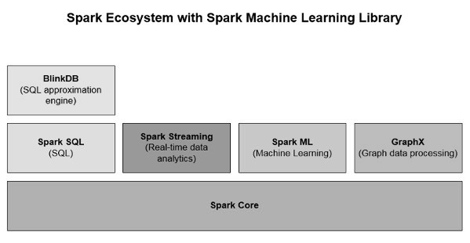

# 7.2 Spark 4.x 机器学习主线

Spark 机器学习 API 历史上分为两层：

- `spark.ml`：构建在 DataFrame/Dataset 之上的主线 API，适合特征工程、模型训练、评估、调参与 Pipeline 组合。
- `spark.mllib`：构建在 RDD 之上的早期 API，目前处于维护模式，主要用于兼容历史代码和少数旧示例。

对 Spark 4.x 读者来说，本章应按下面方式理解：

（1）训练数据优先组织成 DataFrame，通常以 `label`、`features` 等列为核心。

（2）特征工程、模型、评估器和调参器优先使用 `org.apache.spark.ml`。

（3）训练、验证、推理尽量放到同一条 Pipeline 中，减少训练时和上线时预处理不一致的问题。

（4）遇到 `spark.mllib` 示例时，把它看作“历史写法/迁移资料”，重点理解算法思想与 API 差异。

图例 7‑1 Spark 的生态系统

为什么主线转向基于 DataFrame 的 API？因为它同时带来更统一的数据源接口、SQL 与 Catalyst/Tungsten 优化、跨语言一致性，以及更自然的 Pipeline 组织方式。对真实项目来说，这比单独调用某个算法 API 更重要。

需要注意的是，`spark.mllib` 并不是完全不可用，而是已经不再作为新项目首选。它仍然能帮助你理解旧代码、线性代数类型、分布式矩阵以及部分经典案例；但如果目标是构建新的业务模型，优先级应当明显低于 `spark.ml`。

