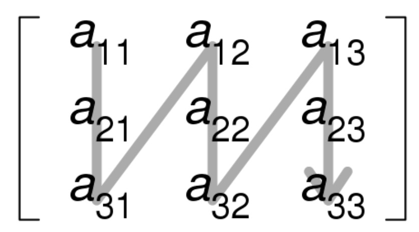

# 7.3 数据类型

&emsp;&emsp;本节介绍本章后续会反复用到的数据表示方式。对于 Spark 4.x 新项目，最常见的入口是 DataFrame 中的 `features` 向量列和 `label` 列，以及 `org.apache.spark.ml.linalg` 下的向量/矩阵类型。分布式矩阵与部分 `spark.mllib` 类型仍有学习价值，但更多属于底层能力或历史 API 视角，而不是多数业务建模任务的起点。

### 7.3.1 局部向量

&emsp;&emsp;局部向量将具有整数型、基于0的索引和双精度类型的值，存储在一台机器上。MLlib支持两种类型的局部向量：稠密和稀疏。稠密向量由表示其输入值的双精度数组支持，而稀疏向量由两个并行数组支持：索引和值。例如一个向量（1.0,0.0,3.0）可以用稠密格式表示为\[1.0,0.0,3.0\]，或者以(3,\[0,2\],\[1.0,3.0\])的稀疏格式表示，其中第一个值3为向量的大小，第二个值表示向量的索引，第三个值表示向量的值。局部向量的基类是Vector，提供了两个实现：DenseVector和SparseVector。建议使用Vectors中实现的工厂方法来创建局部向量。Scala默认导入scala.collection.immutable.Vector，所以必须明确地导入org.apache.spark.ml.linalg.Vector。

```scala
scala> import org.apache.spark.ml.linalg.{Vectors, Vector}
import org.apache.spark.ml.linalg.{Vectors, Vector}
```


  - 创建稠密向量(1.0, 0.0, 3.0)

```scala
scala> val dv: Vector = Vectors.dense(1.0, 0.0, 3.0)
dv: org.apache.spark.ml.linalg.Vector = [1.0,0.0,3.0]
```


  - 通过指定非零条目的索引和值，创建一个稀疏向量（1.0，0.0，3.0）。

```scala
scala> val sv1: Vector = Vectors.sparse(3, Array(0, 2), Array(1.0,
3.0))
sv1: org.apache.spark.ml.linalg.Vector = (3,[0,2],[1.0,3.0])
```


  - 通过指定非零条目来创建一个稀疏向量（1.0，0.0，3.0）。

```scala
scala> val sv2: Vector = Vectors.sparse(3, Seq((0, 1.0), (2, 3.0)))
sv2: org.apache.spark.ml.linalg.Vector = (3,[0,2],[1.0,3.0])
```


&emsp;&emsp;、、分别创建相同的局部向量。

### 7.3.2 标签向量

&emsp;&emsp;标签向量是一个稠密或稀疏的局部向量，而且关联了标签。在MLlib中，标签向量用于有监督学习算法。使用双精度来存储标签，所以可以在回归和分类中使用标签向量。对于二元分类，标签应该是0（负）或1（正）。对于多类分类，标签应该是从零开始的类索引：0,1,2
&emsp;&emsp;...。标签向量由案例类LabeledPoint表示。

```scala
scala> import org.apache.spark.ml.linalg.Vectors
import org.apache.spark.ml.linalg.Vectors
scala> import org.apache.spark.ml.feature.LabeledPoint
import org.apache.spark.ml.feature.LabeledPoint
```


  - 使用正标签和稠密特征向量创建标签向量

```scala
scala> val pos = LabeledPoint(1.0, Vectors.dense(1.0, 0.0, 3.0))
pos: org.apache.spark.ml.feature.LabeledPoint = (1.0,[1.0,0.0,3.0])
```


  - 使用负标签和稀疏特征向量创建标签向量

```scala
scala> val neg = LabeledPoint(0.0, Vectors.sparse(3, Array(0, 2),
Array(1.0, 3.0)))
neg: org.apache.spark.ml.feature.LabeledPoint =
(0.0,(3,[0,2],[1.0,3.0]))
```


&emsp;&emsp;在实践中，使用稀疏的训练数据是很常见的。Spark
&emsp;&emsp;ML支持以LIBSVM格式存储的阅读训练样本，这是LIBSVM和LIBLINEAR使用的默认格式。这是一种文本格式，其中每行代表使用以下格式标记的稀疏特征向量：
```text
label index1:value1 index2:value2 ...
```


&emsp;&emsp;索引从一开始并按升序排列。
&emsp;&emsp;加载后，特征索引将转换为基于零的索引。libsvm包用于将LIBSVM数据加载为DataFrame的数据源API。加载的DataFrame有两列：包含作为双精度存储的标签和包含作为向量存储的特征。要使用LIBSVM格式数据源，需要在DataFrameReader中将格式设置为“libsvm”，并可以指定option，例如：
```scala
val df = spark.read.format("libsvm").option("numFeatures", "780")
  .load("data/mllib/sample_libsvm_data.txt")
```


&emsp;&emsp;libsvm数据源支持以下选项：

  - numFeatures

&emsp;&emsp;指定特征的数量，如果未指定或不是正数，特征的数量将自动确定，但需要额外计算的代价。当数据集已经被分割成多个文件并且你想单独加载时这也是有用的，因为某些特征可能不存在于某些文件中，这导致特征数量可能不一致，需要特别指定。

  - vectorType

&emsp;&emsp;特征向量类型，稀疏（默认）或稠密。

  - LIBSVM

&emsp;&emsp;LIBSVM是台湾大学林智仁(Lin
&emsp;&emsp;Chih-Jen)教授等开发设计的一个简单、易于使用和快速有效的SVM模式识别与回归的软件包，他不但提供了编译好的可在Windows系列系统的执行文件，还提供了源代码，方便改进、修改以及在其它操作系统上应用；该软件对SVM所涉及的参数调节相对比较少，提供了很多的默认参数，利用这些默认参数可以解决很多问题；并提供了交互检验(Cross
&emsp;&emsp;Validation)的功能。该软件可以解决C-SVM、ν-SVM、ε-SVR和ν-SVR等问题，包括基于一对一算法的多类模式识别问题。Libsvm
&emsp;&emsp;和 Liblinear 都是国立台湾大学的 Chih-Jen Lin 博士开发的，Libsvm主要是用来进行非线性svm
&emsp;&emsp;分类器的生成，而Liblinear则是应对large-scale的data
&emsp;&emsp;classification，因为linear分类器的训练比非线性分类器的训练计算复杂度要低很多，时间也少很多，而且在large
&emsp;&emsp;scale data上的性能和非线性的分类器性能相当，所以Liblinear是针对大数据而生的。

&emsp;&emsp;两者都是一个跨平台的通用工具库，支持windows/linux/mac
&emsp;&emsp;os,代码本身是c++写的，同时也有matlab，python，java，c/c++扩展接口，方便不同语言环境使用，可以说是科研和企业人员的首选！像我这样在学校的一般用matlab/c++，而我同学在百度则主要用的是python/c++，所以只是各自侧重不一样，但所使用的核心还是其svm库。

### 7.3.3 局部矩阵

&emsp;&emsp;局部矩阵具有整数类型的行和列索引以及双重类型的值，它们存储在单个计算机上。MLlib支持密集矩阵（其条目值以列优先顺序图例 7‑2存储在单个双精度数组中）和稀疏矩阵（其非零条目值以列优先顺序和压缩稀疏列格式存储）。

<p align="center"></p>
<p align="center">图例 7‑2 按列排序从左到右，从上到下</p>


&emsp;&emsp;例如下面的稠密矩阵：

&emsp;&emsp;$$\begin{pmatrix}
&emsp;&emsp;1.0 & 2.0 \\
&emsp;&emsp;3.0 & 4.0 \\
&emsp;&emsp;5.0 & 6.0 \\
&emsp;&emsp;\end{pmatrix}$$


&emsp;&emsp;以矩阵大小（3,2）存储在一维数组\[1.0,3.0,5.0,2.0,4.0,6.0\]中。局部矩阵的基类是Matrix，提供了两个实现：DenseMatrix和SparseMatrix。建议使用在矩阵中实现的工厂方法来创建局部矩阵。请记住，MLlib中的局部矩阵以列优先顺序存储。

```scala
scala> import org.apache.spark.ml.linalg.{Matrix, Matrices}
import org.apache.spark.ml.linalg.{Matrix, Matrices}
```


  - 创建稠密矩阵((1.0, 2.0), (3.0, 4.0), (5.0, 6.0))

```scala
scala> val dm: Matrix = Matrices.dense(3, 2, Array(1.0, 3.0, 5.0, 2.0,
4.0, 6.0))
dm: org.apache.spark.ml.linalg.Matrix =
1.0 2.0
3.0 4.0
5.0 6.0
```


  - 创建稀疏矩阵 ((9.0, 0.0), (0.0, 8.0), (0.0, 6.0))

```scala
scala> val sm: Matrix = Matrices.sparse(3, 2, Array(0, 1, 3), Array(0,
2, 1), Array(9, 6, 8))
sm: org.apache.spark.ml.linalg.Matrix =
3 x 2 CSCMatrix
(0,0) 9.0
(2,1) 6.0
(1,1) 8.0
scala> sm.toDense
res4: org.apache.spark.ml.linalg.DenseMatrix =
9.0 0.0
0.0 8.0
0.0 6.0
```


  - def sparse(numRows: Int, numCols: Int, colPtrs: Array\[Int\],
&emsp;&emsp;    rowIndices: Array\[Int\], values: Array\[Double\]): Matrix

&emsp;&emsp;使用列优先顺序格式，创建一个稀疏矩阵。

  - > numRows：行数

  - > numCols：列数

  - > colPtrs：对应与新列开始的索引

  - > rowIndices：行索引

  - > values：按列分布的非零值

&emsp;&emsp;通过对上面的例子详细描述，学习怎样创建稀疏矩阵。例子中，sparse方法的参数分别为numRows=3、numCols=2、colPtrs=
&emsp;&emsp;Array(0, 1, 3)、rowIndices= Array(0, 2, 1)、values=Array(9, 6,
&emsp;&emsp;8)，numRows和numCols代表此矩阵为3行2列；values代表矩阵中的非零数值为9、6、8，其顺序是按列分布排序的；rowIndices数组的长度与数值的个数相同，数组中的每个值代表对应数值的行索引；colPtrs数组的长度等于numCols+1，一般第一个元素为0，代表从第一个值9开始，第二个元素为1-0=1，代表第一列只包含一个值9，第三个元素为3-1=2，代表第二列包括两个值6和8。

### 7.3.4 分布式矩阵（历史/底层能力）

&emsp;&emsp;本节介绍的分布式矩阵类型主要位于 `spark.mllib.linalg.distributed`，更适合用来理解 Spark 早期在线性代数与分布式矩阵上的底层抽象。对 Spark 4.x 新项目来说，多数机器学习任务不会直接从这些类型起步，而是优先使用 DataFrame 中的 `features` 向量列、`spark.ml` 估算器以及 Pipeline；只有在需要底层矩阵运算、兼容旧代码或学习历史接口时，才会直接接触这些对象。

&emsp;&emsp;分布式矩阵具有长整型行和列索引以及双精度值，它们以分布式方式存储在一个或多个 RDD 中。选择正确的格式来存储大型分布式矩阵非常重要，因为不同格式之间的转换往往需要全局洗牌，成本较高。这里保留四种典型类型：`RowMatrix`、`IndexedRowMatrix`、`CoordinateMatrix` 和 `BlockMatrix`。阅读时建议重点理解“什么时候需要索引”“什么时候矩阵足够稀疏”“什么时候按块切分更合适”。

#### 7.3.4.1 RowMatrix（历史/兼容）

&emsp;&emsp;RowMatrix就是将每行对应一个RDD，将矩阵的每行分布式存储，矩阵的每行是一个局部向量。由于每一行均由局部向量表示，因此列数受整数范围限制，但实际上应小得多。

```scala
scala> import org.apache.spark.mllib.linalg.Vectors
import org.apache.spark.mllib.linalg.Vectors
scala> import org.apache.spark.mllib.linalg.distributed.RowMatrix
import org.apache.spark.mllib.linalg.distributed.RowMatrix
```


&emsp;&emsp;创建RDD\[Vector\]：

```scala
scala> val trainRDD = spark.sparkContext.parallelize(Seq(
| Vectors.dense(2.0, 3.0, 4.0),
| Vectors.dense(5.0, 5.0, 5.0),
| Vectors.dense(2.0, 3.0, 4.0)))
trainRDD:
org.apache.spark.rdd.RDD[org.apache.spark.mllib.linalg.Vector] =
ParallelCollectionRDD[0] at parallelize at <console>:25
```


&emsp;&emsp;从RDD\[Vector\]创建RowMatrix：

```scala
scala> val mat: RowMatrix = new RowMatrix(trainRDD)
mat: org.apache.spark.mllib.linalg.distributed.RowMatrix =
<org.apache.spark.mllib.linalg.distributed.RowMatrix@14e8304b>
```


&emsp;&emsp;得到RowMatrix的长度：

```scala
scala> val m = mat.numRows()
m: Long = 3
scala> val n = mat.numCols()
n: Long = 3
```


#### 7.3.4.2 IndexedRowMatrix（历史/兼容）

&emsp;&emsp;IndexedRowMatrix类似于RowMatrix，但行索引有意义。它由带索引行的RDD存储，因此每行都由长整型索引和局部向量表示。IndexedRowMatrix可以用RDD
&emsp;&emsp;\[IndexedRow\]实例创建，其中IndexedRow是一个基于(Long,Vector)的包装器。IndexedRowMatrix可以通过删除行索引来转换为RowMatrix。

```scala
scala> import org.apache.spark.mllib.linalg.distributed.{IndexedRow,
IndexedRowMatrix}
import org.apache.spark.mllib.linalg.distributed.{IndexedRow,
IndexedRowMatrix}
scala> val rows = spark.sparkContext.parallelize(Seq(
| IndexedRow(0, Vectors.dense(1, 3)),
| IndexedRow(1, Vectors.dense(4, 5))))
rows:
org.apache.spark.rdd.RDD[org.apache.spark.mllib.linalg.distributed.IndexedRow]
= ParallelCollectionRDD[9] at parallelize at <console>:28
```


&emsp;&emsp;用RDD\[IndexedRow\]创建IndexedRowMatrix：

```scala
scala> val mat02: IndexedRowMatrix = new IndexedRowMatrix(rows)
mat02: org.apache.spark.mllib.linalg.distributed.IndexedRowMatrix =
<org.apache.spark.mllib.linalg.distributed.IndexedRowMatrix@46b4cddb>
```


&emsp;&emsp;得到长度：

```scala
scala>val m02 = mat02.numRows()
m02: Long = 2
scala>val n02 = mat02.numCols()
n02: Long = 2
```


&emsp;&emsp;去掉行索引：

```scala
scala> val rowMat: RowMatrix = mat02.toRowMatrix()
rowMat: org.apache.spark.mllib.linalg.distributed.RowMatrix =
<org.apache.spark.mllib.linalg.distributed.RowMatrix@435e857c>
```


#### 7.3.4.3 CoordinateMatrix（历史/兼容）

&emsp;&emsp;CoordinateMatrix也是分布式矩阵，每个条目由RDD保存。每个条目是(i:Long,j：Long,value：Double)的一个元组，其中i是行索引，j是列索引，value是条目值。CoordinateMatrix只有在矩阵的两个维度都很大且矩阵非常稀疏时才能使用。CoordinateMatrix可以由RDD
&emsp;&emsp;\[MatrixEntry\]实例创建，其中MatrixEntry是基于(Long,Long,Double)的包装器。可以通过调用toIndexedRowMatrix将CoordinateMatrix转换为具有稀疏行的IndexedRowMatrix。目前还不支持CoordinateMatrix的其他计算。

```scala
scala> import org.apache.spark.mllib.linalg.distributed.{MatrixEntry,
CoordinateMatrix}
import org.apache.spark.mllib.linalg.distributed.{MatrixEntry,
CoordinateMatrix}
scala> val entries03 = spark.sparkContext.parallelize(Seq(
| MatrixEntry(0, 1, 1), MatrixEntry(0, 2, 2), MatrixEntry(0, 3, 3),
| MatrixEntry(0, 4, 4), MatrixEntry(2, 3, 5), MatrixEntry(2, 4, 6),
| MatrixEntry(3, 4, 7)))
entries03:
org.apache.spark.rdd.RDD[org.apache.spark.mllib.linalg.distributed.MatrixEntry]
= ParallelCollectionRDD[13] at parallelize at <console>:30
```


&emsp;&emsp;用RDD\[MatrixEntry\]创建CoordinateMatrix：

```scala
scala>val mat03: CoordinateMatrix = new CoordinateMatrix(entries03)
mat03: org.apache.spark.mllib.linalg.distributed.CoordinateMatrix =
<org.apache.spark.mllib.linalg.distributed.CoordinateMatrix@17c158ca>
```


&emsp;&emsp;得到长度：

```scala
scala> val m03 = mat03.numRows()
m03: Long = 4
scala>val n03 = mat03.numCols()
n03: Long = 5
```


&emsp;&emsp;转换成IndexRowMatrix，其中的行为稀疏向量：

```scala
scala> val indexedRowMatrix = mat03.toIndexedRowMatrix()
indexedRowMatrix:
org.apache.spark.mllib.linalg.distributed.IndexedRowMatrix =
<org.apache.spark.mllib.linalg.distributed.IndexedRowMatrix@c34e260>
```


#### 7.3.4.4 BlockMatrix（历史/兼容）

&emsp;&emsp;BlockMatrix是分布式矩阵，其中的MatrixBlock是由RDD方式保存。MatrixBlock是((Int，Int),Matrix)的元组，其中(Int,Int)是块的索引，Matrix是给定索引的子矩阵，其大小为rowsPerBlock\*colsPerBlock。BlockMatrix支持加和乘另一个BlockMatrix。BlockMatrix还有一个帮助函数validate，可以用来检查BlockMatrix是否正确设置。

&emsp;&emsp;BlockMatrix可以通过调用toBlockMatrix方便地从IndexedRowMatrix或CoordinateMatrix创建。toBlockMatrix默认创建大小为1024\*1024的块。用户可以通过toBlockMatrix(rowsPerBlock,colsPerBlock)方法提供值来改变块的大小。

```scala
scala> import org.apache.spark.mllib.linalg.distributed.{MatrixEntry,
CoordinateMatrix, BlockMatrix}
import org.apache.spark.mllib.linalg.distributed.{MatrixEntry,
CoordinateMatrix, BlockMatrix}
scala> val entries04 = spark.sparkContext.parallelize(Seq(
| MatrixEntry(0, 0, 1.2),
| MatrixEntry(1, 0, 2.1),
| MatrixEntry(6, 1, 3.7)))
entries04:
org.apache.spark.rdd.RDD[org.apache.spark.mllib.linalg.distributed.MatrixEntry]
= ParallelCollectionRDD[18] at parallelize at <console>:31
```


&emsp;&emsp;用RDD\[MatrixEntry\]创建CoordinateMatrix：

```scala
scala> val coordMat: CoordinateMatrix = new CoordinateMatrix(entries04)
coordMat: org.apache.spark.mllib.linalg.distributed.CoordinateMatrix =
<org.apache.spark.mllib.linalg.distributed.CoordinateMatrix@2142b70d>
```


&emsp;&emsp;将CoordinateMatrix转换为BlockMatrix：

```scala
scala> val matA: BlockMatrix = coordMat.toBlockMatrix().cache()
matA: org.apache.spark.mllib.linalg.distributed.BlockMatrix =
<org.apache.spark.mllib.linalg.distributed.BlockMatrix@42e58f8e>
```


&emsp;&emsp;验证BlockMatrix是否设置正确。当它是无效的，抛出一个异常。

```scala
scala> matA.validate()
```


&emsp;&emsp;计算A^T A：

```scala
scala> val ata = matA.transpose.multiply(matA)
ata: org.apache.spark.mllib.linalg.distributed.BlockMatrix =
<org.apache.spark.mllib.linalg.distributed.BlockMatrix@7e09407a>
```


