# 监视和优化

> **版本基线（更新于 2026-02-13）**
> 本书默认适配 Apache Spark 4.1.1（稳定版），并兼容 4.0.2 维护分支。
> 推荐环境：JDK 17+（建议 JDK 21）、Scala 2.13、Python 3.10+。
要获取关于Spark应用程序行为的信息，可以查看集群管理器日志和Spark
Web应用程序界面。这两种方法提供补充信息。日志使可以在应用程序的生命周期中查看细粒度事件。Web界面提供了Spark应用程序行为和细粒度指标的各个方面的广泛概述。要访问正在运行的Spark应用程序的Web界面，可以在Web浏览器中打开http://spark\_driver\_host:4040。如果多个应用程序在同一主机上运行，则Web应用程序将绑定到以4040开始的连续端口，如4041、4402等，Web应用程序仅在应用程序期间可用。

由于大多数Spark基于内存的计算性质，Spark程序需要考虑如何有效的利用群集中的任何资源，包括CPU、带宽或内存。大多数情况下，如果数据适合内存的大小，瓶颈就有可能为网络带宽，但有时还需要进行一些其他方面的调整，例如以序列化形式存储RDD以减少内存使用，数据的序列化对于良好的网络性能至关重要，并且还可以降低内存使用和网络带宽。

## 工作原理

在深入了解Apache Spark的工作原理之前，先了解一下Apache Spark的术语。

（1）作业（Job）：在单个机器上运行的执行单元，例如从HDFS或本地读取输入；对数据执行一些计算并输出数据。

（2）阶段（Stage）：作业分为几个阶段。阶段可以被分类为Map或Reduce阶段。阶段根据计算操作边界划分，所有操作不能在单个阶段更新，而是发生在多个阶段。

（3）任务（Task）：每个阶段都有一些任务，每个分区有一个任务。一个任务在一个执行器上的一个数据分区上执行。

（4）有向无环图（DAG）：DAG代表有向无环图，是指按照一定顺序进行操作和创建RDD的逻辑图。Spark中的DAG是一组顶点和边，其中顶点代表RDD和边缘代表施加在上的RDD操作，每条边都是只有一个方向，而且不会形成循环。

（5）执行器（Executor）：负责执行任务的进程。

（6）驱动程序（Driver Program）：负责通过Spark引擎运行作业的程序/进程

（7）主节点（Master Node）：运行Driver程序的机器

（8）从节点（Slave Node）：运行Executor程序的机器

### 依赖关系

Spark中的所有作业都由一系列操作组成，例如map、filter、reduce等，并运行在一组数据上，工作中的所有操作都被用来构造DAG。在可能的情况下，DAG通过重新排列和组合运算符进行了优化，例如提交一个Spark作业，其中包含一个map转换，然后是一个filter转换。Spark
DAG优化器会重新排列这些运算符的顺序，因为filter将减少进行map操作的记录数量。

基本上，RDD的评估本质上是延迟的，这意味着在RDD上执行一系列转换，并没有立即对其进行评估。虽然从现有的RDD创建新的RDD，但新的RDD还带有指向父RDD的指针。就这样所有的RDD之间的依赖关系被记录在DAG中，而不是产生实际数据，所以DAG记录了依赖关系，也称为谱系图（Lineage
Graph）。从一个例子开始，使用Cartesian或zip来理解RDD谱系图，当然也可以使用其他操作在Spark中构建RDD图。

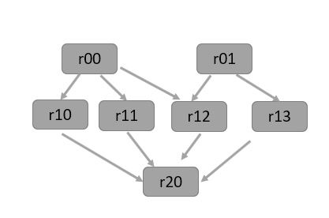

图例 4‑1 RDD谱系图或DAG

上图描绘了一个RDD图，是以下一系列转换的结果：

scala\> val r00 = sc.parallelize(0 to 9)

r00: org.apache.spark.rdd.RDD\[Int\] = ParallelCollectionRDD\[0\] at
parallelize at \<console\>:24

scala\> val r01 = sc.parallelize(0 to 90 by 10)

r01: org.apache.spark.rdd.RDD\[Int\] = ParallelCollectionRDD\[1\] at
parallelize at \<console\>:24

scala\> val r10 = r00 cartesian r01

r10: org.apache.spark.rdd.RDD\[(Int, Int)\] = CartesianRDD\[2\] at
cartesian at \<console\>:28

scala\> val r11 = r00.map(n =\> (n, n))

r11: org.apache.spark.rdd.RDD\[(Int, Int)\] = MapPartitionsRDD\[3\] at
map at \<console\>:26

scala\> val r12 = r00 zip r01

r12: org.apache.spark.rdd.RDD\[(Int, Int)\] = ZippedPartitionsRDD2\[4\]
at zip at \<console\>:28

scala\> val r13 = r01.keyBy(\_ / 20)

r13: org.apache.spark.rdd.RDD\[(Int, Int)\] = MapPartitionsRDD\[5\] at
keyBy at \<console\>:26

scala\> val r20 = Seq(r11, r12, r13).foldLeft(r10)(\_ union \_)

r20: org.apache.spark.rdd.RDD\[(Int, Int)\] = UnionRDD\[8\] at union at
\<console\>:36

scala\> r20.toDebugString

res1: String =

(10) UnionRDD\[8\] at union at \<console\>:36 \[\]

| UnionRDD\[7\] at union at \<console\>:36 \[\]

| UnionRDD\[6\] at union at \<console\>:36 \[\]

| CartesianRDD\[2\] at cartesian at \<console\>:28 \[\]

| ParallelCollectionRDD\[0\] at parallelize at \<console\>:24 \[\]

| ParallelCollectionRDD\[1\] at parallelize at \<console\>:24 \[\]

| MapPartitionsRDD\[3\] at map at \<console\>:26 \[\]

| ParallelCollectionRDD\[0\] at parallelize at \<console\>:24 \[\]

| ZippedPartitionsRDD2\[4\] at zip at \<console\>:28 \[\]

| ParallelCollectionRDD\[0\] at parallelize at \<console\>:24 \[\]

| ParallelCollectionRDD\[1\] at parallelize at \<console\>:24 \[\]

| MapPartitionsRDD\[5\] at keyBy at \<console\>:26 \[\]

| ParallelCollectionRDD\[1\] at parallelize at \<console\>:24 \[\]

代码 4.1

在一个动作被调用之后，RDD的谱系图记录了需要执行什么转换，换句话说无论何时在现有RDD基础上创建新的RDD，使用谱系图管理这些依赖关系。基本上起到记录元数据作用，描述了与父RDD有什么类型的关系，每个RDD维护一个或多个父RDD指针。

Spark是分布式数据处理的通用框架，提供用于大规模数据操作的方法API、内存数据缓存和计算重用，对分区数据应用一系列粗粒度转换，并依赖数据集的谱系来重新计算失败时的任务。Spark围绕RDD和DAG的概念构建，DAG表示了转换和它们之间的依赖关系。

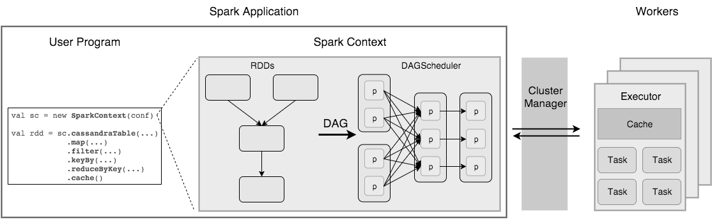

图例 4‑2Spark应用程序的执行过程

在高级别上，Spark应用程序（通常称为驱动程序或应用程序主控）由SparkContext和用户代码组成，用户代码与SparkContext交互创建RDD，并执行一系列转换以实现最终结果。RDD的这些转换过程会被Spark解释成DAG，并提交给调度器以在工作节点集群上执行。

RDD可以被认为是具有故障恢复可能性的不可变并行数据结构，提供了用于各种数据转换和实现的API，以及用于控制元素的缓存和分区以优化数据放置的API。RDD可以从外部存储或从另一个RDD创建，并存储有关其父项的信息以优化执行，并在出现故障时重新计算分区。从开发人员的角度来看，RDD代表分布式不可变数据和延迟评估操作，RDD接口定义了五个主要属性：

  - def getPartitions: Array\[Partition\]

列出分区

  - def getDependencies: Seq\[Dependency\[\_\]\]

其他RDD的依赖列表

  - def compute(split: Partition, context: TaskContext): Iterator\[T\]

计算每个分割的方法

  - def getPreferredLocations(split: Partition): Seq\[String\] = Nil

用于计算每个分割的首选位置列表

  - val partitioner: Option\[Partitioner\] = None

键值对RDD的分区器

对与这五种方法，通过代码 4.3将HDFS数据加载到RDD中进行说明：

sparkContext.textFile("hdfs://...").map(…)

代码 4.3

首先在内存中加载HDFS块，然后应用map()过滤出键，创建两个RDD的键：

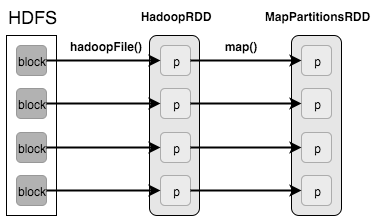

图例 4‑3在内存中加载HDFS块

两个RDD的属性分别为：

  - HadoopRDD

<!-- end list -->

  - > getPartitions = HDFS块

  - > getDependencies = 无

  - > compute = 加载内存中的块

  - > getPrefferedLocations = HDFS块位置

  - > partitioner = 无

<!-- end list -->

  - MapPartitionsRDD

<!-- end list -->

  - > getPartitions = 与父类相同

  - > getDependencies = 父RDD

  - > compute = 计算父级并应用map()

  - > getPreferredLocations = 与父项相同

  - > partitioner = 无

### 划分阶段

在深入研究细节之前，对执行工作流进行快速回顾：包含RDD转换的用户代码构成DAG，然后由DAG调度器将其分成若干阶段，如果对RDD操作不需要数据进行Shuffle或重新分区，则这些操作会组合成一个阶段，阶段由基于输入数据分区的任务组成。DAG调度器以优化和管理RDD操作，例如许多map操作可以安排在单一阶段，此优化是提升Spark性能的关键。DAG调度程序的最终结果是生成一系列阶段，这些阶段然后被传递给任务调度器，任务调度器通过集群管理器启动任务，而不需要知道阶段之间的依赖关系。集群从节点上的Executor或Worker执行任务，每个作业都启动一个新的Java虚拟机，Worker只获得传递给它的代码，任务在Worker上运行，然后结果返回到客户端。

图例 4‑4阶段划分

基本上，任何数据处理工作流都可以定义为读取数据源，然后应用一系列转换，最后以不同方式实现结果，转换创建RDD之间的依赖关系，通常被分类为“窄”和“宽”：

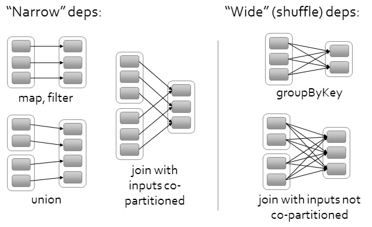

图例 4‑5两种转换关系

  - 窄依赖

<!-- end list -->

  - > 父RDD的每个分区被子RDD的最多一个分区使用

  - > 允许在一个群集节点上进行流水线的执行

  - > 故障恢复更有效，因为只有丢失的父分区需要重新计算

<!-- end list -->

  - 宽依赖

<!-- end list -->

  - > 父RDD的每个分区被子RDD的多个分区使用

  - > 要求所有父分区的数据可用，并在节点间进行洗牌

  - > 如果某个分区丢失了所有的祖先，则需要完整的重新计算

对于窄依赖，父RDD的每个分区由子RDD的最多一个分区使用，这意味着任务可以在本地执行，不必进行洗牌，例如map、flatMap、filter和sample等操作；对于宽依赖，多个子分区可能取决于父RDD的一个分区，这意味着必须对数据进行跨分区的洗牌，除非父RDD进行了散列分区，例如sortByKey、reduceByKey、groupByKey、cogroupByKey、join和cartesian等。由于采用了延迟评估技术，调度器将能够在提交作业之前优化阶段，窄依赖的操作被放到一个阶段，根据分区挑选连接算法，尽量减少洗牌，重用以前缓存的数据。将DAG分成几个阶段，通过打破洗牌边界处DAG创建的阶段。

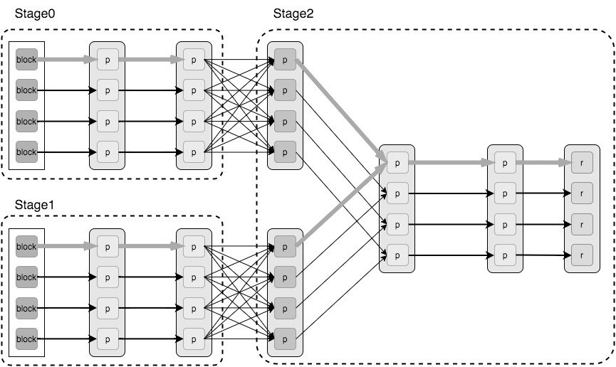

图例 4‑6通过打破Shuffle边界处的DAG创建Stage

### 实例分析

下面通过字数计数示例了解Spark应用程序的工作原理，可以在Spark交互界面中输入下面所示的代码。示例代码产生了wordcount，其定义了当调用动作时将使用的RDD有向无环图。在RDD上的操作创建新的RDD，它返回到其父母从而创建一个有向无环图，可以使用toDebugString打印出这个RDD谱系，如下所示。

scala\> val file= sc.textFile("/usr/local/spark/README.md").cache()

file: org.apache.spark.rdd.RDD\[String\] = /root/data/11-0.txt
MapPartitionsRDD\[1\] at textFile at \<console\>:24

scala\> val wordcount = file.flatMap(line =\> line.split(" ")).map(word
=\> (word, 1)).reduceByKey(\_ + \_)

wordcount: org.apache.spark.rdd.RDD\[(String, Int)\] = ShuffledRDD\[4\]
at reduceByKey at \<console\>:26

scala\> wordcount.toDebugString

res3: String =

(2) ShuffledRDD\[4\] at reduceByKey at \<console\>:26 \[\]

\+-(2) MapPartitionsRDD\[3\] at map at \<console\>:26 \[\]

| MapPartitionsRDD\[2\] at flatMap at \<console\>:26 \[\]

| /usr/local/spark/README.md MapPartitionsRDD\[1\] at textFile at
\<console\>:24 \[\]

| CachedPartitions: 2; MemorySize: 11.3 KB; ExternalBlockStoreSize: 0.0
B; DiskSize: 0.0 B

| /usr/local/spark/README.md HadoopRDD\[0\] at textFile at
\<console\>:24 \[\]

scala\> wordcount.collect()

res1: Array\[(String, Int)\] = Array((package,1), (this,1),
(Version"\](http://spark.apache.org/docs/latest/building-spark.html\#specifying-the-hadoop-version),1),
(Because,1), (Python,2),
(page\](http://spark.apache.org/documentation.html).,1), (cluster.,1),
(its,1), (\[run,1), (general,3), (have,1), (pre-built,1), (YARN,,1),
(locally,2), (changed,1), (locally.,1), (sc.parallelize(1,1), (only,1),
(several,1), (This,2), (basic,1), (Configuration,1), (learning,,1),
(documentation,3), (first,1), (graph,1), (Hive,2), (info,1),
(\["Specifying,1), ("yarn",1), (\[params\]\`.,1), (\[project,1),
(prefer,1), (SparkPi,2), (\<http://spark.apache.org/\>,1), (engine,1),
(version,1), (file,1), (documentation,,1), (MASTER,1), (example,3),
(\["Parallel,1), (are,1), (params,1), (scala\>,1), (DataFrames,,1),
(provides,...

代码 4.4

第一个RDD为file是HadoopRDD类型，是通过调用sc.textFile()创建的，该系列中的最后一个RDD为wordcount是由reduceByKey()创建的ShuffledRDD类型。如图例
4‑7所示，左边的部分是用于wordcount的DAG；RDD中的内部被小方块分割表示分区，当调用动作collect时，Spark的调度程序会为作业创建一个图右的物理执行计划（Physical
Execution Plan），以执行该操作。

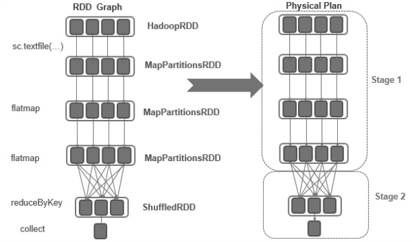

图例 4‑7创建一个物理执行计划

调度器根据转换将DAG分解成阶段，由于窄依赖没有数据洗牌的转换，所以将被分组到一个单一的阶段，这个物理计划有两个阶段，除了生成的ShuffledRDD为第二个Stage
2，其他都在Stage 1。

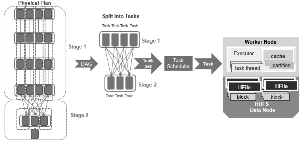

图例 4‑8通过集群管理器启动任务

每个阶段是由任务组成，其基于RDD的分区，它将并行执行相同的计算，调度程序将任务集提交给任务调度程序，通过集群管理器启动任务，下图显示了示例Hadoop集群中的Spark应用程序：

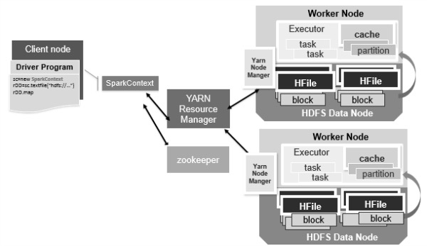

图例 4‑9Hadoop集群中的Spark应用程序

然后，可以使用Spark
Web界面来查看Spark应用程序的行为和性能，网址为<http://localhost:4040>，这是运行单词计数作业后的Web
UI的屏幕截图（图例
4‑10）。在Jobs选项卡下，将看到已安排或运行的作业列表，在此示例中是计数的collect作业，Jobs页面显示作业、阶段和任务进度。

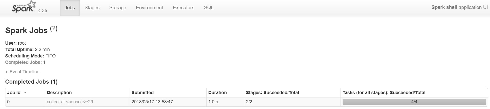

图例 4‑10 Jobs页面显示作业、阶段和任务进度

可以点击进入到Job 0的详细信息界面，可以看到DAG的行为，可以对照一下上面的分析结果：

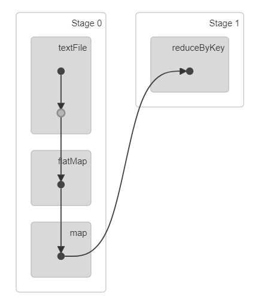

图例 4‑11 Job 0的详细信息界面

在Stages选项卡下，可以看到阶段的详细信息，以下是单词计数作业的阶段页面，Stage0以阶段管道中的最后一个RDD转换命名，并且Stage
1以动作collect命名。

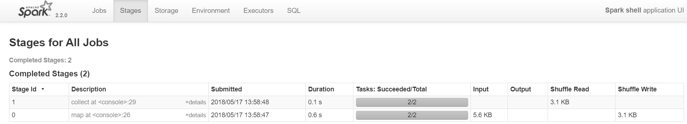

图例 4‑12阶段的详细信息

可以在Storage选项卡中查看缓存的RDD。

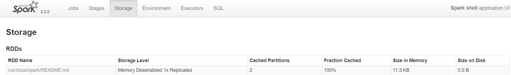

图例 4‑13查看缓存的RDD

在Executors选项卡下，可以看到每个执行器的处理和存储。可以通过单击Thread Dump链接来查看线程调用堆栈。

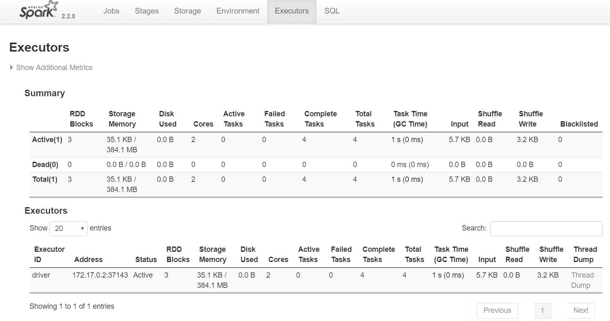

图例 4‑14Executors选项卡

## 洗牌机制

在MapReduce框架中，洗牌是连接Map和Reduce之间的桥梁，Map的输出要用到Reduce中必须经过洗牌这个环节，洗牌的性能高低直接影响了整个程序的性能和吞吐量。Spark作为MapReduce框架的一种实现，自然也实现了洗牌逻辑。洗牌是MapReduce框架中的一个特定的阶段，介于Map阶段和Reduce阶段之间，当Map的输出结果要被Reduce使用时，输出结果需要按键哈希，并且分发到每一个Reducer上去，这个过程就是洗牌。由于洗牌涉及到了磁盘的读写和网络的传输，因此洗牌性能的高低直接影响到了整个程序的运行效率。下面这幅图清晰地描述了MapReduce算法的整个流程，其中洗牌阶段是介于Map阶段和Reduce阶段之间。

图例 4‑15 洗牌阶段是介于Map阶段和Reduce阶段之间

在分布式系统中，洗牌不可以避免。这是因为分布式系统基本点就是把一个很大的的任务或作业分成一百份或者是一千份，这一百份和一千份文件在不同的机器上独自完成各自不同的部份，然后针对整个作业获得最终结果，所以在后面会对各个部分的计算结果进行汇聚，这个汇聚过程的前一阶段到后一阶段以至网络传输的过程就是洗牌。在Spark中为了完成洗牌的过程会把真正的一个作业划分为不同的阶段，这个阶段的划分是跟据依赖关系去决定的，洗牌是整个Spark中最消耗性能的一个地方。

还有一个非常影响性能的地方就是数据倾斜，就是指数据分布不均衡。在谈到洗牌机制中，不断强调不同机器从Mapper端抓取数据并计算结果，但有没有意识到数据可能会分布不均衡，什么时候会导致数据倾斜，答案就是洗牌会导致数据分布不均衡，也就是数据倾斜的问题。数据倾斜的问题会引申很多其他问题，比如网络带宽、硬件故障、内存过度消耗、文件掉失。同时，洗牌的过程中会产生大量的磁盘IO、网络IO、以及压缩、解压缩、序列化和反序列化等等，所以在讨论Spark优化之前，需要搞清楚洗牌的机制是是什么，这也是Spark设计中最有趣的话题之一。

图例 4‑16Shuffle操作

想象一下，有一张电话详细记录列表，想要计算每天发生的通话量。这样可以将日期设置为键，对于每个记录（即每个呼叫）将增加1作为值，之后汇集每个键的值，这将是问题的答案，即每一天的记录总量。但是，当将数据存储在群集中时，如何汇集存储在不同机器上的相同键的值？唯一的方法是使相同键的所有值在同一台机器上，之后可以汇集出来。

有许多不同的任务需要整个集群中的数据进行洗牌，例如join操作，要在字段“id”上连接两个表，必须确保所有的数据存储在相同块中。想象一下，整数键的范围从1到1000000。通过将数据存储在相同的块中，例如将两个表中的键为1到100之间的值都存储在单个分区或块中，而不是对第一个表的每个分区都遍历整个第二个表。这样可以直接将一个表的分区加入到另一个分区，因为知道1到100键的对应值只存储在这两个分区中，为了实现这两个表应该具有相同数量的分区，这样的连接将需要更少的计算，所以现在可以了解洗牌的重要性。

讨论这个话题，将遵循MapReduce命名约定。在洗牌操作中，源执行器中发出数据的任务是“Mapper”，将数据消耗到目标执行器中的任务是Reducer，它之间发生的就是洗牌洗牌通常有两个重要的压缩参数：

  - spark.shuffle.compress：引擎是否会压缩Shuffle输出

  - spark.shuffle.spill.compress：是否压缩中间Shuffle溢出文件

两者都默认值为“true”，并且两者都将使用spark.io.compression.codec编解码器来压缩数据，这是默认的。可能知道，Spark中有许多可用的洗牌实现，在特定情况下使用哪个实现由spark.shuffle.manager参数的值决定，三个可能的选项是：Hash、Sort、Tungsten-sort。从Spark
1.2.0开始，Sort选项是默认值。

## 内存管理

本节将介绍Spark中的内存管理，然后讨论用户可以采取的具体策略，以便在应用程序中更有效地使用内存。具体来说，将介绍如何确定对象的内存使用情况，以及如何改进数据结构，或通过以串行格式存储数据。然后将介绍调整Spark的缓存大小和Java垃圾回收器。

Spark中的内存使用大部分属于两类：执行内存和存储内存。执行内存是指用于以洗牌、连接、排序和聚合计算的存储器，而存储内存是指用于在集群中缓存和传播内部数据的存储器。在Spark中，执行和存储共享一个统一的区域（M）。当不使用执行内存时，存储内存可以获取所有可用的存储器，反之亦然。如果需要，执行内存可以驱逐存储内存，但只有在总的可用存储内存低于某个阈值（R）情况下。换句话说，R描述了M内的子区域，其中被缓存的块永远不会被驱逐，由于执行的复杂性，存储内存不得驱逐执行内存，该设计确保了几个理想的性能。首先不使用缓存的应用程序可以将整个空间用于执行内存，从而避免不必要的磁盘溢出。第二使用缓存的应用程序可以保留的最小存储空间（R），使数据块免于被驱逐。最后，这种方法为各种工作负载提供了合理的开箱即用性能，而不需要用户具有专业知识理解Spark内部如何分配内存的。虽然有两种相关配置，但典型的用户不需要调整它，因为默认值适用于大多数工作负载：

（1）spark.memory.fraction

表示M的大小，默认为0.6，剩余的空间（40％）保留用于用户数据结构，Spark中的内部元数据，并且在稀疏和异常大的记录情况下保护OOM（Out
Of Memory）错误。

（2）spark.memory.storageFraction

表示R的大小作为M，默认为0.5。R是M内的存储空间，其中缓存的块免于被执行驱逐。

从Apache Spark
1.6.0版本开始，内存管理模式发生了变化。旧的内存管理模型由StaticMemoryManager类实现，现在称为“Legacy”。默认情况下，“Legacy”模式被禁用，这意味着在Spark
1.5.x和1.6.0上运行相同的代码会导致不同的行为。为了兼容性，可以使用spark.memory.useLegacyMode参数启用“Legecy”模型，默认情况下将关闭该模型。本节介绍在Apache
Spark起始版本1.6.0中使用的新内存管理模型，它被实现为UnifiedMemoryManager，新的内存管理模式如下所示：

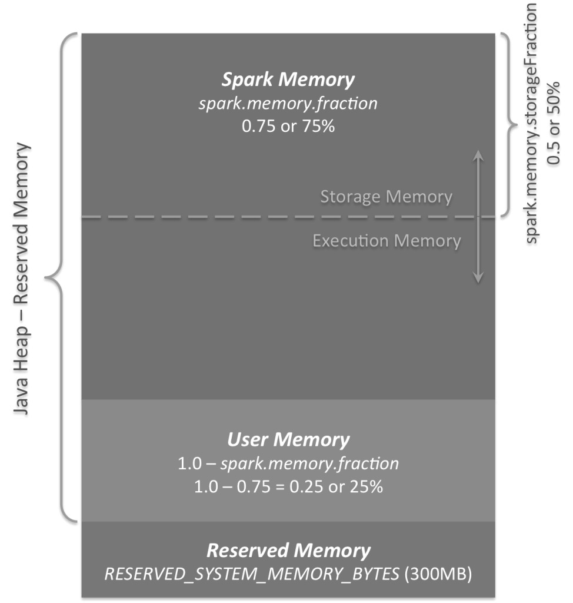

图例 4‑17 3个主要的内存区域

可以在图表上看到3个主要的内存区域：

  - 保留内存

这是系统保留的内存，其大小是被硬编码在Spark发布程序中，不可以调整的。从Spark
1.6.0起，它的值为300MB，这意味300MB的内存不参与Spark内存区域大小的计算，如果Spark没有重新编译或设置spark.testing.reservedMemory参数，保留内存的大小不能以任何方式改变。请注意，这个内存只被称为“Reserved”，实际上它并没有被Spark使用，但它设置了可以为Spark分配使用的限制。无法使用所有Spark的Java堆来缓存数据，因为这个保留部分将保持备用（实际上，它会存储大量的Spark内部对象）。如果不给Spark执行器至少1.5
\* 300MB= 450MB堆内存，将显示“please use larger heap size”错误消息。

  - 用户内存

这是在Spark
Memory分配后保留的内存池，完全由用户决定以任何方式使用，可以将数据结构存储在这里用于RDD转换，例如可以重写Spark聚合，通过使用mapPartitions转换维护散列表来以便此聚合运行，这将消耗所谓的用户内存。在Spark
1.6.0中，此内存池的大小可以计算为：

(Java Heap – Reserved Memory) \* （1.0 - spark.memory.fraction）

公式 4‑1

默认值等于：

（Java Heap - 300MB）\* 0.25

公式 4‑2

例如，使用4GB
Java堆，将拥有949MB的用户内存。另外，这是用户内存，完全用户决定将存储在这个内存中的数据，以及如何存储，Spark完全不会考虑在用户内存中做什么，是否遵守这个边界。如果在用户代码中不遵守此边界可能会导致OOM错误。

  - Spark内存

最后，这是由Spark管理的内存池。它的大小可以计算为：

(Java Heap – Reserved Memory) \* （spark.memory.fraction）

公式 4‑3

使用Spark 1.6.0默认值为：

（Java Heap - 300MB）\* 0.75

公式 4‑4

例如，如果Java进程的堆为4GB，这个池的大小将是2847MB。整个池分为2个区域：存储内存和执行内存，它们之间的边界由spark.memory.storageFraction参数设置，默认为0.5。这种新的内存管理方案的优点是，这个边界不是静态的，而在内存压力的情况下，边界将被移动，即一个区域将通过借用另一个空间来增长。稍后会讨论关于移动这个边界，现在关注这两个内存如何被使用：

（1）存储内存

此池用于存储Spark缓存数据和为了临时空间序列化数据的展开，而且所有的广播变量都存储在此缓存块中，如果没有足够的内存来适应整个展开的分区，它将直接将其放置到驱动程序中，如果持久性级别允许这样做，所有广播变量都存储在具有MEMORY\_AND\_DISK持久性级别的缓存中。

（2）执行内存

此内存池用于存储执行Spark任务期间所需的对象，例如它用于Map阶段在内存中存储洗牌中间缓冲区，也用于存储散列集合的散列表。如果没有足够的内存可用，此池还支持在磁盘上溢出，但是此池的块不能被其他线程（任务）强制驱逐。

现在关注存储内存和执行内存之间的移动边界。由于执行内存的性质，不能强制地从此池中驱逐内存块，因为这是中间计算中使用的数据，并且如果未找到引用的块，则需要此块的进程将失败。但是存储内存不是这样，它只是存储在内存中的块缓存，可以通过更新块元数据从那里驱逐该块，实际上块被驱逐到硬盘上（或简单地删除），当访问此块时Spark尝试从硬盘中读取，或重新计算当持久性级别不允许溢出在硬盘上。所以，可以强制地从存储内存中取出块，但是不能从执行内存中执行相同操作。什么时候执行内存可以从存储内存中借用一些空间？
这发生在以下任一方面：

（1）存储内存池中有可用空间，即缓存块没有使用所有可用的内存。然后，它只会减少存储内存池大小，从而增加执行内存池。

（2）存储内存池大小超过了初始存储内存区域大小，并且具有所有这些空间。这种情况会导致来自存储内存池的强制驱逐，除非它达到其初始大小。

反过来，只有在执行内存池中有可用空间可用时，存储内存池才能从执行内存池中借用一些空间，初始化存储区域大小计算为：

"Spark Memory" \* spark.memory.storageFraction

等于：

("Java Heap"–"Reserved Memory") \* spark.memory.fraction \*
spark.memory.storageFraction

使用默认值，这等于：

("Java Heap"– 300MB) \* 0.75 \* 0.5 =("Java Heap"–300MB) \* 0.375

对于4GB堆，这将导致初始存储区域中的1423.5MB的RAM。这意味着如果使用Spark缓存，并且执行器上缓存的数据总量与初始存储区域大小至少相同，那么保证存储区域大小至少等于其初始大小。但是，如果在填写存储内存区域之前，执行内存区域已经超出其初始大小，则无法强制地从执行内存中删除条目，因此在执行保留其块时，最终会导致更小的存储区域在内存中。

## 优化策略

由于大多数Spark计算的内存性质，Spark程序可能会包括群集中的任何资源：CPU、网络带宽或内存。大多数情况下，如果数据适合内存，瓶颈就是网络带宽，但有时还需要进行一些调整，例如以序列化形式存储RDD，以减少内存使用。本节将涵盖两个主要的主题：一个为数据序列化，这对于良好的网络性能至关重要，并且还可以减少内存使用；另一个为内存调优。

### 数据序列化 

序列化在任何分布式应用程序的性能中起着重要的作用，数据格式的转换会大大减慢计算速度，例如将对象序列化需要消耗大量字节。通常情况下，这将是首先调整以优化Spark应用程序。Spark旨在在便利（允许使用操作中的任何Java类型）和性能之间取得平衡，提供了两个序列化库：

  - Java序列化

默认情况下，Spark使用Java的ObjectOutputStream框架序列化对象，并且可以与任何实现java.io.Serializable类的对象一起工作，还可以通过扩展java.io.Externalizable更紧密地控制序列化的性能。Java序列化是灵活的，但通常相当慢，并导致许多类的大型序列化格式。

  - Kryo序列化

Spark也可以使用Kryo库（从Spark版本2）更快地对对象进行序列化。Kryo比Java序列化（通常高达10x）要快得多，更紧凑，但并不支持所有的Serializable类型，并且要求提前在程序中注册所需的类，以获得最佳性能。

可以通过使用SparkConf初始化的作业并调用conf.set("spark.serializer",
"org.apache.spark.serializer.KryoSerializer")来切换到使用Kryo，此配置用于不仅在工作节点之间进行数据洗牌的串行器，而且还将RDD序列化到磁盘。Kryo不是默认值的原因是因为用户自定义注册的要求，但建议尝试在任何网络密集型应用程序中使用。从Spark
2.0.0开始，在使用简单类型，数组或字符串类型的RDD进行洗牌时，内部使用Kryo 序列化。

Spark自动包含AllScalaRegistrar，涵盖许多常用的核心Scala类的Kryo序列化程序。要使用Kryo注册自己的自定义类，使用registerKryoClasses方法。

val conf = new SparkConf().setMaster(...).setAppName(...)

conf.registerKryoClasses(Array(classOf\[MyClass1\],
classOf\[MyClass2\]))

val sc = new SparkContext(conf)

代码 4.5

Kryo文档介绍了更多高级注册选项，例如添加自定义序列化代码，如果的对象很大，可能还需要增加spark.kryoserializer.buffer配置。该值需要足够大以容纳将序列化的最大对象。最后如果不注册自定义类，Kryo仍然可以工作，但它必须存储每个对象的完整类名。

### 内存调优

在调整内存使用量方面有三个注意事项：对象使用的内存量，可能希望整个数据集适合内存；访问这些对象的成本以及垃圾收集的开销，如果对象周期有高的周转。默认情况下，Java对象可以快速访问，但是可以轻松地消耗比其字段中的原始数据多2-5倍的空间，这是由于以下几个原因：

（1）每个不同的Java对象都有一个头，大约是16个字节，包含一个指向其类的指针，对于一个数据很少的对象（比如一个Int字段），其可以比数据大。

（2）Java
字符串在原始字符串数据上有大约40字节的开销（因为它将存储在Char数组中并保留额外的数据，例如长度），并且由于String的内部使用UTF-16编码，其将每个字符存储为两个字节，因此一个10个字符的字符串可以容易地消耗60个字节。

（3）通用集合类使用链接的数据结构，如HashMap和LinkedList，其中每个条目都有一个包装器对象，例如Map.Entry，该对象不仅具有头部，还包括指针指向列表中的下一个对象，通常为8个字节。

（4）原始类型的集合通常将它存储为封装对象，如java.lang.Integer。

  - 确定内存消耗

调整数据集所需内存量的最佳方法是创建RDD，将其放入缓存中，并查看Web界面中的“Storage”页面，该页面将告诉RDD占用多少内存。要估计特定对象的内存消耗，请使用SizeEstimator.estimate方法对于尝试了解使用不同的数据布局来调整内存的使用情况，以及确定广播变量在每个执行程序堆中占用的空间量是非常有用的。

  - 调整数据结构

减少内存消耗的第一种方法是避免添加增加开销的Java功能，如基于指针的数据结构和包装对象，有几种方法可以做到这一点：

（1）设计数据结构采用对象数组和原始类型，而不是标准的Java或Scala集合类，例如HashMap。fastutil库为原始类型提供方便的收集类，这与Java标准库兼容。

（2）如果可能的话，避免带有很多小的对象和指针嵌套的结构。

（3）考虑使用数字ID或枚举对象而不是键的字符串。

（4）如果RAM小于32
GB，请设置JAVA虚拟机标志-XX:+UseCompressedOops，使指针为四个字节而不是八个字节，可以在spark-env.sh添加这些选项。

  - 序列化存储

尽管完成了优化调整，对象仍然太大而无法有效存储，一个更简单的方法来减少通过内存形式存储序列化，就是使用RDD持久化API中的StorageLevel方法序列化，如MEMORY\_ONLY\_SER。Spark会将每个RDD分区存储为一个大字节数组，以序列化形式存储数据的唯一缺点是访问时间较慢，因为必须对每个对象进行反序列化。如果要以串行化形式缓存数据，强烈建议使用Kryo
，因为它导致比Java序列化更小的尺寸，而且肯定比原始Java对象更小。

  - 垃圾收集调整

如果只需读取一次RDD，然后在其上运行许多操作，通常在程序中通常不会出现JAVA虚拟机垃圾收集的问题。如果存在很多RDD，并且由旧的RDD产生新的RDD，就可能产生JAVA虚拟机垃圾收集的问题。当Java需要驱逐旧对象为新对象腾出空间时，需要跟踪所有Java对象并找到未使用的。要记住的要点是垃圾收集的成本与Java对象的数量成正比，因此使用较少对象的数据结构，例如使用Int的数组而不是LinkedList，大大降低了这一成本。一个更好的方法是以序列化形式持久化对象，每个RDD分区只有一个对象，即一个字节数组。如果垃圾收集是一个问题，在尝试其他技术之前首先要使用序列化缓存。由于任务的工作内存（运行任务所需的空间）和缓存在节点上的RDD之间的互相干扰也会产生垃圾收集问题，下面将讨论如何控制分配给RDD缓存空间来减轻这个问题。

垃圾收集调整的第一步是收集关于垃圾收集发生频率和花费时间的统计信息，这可以通过将-verbose:gc -XX:+PrintGCDetails
-XX:+PrintGCTimeStamps参数设置为Java选项，例如：

./bin/spark-submit --name "My app" --master local\[4\] --conf
spark.eventLog.enabled=false

\--conf "spark.executor.extraJavaOptions=-XX:+PrintGCDetails
-XX:+PrintGCTimeStamps" myApp.jar

代码 4.6

下次运行Spark作业时，每当发生垃圾回收时，都会看到在工作日志中打印的消息。请注意，这些日志将在群集中的工作节点上，为其工作目录中的stdout文件，而不是的驱动程序上。为了进一步调整垃圾收集，首先需要了解JAVA虚拟机中有关内存管理的一些基本信息：Java堆空间划分为两个区域Young和Old，Young的目的是保持短命的对象，而Old是为了具有更长的使用寿命的对象；Young进一步分为三个区域\[Eden，Survivor1，Survivor2\]；当Eden已满时，在Eden上运行一个小型垃圾回收，并将Eden和Survivor1中存在的对象复制到Survivor2。如果一个对象已经够老了，或者Survivor2已经满了，就会被移动到Old。最后，当Old接近满时，一个完整的垃圾回收被调用。

Spark中垃圾回收调整的目标是确保只有长寿命的RDD被存储在Old中，而且Young的大小足够容纳短命对象。这将有助于避免完整的垃圾回收，进行在任务执行期间创建的临时对象的收集。可能有用的一些步骤是：通过收集垃圾回收统计信息来检查垃圾收集是否太多。如果在任务完成之前多次调用完整的垃圾回收，这意味着没有足够的可用于执行任务的内存。如果存在大量的小垃圾回收，而不是很多主垃圾回收，为Eden分配更多的内存将有所帮助。可以将Eden的大小设置为对每个任务需要多少内存的估计。如果Eden的大小被确定为E，那么可以使用选项-Xmn=4/3\*E设置Young的大小。（按比例增加4/3是考虑Survivor地区使用的空间。）

在打印出的GC统计信息中，如果OldGen接近于满，则通过降低spark.memory.fraction，减少用于缓存的内存量；缓存较少的对象比减慢任务执行更好，或者考虑减少Young的大小。如果把它设置为如上所述，这意味着降低了-Xmn。如果没有，请尝试更改JAVA虚拟机的NewRatio参数的值，许多JAVA虚拟机默认为2，这意味着Old占据堆的2/3，它应该足够大，使得该分数超过spark.memory.fraction。尝试使用-XX:+UseG1GC的G1GC垃圾回收器。在垃圾收集是瓶颈的一些情况下，它可以提高性能。请注意，对于大型执行器堆大小，使用-XX:G1HeapRegionSize增加G1区域大小可能很重要。例如，如果任务是从HDFS读取数据，则可以使用从HDFS读取的数据块的大小来估计任务使用的内存量。请注意，解压缩块的大小通常是块大小的2或3倍，所以如果希望有3或4个任务的工作空间，HDFS块的大小是128MB，可以估计Eden的大小是4\*3\*128MB。监控垃圾收集的频率和时间，观察如何随着新设置的变化而变化，经验表明垃圾回收调整的效果取决于的应用程序和可用的内存量。在高层次上，管理垃圾回收的全面发生频率有助于减少开销，可以通过在作业配置中设置spark.executor.extraJavaOptions来指定执行程序的垃圾回收调整标志。

### 其他方面

群集将不会被充分利用，除非将每个操作的并行级别设置得足够高。尽管可以通过SparkContext.textFile等的可选参数控制它，Spark会根据大小自动设置每个文件上运行的Map任务的数量，以及对于分布式Reduce操作，如groupByKey和reduceByKey，它使用最大的父RDD的分区数，可以将并行级别作为第二个参数传递，或者将config属性spark.default.parallelism设置为更改默认值，一般来说建议的集群中每个CPU内核有2-3个任务。

有时将获得一个OutOfMemory错误，不是因为RDD不适合内存，而是因为任务之一的工作集太大，如groupByKey中Reduce任务。Spark的洗牌操作，如sortByKey、groupByKey、reduceByKey、join等，在每个任务中构建一个哈希表以执行分组，这通常很大。这里最简单的解决方案是增加并行级别，以便每个任务的输入集都更小。Spark可以有效地支持200
ms的任务，因为它可以将多个任务中的一个执行器JAVA虚拟机重用并且任务启动成本低，因此可以将并行级别安全地提高到集群中的核心数量。

使用SparkContext可用的广播功能可以大大减少每个序列化任务的大小，以及在群集上启动作业的成本。如果任务使用驱动程序中的任何大对象，例如静态查找表，请考虑将其变为广播变量。Spark打印主机上每个任务的序列化大小，因此可以查看该任务以决定的任务是否过大；在一般任务大于20
KB时值得优化。

  - 数据局部性

数据局部性可能会对Spark作业的性能产生重大影响。如果数据和在其上运行的代码在一起，则计算往往是快速的。但是，如果代码和数据分开，则必须移动到另一个。通常，代码大小远小于数据，因此从一个地方到另一个地方的传输速度要比一大块数据快。Spark围绕数据局部性的这一普遍原则构建了它的调度。

数据区域性是指数据与处理它的代码有多近。根据数据的当前位置有几个局部性级别，从最近到最远的顺序：

> （1）PROCESS\_LOCAL数据与运行代码在同一个JAVA虚拟机中，这是最佳的区域级别。
> 
> （2）NODE\_LOCAL数据位于同一个节点上，例如可能在同一节点上的HDFS或同一节点上的另一个执行程序中，这比PROCESS\_LOCAL慢一些，因为数据必须在进程之间传播。
> 
> （3）NO\_PREF数据从任何地方同样快速访问，并且没有局部性偏好。
> 
> （4）RACK\_LOCAL数据位于同一机架式服务器上。数据位于同一机架上的不同服务器上，因此需要通过网络发送，通常通过单个交换机发送。
> 
> （5）ANY数据都在网络上的其他位置，而不在同一个机架中。

Spark喜欢将所有任务安排在最佳的区域级别，但这并不总是可能的。在任何空闲执行程序上，没有未处理数据的情况下，Spark将切换到较低的区域性级别。有两个选项：a）等待一个繁忙的CPU释放，启动任务在同一个服务器的数据上；b）立即在更远的地方启动一个新的任务，需要在那里移动数据。

Spark通常做的是等待一个繁忙的CPU释放。一旦超时，它将开始将数据从远处移动到可用的CPU上。每个级别之间的回退等待超时可以在一个参数中单独配置或全部配置，如果任务很长和比较差的局域性应该增加这些设置，但默认值通常就可以满足。

## 最佳实践

### 系统配置

Spark提供三个位置来配置系统：

> （1）Spark属性：控制了大多数应用程序参数，可以使用SparkConf对象或通过Java系统属性进行设置。
> 
> （2）环境变量：可用于通过conf/spark-env.sh每个节点上的脚本来设置每台计算机的设置，例如IP地址。
> 
> （3）日志记录：可以通过配置log4j.properties。

#### Spark属性

Spark属性控制大多数应用程序设置，并针对每个应用程序单独配置，这些属性可以直接通过SparkConf设置并传递给SparkContext。SparkConf允许配置一些常用属性，例如主URL和应用程序名称，以及通过该set()方法设置任意键值对，例如可以用两个线程初始化一个应用程序，如下所示：

val conf = new SparkConf()

.setMaster("local\[2\]")

.setAppName("CountingSheep")

val sc = new SparkContext(conf)

代码 4.7

这里使用local
\[2\]意味着两个线程，表示最小并行性，这可以帮助检测只有在分布式环境中运行时才存在的错误。指定某个持续时间的属性应该使用时间单位进行配置，以下格式被接受：

25ms (milliseconds)

5s (seconds)

10m or 10min (minutes)

3h (hours)

5d (days)

1y (years)

代码 4.8

指定字节大小的属性应该使用大小单位进行配置。以下格式被接受：

1b (bytes)

1k or 1kb (kibibytes = 1024 bytes)

1m or 1mb (mebibytes = 1024 kibibytes)

1g or 1gb (gibibytes = 1024 mebibytes)

1t or 1tb (tebibytes = 1024 gibibytes)

1p or 1pb (pebibytes = 1024 tebibytes)

代码 4.9

虽然没有单位的数字通常被解释为字节，但少数解释为KiB或MiB，请参阅各个配置属性的文档，在可能的情况下指定单位是可取的。在某些情况下，可能希望避免在SparkConf中对某些配置进行硬编码，例如如果想用不同的Spark集群或不同的内存运行相同的应用程序，Spark允许简单地创建一个空的conf：

val sc = new SparkContext(new SparkConf())

代码 4.10

然后可以在运行时提供配置值：

./bin/spark-submit --name "My app" --master local\[4\] --conf
spark.eventLog.enabled=false

\--conf "spark.executor.extraJavaOptions=-XX:+PrintGCDetails
-XX:+PrintGCTimeStamps" myApp.jar

代码 4.11

Spark
shell和spark-submit工具支持两种动态加载配置的方式，第一个是命令行选项如上所示--master。spark-submit可以使用该--conf
标志接受任何Spark属性，但对于启动Spark应用程序的属性使用特殊标志。运行./bin/spark-submit
--help将显示这些选项的完整列表。bin/spark-submit还将读取配置选项conf/spark-defaults.conf，其中每行包含一个由空格分隔的键和值，例如：

spark.master spark://5.6.7.8:7077

spark.executor.memory 4g

spark.eventLog.enabled true

spark.serializer org.apache.spark.serializer.KryoSerializer

代码 4.12

指定为标志或属性文件中的任何值都将传递到应用程序，并与通过SparkConf指定的值合并。直接在SparkConf上设置的属性具有最高的优先级，然后将标志传递给spark-submit或spark-shell，最后选择spark-defaults.conf文件中的选项。自早期版本的Spark以来，一些配置键已被重命名；在这种情况下，旧键名仍然可以接受，但优先级低于新键的任何实例。

Spark属性主要可以分为两种：一种是与部署相关的，比如“spark.driver.memory”，spark.executor.instances。对于这些属性，在通过SparkConf编程进行设置，而运行时可能不会受到影响，或者行为取决于选择的集群管理器和部署模式，因此建议通过配置文件或spark-submit命令行选项进行设置；另一个主要与Spark运行时控制有关，比如spark.task.maxFailures，这种属性可以用任何方式设置。

Spark提供了应用程序Web界面
http://\<driver\>:4040，其列出了“Environment”选项卡中的Spark属性，这里可以检查以确保属性设置正确。请注意，只有通过spark-defaults.conf和SparkConf明确规定或在命令行中指定的值才会出现。对于所有其他配置属性，可以假定使用默认值。大多数控制内部设置的属性都有合理的默认值，一些最常见的选项可以参考Spark官方技术文档。

#### 环境变量

某些Spark设置可以通过环境变量进行配置，这些环境变量是从安装Spark目录（或Windows环境上的conf/spark-env.cmd）的脚本conf/spark-env.sh中读取的。在Standalone和Kubernetes模式下，该文件可以为机器提供特定信息，例如主机名。在运行本地Spark应用程序或提交脚本时，它也是来源。请注意，在默认安装情况下，conf/spark-env.sh不存在，但是可以复制conf/spark-env.sh.template以创建它，确保脚本是可执行文件。以下变量可以在spark-env.sh中设置：

| 环境变量                    | 含义                                                                                       |
| ----------------------- | ---------------------------------------------------------------------------------------- |
| JAVA\_HOME              | Java的安装位置，如果它不在默认路径。                                                                     |
| PYSPARK\_PYTHON         | Python二进制可执行文件，用于PySpark在驱动程序和工作节点中，建议显式设置为python3（如python3.10+），如果已设置spark.pyspark.python属性则以其为准 |
| PYSPARK\_DRIVER\_PYTHON | Python二进制可执行文件，用于PySpark在驱动程序和工作节点中，默认为PYSPARK\_PYTHON，如果已设置spark.pyspark.python属性优先     |
| SPARKR\_DRIVER\_R       | R二进制可执行文件，用于SparkR shell（默认为R），如果已设置spark.r.shell.command属性则优先                           |
| SPARK\_LOCAL\_IP        | 要绑定计算机的IP地址。                                                                             |
| SPARK\_PUBLIC\_DNS      | Spark程序的主机名将通告给其他机器。                                                                     |

表格 4‑1spark-env.sh中设置的变量

除上述之外，还可以选择设置Spark
Standalone群集脚本，例如每台计算机上使用的内核数量和最大内存。由于spark-env.sh是一个交互命令脚本，其中一些可以通过程序设置，例如可以通过查找特定网络接口的IP来进行计算SPARK\_LOCAL\_IP。在cluster模式中，在YARN上运行Spark时，需要使用conf/spark-defaults.conf文件中的spark.yarn.appMasterEnv.\[EnvironmentVariableName\]属性设置环境变量。设置的环境变量spark-env.sh不会反映在cluster模式中的YARN
Application Master进程中。

#### 设置日志

Spark使用log4j进行日志记录，可以通过在conf目录中添加log4j.properties文件来配置它，可以复制位于conf目录中log4j.properties.template文件产生，原来文件的内容显示如下：

\# Set everything to be logged to the console

log4j.rootCategory=ERROR, console

log4j.appender.console=org.apache.log4j.ConsoleAppender

log4j.appender.console.target=System.err

log4j.appender.console.layout=org.apache.log4j.PatternLayout

log4j.appender.console.layout.ConversionPattern=%d{yy/MM/dd HH:mm:ss} %p
%c{1}: %m%n

\# Set the default spark-shell log level to ERROR. When running the
spark-shell, the

\# log level for this class is used to overwrite the root logger's log
level, so that

\# the user can have different defaults for the shell and regular Spark
apps.

log4j.logger.org.apache.spark.repl.Main=ERROR

\# Settings to quiet third party logs that are too verbose

log4j.logger.org.spark\_project.jetty=ERROR

log4j.logger.org.spark\_project.jetty.util.component.AbstractLifeCycle=ERROR

log4j.logger.org.apache.spark.repl.SparkIMain$exprTyper=ERROR

log4j.logger.org.apache.spark.repl.SparkILoop$SparkILoopInterpreter=ERROR

log4j.logger.org.apache.parquet=ERROR

log4j.logger.parquet=ERROR

\# SPARK-9183: Settings to avoid annoying messages when looking up
nonexistent UDFs in SparkSQL with Hive support

log4j.logger.org.apache.hadoop.hive.metastore.RetryingHMSHandler=FATAL

log4j.logger.org.apache.hadoop.hive.ql.exec.FunctionRegistry=ERROR

代码 4.13

把log4j.rootCategory=INFO, console改为log4j.rootCategory=WARN,
console即可抑制Spark把INFO级别的日志打到控制台上。如果要显示全面的信息，则把INFO改为DEBUG。如果希望一方面把代码中的println打印到控制台，另一方面又保留Spark
本身输出的日志，可以将它输出到日志文件中。配置根Logger，其语法为：

log4j.rootLogger = \[level\],appenderName,appenderName2,...

代码 4.14

level是日志记录的优先级，分为OFF、TRACE、DEBUG、INFO、WARN、ERROR、FATAL、ALL。Log4j建议只使用四个级别，优先级从低到高分别是DEBUG、INFO、WARN、ERROR。通过在这里定义的级别，可以控制到应用程序中相应级别的日志信息的开关，比如在这里定义了INFO级别，则应用程序中所有DEBUG级别的日志信息将不被打印出来。appenderName就是指定日志信息输出到哪个地方，可同时指定多个输出目的。配置日志信息输出目的地Appender，其语法为：

log4j.appender.appenderName = fully.qualified.name.of.appender.class

log4j.appender.appenderName.optionN = valueN

代码 4.15

Log4j提供的appender有以下几种：

> （1）org.apache.log4j.ConsoleAppender，输出到控制台

\-Threshold = DEBUG：指定日志消息的输出最低层次

\-ImmediateFlush = TRUE：默认值是true,所有的消息都会被立即输出

\-Target = System.err：默认值System.out,输出到控制台（err为红色，out为黑色）

> （2）org.apache.log4j.FileAppender，输出到文件

\-Threshold = INFO：指定日志消息的输出最低层次

\-ImmediateFlush = TRUE：默认值是true,所有的消息都会被立即输出

\-File = C:\\log4j.log：指定消息输出到C:\\log4j.log文件

\-Append = FALSE:默认值true，将消息追加到指定文件中，false指将消息覆盖指定的文件内容

\-Encoding = UTF-8:可以指定文件编码格式

> （3）org.apache.log4j.DailyRollingFileAppender，每天产生一个日志文件

\-Threshold = WARN：指定日志消息的输出最低层次

\-ImmediateFlush = TRUE：默认值是true,所有的消息都会被立即输出

\-File = C:\\log4j.log：指定消息输出到C:\\log4j.log文件

\-Append = FALSE：默认值true,将消息追加到指定文件中，false指将消息覆盖指定的文件内容

\-DatePattern='.'yyyy-ww：每周滚动一次文件，即每周产生一个新的文件。还可以按用以下参数：

'.'yyyy-MM:每月

'.'yyyy-ww:每周

'.'yyyy-MM-dd:每天

'.'yyyy-MM-dd-a:每天两次

'.'yyyy-MM-dd-HH:每小时

'.'yyyy-MM-dd-HH-mm:每分钟

\-Encoding = UTF-8:可以指定文件编码格式

> （4）org.apache.log4j.RollingFileAppender，文件大小到达指定尺寸的时候产生一个新的文件

\-Threshold = ERROR：指定日志消息的输出最低层次

\-ImmediateFlush = TRUE：默认值是true,所有的消息都会被立即输出

\-File = C:/log4j.log：指定消息输出到C:/log4j.log文件

\-Append = FALSE：默认值true,将消息追加到指定文件中，false指将消息覆盖指定的文件内容

\-MaxFileSize = 100KB：后缀可以是KB\\MB\\GB。在日志文件到达该大小时，将会自动滚动。如：log4j.log.1

\-MaxBackupIndex = 2：指定可以产生的滚动文件的最大数

\-Encoding = UTF-8：可以指定文件编码格式

> （5）org.apache.log4j.WriterAppender，将日志信息以流格式发送到任意指定的地方

配置日志信息的格式，其语法为：

log4j.appender.appenderName.layout =
fully.qualified.name.of.layout.class

log4j.appender.appenderName.layout.optionN = valueN

Log4j提供的layout有以下几种：

> （6）org.apache.log4j.HTMLLayout，以HTML表格形式布局

\-LocationInfo = TRUE：默认值false,输出java文件名称和行号

\-Title=Struts Log Message：默认值Log4J Log Messages

> （7）org.apache.log4j.PatternLayout，可以灵活地指定布局模式

\-ConversionPattern = %m%n：格式化指定的消息

> （8）org.apache.log4j.SimpleLayout，包含日志信息的级别和信息字符串
> 
> （9）org.apache.log4j.TTCCLayout，包含日志产生的时间、线程、类别等信息)
> 
> （10）org.apache.log4j.xml.XMLLayout，以XML形式布局

\-LocationInfo = TRUE：默认值false，输出java文件名称和行号

Log4J采用类似C语言中的printf函数的打印格式格式化日志信息，打印参数如下：

%m 输出代码中指定的消息

%p 输出优先级，即DEBUG\\INFO\\WARN\\ERROR\\FATAL

%r 输出自应用启动到输出该log信息耗费的毫秒数

%c 输出所属的类目,通常就是所在类的全名

%t 输出产生该日志事件的线程名

%n 输出一个回车换行符，Windows平台为“\\r\\n”，Unix平台为“\\n”

%d 输出日志时间点的日期或时间，默认格式为ISO8601，也可以在其后指定格式 ， 如%d{yyyy年MM月dd日
HH:mm:ss,SSS}，输出类似：2012年01月05日 22:10:28,921

%l 输出日志事件的发生位置，包括类目名、发生的线程，以及在代码中的行数，如Testlog.main(TestLog.java:10)

%F 输出日志消息产生时所在的文件名称

%L 输出代码中的行号

%x 输出和当前线程相关联的NDC(嵌套诊断环境),像java servlets多客户多线程的应用中

%% 输出一个"%"字符

可以在%与模式字符之间加上修饰符来控制其最小宽度、最大宽度、和文本的对齐方式，如：

%5c：输出category名称，最小宽度是5，category\<5，默认的情况下右对齐

%-5c：输出category名称，最小宽度是5，category\<5，"-"号指定左对齐,会有空格

%.5c：输出category名称，最大宽度是5，category\>5，就会将左边多出的字符截掉，\<5不会有空格

%20.30c:category名称\<20补空格，并且右对齐，\>30字符，就从左边较远输出的字符截掉

### 程序调优

#### collect

当在RDD上发布collect操作时，数据集将被复制到驱动程序，即主节点。如果数据集太大而不适合内存，将抛出内存异常；take或者takeSample可以用来取回只有数量上限的元素，另一种方法可以得到分区索引数组：

val parallel = sc.parallelize(1 to 9)

val parts = parallel.partitions

代码 4.16

然后创建一个更小的RDD，过滤掉除了单个分区以外的所有内容，从较小的RDD收集数据并遍历单个分区的值：

for(p \<- parts){

val idx = p.index

val partRDD = parallel.mapPartitionsWithIndex((index: Int, it:
Iterator\[Int\]) =\> if(index == idx) it else Iterator(), true)

val data = partRDD.collect

// 从单个分区中data包含所有的值，以数组的形式

}

代码 4.17

也可以使用foreachPartition操作：

parallel.foreachPartition(partition =\> {

partition.toArray

// 代码

})

代码 4.18

因为只有当分区中的数据足够小时，才会起到作用。可以使用coalesce方法随时增加分区数量：

rdd.coalesce(numParts, true)

代码 4.19

#### count

当你不需要返回确切的行数时，不要使用count()，可以使用：

DataFrame inputJson = sqlContext.read().json(...);

if (inputJson.take(1).length == 0) {}

代码 4.20

代替使用：

if (inputJson.count() == 0) {}

代码 4.21

#### 迭代器列表

通常当读入一个文件时，要使用由某个分隔符分隔的每行中包含的各个值，分割分隔线是一项简单的操作：

newRDD = textRDD.map(line =\> line.split(","))

代码 4.22

但是这里的问题是返回的RDD将是迭代器组成的，想要的是调用split函数后获得的各个值，换句话说需要一个Array\[String\]不是Array\[Array\[String\]\]，为此将使flatMap方法：

scala\> val mappedResults = mapped.collect ()

mappedResults: Array\[Array\[String\]\] = Array(Array(foo, bar, baz),
Array(larry, moe, curly), Array(one, two, three))

scala\> val flatMappedResults = flatMapped.collect ();

flatMappedResults: Array\[String\] = Array(foo, bar, baz, larry, moe,
curly, one, two, three)

scala\> println (mappedResults.mkString (" : ") )

\[Ljava.lang.String;@2a70c8d5 : \[Ljava.lang.String;@6d0ef6dc :
\[Ljava.lang.String;@2936f48a

scala\> println (flatMappedResults.mkString (" : ") )

foo : bar : baz : larry : moe : curly : one : two : three

代码 4.23

#### groupByKey

正如所看到的，Map示例返回一个包含3个Array\[String\]实例的数组，而该flatMap调用返回了包含在一个数组中的各个值。假设有一个RDD项目，例如：

(3922774869,10,1)

(3922774869,11,1)

(3922774869,12,2)

(3922774869,13,2)

(1779744180,10,1)

(1779744180,11,1)

(3922774869,14,3)

(3922774869,15,2)

(1779744180,16,1)

(3922774869,12,1)

(3922774869,13,1)

(1779744180,14,1)

(1779744180,15,1)

(1779744180,16,1)

(3922774869,14,2)

(3922774869,15,1)

(1779744180,16,1)

(1779744180,17,1)

(3922774869,16,4)

...

代码 4.24

代表(id, age, count)，希望将这些行生成一个数据集，其中的每一行代表的是每个id的年龄分布（ID，age），这是唯一的，例如：

(1779744180, (10,1), (11,1), (12,2), (13,2) ...)

(3922774869, (10,1), (11,1), (12,3), (13,4) ...)

代码 4.25

这是代表(id,(age,count),age,count)…)，最简单的方法是首先聚合两个字段，然后使用groupBy：

rdd.map { case (id, age, count) =\> ((id, age), count) }.reduceByKey(\_
+ \_)

.map { case ((id, age), count) =\> (id, (age, count)) }.groupByKey()

代码 4.26

其中返回一个RDD\[(Long, Iterable\[(Int, Int)\])\]，对于上面的输入它将包含这两个记录：

(1779744180,CompactBuffer((16,3), (15,1), (14,1), (11,1), (10,1),
(17,1)))

(3922774869,CompactBuffer((11,1), (12,3), (16,4), (13,3), (15,3),
(10,1), (14,5)))

代码 4.27

但是如果有一个非常大的数据集，为了减少洗牌我们不应该使用groupByKey()，而是可以使用aggregateByKey()：

import scala.collection.mutable

val rddById = rdd.map { case (id, age, count) =\> ((id, age), count)
}.reduceByKey(\_ + \_)

val initialSet = mutable.HashSet.empty\[(Int, Int)\]

val addToSet = (s: mutable.HashSet\[(Int, Int)\], v: (Int, Int)) =\> s
+= v

val mergePartitionSets = (p1: mutable.HashSet\[(Int, Int)\], p2:
mutable.HashSet\[(Int, Int)\]) =\> p1 ++= p2

val uniqueByKey = rddById.aggregateByKey(initialSet)(addToSet,
mergePartitionSets)

代码 4.28

这将导致的结果为：

uniqueByKey: org.apache.spark.rdd.RDD\[(AnyVal,
scala.collection.mutable.HashSet\[(Int, Int)\])\]

代码 4.29

能够将值打印为：

scala\> uniqueByKey.foreach(println)

(1779744180,Set((15,1), (16,3)))

(1779744180,Set((14,1), (11,1), (10,1), (17,1)))

(3922774869,Set((12,3), (11,1), (10,1), (14,5), (16,4), (15,3), (13,3)))

代码 4.30

洗牌可能是一个很大的瓶颈，以下是比groupByKey更好的推荐方法：combineByKey和foldByKey。

#### reduceByKey

考虑编写一个转换，查找与每个键相对应的所有唯一字符串。一种方法是使用map将每个元素转换为一个Set，然后使用reduceByKey将这些Set组合：

rdd.map(kv =\> (kv.\_1, new Set\[String\]() + kv.\_2)) .reduceByKey(\_
++ \_)

代码 4.31

此代码导致大量不必要的对象创建，因为必须为每条记录分配一个新的Set。最好使用aggregateByKey()，可以更高效地执行聚合，就是尽量将聚合发生在Map阶段：

val zero = new collection.mutable.Set\[String\]()

rdd.aggregateByKey(zero)( (set, v) =\> set += v, (set1, set2) =\> set1
++= set2)

代码 4.32

#### 广播变量

Spark的难点之一是理解跨群集执行代码时变量和方法的范围和生命周期，如果RDD操作修改了范围之外的变量可能经常造成混淆​​。在下面的示例中，将查看foreach()用于增加计数器的代码，其他操作也会出现类似的问题。考虑以下简单的RDD元素求和，根据执行是否发生在同一个JAVA虚拟机中，这可能会有不同的表现。一个常见的例子是在local模式中运行或者将Spark应用程序部署到集群（例如，通过spark-submit
to YARN）：

var counter = 0

var rdd = sc.parallelize(data)

// Wrong: Don't do this\!\!

rdd.foreach(x =\> counter += x)

println("Counter value: " + counter)

代码 4.34

上述代码的行为是未定义的，并且可能无法按预期工作。为了执行作业，Spark将RDD操作的处理分解为任务，每个任务由执行器完成。在执行之前，Spark会计算任务的闭合。闭合是执行器在RDD上执行其计算的那些可见的变量和方法，例如代码中的foreach()。该闭合被序列化并发送给每个执行器。

如在集群环境，发送给每个执行器闭合中的变量现在被拷贝，因此当在foreach函数内引用counter()时，它不再是驱动程序节点上的counter()。驱动程序节点的内存中仍有一个counter()，但对于执行器来说是不可见的，执行器只能看到序列化后闭合的副本，因此counter()的最终值仍然为零，因为counter()上的所有操作都引用了序列化闭包内的值。

在本地模式下，foreach函数实际上将在与驱动程序相同的JAVA虚拟机内执行，并且会引用相同的原始计数器，并可能实际更新它。为了确保在这些场景中明确定义的行为，应该使用一个Accumulator。Spark中的累加器专门用于提供一种机制，用于在集群中安全地更新变量，当执行在工作节点之间被拆分时。

一般来说闭合结构，像循环或本地定义的方法，不应该被用来改变一些全局状态。Spark不会定义或保证从闭合外引用的对象的改变行为。这样做的一些代码可能在本地模式下工作，但是这种代码在分布式模式下的行为不可预期。在可用执行器上运行每个任务之前，Spark会计算任务的闭合。如果一个巨大的数组需要从Spark
闭合中，则此数组将通过闭包运送到每个Spark集群的工作节点上；如果有10个工作节点，每个工作节点10个分区，总共具有100个分区，则此数组将至少分配100次。如果使用broadcast方法，它将使用高效的p2p协议在每个节点上分发一次。

val array: Array\[Int\] = // some huge array

val broadcasted = sc.broadcast(array)

代码 4.35

还有一些RDD

val rdd: RDD\[Int\] =

代码 4.36

下面的代码，数组每次将与闭合传输。

rdd.map(i =\> array.contains(i))

代码 4.37

如果使用broadcasted，将会得到巨大的性能优势

rdd.map(i =\> broadcasted.value.contains(i))

代码 4.38

一旦向工作节点广播了该值，就不应该对其值进行更改，以确保每个节点具有完全相同的数据副本，修改后的值可能会发送到另一个节点，这会产生意外的结果。

如果RDD足够小以适应每个工作节点的内存，可以将其变成广播变量，并将整个操作转变为所谓的更大RDD的map-side连接。通过这种方式，更大的RDD根本不需要Shuffle。如果较小的RDD是维度表，这很容易发生。

val smallLookup = sc.broadcast(smallRDD.collect.toMap)

largeRDD.flatMap { case(key, value) =\>

smallLookup.value.get(key).map { otherValue =\>

(key, (value, otherValue))

}

}

代码 4.39

如果中等规模的RDD不能完全适应内存，但它的键集却可以。由于join操作会放弃大RDD中与小RDD中键没有匹配的所有元素，因此可以使用小RDD的键集在Shuffle之前执行此操作。如果有大量的条目被这种方式抛弃，则最终的Shuffle将需要传输很少的数据。

val keys = sc.broadcast(mediumRDD.map(\_.\_1).collect.toSet)

val reducedRDD = largeRDD.filter{ case(key, value) =\>
keys.value.contains(key) }

reducedRDD.join(mediumRDD)

代码 4.40

值得注意的是，这里的效率增益取决于实际filter操作减小多少RDD的尺寸。如果在这里减少的条目不多，可能因为小RDD中的键是大RDD的大部分，那么这种策略就没有什么作用。

#### 存储级别

仅仅是因为可以在存储器中缓存RDD，并不意味着应该盲目地这样做。取决于访问数据集的次数以及这样做所涉及的工作量，重新计算可能更快。毫无疑问，如果只是一次读取数据集，没有必要缓存数据集，那么它实际上会让你的工作变慢。从Spark
Shell可以看到缓存数据集的大小。通过默认，Spark将使用MEMORY\_ONLY级别cache()数据，MEMORY\_AND\_DISK\_SER可以帮助减少GC，并避免昂贵的重新计算。

| 存储级别                                  | 含义                                                                                                                                    |
| ------------------------------------- | ------------------------------------------------------------------------------------------------------------------------------------- |
| MEMORY\_ONLY                          | 将RDD作为反序列化的Java对象存储在JAVA虚拟机中。如果RDD不适合内存，则某些分区将不会被缓存，并会在每次需要时重新计算。这是默认级别。                                                              |
| MEMORY\_AND\_DISK                     | 将RDD作为反序列化的Java对象存储在JAVA虚拟机中。如果RDD不适合内存，请存储不适合磁盘的分区，并在需要时从中读取它们。                                                                      |
| MEMORY\_ONLY\_SER                     | 将RDD存储为序列化的 Java对象（每个分区一个字节的数组）。与反序列化的对象相比，这通常更节省空间，特别是在使用 [快速序列化器时](https://spark.apache.org/docs/4.1.1/tuning.html)，但需要更多的CPU密集型读取。 |
| MEMORY\_AND\_DISK\_SER                | 与MEMORY\_ONLY\_SER类似，但将不适合内存的分区溢出到磁盘上，而不是每次需要时重新计算它们。                                                                                 |
| DISK\_ONLY                            | 将RDD分区仅存储在磁盘上。                                                                                                                        |
| MEMORY\_ONLY\_2，MEMORY\_AND\_DISK\_2等 | 与上面的级别相同，但复制两个群集节点上的每个分区。                                                                                                             |
| OFF\_HEAP（实验）                         | 与MEMORY\_ONLY\_SER类似，但将数据存储在[堆内存储器中](https://spark.apache.org/docs/4.1.1/configuration.html#memory-management)。这需要启用堆堆内存。             |

表格 4‑2存储级别

以Tachyon的序列化格式存储RDD。与MEMORY\_ONLY\_SER相比，OFF\_HEAP减少了垃圾回收开销，并允许执行程序更小并共享内存池，使其在具有大堆或多个并发应用程序的环境中更具吸引力。此外，由于RDD驻留在Tachyon中，执行程序的崩溃不会导致内存缓存丢失。在这种模式下，Tachyon中的内存是可丢弃的。因此，Tachyon不会尝试重建它从记忆中消失的区块。

## 案例分析

在本节中，将介绍Spark执行模型的组件，看到用户程序如何转换为物理执行的单位。

### 执行模型

先来看看逻辑计划，考虑从csv文件加载SFPD数据的早期课程的示例。将以此作为一个例子，通过看一看Spark执行模型的组件怎样运行的。

scala\> val inputRDD = sc.textFile("/root/data/sfpd.csv")

inputRDD: org.apache.spark.rdd.RDD\[String\] = /root/data/sfpd.csv
MapPartitionsRDD\[1\] at textFile at \<console\>:24

scala\> val sftpdRDD = inputRDD.map(x=\>x.split(","))

sftpdRDD: org.apache.spark.rdd.RDD\[Array\[String\]\] =
MapPartitionsRDD\[4\] at map at \<console\>:26

scala\> val catRDD = sftpdRDD.map(x=\>(x(1),1)).reduceByKey((a,b)=\>a+b)

catRDD: org.apache.spark.rdd.RDD\[(String, Int)\] = ShuffledRDD\[7\] at
reduceByKey at \<console\>:28

代码 4.61

第一行语句从sfpd.csv文件创建名为inputRDD的RDD；第二行创建的RDD为sfpdRDD，其将基于所述逗号分隔符输入RDD的数据；第三条语句通过map和reduceByKey转换创建catRDD。上面的代码还没有执行任何动作，只是定义了这些RDD对象的DAG。每个RDD维护指向其所依赖RDD的指针，以及这个依赖关系的元数据。RDD使用这些关系数据来跟踪其关联的RDD，要显示的RDD谱系，使用toDebugString方法：

scala\> catRDD.toDebugString

res0: String =

(2) ShuffledRDD\[7\] at reduceByKey at \<console\>:28 \[\]

\+-(2) MapPartitionsRDD\[6\] at map at \<console\>:28 \[\]

| MapPartitionsRDD\[4\] at map at \<console\>:26 \[\]

| /root/data/sfpd.csv MapPartitionsRDD\[3\] at textFile at
\<console\>:24 \[\]

| /root/data/sfpd.csv HadoopRDD\[2\] at textFile at \<console\>:24 \[\]

代码 4.62

在这个例子中，显示了catRDD谱系。谱系显示了catRDD所有依赖结构。sc.textFile首先创建一个HadoopRDD，然后是MapPartitionsRDD。每次应用map转换时，它会产生MapPartitionsRDD。当应用reduceByKey转换时，它会产生ShuffledRDD。

目前为止还没有进行任何生成RDD的计算，因为没有执行任何动作操作。当在catRDD上添加collect动作时，collect动作触发了RDD计算。Spark调度程序创建一个物理计划来计算所需的RDD。当调用collect动作时，RDD的每个分区都会被实现，并传输到启动程序上。此时，Spark调度程序从catRDD开始逆向运作，建立必要的物理规划计算所有依赖的RDD。

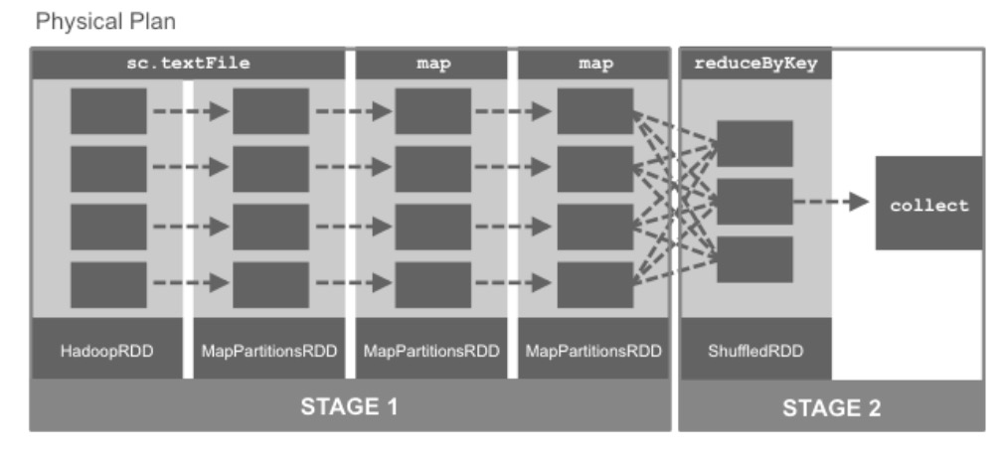

图例 4‑24 物理规划

调度程序通常为图中的每个RDD输出一个计算阶段。然而，当RDD可以从其上级依赖进行计算而不移动数据时，多个RDD将被折叠成单个阶段。而将多个RDD的操作折叠到一个阶段的处理被称为流水线。在计算中，流水线是串联连接的一组数据处理元素，其中一个元素的输出是下一个元素的输入。管道的元素通常以并行或时间分割的方式执行；在这种情况下，通常会在元素之间插入一定量的缓冲存储器。

在该示例中，map操作在RDD的分区之间不移动任何数据，因此两个对RDD进行的map转换合并到流水线中，产生STAGE1。由于reduceByKey转换做了Shuffle操作，需要在RDD的分区之间根据相同键传递值和计算值，所以被安排到下一阶段STAGE2。这就是调度程序可能会合并谱系的一种情况，当然还有其他几种情况。这里列出了调度程序可以合并RDD谱系的情况：

  - 当依赖的上级RDD没有数据移动时，Spark调度程序将多个RDD合并到单个阶段。

  - 当RDD持久化到集群内存或磁盘时，Spark调度程序将合并RDD谱系。

  - 如果较早的Shuffle操作已经将RDD物理化，就是将RDD的计算结构保存了下来，就不需要再执行生成这个RDD的所有操作，可以在这个RDD的基础上开始操作。此优化内置于Spark中。

当执行一个动作时，例如collect操作，DAG被转换成一个物理计划，以计算执行操作所需的RDD。Spark调度程序提交作业以计算所有必需的RDD。每个作业（Job）由一个或多个阶段组成，每个阶段由任务（Task）组成。阶段按顺序处理，并且在集群上调度和执行单个任务。对于同一阶段中的RDD，其中每个分区都有对应一个任务。这些任务被阶段启动，对RDD特定分区执行相同的事情，每个任务执行相同的步骤：

（1）获取输入（从数据存储、现有的RDD或Shuffle输出）

（2）执行必要的操作来计算所需的RDD

（3）输出给下一个Shuffle操作、外部存储或返回到驱动程序（例如count、collect）

现有总结几个重要的概念：

（1）一个任务是对应于一个RDD分区的工作单元

（2）一个阶段一组任务，并行执行相同的计算。

（3）洗牌是在阶段之间的传输数据。

（4）对于一个特定动作（如count）的一系列阶段是一个作业（Job）。

（5）当RDD从上级依赖RDD产生而不移动数据时，调度器会进行流水线操作

（6）DAG定义了RDD操作的逻辑关系。

（7）RDD是具有分区的并行数据集。

同时，Spark的程序执行经历了三个时期：

（1）用户代码定义了DAG或RDD

用户代码定义RDD和RDD上的操作。当对RDD应用转换时，会创建指向其上级RDD依赖关系图，从而导致DAG。

（2）动作负责将DAG转换为物理执行计划

当调用动作时，必须计算RDD。这导致按照谱系计算上级RDD。调度程序将每个操作提交作业以计算所有必需的RDD。此作业有一个或多个阶段，而这些阶段又由在分区上并行运行的任务组成。一个阶段对应产生一个RDD，除非由于流水线而使谱系合并。

（3）任务在集群上进行调度和执行

阶段按顺序执行。当作业的最后阶段完成时，动作被认为执行完成。

当创建新的RDD时，这三个时期可能会发生多次。

  - 通常作业中的阶段数等于DAG中的RDD数量。但是，调度程序可以在什么情况下合并谱系？

### 监控界面

在本节中，将使用Web UI来监视Spark应用程序。Spark Web
UI提供有关Spark作业的进度和性能详细信息。默认情况下，此信息仅在应用程序运行或Spark
Shell启动期间可用。每个SparkContext都会启动一个Web UI，默认情况下在端口4040上显示有关应用程序的有用信息，其中包括：

（1）调度程序阶段和任务的列表

（2）RDD大小和内存使用情况的摘要

（3）环境变量信息

（4）有关正在运行的执行程序信息

只需在Web浏览器中打开地址http://\<driver-node\>:4040，即可访问此界面。如果多个SparkContext在同一主机上运行，它们将绑定到以4040（4041、4042等）开头的连续端口上。请注意，此信息仅在应用程序默认配置情况下可用。要想在应用程序运行之后查看Web
UI，需要在启动应用程序之前将spark.eventLog.enabled设置为true，具体操作方法可以参考官方手册。在本例中，可以根据下面代码示例来看一看作业和阶段等关键信息：

scala\> val inputRDD = sc.textFile("/root/data/sfpd.csv")

inputRDD: org.apache.spark.rdd.RDD\[String\] = /root/data/sfpd.csv
MapPartitionsRDD\[1\] at textFile at \<console\>:24

scala\> val sftpdRDD = inputRDD.map(x=\>x.split(","))

sftpdRDD: org.apache.spark.rdd.RDD\[Array\[String\]\] =
MapPartitionsRDD\[2\] at map at \<console\>:26

scala\> val catRDD = sftpdRDD.map(x=\>(x(1),1)).reduceByKey((a,b)=\>a+b)

catRDD: org.apache.spark.rdd.RDD\[(String, Int)\] = ShuffledRDD\[4\] at
reduceByKey at \<console\>:28

scala\> catRDD.cache()

res0: catRDD.type = ShuffledRDD\[4\] at reduceByKey at \<console\>:28

scala\> catRDD.collect()

res1: Array\[(String, Int)\] = Array((PROSTITUTION,1316),
(DRUG/NARCOTIC,14300), (EMBEZZLEMENT,392), (FRAUD,7416),
(WEAPON\_LAWS,3975), (BURGLARY,15374), (EXTORTION,75), (WARRANTS,17508),
(DRIVING\_UNDER\_THE\_INFLUENCE,1038), (TREA,6), (LARCENY/THEFT,96955),
(BAD CHECKS,69), (RECOVERED\_VEHICLE,760), (LIQUOR\_LAWS,494),
(SUICIDE,182), (OTHER\_OFFENSES,50611), (VEHICLE\_THEFT,17581),
(DRUNKENNESS,1870), (MISSING\_PERSON,11560), (DISORDERLY\_CONDUCT,1052),
(FAMILY\_OFFENSES,201), (ARSON,690), (ROBBERY,9658),
(SUSPICIOUS\_OCC,13659), (GAMBLING,46), (KIDNAPPING,1268),
(RUNAWAY,521), (VANDALISM,17987), (BRIBERY,159), (NON-CRIMINAL,50269),
(SECONDARY\_CODES,4972), (SEX\_OFFENSES/NON\_FORCIBLE,49),
(PORNOGRAPHY/OBSCENE MAT,10), (SEX\_OFFENSES/FORCIBLE,2043),
(FORGERY/COUNTERFEITING,2025), (TRESPASS,2930), (ASS...

scala\> catRDD.collect()

res2: Array\[(String, Int)\] = Array((PROSTITUTION,1316),
(DRUG/NARCOTIC,14300), (EMBEZZLEMENT,392), (FRAUD,7416),
(WEAPON\_LAWS,3975), (BURGLARY,15374), (EXTORTION,75), (WARRANTS,17508),
(DRIVING\_UNDER\_THE\_INFLUENCE,1038), (TREA,6), (LARCENY/THEFT,96955),
(BAD CHECKS,69), (RECOVERED\_VEHICLE,760), (LIQUOR\_LAWS,494),
(SUICIDE,182), (OTHER\_OFFENSES,50611), (VEHICLE\_THEFT,17581),
(DRUNKENNESS,1870), (MISSING\_PERSON,11560), (DISORDERLY\_CONDUCT,1052),
(FAMILY\_OFFENSES,201), (ARSON,690), (ROBBERY,9658),
(SUSPICIOUS\_OCC,13659), (GAMBLING,46), (KIDNAPPING,1268),
(RUNAWAY,521), (VANDALISM,17987), (BRIBERY,159), (NON-CRIMINAL,50269),
(SECONDARY\_CODES,4972), (SEX\_OFFENSES/NON\_FORCIBLE,49),
(PORNOGRAPHY/OBSCENE MAT,10), (SEX\_OFFENSES/FORCIBLE,2043),
(FORGERY/COUNTERFEITING,2025), (TRESPASS,2930), (ASS...

scala\> catRDD.count()

res3: Long = 39

代码 4.63

要访问Web
UI，使用Web浏览器打开驱动程序的ip地址和端口4040。Jobs页面提供活动和最近完成的Spark作业的详细执行信息，提供Job的表现，以及运行Job的进度、阶段和任务。

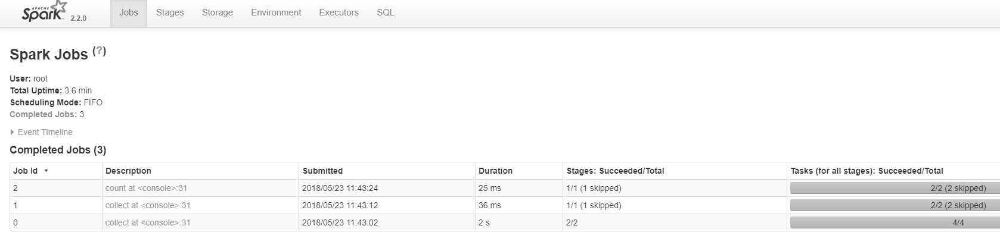

图例 4‑25 Spark作业的详细执行信息

Job0是被第一个执行的，对应于collect动作，由2个阶段组成，每个阶段由4个任务组成。Job1对应于第二个collect动作，由1个阶段组成，其由两个任务组成。Job2对应于count动作，并且还由1个阶段组成，其包含两个任务。需要注意的是第一个Job花了2秒，而对比Job1历时36毫秒。

  - Job1和Job2为什么仅有一个阶段，而跳过了一个阶段？

第一个collect首先计算有两个阶段的RDD，分别是map和reduceByKey，然后将输出的RDD缓存。第二个collect和第三个count直接使用已经被缓存的RDD，调度器合并了RDD谱系，结果导致跳过计算RDD的阶段。这也导致Job1为36毫秒比Job0的2秒快，虽然都是运行collect操作。

单击“Jobs”页面上“Description”列中的链接，将进入“Job
Details”页面。此页面提供了运行作业的进度、阶段和任务。注意Job0中的collect在这里需要0.1秒。

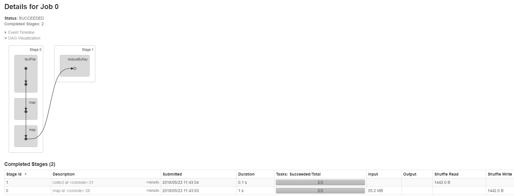

图例 4‑26 Job Details页面

而在Job1的详细信息中，可以看到跳过了map阶段。

图例 4‑27Job1的详细信息

在此页面中，可以看到完成的阶段和跳过阶段的细节。请注意，这里的collect只用了30毫秒。一旦确定了感兴趣的阶段，可以点击链接深入到阶段的详细信息页面。

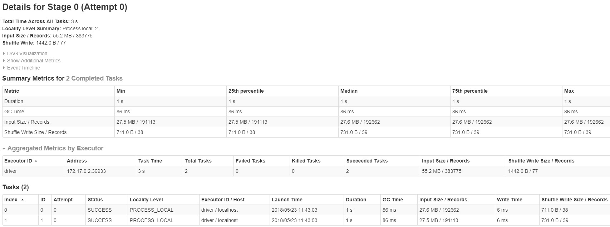

图例 4‑28阶段的详细信息

这里为所有任务的汇总指标。

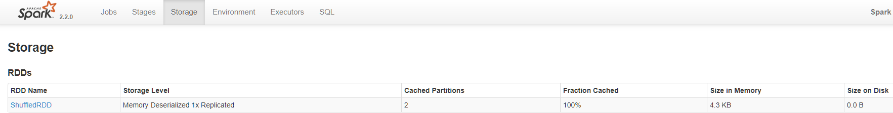

图例 4‑29Storage页面

Storage页面提供有关持久化RDD的信息。如果在RDD上调用persist和cache操作，并且随后执行了一个动作，那么这个RDD就会被持久化。该页面告诉RDD哪个部分被缓存，并且包括多少比例的RDD被缓存，已经在不同存储介质中的大小，以查看重要数据集是否适合内存。

图例 4‑30有关持久化RDD的信息

Environment页面列出了运行Spark应用程序的环境变量。当想要查看启用了哪些配置标志时，请使用此页面。请注意，只有通过Spark-default.conf、SparkConf或者在命令行中指定的值将在这里显示。对于所有其它配置属性，则使用默认值。

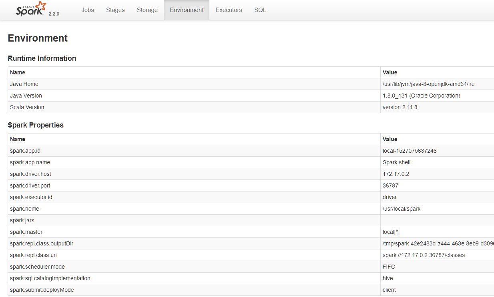

图例 4‑31Environment页面

Executors页面列出了应用程序中活动的执行器，还包括关于每个执行器的处理和存储的一些指标。使用此页面确认的应用程序是否具有期望的资源数量。

图例 4‑32Executors页面

  - 可用通过Web UI监控哪些事情？

可以使用Jobs页面和Stages选项卡查看哪些阶段运行缓慢，比较一个阶段的指标，看看每个任务；查看Executors选项卡，查看应用程序是否具有预期的资源；使用Storage选项卡查看数据集是否适合内存，哪些部分被缓存。

### 调试优化

现在将看看如何调试和调整的Spark应用程序。以下是调试性能问题的一些方法。要检测Shuffle问题，请查看Web
UI，查看任何非常慢的任务。当在某些小型任务比其他任务需要更长时间时，数据并行系统中就会出现的一些常见的性能问题，也可以成为偏斜（skewness）问题，就是指任务运行时间的不对称。要查看是否存在偏斜问题，请查看Stages详细信息页面，看看是否存在运行速度明显慢于其他的任务。向下钻取以查看是否有少量任务读取或写入比其他更多的数据。在Stages页面中，还可以确定某些节点上的任务是否运行缓慢。从Web
UI，还可以找到那些在读取、计算和写入上花费太多时间的任务。在这种情况下，查看代码是否有任何高代价的操作被执行，通常导致性能下降的常见问题是：

（1）平行度水平

（2）洗牌操作期间使用的序列化格式

（3）管理内存以优化应用程序

接下来将更深入地研究这些内容。RDD被分成一组分区，其中每个分区包含数据的子集。调度程序将为每个分区创建一个任务。每个任务需要集群中的单个核心。默认情况下，Spark将基于它认为最佳的并行度进行分区。

图例 4‑33 Spark将基于它认为最佳的并行度进行分区

  - 并行性水平如何影响性能？

如果并行性水平太小，Spark可能会让资源的闲置。如果太多的并行性，与每个分区相关联的开销加起来变得显着。

  - 如何找到分区数？

可以通过Web UI
中的Stages选项卡中进行操作。由于阶段中的任务对应到RDD中的单个分区，所以任务总数就是分区数。还可以使用rdd.partitions.size来获得RDD分区的数量。如果要调整并行度，可以下面几种方法：

（1）指定分区的数量，当调用操作需要Shuffle数据时，例如reduceByKey。

（2）在RDD中重新分配数据，这可以通过增加或减少分区数来完成，可以使用repartition方法来指定分区或coalesce减少分区的数量。

当在Shuffle操作期间通过网络传输大量数据时，Spark将对象序列化为二进制格式。序列化将对象的状态信息转换为可以存储或传输的形式的过程。在序列化期间，对象将其当前状态写入到临时或持久性存储区。以后，可以通过从存储区中读取或反序列化对象的状态，重新创建该对象。对象序列化有时会造成瓶颈。默认情况下，Spark采用内置的Java序列化。然而，往往是更有效地应该使用Kryo系列化。在Spark中可以用不同的方式使用内存。调整Spark的使用内存可以帮助优化的应用程序，默认情况下Spark将使用：

（1）RDD存储空间的60％

（2）20％Shuffle

（3）20％用于用户程序

可以通过调整用于RDD存储、Shuffle和用户程序的内存区域来调整内存使用情况。在RDD上使用cache或persist方法。在RDD上使用cache将RDD分区存储在内存缓冲区中。persist有各种选项，有关RDD的持久性选项，请参阅Apache
Spark文档。默认情况下，persist()与cache()或persist(MEMORY\_ONLY)功能是相同的。如果没有足够的空间来缓存新的RDD分区，那么旧的分区将被删除并在需要时进行重新计算。最好使用persist(MEMORY\_AND\_DISK)，这将在磁盘上存储数据，并在需要时将其加载到内存中，这减少了昂贵的计算。使用MEMORY\_ONLY\_SER选项将减少垃圾回收。缓存序列化对象可能比缓存原始对象慢，但是它确实减少了垃圾收集的时间。

Spark日志子系统基于log4j，记录级别或日志输出可以自定义。log4j的配置属性的一个例子在Spark安装目录conf中提供，可以被复制并适当地进行编辑的。Spark日志文件的位置取决于部署模式。在Spark独立模式下，日志文件位于每个Worker的Spark部署目录中。在Kubernetes中，日志通常通过kubectl logs或集中式日志系统采集，
而在YARN中可通过YARN日志收集工具访问。

如果可能的话，避免Shuffle大量数据。在使用聚合操作的情况下，尽量使用aggregateByKey。对于大量数据，使用groupByKey的结果会产生大量的Shuffle操作。如果可能的话使用reduceByKey，还可以使用combineByKey或
foldByKey。collect动作试图将在RDD中每一个元素传送到驱动程序上。如果有一个非常大的RDD，这可能会导致驱动程序崩溃。countByKey、countByValue和collectAsMap也会出现同样的问题。过滤掉尽可能多的数据集。如果有很多空闲的任务，则需要减少分区。如果没有使用群集中的所有插槽，则重新分区。

  - 可以使用哪些方法提高Spark的性能？

## 小结

Spark性能调整是调整设置以记录系统使用内存、内核和实例的过程。这个过程保证Spark具有最佳性能并防止Spark中的资源瓶颈。在本章中，提供有关如何调整Apache
Spark作业的相关信息，性能调优介绍、Spark序列化库（如Java序列化和Kryo序列化）、Spark内存调优，还学习了Spark数据结构调优，Spark数据区域性和垃圾收集调优。

