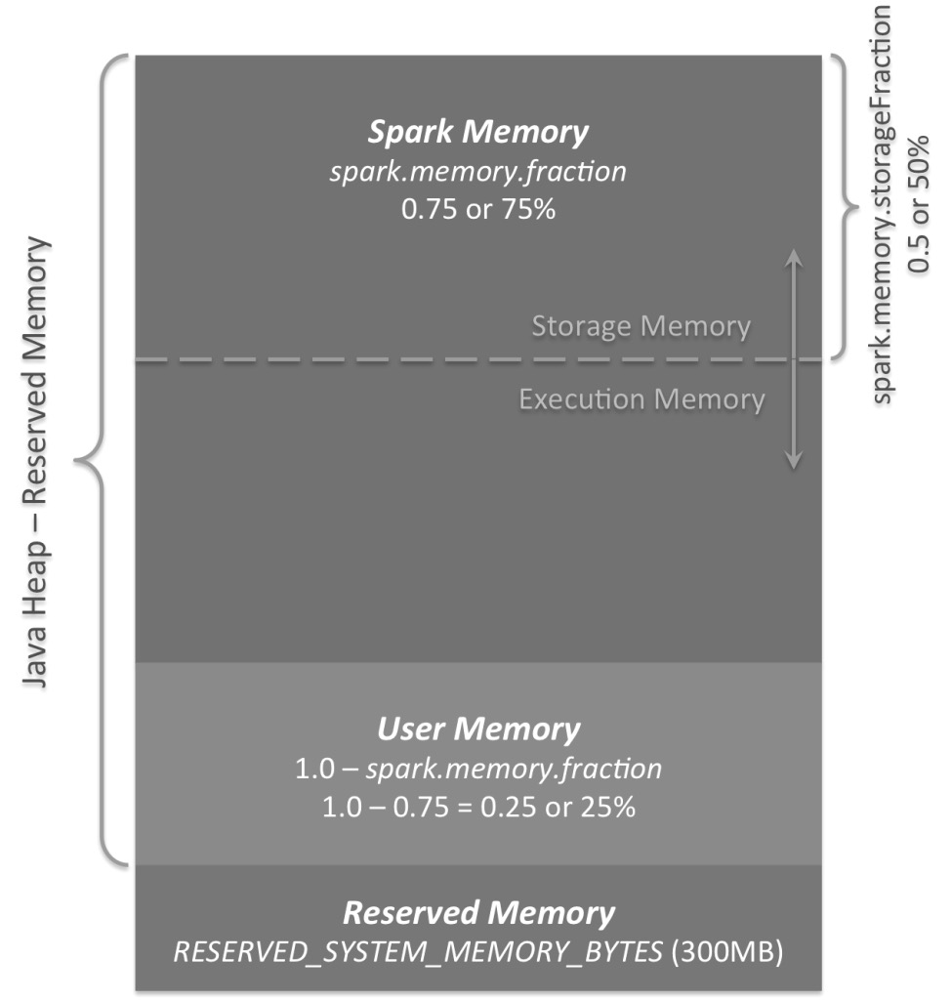

# 11.4 内存管理

内存问题在 Spark 调优里很常见，但真正值得关心的通常不是“背参数”，而是先判断压力到底来自哪里: 是 Shuffle 缓冲区太大、缓存占用过多、对象表示太重，还是 Driver / Executor 堆本身就不够。本节会先用统一内存模型解释 Spark 如何管理堆内存，再说明哪些现象更适合从缓存策略、对象表示、序列化和 GC 行为去排查。

Spark中的堆内存，通常可以先从两类用途来理解：执行内存（Execution Memory）和存储内存（Storage Memory）。前者主要服务于Shuffle、Join、排序、聚合这类运行期计算；后者主要用于缓存RDD/DataFrame分区、广播变量以及部分中间结果。

在统一内存模型下，两者共享同一块由Spark管理的内存区域 `M`。当执行侧压力较小时，存储侧可以占用更多空间；当执行侧需要更多空间时，又可以向存储侧借用一部分容量。这里常见的 `R` 可以理解为存储区域中的一个保留阈值，用来帮助缓存块尽量避免被过早驱逐。这个设计的核心目标很简单：让不缓存数据的应用能把更多空间用于执行，让大量依赖缓存的应用也至少保留一部分稳定的存储空间，同时尽量减少用户手动调参的负担。常见的两个配置如下：

（1）spark.memory.fraction

表示 `M` 在可用堆中的占比，默认值通常为 `0.6`。剩余空间主要留给用户对象、Spark 内部元数据以及处理异常大记录时的安全余量。

（2）spark.memory.storageFraction

表示 `R` 在 `M` 中的占比，默认值通常为 `0.5`。它可以理解为存储内存中的一个保留阈值，使缓存块不至于过早被执行侧挤掉。

从Spark 1.6.0开始，Spark把早期较固定的内存划分方式切换到了统一内存模型（UnifiedMemoryManager）。如果你在阅读更老的资料，可能还会看到“Legacy”内存管理的说法；那更多是历史背景。对Spark 4.x读者而言，本书建议把注意力放在统一内存模型本身，也就是“执行内存与存储内存共享同一块可动态伸缩的区域”这一核心机制上。下图展示了这种模型的基本结构：

图例 11‑17 三个主要的内存区域

从图里可以把堆内存大致理解成三个区域：

  - 保留内存

这是 Spark 预留出来的一小块安全空间，不参与普通 Spark 内存区域的计算。对读者来说，记住它的作用就够了: 不是所有 Java 堆都能拿来缓存和执行，Spark 会保留一部分空间给内部对象和运行时安全余量。因此，Executor 堆如果本身就很小，很多“调缓存级别”的技巧都不会真正奏效。

  - 用户内存

这是 Spark 管控区域之外、由用户代码自行消耗的内存。例如在 `mapPartitions` 里维护大型哈希表、在 Driver 端拼装巨型本地集合、或者在 UDF 中持有额外对象，都会落到这部分预算里。Spark 不会主动替你管理它，所以很多 OOM 问题并不一定是“Spark 内存比例错了”，而是用户代码本身吃掉了过多堆空间。

(Java Heap – Reserved Memory) \* （1.0 - spark.memory.fraction）

公式 11‑1

默认值等于：

（Java Heap - 300MB）\* 0.25

公式 11‑2

例如，若 Java 堆为 4GB，用户内存大致会落在这个量级。更重要的是，这部分空间是否会被“偷偷吃满”，往往只有结合堆转储、GC 日志和代码路径才能判断出来。

  - Spark内存

最后，这是由 Spark 自己管理的内存池，也是调优时最常被提到的那一部分：

(Java Heap – Reserved Memory) \* （spark.memory.fraction）

公式 11‑3

使用Spark 1.6.0默认值为：

（Java Heap - 300MB）\* 0.75

公式 11‑4

例如，如果 Java 堆为 4GB，这个池大致会落在这里。它内部又分成执行内存和存储内存，两者的边界并不是完全固定的，而是会在运行时动态伸缩。这正是统一内存模型的关键改进: 不缓存数据的作业可以把更多空间用于执行，而强依赖缓存的作业也能保留一部分相对稳定的存储区域。下面先看这两部分各自承担什么职责：

（1）存储内存

这部分主要用于缓存 RDD / DataFrame 分区、广播变量以及部分展开后的数据块。它决定了“哪些数据能留在内存里复用，哪些数据会被驱逐到磁盘或在下次访问时重算”。

（2）执行内存

这部分主要服务于运行期计算，例如 Shuffle 缓冲区、聚合哈希表、排序结构和 Join 中间状态。它不足时常见的现象是频繁溢写、任务变慢、GC 压力升高，甚至在极端情况下直接 OOM。

执行内存和存储内存之间之所以能“动态伸缩”，核心就在于两者可被回收的难度不同。执行内存里放的是任务正在使用的中间结构，不能随便驱逐；而存储内存里的缓存块在必要时可以被淘汰、落盘，或者在下次访问时重算。因此，执行侧缺空间时更容易向存储侧借位。常见情况包括：

（1）存储内存池中有可用空间，即缓存块没有使用所有可用的内存。然后，它只会减少存储内存池大小，从而增加执行内存池。

（2）存储内存池大小超过了初始存储内存区域大小，并且具有所有这些空间。这种情况会导致来自存储内存池的强制驱逐，除非它达到其初始大小。

反过来，存储侧想向执行侧借回空间，就必须等执行内存先释放出可用余量。初始存储区域大小可以写成：

"Spark Memory" \* spark.memory.storageFraction

等于：

("Java Heap"–"Reserved Memory") \* spark.memory.fraction \*
spark.memory.storageFraction

使用默认值，这等于：

("Java Heap"– 300MB) \* 0.75 \* 0.5 =("Java Heap"–300MB) \* 0.375

以 4GB 堆为例，初始存储区域大致会落在这个量级。它的实际意义是: 如果你的作业高度依赖缓存，但执行阶段同时也非常吃内存，那么最终真正留给缓存的空间可能会比“纸面比例”更小。也正因为如此，现代 Spark 调优更强调看实际现象，而不是只盯着两个 fraction 配置做机械调参。
