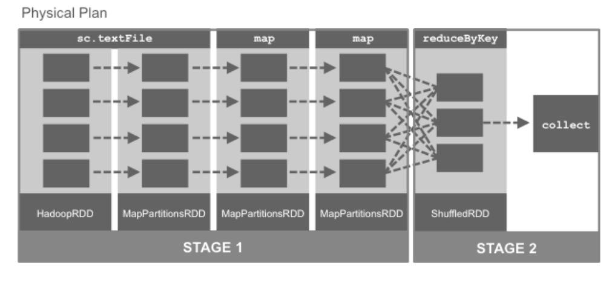
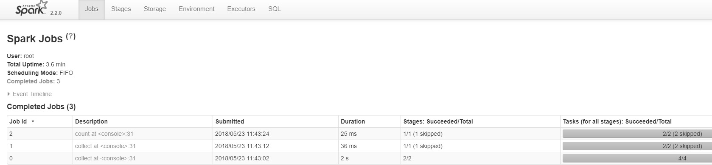
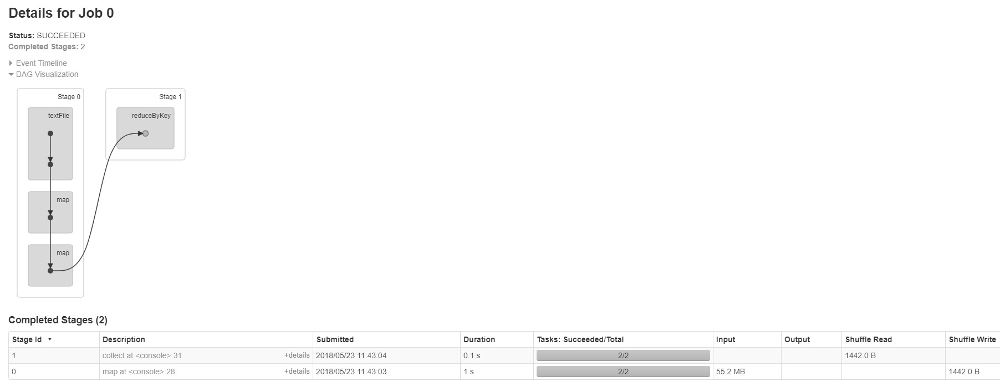
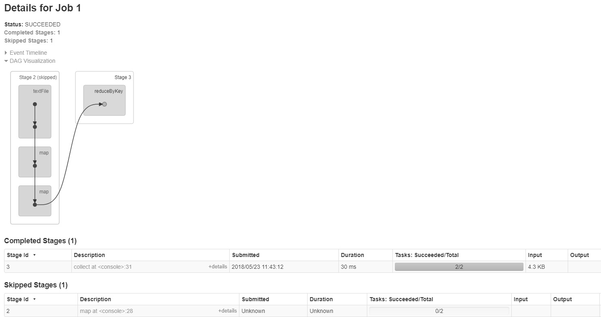
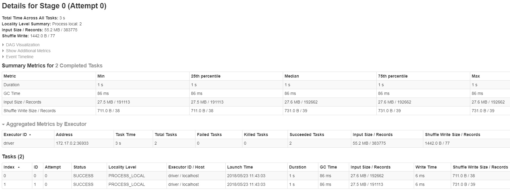
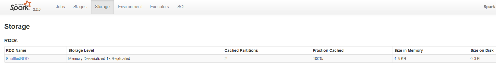
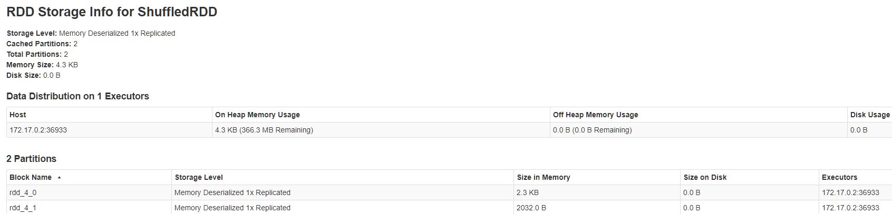
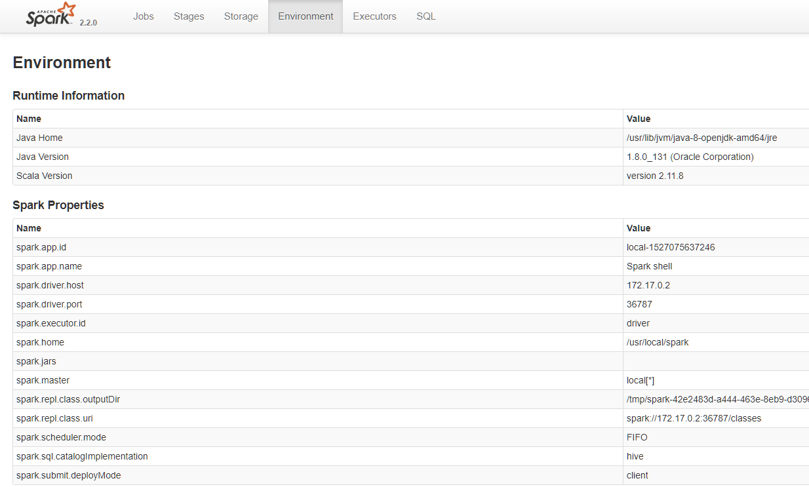
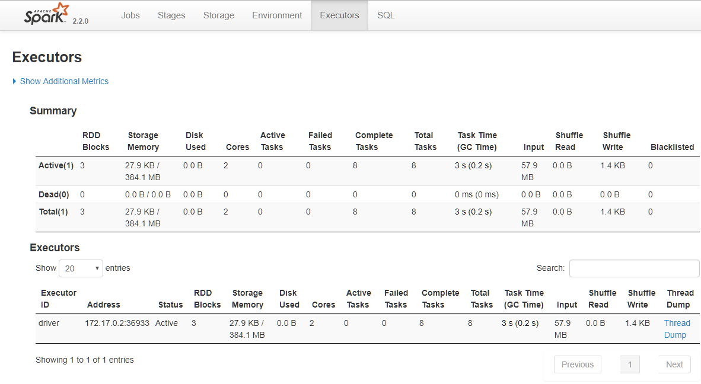
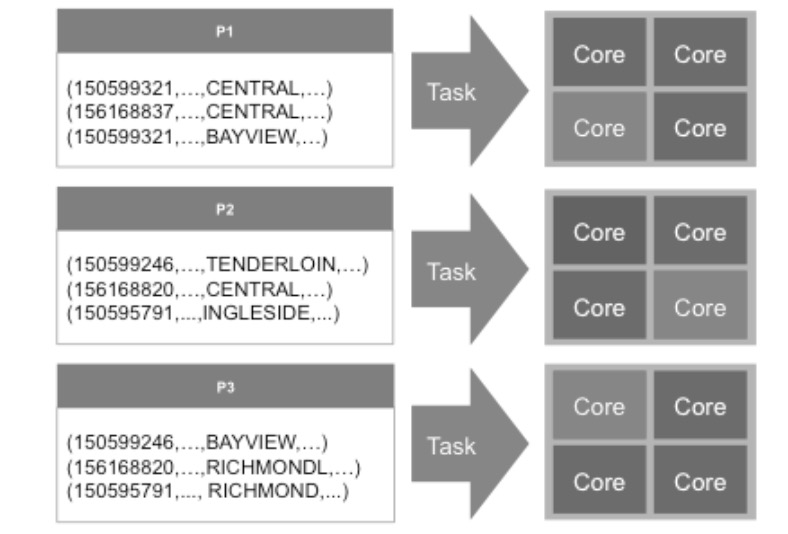

# 11.8 案例分析

这一节回到一个更具体的问题：一段 Spark 用户代码，最终是怎样被拆成作业、阶段和任务的。理解这条链路，有助于把前面讲过的 DAG、Stage、Shuffle 和执行器行为真正对应到实际运行过程。

### 11.8.1 执行模型

先从一个小例子开始，把前面讲过的 DAG、Stage、Task 和缓存命中真正对应到一次执行过程中。这里继续沿用 SFPD 数据集示例，因为它既包含普通 `map` 转换，也包含 `reduceByKey` 带来的 Shuffle，足够说明 Spark 是怎样把用户代码拆成多个阶段的。

```scala
scala> val inputRDD = sc.textFile("/root/data/sfpd.csv")
inputRDD: org.apache.spark.rdd.RDD[String] = /root/data/sfpd.csv
MapPartitionsRDD[1] at textFile at <console>:24
scala> val sftpdRDD = inputRDD.map(x=>x.split(","))
sftpdRDD: org.apache.spark.rdd.RDD[Array[String]] =
MapPartitionsRDD[4] at map at <console>:26
scala> val catRDD = sftpdRDD.map(x=>(x(1),1)).reduceByKey((a,b)=>a+b)
catRDD: org.apache.spark.rdd.RDD[(String, Int)] = ShuffledRDD[7] at
reduceByKey at <console>:28
```

代码 11.39
第一行从 `sfpd.csv` 生成输入 RDD；第二行按逗号切分得到结构化一点的中间 RDD；第三行再通过 `map` 和 `reduceByKey` 统计类别数量。到这里为止，Spark 仍然没有真正执行计算，而是在内存里记录了一条依赖链。要查看这条谱系，可以调用 `toDebugString`：

```scala
scala> catRDD.toDebugString
res0: String =
(2) ShuffledRDD[7] at reduceByKey at <console>:28 []
+-(2) MapPartitionsRDD[6] at map at <console>:28 []
| MapPartitionsRDD[4] at map at <console>:26 []
| /root/data/sfpd.csv MapPartitionsRDD[3] at textFile at
<console>:24 []
| /root/data/sfpd.csv HadoopRDD[2] at textFile at <console>:24 []
```

代码 11.40
这个输出展示了 `catRDD` 的完整谱系。可以看到，`sc.textFile` 先生成 `HadoopRDD`，后续的 `map` 转换形成 `MapPartitionsRDD`，而 `reduceByKey` 会引入 `ShuffledRDD`，也就是后面发生 Stage 切分的关键位置。

这时还没有真正生成任何结果，因为没有动作触发执行。当我们对 `catRDD` 调用 `collect` 时，Spark 才会从目标 RDD 反向追踪所需依赖，生成物理执行计划，并把每个分区对应的任务提交到集群上运行。



图例 11‑24 物理规划

调度器并不会机械地为“每一个 RDD”都单独生成一个阶段。更准确地说，Spark 会沿着依赖链向前分析：只要一串转换之间不需要 Shuffle，也不需要从已经物化的结果重新起步，它们就有机会被压进同一个 Stage 里执行。这种把多步窄依赖转换串起来连续执行的方式，通常就叫流水线化（pipelining）。

在图中的例子里，两个 `map` 都只是对各自分区做局部计算，不涉及跨分区数据交换，所以可以放在同一个 Stage 中顺序完成；而 `reduceByKey` 需要把相同键的数据重新汇集到一起，因此会形成新的 Shuffle 边界，并被拆到下一阶段。理解 Stage 切分时，最重要的不是记住某个固定规则，而是先问一句：这里有没有跨分区重组数据，或者有没有从已缓存/已物化结果重新开始？

当某个动作（例如 `collect()`）触发执行时，逻辑 DAG 会被细化成真正要运行的作业。一个作业可以包含多个阶段，每个阶段又会针对其输入分区生成一组任务。任务才是最终被提交到执行器上的最小运行单元：它读取输入分区、执行本阶段的那串算子，并把结果返回给下游阶段、Driver，或者外部存储系统。

（1）获取输入（从数据存储、现有的RDD或Shuffle输出）

（2）执行必要的操作来计算所需的RDD

（3）输出给下一个Shuffle操作、外部存储或返回到驱动程序（例如count、collect）

到这里可以先把几个关键概念捋顺：

（1）一个任务通常对应一个输入分区的工作单元。

（2）一个阶段是一组可以并行执行同类计算的任务。

（3）Shuffle 是阶段之间最常见的数据重分布边界。

（4）一次动作触发的一整串阶段构成一个作业（Job）。

（5）当上游到下游只涉及窄依赖且无需移动数据时，调度器会尽量把它们流水线化。

（6）DAG 描述的是逻辑依赖关系，而不是最终的物理执行细节。

（7）RDD 是带分区的并行数据抽象。

换一个角度看，Spark 的执行大致会经过三个阶段：

（1）用户代码定义 RDD 与依赖关系。

在这一阶段，程序只是声明“要做什么”，尚未真正计算结果。

（2）动作把逻辑 DAG 转成可执行计划。

当动作被调用后，调度器会沿谱系回溯，确定需要哪些阶段和任务，并据此生成真正的执行计划。

（3）任务在集群上被调度并执行。

各阶段按依赖顺序推进；最后一个阶段完成后，这次动作对应的作业才算结束。

同一个应用在生命周期里会不断重复这条链路。真正理解执行模型的关键，不是去数“有几个 RDD”，而是先判断哪些依赖能合并，哪些地方一定会引入 Shuffle 边界。

### 11.8.2 监控界面

接下来把视角切到 Spark Web UI。它是定位执行瓶颈、观察阶段划分和查看缓存/执行器状态的第一现场。默认情况下，每个 `SparkContext` 都会启动一个 Web UI，通常监听在 `4040` 端口；应用运行期间，可以在这里看到与作业进度和性能相关的大量细节，包括：

（1）调度程序阶段和任务的列表

（2）RDD大小和内存使用情况的摘要

（3）环境变量信息

（4）有关正在运行的执行程序信息

在浏览器中打开 `http://<driver-node>:4040` 就可以访问 Web UI；如果同一台机器上同时跑了多个 SparkContext，端口会依次递增到 `4041`、`4042` 等。需要注意的是，默认情况下这个 UI 主要服务于“应用运行期间”的观察；如果希望在应用结束后继续回放执行过程，就要提前开启事件日志，例如设置 `spark.eventLog.enabled=true` 并配置对应日志目录。下面继续沿用前面的例子来看 Jobs、Stages、Storage、Environment 和 Executors 几个页面。

```scala
scala> val inputRDD = sc.textFile("/root/data/sfpd.csv")
inputRDD: org.apache.spark.rdd.RDD[String] = /root/data/sfpd.csv
MapPartitionsRDD[1] at textFile at <console>:24
scala> val sftpdRDD = inputRDD.map(x=>x.split(","))
sftpdRDD: org.apache.spark.rdd.RDD[Array[String]] =
MapPartitionsRDD[2] at map at <console>:26
scala> val catRDD = sftpdRDD.map(x=>(x(1),1)).reduceByKey((a,b)=>a+b)
catRDD: org.apache.spark.rdd.RDD[(String, Int)] = ShuffledRDD[4] at
reduceByKey at <console>:28
scala> catRDD.cache()
res0: catRDD.type = ShuffledRDD[4] at reduceByKey at <console>:28
scala> catRDD.collect()
res1: Array[(String, Int)] = Array((PROSTITUTION,1316),
(DRUG/NARCOTIC,14300), (EMBEZZLEMENT,392), (FRAUD,7416),
(WEAPON_LAWS,3975), (BURGLARY,15374), (EXTORTION,75), (WARRANTS,17508),
(DRIVING_UNDER_THE_INFLUENCE,1038), (TREA,6), (LARCENY/THEFT,96955),
(BAD CHECKS,69), (RECOVERED_VEHICLE,760), (LIQUOR_LAWS,494),
(SUICIDE,182), (OTHER_OFFENSES,50611), (VEHICLE_THEFT,17581),
(DRUNKENNESS,1870), (MISSING_PERSON,11560), (DISORDERLY_CONDUCT,1052),
(FAMILY_OFFENSES,201), (ARSON,690), (ROBBERY,9658),
(SUSPICIOUS_OCC,13659), (GAMBLING,46), (KIDNAPPING,1268),
(RUNAWAY,521), (VANDALISM,17987), (BRIBERY,159), (NON-CRIMINAL,50269),
(SECONDARY_CODES,4972), (SEX_OFFENSES/NON_FORCIBLE,49),
(PORNOGRAPHY/OBSCENE MAT,10), (SEX_OFFENSES/FORCIBLE,2043),
(FORGERY/COUNTERFEITING,2025), (TRESPASS,2930), (ASS...
scala> catRDD.collect()
res2: Array[(String, Int)] = Array((PROSTITUTION,1316),
(DRUG/NARCOTIC,14300), (EMBEZZLEMENT,392), (FRAUD,7416),
(WEAPON_LAWS,3975), (BURGLARY,15374), (EXTORTION,75), (WARRANTS,17508),
(DRIVING_UNDER_THE_INFLUENCE,1038), (TREA,6), (LARCENY/THEFT,96955),
(BAD CHECKS,69), (RECOVERED_VEHICLE,760), (LIQUOR_LAWS,494),
(SUICIDE,182), (OTHER_OFFENSES,50611), (VEHICLE_THEFT,17581),
(DRUNKENNESS,1870), (MISSING_PERSON,11560), (DISORDERLY_CONDUCT,1052),
(FAMILY_OFFENSES,201), (ARSON,690), (ROBBERY,9658),
(SUSPICIOUS_OCC,13659), (GAMBLING,46), (KIDNAPPING,1268),
(RUNAWAY,521), (VANDALISM,17987), (BRIBERY,159), (NON-CRIMINAL,50269),
(SECONDARY_CODES,4972), (SEX_OFFENSES/NON_FORCIBLE,49),
(PORNOGRAPHY/OBSCENE MAT,10), (SEX_OFFENSES/FORCIBLE,2043),
(FORGERY/COUNTERFEITING,2025), (TRESPASS,2930), (ASS...
scala> catRDD.count()
res3: Long = 39
```

代码 11.41
Jobs 页面用于查看当前和最近完成的作业，以及它们各自包含的阶段、任务和执行时间。



图例 11‑25 Spark作业的详细执行信息

在这个例子里，Job0 对应第一次 `collect`，它需要真正完成从输入到 `reduceByKey` 的整条计算链，因此会看到 2 个阶段。Job1 是第二次 `collect`，Job2 是后续的 `count`；由于 `catRDD` 已经被缓存，它们不再需要重复执行前面的计算链，所以阶段数和耗时都明显更小。

  - Job1和Job2为什么仅有一个阶段，而跳过了一个阶段？

第一次 `collect` 会先把包含 `map` 与 `reduceByKey` 的上游计算完整跑一遍，并把 `catRDD` 缓存下来。之后的第二次 `collect` 和 `count` 都可以直接命中缓存，因此看起来像是“跳过了前面的阶段”。这里快的原因不是动作类型不同，而是输入是否已经物化并可直接复用。

点击 Jobs 页的 Description 链接，会进入 Job Details 页面。这个页面会进一步展开作业内各阶段的执行情况，是定位“到底慢在哪一段”的第一站。



图例 11‑26 Job Details页面

而在 Job1 的详细信息里，可以看到前面被缓存命中的阶段已经不需要重新执行。



图例 11‑27 Job 1 的详细信息

这个页面能同时看到已完成阶段和被跳过阶段的细节。一旦确定某个阶段值得深挖，就可以继续点进 Stage Details 查看任务级指标。



图例 11‑28 阶段的详细信息

Stage Details 会给出任务级汇总指标，是观察单个慢任务、数据倾斜、Shuffle 读写异常和 GC 开销的核心页面。



图例 11‑29 Storage 页面

Storage 页面展示缓存或持久化数据集的信息，包括缓存命中情况、内存占用、磁盘占用以及各分区的持久化比例。它最适合回答两个问题：缓存到底有没有生效，以及缓存后的数据是否真的放得进内存。



图例 11‑30 有关持久化 RDD 的信息

Environment 页面列出本次应用真正生效的配置项和环境变量。它非常适合用来核对“我以为改了某个参数，但它到底有没有生效”。



图例 11‑31 Environment 页面

Executors 页面展示当前应用的执行器数量、内存占用、任务分布、Shuffle 读写和失败情况，用来判断资源是否按预期分配、是否存在单节点异常，以及某些执行器是否明显更忙或更慢。



图例 11‑32 Executors 页面

  - 可用通过Web UI监控哪些事情？

最常见的观察路径是这样的：先在 Jobs 页面定位慢作业，再去 Stages 页面看慢阶段和任务分布；如果怀疑资源不足或节点异常，就看 Executors；如果怀疑缓存没命中或放不下，就看 Storage；如果怀疑参数没生效，就回到 Environment 页面核对。

例如，一个原本十几分钟完成的日报任务突然需要跑到半小时以上时，可以先在 Jobs 页面确认究竟是第一次聚合、后续复用结果的动作，还是最终写出阶段拖慢了整体时间；如果慢点集中在某个包含 Shuffle 的 Stage，就继续下钻到 Stage Details 看是否存在少数长尾任务；如果长尾任务集中在少数执行器上，再去 Executors 页面检查节点负载、失败重试和 Shuffle 读写是否异常；如果本应复用的中间结果没有命中缓存，就回到 Storage 页面确认缓存是否真正落地。把这条路径走一遍，通常比一开始就盲目改 `spark.sql.shuffle.partitions` 或执行器内存更稳。

### 11.8.3 调试优化

调优通常可以沿着一条固定路径展开：先在 Web UI 里找最慢的作业和阶段，再下钻到任务级别，看慢是因为读得多、写得多、Shuffle 重、GC 高，还是因为个别任务明显拖后腿。后者往往意味着数据倾斜，也就是少数分区承载了远多于其他分区的数据量。常见瓶颈通常集中在以下三类：

（1）平行度水平

（2）洗牌操作期间使用的序列化格式

（3）管理内存以优化应用程序

接下来可以围绕并行度、序列化和内存三个方向继续排查。首先是并行度：RDD 会被切成多个分区，每个分区通常对应一个任务；任务数过少会让资源闲置，任务数过多则会放大调度、序列化和 Shuffle 开销。



图例 11‑33 Spark将基于它认为最佳的并行度进行分区

  - 并行性水平如何影响性能？

并行度太小，会导致 CPU 和执行器空转；并行度太大，则会让任务启动、调度、序列化和小文件/小分区管理的开销变得明显。

  - 如何找到分区数？

可以在 Web UI 的 Stages 页面通过任务数大致判断分区规模，也可以直接在代码里用 `rdd.partitions.size` 查看。如果需要调整并行度，常见做法包括：

（1）指定分区的数量，当调用操作需要Shuffle数据时，例如reduceByKey。

（2）在RDD中重新分配数据，这可以通过增加或减少分区数来完成，可以使用repartition方法来指定分区或coalesce减少分区的数量。

当 Shuffle 期间需要在网络上传输大量数据时，Spark 会先把对象序列化成二进制字节流。序列化格式会直接影响 CPU 开销、网络负载和内存占用，因此它经常成为性能调优里的关键变量。Java 序列化通用但体积较大、速度也通常不占优；如果你的数据类型适合 Kryo，切换到 Kryo 往往能获得更紧凑的对象表示和更高的传输效率。

内存部分也不建议再用固定比例去死记硬背。现代 Spark 更强调统一内存管理：执行内存和存储内存在整体预算内动态平衡，具体表现会受到算子类型、缓存行为、广播变量和任务并发度共同影响。真正值得关注的是三件事：哪些数据需要缓存、哪些算子会放大执行期内存压力，以及对象表示和序列化方式是否过重。

在缓存策略上，`cache()` 等价于默认的 `persist()` 存储级别，适合那些会被重复访问且放得进默认存储层的数据；如果数据量较大、重算成本又高，`MEMORY_AND_DISK` 往往比一味追求纯内存更稳妥。是否使用序列化缓存、是否需要减少分区粒度或调整并发，不应靠固定配方决定，而应结合 Spark UI、执行时间、GC 日志和失败模式一起判断。

除了 Web UI，还要结合日志一起看问题。Spark 的日志系统可以自定义记录级别和输出位置；具体日志落点会随部署模式变化: Standalone 通常落在各 Worker 的工作目录，Kubernetes 常通过 `kubectl logs` 或集中式日志平台查看，YARN 则通过 YARN 的日志收集工具访问。

最后落到具体动作上，经验仍然是有用的，但应该和证据结合起来使用：尽量减少不必要的 Shuffle；做聚合时优先考虑 `reduceByKey`、`aggregateByKey`、`combineByKey` 这类可在 map 端先做预聚合的算子；谨慎使用会把大量数据拉回 Driver 的动作，例如 `collect`、`countByKey`、`countByValue` 和 `collectAsMap`。如果 Stage 里大量任务长期空闲，说明并行度可能过高；如果资源长期吃不满，则可能需要重新分区或调整上游数据布局。

  - 可以使用哪些方法提高Spark的性能？
