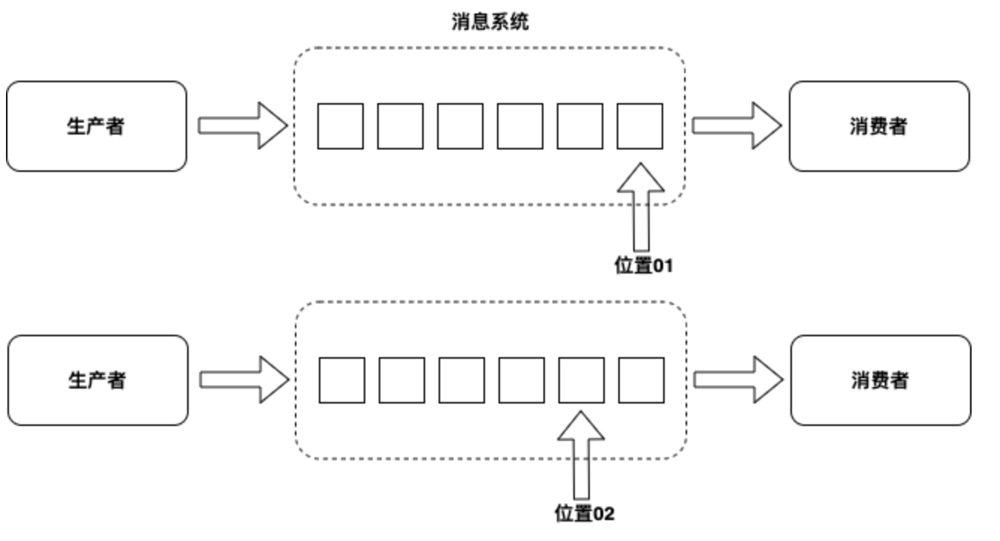
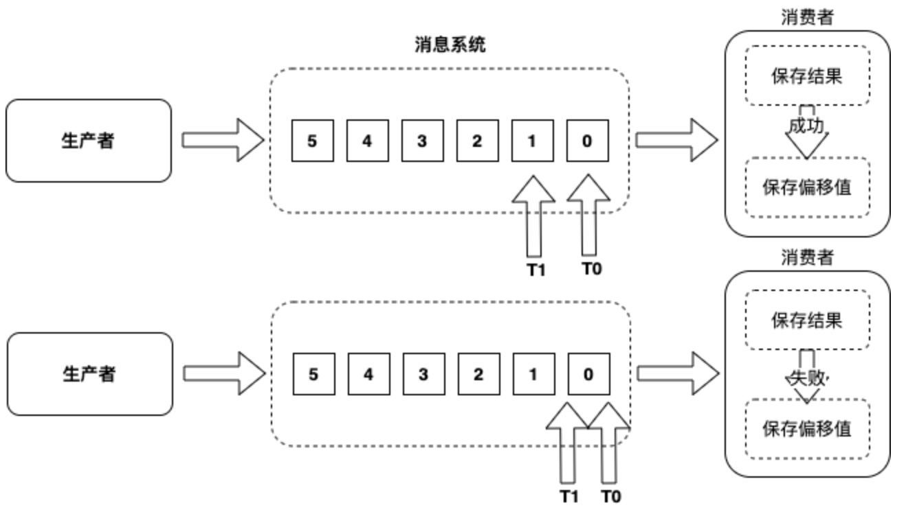
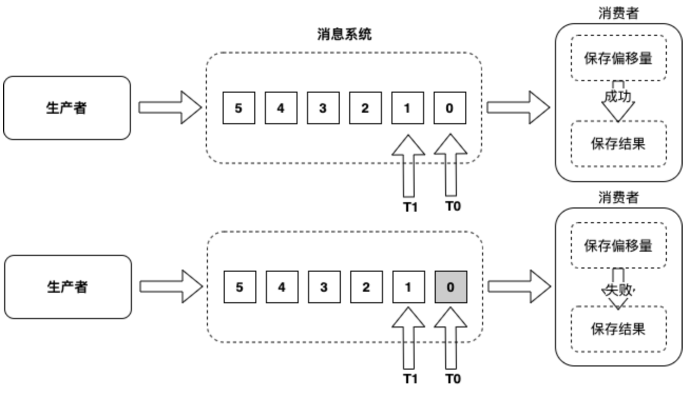
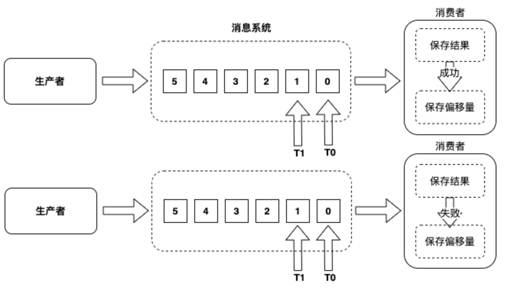

<!-- generated by doc-to-ppt-talk-track -->

## 5.3 处理范例

- 是先回答所有流处理系统都必须回答的问题
- 图例 5‑1 流处理系统
- 实时流数据的处理可以分为以下三个基本范例
- （1）至少一次

::: notes
本节先不区分 DStream 和 Structured Streaming，而是先回答所有流处理系统都必须回答的问题：结果如何保证正确。生产者把事件写入消息系统，消费者从中读取并计算，系统需要在“会不会丢、会不会重、失败后如何恢复”之间做出明确承诺。 接下来会依次看 处理范例、至少一次，以及 最多一次，后面的实现和案例都会沿着这条线继续展开。
:::

## 5.3 处理范例：学习路线

- 处理范例
- 至少一次
- 最多一次
- 恰好一次

::: notes
这一页先把 5.3 处理范例 的主线串起来，重点包括 处理范例、至少一次、最多一次，以及 恰好一次。先知道每一步要解决什么问题，后面的细节就更容易跟住。
:::

## 5.3 处理范例（1/2）

- 是先回答所有流处理系统都必须回答的问题
- 图例 5‑1 流处理系统
- 实时流数据的处理可以分为以下三个基本范例
- （1）至少一次

::: notes
本节先不区分 DStream 和 Structured Streaming，而是先回答所有流处理系统都必须回答的问题：结果如何保证正确。生产者把事件写入消息系统，消费者从中读取并计算，系统需要在“会不会丢、会不会重、失败后如何恢复”之间做出明确承诺。
:::

## 5.3 处理范例（2/2）

- （2）最多一次
- （3）恰好一次
- 虽然对实时事件的恰好处理一次对我们来说是最终的目标

::: notes
让我们看一下这三个流处理范例对我们的业务用例意味着什么。虽然对实时事件的恰好处理一次对我们来说是最终的目标，但要始终在不同的情况下实现此目标非常困难，如果实施的复杂性超过了这种保证的益处，我们必须妥协选择其他基本范例。
:::

## 5.3 处理范例：图示

{width=72%}

::: notes
本节先不区分 DStream 和 Structured Streaming，而是先回答所有流处理系统都必须回答的问题：结果如何保证正确。生产者把事件写入消息系统，消费者从中读取并计算，系统需要在“会不会丢、会不会重、失败后如何恢复”之间做出明确承诺。
:::

## 5.3.1 至少一次

- 消费者将重新读取旧事件并进行处理他们
- 图例 5‑2 至少一次

::: notes
至少一次范例涉及一种机制，当实际处理完了事件并且获得了结果之后，才保存刚才接收了最后一个事件的位置，这样如果发生故障并且事件消费者重新启动，消费者将重新读取旧事件并进行处理他们。但是，由于不能保证所接收的事件被全部或部分地处理，因此如果事件再次被提取，则可能导致事件重复。这导致事件至少被处理一次的行为。
:::

## 5.3.1 至少一次：图示

{width=72%}

::: notes
至少一次范例涉及一种机制，当实际处理完了事件并且获得了结果之后，才保存刚才接收了最后一个事件的位置，这样如果发生故障并且事件消费者重新启动，消费者将重新读取旧事件并进行处理他们。但是，由于不能保证所接收的事件被全部或部分地处理，因此如果事件再次被提取，则可能导致事件重复。这导致事件至少被处理一次的行为。
:::

## 5.3.2 最多一次

- 该机制在实际处理事件并将结果保留下来之前，先保存接收到的最后一个事件的位置
- 要求的条件是精度不是强制性的，或者应用程序不是绝对需要所有事件
- 图例 5‑3 最多一次

::: notes
最多一次范例涉及一种机制，该机制在实际处理事件并将结果保留下来之前，先保存接收到的最后一个事件的位置，这样如果发生故障并且消费者重新启动，消费者将不会尝试再次读取旧的事件。但是由于不能保证已接收到的事件都已全部处理，而且它们再也不会被提取，因此可能导致事件丢失，所以导致事件最多处理一次或根本不处理的行为。

理想情况下，最多一次适用的任何应用程序涉及更新即时行情自动收录器或仪表以显示当前值，以及任何累积的总和，计数器或其他汇总的应用程序，要求的条件是精度不是强制性的，或者应用程序不是绝对需要所有事件。任何丢失的事件都将导致错误的结果或结果丢失。消费者的操作顺序如下：（1）保存偏移量，（2）保存结果。
:::

## 5.3.2 最多一次：图示

{width=72%}

::: notes
理想情况下，最多一次适用的任何应用程序涉及更新即时行情自动收录器或仪表以显示当前值，以及任何累积的总和，计数器或其他汇总的应用程序，要求的条件是精度不是强制性的，或者应用程序不是绝对需要所有事件。任何丢失的事件都将导致错误的结果或结果丢失。消费者的操作顺序如下：（1）保存偏移量，（2）保存结果。
:::

## 5.3.3 恰好一次（1/2）

- 恰好一次处理范例适用于涉及精确计数器
- 图例 5‑4 恰好一次
- 这里有两种技术可以起作用：幂等更新和事务更新
- 从 Spark 3.x 开始

::: notes
恰好一次范例与至少一次使用范例相似，并且涉及一种机制，该机制仅在事件已被实际处理并且结果被持久化之后，保存最后接收到的事件位置，以便在发生故障时并且消费者重新启动后，消费者将再次读取旧事件并进行处理。但是，由于不能保证所接收的事件被全部或部分地处理，因此再次提取事件时可能会导致事件重复。

恰好一次范例如何删除重复项？幂等更新涉及基于生成的某些唯一ID保存结果，因此如果存在重复，则生成的唯一ID 已经存在于结果中（例如数据库），以便消费者可以删除副本而无需更新结果。因为并非总是可能而且方便地生成唯一ID，所以这很复杂，而且这还需要在消费者上进行额外的处理。

Structured Streaming 成为流处理主线。
:::

## 5.3.3 恰好一次（2/2）

- 在 Spark 4.x 中建议优先使用 Structured Streaming

::: notes
这一页重点放在 在 Spark 4.x 中建议优先使用 Structured Streaming。只要把这一步的输入、输出和作用说清楚，后面的内容就容易接上。
:::

## 5.3.3 恰好一次：图示

{width=72%}

::: notes
恰好一次范例与至少一次使用范例相似，并且涉及一种机制，该机制仅在事件已被实际处理并且结果被持久化之后，保存最后接收到的事件位置，以便在发生故障时并且消费者重新启动后，消费者将再次读取旧事件并进行处理。但是，由于不能保证所接收的事件被全部或部分地处理，因此再次提取事件时可能会导致事件重复。
:::

