<!-- generated by doc-to-ppt-talk-track -->

## 11.2 工作原理

- 在深入了解Apache Spark的工作原理之前，先统一几个最常见的术语
- （1）作业（Job）：一次动作操作触发的一次完整执行过程
- （2）阶段（Stage）：作业会被拆分成若干阶段，阶段通常以Shuffle边界为分隔点
- 同一阶段内的计算可以流水线执行

::: notes
在深入了解Apache Spark的工作原理之前，先统一几个最常见的术语。 接下来会依次看 工作原理、依赖关系，以及 划分阶段，后面的实现和案例都会沿着这条线继续展开。
:::

## 11.2 工作原理：学习路线

- 工作原理
- 依赖关系
- 划分阶段
- 实例分析

::: notes
这一页先把 11.2 工作原理 的主线串起来，重点包括 工作原理、依赖关系、划分阶段，以及 实例分析。先知道每一步要解决什么问题，后面的细节就更容易跟住。
:::

## 11.2.1 依赖关系（1/2）

- Spark中的所有作业都由一系列操作组成
- RDD 的一个关键特征是延迟求值
- 图例 11‑1 RDD谱系图或DAG
- 上图描绘了一个RDD图，是以下一系列转换的结果

::: notes
例如 map、filter、reduce 等，这些操作及其依赖关系共同构成DAG。更准确地说，Spark会先记录逻辑依赖，再在生成物理执行计划时尽量把可流水线化的窄依赖操作合并到同一阶段中执行。

也可以理解成，当我们连续调用 map、filter、reduceByKey 这类转换时，Spark 先记录“应该怎样计算”，而不是立刻把结果全部算出来。每个新 RDD 都会保留指向父 RDD 的依赖信息，这些依赖关系串起来后，就形成了 DAG，也就是常说的谱系图（lineage graph）。下面通过一个简单例子来观察这张图是如何构成的。
:::

## 11.2.1 依赖关系（2/2）

- 代码 11.1 从这个输出可以看到
- RDD 提供并行数据抽象
- 图例 11‑2 Spark 应用程序的执行过程
- 以及用户代码共同组成

::: notes
Spark 并不会只记住“当前这个 RDD 是什么”，还会记住它是由哪些父 RDD、通过哪些转换一步步得到的。正是这些依赖元数据，使 Spark 能在真正执行时生成作业与阶段，也能在分区丢失时按谱系重新计算。

从实现视角看，Spark 围绕“分区数据 + 转换依赖 + 失败重算”这三件事组织执行模型。RDD 提供并行数据抽象，DAG 记录转换之间的关系，而调度器则依据这些关系来切分阶段、分发任务并处理失败恢复。

在高层视角下，一个 Spark 应用通常由 Driver 进程、SparkContext 或 SparkSession，以及用户代码共同组成。用户代码声明输入、转换和动作。
:::

## 11.2.1 依赖关系：代码片段

- 先构造一个用于演示的并行数据集
- 用 map 把输入转换成后续要处理的结构

```scala
scala> val r00 = sc.parallelize(0 to 9)
r00: org.apache.spark.rdd.RDD[Int] = ParallelCollectionRDD[0] at
parallelize at \<console\>:24
scala> val r01 = sc.parallelize(0 to 90 by 10)
r01: org.apache.spark.rdd.RDD[Int] = ParallelCollectionRDD[1] at
parallelize at \<console\>:24
scala> val r10 = r00 cartesian r01
r10: org.apache.spark.rdd.RDD[(Int, Int)] = CartesianRDD[2] at
cartesian at \<console\>:28
scala> val r11 = r00.map(n => (n, n))
r11: org.apache.spark.rdd.RDD[(Int, Int)] = MapPartitionsRDD[3] at
// ...
```

::: notes
这里没有从外部读数据，而是直接在程序里构造样例集合。它的目的通常是先把算子链路讲清楚，再替换成真实数据源。

map 的作用是保持数据条数大体不变，但把每条记录改造成更适合后续计算的形式。讲的时候要点出转换前后的结构差异。
:::

## 11.2.1 依赖关系：图示（1）

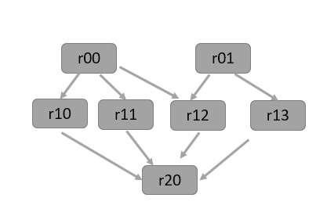{width=72%}

::: notes
也可以理解成，当我们连续调用 map、filter、reduceByKey 这类转换时，Spark 先记录“应该怎样计算”，而不是立刻把结果全部算出来。每个新 RDD 都会保留指向父 RDD 的依赖信息，这些依赖关系串起来后，就形成了 DAG，也就是常说的谱系图（lineage graph）。下面通过一个简单例子来观察这张图是如何构成的。
:::

## 11.2.1 依赖关系：图示（2）

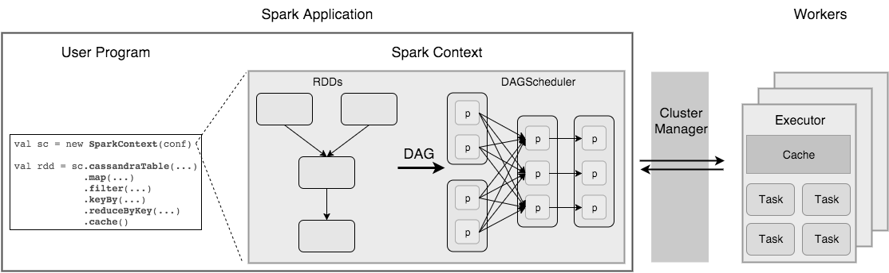{width=72%}

::: notes
从实现视角看，Spark 围绕“分区数据 + 转换依赖 + 失败重算”这三件事组织执行模型。RDD 提供并行数据抽象，DAG 记录转换之间的关系，而调度器则依据这些关系来切分阶段、分发任务并处理失败恢复。
:::

## 11.2.1 依赖关系：图示（3）

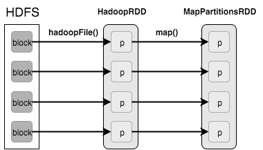{width=72%}

::: notes
代码 11.2 首先在内存中加载HDFS块，然后应用map()过滤出键，创建两个RDD的键。
:::

## 11.2.2 划分阶段（1/2）

- 若一串操作不需要Shuffle或重新分区，它们通常会被合并进同一个阶段
- 更准确地说，是驱动程序与执行器进程在既定资源内持续协作完成一个或多个作业
- 图例 11‑4 阶段划分
- 几乎所有 Spark 工作流都可以抽象成同一条链路：读入数据，经过若干转换，再通过动作得到结果

::: notes
在深入研究细节之前，可以先快速回顾一次执行流程：包含RDD转换的用户代码会先形成DAG，然后由DAG调度器按Shuffle边界切分为若干阶段。之后，这些阶段再被展开为基于分区的任务，由任务调度器提交给集群管理器分发到执行器上执行。执行器运行任务、返回结果，并在需要时把中间数据写入内存或磁盘。

决定 Stage 如何切分的关键，不是转换名字本身，而是这些转换形成的是窄依赖还是宽依赖。
:::

## 11.2.2 划分阶段（2/2）

- 图例 11‑5 两种转换关系
- 父RDD的每个分区被子RDD的最多一个分区使用
- 允许在一个集群节点上进行流水线的执行
- 故障恢复更有效，因为只有丢失的父分区需要重新计算

::: notes
这一页会把 图例 11‑5 两种转换关系、父RDD的每个分区被子RDD的最多一个分区使用 和 允许在一个集群节点上进行流水线的执行 串成一条完整流程。讲的时候重点说明每一步接在前一步后面，分别解决了什么问题。
:::

## 11.2.2 划分阶段：图示（1）

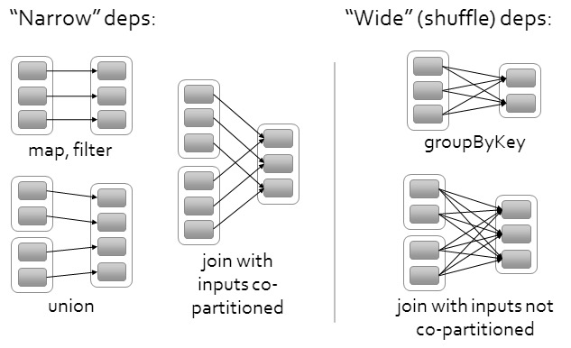{width=72%}

::: notes
几乎所有 Spark 工作流都可以抽象成同一条链路：读入数据，经过若干转换，再通过动作得到结果。决定 Stage 如何切分的关键，不是转换名字本身，而是这些转换形成的是窄依赖还是宽依赖。
:::

## 11.2.2 划分阶段：图示（2）

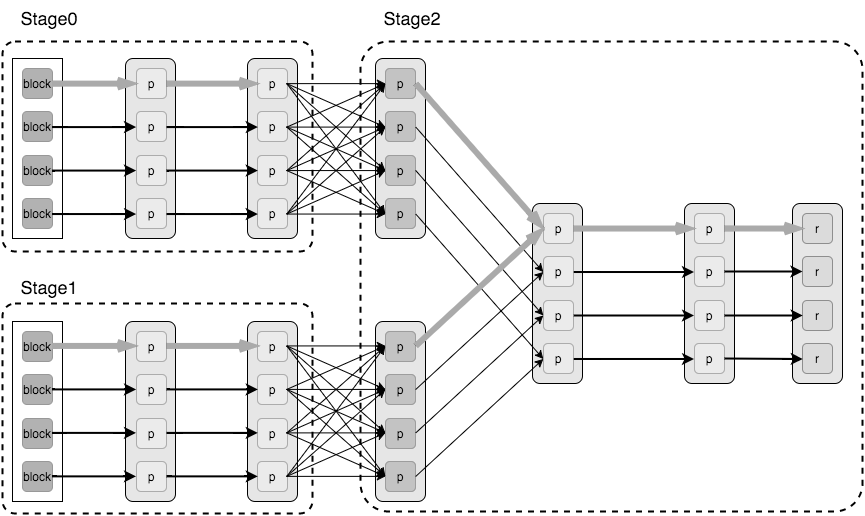{width=72%}

::: notes
对于窄依赖，父 RDD 的每个分区最多只会被下游一个分区使用，因此数据通常可以在本地顺序处理，不需要跨节点重分布，例如 map、flatMap、filter 和 sample。而宽依赖意味着多个下游分区都要读取同一个上游分区的结果，这时就往往需要跨分区重组数据，也就是 Shuffle。
:::

## 11.2.3 实例分析（1/2）

- 可以使用toDebugString打印出这个RDD谱系
- 代码 11.3 第一个RDD file 是通过 sc.textFile
- 这条谱系上的最后一个RDD wordcount 则是由
- Spark调度器会在此基础上生成对应的物理执行计划

::: notes
下面通过字数计数示例了解Spark应用程序的工作原理，可以在Spark交互界面中输入下面所示的代码。示例代码产生了wordcount，其定义了当调用动作时将使用的RDD有向无环图。在RDD上的操作创建新的RDD，它返回到其父母这样就创建一个有向无环图，可以使用toDebugString打印出这个RDD谱系，如下所示。

() 创建的 HadoopRDD。

reduceByKey() 产生的 ShuffledRDD。如图例 11‑7 所示，左侧展示的是 wordcount 对应的逻辑DAG，图中小方块表示各RDD的分区。

当调用 collect 这类动作时，Spark调度器会在此基础上生成对应的物理执行计划（Physical Execution Plan）并把它拆分为可提交的阶段和任务。
:::

## 11.2.3 实例分析（2/2）

- 图例 11‑7 创建一个物理执行计划
- 由于窄依赖通常不需要跨节点重分布数据，因此往往会被合并到同一个阶段里执行
- 一旦出现 reduceByKey 这类引入Shuffle的操作
- 图例 11‑8 通过集群管理器启动任务

::: notes
调度器会根据依赖关系把DAG拆成多个阶段。

就会在此处形成新的阶段。这个例子最终得到两个阶段：前面的 textFile、flatMap、map 属于第一个阶段，生成 ShuffledRDD 及其后续动作则进入第二个阶段。
:::

## 11.2.3 实例分析：代码片段

- 把原始数据从存储读入 Spark
- 用 flatMap 把一条记录展开成多个元素
- 在分组后做聚合计算得到指标结果
- 通过 action 触发前面的惰性计算真正执行

```scala
scala> val file= sc.textFile("/usr/local/spark/README.md").cache()
file: org.apache.spark.rdd.RDD[String] = /root/data/11-0.txt
MapPartitionsRDD[1] at textFile at \<console\>:24
scala> val wordcount = file.flatMap(line => line.split(" ")).map(word
=> (word, 1)).reduceByKey(_ + _)
wordcount: org.apache.spark.rdd.RDD[(String, Int)] = ShuffledRDD[4]
at reduceByKey at \<console\>:26
scala> wordcount.toDebugString
res3: String =
(2) ShuffledRDD[4] at reduceByKey at \<console\>:26 []
+-(2) MapPartitionsRDD[3] at map at \<console\>:26 []
// ...
```

::: notes
这一句是在确定输入边界。讲的时候要说明数据来自哪里、现在进入了什么抽象对象，以及后面的转换是围绕哪个数据集继续推进的。

flatMap 的关键不是做了遍历，而是把一对多的展开放进计算链路。很多词频统计、日志拆词和明细展开都依赖这一步。

这里才真正把多条记录压成业务指标。讲解时要说明聚合函数在累加什么、合并什么，以及最终留下来的结果代表什么含义。

前面的转换大多只是把执行计划串起来，直到这里遇到 action，Spark 才会真正下发任务。这个时点是理解执行模型的关键。
:::

## 11.2.3 实例分析：图示（1）

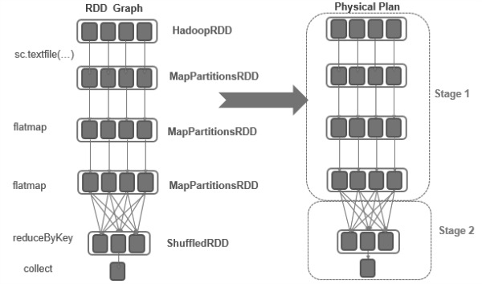{width=72%}

::: notes
代码 11.3 第一个RDD file 是通过 sc.textFile() 创建的 HadoopRDD。这条谱系上的最后一个RDD wordcount 则是由 reduceByKey() 产生的 ShuffledRDD。如图例 11‑7 所示，左侧展示的是 wordcount 对应的逻辑DAG，图中小方块表示各RDD的分区。
:::

## 11.2.3 实例分析：图示（2）

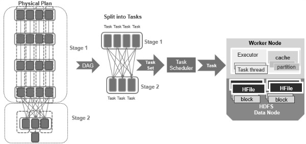{width=72%}

::: notes
调度器会根据依赖关系把DAG拆成多个阶段。由于窄依赖通常不需要跨节点重分布数据，因此往往会被合并到同一个阶段里执行。而一旦出现 reduceByKey 这类引入Shuffle的操作，就会在此处形成新的阶段。
:::

## 11.2.3 实例分析：图示（3）

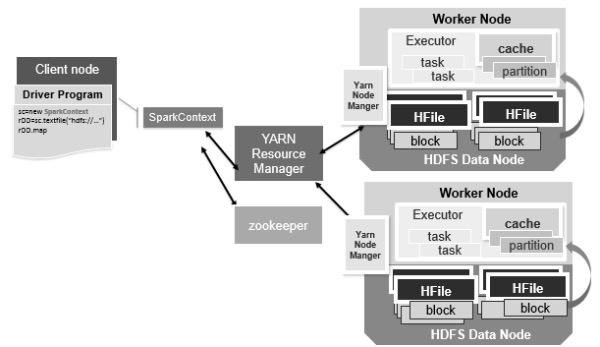{width=72%}

::: notes
每个阶段是由任务组成，其基于RDD的分区，它将并行执行相同的计算，调度程序将任务集提交给任务调度程序，通过集群管理器启动任务，下图显示了示例Hadoop集群中的Spark应用程序。
:::

## 11.2.3 实例分析：图示（4）

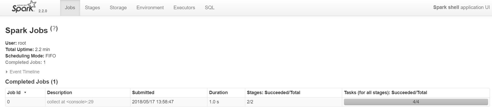{width=72%}

::: notes
然后，可以使用Spark Web界面来查看Spark应用程序的行为和性能，网址为\<http://localhost:4040\>，这是运行单词计数作业后的Web UI的屏幕截图（图例 11‑10）。在Jobs选项卡下，将看到已安排或运行的作业列表，在此示例中是计数的collect作业，Jobs页面显示作业、阶段和任务进度。
:::

## 11.2.3 实例分析：图示（5）

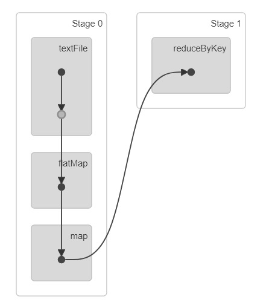{width=72%}

::: notes
可以点击进入到Job 0的详细信息界面，可以看到DAG的行为，可以对照一下上面的分析结果。
:::

## 11.2.3 实例分析：图示（6）

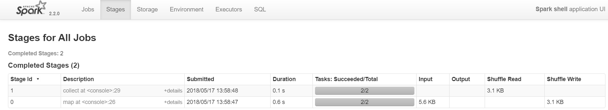{width=72%}

::: notes
在Stages选项卡下，可以看到阶段的详细信息，以下是单词计数作业的阶段页面，Stage0以阶段管道中的最后一个RDD转换命名，并且Stage 1以动作collect命名。
:::

## 11.2.3 实例分析：图示（7）

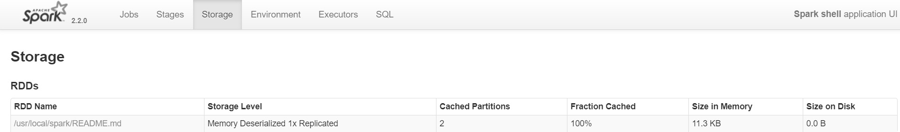{width=72%}

::: notes
这一页围绕 实例分析：图示（7） 展开，讲解时按原文把定义、条件和结论顺着说明白。
:::

## 11.2.3 实例分析：图示（8）

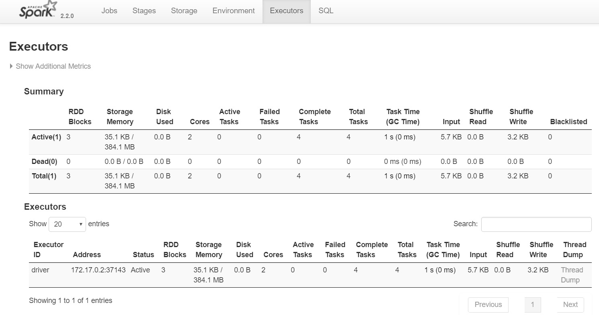{width=72%}

::: notes
这张图展示的是 实例分析：图示（8）。讲解时先指出图里最值得看的结构、趋势或对比项，再说明它和正文结论是怎么对应上的。
:::

