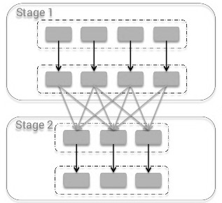

<!-- generated by doc-to-ppt-talk-track -->

## 11.3 洗牌机制

- 当上游计算结果需要按照新的键分布重新汇集
- 图例 11‑15 洗牌阶段是介于Map阶段和Reduce阶段之间
- 一旦需要重新分布这些数据，就会发生洗牌
- 另一个常见性能问题是数据倾斜，也就是某些键、某些分区明显比其他分区承载更多数据

::: notes
可以把洗牌（Shuffle）理解为一次“跨分区重组数据”的过程。当上游计算结果需要按照新的键分布重新汇集，例如 reduceByKey、groupByKey、join、repartition 这类操作出现时，Spark 就必须把部分数据从一个执行器传输到另一个执行器。 接下来重点看 洗牌机制，先把这一节要处理的对象和关键步骤放稳。
:::

## 11.3 洗牌机制（1/2）

- 当上游计算结果需要按照新的键分布重新汇集
- 图例 11‑15 洗牌阶段是介于Map阶段和Reduce阶段之间
- 一旦需要重新分布这些数据，就会发生洗牌
- 另一个常见性能问题是数据倾斜，也就是某些键、某些分区明显比其他分区承载更多数据

::: notes
可以把洗牌（Shuffle）理解为一次“跨分区重组数据”的过程。当上游计算结果需要按照新的键分布重新汇集，例如 reduceByKey、groupByKey、join、repartition 这类操作出现时，Spark 就必须把部分数据从一个执行器传输到另一个执行器。

在分布式系统里，洗牌很难完全避免。原因很简单：数据最初是分散在不同分区、不同节点上的，而某些计算又要求“相同键的数据必须被汇集到一起”。在Spark里，阶段划分本身就与这种依赖关系紧密相关，因此只要作业里存在宽依赖，洗牌通常就是绕不过去的成本。

数据倾斜往往会在洗牌阶段被放大，最终表现为个别任务特别慢、内存压力异常、磁盘溢写增多，甚至拖慢整个Stage。所以，在讨论Spark优化之前，先把Shuffle机制和数据倾斜之间的关系看清楚，通常比直接改参数更有效。
:::

## 11.3 洗牌机制（2/2）

- 图例 11‑16 Shuffle 操作
- 用一个简单例子来理解会更直接
- 这一步就是洗牌
- join 也是同样的道理

::: notes
假设我们有一份电话详单，想统计“每天的通话次数”。如果把日期作为键、每条通话记录记作值 1，那么最终就需要把同一天的所有 1 汇总到一起再求和。问题在于，这些记录最初分散在不同分区、不同执行器上。

要完成聚合，Spark 就必须先把“相同日期”的数据重新搬运到同一组目标分区里，这一步就是洗牌。

假设两个表都要按 id 连接，那么同一个 id 对应的数据必须先被重新分布到一致的分区边界内，后续才能在对应分区上直接完成匹配。否则，一个分区里的记录就不得不去扫描另一个表的许多无关分区，代价会迅速上升。也正因为如此，洗牌既是许多分布式算子的基础能力，也是最容易把网络、磁盘和内存压力同时拉高的环节。
:::

## 11.3 洗牌机制：图示（1）

{width=72%}

::: notes
当上游计算结果需要按照新的键分布重新汇集，例如 reduceByKey、groupByKey、join、repartition 这类操作出现时，Spark 就必须把部分数据从一个执行器传输到另一个执行器。由于这个过程通常会伴随网络传输、磁盘读写、序列化与反序列化，所以它往往是性能瓶颈最集中的环节之一。
:::

## 11.3 洗牌机制：图示（2）

{width=72%}

::: notes
另一个常见性能问题是数据倾斜，也就是某些键、某些分区明显比其他分区承载更多数据。数据倾斜往往会在洗牌阶段被放大，最终表现为个别任务特别慢、内存压力异常、磁盘溢写增多，甚至拖慢整个Stage。所以，在讨论Spark优化之前，先把Shuffle机制和数据倾斜之间的关系看清楚，通常比直接改参数更有效。
:::

